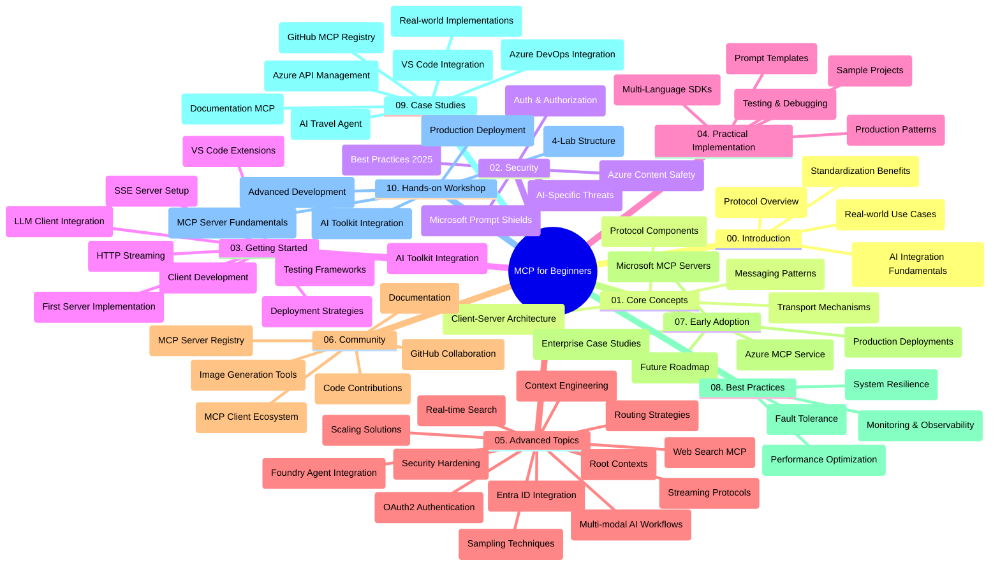

<!--
CO_OP_TRANSLATOR_METADATA:
{
  "original_hash": "719117a0a5f34ade7b5dfb61ee06fb13",
  "translation_date": "2025-09-26T18:42:32+00:00",
  "source_file": "study_guide.md",
  "language_code": "he"
}
-->
# מדריך לימוד - פרוטוקול הקשר מודל (MCP) למתחילים

מדריך לימוד זה מספק סקירה כללית של מבנה המאגר והתוכן עבור תכנית הלימודים "פרוטוקול הקשר מודל (MCP) למתחילים". השתמשו במדריך זה כדי לנווט במאגר ביעילות ולהפיק את המרב מהמשאבים הזמינים.

## סקירה כללית של המאגר

פרוטוקול הקשר מודל (MCP) הוא מסגרת סטנדרטית לאינטראקציות בין מודלים של AI לבין יישומי לקוח. MCP נוצר במקור על ידי Anthropic וכעת מתוחזק על ידי קהילת MCP הרחבה דרך הארגון הרשמי ב-GitHub. מאגר זה מספק תכנית לימודים מקיפה עם דוגמאות קוד מעשיות ב-C#, Java, JavaScript, Python ו-TypeScript, המיועדות למפתחי AI, אדריכלי מערכות ומהנדסי תוכנה.

## מפת תכנית לימודים חזותית

## מבנה המאגר

המאגר מאורגן לעשרה חלקים עיקריים, כל אחד מתמקד בהיבטים שונים של MCP:

1. **מבוא (00-Introduction/)**
   - סקירה כללית של פרוטוקול הקשר מודל
   - מדוע סטנדרטיזציה חשובה בצינורות AI
   - מקרי שימוש מעשיים ויתרונות

2. **מושגים מרכזיים (01-CoreConcepts/)**
   - ארכיטקטורת לקוח-שרת
   - רכיבי פרוטוקול מרכזיים
   - דפוסי מסרים ב-MCP

3. **אבטחה (02-Security/)**
   - איומי אבטחה במערכות מבוססות MCP
   - שיטות עבודה מומלצות לאבטחת יישומים
   - אסטרטגיות אימות והרשאה
   - **תיעוד אבטחה מקיף**:
     - שיטות עבודה מומלצות לאבטחת MCP 2025
     - מדריך יישום אבטחת תוכן Azure
     - בקרות וטכניקות אבטחה MCP
     - מדריך מהיר לשיטות עבודה מומלצות MCP
   - **נושאי אבטחה מרכזיים**:
     - התקפות הזרקת הנחיות והרעלת כלים
     - חטיפת סשן ובעיות סגן מבולבל
     - חולשות העברת אסימונים
     - הרשאות יתר ובקרת גישה
     - אבטחת שרשרת אספקה עבור רכיבי AI
     - שילוב Microsoft Prompt Shields

4. **התחלה (03-GettingStarted/)**
   - הגדרת סביבה וקונפיגורציה
   - יצירת שרתי ולקוחות MCP בסיסיים
   - שילוב עם יישומים קיימים
   - כולל חלקים עבור:
     - יישום שרת ראשון
     - פיתוח לקוח
     - שילוב לקוח LLM
     - שילוב VS Code
     - שרת Server-Sent Events (SSE)
     - סטרימינג HTTP
     - שילוב AI Toolkit
     - אסטרטגיות בדיקה
     - הנחיות לפריסה

5. **יישום מעשי (04-PracticalImplementation/)**
   - שימוש ב-SDKs בשפות תכנות שונות
   - טכניקות דיבוג, בדיקה ואימות
   - יצירת תבניות הנחיה ותהליכי עבודה לשימוש חוזר
   - פרויקטים לדוגמה עם דוגמאות יישום

6. **נושאים מתקדמים (05-AdvancedTopics/)**
   - טכניקות הנדסת הקשר
   - שילוב סוכני Foundry
   - תהליכי עבודה AI רב-מודליים
   - הדגמות אימות OAuth2
   - יכולות חיפוש בזמן אמת
   - סטרימינג בזמן אמת
   - יישום הקשרים שורשיים
   - אסטרטגיות ניתוב
   - טכניקות דגימה
   - גישות סקיילינג
   - שיקולי אבטחה
   - שילוב אבטחת Entra ID
   - שילוב חיפוש באינטרנט

7. **תרומות קהילה (06-CommunityContributions/)**
   - כיצד לתרום קוד ותיעוד
   - שיתוף פעולה דרך GitHub
   - שיפורים ומשוב מונעי קהילה
   - שימוש בלקוחות MCP שונים (Claude Desktop, Cline, VSCode)
   - עבודה עם שרתי MCP פופולריים כולל יצירת תמונות

8. **לקחים מאימוץ מוקדם (07-LessonsfromEarlyAdoption/)**
   - יישומים בעולם האמיתי וסיפורי הצלחה
   - בנייה ופריסה של פתרונות מבוססי MCP
   - מגמות ומפת דרכים עתידית
   - **מדריך שרתי MCP של Microsoft**: מדריך מקיף ל-10 שרתי MCP מוכנים לייצור של Microsoft כולל:
     - שרת MCP של Microsoft Learn Docs
     - שרת MCP של Azure (15+ מחברים מתמחים)
     - שרת MCP של GitHub
     - שרת MCP של Azure DevOps
     - שרת MCP של MarkItDown
     - שרת MCP של SQL Server
     - שרת MCP של Playwright
     - שרת MCP של Dev Box
     - שרת MCP של Azure AI Foundry
     - שרת MCP של Microsoft 365 Agents Toolkit

9. **שיטות עבודה מומלצות (08-BestPractices/)**
   - כוונון ביצועים ואופטימיזציה
   - תכנון מערכות MCP עמידות לתקלות
   - אסטרטגיות בדיקה ועמידות

10. **מחקרי מקרה (09-CaseStudy/)**
    - **שבעה מחקרי מקרה מקיפים** המדגימים את גמישות MCP בתרחישים מגוונים:
    - **סוכני נסיעות AI של Azure**: תזמור רב-סוכנים עם Azure OpenAI וחיפוש AI
    - **שילוב Azure DevOps**: אוטומציה של תהליכי עבודה עם עדכוני נתוני YouTube
    - **שליפת תיעוד בזמן אמת**: לקוח קונסול Python עם סטרימינג HTTP
    - **מחולל תכנית לימוד אינטראקטיבי**: אפליקציית רשת Chainlit עם AI שיחתי
    - **תיעוד בתוך העורך**: שילוב VS Code עם תהליכי עבודה של GitHub Copilot
    - **ניהול API של Azure**: שילוב API ארגוני עם יצירת שרת MCP
    - **רישום MCP של GitHub**: פיתוח אקוסיסטם ופלטפורמת שילוב סוכנים
    - דוגמאות יישום הכוללות שילוב ארגוני, פרודוקטיביות מפתחים ופיתוח אקוסיסטם

11. **סדנה מעשית (10-StreamliningAIWorkflowsBuildingAnMCPServerWithAIToolkit/)**
    - סדנה מעשית מקיפה המשלבת MCP עם AI Toolkit
    - בניית יישומים חכמים המגשרים בין מודלי AI לכלים בעולם האמיתי
    - מודולים מעשיים המכסים יסודות, פיתוח שרת מותאם אישית ואסטרטגיות פריסה לייצור
    - **מבנה מעבדה**:
      - מעבדה 1: יסודות שרת MCP
      - מעבדה 2: פיתוח שרת MCP מתקדם
      - מעבדה 3: שילוב AI Toolkit
      - מעבדה 4: פריסה לייצור וסקיילינג
    - גישת לימוד מבוססת מעבדה עם הוראות שלב אחר שלב

## משאבים נוספים

המאגר כולל משאבים תומכים:

- **תיקיית תמונות**: מכילה דיאגרמות ואיורים המשמשים לאורך תכנית הלימודים
- **תרגומים**: תמיכה רב-שפתית עם תרגומים אוטומטיים של תיעוד
- **משאבים רשמיים של MCP**:
  - [תיעוד MCP](https://modelcontextprotocol.io/)
  - [מפרט MCP](https://spec.modelcontextprotocol.io/)
  - [מאגר GitHub של MCP](https://github.com/modelcontextprotocol)

## כיצד להשתמש במאגר זה

1. **למידה רציפה**: עקבו אחר הפרקים לפי הסדר (00 עד 10) לחוויית לימוד מובנית.
2. **מיקוד לפי שפה**: אם אתם מעוניינים בשפת תכנות מסוימת, חקרו את תיקיות הדוגמאות עבור יישומים בשפה המועדפת עליכם.
3. **יישום מעשי**: התחילו עם החלק "התחלה" כדי להגדיר את הסביבה שלכם וליצור את שרת ולקוח MCP הראשונים שלכם.
4. **חקירה מתקדמת**: לאחר שתהיו נוחים עם היסודות, צללו לנושאים המתקדמים להרחבת הידע שלכם.
5. **מעורבות קהילתית**: הצטרפו לקהילת MCP דרך דיונים ב-GitHub וערוצי Discord כדי להתחבר למומחים ולמפתחים אחרים.

## לקוחות וכלי MCP

תכנית הלימודים מכסה מגוון לקוחות וכלי MCP:

1. **לקוחות רשמיים**:
   - Visual Studio Code
   - MCP ב-Visual Studio Code
   - Claude Desktop
   - Claude ב-VSCode
   - Claude API

2. **לקוחות קהילתיים**:
   - Cline (מבוסס טרמינל)
   - Cursor (עורך קוד)
   - ChatMCP
   - Windsurf

3. **כלי ניהול MCP**:
   - MCP CLI
   - MCP Manager
   - MCP Linker
   - MCP Router

## שרתי MCP פופולריים

המאגר מציג מגוון שרתי MCP, כולל:

1. **שרתי MCP רשמיים של Microsoft**:
   - שרת MCP של Microsoft Learn Docs
   - שרת MCP של Azure (15+ מחברים מתמחים)
   - שרת MCP של GitHub
   - שרת MCP של Azure DevOps
   - שרת MCP של MarkItDown
   - שרת MCP של SQL Server
   - שרת MCP של Playwright
   - שרת MCP של Dev Box
   - שרת MCP של Azure AI Foundry
   - שרת MCP של Microsoft 365 Agents Toolkit

2. **שרתי ייחוס רשמיים**:
   - Filesystem
   - Fetch
   - Memory
   - Sequential Thinking

3. **יצירת תמונות**:
   - Azure OpenAI DALL-E 3
   - Stable Diffusion WebUI
   - Replicate

4. **כלי פיתוח**:
   - Git MCP
   - Terminal Control
   - Code Assistant

5. **שרתי מתמחים**:
   - Salesforce
   - Microsoft Teams
   - Jira & Confluence

## תרומה

מאגר זה מקבל בברכה תרומות מהקהילה. ראו את החלק תרומות קהילה להנחיות כיצד לתרום בצורה יעילה לאקוסיסטם MCP.

## יומן שינויים

| תאריך | שינויים |
|------|---------|
| 26 בספטמבר 2025 | - נוסף מחקר מקרה רישום MCP של GitHub לחלק 09-CaseStudy - עודכן מחקרי מקרה לשקף שבעה מחקרי מקרה מקיפים - שופרו תיאורי מחקרי מקרה עם פרטי יישום ספציפיים - עודכן מפת תכנית לימודים חזותית לכלול רישום MCP של GitHub - מבנה מדריך לימוד עודכן לשקף מיקוד פיתוח אקוסיסטם |
| 18 ביולי 2025 | - מבנה מאגר עודכן לכלול מדריך שרתי MCP של Microsoft - נוסף רשימה מקיפה של 10 שרתי MCP מוכנים לייצור של Microsoft - שופרה חלק שרתי MCP פופולריים עם שרתי MCP רשמיים של Microsoft - חלק מחקרי מקרה עודכן עם דוגמאות קבצים אמיתיות - נוסף פרטי מבנה מעבדה לסדנה מעשית |
| 16 ביולי 2025 | - מבנה מאגר עודכן לשקף תוכן נוכחי - נוסף חלק לקוחות וכלי MCP - נוסף חלק שרתי MCP פופולריים - עודכן מפת תכנית לימודים חזותית עם כל הנושאים הנוכחיים - שופרה חלק נושאים מתקדמים עם כל התחומים המתמחים - חלק מחקרי מקרה עודכן לשקף דוגמאות אמיתיות - הובהר מקור MCP כיצירה של Anthropic |
| 11 ביוני 2025 | - יצירה ראשונית של מדריך הלימוד - נוסף מפת תכנית לימודים חזותית - מבנה מאגר מתואר - פרויקטים לדוגמה ומשאבים נוספים נכללו |

---

*מדריך לימוד זה עודכן ב-26 בספטמבר 2025 ומספק סקירה כללית של המאגר נכון לתאריך זה. תוכן המאגר עשוי להתעדכן לאחר תאריך זה.*

---

