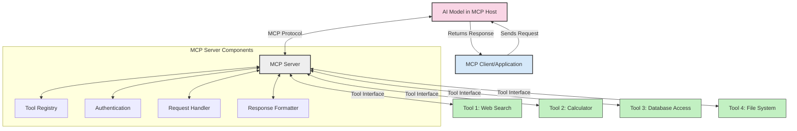
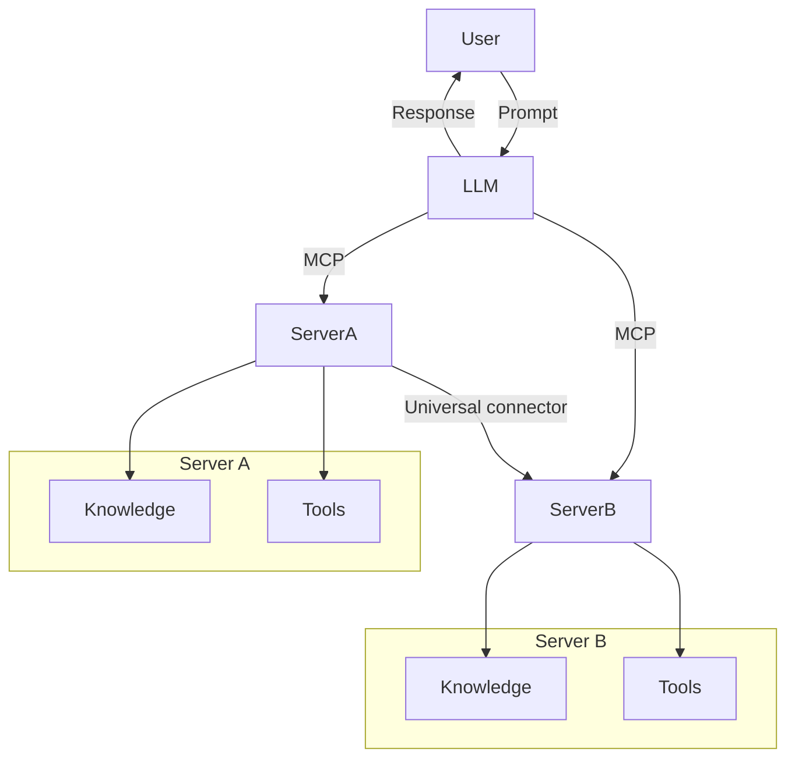

<!--
CO_OP_TRANSLATOR_METADATA:
{
  "original_hash": "02301140adbd807ecf0f17720fa307bc",
  "translation_date": "2025-05-17T05:55:49+00:00",
  "source_file": "00-Introduction/README.md",
  "language_code": "hi"
}
-->
# मॉडल संदर्भ प्रोटोकॉल (MCP) का परिचय: स्केलेबल एआई अनुप्रयोगों के लिए इसका महत्व

जनरेटिव एआई अनुप्रयोग एक बड़ा कदम आगे हैं क्योंकि वे अक्सर उपयोगकर्ता को प्राकृतिक भाषा संकेतों का उपयोग करके ऐप के साथ इंटरैक्ट करने देते हैं। हालांकि, जैसे-जैसे अधिक समय और संसाधनों का निवेश इन ऐप्स में होता है, आप सुनिश्चित करना चाहते हैं कि आप कार्यक्षमताओं और संसाधनों को इस तरह से आसानी से एकीकृत कर सकें कि इसे विस्तारित करना आसान हो, कि आपका ऐप एक से अधिक मॉडल का उपयोग कर सके, और इसकी जटिलताएँ। संक्षेप में, जेन एआई ऐप्स बनाना शुरू में आसान है लेकिन जैसे-जैसे यह बढ़ता है और अधिक जटिल होता जाता है, आपको एक आर्किटेक्चर को परिभाषित करना शुरू करना होगा और सबसे अधिक संभावना है कि आपको एक मानक पर निर्भर रहना होगा ताकि आपके ऐप्स को एक सुसंगत तरीके से बनाया जा सके। यहीं पर MCP चीजों को व्यवस्थित करने के लिए आता है, एक मानक प्रदान करता है।

---

## **🔍 मॉडल संदर्भ प्रोटोकॉल (MCP) क्या है?**

**मॉडल संदर्भ प्रोटोकॉल (MCP)** एक **खुला, मानकीकृत इंटरफ़ेस** है जो बड़े भाषा मॉडल (LLMs) को बाहरी उपकरणों, APIs और डेटा स्रोतों के साथ सहजता से इंटरैक्ट करने की अनुमति देता है। यह एक सुसंगत आर्किटेक्चर प्रदान करता है जो एआई मॉडल कार्यक्षमता को उनके प्रशिक्षण डेटा से परे बढ़ाता है, जिससे अधिक स्मार्ट, स्केलेबल और उत्तरदायी एआई सिस्टम सक्षम होते हैं।

---

## **🎯 एआई में मानकीकरण का महत्व क्यों है**

जैसे-जैसे जनरेटिव एआई अनुप्रयोग अधिक जटिल होते जाते हैं, यह सुनिश्चित करने के लिए मानकों को अपनाना आवश्यक है जो **स्केलेबिलिटी, विस्तारशीलता**, और **रखरखाव** सुनिश्चित करते हैं। MCP इन जरूरतों को पूरा करता है:

- मॉडल-टूल एकीकरण को एकीकृत करना
- नाजुक, एक बार के कस्टम समाधान को कम करना
- एक पारिस्थितिकी तंत्र के भीतर कई मॉडलों को सह-अस्तित्व की अनुमति देना

---

## **📚 सीखने के उद्देश्य**

इस लेख के अंत तक, आप सक्षम होंगे:

- **मॉडल संदर्भ प्रोटोकॉल (MCP)** और इसके उपयोग मामलों को परिभाषित करें
- समझें कि MCP मॉडल-टू-टूल संचार को कैसे मानकीकृत करता है
- MCP आर्किटेक्चर के मुख्य घटकों की पहचान करें
- उद्यम और विकास संदर्भों में MCP के वास्तविक-विश्व अनुप्रयोगों का अन्वेषण करें

---

## **💡 मॉडल संदर्भ प्रोटोकॉल (MCP) क्यों गेम-चेंजर है**

### **🔗 MCP एआई इंटरैक्शन में विखंडन को हल करता है**

MCP से पहले, उपकरणों के साथ मॉडलों को एकीकृत करने के लिए आवश्यक था:

- प्रत्येक टूल-मॉडल जोड़ी के लिए कस्टम कोड
- प्रत्येक विक्रेता के लिए गैर-मानक APIs
- अपडेट के कारण बार-बार टूटना
- अधिक उपकरणों के साथ खराब स्केलेबिलिटी

### **✅ MCP मानकीकरण के लाभ**

| **लाभ**                   | **विवरण**                                                                |
|---------------------------|----------------------------------------------------------------------------|
| इंटरऑपरेबिलिटी            | LLMs विभिन्न विक्रेताओं के उपकरणों के साथ सहजता से काम करते हैं           |
| सुसंगतता                  | प्लेटफार्मों और उपकरणों के बीच एक समान व्यवहार                             |
| पुन: प्रयोज्यता           | एक बार बनाए गए उपकरणों का उपयोग परियोजनाओं और सिस्टम में किया जा सकता है    |
| त्वरित विकास              | मानकीकृत, प्लग-एंड-प्ले इंटरफेस का उपयोग करके विकास समय को कम करें        |

---

## **🧱 उच्च-स्तरीय MCP आर्किटेक्चर अवलोकन**

MCP एक **क्लाइंट-सर्वर मॉडल** का अनुसरण करता है, जहाँ:

- **MCP होस्ट्स** एआई मॉडलों को चलाते हैं
- **MCP क्लाइंट्स** अनुरोध शुरू करते हैं
- **MCP सर्वर्स** संदर्भ, उपकरण और क्षमताओं की सेवा करते हैं

### **मुख्य घटक:**

- **संसाधन** – मॉडलों के लिए स्थिर या गतिशील डेटा  
- **प्रॉम्प्ट्स** – निर्देशित जनरेशन के लिए पूर्वनिर्धारित कार्यप्रवाह  
- **उपकरण** – खोज, गणना जैसी निष्पादनीय कार्य  
- **सैंपलिंग** – पुनरावर्ती इंटरैक्शन के माध्यम से एजेंटिक व्यवहार

---

## MCP सर्वर्स कैसे काम करते हैं

MCP सर्वर्स निम्नलिखित तरीके से संचालित होते हैं:

- **अनुरोध प्रवाह**: 
    1. MCP क्लाइंट MCP होस्ट में चल रहे एआई मॉडल को अनुरोध भेजता है।
    2. एआई मॉडल पहचानता है कि कब उसे बाहरी उपकरणों या डेटा की आवश्यकता होती है।
    3. मॉडल मानकीकृत प्रोटोकॉल का उपयोग करके MCP सर्वर के साथ संवाद करता है।

- **MCP सर्वर कार्यक्षमता**:
    - टूल रजिस्ट्रि: उपलब्ध उपकरणों और उनकी क्षमताओं की सूची बनाए रखता है।
    - प्रमाणीकरण: टूल एक्सेस के लिए अनुमतियों की पुष्टि करता है।
    - अनुरोध हैंडलर: मॉडल से आने वाले टूल अनुरोधों को संसाधित करता है।
    - प्रतिक्रिया फ़ॉर्मेटर: टूल आउटपुट को एक स्वरूप में संरचित करता है जिसे मॉडल समझ सकता है।

- **टूल निष्पादन**: 
    - सर्वर अनुरोधों को उचित बाहरी उपकरणों तक पहुँचाता है
    - उपकरण अपने विशेष कार्यों को निष्पादित करते हैं (खोज, गणना, डेटाबेस क्वेरी, आदि)
    - परिणाम मॉडल को एक सुसंगत प्रारूप में वापस किया जाता है।

- **प्रतिक्रिया पूर्णता**: 
    - एआई मॉडल अपनी प्रतिक्रिया में टूल आउटपुट को शामिल करता है।
    - अंतिम प्रतिक्रिया क्लाइंट एप्लिकेशन को वापस भेजी जाती है।

## 👨‍💻 MCP सर्वर कैसे बनाएं (उदाहरणों के साथ)

MCP सर्वर्स आपको डेटा और कार्यक्षमता प्रदान करके LLM क्षमताओं का विस्तार करने की अनुमति देते हैं। 

इसे आज़माने के लिए तैयार हैं? विभिन्न भाषाओं में एक सरल MCP सर्वर बनाने के उदाहरण यहां दिए गए हैं:

- **Python Example**: https://github.com/modelcontextprotocol/python-sdk

- **TypeScript Example**: https://github.com/modelcontextprotocol/typescript-sdk

- **Java Example**: https://github.com/modelcontextprotocol/java-sdk

- **C#/.NET Example**: https://github.com/modelcontextprotocol/csharp-sdk

## 🌍 MCP के वास्तविक-विश्व उपयोग के मामले

MCP एआई क्षमताओं का विस्तार करके अनुप्रयोगों की एक विस्तृत श्रृंखला को सक्षम करता है:

| **अनुप्रयोग**                | **विवरण**                                                                |
|------------------------------|----------------------------------------------------------------------------|
| उद्यम डेटा एकीकरण          | LLMs को डेटाबेस, CRM, या आंतरिक उपकरणों से कनेक्ट करें                      |
| एजेंटिक एआई सिस्टम           | उपकरण एक्सेस और निर्णय लेने के कार्यप्रवाह के साथ स्वायत्त एजेंट सक्षम करें   |
| मल्टी-मोडल अनुप्रयोग        | एकल एकीकृत एआई ऐप के भीतर टेक्स्ट, इमेज, और ऑडियो उपकरणों को मिलाएं        |
| वास्तविक-समय डेटा एकीकरण    | अधिक सटीक, वर्तमान आउटपुट के लिए एआई इंटरैक्शन में लाइव डेटा लाएं           |

### 🧠 MCP = एआई इंटरैक्शन के लिए सार्वभौमिक मानक

मॉडल संदर्भ प्रोटोकॉल (MCP) एआई इंटरैक्शन के लिए एक सार्वभौमिक मानक के रूप में कार्य करता है, जैसे USB-C ने उपकरणों के लिए भौतिक कनेक्शन को मानकीकृत किया। एआई की दुनिया में, MCP एक सुसंगत इंटरफ़ेस प्रदान करता है, जिससे मॉडल (क्लाइंट्स) बाहरी उपकरणों और डेटा प्रदाताओं (सर्वर्स) के साथ सहजता से एकीकृत होते हैं। यह प्रत्येक API या डेटा स्रोत के लिए विविध, कस्टम प्रोटोकॉल की आवश्यकता को समाप्त करता है।

MCP के तहत, एक MCP-संगत टूल (जिसे MCP सर्वर कहा जाता है) एक एकीकृत मानक का पालन करता है। ये सर्वर उन उपकरणों या कार्यों को सूचीबद्ध कर सकते हैं जो वे पेश करते हैं और जब एआई एजेंट द्वारा अनुरोध किया जाता है तो उन कार्यों को निष्पादित करते हैं। MCP का समर्थन करने वाले एआई एजेंट प्लेटफॉर्म सर्वर्स से उपलब्ध उपकरणों की खोज करने और इस मानक प्रोटोकॉल के माध्यम से उन्हें बुलाने में सक्षम होते हैं।

### 💡 ज्ञान तक पहुंच की सुविधा

उपकरणों की पेशकश के अलावा, MCP ज्ञान तक पहुंच की सुविधा भी प्रदान करता है। यह अनुप्रयोगों को विभिन्न डेटा स्रोतों से लिंक करके बड़े भाषा मॉडलों (LLMs) को संदर्भ प्रदान करने में सक्षम बनाता है। उदाहरण के लिए, एक MCP सर्वर एक कंपनी के दस्तावेज़ रिपॉजिटरी का प्रतिनिधित्व कर सकता है, जिससे एजेंटों को मांग पर प्रासंगिक जानकारी प्राप्त करने की अनुमति मिलती है। एक अन्य सर्वर ईमेल भेजने या रिकॉर्ड अपडेट करने जैसे विशिष्ट कार्यों को संभाल सकता है। एजेंट के दृष्टिकोण से, ये केवल उपकरण हैं जिनका वह उपयोग कर सकता है—कुछ उपकरण डेटा (ज्ञान संदर्भ) लौटाते हैं, जबकि अन्य कार्य करते हैं। MCP दोनों को कुशलता से प्रबंधित करता है।

एक MCP सर्वर से जुड़ने वाला एजेंट एक मानक प्रारूप के माध्यम से सर्वर की उपलब्ध क्षमताओं और सुलभ डेटा को स्वचालित रूप से सीखता है। यह मानकीकरण गतिशील उपकरण उपलब्धता को सक्षम बनाता है। उदाहरण के लिए, एक एजेंट के सिस्टम में एक नया MCP सर्वर जोड़ने से इसके कार्य तुरंत उपयोगी हो जाते हैं बिना एजेंट के निर्देशों को आगे अनुकूलित करने की आवश्यकता के।

यह सुव्यवस्थित एकीकरण मेरमेड डायग्राम में चित्रित प्रवाह के साथ मेल खाता है, जहां सर्वर उपकरण और ज्ञान दोनों प्रदान करते हैं, सिस्टमों के बीच सहज सहयोग सुनिश्चित करते हैं।

### 👉 उदाहरण: स्केलेबल एजेंट समाधान

## 🔐 MCP के व्यावहारिक लाभ

MCP का उपयोग करने के कुछ व्यावहारिक लाभ यहाँ हैं:

- **ताजगी**: मॉडल अपने प्रशिक्षण डेटा से परे अद्यतन जानकारी तक पहुँच सकते हैं
- **क्षमता विस्तार**: मॉडल उन कार्यों के लिए विशेष उपकरणों का लाभ उठा सकते हैं जिनके लिए उन्हें प्रशिक्षित नहीं किया गया था
- **कम भ्रम**: बाहरी डेटा स्रोत तथ्यात्मक आधार प्रदान करते हैं
- **गोपनीयता**: संवेदनशील डेटा को सुरक्षित वातावरण में रखा जा सकता है बजाय इसके कि इसे प्रॉम्प्ट्स में एम्बेड किया जाए

## 📌 प्रमुख निष्कर्ष

MCP का उपयोग करने के लिए निम्नलिखित प्रमुख निष्कर्ष हैं:

- **MCP** मानकीकृत करता है कि एआई मॉडल उपकरणों और डेटा के साथ कैसे इंटरैक्ट करते हैं
- **विस्तारशीलता, सुसंगतता, और इंटरऑपरेबिलिटी** को बढ़ावा देता है
- MCP **विकास समय को कम करने, विश्वसनीयता में सुधार करने, और मॉडल क्षमताओं का विस्तार करने** में मदद करता है
- क्लाइंट-सर्वर आर्किटेक्चर **लचीले, विस्तारशील एआई अनुप्रयोगों को सक्षम बनाता है**

## 🧠 अभ्यास

उस एआई एप्लिकेशन के बारे में सोचें जिसे आप बनाना चाहते हैं।

- कौन से **बाहरी उपकरण या डेटा** इसकी क्षमताओं को बढ़ा सकते हैं?
- MCP एकीकरण को **सरल और अधिक विश्वसनीय** कैसे बना सकता है?

## अतिरिक्त संसाधन

- [MCP GitHub Repository](https://github.com/modelcontextprotocol)

## आगे क्या है

अगला: [अध्याय 1: मुख्य अवधारणाएँ](/01-CoreConcepts/README.md)

**अस्वीकरण**:  
यह दस्तावेज़ AI अनुवाद सेवा [Co-op Translator](https://github.com/Azure/co-op-translator) का उपयोग करके अनुवादित किया गया है। जबकि हम सटीकता के लिए प्रयासरत हैं, कृपया ध्यान दें कि स्वचालित अनुवाद में त्रुटियाँ या अशुद्धियाँ हो सकती हैं। मूल भाषा में मूल दस्तावेज़ को प्रामाणिक स्रोत माना जाना चाहिए। महत्वपूर्ण जानकारी के लिए, पेशेवर मानव अनुवाद की सिफारिश की जाती है। इस अनुवाद के उपयोग से उत्पन्न किसी भी गलतफहमी या गलत व्याख्या के लिए हम जिम्मेदार नहीं हैं।