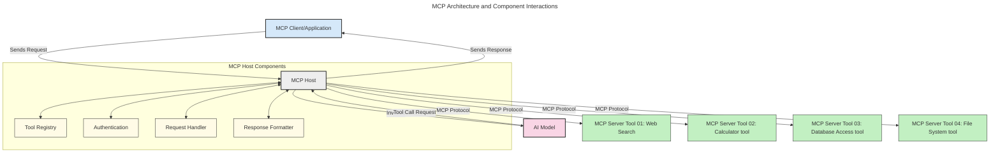
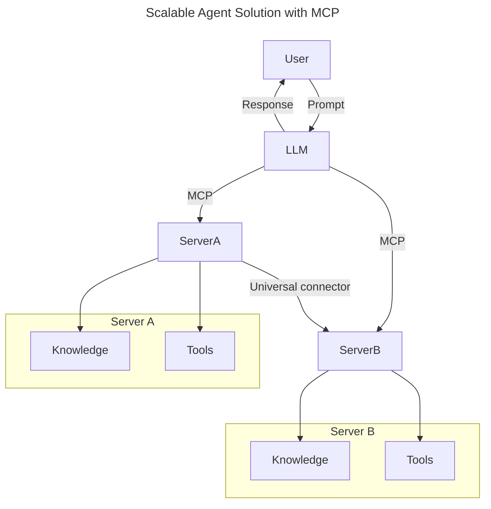
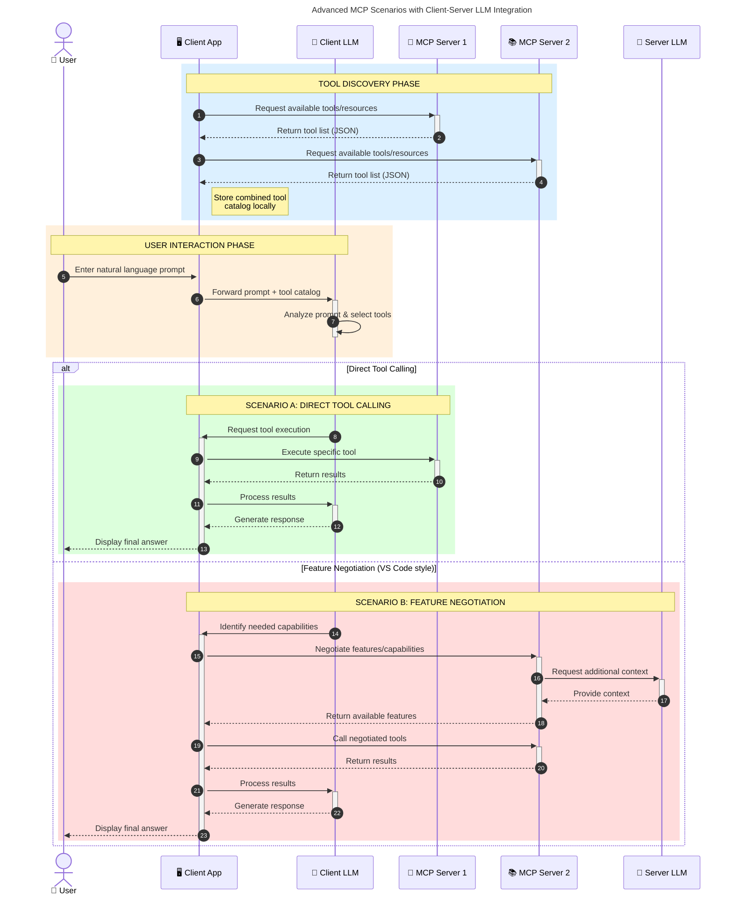

<!--
CO_OP_TRANSLATOR_METADATA:
{
  "original_hash": "0df1ee78a6dd8300f3a040ca5b411c2e",
  "translation_date": "2025-08-12T08:19:54+00:00",
  "source_file": "00-Introduction/README.md",
  "language_code": "hi"
}
-->
# मॉडल कॉन्टेक्स्ट प्रोटोकॉल (MCP) का परिचय: स्केलेबल AI एप्लिकेशन के लिए इसका महत्व

_(ऊपर दी गई छवि पर क्लिक करें इस पाठ का वीडियो देखने के लिए)_

जनरेटिव AI एप्लिकेशन एक बड़ी प्रगति हैं क्योंकि वे अक्सर उपयोगकर्ता को प्राकृतिक भाषा प्रॉम्प्ट्स के माध्यम से ऐप के साथ इंटरैक्ट करने की अनुमति देते हैं। हालांकि, जैसे-जैसे इन ऐप्स में अधिक समय और संसाधन निवेश किए जाते हैं, आप यह सुनिश्चित करना चाहेंगे कि आप कार्यक्षमताओं और संसाधनों को इस तरह से आसानी से एकीकृत कर सकें कि इसे बढ़ाना आसान हो, आपका ऐप एक से अधिक मॉडल का उपयोग कर सके, और विभिन्न मॉडल की जटिलताओं को संभाल सके। संक्षेप में, जनरेटिव AI ऐप्स बनाना शुरू में आसान है, लेकिन जैसे-जैसे वे बढ़ते हैं और अधिक जटिल होते जाते हैं, आपको एक आर्किटेक्चर को परिभाषित करना शुरू करना होगा और संभवतः एक मानक पर निर्भर रहना होगा ताकि आपके ऐप्स एक सुसंगत तरीके से बनाए जा सकें। यही वह जगह है जहां MCP चीजों को व्यवस्थित करने और एक मानक प्रदान करने में मदद करता है।

---

## **🔍 मॉडल कॉन्टेक्स्ट प्रोटोकॉल (MCP) क्या है?**

**मॉडल कॉन्टेक्स्ट प्रोटोकॉल (MCP)** एक **खुला, मानकीकृत इंटरफ़ेस** है जो बड़े भाषा मॉडल (LLMs) को बाहरी टूल्स, APIs, और डेटा स्रोतों के साथ सहजता से इंटरैक्ट करने की अनुमति देता है। यह एक सुसंगत आर्किटेक्चर प्रदान करता है जो AI मॉडल की कार्यक्षमता को उनके प्रशिक्षण डेटा से परे बढ़ाता है, जिससे अधिक स्मार्ट, स्केलेबल, और उत्तरदायी AI सिस्टम बनते हैं।

---

## **🎯 AI में मानकीकरण क्यों महत्वपूर्ण है**

जैसे-जैसे जनरेटिव AI एप्लिकेशन अधिक जटिल होते जाते हैं, यह सुनिश्चित करने के लिए मानकों को अपनाना आवश्यक है कि वे **स्केलेबल, एक्स्टेंसिबल, मेंटेन करने योग्य** हों और **वेंडर लॉक-इन से बचें।** MCP इन आवश्यकताओं को निम्नलिखित तरीकों से पूरा करता है:

- मॉडल-टूल इंटीग्रेशन को एकीकृत करना  
- कमजोर, एक-बार उपयोग वाले कस्टम समाधानों को कम करना  
- विभिन्न वेंडर्स के कई मॉडलों को एक ही इकोसिस्टम में सह-अस्तित्व की अनुमति देना  

**नोट:** जबकि MCP खुद को एक खुले मानक के रूप में प्रस्तुत करता है, इसे IEEE, IETF, W3C, ISO, या किसी अन्य मानक निकाय के माध्यम से मानकीकृत करने की कोई योजना नहीं है।

---

## **📚 सीखने के उद्देश्य**

इस लेख के अंत तक, आप:

- **मॉडल कॉन्टेक्स्ट प्रोटोकॉल (MCP)** और इसके उपयोग मामलों को परिभाषित कर सकेंगे  
- समझ सकेंगे कि MCP मॉडल-टूल संचार को कैसे मानकीकृत करता है  
- MCP आर्किटेक्चर के मुख्य घटकों की पहचान कर सकेंगे  
- एंटरप्राइज और डेवलपमेंट संदर्भों में MCP के वास्तविक-world अनुप्रयोगों का पता लगा सकेंगे  

---

## **💡 मॉडल कॉन्टेक्स्ट प्रोटोकॉल (MCP) क्यों गेम-चेंजर है**

### **🔗 MCP AI इंटरैक्शन में विखंडन को हल करता है**

MCP से पहले, टूल्स के साथ मॉडल को इंटीग्रेट करने के लिए:

- प्रत्येक टूल-मॉडल जोड़ी के लिए कस्टम कोड  
- प्रत्येक वेंडर के लिए गैर-मानक APIs  
- अपडेट के कारण बार-बार टूटने की समस्या  
- अधिक टूल्स के साथ खराब स्केलेबिलिटी  

### **✅ MCP मानकीकरण के लाभ**

| **लाभ**                  | **विवरण**                                                                      |
|--------------------------|--------------------------------------------------------------------------------|
| इंटरऑपरेबिलिटी          | LLMs विभिन्न वेंडर्स के टूल्स के साथ सहजता से काम करते हैं                     |
| सुसंगतता                 | प्लेटफॉर्म और टूल्स में एक समान व्यवहार                                       |
| पुन: उपयोग               | एक बार बनाए गए टूल्स को विभिन्न प्रोजेक्ट्स और सिस्टम्स में उपयोग किया जा सकता है |
| तेज़ विकास               | मानकीकृत, प्लग-एंड-प्ले इंटरफेस का उपयोग करके विकास समय को कम करें            |

---

## **🧱 MCP आर्किटेक्चर का उच्च-स्तरीय अवलोकन**

MCP **क्लाइंट-सर्वर मॉडल** का अनुसरण करता है, जहां:

- **MCP होस्ट्स** AI मॉडल्स को चलाते हैं  
- **MCP क्लाइंट्स** अनुरोध शुरू करते हैं  
- **MCP सर्वर्स** संदर्भ, टूल्स, और क्षमताएं प्रदान करते हैं  

### **मुख्य घटक:**

- **संसाधन** – मॉडल्स के लिए स्थिर या गतिशील डेटा  
- **प्रॉम्प्ट्स** – निर्देशित जनरेशन के लिए पूर्वनिर्धारित वर्कफ़्लो  
- **टूल्स** – खोज, गणना जैसे निष्पादन योग्य कार्य  
- **सैंपलिंग** – पुनरावृत्त इंटरैक्शन के माध्यम से एजेंटिक व्यवहार  

---

## MCP सर्वर्स कैसे काम करते हैं

MCP सर्वर्स निम्नलिखित तरीके से काम करते हैं:

- **अनुरोध प्रवाह**:
    1. एक अनुरोध अंतिम उपयोगकर्ता या उनके behalf पर कार्य करने वाले सॉफ़्टवेयर द्वारा शुरू किया जाता है।  
    2. **MCP क्लाइंट** अनुरोध को **MCP होस्ट** को भेजता है, जो AI मॉडल रनटाइम को प्रबंधित करता है।  
    3. **AI मॉडल** उपयोगकर्ता प्रॉम्प्ट प्राप्त करता है और एक या अधिक टूल कॉल्स के माध्यम से बाहरी टूल्स या डेटा तक पहुंच का अनुरोध कर सकता है।  
    4. **MCP होस्ट**, सीधे मॉडल नहीं, मानकीकृत प्रोटोकॉल का उपयोग करके उपयुक्त **MCP सर्वर(s)** के साथ संचार करता है।  
- **MCP होस्ट कार्यक्षमता**:
    - **टूल रजिस्ट्री**: उपलब्ध टूल्स और उनकी क्षमताओं की सूची बनाए रखता है।  
    - **प्रमाणीकरण**: टूल एक्सेस के लिए अनुमतियों को सत्यापित करता है।  
    - **अनुरोध हैंडलर**: मॉडल से आने वाले टूल अनुरोधों को संसाधित करता है।  
    - **प्रतिक्रिया स्वरूपक**: टूल आउटपुट को उस प्रारूप में संरचित करता है जिसे मॉडल समझ सकता है।  
- **MCP सर्वर निष्पादन**:
    - **MCP होस्ट** टूल कॉल्स को एक या अधिक **MCP सर्वर्स** को रूट करता है, जो विशेष कार्यों (जैसे, खोज, गणना, डेटाबेस क्वेरी) को उजागर करते हैं।  
    - **MCP सर्वर्स** अपने-अपने ऑपरेशन्स को निष्पादित करते हैं और **MCP होस्ट** को एक सुसंगत प्रारूप में परिणाम लौटाते हैं।  
    - **MCP होस्ट** इन परिणामों को प्रारूपित करता है और उन्हें **AI मॉडल** तक पहुंचाता है।  
- **प्रतिक्रिया पूर्णता**:
    - **AI मॉडल** टूल आउटपुट को अंतिम प्रतिक्रिया में शामिल करता है।  
    - **MCP होस्ट** इस प्रतिक्रिया को **MCP क्लाइंट** को भेजता है, जो इसे अंतिम उपयोगकर्ता या कॉलिंग सॉफ़्टवेयर तक पहुंचाता है।  

## 👨‍💻 MCP सर्वर कैसे बनाएं (उदाहरणों के साथ)

MCP सर्वर्स LLM क्षमताओं को डेटा और कार्यक्षमता प्रदान करके बढ़ाने की अनुमति देते हैं। 

इसे आज़माने के लिए तैयार हैं? यहां विभिन्न भाषाओं/स्टैक्स में सरल MCP सर्वर्स बनाने के उदाहरणों के साथ भाषा और/या स्टैक विशिष्ट SDKs दिए गए हैं:

- **Python SDK**: https://github.com/modelcontextprotocol/python-sdk  
- **TypeScript SDK**: https://github.com/modelcontextprotocol/typescript-sdk  
- **Java SDK**: https://github.com/modelcontextprotocol/java-sdk  
- **C#/.NET SDK**: https://github.com/modelcontextprotocol/csharp-sdk  

---

## 🌍 MCP के वास्तविक-world उपयोग के मामले

MCP AI क्षमताओं को बढ़ाकर कई प्रकार के अनुप्रयोगों को सक्षम बनाता है:

| **अनुप्रयोग**                  | **विवरण**                                                                      |
|------------------------------|--------------------------------------------------------------------------------|
| एंटरप्राइज डेटा इंटीग्रेशन  | LLMs को डेटाबेस, CRMs, या आंतरिक टूल्स से कनेक्ट करें                          |
| एजेंटिक AI सिस्टम्स          | टूल एक्सेस और निर्णय लेने वाले वर्कफ़्लो के साथ स्वायत्त एजेंट सक्षम करें       |
| मल्टी-मोडल एप्लिकेशन         | एकल AI ऐप में टेक्स्ट, इमेज, और ऑडियो टूल्स को संयोजित करें                   |
| रियल-टाइम डेटा इंटीग्रेशन    | AI इंटरैक्शन में लाइव डेटा लाएं ताकि अधिक सटीक और वर्तमान आउटपुट मिल सके       |

### 🧠 MCP = AI इंटरैक्शन के लिए यूनिवर्सल मानक

मॉडल कॉन्टेक्स्ट प्रोटोकॉल (MCP) AI इंटरैक्शन के लिए एक यूनिवर्सल मानक के रूप में कार्य करता है, जैसे USB-C ने डिवाइस कनेक्शन के लिए भौतिक मानकों को मानकीकृत किया। AI की दुनिया में, MCP एक सुसंगत इंटरफ़ेस प्रदान करता है, जिससे मॉडल (क्लाइंट्स) बाहरी टूल्स और डेटा प्रदाताओं (सर्वर्स) के साथ सहजता से इंटीग्रेट कर सकते हैं। यह प्रत्येक API या डेटा स्रोत के लिए विविध, कस्टम प्रोटोकॉल की आवश्यकता को समाप्त करता है।

MCP के तहत, एक MCP-संगत टूल (जिसे MCP सर्वर कहा जाता है) एकीकृत मानक का पालन करता है। ये सर्वर्स उन टूल्स या क्रियाओं को सूचीबद्ध कर सकते हैं जो वे प्रदान करते हैं और AI एजेंट द्वारा अनुरोध किए जाने पर उन क्रियाओं को निष्पादित कर सकते हैं। MCP का समर्थन करने वाले AI एजेंट प्लेटफॉर्म सर्वर्स से उपलब्ध टूल्स की खोज करने और इस मानक प्रोटोकॉल के माध्यम से उन्हें लागू करने में सक्षम होते हैं।

### 💡 ज्ञान तक पहुंच को सक्षम बनाता है

टूल्स की पेशकश के अलावा, MCP ज्ञान तक पहुंच को भी सक्षम बनाता है। यह एप्लिकेशन को बड़े भाषा मॉडल्स (LLMs) को विभिन्न डेटा स्रोतों से जोड़कर संदर्भ प्रदान करने की अनुमति देता है। उदाहरण के लिए, एक MCP सर्वर किसी कंपनी के दस्तावेज़ रिपॉजिटरी का प्रतिनिधित्व कर सकता है, जिससे एजेंट्स को मांग पर प्रासंगिक जानकारी प्राप्त करने की अनुमति मिलती है। एक अन्य सर्वर विशिष्ट क्रियाओं जैसे ईमेल भेजने या रिकॉर्ड अपडेट करने को संभाल सकता है। एजेंट के दृष्टिकोण से, ये केवल टूल्स हैं जिनका वह उपयोग कर सकता है—कुछ टूल्स डेटा (ज्ञान संदर्भ) लौटाते हैं, जबकि अन्य क्रियाएं करते हैं। MCP दोनों को कुशलतापूर्वक प्रबंधित करता है।

एक MCP सर्वर से कनेक्ट होने वाला एजेंट एक मानक प्रारूप के माध्यम से सर्वर की उपलब्ध क्षमताओं और सुलभ डेटा को स्वचालित रूप से सीखता है। यह मानकीकरण गतिशील टूल उपलब्धता को सक्षम बनाता है। उदाहरण के लिए, एजेंट के सिस्टम में एक नया MCP सर्वर जोड़ने से उसकी कार्यक्षमताएं तुरंत उपयोग करने योग्य हो जाती हैं, बिना एजेंट के निर्देशों को और अधिक अनुकूलित करने की आवश्यकता के।

यह सुव्यवस्थित इंटीग्रेशन निम्नलिखित डायग्राम में दिखाए गए प्रवाह के साथ मेल खाता है, जहां सर्वर्स टूल्स और ज्ञान दोनों प्रदान करते हैं, जिससे सिस्टम्स के बीच सहज सहयोग सुनिश्चित होता है।

### 👉 उदाहरण: स्केलेबल एजेंट समाधान

### 🔄 क्लाइंट-साइड LLM इंटीग्रेशन के साथ उन्नत MCP परिदृश्य

मूल MCP आर्किटेक्चर से परे, ऐसे उन्नत परिदृश्य हैं जहां क्लाइंट और सर्वर दोनों में LLMs होते हैं, जिससे अधिक परिष्कृत इंटरैक्शन सक्षम होते हैं। निम्नलिखित डायग्राम में, **क्लाइंट ऐप** एक IDE हो सकता है जिसमें उपयोगकर्ता के लिए LLM द्वारा उपलब्ध MCP टूल्स की संख्या हो:

---

## 🔐 MCP के व्यावहारिक लाभ

MCP का उपयोग करने के व्यावहारिक लाभ निम्नलिखित हैं:

- **ताजगी**: मॉडल्स अपने प्रशिक्षण डेटा से परे अद्यतन जानकारी तक पहुंच सकते हैं  
- **क्षमता विस्तार**: मॉडल्स उन कार्यों के लिए विशेष टूल्स का उपयोग कर सकते हैं जिनके लिए उन्हें प्रशिक्षित नहीं किया गया था  
- **हैलुसिनेशन में कमी**: बाहरी डेटा स्रोत तथ्यात्मक आधार प्रदान करते हैं  
- **गोपनीयता**: संवेदनशील डेटा सुरक्षित वातावरण में रह सकता है, बजाय इसके कि इसे प्रॉम्प्ट्स में एम्बेड किया जाए  

---

## 📌 मुख्य बातें

MCP का उपयोग करने के लिए निम्नलिखित मुख्य बातें हैं:

- **MCP** मानकीकृत करता है कि AI मॉडल्स टूल्स और डेटा के साथ कैसे इंटरैक्ट करते हैं  
- **एक्स्टेंसिबिलिटी, सुसंगतता, और इंटरऑपरेबिलिटी** को बढ़ावा देता है  
- MCP **विकास समय को कम करने, विश्वसनीयता में सुधार करने, और मॉडल क्षमताओं को बढ़ाने** में मदद करता है  
- क्लाइंट-सर्वर आर्किटेक्चर **लचीले, एक्स्टेंसिबल AI एप्लिकेशन** को सक्षम बनाता है  

---

## 🧠 अभ्यास

ऐसे AI एप्लिकेशन के बारे में सोचें जिसे आप बनाना चाहते हैं।

- कौन से **बाहरी टूल्स या डेटा** इसकी क्षमताओं को बढ़ा सकते हैं?  
- MCP इंटीग्रेशन को **सरल और अधिक विश्वसनीय** कैसे बना सकता है?  

---

## अतिरिक्त संसाधन

- [MCP GitHub रिपॉजिटरी](https://github.com/modelcontextprotocol)

---

## आगे क्या है

अगला: [अध्याय 1: मुख्य अवधारणाएं](../01-CoreConcepts/README.md)

**अस्वीकरण**:  
यह दस्तावेज़ AI अनुवाद सेवा [Co-op Translator](https://github.com/Azure/co-op-translator) का उपयोग करके अनुवादित किया गया है। जबकि हम सटीकता सुनिश्चित करने का प्रयास करते हैं, कृपया ध्यान दें कि स्वचालित अनुवाद में त्रुटियां या अशुद्धियां हो सकती हैं। मूल भाषा में उपलब्ध मूल दस्तावेज़ को प्रामाणिक स्रोत माना जाना चाहिए। महत्वपूर्ण जानकारी के लिए, पेशेवर मानव अनुवाद की सिफारिश की जाती है। इस अनुवाद के उपयोग से उत्पन्न किसी भी गलतफहमी या गलत व्याख्या के लिए हम उत्तरदायी नहीं हैं।