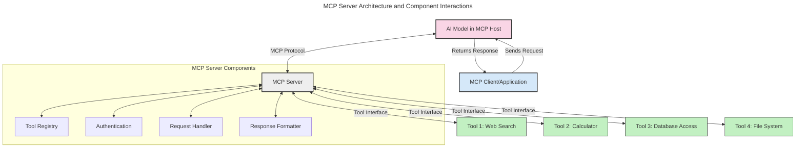
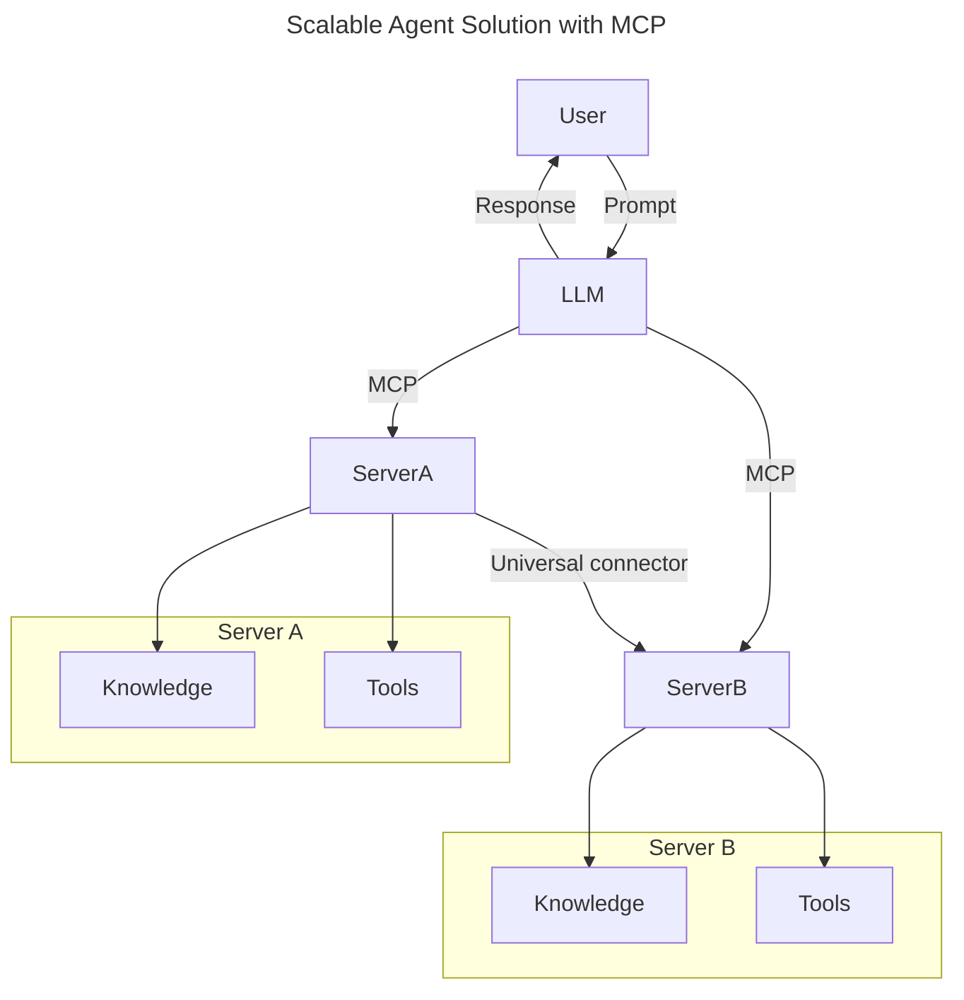
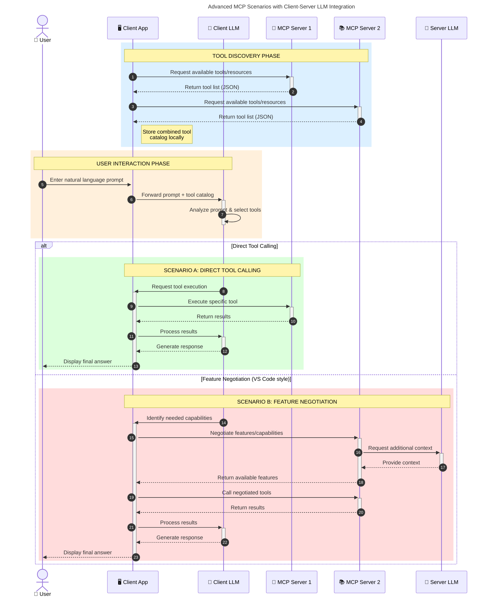

<!--
CO_OP_TRANSLATOR_METADATA:
{
  "original_hash": "1446979020432f512c883848d7eca144",
  "translation_date": "2025-05-29T21:44:17+00:00",
  "source_file": "00-Introduction/README.md",
  "language_code": "hi"
}
-->
# मॉडल कॉन्टेक्स्ट प्रोटोकॉल (MCP) का परिचय: स्केलेबल AI एप्लिकेशन के लिए इसका महत्व

जनरेटिव AI एप्लिकेशन एक बड़ा कदम हैं क्योंकि ये अक्सर उपयोगकर्ता को प्राकृतिक भाषा संकेतों के माध्यम से ऐप के साथ बातचीत करने देते हैं। हालांकि, जैसे-जैसे इन ऐप्स में अधिक समय और संसाधन निवेश होते हैं, आप यह सुनिश्चित करना चाहते हैं कि आप कार्यक्षमताओं और संसाधनों को इस तरह से आसानी से एकीकृत कर सकें कि इसे बढ़ाना आसान हो, आपका ऐप एक से अधिक मॉडल के उपयोग को संभाल सके, और विभिन्न मॉडल जटिलताओं को मैनेज कर सके। संक्षेप में, जनरेटिव AI ऐप बनाना शुरू में आसान है, लेकिन जैसे-जैसे वे बढ़ते और जटिल होते जाते हैं, आपको एक आर्किटेक्चर परिभाषित करना शुरू करना होगा और संभवतः एक मानक पर निर्भर होना होगा ताकि आपके ऐप्स एक सुसंगत तरीके से बनाए जाएं। यहीं MCP काम आता है जो चीजों को व्यवस्थित करता है और एक मानक प्रदान करता है।

---

## **🔍 मॉडल कॉन्टेक्स्ट प्रोटोकॉल (MCP) क्या है?**

**मॉडल कॉन्टेक्स्ट प्रोटोकॉल (MCP)** एक **खुला, मानकीकृत इंटरफ़ेस** है जो बड़े भाषा मॉडल (LLMs) को बाहरी टूल्स, APIs, और डेटा स्रोतों के साथ सहजता से इंटरैक्ट करने की अनुमति देता है। यह AI मॉडल की कार्यक्षमता को उनके प्रशिक्षण डेटा से परे बढ़ाने के लिए एक सुसंगत आर्किटेक्चर प्रदान करता है, जिससे अधिक स्मार्ट, स्केलेबल, और प्रतिक्रियाशील AI सिस्टम बनते हैं।

---

## **🎯 AI में मानकीकरण क्यों महत्वपूर्ण है**

जैसे-जैसे जनरेटिव AI एप्लिकेशन अधिक जटिल होते जाते हैं, यह आवश्यक हो जाता है कि ऐसे मानक अपनाए जाएं जो **स्केलेबिलिटी, एक्स्टेंसिबिलिटी**, और **मेंटेनबिलिटी** सुनिश्चित करें। MCP इन जरूरतों को इस प्रकार पूरा करता है:

- मॉडल-टूल इंटीग्रेशन को एकीकृत करना
- कमजोर, एक-बार के कस्टम समाधानों को कम करना
- एक ही इकोसिस्टम में कई मॉडलों को सह-अस्तित्व की अनुमति देना

---

## **📚 सीखने के उद्देश्य**

इस लेख के अंत तक, आप सक्षम होंगे:

- **मॉडल कॉन्टेक्स्ट प्रोटोकॉल (MCP)** को परिभाषित करना और इसके उपयोग के मामले समझना
- समझना कि MCP मॉडल-से-टूल संचार को कैसे मानकीकृत करता है
- MCP आर्किटेक्चर के मुख्य घटकों की पहचान करना
- एंटरप्राइज और विकास संदर्भों में MCP के वास्तविक उपयोगों का पता लगाना

---

## **💡 मॉडल कॉन्टेक्स्ट प्रोटोकॉल (MCP) क्यों गेम-चेंजर है**

### **🔗 MCP AI इंटरैक्शन में टुकड़ों को जोड़ता है**

MCP से पहले, मॉडल को टूल्स के साथ जोड़ने के लिए:

- हर टूल-मॉडल जोड़ी के लिए कस्टम कोड लिखना पड़ता था
- हर विक्रेता के लिए गैर-मानकीकृत APIs होते थे
- अपडेट्स के कारण बार-बार टूटने की समस्या रहती थी
- अधिक टूल्स के साथ स्केलेबिलिटी खराब होती थी

### **✅ MCP मानकीकरण के फायदे**

| **फायदा**                 | **विवरण**                                                                     |
|---------------------------|-------------------------------------------------------------------------------|
| इंटरऑपरेबिलिटी           | LLMs विभिन्न विक्रेताओं के टूल्स के साथ सहजता से काम करते हैं                |
| स्थिरता                   | प्लेटफॉर्म और टूल्स में समान व्यवहार सुनिश्चित करता है                      |
| पुन: उपयोगिता            | एक बार बनाए गए टूल्स को कई प्रोजेक्ट्स और सिस्टम्स में उपयोग किया जा सकता है |
| तेज़ विकास                | मानकीकृत, प्लग-एंड-प्ले इंटरफेस का उपयोग करके विकास समय कम होता है          |

---

## **🧱 उच्च स्तरीय MCP आर्किटेक्चर का अवलोकन**

MCP एक **क्लाइंट-सर्वर मॉडल** का पालन करता है, जहाँ:

- **MCP होस्ट** AI मॉडल चलाते हैं
- **MCP क्लाइंट** अनुरोध शुरू करते हैं
- **MCP सर्वर** कॉन्टेक्स्ट, टूल्स, और क्षमताएं प्रदान करते हैं

### **मुख्य घटक:**

- **Resources** – मॉडल के लिए स्थैतिक या गतिशील डेटा  
- **Prompts** – निर्देशित जनरेशन के लिए पूर्वनिर्धारित वर्कफ़्लो  
- **Tools** – खोज, गणना जैसे निष्पादित करने योग्य फ़ंक्शन  
- **Sampling** – पुनरावृत्त इंटरैक्शन के माध्यम से एजेंटिक व्यवहार

---

## MCP सर्वर कैसे काम करते हैं

MCP सर्वर निम्नलिखित तरीके से काम करते हैं:

- **अनुरोध प्रवाह**:  
    1. MCP क्लाइंट MCP होस्ट में चल रहे AI मॉडल को अनुरोध भेजता है।  
    2. AI मॉडल पहचानता है कि उसे बाहरी टूल्स या डेटा की आवश्यकता है।  
    3. मॉडल मानकीकृत प्रोटोकॉल का उपयोग करके MCP सर्वर से संवाद करता है।  

- **MCP सर्वर की कार्यक्षमता**:  
    - टूल रजिस्ट्री: उपलब्ध टूल्स और उनकी क्षमताओं का कैटलॉग रखता है।  
    - प्रमाणीकरण: टूल एक्सेस के लिए अनुमति सत्यापित करता है।  
    - अनुरोध हैंडलर: मॉडल से आने वाले टूल अनुरोधों को प्रोसेस करता है।  
    - प्रतिक्रिया फॉर्मेटर: टूल आउटपुट को मॉडल के समझने योग्य फॉर्मेट में संरचित करता है।  

- **टूल निष्पादन**:  
    - सर्वर अनुरोधों को उपयुक्त बाहरी टूल्स तक रूट करता है  
    - टूल्स अपने विशेष कार्य (खोज, गणना, डेटाबेस क्वेरी आदि) करते हैं  
    - परिणाम मॉडल को सुसंगत फॉर्मेट में वापस भेजे जाते हैं  

- **प्रतिक्रिया पूर्णता**:  
    - AI मॉडल टूल आउटपुट को अपनी प्रतिक्रिया में शामिल करता है  
    - अंतिम प्रतिक्रिया क्लाइंट एप्लिकेशन को भेजी जाती है  

## 👨‍💻 MCP सर्वर कैसे बनाएं (उदाहरण के साथ)

MCP सर्वर LLM क्षमताओं को डेटा और कार्यक्षमता प्रदान करके बढ़ाने की अनुमति देते हैं।

इसे आज़माने के लिए तैयार हैं? यहां विभिन्न भाषाओं में एक सरल MCP सर्वर बनाने के उदाहरण हैं:

- **Python उदाहरण**: https://github.com/modelcontextprotocol/python-sdk

- **TypeScript उदाहरण**: https://github.com/modelcontextprotocol/typescript-sdk

- **Java उदाहरण**: https://github.com/modelcontextprotocol/java-sdk

- **C#/.NET उदाहरण**: https://github.com/modelcontextprotocol/csharp-sdk

## 🌍 MCP के वास्तविक उपयोग के मामले

MCP AI क्षमताओं को बढ़ाकर विभिन्न प्रकार के अनुप्रयोगों को सक्षम बनाता है:

| **अनुप्रयोग**              | **विवरण**                                                                    |
|----------------------------|------------------------------------------------------------------------------|
| एंटरप्राइज डेटा इंटीग्रेशन | LLMs को डेटाबेस, CRM, या आंतरिक टूल्स से जोड़ना                              |
| एजेंटिक AI सिस्टम्स         | टूल एक्सेस और निर्णय लेने वाले वर्कफ़्लो के साथ स्वायत्त एजेंट सक्षम करना       |
| मल्टी-मोडल एप्लिकेशन       | एक एकीकृत AI ऐप में टेक्स्ट, इमेज, और ऑडियो टूल्स को संयोजित करना            |
| रियल-टाइम डेटा इंटीग्रेशन   | AI इंटरैक्शन में लाइव डेटा लाना ताकि आउटपुट अधिक सटीक और वर्तमान हो           |

### 🧠 MCP = AI इंटरैक्शन के लिए सार्वभौमिक मानक

मॉडल कॉन्टेक्स्ट प्रोटोकॉल (MCP) AI इंटरैक्शन के लिए एक सार्वभौमिक मानक के रूप में कार्य करता है, ठीक वैसे ही जैसे USB-C ने डिवाइसों के लिए भौतिक कनेक्शनों को मानकीकृत किया। AI की दुनिया में, MCP एक सुसंगत इंटरफ़ेस प्रदान करता है, जिससे मॉडल (क्लाइंट) बाहरी टूल्स और डेटा प्रदाताओं (सर्वर) के साथ सहजता से जुड़ सकते हैं। इससे प्रत्येक API या डेटा स्रोत के लिए अलग-अलग, कस्टम प्रोटोकॉल की आवश्यकता समाप्त हो जाती है।

MCP के तहत, एक MCP-संगत टूल (जिसे MCP सर्वर कहा जाता है) एक एकीकृत मानक का पालन करता है। ये सर्वर उपलब्ध टूल्स या क्रियाओं की सूची बना सकते हैं और जब AI एजेंट अनुरोध करता है तो उन क्रियाओं को निष्पादित करते हैं। MCP समर्थित AI एजेंट प्लेटफ़ॉर्म सर्वरों से उपलब्ध टूल्स खोजने और इस मानक प्रोटोकॉल के माध्यम से उन्हें कॉल करने में सक्षम होते हैं।

### 💡 ज्ञान तक पहुंच को आसान बनाना

टूल्स प्रदान करने के अलावा, MCP ज्ञान तक पहुंच को भी सरल बनाता है। यह एप्लिकेशन को LLMs को विभिन्न डेटा स्रोतों से जोड़कर संदर्भ प्रदान करने की अनुमति देता है। उदाहरण के लिए, एक MCP सर्वर किसी कंपनी के दस्तावेज़ भंडार का प्रतिनिधित्व कर सकता है, जिससे एजेंट मांग पर संबंधित जानकारी प्राप्त कर सकते हैं। एक अन्य सर्वर विशिष्ट क्रियाओं जैसे ईमेल भेजना या रिकॉर्ड अपडेट करना संभाल सकता है। एजेंट के दृष्टिकोण से, ये केवल टूल्स हैं जिनका वह उपयोग कर सकता है—कुछ टूल्स डेटा (ज्ञान संदर्भ) लौटाते हैं, जबकि अन्य क्रियाएं करते हैं। MCP दोनों को प्रभावी ढंग से प्रबंधित करता है।

एक एजेंट जो MCP सर्वर से जुड़ता है, वह सर्वर की उपलब्ध क्षमताओं और सुलभ डेटा को मानक फॉर्मेट के माध्यम से स्वतः सीखता है। यह मानकीकरण गतिशील टूल उपलब्धता को सक्षम बनाता है। उदाहरण के लिए, एजेंट की प्रणाली में नया MCP सर्वर जोड़ना उसकी कार्यक्षमताओं को तुरंत उपयोग योग्य बना देता है बिना एजेंट के निर्देशों में अतिरिक्त अनुकूलन के।

यह सुव्यवस्थित एकीकरण उस प्रवाह के अनुरूप है जो मर्मेड आरेख में दर्शाया गया है, जहाँ सर्वर टूल्स और ज्ञान दोनों प्रदान करते हैं, जिससे सिस्टम के बीच सहज सहयोग सुनिश्चित होता है।

### 👉 उदाहरण: स्केलेबल एजेंट समाधान

### 🔄 क्लाइंट-साइड LLM इंटीग्रेशन के साथ उन्नत MCP परिदृश्य

मूल MCP आर्किटेक्चर से परे, ऐसे उन्नत परिदृश्य हैं जहाँ दोनों क्लाइंट और सर्वर में LLM होते हैं, जो और भी परिष्कृत इंटरैक्शन को सक्षम बनाते हैं:

## 🔐 MCP के व्यावहारिक लाभ

MCP उपयोग के व्यावहारिक लाभ इस प्रकार हैं:

- **ताजगी**: मॉडल अपने प्रशिक्षण डेटा से परे ताजा जानकारी तक पहुंच सकते हैं  
- **क्षमता विस्तार**: मॉडल उन कार्यों के लिए विशिष्ट टूल्स का उपयोग कर सकते हैं जिनके लिए वे प्रशिक्षित नहीं थे  
- **गलत धारणाओं में कमी**: बाहरी डेटा स्रोत तथ्यों की पुष्टि करते हैं  
- **गोपनीयता**: संवेदनशील डेटा सुरक्षित वातावरण में रह सकता है, प्रम्प्ट में एम्बेड किए बिना  

## 📌 मुख्य निष्कर्ष

MCP उपयोग के लिए मुख्य निष्कर्ष:

- **MCP** AI मॉडल के टूल्स और डेटा के साथ इंटरैक्शन को मानकीकृत करता है  
- **विस्तारशीलता, स्थिरता, और इंटरऑपरेबिलिटी** को बढ़ावा देता है  
- MCP विकास समय कम करने, विश्वसनीयता बढ़ाने, और मॉडल क्षमताओं का विस्तार करने में मदद करता है  
- क्लाइंट-सर्वर आर्किटेक्चर लचीले, विस्तार योग्य AI एप्लिकेशन सक्षम करता है  

## 🧠 अभ्यास

उस AI एप्लिकेशन के बारे में सोचें जिसे आप बनाना चाहते हैं।

- कौन से **बाहरी टूल्स या डेटा** इसकी क्षमताओं को बढ़ा सकते हैं?  
- MCP इंटीग्रेशन को कैसे **सरल और विश्वसनीय** बना सकता है?  

## अतिरिक्त संसाधन

- [MCP GitHub Repository](https://github.com/modelcontextprotocol)

## आगे क्या

अगला: [Chapter 1: Core Concepts](/01-CoreConcepts/README.md)

**अस्वीकरण**:  
यह दस्तावेज़ AI अनुवाद सेवा [Co-op Translator](https://github.com/Azure/co-op-translator) का उपयोग करके अनुवादित किया गया है। जबकि हम सटीकता के लिए प्रयासरत हैं, कृपया ध्यान दें कि स्वचालित अनुवाद में त्रुटियाँ या गलतियां हो सकती हैं। मूल दस्तावेज़ अपनी मूल भाषा में ही आधिकारिक स्रोत माना जाना चाहिए। महत्वपूर्ण जानकारी के लिए, पेशेवर मानव अनुवाद की सिफारिश की जाती है। इस अनुवाद के उपयोग से उत्पन्न किसी भी गलतफहमी या गलत व्याख्या के लिए हम जिम्मेदार नहीं हैं।