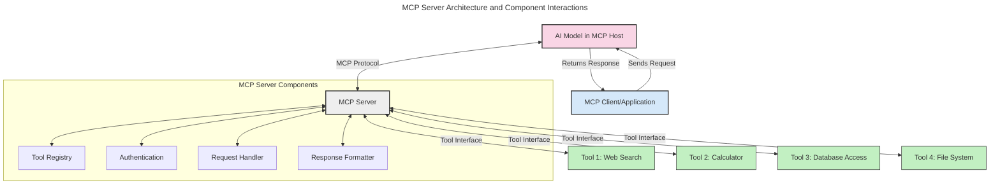
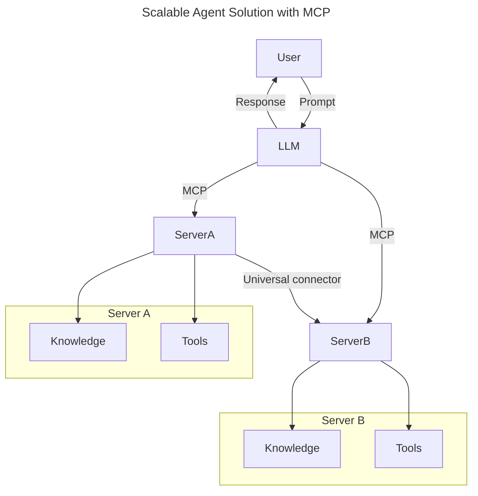
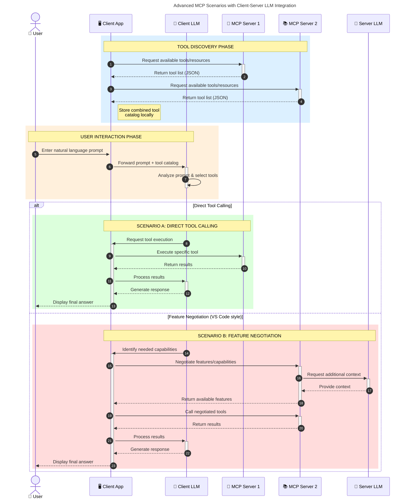

<!--
CO_OP_TRANSLATOR_METADATA:
{
  "original_hash": "105c2ddbb77bc38f7e9df009e1b06e45",
  "translation_date": "2025-07-13T15:29:07+00:00",
  "source_file": "00-Introduction/README.md",
  "language_code": "hi"
}
-->
# मॉडल कॉन्टेक्स्ट प्रोटोकॉल (MCP) का परिचय: स्केलेबल AI एप्लिकेशन के लिए इसका महत्व

जनरेटिव AI एप्लिकेशन एक बड़ा कदम हैं क्योंकि ये अक्सर उपयोगकर्ता को प्राकृतिक भाषा प्रॉम्प्ट के माध्यम से ऐप के साथ इंटरैक्ट करने देते हैं। हालांकि, जैसे-जैसे इन ऐप्स में अधिक समय और संसाधन निवेश होते हैं, आप यह सुनिश्चित करना चाहते हैं कि आप ऐसी सुविधाओं और संसाधनों को आसानी से एकीकृत कर सकें जो विस्तार में आसान हों, आपकी ऐप एक से अधिक मॉडल के उपयोग को संभाल सके, और विभिन्न मॉडल की जटिलताओं को मैनेज कर सके। संक्षेप में, जन AI ऐप बनाना शुरू में आसान होता है, लेकिन जैसे-जैसे वे बढ़ते हैं और जटिल होते हैं, आपको एक आर्किटेक्चर परिभाषित करना शुरू करना होगा और संभवतः एक मानक पर निर्भर रहना होगा ताकि आपकी ऐप्स एक सुसंगत तरीके से बनाई जा सकें। यहीं MCP काम आता है, जो चीजों को व्यवस्थित करता है और एक मानक प्रदान करता है।

---

## **🔍 मॉडल कॉन्टेक्स्ट प्रोटोकॉल (MCP) क्या है?**

**मॉडल कॉन्टेक्स्ट प्रोटोकॉल (MCP)** एक **खुला, मानकीकृत इंटरफ़ेस** है जो बड़े भाषा मॉडल (LLMs) को बाहरी टूल्स, APIs, और डेटा स्रोतों के साथ सहजता से इंटरैक्ट करने की अनुमति देता है। यह AI मॉडल की कार्यक्षमता को उनके प्रशिक्षण डेटा से परे बढ़ाने के लिए एक सुसंगत आर्किटेक्चर प्रदान करता है, जिससे स्मार्ट, स्केलेबल, और अधिक प्रतिक्रियाशील AI सिस्टम बनते हैं।

---

## **🎯 AI में मानकीकरण क्यों महत्वपूर्ण है**

जैसे-जैसे जनरेटिव AI एप्लिकेशन अधिक जटिल होते जा रहे हैं, ऐसे मानकों को अपनाना आवश्यक हो जाता है जो **स्केलेबिलिटी, विस्तारशीलता**, और **रखरखाव** सुनिश्चित करें। MCP इन आवश्यकताओं को पूरा करता है:

- मॉडल-टूल इंटीग्रेशन को एकीकृत करके
- कमजोर, एक-बार के कस्टम समाधान को कम करके
- एक ही इकोसिस्टम में कई मॉडलों को सह-अस्तित्व की अनुमति देकर

---

## **📚 सीखने के उद्देश्य**

इस लेख के अंत तक, आप सक्षम होंगे:

- **मॉडल कॉन्टेक्स्ट प्रोटोकॉल (MCP)** को परिभाषित करना और इसके उपयोग के मामलों को समझना
- समझना कि MCP मॉडल-से-टूल संचार को कैसे मानकीकृत करता है
- MCP आर्किटेक्चर के मुख्य घटकों की पहचान करना
- उद्यम और विकास संदर्भों में MCP के वास्तविक उपयोगों का अन्वेषण करना

---

## **💡 मॉडल कॉन्टेक्स्ट प्रोटोकॉल (MCP) क्यों गेम-चेंजर है**

### **🔗 MCP AI इंटरैक्शन में विखंडन को हल करता है**

MCP से पहले, मॉडल को टूल्स के साथ इंटीग्रेट करने के लिए:

- हर टूल-मॉडल जोड़ी के लिए कस्टम कोड की जरूरत होती थी
- हर विक्रेता के लिए गैर-मानकीकृत API होते थे
- अपडेट्स के कारण बार-बार ब्रेक होते थे
- अधिक टूल्स के साथ स्केलेबिलिटी खराब होती थी

### **✅ MCP मानकीकरण के लाभ**

| **लाभ**                  | **विवरण**                                                                    |
|--------------------------|-------------------------------------------------------------------------------|
| इंटरऑपरेबिलिटी          | LLMs विभिन्न विक्रेताओं के टूल्स के साथ सहजता से काम करते हैं                 |
| सुसंगतता                 | प्लेटफॉर्म और टूल्स में समान व्यवहार                                         |
| पुन: उपयोगिता            | एक बार बनाए गए टूल्स को विभिन्न प्रोजेक्ट्स और सिस्टम में इस्तेमाल किया जा सकता है |
| विकास में तेजी             | मानकीकृत, प्लग-एंड-प्ले इंटरफेस का उपयोग करके विकास समय कम होता है           |

---

## **🧱 उच्च-स्तरीय MCP आर्किटेक्चर अवलोकन**

MCP एक **क्लाइंट-सर्वर मॉडल** का पालन करता है, जहाँ:

- **MCP होस्ट्स** AI मॉडल चलाते हैं
- **MCP क्लाइंट्स** अनुरोध शुरू करते हैं
- **MCP सर्वर** कॉन्टेक्स्ट, टूल्स, और क्षमताएं प्रदान करते हैं

### **मुख्य घटक:**

- **Resources** – मॉडल के लिए स्थैतिक या गतिशील डेटा  
- **Prompts** – मार्गदर्शित जनरेशन के लिए पूर्वनिर्धारित वर्कफ़्लो  
- **Tools** – खोज, गणना जैसे निष्पादित कार्य  
- **Sampling** – पुनरावृत्त इंटरैक्शन के माध्यम से एजेंटिक व्यवहार

---

## MCP सर्वर कैसे काम करते हैं

MCP सर्वर निम्नलिखित तरीके से काम करते हैं:

- **अनुरोध प्रवाह**:  
    1. MCP क्लाइंट AI मॉडल को अनुरोध भेजता है जो MCP होस्ट में चल रहा होता है।  
    2. AI मॉडल पहचानता है कि उसे बाहरी टूल्स या डेटा की आवश्यकता है।  
    3. मॉडल मानकीकृत प्रोटोकॉल का उपयोग करके MCP सर्वर के साथ संवाद करता है।  

- **MCP सर्वर की कार्यक्षमता**:  
    - टूल रजिस्ट्री: उपलब्ध टूल्स और उनकी क्षमताओं का कैटलॉग रखता है।  
    - प्रमाणीकरण: टूल एक्सेस के लिए अनुमतियों की पुष्टि करता है।  
    - अनुरोध हैंडलर: मॉडल से आने वाले टूल अनुरोधों को प्रोसेस करता है।  
    - प्रतिक्रिया फॉर्मेटर: टूल आउटपुट को मॉडल के समझने योग्य प्रारूप में संरचित करता है।  

- **टूल निष्पादन**:  
    - सर्वर अनुरोधों को उपयुक्त बाहरी टूल्स तक पहुंचाता है  
    - टूल्स अपने विशिष्ट कार्य (खोज, गणना, डेटाबेस क्वेरी आदि) करते हैं  
    - परिणाम मॉडल को एक सुसंगत प्रारूप में लौटाए जाते हैं  

- **प्रतिक्रिया पूर्णता**:  
    - AI मॉडल टूल आउटपुट को अपनी प्रतिक्रिया में शामिल करता है  
    - अंतिम प्रतिक्रिया क्लाइंट एप्लिकेशन को भेजी जाती है  

## 👨‍💻 MCP सर्वर कैसे बनाएं (उदाहरण के साथ)

MCP सर्वर आपको LLM क्षमताओं को डेटा और कार्यक्षमता प्रदान करके बढ़ाने की अनुमति देते हैं।

इसे आज़माने के लिए तैयार हैं? यहाँ विभिन्न भाषाओं में एक सरल MCP सर्वर बनाने के उदाहरण हैं:

- **Python उदाहरण**: https://github.com/modelcontextprotocol/python-sdk

- **TypeScript उदाहरण**: https://github.com/modelcontextprotocol/typescript-sdk

- **Java उदाहरण**: https://github.com/modelcontextprotocol/java-sdk

- **C#/.NET उदाहरण**: https://github.com/modelcontextprotocol/csharp-sdk

## 🌍 MCP के वास्तविक उपयोग के मामले

MCP AI क्षमताओं का विस्तार करके कई प्रकार के अनुप्रयोगों को सक्षम बनाता है:

| **एप्लिकेशन**              | **विवरण**                                                                    |
|----------------------------|-------------------------------------------------------------------------------|
| एंटरप्राइज डेटा इंटीग्रेशन | LLMs को डेटाबेस, CRMs, या आंतरिक टूल्स से जोड़ना                             |
| एजेंटिक AI सिस्टम्स        | टूल एक्सेस और निर्णय लेने के वर्कफ़्लो के साथ स्वायत्त एजेंट सक्षम करना       |
| मल्टी-मोडल एप्लिकेशन       | एक एकीकृत AI ऐप में टेक्स्ट, इमेज, और ऑडियो टूल्स को संयोजित करना            |
| रियल-टाइम डेटा इंटीग्रेशन  | AI इंटरैक्शन में लाइव डेटा लाना ताकि अधिक सटीक, वर्तमान आउटपुट मिल सकें       |

### 🧠 MCP = AI इंटरैक्शन के लिए सार्वभौमिक मानक

मॉडल कॉन्टेक्स्ट प्रोटोकॉल (MCP) AI इंटरैक्शन के लिए एक सार्वभौमिक मानक के रूप में कार्य करता है, ठीक वैसे ही जैसे USB-C ने उपकरणों के लिए भौतिक कनेक्शन को मानकीकृत किया। AI की दुनिया में, MCP एक सुसंगत इंटरफ़ेस प्रदान करता है, जिससे मॉडल (क्लाइंट) बाहरी टूल्स और डेटा प्रदाताओं (सर्वर) के साथ सहजता से जुड़ सकते हैं। इससे हर API या डेटा स्रोत के लिए अलग-अलग, कस्टम प्रोटोकॉल की जरूरत खत्म हो जाती है।

MCP के तहत, एक MCP-संगत टूल (जिसे MCP सर्वर कहा जाता है) एक एकीकृत मानक का पालन करता है। ये सर्वर उपलब्ध टूल्स या क्रियाओं की सूची बना सकते हैं और AI एजेंट के अनुरोध पर उन क्रियाओं को निष्पादित करते हैं। MCP समर्थित AI एजेंट प्लेटफॉर्म सर्वरों से उपलब्ध टूल्स की खोज कर सकते हैं और इस मानक प्रोटोकॉल के माध्यम से उन्हें कॉल कर सकते हैं।

### 💡 ज्ञान तक पहुंच को आसान बनाता है

टूल्स प्रदान करने के अलावा, MCP ज्ञान तक पहुंच को भी आसान बनाता है। यह एप्लिकेशन को बड़े भाषा मॉडलों (LLMs) को विभिन्न डेटा स्रोतों से जोड़कर संदर्भ प्रदान करने में सक्षम बनाता है। उदाहरण के लिए, एक MCP सर्वर कंपनी के दस्तावेज़ भंडार का प्रतिनिधित्व कर सकता है, जिससे एजेंट आवश्यक जानकारी मांग पर प्राप्त कर सकते हैं। एक अन्य सर्वर विशिष्ट क्रियाएं जैसे ईमेल भेजना या रिकॉर्ड अपडेट करना संभाल सकता है। एजेंट के दृष्टिकोण से, ये केवल टूल्स हैं जिन्हें वह उपयोग कर सकता है—कुछ टूल्स डेटा (ज्ञान संदर्भ) लौटाते हैं, जबकि अन्य क्रियाएं करते हैं। MCP दोनों को कुशलतापूर्वक प्रबंधित करता है।

एक एजेंट जो MCP सर्वर से जुड़ता है, वह मानक प्रारूप के माध्यम से सर्वर की उपलब्ध क्षमताओं और सुलभ डेटा को स्वचालित रूप से सीखता है। यह मानकीकरण गतिशील टूल उपलब्धता को सक्षम बनाता है। उदाहरण के लिए, एजेंट के सिस्टम में नया MCP सर्वर जोड़ने से उसके कार्य तुरंत उपयोग में आ जाते हैं बिना एजेंट के निर्देशों में अतिरिक्त अनुकूलन के।

यह सुव्यवस्थित एकीकरण उस प्रवाह के अनुरूप है जो मर्मेड डायग्राम में दिखाया गया है, जहाँ सर्वर टूल्स और ज्ञान दोनों प्रदान करते हैं, जिससे सिस्टम के बीच सहज सहयोग सुनिश्चित होता है।

### 👉 उदाहरण: स्केलेबल एजेंट समाधान

### 🔄 क्लाइंट-साइड LLM इंटीग्रेशन के साथ उन्नत MCP परिदृश्य

मूल MCP आर्किटेक्चर से परे, ऐसे उन्नत परिदृश्य हैं जहाँ क्लाइंट और सर्वर दोनों में LLM होते हैं, जो अधिक परिष्कृत इंटरैक्शन सक्षम करते हैं:

## 🔐 MCP के व्यावहारिक लाभ

MCP के उपयोग के व्यावहारिक लाभ इस प्रकार हैं:

- **ताजगी**: मॉडल अपने प्रशिक्षण डेटा से परे नवीनतम जानकारी तक पहुंच सकते हैं  
- **क्षमता विस्तार**: मॉडल उन कार्यों के लिए विशेष टूल्स का उपयोग कर सकते हैं जिनके लिए वे प्रशिक्षित नहीं थे  
- **गलतफहमी में कमी**: बाहरी डेटा स्रोत तथ्यात्मक आधार प्रदान करते हैं  
- **गोपनीयता**: संवेदनशील डेटा सुरक्षित वातावरण में रह सकता है, प्रॉम्प्ट में एम्बेड होने की बजाय  

## 📌 मुख्य निष्कर्ष

MCP के उपयोग के लिए मुख्य निष्कर्ष:

- **MCP** AI मॉडल के टूल्स और डेटा के साथ इंटरैक्शन को मानकीकृत करता है  
- यह **विस्तारशीलता, सुसंगतता, और इंटरऑपरेबिलिटी** को बढ़ावा देता है  
- MCP विकास समय को कम करने, विश्वसनीयता सुधारने, और मॉडल क्षमताओं का विस्तार करने में मदद करता है  
- क्लाइंट-सर्वर आर्किटेक्चर लचीले, विस्तारशील AI एप्लिकेशन सक्षम करता है  

## 🧠 अभ्यास

उस AI एप्लिकेशन के बारे में सोचें जिसे आप बनाना चाहते हैं।

- कौन से **बाहरी टूल्स या डेटा** इसकी क्षमताओं को बढ़ा सकते हैं?  
- MCP इंटीग्रेशन को **सरल और अधिक विश्वसनीय** कैसे बना सकता है?  

## अतिरिक्त संसाधन

- [MCP GitHub Repository](https://github.com/modelcontextprotocol)

## आगे क्या है

अगला: [Chapter 1: Core Concepts](../01-CoreConcepts/README.md)

**अस्वीकरण**:  
यह दस्तावेज़ AI अनुवाद सेवा [Co-op Translator](https://github.com/Azure/co-op-translator) का उपयोग करके अनुवादित किया गया है। जबकि हम सटीकता के लिए प्रयासरत हैं, कृपया ध्यान दें कि स्वचालित अनुवादों में त्रुटियाँ या अशुद्धियाँ हो सकती हैं। मूल दस्तावेज़ अपनी मूल भाषा में ही अधिकारिक स्रोत माना जाना चाहिए। महत्वपूर्ण जानकारी के लिए, पेशेवर मानव अनुवाद की सलाह दी जाती है। इस अनुवाद के उपयोग से उत्पन्न किसी भी गलतफहमी या गलत व्याख्या के लिए हम जिम्मेदार नहीं हैं।