<!--
CO_OP_TRANSLATOR_METADATA:
{
  "original_hash": "25a94c681cf43612ff394d8cf78a74de",
  "translation_date": "2025-05-27T15:59:20+00:00",
  "source_file": "00-Introduction/README.md",
  "language_code": "hi"
}
-->
# मॉडल कॉन्टेक्स्ट प्रोटोकॉल (MCP) का परिचय: स्केलेबल AI एप्लिकेशन्स के लिए इसका महत्व

जनरेटिव AI एप्लिकेशन एक बड़ा कदम हैं क्योंकि ये अक्सर उपयोगकर्ता को प्राकृतिक भाषा संकेतों के माध्यम से ऐप के साथ बातचीत करने देते हैं। लेकिन जैसे-जैसे ऐसे ऐप में समय और संसाधन ज्यादा निवेश होते हैं, आप यह सुनिश्चित करना चाहते हैं कि आप ऐसी कार्यक्षमताओं और संसाधनों को आसानी से जोड़ सकें जो विस्तार योग्य हों, आपका ऐप एक से अधिक मॉडल का समर्थन कर सके, और विभिन्न मॉडल जटिलताओं को संभाल सके। संक्षेप में, जनरेटिव AI ऐप बनाना शुरू में आसान है, लेकिन जैसे-जैसे वे बढ़ते हैं और जटिल होते हैं, आपको एक आर्किटेक्चर परिभाषित करना शुरू करना होगा और संभवतः एक मानक पर निर्भर होना होगा ताकि आपके ऐप एक समान तरीके से बनाए जाएं। इसी जगह MCP आता है, जो चीजों को व्यवस्थित करता है और एक मानक प्रदान करता है।

---

## **🔍 मॉडल कॉन्टेक्स्ट प्रोटोकॉल (MCP) क्या है?**

**Model Context Protocol (MCP)** एक **ओपन, मानकीकृत इंटरफ़ेस** है जो बड़े भाषा मॉडल (LLMs) को बाहरी टूल्स, APIs, और डेटा स्रोतों के साथ सहजता से इंटरैक्ट करने की अनुमति देता है। यह AI मॉडल की कार्यक्षमता को उनके प्रशिक्षण डेटा से परे बढ़ाने के लिए एक सुसंगत आर्किटेक्चर प्रदान करता है, जिससे अधिक स्मार्ट, स्केलेबल और प्रतिक्रियाशील AI सिस्टम बनते हैं।

---

## **🎯 AI में मानकीकरण क्यों जरूरी है**

जैसे-जैसे जनरेटिव AI एप्लिकेशन अधिक जटिल होते जा रहे हैं, ऐसे मानकों को अपनाना आवश्यक है जो **स्केलेबिलिटी, विस्तारयोग्यता**, और **रखरखाव** सुनिश्चित करें। MCP इन जरूरतों को इस प्रकार पूरा करता है:

- मॉडल-टूल इंटीग्रेशन को एकीकृत करना
- अस्थिर, एक-बार के कस्टम समाधानों को कम करना
- एक ही इकोसिस्टम में कई मॉडलों को साथ में चलने देना

---

## **📚 सीखने के उद्देश्य**

इस लेख के अंत तक, आप सक्षम होंगे:

- **Model Context Protocol (MCP)** को परिभाषित करना और इसके उपयोग समझना
- MCP कैसे मॉडल-टूल संचार को मानकीकृत करता है, इसे समझना
- MCP आर्किटेक्चर के मुख्य घटकों की पहचान करना
- MCP के वास्तविक दुनिया में उद्यम और विकास संदर्भों में उपयोगों का पता लगाना

---

## **💡 मॉडल कॉन्टेक्स्ट प्रोटोकॉल (MCP) क्यों एक गेम-चेंजर है**

### **🔗 MCP AI इंटरैक्शंस में विखंडन को हल करता है**

MCP से पहले, मॉडल और टूल्स को जोड़ने के लिए:

- हर टूल-मॉडल जोड़ी के लिए कस्टम कोड लिखना पड़ता था
- हर विक्रेता के लिए गैर-मानकीकृत API होते थे
- अपडेट के कारण बार-बार टूट जाते थे
- अधिक टूल्स के साथ स्केलेबिलिटी खराब होती थी

### **✅ MCP मानकीकरण के फायदे**

| **फायदा**                 | **विवरण**                                                                    |
|---------------------------|------------------------------------------------------------------------------|
| इंटरऑपरेबिलिटी           | LLMs विभिन्न विक्रेताओं के टूल्स के साथ सहजता से काम करते हैं                |
| स्थिरता                   | प्लेटफॉर्म और टूल्स में समान व्यवहार सुनिश्चित करता है                      |
| पुन: उपयोगिता            | एक बार बनाए गए टूल्स को कई प्रोजेक्ट्स और सिस्टम्स में इस्तेमाल किया जा सकता है |
| तेज विकास                 | मानकीकृत, प्लग-एंड-प्ले इंटरफेस के उपयोग से विकास समय कम होता है           |

---

## **🧱 उच्च-स्तरीय MCP आर्किटेक्चर अवलोकन**

MCP एक **क्लाइंट-सर्वर मॉडल** का पालन करता है, जहाँ:

- **MCP होस्ट** AI मॉडल चलाते हैं
- **MCP क्लाइंट्स** अनुरोध शुरू करते हैं
- **MCP सर्वर्स** कॉन्टेक्स्ट, टूल्स, और क्षमताएं प्रदान करते हैं

### **मुख्य घटक:**

- **Resources** – मॉडल के लिए स्थिर या गतिशील डेटा  
- **Prompts** – निर्देशित जनरेशन के लिए पूर्व-निर्धारित वर्कफ़्लो  
- **Tools** – खोज, गणना जैसे निष्पादित करने योग्य फंक्शंस  
- **Sampling** – पुनरावर्ती इंटरैक्शन के माध्यम से एजेंटिक व्यवहार

---

## MCP सर्वर्स कैसे काम करते हैं

MCP सर्वर निम्न प्रकार काम करते हैं:

- **अनुरोध प्रवाह**:  
    1. MCP क्लाइंट AI मॉडल को जो MCP होस्ट में चल रहा है, अनुरोध भेजता है।  
    2. AI मॉडल पहचानता है कि उसे बाहरी टूल्स या डेटा की जरूरत है।  
    3. मॉडल मानकीकृत प्रोटोकॉल का उपयोग करके MCP सर्वर से संवाद करता है।

- **MCP सर्वर की कार्यक्षमता**:  
    - टूल रजिस्ट्री: उपलब्ध टूल्स और उनकी क्षमताओं की सूची रखता है।  
    - प्रमाणीकरण: टूल एक्सेस के लिए अनुमतियों की जांच करता है।  
    - अनुरोध हैंडलर: मॉडल से आने वाले टूल अनुरोधों को प्रोसेस करता है।  
    - प्रतिक्रिया फॉर्मेटर: टूल आउटपुट को मॉडल के समझने योग्य प्रारूप में व्यवस्थित करता है।

- **टूल निष्पादन**:  
    - सर्वर अनुरोधों को उचित बाहरी टूल्स तक पहुंचाता है  
    - टूल्स अपने विशिष्ट कार्य (जैसे खोज, गणना, डेटाबेस क्वेरी) करते हैं  
    - परिणाम मॉडल को सुसंगत प्रारूप में लौटाए जाते हैं

- **प्रतिक्रिया पूर्णता**:  
    - AI मॉडल टूल आउटपुट को अपनी प्रतिक्रिया में शामिल करता है  
    - अंतिम प्रतिक्रिया क्लाइंट एप्लिकेशन को भेजी जाती है

## 👨‍💻 MCP सर्वर कैसे बनाएं (उदाहरण सहित)

MCP सर्वर आपको LLM क्षमताओं का विस्तार करने देते हैं, डेटा और कार्यक्षमता प्रदान करके।

इसे आज़माने के लिए तैयार हैं? यहां विभिन्न भाषाओं में सरल MCP सर्वर बनाने के उदाहरण हैं:

- **Python उदाहरण**: https://github.com/modelcontextprotocol/python-sdk

- **TypeScript उदाहरण**: https://github.com/modelcontextprotocol/typescript-sdk

- **Java उदाहरण**: https://github.com/modelcontextprotocol/java-sdk

- **C#/.NET उदाहरण**: https://github.com/modelcontextprotocol/csharp-sdk

## 🌍 MCP के वास्तविक दुनिया के उपयोग

MCP AI क्षमताओं का विस्तार करके कई प्रकार के एप्लिकेशन सक्षम करता है:

| **एप्लिकेशन**              | **विवरण**                                                                    |
|----------------------------|------------------------------------------------------------------------------|
| एंटरप्राइज डेटा इंटीग्रेशन | LLMs को डेटाबेस, CRM, या आंतरिक टूल्स से जोड़ना                              |
| एजेंटिक AI सिस्टम्स        | टूल एक्सेस और निर्णय-निर्माण वर्कफ़्लो के साथ स्वायत्त एजेंट सक्षम करना       |
| मल्टी-मोडल एप्लिकेशन      | टेक्स्ट, इमेज, और ऑडियो टूल्स को एकीकृत AI ऐप में मिलाना                    |
| रियल-टाइम डेटा इंटीग्रेशन  | AI इंटरैक्शन में लाइव डेटा लाना ताकि अधिक सटीक, वर्तमान आउटपुट मिलें          |

### 🧠 MCP = AI इंटरैक्शंस के लिए सार्वभौमिक मानक

Model Context Protocol (MCP) AI इंटरैक्शंस के लिए एक सार्वभौमिक मानक की तरह काम करता है, जैसे USB-C ने उपकरणों के लिए भौतिक कनेक्शन को मानकीकृत किया। AI की दुनिया में, MCP एक सुसंगत इंटरफ़ेस प्रदान करता है, जिससे मॉडल (क्लाइंट) बाहरी टूल्स और डेटा प्रदाताओं (सर्वर) के साथ सहजता से जुड़ सकते हैं। इससे हर API या डेटा स्रोत के लिए अलग-अलग, कस्टम प्रोटोकॉल की जरूरत खत्म हो जाती है।

MCP के अंतर्गत, एक MCP-संगत टूल (जिसे MCP सर्वर कहा जाता है) एक एकीकृत मानक का पालन करता है। ये सर्वर उन टूल्स या क्रियाओं की सूची दे सकते हैं जो वे प्रदान करते हैं और जब AI एजेंट उन्हें अनुरोध करता है तो वे उन क्रियाओं को निष्पादित करते हैं। MCP समर्थित AI एजेंट प्लेटफॉर्म सर्वर से उपलब्ध टूल्स का पता लगा सकते हैं और इस मानक प्रोटोकॉल के माध्यम से उन्हें कॉल कर सकते हैं।

### 💡 ज्ञान तक पहुंच को सुगम बनाता है

टूल्स प्रदान करने के अलावा, MCP ज्ञान तक पहुंच को भी आसान बनाता है। यह एप्लिकेशन को बड़े भाषा मॉडलों (LLMs) को विभिन्न डेटा स्रोतों से जोड़कर संदर्भ प्रदान करने में सक्षम बनाता है। उदाहरण के लिए, एक MCP सर्वर किसी कंपनी के दस्तावेज़ भंडार का प्रतिनिधित्व कर सकता है, जिससे एजेंट आवश्यक जानकारी मांग पर प्राप्त कर सके। एक अन्य सर्वर विशिष्ट क्रियाएं जैसे ईमेल भेजना या रिकॉर्ड अपडेट करना संभाल सकता है। एजेंट के दृष्टिकोण से, ये केवल टूल्स हैं जिनका उपयोग वह कर सकता है—कुछ टूल्स डेटा (ज्ञान संदर्भ) लौटाते हैं, जबकि अन्य क्रियाएं करते हैं। MCP दोनों को कुशलता से प्रबंधित करता है।

एक एजेंट जब MCP सर्वर से जुड़ता है तो वह सर्वर की उपलब्ध क्षमताओं और डेटा तक पहुंच को मानकीकृत प्रारूप के माध्यम से स्वचालित रूप से सीख लेता है। यह मानकीकरण टूल की गतिशील उपलब्धता को सक्षम बनाता है। उदाहरण के लिए, एजेंट के सिस्टम में नया MCP सर्वर जोड़ने से उसके फंक्शंस तुरंत उपयोग के लिए उपलब्ध हो जाते हैं, बिना एजेंट के निर्देशों में कोई अतिरिक्त अनुकूलन किए।

यह सुव्यवस्थित इंटीग्रेशन उस प्रवाह के अनुरूप है जो मर्मेड डायग्राम में दिखाया गया है, जहाँ सर्वर दोनों टूल्स और ज्ञान प्रदान करते हैं, जिससे सिस्टम्स के बीच सहज सहयोग सुनिश्चित होता है।

### 👉 उदाहरण: स्केलेबल एजेंट समाधान

### 🔄 क्लाइंट-साइड LLM इंटीग्रेशन के साथ उन्नत MCP परिदृश्य

मूल MCP आर्किटेक्चर से परे, कुछ उन्नत परिदृश्य हैं जहाँ दोनों क्लाइंट और सर्वर में LLM होते हैं, जो अधिक परिष्कृत इंटरैक्शन सक्षम करते हैं:

```mermaid
sequenceDiagram
    autonumber
    actor User as 👤 User
    participant ClientApp as 🖥️ Client App
    participant ClientLLM as 🧠 Client LLM
    participant Server1 as 🔧 MCP Server 1
    participant Server2 as 📚 MCP Server 2
    participant ServerLLM as 🤖 Server LLM
    
    %% Discovery Phase
    rect rgb(220, 240, 255)
        Note over ClientApp, Server2: TOOL DISCOVERY PHASE
        ClientApp->>+Server1: Request available tools/resources
        Server1-->>-ClientApp: Return tool list (JSON)
        ClientApp->>+Server2: Request available tools/resources
        Server2-->>-ClientApp: Return tool list (JSON)
        Note right of ClientApp: Store combined tool<br/>catalog locally
    end
    
    %% User Interaction
    rect rgb(255, 240, 220)
        Note over User, ClientLLM: USER INTERACTION PHASE
        User->>+ClientApp: Enter natural language prompt
        ClientApp->>+ClientLLM: Forward prompt + tool catalog
        ClientLLM->>-ClientLLM: Analyze prompt & select tools
    end
    
    %% Scenario A: Direct Tool Calling
    alt Direct Tool Calling
        rect rgb(220, 255, 220)
            Note over ClientApp, Server1: SCENARIO A: DIRECT TOOL CALLING
            ClientLLM->>+ClientApp: Request tool execution
            ClientApp->>+Server1: Execute specific tool
            Server1-->>-ClientApp: Return results
            ClientApp->>+ClientLLM: Process results
            ClientLLM-->>-ClientApp: Generate response
            ClientApp-->>-User: Display final answer
        end
    
    %% Scenario B: Feature Negotiation (VS Code style)
    else Feature Negotiation (VS Code style)
        rect rgb(255, 220, 220)
            Note over ClientApp, ServerLLM: SCENARIO B: FEATURE NEGOTIATION
            ClientLLM->>+ClientApp: Identify needed capabilities
            ClientApp->>+Server2: Negotiate features/capabilities
            Server2->>+ServerLLM: Request additional context
            ServerLLM-->>-Server2: Provide context
            Server2-->>-ClientApp: Return available features
            ClientApp->>+Server2: Call negotiated tools
            Server2-->>-ClientApp: Return results
            ClientApp->>+ClientLLM: Process results
            ClientLLM-->>-ClientApp: Generate response
            ClientApp-->>-User: Display final answer
        end
    end
```

## 🔐 MCP के व्यावहारिक फायदे

MCP उपयोग के व्यावहारिक फायदे:

- **ताजगी**: मॉडल अपने प्रशिक्षण डेटा से परे नवीनतम जानकारी तक पहुंच सकते हैं  
- **क्षमता विस्तार**: मॉडल उन कार्यों के लिए विशेष टूल्स का उपयोग कर सकते हैं जिनके लिए वे प्रशिक्षित नहीं थे  
- **गलतफहमी में कमी**: बाहरी डेटा स्रोत तथ्यात्मक आधार प्रदान करते हैं  
- **गोपनीयता**: संवेदनशील डेटा सुरक्षित वातावरण में रह सकता है, न कि प्रॉम्प्ट में एम्बेडेड

## 📌 मुख्य बातें

MCP उपयोग के लिए मुख्य बातें:

- **MCP** AI मॉडल के टूल्स और डेटा के साथ इंटरैक्शन को मानकीकृत करता है  
- यह **विस्तारयोग्यता, स्थिरता, और इंटरऑपरेबिलिटी** को बढ़ावा देता है  
- MCP विकास समय कम करने, विश्वसनीयता बढ़ाने, और मॉडल क्षमताओं का विस्तार करने में मदद करता है  
- क्लाइंट-सर्वर आर्किटेक्चर लचीले, विस्तार योग्य AI एप्लिकेशन सक्षम करता है

## 🧠 अभ्यास

ऐसा AI एप्लिकेशन सोचें जिसे आप बनाना चाहते हैं।

- कौन से **बाहरी टूल्स या डेटा** उसकी क्षमताओं को बढ़ा सकते हैं?  
- MCP इंटीग्रेशन को कैसे **सरल और अधिक विश्वसनीय** बना सकता है?

## अतिरिक्त संसाधन

- [MCP GitHub Repository](https://github.com/modelcontextprotocol)

## आगे क्या

अगला: [Chapter 1: Core Concepts](/01-CoreConcepts/README.md)

**अस्वीकरण**:  
यह दस्तावेज़ AI अनुवाद सेवा [Co-op Translator](https://github.com/Azure/co-op-translator) का उपयोग करके अनूदित किया गया है। हम सटीकता के लिए प्रयासरत हैं, लेकिन कृपया ध्यान दें कि स्वचालित अनुवादों में त्रुटियाँ या गलतियाँ हो सकती हैं। मूल दस्तावेज़ अपनी मूल भाषा में ही प्रामाणिक स्रोत माना जाना चाहिए। महत्वपूर्ण जानकारी के लिए, पेशेवर मानव अनुवाद की सलाह दी जाती है। इस अनुवाद के उपयोग से उत्पन्न किसी भी गलतफहमी या गलत व्याख्या के लिए हम जिम्मेदार नहीं हैं।