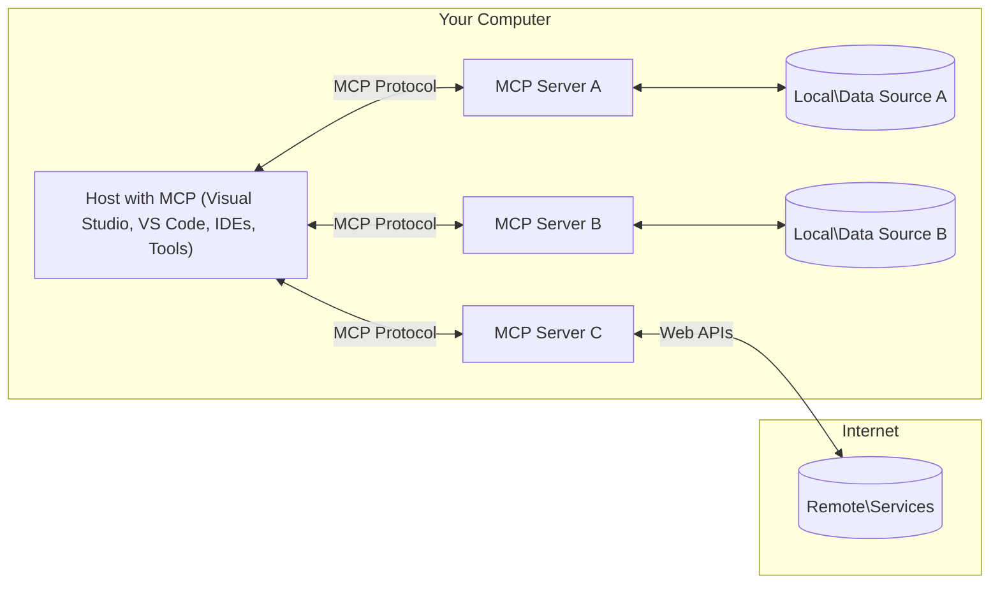

<!--
CO_OP_TRANSLATOR_METADATA:
{
  "original_hash": "11010ad254e48628bb6a457be2211640",
  "translation_date": "2025-08-12T08:18:07+00:00",
  "source_file": "01-CoreConcepts/README.md",
  "language_code": "hi"
}
-->
# 📖 MCP कोर अवधारणाएँ: एआई इंटीग्रेशन के लिए मॉडल कॉन्टेक्स्ट प्रोटोकॉल में महारत हासिल करना

[](https://youtu.be/earDzWGtE84)

_(ऊपर दी गई छवि पर क्लिक करें इस पाठ का वीडियो देखने के लिए)_

[Model Context Protocol (MCP)](https://github.com/modelcontextprotocol) एक शक्तिशाली, मानकीकृत फ्रेमवर्क है जो बड़े भाषा मॉडल (LLMs) और बाहरी टूल्स, एप्लिकेशन, और डेटा स्रोतों के बीच संचार को अनुकूलित करता है। यह गाइड आपको MCP की कोर अवधारणाओं के माध्यम से ले जाएगा, ताकि आप इसके क्लाइंट-सर्वर आर्किटेक्चर, आवश्यक घटकों, संचार तंत्र, और सर्वोत्तम कार्यान्वयन प्रथाओं को समझ सकें।

## परिचय

यह पाठ मॉडल कॉन्टेक्स्ट प्रोटोकॉल (MCP) इकोसिस्टम की मूलभूत संरचना और घटकों की खोज करता है। आप MCP इंटरैक्शन को शक्ति देने वाले क्लाइंट-सर्वर आर्किटेक्चर, प्रमुख घटकों, और संचार तंत्र के बारे में जानेंगे।

## 👩‍🎓 मुख्य सीखने के उद्देश्य

इस पाठ के अंत तक, आप:

- MCP क्लाइंट-सर्वर आर्किटेक्चर को समझेंगे।
- Hosts, Clients, और Servers की भूमिकाओं और जिम्मेदारियों की पहचान करेंगे।
- MCP को एक लचीली इंटीग्रेशन लेयर बनाने वाली मुख्य विशेषताओं का विश्लेषण करेंगे।
- MCP इकोसिस्टम में जानकारी के प्रवाह को समझेंगे।
- .NET, Java, Python, और JavaScript में कोड उदाहरणों के माध्यम से व्यावहारिक अंतर्दृष्टि प्राप्त करेंगे।

## 🔎 MCP आर्किटेक्चर: गहराई से समझना

MCP इकोसिस्टम एक क्लाइंट-सर्वर मॉडल पर आधारित है। यह मॉड्यूलर संरचना एआई एप्लिकेशन को टूल्स, डेटाबेस, APIs, और संदर्भात्मक संसाधनों के साथ कुशलतापूर्वक इंटरैक्ट करने की अनुमति देती है। आइए इस आर्किटेक्चर को इसके मुख्य घटकों में विभाजित करें।

MCP का मूल एक क्लाइंट-सर्वर आर्किटेक्चर का अनुसरण करता है, जहां एक होस्ट एप्लिकेशन कई सर्वरों से जुड़ सकता है:



- **MCP Hosts**: प्रोग्राम जैसे VSCode, Claude Desktop, IDEs, या एआई टूल्स जो MCP के माध्यम से डेटा तक पहुंचना चाहते हैं।
- **MCP Clients**: प्रोटोकॉल क्लाइंट्स जो सर्वरों के साथ 1:1 कनेक्शन बनाए रखते हैं।
- **MCP Servers**: हल्के प्रोग्राम जो मानकीकृत मॉडल कॉन्टेक्स्ट प्रोटोकॉल के माध्यम से विशिष्ट क्षमताओं को उजागर करते हैं।
- **स्थानीय डेटा स्रोत**: आपके कंप्यूटर की फाइलें, डेटाबेस, और सेवाएँ जिन तक MCP सर्वर सुरक्षित रूप से पहुंच सकते हैं।
- **दूरस्थ सेवाएँ**: इंटरनेट पर उपलब्ध बाहरी सिस्टम जिनसे MCP सर्वर APIs के माध्यम से जुड़ सकते हैं।

MCP प्रोटोकॉल एक विकसित होता मानक है। आप [प्रोटोकॉल विनिर्देश](https://modelcontextprotocol.io/specification/2025-06-18/) में नवीनतम अपडेट देख सकते हैं।

### 1. Hosts

मॉडल कॉन्टेक्स्ट प्रोटोकॉल (MCP) में, Hosts मुख्य इंटरफ़ेस के रूप में महत्वपूर्ण भूमिका निभाते हैं जिसके माध्यम से उपयोगकर्ता प्रोटोकॉल के साथ इंटरैक्ट करते हैं। Hosts वे एप्लिकेशन या वातावरण हैं जो MCP सर्वरों के साथ कनेक्शन शुरू करते हैं ताकि डेटा, टूल्स, और प्रॉम्प्ट्स तक पहुंच प्राप्त की जा सके। Hosts के उदाहरणों में शामिल हैं: Visual Studio Code जैसे IDEs, Claude Desktop जैसे एआई टूल्स, या विशिष्ट कार्यों के लिए डिज़ाइन किए गए कस्टम-बिल्ट एजेंट।

**Hosts** वे एप्लिकेशन हैं जो LLMs के साथ कनेक्शन शुरू करते हैं। वे:

- एआई मॉडल को निष्पादित या उनके साथ इंटरैक्ट करते हैं ताकि प्रतिक्रियाएँ उत्पन्न की जा सकें।
- MCP सर्वरों के साथ कनेक्शन शुरू करते हैं।
- बातचीत के प्रवाह और उपयोगकर्ता इंटरफ़ेस को प्रबंधित करते हैं।
- अनुमति और सुरक्षा बाधाओं को नियंत्रित करते हैं।
- डेटा साझा करने और टूल्स निष्पादन के लिए उपयोगकर्ता की सहमति को संभालते हैं।

### 2. Clients

Clients वे आवश्यक घटक हैं जो Hosts और MCP सर्वरों के बीच इंटरैक्शन को सुगम बनाते हैं। Clients मध्यस्थ के रूप में कार्य करते हैं, जिससे Hosts MCP सर्वरों द्वारा प्रदान की गई कार्यक्षमताओं तक पहुंच और उपयोग कर सकते हैं। वे MCP आर्किटेक्चर के भीतर सुचारू संचार और कुशल डेटा विनिमय सुनिश्चित करने में महत्वपूर्ण भूमिका निभाते हैं।

**Clients** होस्ट एप्लिकेशन के भीतर कनेक्टर्स होते हैं। वे:

- सर्वरों को प्रॉम्प्ट्स/निर्देशों के साथ अनुरोध भेजते हैं।
- सर्वरों के साथ क्षमताओं पर बातचीत करते हैं।
- मॉडल्स से टूल्स निष्पादन अनुरोधों को प्रबंधित करते हैं।
- उपयोगकर्ताओं को प्रतिक्रियाएँ संसाधित और प्रदर्शित करते हैं।

### 3. Servers

Servers MCP क्लाइंट्स से अनुरोधों को संभालने और उपयुक्त प्रतिक्रियाएँ प्रदान करने के लिए जिम्मेदार होते हैं। अधिकांशतः, Servers टूल्स के रूप में कार्य करते हैं जो LLM को विशिष्ट क्षमता प्रदान करते हैं। वे डेटा पुनर्प्राप्ति, टूल्स निष्पादन, और प्रॉम्प्ट्स उत्पन्न करने जैसे विभिन्न कार्यों का प्रबंधन करते हैं। Servers यह सुनिश्चित करते हैं कि क्लाइंट्स और Hosts के बीच संचार कुशल और विश्वसनीय हो, इंटरैक्शन प्रक्रिया की अखंडता बनाए रखते हुए।

**Servers** वे सेवाएँ हैं जो संदर्भ और क्षमताएँ प्रदान करती हैं। वे:

- उपलब्ध सुविधाओं (संसाधन, प्रॉम्प्ट्स, टूल्स) को पंजीकृत करते हैं।
- क्लाइंट से टूल कॉल्स प्राप्त करते हैं और निष्पादित करते हैं।
- मॉडल प्रतिक्रियाओं को बढ़ाने के लिए संदर्भात्मक जानकारी प्रदान करते हैं।
- क्लाइंट को आउटपुट वापस करते हैं।
- आवश्यकता होने पर इंटरैक्शन के दौरान स्थिति बनाए रखते हैं।

Servers को कोई भी विकसित कर सकता है ताकि मॉडल क्षमताओं को विशेष कार्यक्षमता के साथ विस्तारित किया जा सके।

### 4. Server Features

मॉडल कॉन्टेक्स्ट प्रोटोकॉल (MCP) में Servers वे मूलभूत निर्माण खंड प्रदान करते हैं जो क्लाइंट्स, Hosts, और भाषा मॉडल्स के बीच समृद्ध इंटरैक्शन को सक्षम बनाते हैं। ये सुविधाएँ MCP की क्षमताओं को संरचित संदर्भ, टूल्स, और प्रॉम्प्ट्स प्रदान करके बढ़ाने के लिए डिज़ाइन की गई हैं।

MCP Servers निम्नलिखित सुविधाएँ प्रदान कर सकते हैं:

#### 📑 संसाधन 

मॉडल कॉन्टेक्स्ट प्रोटोकॉल (MCP) में संसाधन विभिन्न प्रकार के संदर्भ और डेटा को शामिल करते हैं जिन्हें उपयोगकर्ता या एआई मॉडल उपयोग कर सकते हैं। इनमें शामिल हैं:

- **संदर्भात्मक डेटा**: जानकारी और संदर्भ जो उपयोगकर्ता या एआई मॉडल निर्णय लेने और कार्य निष्पादन के लिए उपयोग कर सकते हैं।
- **ज्ञान आधार और दस्तावेज़ रिपॉजिटरी**: संरचित और असंरचित डेटा का संग्रह, जैसे लेख, मैनुअल, और शोध पत्र, जो मूल्यवान अंतर्दृष्टि और जानकारी प्रदान करते हैं।
- **स्थानीय फाइलें और डेटाबेस**: उपकरणों पर या डेटाबेस के भीतर स्थानीय रूप से संग्रहीत डेटा, जो प्रसंस्करण और विश्लेषण के लिए सुलभ है।
- **APIs और वेब सेवाएँ**: बाहरी इंटरफेस और सेवाएँ जो अतिरिक्त डेटा और कार्यक्षमताएँ प्रदान करती हैं, विभिन्न ऑनलाइन संसाधनों और टूल्स के साथ एकीकरण को सक्षम बनाती हैं।

संसाधन का एक उदाहरण एक डेटाबेस स्कीमा या एक फाइल हो सकता है जिसे इस प्रकार एक्सेस किया जा सकता है:

```text
file://log.txt
database://schema
```

### 🤖 प्रॉम्प्ट्स
मॉडल कॉन्टेक्स्ट प्रोटोकॉल (MCP) में प्रॉम्प्ट्स विभिन्न पूर्व-निर्धारित टेम्पलेट्स और इंटरैक्शन पैटर्न को शामिल करते हैं जो उपयोगकर्ता वर्कफ़्लो को सुव्यवस्थित करने और संचार को बढ़ाने के लिए डिज़ाइन किए गए हैं। इनमें शामिल हैं:

- **टेम्पलेटेड संदेश और वर्कफ़्लो**: पूर्व-संरचित संदेश और प्रक्रियाएँ जो उपयोगकर्ताओं को विशिष्ट कार्यों और इंटरैक्शन के माध्यम से मार्गदर्शन करती हैं।
- **पूर्व-निर्धारित इंटरैक्शन पैटर्न**: क्रियाओं और प्रतिक्रियाओं के मानकीकृत अनुक्रम जो सुसंगत और कुशल संचार को सक्षम बनाते हैं।
- **विशेषीकृत बातचीत टेम्पलेट्स**: विशिष्ट प्रकार की बातचीत के लिए अनुकूलित टेम्पलेट्स, जो प्रासंगिक और संदर्भात्मक रूप से उपयुक्त इंटरैक्शन सुनिश्चित करते हैं।

एक प्रॉम्प्ट टेम्पलेट इस प्रकार दिख सकता है:

```markdown
Generate a product slogan based on the following {{product}} with the following {{keywords}}
```

#### ⛏️ टूल्स

मॉडल कॉन्टेक्स्ट प्रोटोकॉल (MCP) में टूल्स वे कार्य हैं जिन्हें एआई मॉडल विशिष्ट कार्यों को निष्पादित करने के लिए चला सकता है। ये टूल्स एआई मॉडल की क्षमताओं को संरचित और विश्वसनीय संचालन प्रदान करके बढ़ाने के लिए डिज़ाइन किए गए हैं। प्रमुख पहलुओं में शामिल हैं:

- **एआई मॉडल द्वारा निष्पादित कार्य**: टूल्स निष्पादित करने योग्य कार्य हैं जिन्हें एआई मॉडल विभिन्न कार्यों को पूरा करने के लिए बुला सकता है।
- **अद्वितीय नाम और विवरण**: प्रत्येक टूल का एक विशिष्ट नाम और एक विस्तृत विवरण होता है जो इसके उद्देश्य और कार्यक्षमता को समझाता है।
- **पैरामीटर और आउटपुट्स**: टूल्स विशिष्ट पैरामीटर स्वीकार करते हैं और संरचित आउटपुट्स लौटाते हैं, सुसंगत और पूर्वानुमानित परिणाम सुनिश्चित करते हैं।
- **डिस्क्रीट कार्य**: टूल्स वेब खोज, गणना, और डेटाबेस क्वेरी जैसे अलग-अलग कार्यों को निष्पादित करते हैं।

एक टूल का उदाहरण इस प्रकार दिख सकता है:

```typescript
server.tool(
  "GetProducts",
  {
    pageSize: z.string().optional(),
    pageCount: z.string().optional()
  }, () => {
    // return results from API
  }
)
```

## क्लाइंट सुविधाएँ
मॉडल कॉन्टेक्स्ट प्रोटोकॉल (MCP) में, क्लाइंट्स सर्वरों को कई प्रमुख सुविधाएँ प्रदान करते हैं, जो प्रोटोकॉल के भीतर समग्र कार्यक्षमता और इंटरैक्शन को बढ़ाते हैं। इनमें से एक उल्लेखनीय सुविधा है सैंपलिंग।

### 👉 सैंपलिंग

- **सर्वर-प्रारंभिक एजेंटिक व्यवहार**: क्लाइंट्स सर्वरों को स्वायत्त रूप से विशिष्ट क्रियाएँ या व्यवहार शुरू करने की अनुमति देते हैं, जिससे सिस्टम की गतिशील क्षमताएँ बढ़ती हैं।
- **पुनरावर्ती LLM इंटरैक्शन**: यह सुविधा बड़े भाषा मॉडल्स (LLMs) के साथ पुनरावर्ती इंटरैक्शन की अनुमति देती है, जिससे कार्यों की अधिक जटिल और पुनरावृत्त प्रसंस्करण संभव हो पाता है।
- **अतिरिक्त मॉडल पूर्णताओं का अनुरोध करना**: सर्वर मॉडल से अतिरिक्त पूर्णताओं का अनुरोध कर सकते हैं, यह सुनिश्चित करते हुए कि प्रतिक्रियाएँ व्यापक और संदर्भात्मक रूप से प्रासंगिक हैं।

## MCP में जानकारी का प्रवाह

मॉडल कॉन्टेक्स्ट प्रोटोकॉल (MCP) Hosts, Clients, Servers, और Models के बीच जानकारी के संरचित प्रवाह को परिभाषित करता है। इस प्रवाह को समझने से यह स्पष्ट होता है कि उपयोगकर्ता अनुरोध कैसे संसाधित होते हैं और बाहरी टूल्स और डेटा मॉडल प्रतिक्रियाओं में कैसे एकीकृत होते हैं।

- **Host कनेक्शन शुरू करता है**  
  होस्ट एप्लिकेशन (जैसे IDE या चैट इंटरफ़ेस) MCP सर्वर के साथ कनेक्शन स्थापित करता है, आमतौर पर STDIO, WebSocket, या किसी अन्य समर्थित ट्रांसपोर्ट के माध्यम से।

- **क्षमता बातचीत**  
  क्लाइंट (होस्ट में एम्बेडेड) और सर्वर उनके समर्थित सुविधाओं, टूल्स, संसाधनों, और प्रोटोकॉल संस्करणों के बारे में जानकारी का आदान-प्रदान करते हैं। यह सुनिश्चित करता है कि दोनों पक्ष सत्र के लिए उपलब्ध क्षमताओं को समझते हैं।

- **उपयोगकर्ता अनुरोध**  
  उपयोगकर्ता होस्ट के साथ इंटरैक्ट करता है (जैसे, प्रॉम्प्ट या कमांड दर्ज करता है)। होस्ट इस इनपुट को एकत्र करता है और इसे प्रोसेसिंग के लिए क्लाइंट को पास करता है।

- **संसाधन या टूल उपयोग**  
  - क्लाइंट मॉडल की समझ को समृद्ध करने के लिए सर्वर से अतिरिक्त संदर्भ या संसाधन (जैसे फाइलें, डेटाबेस प्रविष्टियाँ, या ज्ञान आधार लेख) का अनुरोध कर सकता है।
  - यदि मॉडल यह निर्धारित करता है कि किसी टूल की आवश्यकता है (जैसे, डेटा प्राप्त करने, गणना करने, या API कॉल करने के लिए), तो क्लाइंट टूल नाम और पैरामीटर निर्दिष्ट करते हुए सर्वर को टूल निष्पादन अनुरोध भेजता है।

- **सर्वर निष्पादन**  
  सर्वर संसाधन या टूल अनुरोध प्राप्त करता है, आवश्यक संचालन (जैसे, फ़ंक्शन चलाना, डेटाबेस क्वेरी करना, या फ़ाइल पुनर्प्राप्त करना) निष्पादित करता है, और संरचित प्रारूप में परिणाम क्लाइंट को लौटाता है।

- **प्रतिक्रिया निर्माण**  
  क्लाइंट सर्वर की प्रतिक्रियाओं (संसाधन डेटा, टूल आउटपुट्स, आदि) को चल रहे मॉडल इंटरैक्शन में एकीकृत करता है। मॉडल इस जानकारी का उपयोग व्यापक और संदर्भात्मक रूप से प्रासंगिक प्रतिक्रिया उत्पन्न करने के लिए करता है।

- **परिणाम प्रस्तुति**  
  होस्ट क्लाइंट से अंतिम आउटपुट प्राप्त करता है और इसे उपयोगकर्ता को प्रस्तुत करता है, अक्सर मॉडल द्वारा उत्पन्न टेक्स्ट और टूल्स निष्पादन या संसाधन लुकअप से प्राप्त परिणामों को शामिल करते हुए।

यह प्रवाह MCP को उन्नत, इंटरैक्टिव, और संदर्भ-सचेत एआई एप्लिकेशन का समर्थन करने में सक्षम बनाता है, मॉडल्स को बाहरी टूल्स और डेटा स्रोतों से सहजता से जोड़ते हुए।

## प्रोटोकॉल विवरण

MCP (मॉडल कॉन्टेक्स्ट प्रोटोकॉल) [JSON-RPC 2.0](https://www.jsonrpc.org/) के ऊपर बनाया गया है, जो Hosts, Clients, और Servers के बीच संचार के लिए एक मानकीकृत, भाषा-अज्ञेय संदेश प्रारूप प्रदान करता है। यह आधार विविध प्लेटफार्मों और प्रोग्रामिंग भाषाओं में विश्वसनीय, संरचित, और विस्तार योग्य इंटरैक्शन को सक्षम बनाता है।

### प्रमुख प्रोटोकॉल सुविधाएँ

MCP JSON-RPC 2.0 को टूल्स निष्पादन, संसाधन पहुंच, और प्रॉम्प्ट प्रबंधन के लिए अतिरिक्त परंपराओं के साथ विस्तारित करता है। यह कई ट्रांसपोर्ट लेयर्स (STDIO, WebSocket, SSE) का समर्थन करता है और घटकों के बीच सुरक्षित, विस्तार योग्य, और भाषा-अज्ञेय संचार को सक्षम बनाता है।

#### 🧢 बेस प्रोटोकॉल

- **JSON-RPC संदेश प्रारूप**: सभी अनुरोध और प्रतिक्रियाएँ JSON-RPC 2.0 विनिर्देश का उपयोग करती हैं, जो विधि कॉल्स, पैरामीटर, परिणाम, और त्रुटि हैंडलिंग के लिए सुसंगत संरचना सुनिश्चित करती हैं।
- **राज्यपूर्ण कनेक्शन**: MCP सत्र कई अनुरोधों के दौरान स्थिति बनाए रखते हैं, चल रही बातचीत, संदर्भ संचय, और संसाधन प्रबंधन का समर्थन करते हैं।
- **क्षमता बातचीत**: कनेक्शन सेटअप के दौरान, क्लाइंट्स और सर्वर उनके समर्थित सुविधाओं, प्रोटोकॉल संस्करणों, उपलब्ध टूल्स, और संसाधनों के बारे में जानकारी का आदान-प्रदान करते हैं। यह सुनिश्चित करता है कि दोनों पक्ष एक-दूसरे की क्षमताओं को समझते हैं और तदनुसार अनुकूलित कर सकते हैं।

#### ➕ अतिरिक्त उपयोगिताएँ

नीचे कुछ अतिरिक्त उपयोगिताएँ और प्रोटोकॉल एक्सटेंशन दिए गए हैं जो MCP डेवलपर अनुभव को बढ़ाने और उन्नत परिदृश्यों को सक्षम करने के लिए प्रदान करता है:

- **कॉन्फ़िगरेशन विकल्प**: MCP सत्र पैरामीटर, जैसे टूल अनुमतियाँ, संसाधन पहुंच, और मॉडल सेटिंग्स, को प्रत्येक इंटरैक्शन के लिए अनुकूलित करने की अनुमति देता है।
- **प्रगति ट्रैकिंग**: लंबे समय तक चलने वाले संचालन प्रगति अपडेट की रिपोर्ट कर सकते हैं, जटिल कार्यों के दौरान उत्तरदायी उपयोगकर्ता इंटरफेस और बेहतर उपयोगकर्ता अनुभव को सक्षम करते हैं।
- **अनुरोध रद्द करना**: क्लाइंट्स इन-फ्लाइट अनुरोधों को रद्द कर सकते हैं, जिससे उपयोगकर्ता उन संचालन को बाधित कर सकते हैं जो अब आवश्यक नहीं हैं या बहुत अधिक समय ले रहे हैं।
- **त्रुटि रिपोर्टिंग**: मानकीकृत त्रुटि संदेश और कोड समस्याओं का निदान करने, विफलताओं को अनुग्रहपूर्वक संभालने, और उपयोगकर्ताओं और डेवलपर्स को कार्रवाई योग्य प्रतिक्रिया प्रदान करने में मदद करते हैं।
- **लॉगिंग**: क्लाइंट्स और सर्वर दोनों प्रोटोकॉल इंटरैक्शन के लिए ऑडिटिंग, डिबगिंग, और मॉनिटरिंग के लिए संरचित लॉग्स उत्सर्जित कर सकते हैं।

इन
यह उदाहरण JavaScript में MCP सर्वर निर्माण और दो मौसम-संबंधित टूल्स को रजिस्टर करने का तरीका दिखाता है।

```javascript
// Using the official Model Context Protocol SDK
import { McpServer } from "@modelcontextprotocol/sdk/server/mcp.js";
import { StdioServerTransport } from "@modelcontextprotocol/sdk/server/stdio.js";
import { z } from "zod"; // For parameter validation

// Create an MCP server
const server = new McpServer({
  name: "Weather MCP Server",
  version: "1.0.0"
});

// Define a weather tool
server.tool(
  "weatherTool",
  {
    location: z.string().describe("The location to get weather for")
  },
  async ({ location }) => {
    // This would normally call a weather API
    // Simplified for demonstration
    const weatherData = await getWeatherData(location);
    
    return {
      content: [
        { 
          type: "text", 
          text: `Temperature: ${weatherData.temperature}°F, Conditions: ${weatherData.conditions}, Location: ${weatherData.location}` 
        }
      ]
    };
  }
);

// Define a forecast tool
server.tool(
  "forecastTool",
  {
    location: z.string(),
    days: z.number().default(3).describe("Number of days for forecast")
  },
  async ({ location, days }) => {
    // This would normally call a weather API
    // Simplified for demonstration
    const forecast = await getForecastData(location, days);
    
    return {
      content: [
        { 
          type: "text", 
          text: `${days}-day forecast for ${location}: ${JSON.stringify(forecast)}` 
        }
      ]
    };
  }
);

// Helper functions
async function getWeatherData(location) {
  // Simulate API call
  return {
    temperature: 72.5,
    conditions: "Sunny",
    location: location
  };
}

async function getForecastData(location, days) {
  // Simulate API call
  return Array.from({ length: days }, (_, i) => ({
    day: i + 1,
    temperature: 70 + Math.floor(Math.random() * 10),
    conditions: i % 2 === 0 ? "Sunny" : "Partly Cloudy"
  }));
}

// Connect the server using stdio transport
const transport = new StdioServerTransport();
server.connect(transport).catch(console.error);

console.log("Weather MCP Server started");
```

यह JavaScript उदाहरण दिखाता है कि MCP क्लाइंट कैसे बनाया जाए, जो सर्वर से जुड़ता है, एक प्रॉम्प्ट भेजता है, और प्रतिक्रिया को प्रोसेस करता है, जिसमें किए गए टूल कॉल्स भी शामिल हैं।

## सुरक्षा और प्राधिकरण

MCP प्रोटोकॉल में सुरक्षा और प्राधिकरण को प्रबंधित करने के लिए कई अंतर्निहित अवधारणाएं और तंत्र शामिल हैं:

1. **टूल अनुमति नियंत्रण**:  
   क्लाइंट्स यह निर्दिष्ट कर सकते हैं कि मॉडल को सत्र के दौरान कौन-कौन से टूल्स का उपयोग करने की अनुमति है। यह सुनिश्चित करता है कि केवल स्पष्ट रूप से अधिकृत टूल्स ही सुलभ हों, जिससे अनपेक्षित या असुरक्षित संचालन का जोखिम कम हो। अनुमतियों को उपयोगकर्ता की प्राथमिकताओं, संगठनात्मक नीतियों, या इंटरैक्शन के संदर्भ के आधार पर गतिशील रूप से कॉन्फ़िगर किया जा सकता है।

2. **प्रमाणीकरण**:  
   सर्वर टूल्स, संसाधनों, या संवेदनशील संचालन तक पहुंच प्रदान करने से पहले प्रमाणीकरण की आवश्यकता कर सकते हैं। इसमें API कुंजियाँ, OAuth टोकन, या अन्य प्रमाणीकरण योजनाएँ शामिल हो सकती हैं। उचित प्रमाणीकरण यह सुनिश्चित करता है कि केवल भरोसेमंद क्लाइंट्स और उपयोगकर्ता ही सर्वर-साइड क्षमताओं को सक्रिय कर सकें।

3. **मान्यता**:  
   सभी टूल कॉल्स के लिए पैरामीटर मान्यता लागू की जाती है। प्रत्येक टूल अपने पैरामीटर के अपेक्षित प्रकार, प्रारूप, और बाधाओं को परिभाषित करता है, और सर्वर आने वाले अनुरोधों को उसी के अनुसार मान्य करता है। यह खराब या दुर्भावनापूर्ण इनपुट को टूल कार्यान्वयन तक पहुँचने से रोकता है और संचालन की अखंडता बनाए रखने में मदद करता है।

4. **रेट लिमिटिंग**:  
   दुरुपयोग को रोकने और सर्वर संसाधनों के उचित उपयोग को सुनिश्चित करने के लिए, MCP सर्वर टूल कॉल्स और संसाधन पहुंच के लिए रेट लिमिटिंग लागू कर सकते हैं। रेट लिमिट्स उपयोगकर्ता, सत्र, या वैश्विक स्तर पर लागू किए जा सकते हैं और सेवा-इनकार हमलों या अत्यधिक संसाधन खपत से बचाव में मदद करते हैं।

इन तंत्रों को मिलाकर, MCP बाहरी टूल्स और डेटा स्रोतों के साथ भाषा मॉडल को एकीकृत करने के लिए एक सुरक्षित आधार प्रदान करता है, जबकि उपयोगकर्ताओं और डेवलपर्स को पहुंच और उपयोग पर सूक्ष्म नियंत्रण देता है।

## प्रोटोकॉल संदेश

MCP संचार क्लाइंट्स, सर्वर, और मॉडल्स के बीच स्पष्ट और विश्वसनीय इंटरैक्शन की सुविधा के लिए संरचित JSON संदेशों का उपयोग करता है। मुख्य संदेश प्रकारों में शामिल हैं:

- **क्लाइंट अनुरोध**  
   यह संदेश क्लाइंट से सर्वर को भेजा जाता है और आमतौर पर इसमें शामिल होता है:
   - उपयोगकर्ता का प्रॉम्प्ट या कमांड
   - संदर्भ के लिए बातचीत का इतिहास
   - टूल कॉन्फ़िगरेशन और अनुमतियाँ
   - कोई अतिरिक्त मेटाडेटा या सत्र जानकारी

- **मॉडल प्रतिक्रिया**  
   मॉडल द्वारा (क्लाइंट के माध्यम से) लौटाया गया यह संदेश शामिल करता है:
   - प्रॉम्प्ट और संदर्भ के आधार पर उत्पन्न टेक्स्ट या पूर्णता
   - वैकल्पिक टूल कॉल निर्देश यदि मॉडल को लगता है कि किसी टूल को सक्रिय किया जाना चाहिए
   - संसाधनों या अतिरिक्त संदर्भों के संदर्भ जैसा आवश्यक हो

- **टूल अनुरोध**  
   जब किसी टूल को सक्रिय करने की आवश्यकता होती है, तो यह संदेश क्लाइंट से सर्वर को भेजा जाता है। इसमें शामिल होता है:
   - सक्रिय करने के लिए टूल का नाम
   - टूल द्वारा आवश्यक पैरामीटर (टूल की स्कीमा के खिलाफ मान्य)
   - अनुरोध को ट्रैक करने के लिए संदर्भ जानकारी या पहचानकर्ता

- **टूल प्रतिक्रिया**  
   टूल को सक्रिय करने के बाद सर्वर द्वारा लौटाया गया यह संदेश प्रदान करता है:
   - टूल निष्पादन के परिणाम (संरचित डेटा या सामग्री)
   - यदि टूल कॉल विफल हो गया तो कोई त्रुटि या स्थिति जानकारी
   - वैकल्पिक रूप से, निष्पादन से संबंधित अतिरिक्त मेटाडेटा या लॉग्स

ये संरचित संदेश MCP वर्कफ़्लो के प्रत्येक चरण को स्पष्ट, ट्रेस करने योग्य, और विस्तार योग्य बनाते हैं, जिससे मल्टी-टर्न बातचीत, टूल चेनिंग, और मजबूत त्रुटि प्रबंधन जैसे उन्नत परिदृश्यों का समर्थन होता है।

## मुख्य बातें

- MCP क्लाइंट-सर्वर आर्किटेक्चर का उपयोग करता है ताकि मॉडल्स को बाहरी क्षमताओं से जोड़ा जा सके।
- पारिस्थितिकी तंत्र में क्लाइंट्स, होस्ट्स, सर्वर, टूल्स, और डेटा स्रोत शामिल हैं।
- संचार STDIO, SSE, या WebSockets के माध्यम से हो सकता है।
- टूल्स मॉडल्स को प्रदान की गई कार्यक्षमता की मूल इकाइयाँ हैं।
- संरचित संचार प्रोटोकॉल सुसंगत इंटरैक्शन सुनिश्चित करते हैं।

## अभ्यास

अपने डोमेन में उपयोगी एक सरल MCP टूल डिज़ाइन करें। परिभाषित करें:
1. टूल का नाम क्या होगा
2. यह कौन-कौन से पैरामीटर स्वीकार करेगा
3. यह क्या आउटपुट लौटाएगा
4. मॉडल इस टूल का उपयोग उपयोगकर्ता की समस्याओं को हल करने के लिए कैसे कर सकता है


---

## आगे क्या है

अगला: [अध्याय 2: सुरक्षा](../02-Security/README.md)

**अस्वीकरण**:  
यह दस्तावेज़ AI अनुवाद सेवा [Co-op Translator](https://github.com/Azure/co-op-translator) का उपयोग करके अनुवादित किया गया है। जबकि हम सटीकता सुनिश्चित करने का प्रयास करते हैं, कृपया ध्यान दें कि स्वचालित अनुवाद में त्रुटियां या अशुद्धियां हो सकती हैं। मूल भाषा में उपलब्ध मूल दस्तावेज़ को प्रामाणिक स्रोत माना जाना चाहिए। महत्वपूर्ण जानकारी के लिए, पेशेवर मानव अनुवाद की सिफारिश की जाती है। इस अनुवाद के उपयोग से उत्पन्न किसी भी गलतफहमी या गलत व्याख्या के लिए हम जिम्मेदार नहीं हैं।