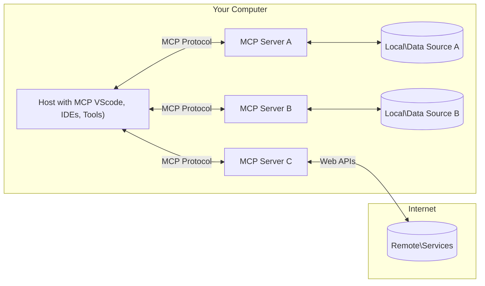

<!--
CO_OP_TRANSLATOR_METADATA:
{
  "original_hash": "b3b4a6ad10c3c0edbf7fa7cfa0ec496b",
  "translation_date": "2025-07-02T07:04:28+00:00",
  "source_file": "01-CoreConcepts/README.md",
  "language_code": "hi"
}
-->
# 📖 MCP कोर कॉन्सेप्ट्स: AI इंटीग्रेशन के लिए मॉडल कॉन्टेक्स्ट प्रोटोकॉल में महारत हासिल करना

[Model Context Protocol (MCP)](https://github.com/modelcontextprotocol) एक शक्तिशाली, मानकीकृत फ्रेमवर्क है जो बड़े भाषा मॉडल्स (LLMs) और बाहरी टूल्स, एप्लिकेशन, तथा डेटा स्रोतों के बीच संचार को अनुकूलित करता है। यह SEO-ऑप्टिमाइज़्ड गाइड आपको MCP के मूल सिद्धांतों से परिचित कराएगा, जिससे आप इसके क्लाइंट-सर्वर आर्किटेक्चर, आवश्यक घटकों, संचार तंत्र, और कार्यान्वयन के सर्वोत्तम अभ्यास समझ सकेंगे।

## अवलोकन

यह पाठ MCP इकोसिस्टम के मूलभूत आर्किटेक्चर और घटकों की पड़ताल करता है। आप क्लाइंट-सर्वर आर्किटेक्चर, मुख्य घटकों, और संचार तंत्र के बारे में जानेंगे जो MCP इंटरैक्शन को संचालित करते हैं।

## 👩‍🎓 प्रमुख सीखने के उद्देश्य

इस पाठ के अंत तक, आप:

- MCP क्लाइंट-सर्वर आर्किटेक्चर को समझेंगे।
- Hosts, Clients, और Servers की भूमिकाओं और जिम्मेदारियों की पहचान करेंगे।
- MCP को एक लचीला इंटीग्रेशन लेयर बनाने वाली मुख्य विशेषताओं का विश्लेषण करेंगे।
- MCP इकोसिस्टम में जानकारी के प्रवाह को समझेंगे।
- .NET, Java, Python, और JavaScript में कोड उदाहरणों के माध्यम से व्यावहारिक ज्ञान प्राप्त करेंगे।

## 🔎 MCP आर्किटेक्चर: एक गहराई से नज़र

MCP इकोसिस्टम क्लाइंट-सर्वर मॉडल पर आधारित है। यह मॉड्यूलर संरचना AI एप्लिकेशन को टूल्स, डेटाबेस, APIs, और संदर्भित संसाधनों के साथ प्रभावी ढंग से इंटरैक्ट करने की अनुमति देती है। आइए इस आर्किटेक्चर को इसके मुख्य घटकों में विभाजित करें।

मूल रूप से, MCP क्लाइंट-सर्वर आर्किटेक्चर का पालन करता है जहां एक होस्ट एप्लिकेशन कई सर्वरों से जुड़ सकता है:



- **MCP Hosts**: VSCode, Claude Desktop, IDEs, या AI टूल्स जैसे प्रोग्राम जो MCP के माध्यम से डेटा एक्सेस करना चाहते हैं
- **MCP Clients**: प्रोटोकॉल क्लाइंट जो सर्वरों के साथ 1:1 कनेक्शन बनाए रखते हैं
- **MCP Servers**: हल्के प्रोग्राम जो प्रत्येक मानकीकृत Model Context Protocol के माध्यम से विशिष्ट क्षमताएं प्रदान करते हैं
- **स्थानीय डेटा स्रोत**: आपके कंप्यूटर की फाइलें, डेटाबेस, और सेवाएं जिन्हें MCP सर्वर सुरक्षित रूप से एक्सेस कर सकते हैं
- **रिमोट सेवाएं**: इंटरनेट पर उपलब्ध बाहरी सिस्टम जिन्हें MCP सर्वर APIs के माध्यम से कनेक्ट कर सकते हैं।

MCP प्रोटोकॉल एक विकसित होता मानक है, आप [प्रोटोकॉल स्पेसिफिकेशन](https://modelcontextprotocol.io/specification/2025-06-18/) में नवीनतम अपडेट देख सकते हैं।

### 1. Hosts

Model Context Protocol (MCP) में Hosts एक महत्वपूर्ण भूमिका निभाते हैं क्योंकि वे वह प्राथमिक इंटरफ़ेस हैं जिसके माध्यम से उपयोगकर्ता प्रोटोकॉल के साथ इंटरैक्ट करते हैं। Hosts वे एप्लिकेशन या वातावरण होते हैं जो MCP सर्वरों से कनेक्शन शुरू करते हैं ताकि डेटा, टूल्स, और प्रॉम्प्ट्स तक पहुँच सकें। Hosts के उदाहरण हैं इंटीग्रेटेड डेवलपमेंट एनवायरनमेंट (IDEs) जैसे Visual Studio Code, AI टूल्स जैसे Claude Desktop, या विशिष्ट कार्यों के लिए कस्टम-निर्मित एजेंट।

**Hosts** LLM एप्लिकेशन होते हैं जो कनेक्शन शुरू करते हैं। वे:

- AI मॉडल के साथ इंटरैक्ट करते हैं या प्रतिक्रियाएं उत्पन्न करते हैं।
- MCP सर्वरों से कनेक्शन स्थापित करते हैं।
- संवाद प्रवाह और उपयोगकर्ता इंटरफ़ेस का प्रबंधन करते हैं।
- अनुमति और सुरक्षा प्रतिबंध नियंत्रित करते हैं।
- डेटा साझा करने और टूल निष्पादन के लिए उपयोगकर्ता की सहमति संभालते हैं।

### 2. Clients

Clients वे आवश्यक घटक हैं जो Hosts और MCP सर्वरों के बीच इंटरैक्शन को सुगम बनाते हैं। Clients मध्यस्थ के रूप में कार्य करते हैं, जिससे Hosts MCP सर्वरों द्वारा प्रदान की गई कार्यक्षमताओं का उपयोग कर सकते हैं। वे MCP आर्किटेक्चर के भीतर सुचारू संचार और कुशल डेटा विनिमय सुनिश्चित करने में महत्वपूर्ण भूमिका निभाते हैं।

**Clients** होस्ट एप्लिकेशन के भीतर कनेक्टर्स होते हैं। वे:

- सर्वरों को प्रॉम्प्ट/निर्देशों के साथ अनुरोध भेजते हैं।
- सर्वरों के साथ क्षमताओं पर बातचीत करते हैं।
- मॉडलों से टूल निष्पादन अनुरोधों का प्रबंधन करते हैं।
- उपयोगकर्ताओं को प्रतिक्रियाएं संसाधित और प्रदर्शित करते हैं।

### 3. Servers

Servers MCP क्लाइंट्स से अनुरोधों को संभालने और उपयुक्त प्रतिक्रियाएं प्रदान करने के लिए जिम्मेदार होते हैं। वे डेटा पुनःप्राप्ति, टूल निष्पादन, और प्रॉम्प्ट जनरेशन जैसे विभिन्न ऑपरेशंस का प्रबंधन करते हैं। Servers यह सुनिश्चित करते हैं कि Clients और Hosts के बीच संचार प्रभावी और विश्वसनीय हो, और इंटरैक्शन प्रक्रिया की अखंडता बनी रहे।

**Servers** सेवाएं हैं जो संदर्भ और क्षमताएं प्रदान करती हैं। वे:

- उपलब्ध सुविधाओं (संसाधन, प्रॉम्प्ट, टूल्स) को रजिस्टर करते हैं
- क्लाइंट से टूल कॉल प्राप्त करते हैं और निष्पादित करते हैं
- मॉडल प्रतिक्रियाओं को बेहतर बनाने के लिए संदर्भित जानकारी प्रदान करते हैं
- आउटपुट क्लाइंट को वापस भेजते हैं
- आवश्यकता पड़ने पर इंटरैक्शन के दौरान स्थिति बनाए रखते हैं

Servers किसी भी व्यक्ति द्वारा विकसित किए जा सकते हैं ताकि मॉडल क्षमताओं को विशेष कार्यक्षमता के साथ बढ़ाया जा सके।

### 4. Server Features

Model Context Protocol (MCP) में Servers वे बुनियादी निर्माण खंड प्रदान करते हैं जो Clients, Hosts, और भाषा मॉडलों के बीच समृद्ध इंटरैक्शन को सक्षम बनाते हैं। ये विशेषताएं MCP की क्षमताओं को संरचित संदर्भ, टूल्स, और प्रॉम्प्ट प्रदान करके बढ़ाती हैं।

MCP सर्वर निम्नलिखित में से कोई भी फीचर प्रदान कर सकते हैं:

#### 📑 Resources

Model Context Protocol (MCP) में Resources विभिन्न प्रकार के संदर्भ और डेटा को समाहित करते हैं जिन्हें उपयोगकर्ता या AI मॉडल उपयोग कर सकते हैं। इनमें शामिल हैं:

- **संदर्भित डेटा**: जानकारी और संदर्भ जिन्हें उपयोगकर्ता या AI मॉडल निर्णय लेने और कार्य निष्पादन के लिए उपयोग कर सकते हैं।
- **ज्ञान आधार और दस्तावेज़ संग्रह**: संरचित और असंरचित डेटा का संग्रह, जैसे लेख, मैनुअल, और शोध पत्र, जो महत्वपूर्ण अंतर्दृष्टि और जानकारी प्रदान करते हैं।
- **स्थानीय फाइलें और डेटाबेस**: डिवाइस पर या डेटाबेस में स्थानीय रूप से संग्रहीत डेटा, जो प्रसंस्करण और विश्लेषण के लिए उपलब्ध है।
- **APIs और वेब सेवाएं**: बाहरी इंटरफेस और सेवाएं जो अतिरिक्त डेटा और कार्यक्षमता प्रदान करती हैं, जिससे विभिन्न ऑनलाइन संसाधनों और टूल्स के साथ एकीकरण संभव होता है।

एक संसाधन का उदाहरण डेटाबेस स्कीमा या फाइल हो सकता है जिसे इस प्रकार एक्सेस किया जा सकता है:

```text
file://log.txt
database://schema
```

### 🤖 Prompts

Model Context Protocol (MCP) में Prompts विभिन्न पूर्व-निर्धारित टेम्प्लेट्स और इंटरैक्शन पैटर्न शामिल हैं जो उपयोगकर्ता के वर्कफ़्लो को सरल बनाते हैं और संचार को बेहतर करते हैं। इनमें शामिल हैं:

- **टेम्प्लेटेड संदेश और वर्कफ़्लो**: पूर्व-संरचित संदेश और प्रक्रियाएं जो उपयोगकर्ताओं को विशिष्ट कार्यों और इंटरैक्शन के माध्यम से मार्गदर्शन करती हैं।
- **पूर्व-निर्धारित इंटरैक्शन पैटर्न**: मानकीकृत क्रियाओं और प्रतिक्रियाओं का अनुक्रम जो सुसंगत और प्रभावी संचार को सक्षम बनाता है।
- **विशिष्ट वार्तालाप टेम्प्लेट**: विशिष्ट प्रकार की बातचीत के लिए अनुकूलित टेम्प्लेट, जो प्रासंगिक और संदर्भानुसार उपयुक्त इंटरैक्शन सुनिश्चित करते हैं।

एक प्रॉम्प्ट टेम्प्लेट इस प्रकार दिख सकता है:

```markdown
Generate a product slogan based on the following {{product}} with the following {{keywords}}
```

#### ⛏️ Tools

Model Context Protocol (MCP) में Tools वे फ़ंक्शंस होते हैं जिन्हें AI मॉडल विशिष्ट कार्य करने के लिए निष्पादित कर सकता है। ये टूल्स AI मॉडल की क्षमताओं को संरचित और विश्वसनीय संचालन प्रदान करके बढ़ाते हैं। मुख्य पहलू हैं:

- **AI मॉडल द्वारा निष्पादित फ़ंक्शंस**: टूल्स ऐसे निष्पादन योग्य फ़ंक्शंस हैं जिन्हें AI मॉडल विभिन्न कार्यों के लिए कॉल कर सकता है।
- **विशिष्ट नाम और विवरण**: प्रत्येक टूल का एक अलग नाम और विस्तृत विवरण होता है जो उसके उद्देश्य और कार्यक्षमता को बताता है।
- **पैरामीटर और आउटपुट**: टूल्स विशिष्ट पैरामीटर स्वीकार करते हैं और संरचित आउटपुट लौटाते हैं, जिससे परिणाम सुसंगत और पूर्वानुमेय होते हैं।
- **विभिन्न फ़ंक्शंस**: टूल्स वेब खोज, गणना, और डेटाबेस क्वेरी जैसे अलग-अलग कार्य करते हैं।

एक टूल का उदाहरण इस प्रकार हो सकता है:

```typescript
server.tool(
  "GetProducts",
  {
    pageSize: z.string().optional(),
    pageCount: z.string().optional()
  }, () => {
    // return results from API
  }
)
```

## Client Features

Model Context Protocol (MCP) में, क्लाइंट सर्वरों को कई प्रमुख सुविधाएं प्रदान करते हैं, जो प्रोटोकॉल के भीतर समग्र कार्यक्षमता और इंटरैक्शन को बढ़ाती हैं। एक उल्लेखनीय फीचर है Sampling।

### 👉 Sampling

- **सर्वर-प्रेरित एजेंटिक व्यवहार**: क्लाइंट्स सर्वरों को स्वायत्त रूप से विशिष्ट क्रियाएं या व्यवहार शुरू करने में सक्षम बनाते हैं, जिससे सिस्टम की गतिशील क्षमताएं बढ़ती हैं।
- **पुनरावर्ती LLM इंटरैक्शन**: यह फीचर बड़े भाषा मॉडलों (LLMs) के साथ पुनरावर्ती इंटरैक्शन की अनुमति देता है, जिससे कार्यों की अधिक जटिल और पुनरावृत्त प्रक्रिया संभव होती है।
- **अतिरिक्त मॉडल पूर्णताओं का अनुरोध**: सर्वर मॉडल से अतिरिक्त पूर्णताएं अनुरोध कर सकते हैं, यह सुनिश्चित करते हुए कि प्रतिक्रियाएं व्यापक और संदर्भानुसार प्रासंगिक हों।

## MCP में सूचना प्रवाह

Model Context Protocol (MCP) होस्ट्स, क्लाइंट्स, सर्वर्स, और मॉडलों के बीच सूचना के संरचित प्रवाह को परिभाषित करता है। इस प्रवाह को समझने से यह स्पष्ट होता है कि उपयोगकर्ता अनुरोध कैसे संसाधित होते हैं और बाहरी टूल्स और डेटा मॉडल प्रतिक्रियाओं में कैसे एकीकृत होते हैं।

- **होस्ट कनेक्शन शुरू करता है**  
  होस्ट एप्लिकेशन (जैसे IDE या चैट इंटरफ़ेस) आमतौर पर STDIO, WebSocket, या अन्य समर्थित ट्रांसपोर्ट के माध्यम से MCP सर्वर से कनेक्शन स्थापित करता है।

- **क्षमता बातचीत**  
  क्लाइंट (जो होस्ट में एम्बेडेड होता है) और सर्वर अपनी समर्थित सुविधाओं, टूल्स, संसाधनों, और प्रोटोकॉल संस्करणों के बारे में जानकारी का आदान-प्रदान करते हैं। यह सुनिश्चित करता है कि दोनों पक्ष सत्र के लिए उपलब्ध क्षमताओं को समझें।

- **उपयोगकर्ता अनुरोध**  
  उपयोगकर्ता होस्ट के साथ इंटरैक्ट करता है (जैसे प्रॉम्प्ट या कमांड दर्ज करता है)। होस्ट इस इनपुट को एकत्र करता है और इसे प्रसंस्करण के लिए क्लाइंट को भेजता है।

- **संसाधन या टूल उपयोग**  
  - क्लाइंट मॉडल की समझ को समृद्ध करने के लिए सर्वर से अतिरिक्त संदर्भ या संसाधन (जैसे फाइलें, डेटाबेस प्रविष्टियां, या ज्ञान आधार लेख) अनुरोध कर सकता है।
  - यदि मॉडल निर्धारित करता है कि किसी टूल की आवश्यकता है (जैसे डेटा प्राप्त करना, गणना करना, या API कॉल करना), तो क्लाइंट टूल नाम और पैरामीटर निर्दिष्ट करते हुए टूल निष्पादन अनुरोध सर्वर को भेजता है।

- **सर्वर निष्पादन**  
  सर्वर संसाधन या टूल अनुरोध प्राप्त करता है, आवश्यक ऑपरेशन (जैसे फ़ंक्शन चलाना, डेटाबेस क्वेरी करना, या फाइल पुनःप्राप्त करना) निष्पादित करता है, और परिणाम क्लाइंट को संरचित प्रारूप में लौटाता है।

- **प्रतिक्रिया निर्माण**  
  क्लाइंट सर्वर की प्रतिक्रियाओं (संसाधन डेटा, टूल आउटपुट आदि) को चल रहे मॉडल इंटरैक्शन में एकीकृत करता है। मॉडल इस जानकारी का उपयोग करके एक व्यापक और संदर्भानुसार उपयुक्त प्रतिक्रिया उत्पन्न करता है।

- **परिणाम प्रस्तुति**  
  होस्ट क्लाइंट से अंतिम आउटपुट प्राप्त करता है और इसे उपयोगकर्ता को प्रस्तुत करता है, जिसमें अक्सर मॉडल द्वारा उत्पन्न टेक्स्ट और टूल निष्पादन या संसाधन खोज के परिणाम शामिल होते हैं।

यह प्रवाह MCP को उन्नत, इंटरैक्टिव, और संदर्भ-सचेत AI एप्लिकेशन का समर्थन करने में सक्षम बनाता है, जो मॉडल्स को बाहरी टूल्स और डेटा स्रोतों से सहजता से जोड़ता है।

## प्रोटोकॉल विवरण

MCP (Model Context Protocol) [JSON-RPC 2.0](https://www.jsonrpc.org/) के ऊपर बनाया गया है, जो होस्ट्स, क्लाइंट्स, और सर्वर्स के बीच संचार के लिए एक मानकीकृत, भाषा-स्वतंत्र संदेश प्रारूप प्रदान करता है। यह आधार विविध प्लेटफार्मों और प्रोग्रामिंग भाषाओं के बीच विश्वसनीय, संरचित, और विस्तार योग्य इंटरैक्शन सक्षम करता है।

### प्रमुख प्रोटोकॉल फीचर्स

MCP JSON-RPC 2.0 का विस्तार टूल इनवोकेशन, संसाधन एक्सेस, और प्रॉम्प्ट प्रबंधन के लिए अतिरिक्त कन्वेंशंस के साथ करता है। यह कई ट्रांसपोर्ट लेयर्स (STDIO, WebSocket, SSE) का समर्थन करता है और घटकों के बीच सुरक्षित, विस्तार योग्य, और भाषा-स्वतंत्र संचार सक्षम बनाता है।

#### 🧢 बेस प्रोटोकॉल

- **JSON-RPC संदेश प्रारूप**: सभी अनुरोध और प्रतिक्रियाएं JSON-RPC 2.0 विनिर्देशन का उपयोग करती हैं, जो मेथड कॉल्स, पैरामीटर, परिणाम, और त्रुटि हैंडलिंग के लिए सुसंगत संरचना सुनिश्चित करता है।
- **स्टेटफुल कनेक्शन**: MCP सत्र कई अनुरोधों में स्थिति बनाए रखते हैं, जिससे चल रही बातचीत, संदर्भ संचयन, और संसाधन प्रबंधन संभव होता है।
- **क्षमता बातचीत**: कनेक्शन सेटअप के दौरान, क्लाइंट और सर्वर समर्थित सुविधाओं, प्रोटोकॉल संस्करणों, उपलब्ध टूल्स, और संसाधनों के बारे में जानकारी का आदान-प्रदान करते हैं। यह सुनिश्चित करता है कि दोनों पक्ष एक-दूसरे की क्षमताओं को समझें और तदनुसार अनुकूलित हों।

#### ➕ अतिरिक्त उपयोगिताएं

नीचे कुछ अतिरिक्त उपयोगिताएं और प्रोटोकॉल एक्सटेंशंस दिए गए हैं जो MCP डेवलपर अनुभव को बढ़ाने और उन्नत परिदृश्यों को सक्षम करने के लिए प्रदान करता है:

- **कॉन्फ़िगरेशन विकल्प**: MCP सत्र पैरामीटर जैसे टूल अनुमतियां, संसाधन एक्सेस, और मॉडल सेटिंग्स को गतिशील रूप से कॉन्फ़िगर करने की अनुमति देता है, जो प्रत्येक इंटरैक्शन के लिए अनुकूलित होते हैं।
- **प्रगति ट्रैकिंग**: लंबी चलने वाली प्रक्रियाएं प्रगति अपडेट रिपोर्ट कर सकती हैं, जिससे प्रतिक्रियाशील उपयोगकर्ता इंटरफेस और जटिल कार्यों के दौरान बेहतर उपयोगकर्ता अनुभव संभव होता है।
- **अनुरोध रद्द करना**: क्लाइंट्स चल रहे अनुरोधों को रद्द कर सकते हैं, जिससे उपयोगकर्ता उन ऑपरेशनों को रोक सकते हैं जो अब आवश्यक नहीं हैं या बहुत समय ले रहे हैं।
- **त्रुटि रिपोर्टिंग**: मानकीकृत त्रुटि संदेश और कोड समस्याओं का निदान करने, विफलताओं को सुचारू रूप से संभालने, और उपयोगकर्ताओं तथा डेवलपर्स को उपयोगी फीडबैक प्रदान करने में मदद करते हैं।
- **लॉगिंग**: क्लाइंट और सर्वर दोनों ऑडिटिंग, डीबगिंग, और प्रोटोकॉल इंटरैक्शन की निगरानी के लिए संरचित लॉग्स उत्पन्न कर सकते हैं।

इन प्रोटोकॉल फीचर्स का उपयोग करके, MCP भाषा मॉडलों और बाहरी टूल्स या डेटा स्रोतों के बीच मजबूत, सुरक्षित, और लचीला संचार सुनिश्चित करता है।

### 🔐 सुरक्षा विचार

MCP कार्यान्वयन को सुरक्षित और विश्वसनीय इंटरैक्शन सुनिश्चित करने के लिए कई प्रमुख सुरक्षा सिद्धांतों का पालन करना चाहिए:

- **उपयोगकर्ता की सहमति और नियंत्रण**: किसी भी डेटा तक पहुँचने या ऑपरेशन करने से पहले उपयोगकर्ताओं से स्पष्ट सहमति लेना आवश्यक है। उन्हें यह स्पष्ट नियंत्रण होना चाहिए कि कौन सा डेटा साझा किया जाता है और कौन से क्रियाकलाप अधिकृत हैं, साथ ही गतिविधियों की समीक्षा और अनुमोदन के लिए सहज उपयोगकर्ता इंटरफेस प्रदान किए जाएं।

- **डेटा गोपनीयता**: उपयोगकर्ता डेटा केवल स्पष्ट सहमति के साथ ही साझा किया जाना चाहिए और उचित एक्सेस नियंत्रण द्वारा सुरक्षित होना चाहिए। MCP कार्यान्वयन को अनधिकृत डेटा ट्रांसमिशन से बचाना चाहिए और सभी इंटरैक्शन के दौरान गोपनीयता बनाए रखनी चाहिए।

- **टूल सुरक्षा**: किसी भी टूल को कॉल करने से पहले स्पष्ट उपयोगकर्ता सहमति आवश्यक है

**अस्वीकरण**:  
यह दस्तावेज़ AI अनुवाद सेवा [Co-op Translator](https://github.com/Azure/co-op-translator) का उपयोग करके अनुवादित किया गया है। जबकि हम सटीकता के लिए प्रयासरत हैं, कृपया ध्यान दें कि स्वचालित अनुवादों में त्रुटियाँ या असंगतियाँ हो सकती हैं। मूल दस्तावेज़ अपनी मूल भाषा में प्राधिकृत स्रोत माना जाना चाहिए। महत्वपूर्ण जानकारी के लिए, पेशेवर मानव अनुवाद की सिफारिश की जाती है। इस अनुवाद के उपयोग से उत्पन्न किसी भी गलतफहमी या गलत व्याख्या के लिए हम जिम्मेदार नहीं हैं।