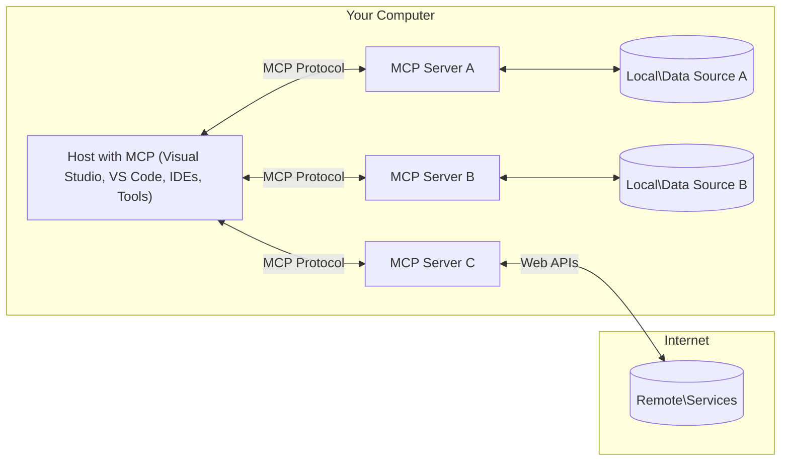

<!--
CO_OP_TRANSLATOR_METADATA:
{
  "original_hash": "0a6a7bcb289c024a91289e0444cb370b",
  "translation_date": "2025-08-18T12:25:49+00:00",
  "source_file": "01-CoreConcepts/README.md",
  "language_code": "hi"
}
-->
# एमसीपी कोर कॉन्सेप्ट्स: एआई इंटीग्रेशन के लिए मॉडल कॉन्टेक्स्ट प्रोटोकॉल में महारत

[](https://youtu.be/earDzWGtE84)

_(इस पाठ का वीडियो देखने के लिए ऊपर दी गई छवि पर क्लिक करें)_

[मॉडल कॉन्टेक्स्ट प्रोटोकॉल (एमसीपी)](https://gi- **स्पष्ट उपयोगकर्ता सहमति**: सभी डेटा एक्सेस और संचालन के लिए निष्पादन से पहले उपयोगकर्ता की स्पष्ट स्वीकृति आवश्यक है। उपयोगकर्ताओं को यह स्पष्ट रूप से समझना चाहिए कि कौन सा डेटा एक्सेस किया जाएगा और कौन सी क्रियाएं की जाएंगी, साथ ही अनुमतियों और प्राधिकरणों पर सूक्ष्म नियंत्रण होना चाहिए।

- **डेटा गोपनीयता सुरक्षा**: उपयोगकर्ता डेटा केवल स्पष्ट सहमति के साथ ही उजागर किया जाएगा और इसे पूरे इंटरैक्शन जीवनचक्र में मजबूत एक्सेस नियंत्रण द्वारा संरक्षित किया जाना चाहिए। अनधिकृत डेटा ट्रांसमिशन को रोकने और सख्त गोपनीयता सीमाओं को बनाए रखने के लिए कार्यान्वयन आवश्यक है।

- **टूल निष्पादन सुरक्षा**: प्रत्येक टूल को चलाने के लिए उपयोगकर्ता की स्पष्ट सहमति आवश्यक है, जिसमें टूल की कार्यक्षमता, पैरामीटर और संभावित प्रभाव की स्पष्ट समझ हो। अनपेक्षित, असुरक्षित, या दुर्भावनापूर्ण टूल निष्पादन को रोकने के लिए मजबूत सुरक्षा सीमाएं आवश्यक हैं।

- **ट्रांसपोर्ट लेयर सुरक्षा**: सभी संचार चैनलों को उपयुक्त एन्क्रिप्शन और प्रमाणीकरण तंत्र का उपयोग करना चाहिए। रिमोट कनेक्शन को सुरक्षित ट्रांसपोर्ट प्रोटोकॉल और उचित क्रेडेंशियल प्रबंधन लागू करना चाहिए।

#### कार्यान्वयन दिशानिर्देश:

- **अनुमति प्रबंधन**: सूक्ष्म अनुमति प्रणालियों को लागू करें जो उपयोगकर्ताओं को यह नियंत्रित करने की अनुमति दें कि कौन से सर्वर, टूल और संसाधन सुलभ हैं  
- **प्रमाणीकरण और प्राधिकरण**: सुरक्षित प्रमाणीकरण विधियों (OAuth, API कुंजी) का उपयोग करें, जिसमें उचित टोकन प्रबंधन और समाप्ति हो  
- **इनपुट सत्यापन**: इंजेक्शन हमलों को रोकने के लिए परिभाषित स्कीमाओं के अनुसार सभी पैरामीटर और डेटा इनपुट को सत्यापित करें  
- **ऑडिट लॉगिंग**: सुरक्षा निगरानी और अनुपालन के लिए सभी संचालन के व्यापक लॉग बनाए रखें  

## अवलोकन

यह पाठ मॉडल कॉन्टेक्स्ट प्रोटोकॉल (एमसीपी) इकोसिस्टम की मौलिक वास्तुकला और घटकों का अन्वेषण करता है। आप एमसीपी इंटरैक्शन को शक्ति देने वाले क्लाइंट-सर्वर आर्किटेक्चर, प्रमुख घटकों और संचार तंत्र के बारे में जानेंगे।

## प्रमुख सीखने के उद्देश्य

इस पाठ के अंत तक, आप:

- एमसीपी क्लाइंट-सर्वर आर्किटेक्चर को समझेंगे।  
- होस्ट, क्लाइंट और सर्वर की भूमिकाओं और जिम्मेदारियों की पहचान करेंगे।  
- एमसीपी को एक लचीली इंटीग्रेशन लेयर बनाने वाली मुख्य विशेषताओं का विश्लेषण करेंगे।  
- एमसीपी इकोसिस्टम के भीतर जानकारी के प्रवाह को समझेंगे।  
- .NET, जावा, पायथन और जावास्क्रिप्ट में कोड उदाहरणों के माध्यम से व्यावहारिक अंतर्दृष्टि प्राप्त करेंगे।  

## एमसीपी आर्किटेक्चर: एक गहन दृष्टि

एमसीपी इकोसिस्टम एक क्लाइंट-सर्वर मॉडल पर आधारित है। यह मॉड्यूलर संरचना एआई अनुप्रयोगों को टूल्स, डेटाबेस, एपीआई और संदर्भ संसाधनों के साथ कुशलतापूर्वक इंटरैक्ट करने की अनुमति देती है। आइए इस आर्किटेक्चर को इसके मुख्य घटकों में विभाजित करें।

एमसीपी मूल रूप से एक क्लाइंट-सर्वर आर्किटेक्चर का अनुसरण करता है, जहां एक होस्ट एप्लिकेशन कई सर्वरों से कनेक्ट हो सकता है:



- **एमसीपी होस्ट्स**: प्रोग्राम जैसे VSCode, Claude Desktop, IDEs, या एआई टूल्स जो एमसीपी के माध्यम से डेटा एक्सेस करना चाहते हैं  
- **एमसीपी क्लाइंट्स**: प्रोटोकॉल क्लाइंट्स जो सर्वरों के साथ 1:1 कनेक्शन बनाए रखते हैं  
- **एमसीपी सर्वर्स**: हल्के प्रोग्राम जो मानकीकृत मॉडल कॉन्टेक्स्ट प्रोटोकॉल के माध्यम से विशिष्ट क्षमताओं को उजागर करते हैं  
- **स्थानीय डेटा स्रोत**: आपके कंप्यूटर की फाइलें, डेटाबेस और सेवाएं जिन्हें एमसीपी सर्वर सुरक्षित रूप से एक्सेस कर सकते हैं  
- **रिमोट सेवाएं**: इंटरनेट पर उपलब्ध बाहरी सिस्टम जिनसे एमसीपी सर्वर एपीआई के माध्यम से कनेक्ट हो सकते हैं।  

एमसीपी प्रोटोकॉल एक विकसित मानक है जो दिनांक-आधारित संस्करणिंग (YYYY-MM-DD प्रारूप) का उपयोग करता है। वर्तमान प्रोटोकॉल संस्करण **2025-06-18** है। आप [प्रोटोकॉल विनिर्देश](https://modelcontextprotocol.io/specification/2025-06-18/) में नवीनतम अपडेट देख सकते हैं।

### 1. होस्ट्स

मॉडल कॉन्टेक्स्ट प्रोटोकॉल (एमसीपी) में, **होस्ट्स** एआई एप्लिकेशन हैं जो प्रोटोकॉल के माध्यम से उपयोगकर्ताओं के इंटरैक्शन के लिए प्राथमिक इंटरफ़ेस के रूप में कार्य करते हैं। होस्ट्स कई एमसीपी सर्वरों से कनेक्शन बनाने और प्रबंधित करने के लिए समर्पित एमसीपी क्लाइंट्स बनाते हैं। होस्ट्स के उदाहरणों में शामिल हैं:

- **एआई एप्लिकेशन**: Claude Desktop, Visual Studio Code, Claude Code  
- **डेवलपमेंट एनवायरनमेंट्स**: आईडीई और कोड एडिटर्स जिनमें एमसीपी इंटीग्रेशन है  
- **कस्टम एप्लिकेशन**: उद्देश्य-निर्मित एआई एजेंट और टूल्स  

**होस्ट्स** एआई मॉडल इंटरैक्शन को समन्वित करने वाले एप्लिकेशन हैं। वे:

- **एआई मॉडल्स का प्रबंधन**: प्रतिक्रियाएं उत्पन्न करने और एआई वर्कफ़्लो को समन्वित करने के लिए एलएलएम को निष्पादित या इंटरैक्ट करते हैं  
- **क्लाइंट कनेक्शन प्रबंधित करते हैं**: प्रत्येक एमसीपी सर्वर कनेक्शन के लिए एक एमसीपी क्लाइंट बनाते और बनाए रखते हैं  
- **यूजर इंटरफेस को नियंत्रित करते हैं**: बातचीत के प्रवाह, उपयोगकर्ता इंटरैक्शन और प्रतिक्रिया प्रस्तुति को संभालते हैं  
- **सुरक्षा लागू करते हैं**: अनुमतियों, सुरक्षा बाधाओं और प्रमाणीकरण को नियंत्रित करते हैं  
- **उपयोगकर्ता सहमति को संभालते हैं**: डेटा साझा करने और टूल निष्पादन के लिए उपयोगकर्ता की स्वीकृति प्रबंधित करते हैं  

### 2. क्लाइंट्स

**क्लाइंट्स** वे आवश्यक घटक हैं जो होस्ट्स और एमसीपी सर्वरों के बीच समर्पित एक-से-एक कनेक्शन बनाए रखते हैं। प्रत्येक एमसीपी क्लाइंट को होस्ट द्वारा एक विशिष्ट एमसीपी सर्वर से कनेक्ट करने के लिए इंस्टेंटिएट किया जाता है, जिससे संगठित और सुरक्षित संचार चैनल सुनिश्चित होते हैं।  

**क्लाइंट्स** होस्ट एप्लिकेशन के भीतर कनेक्टर घटक हैं। वे:

- **प्रोटोकॉल संचार**: सर्वरों को प्रॉम्प्ट्स और निर्देशों के साथ JSON-RPC 2.0 अनुरोध भेजते हैं  
- **क्षमता वार्ता**: प्रारंभिक चरण में सर्वरों के साथ समर्थित सुविधाओं और प्रोटोकॉल संस्करणों पर बातचीत करते हैं  
- **टूल निष्पादन**: मॉडलों से टूल निष्पादन अनुरोधों को प्रबंधित करते हैं और प्रतिक्रियाओं को संसाधित करते हैं  
- **रियल-टाइम अपडेट्स**: सर्वरों से सूचनाओं और रियल-टाइम अपडेट्स को संभालते हैं  
- **प्रतिक्रिया प्रसंस्करण**: उपयोगकर्ताओं को प्रदर्शित करने के लिए सर्वर प्रतिक्रियाओं को संसाधित और स्वरूपित करते हैं  

### 3. सर्वर्स

**सर्वर्स** वे प्रोग्राम हैं जो एमसीपी क्लाइंट्स को संदर्भ, टूल्स और क्षमताएं प्रदान करते हैं। वे स्थानीय रूप से (होस्ट के समान मशीन पर) या रिमोटली (बाहरी प्लेटफार्मों पर) निष्पादित हो सकते हैं, और क्लाइंट अनुरोधों को संभालने और संरचित प्रतिक्रियाएं प्रदान करने के लिए जिम्मेदार होते हैं।  

**सर्वर्स** वे सेवाएं हैं जो संदर्भ और क्षमताएं प्रदान करती हैं। वे:

- **फीचर पंजीकरण**: उपलब्ध प्रिमिटिव्स (संसाधन, प्रॉम्प्ट्स, टूल्स) को क्लाइंट्स के लिए पंजीकृत और उजागर करते हैं  
- **अनुरोध प्रसंस्करण**: क्लाइंट्स से टूल कॉल्स, संसाधन अनुरोध, और प्रॉम्प्ट अनुरोध प्राप्त करते हैं और निष्पादित करते हैं  
- **संदर्भ प्रावधान**: मॉडल प्रतिक्रियाओं को बढ़ाने के लिए संदर्भ जानकारी और डेटा प्रदान करते हैं  
- **स्थिति प्रबंधन**: सत्र स्थिति बनाए रखते हैं और आवश्यक होने पर स्टेटफुल इंटरैक्शन को संभालते हैं  
- **रियल-टाइम सूचनाएं**: कनेक्टेड क्लाइंट्स को क्षमता परिवर्तनों और अपडेट्स के बारे में सूचनाएं भेजते हैं  

सर्वर्स को कोई भी विकसित कर सकता है ताकि मॉडल क्षमताओं को विशेष कार्यक्षमता के साथ विस्तारित किया जा सके, और वे स्थानीय और रिमोट दोनों परिनियोजन परिदृश्यों का समर्थन करते हैं।  

### 4. सर्वर प्रिमिटिव्स

मॉडल कॉन्टेक्स्ट प्रोटोकॉल (एमसीपी) में सर्वर्स तीन मुख्य **प्रिमिटिव्स** प्रदान करते हैं, जो क्लाइंट्स, होस्ट्स और भाषा मॉडलों के बीच समृद्ध इंटरैक्शन के लिए मौलिक निर्माण खंडों को परिभाषित करते हैं।  

एमसीपी सर्वर्स निम्नलिखित तीन मुख्य प्रिमिटिव्स के किसी भी संयोजन को उजागर कर सकते हैं:  

#### संसाधन (Resources)

**संसाधन** वे डेटा स्रोत हैं जो एआई एप्लिकेशन को संदर्भ जानकारी प्रदान करते हैं। वे स्थिर या गतिशील सामग्री का प्रतिनिधित्व करते हैं जो मॉडल की समझ और निर्णय लेने को बढ़ा सकती है:  

- **संदर्भ डेटा**: एआई मॉडल खपत के लिए संरचित जानकारी और संदर्भ  
- **ज्ञान आधार**: दस्तावेज़ भंडार, लेख, मैनुअल, और शोध पत्र  
- **स्थानीय डेटा स्रोत**: फाइलें, डेटाबेस, और स्थानीय सिस्टम जानकारी  
- **बाहरी डेटा**: एपीआई प्रतिक्रियाएं, वेब सेवाएं, और रिमोट सिस्टम डेटा  
- **गतिशील सामग्री**: वास्तविक समय डेटा जो बाहरी परिस्थितियों के आधार पर अपडेट होता है  

संसाधनों की पहचान यूआरआई द्वारा की जाती है और `resources/list` के माध्यम से खोज और `resources/read` विधियों के माध्यम से पुनर्प्राप्ति का समर्थन करते हैं:  

```text
file://documents/project-spec.md
database://production/users/schema
api://weather/current
```  

#### प्रॉम्प्ट्स (Prompts)

**प्रॉम्प्ट्स** पुन: उपयोग योग्य टेम्पलेट्स हैं जो भाषा मॉडलों के साथ इंटरैक्शन को संरचित करने में मदद करते हैं। वे मानकीकृत इंटरैक्शन पैटर्न और टेम्पलेटेड वर्कफ़्लो प्रदान करते हैं:  

- **टेम्पलेट-आधारित इंटरैक्शन**: पूर्व-संरचित संदेश और बातचीत शुरू करने वाले  
- **वर्कफ़्लो टेम्पलेट्स**: सामान्य कार्यों और इंटरैक्शन के लिए मानकीकृत अनुक्रम  
- **फ्यू-शॉट उदाहरण**: मॉडल निर्देश के लिए उदाहरण-आधारित टेम्पलेट्स  
- **सिस्टम प्रॉम्प्ट्स**: मॉडल व्यवहार और संदर्भ को परिभाषित करने वाले बुनियादी प्रॉम्प्ट्स  
- **गतिशील टेम्पलेट्स**: विशिष्ट संदर्भों के अनुसार अनुकूलित प्रॉम्प्ट्स  

प्रॉम्प्ट्स चर प्रतिस्थापन का समर्थन करते हैं और `prompts/list` के माध्यम से खोजे जा सकते हैं और `prompts/get` के साथ पुनर्प्राप्त किए जा सकते हैं:  

```markdown
Generate a {{task_type}} for {{product}} targeting {{audience}} with the following requirements: {{requirements}}
```  

#### टूल्स (Tools)

**टूल्स** निष्पादन योग्य कार्य हैं जिन्हें एआई मॉडल विशिष्ट क्रियाएं करने के लिए बुला सकते हैं। वे एमसीपी इकोसिस्टम के "क्रियाओं" का प्रतिनिधित्व करते हैं, जो मॉडलों को बाहरी सिस्टम के साथ इंटरैक्ट करने में सक्षम बनाते हैं:  

- **निष्पादन योग्य कार्य**: विशिष्ट पैरामीटर के साथ मॉडलों द्वारा बुलाए जा सकने वाले अलग-अलग संचालन  
- **बाहरी सिस्टम इंटीग्रेशन**: एपीआई कॉल्स, डेटाबेस क्वेरीज़, फाइल संचालन, गणनाएं  
- **अद्वितीय पहचान**: प्रत्येक टूल का एक विशिष्ट नाम, विवरण, और पैरामीटर स्कीमा होता है  
- **संरचित I/O**: टूल्स मान्य पैरामीटर स्वीकार करते हैं और संरचित, टाइप की गई प्रतिक्रियाएं लौटाते हैं  
- **क्रिया क्षमताएं**: मॉडलों को वास्तविक दुनिया की क्रियाएं करने और लाइव डेटा पुनर्प्राप्त करने में सक्षम बनाते हैं  

टूल्स पैरामीटर सत्यापन के लिए JSON स्कीमा के साथ परिभाषित किए गए हैं और `tools/list` के माध्यम से खोजे जाते हैं और `tools/call` के माध्यम से निष्पादित किए जाते हैं:  

```typescript
server.tool(
  "search_products", 
  {
    query: z.string().describe("Search query for products"),
    category: z.string().optional().describe("Product category filter"),
    max_results: z.number().default(10).describe("Maximum results to return")
  }, 
  async (params) => {
    // Execute search and return structured results
    return await productService.search(params);
  }
);
```  

...
- **लाइफसाइकल प्रबंधन**: क्लाइंट और सर्वर के बीच कनेक्शन की शुरुआत, क्षमता समझौता, और सत्र समाप्ति को संभालता है  
- **सर्वर प्रिमिटिव्स**: सर्वर को टूल्स, संसाधनों, और प्रॉम्प्ट्स के माध्यम से मुख्य कार्यक्षमता प्रदान करने में सक्षम बनाता है  
- **क्लाइंट प्रिमिटिव्स**: सर्वर को LLM से सैंपलिंग का अनुरोध करने, उपयोगकर्ता इनपुट प्राप्त करने, और लॉग संदेश भेजने में सक्षम बनाता है  
- **रियल-टाइम नोटिफिकेशन**: बिना पोलिंग के डायनामिक अपडेट के लिए असिंक्रोनस नोटिफिकेशन का समर्थन करता है  

#### मुख्य विशेषताएं:

- **प्रोटोकॉल संस्करण समझौता**: संगतता सुनिश्चित करने के लिए तारीख-आधारित संस्करणिंग (YYYY-MM-DD) का उपयोग करता है  
- **क्षमता खोज**: क्लाइंट और सर्वर प्रारंभिक चरण में समर्थित फीचर जानकारी का आदान-प्रदान करते हैं  
- **स्टेटफुल सत्र**: संदर्भ निरंतरता के लिए कई इंटरैक्शन के दौरान कनेक्शन स्थिति बनाए रखता है  

### ट्रांसपोर्ट लेयर

**ट्रांसपोर्ट लेयर** MCP प्रतिभागियों के बीच संचार चैनल, संदेश फ्रेमिंग, और प्रमाणीकरण का प्रबंधन करता है:

#### समर्थित ट्रांसपोर्ट तंत्र:

1. **STDIO ट्रांसपोर्ट**:
   - सीधे प्रक्रिया संचार के लिए मानक इनपुट/आउटपुट स्ट्रीम का उपयोग करता है  
   - नेटवर्क ओवरहेड के बिना एक ही मशीन पर स्थानीय प्रक्रियाओं के लिए आदर्श  
   - आमतौर पर स्थानीय MCP सर्वर कार्यान्वयन के लिए उपयोग किया जाता है  

2. **स्ट्रीमेबल HTTP ट्रांसपोर्ट**:
   - क्लाइंट-से-सर्वर संदेशों के लिए HTTP POST का उपयोग करता है  
   - सर्वर-से-क्लाइंट स्ट्रीमिंग के लिए वैकल्पिक सर्वर-सेंट इवेंट्स (SSE)  
   - नेटवर्क के पार रिमोट सर्वर संचार को सक्षम बनाता है  
   - मानक HTTP प्रमाणीकरण (बेयरर टोकन, API कुंजी, कस्टम हेडर) का समर्थन करता है  
   - सुरक्षित टोकन-आधारित प्रमाणीकरण के लिए MCP OAuth की सिफारिश करता है  

#### ट्रांसपोर्ट अमूर्तता:

ट्रांसपोर्ट लेयर डेटा लेयर से संचार विवरण को अमूर्त करता है, जिससे सभी ट्रांसपोर्ट तंत्रों में समान JSON-RPC 2.0 संदेश प्रारूप सक्षम होता है। यह अमूर्तता एप्लिकेशन को स्थानीय और रिमोट सर्वर के बीच सहजता से स्विच करने की अनुमति देती है।

### सुरक्षा विचार

MCP कार्यान्वयन को सभी प्रोटोकॉल संचालन में सुरक्षित, भरोसेमंद, और सुरक्षित इंटरैक्शन सुनिश्चित करने के लिए कई महत्वपूर्ण सुरक्षा सिद्धांतों का पालन करना चाहिए:

- **उपयोगकर्ता सहमति और नियंत्रण**: किसी भी डेटा तक पहुंचने या संचालन करने से पहले उपयोगकर्ताओं को स्पष्ट सहमति प्रदान करनी चाहिए। उन्हें यह स्पष्ट नियंत्रण होना चाहिए कि कौन सा डेटा साझा किया जा रहा है और कौन सी क्रियाएं अधिकृत हैं, और यह सब उपयोगकर्ता इंटरफेस के माध्यम से सहजता से समीक्षा और अनुमोदन किया जा सके।  

- **डेटा गोपनीयता**: उपयोगकर्ता डेटा केवल स्पष्ट सहमति के साथ उजागर किया जाना चाहिए और उचित पहुंच नियंत्रण द्वारा संरक्षित किया जाना चाहिए। MCP कार्यान्वयन को अनधिकृत डेटा ट्रांसमिशन से बचाना चाहिए और सभी इंटरैक्शन के दौरान गोपनीयता बनाए रखनी चाहिए।  

- **टूल सुरक्षा**: किसी भी टूल को सक्रिय करने से पहले स्पष्ट उपयोगकर्ता सहमति आवश्यक है। उपयोगकर्ताओं को प्रत्येक टूल की कार्यक्षमता का स्पष्ट समझ होना चाहिए, और अनपेक्षित या असुरक्षित टूल निष्पादन को रोकने के लिए मजबूत सुरक्षा सीमाएं लागू की जानी चाहिए।  

इन सुरक्षा सिद्धांतों का पालन करके, MCP उपयोगकर्ता विश्वास, गोपनीयता, और सुरक्षा को बनाए रखते हुए शक्तिशाली AI एकीकरण सक्षम करता है।

## कोड उदाहरण: मुख्य घटक

नीचे कई लोकप्रिय प्रोग्रामिंग भाषाओं में कोड उदाहरण दिए गए हैं जो मुख्य MCP सर्वर घटकों और टूल्स को लागू करने का तरीका दिखाते हैं।

### .NET उदाहरण: टूल्स के साथ एक साधारण MCP सर्वर बनाना

यह एक व्यावहारिक .NET कोड उदाहरण है जो कस्टम टूल्स के साथ एक साधारण MCP सर्वर को लागू करने का तरीका दिखाता है। यह उदाहरण टूल्स को परिभाषित और पंजीकृत करने, अनुरोधों को संभालने, और मॉडल संदर्भ प्रोटोकॉल का उपयोग करके सर्वर को कनेक्ट करने का तरीका प्रदर्शित करता है।

```csharp
using System;
using System.Threading.Tasks;
using ModelContextProtocol.Server;
using ModelContextProtocol.Server.Transport;
using ModelContextProtocol.Server.Tools;

public class WeatherServer
{
    public static async Task Main(string[] args)
    {
        // Create an MCP server
        var server = new McpServer(
            name: "Weather MCP Server",
            version: "1.0.0"
        );
        
        // Register our custom weather tool
        server.AddTool<string, WeatherData>("weatherTool", 
            description: "Gets current weather for a location",
            execute: async (location) => {
                // Call weather API (simplified)
                var weatherData = await GetWeatherDataAsync(location);
                return weatherData;
            });
        
        // Connect the server using stdio transport
        var transport = new StdioServerTransport();
        await server.ConnectAsync(transport);
        
        Console.WriteLine("Weather MCP Server started");
        
        // Keep the server running until process is terminated
        await Task.Delay(-1);
    }
    
    private static async Task<WeatherData> GetWeatherDataAsync(string location)
    {
        // This would normally call a weather API
        // Simplified for demonstration
        await Task.Delay(100); // Simulate API call
        return new WeatherData { 
            Temperature = 72.5,
            Conditions = "Sunny",
            Location = location
        };
    }
}

public class WeatherData
{
    public double Temperature { get; set; }
    public string Conditions { get; set; }
    public string Location { get; set; }
}
```

### Java उदाहरण: MCP सर्वर घटक

यह उदाहरण ऊपर दिए गए .NET उदाहरण के समान MCP सर्वर और टूल पंजीकरण को प्रदर्शित करता है, लेकिन Java में लागू किया गया है।

```java
import io.modelcontextprotocol.server.McpServer;
import io.modelcontextprotocol.server.McpToolDefinition;
import io.modelcontextprotocol.server.transport.StdioServerTransport;
import io.modelcontextprotocol.server.tool.ToolExecutionContext;
import io.modelcontextprotocol.server.tool.ToolResponse;

public class WeatherMcpServer {
    public static void main(String[] args) throws Exception {
        // Create an MCP server
        McpServer server = McpServer.builder()
            .name("Weather MCP Server")
            .version("1.0.0")
            .build();
            
        // Register a weather tool
        server.registerTool(McpToolDefinition.builder("weatherTool")
            .description("Gets current weather for a location")
            .parameter("location", String.class)
            .execute((ToolExecutionContext ctx) -> {
                String location = ctx.getParameter("location", String.class);
                
                // Get weather data (simplified)
                WeatherData data = getWeatherData(location);
                
                // Return formatted response
                return ToolResponse.content(
                    String.format("Temperature: %.1f°F, Conditions: %s, Location: %s", 
                    data.getTemperature(), 
                    data.getConditions(), 
                    data.getLocation())
                );
            })
            .build());
        
        // Connect the server using stdio transport
        try (StdioServerTransport transport = new StdioServerTransport()) {
            server.connect(transport);
            System.out.println("Weather MCP Server started");
            // Keep server running until process is terminated
            Thread.currentThread().join();
        }
    }
    
    private static WeatherData getWeatherData(String location) {
        // Implementation would call a weather API
        // Simplified for example purposes
        return new WeatherData(72.5, "Sunny", location);
    }
}

class WeatherData {
    private double temperature;
    private String conditions;
    private String location;
    
    public WeatherData(double temperature, String conditions, String location) {
        this.temperature = temperature;
        this.conditions = conditions;
        this.location = location;
    }
    
    public double getTemperature() {
        return temperature;
    }
    
    public String getConditions() {
        return conditions;
    }
    
    public String getLocation() {
        return location;
    }
}
```

### Python उदाहरण: MCP सर्वर बनाना

इस उदाहरण में हम दिखाते हैं कि Python में MCP सर्वर कैसे बनाया जाए। आपको टूल्स बनाने के दो अलग-अलग तरीके भी दिखाए गए हैं।

```python
#!/usr/bin/env python3
import asyncio
from mcp.server.fastmcp import FastMCP
from mcp.server.transports.stdio import serve_stdio

# Create a FastMCP server
mcp = FastMCP(
    name="Weather MCP Server",
    version="1.0.0"
)

@mcp.tool()
def get_weather(location: str) -> dict:
    """Gets current weather for a location."""
    # This would normally call a weather API
    # Simplified for demonstration
    return {
        "temperature": 72.5,
        "conditions": "Sunny",
        "location": location
    }

# Alternative approach using a class
class WeatherTools:
    @mcp.tool()
    def forecast(self, location: str, days: int = 1) -> dict:
        """Gets weather forecast for a location for the specified number of days."""
        # This would normally call a weather API forecast endpoint
        # Simplified for demonstration
        return {
            "location": location,
            "forecast": [
                {"day": i+1, "temperature": 70 + i, "conditions": "Partly Cloudy"}
                for i in range(days)
            ]
        }

# Instantiate the class to register its tools
weather_tools = WeatherTools()

# Start the server using stdio transport
if __name__ == "__main__":
    asyncio.run(serve_stdio(mcp))
```

### JavaScript उदाहरण: MCP सर्वर बनाना

यह उदाहरण JavaScript में MCP सर्वर निर्माण और दो मौसम-संबंधित टूल्स को पंजीकृत करने का तरीका दिखाता है।

```javascript
// Using the official Model Context Protocol SDK
import { McpServer } from "@modelcontextprotocol/sdk/server/mcp.js";
import { StdioServerTransport } from "@modelcontextprotocol/sdk/server/stdio.js";
import { z } from "zod"; // For parameter validation

// Create an MCP server
const server = new McpServer({
  name: "Weather MCP Server",
  version: "1.0.0"
});

// Define a weather tool
server.tool(
  "weatherTool",
  {
    location: z.string().describe("The location to get weather for")
  },
  async ({ location }) => {
    // This would normally call a weather API
    // Simplified for demonstration
    const weatherData = await getWeatherData(location);
    
    return {
      content: [
        { 
          type: "text", 
          text: `Temperature: ${weatherData.temperature}°F, Conditions: ${weatherData.conditions}, Location: ${weatherData.location}` 
        }
      ]
    };
  }
);

// Define a forecast tool
server.tool(
  "forecastTool",
  {
    location: z.string(),
    days: z.number().default(3).describe("Number of days for forecast")
  },
  async ({ location, days }) => {
    // This would normally call a weather API
    // Simplified for demonstration
    const forecast = await getForecastData(location, days);
    
    return {
      content: [
        { 
          type: "text", 
          text: `${days}-day forecast for ${location}: ${JSON.stringify(forecast)}` 
        }
      ]
    };
  }
);

// Helper functions
async function getWeatherData(location) {
  // Simulate API call
  return {
    temperature: 72.5,
    conditions: "Sunny",
    location: location
  };
}

async function getForecastData(location, days) {
  // Simulate API call
  return Array.from({ length: days }, (_, i) => ({
    day: i + 1,
    temperature: 70 + Math.floor(Math.random() * 10),
    conditions: i % 2 === 0 ? "Sunny" : "Partly Cloudy"
  }));
}

// Connect the server using stdio transport
const transport = new StdioServerTransport();
server.connect(transport).catch(console.error);

console.log("Weather MCP Server started");
```

यह JavaScript उदाहरण दिखाता है कि MCP क्लाइंट कैसे बनाया जाए जो सर्वर से कनेक्ट करता है, एक प्रॉम्प्ट भेजता है, और प्रतिक्रिया को प्रोसेस करता है जिसमें किए गए किसी भी टूल कॉल्स शामिल हैं।

## सुरक्षा और प्राधिकरण

MCP प्रोटोकॉल में सुरक्षा और प्राधिकरण को प्रबंधित करने के लिए कई अंतर्निहित अवधारणाएं और तंत्र शामिल हैं:

1. **टूल अनुमति नियंत्रण**:  
   क्लाइंट यह निर्दिष्ट कर सकते हैं कि सत्र के दौरान मॉडल को कौन से टूल्स का उपयोग करने की अनुमति है। यह सुनिश्चित करता है कि केवल स्पष्ट रूप से अधिकृत टूल्स ही सुलभ हों, जिससे अनपेक्षित या असुरक्षित संचालन का जोखिम कम हो। अनुमतियां उपयोगकर्ता प्राथमिकताओं, संगठनात्मक नीतियों, या इंटरैक्शन के संदर्भ के आधार पर गतिशील रूप से कॉन्फ़िगर की जा सकती हैं।  

2. **प्रमाणीकरण**:  
   सर्वर टूल्स, संसाधनों, या संवेदनशील संचालन तक पहुंच प्रदान करने से पहले प्रमाणीकरण की आवश्यकता कर सकते हैं। इसमें API कुंजी, OAuth टोकन, या अन्य प्रमाणीकरण योजनाएं शामिल हो सकती हैं। उचित प्रमाणीकरण यह सुनिश्चित करता है कि केवल भरोसेमंद क्लाइंट और उपयोगकर्ता सर्वर-साइड क्षमताओं को सक्रिय कर सकते हैं।  

3. **मान्यकरण**:  
   सभी टूल सक्रियण के लिए पैरामीटर मान्यकरण लागू किया जाता है। प्रत्येक टूल अपने पैरामीटर के अपेक्षित प्रकार, प्रारूप, और बाधाओं को परिभाषित करता है, और सर्वर आने वाले अनुरोधों को तदनुसार मान्य करता है। यह खराब या दुर्भावनापूर्ण इनपुट को टूल कार्यान्वयन तक पहुंचने से रोकता है और संचालन की अखंडता बनाए रखने में मदद करता है।  

4. **रेट लिमिटिंग**:  
   सर्वर संसाधनों के दुरुपयोग को रोकने और निष्पक्ष उपयोग सुनिश्चित करने के लिए MCP सर्वर टूल कॉल्स और संसाधन पहुंच के लिए रेट लिमिटिंग लागू कर सकते हैं। रेट लिमिट्स उपयोगकर्ता, सत्र, या वैश्विक स्तर पर लागू किए जा सकते हैं और सेवा-इनकार हमलों या अत्यधिक संसाधन खपत से बचाने में मदद करते हैं।  

इन तंत्रों को मिलाकर, MCP भाषा मॉडल को बाहरी टूल्स और डेटा स्रोतों के साथ एकीकृत करने के लिए एक सुरक्षित आधार प्रदान करता है, जबकि उपयोगकर्ताओं और डेवलपर्स को पहुंच और उपयोग पर सूक्ष्म नियंत्रण देता है।

## प्रोटोकॉल संदेश और संचार प्रवाह

MCP संचार होस्ट, क्लाइंट, और सर्वर के बीच स्पष्ट और विश्वसनीय इंटरैक्शन की सुविधा के लिए संरचित **JSON-RPC 2.0** संदेशों का उपयोग करता है। प्रोटोकॉल विभिन्न प्रकार के संचालन के लिए विशिष्ट संदेश पैटर्न परिभाषित करता है:

### मुख्य संदेश प्रकार:

#### **प्रारंभिक संदेश**
- **`initialize` अनुरोध**: कनेक्शन स्थापित करता है और प्रोटोकॉल संस्करण और क्षमताओं पर समझौता करता है  
- **`initialize` प्रतिक्रिया**: समर्थित फीचर्स और सर्वर जानकारी की पुष्टि करता है  
- **`notifications/initialized`**: संकेत देता है कि प्रारंभिक चरण पूरा हो गया है और सत्र तैयार है  

#### **खोज संदेश**
- **`tools/list` अनुरोध**: सर्वर से उपलब्ध टूल्स की खोज करता है  
- **`resources/list` अनुरोध**: उपलब्ध संसाधनों (डेटा स्रोतों) की सूची देता है  
- **`prompts/list` अनुरोध**: उपलब्ध प्रॉम्प्ट टेम्पलेट्स प्राप्त करता है  

#### **निष्पादन संदेश**  
- **`tools/call` अनुरोध**: दिए गए पैरामीटर के साथ एक विशिष्ट टूल को सक्रिय करता है  
- **`resources/read` अनुरोध**: एक विशिष्ट संसाधन से सामग्री प्राप्त करता है  
- **`prompts/get` अनुरोध**: वैकल्पिक पैरामीटर के साथ एक प्रॉम्प्ट टेम्पलेट प्राप्त करता है  

#### **क्लाइंट-साइड संदेश**
- **`sampling/complete` अनुरोध**: सर्वर क्लाइंट से LLM पूर्णता का अनुरोध करता है  
- **`elicitation/request`**: सर्वर क्लाइंट इंटरफेस के माध्यम से उपयोगकर्ता इनपुट का अनुरोध करता है  
- **लॉगिंग संदेश**: सर्वर क्लाइंट को संरचित लॉग संदेश भेजता है  

#### **नोटिफिकेशन संदेश**
- **`notifications/tools/list_changed`**: सर्वर क्लाइंट को टूल्स में बदलाव की सूचना देता है  
- **`notifications/resources/list_changed`**: सर्वर क्लाइंट को संसाधनों में बदलाव की सूचना देता है  
- **`notifications/prompts/list_changed`**: सर्वर क्लाइंट को प्रॉम्प्ट्स में बदलाव की सूचना देता है  

### संदेश संरचना:

सभी MCP संदेश JSON-RPC 2.0 प्रारूप का पालन करते हैं:
- **अनुरोध संदेश**: `id`, `method`, और वैकल्पिक `params` शामिल करते हैं  
- **प्रतिक्रिया संदेश**: `id` और `result` या `error` शामिल करते हैं  
- **नोटिफिकेशन संदेश**: `method` और वैकल्पिक `params` शामिल करते हैं (कोई `id` या प्रतिक्रिया अपेक्षित नहीं)  

यह संरचित संचार विश्वसनीय, ट्रेस करने योग्य, और विस्तार योग्य इंटरैक्शन सुनिश्चित करता है जो रियल-टाइम अपडेट, टूल चेनिंग, और मजबूत त्रुटि प्रबंधन जैसे उन्नत परिदृश्यों का समर्थन करता है।

## मुख्य बातें

- **आर्किटेक्चर**: MCP क्लाइंट-सर्वर आर्किटेक्चर का उपयोग करता है जहां होस्ट कई क्लाइंट कनेक्शन को सर्वर से प्रबंधित करते हैं  
- **प्रतिभागी**: पारिस्थितिकी तंत्र में होस्ट (AI एप्लिकेशन), क्लाइंट (प्रोटोकॉल कनेक्टर्स), और सर्वर (क्षमता प्रदाता) शामिल हैं  
- **ट्रांसपोर्ट तंत्र**: संचार STDIO (स्थानीय) और स्ट्रीमेबल HTTP के साथ वैकल्पिक SSE (रिमोट) का समर्थन करता है  
- **कोर प्रिमिटिव्स**: सर्वर टूल्स (निष्पादन योग्य कार्य), संसाधन (डेटा स्रोत), और प्रॉम्प्ट्स (टेम्पलेट्स) को उजागर करते हैं  
- **क्लाइंट प्रिमिटिव्स**: सर्वर क्लाइंट से सैंपलिंग (LLM पूर्णता), उपयोगकर्ता इनपुट, और लॉगिंग का अनुरोध कर सकते हैं  
- **प्रोटोकॉल आधार**: JSON-RPC 2.0 पर निर्मित और तारीख-आधारित संस्करणिंग (वर्तमान: 2025-06-18)  
- **रियल-टाइम क्षमताएं**: डायनामिक अपडेट और रियल-टाइम सिंक्रोनाइज़ेशन के लिए नोटिफिकेशन का समर्थन करता है  
- **सुरक्षा प्राथमिकता**: स्पष्ट उपयोगकर्ता सहमति, डेटा गोपनीयता संरक्षण, और सुरक्षित ट्रांसपोर्ट मुख्य आवश्यकताएं हैं  

## अभ्यास

अपने डोमेन में उपयोगी एक साधारण MCP टूल डिज़ाइन करें। परिभाषित करें:
1. टूल का नाम क्या होगा  
2. यह कौन से पैरामीटर स्वीकार करेगा  
3. यह कौन सा आउटपुट लौटाएगा  
4. मॉडल इस टूल का उपयोग करके उपयोगकर्ता की समस्याओं को कैसे हल कर सकता है  

---

## आगे क्या है

अगला: [अध्याय 2: सुरक्षा](../02-Security/README.md)  

**अस्वीकरण**:  
यह दस्तावेज़ AI अनुवाद सेवा [Co-op Translator](https://github.com/Azure/co-op-translator) का उपयोग करके अनुवादित किया गया है। जबकि हम सटीकता सुनिश्चित करने का प्रयास करते हैं, कृपया ध्यान दें कि स्वचालित अनुवाद में त्रुटियां या अशुद्धियां हो सकती हैं। मूल भाषा में उपलब्ध मूल दस्तावेज़ को आधिकारिक स्रोत माना जाना चाहिए। महत्वपूर्ण जानकारी के लिए, पेशेवर मानव अनुवाद की सिफारिश की जाती है। इस अनुवाद के उपयोग से उत्पन्न किसी भी गलतफहमी या गलत व्याख्या के लिए हम जिम्मेदार नहीं हैं।