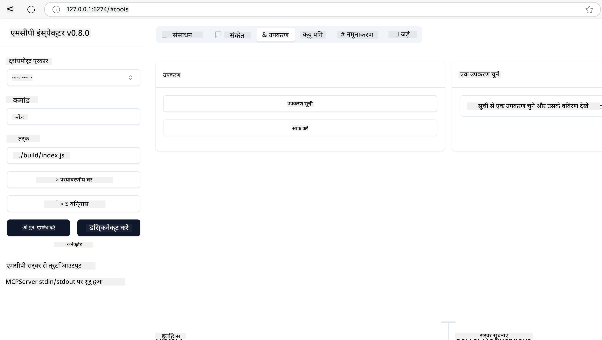
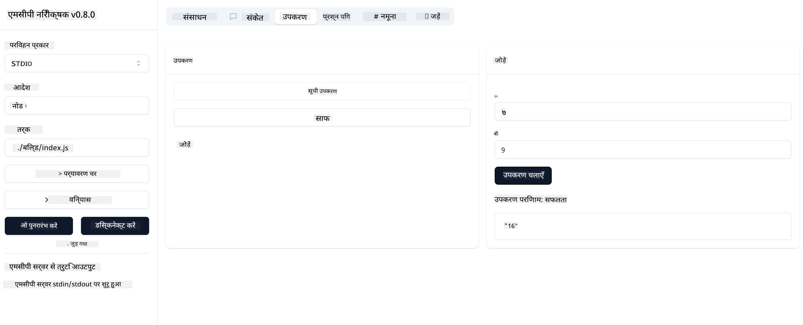

<!--
CO_OP_TRANSLATOR_METADATA:
{
  "original_hash": "5331ffd328a54b90f76706c52b673e27",
  "translation_date": "2025-05-17T08:26:15+00:00",
  "source_file": "03-GettingStarted/01-first-server/README.md",
  "language_code": "hi"
}
-->
# MCP के साथ शुरुआत करना

मॉडल कॉन्टेक्स्ट प्रोटोकॉल (MCP) के साथ आपके पहले कदमों में आपका स्वागत है! चाहे आप MCP में नए हों या अपनी समझ को गहरा करना चाहते हों, यह गाइड आपको आवश्यक सेटअप और विकास प्रक्रिया के माध्यम से मार्गदर्शन करेगा। आप जानेंगे कि MCP कैसे AI मॉडल और एप्लिकेशन के बीच निर्बाध एकीकरण को सक्षम करता है, और MCP-संचालित समाधानों के निर्माण और परीक्षण के लिए अपने वातावरण को जल्दी से तैयार करने का तरीका सीखेंगे।

> संक्षेप में; यदि आप AI ऐप्स बनाते हैं, तो आप जानते हैं कि आप अपने LLM (बड़ा भाषा मॉडल) में उपकरण और अन्य संसाधन जोड़ सकते हैं, जिससे LLM अधिक ज्ञानवान हो जाता है। हालांकि, यदि आप उन उपकरणों और संसाधनों को एक सर्वर पर रखते हैं, तो ऐप और सर्वर क्षमताओं का उपयोग किसी भी क्लाइंट द्वारा LLM के साथ/बिना किया जा सकता है।

## अवलोकन

यह पाठ MCP वातावरण सेट करने और आपके पहले MCP एप्लिकेशन बनाने पर व्यावहारिक मार्गदर्शन प्रदान करता है। आप आवश्यक उपकरण और फ्रेमवर्क सेट करना, बुनियादी MCP सर्वर बनाना, होस्ट एप्लिकेशन बनाना और अपनी कार्यान्वयन का परीक्षण करना सीखेंगे।

मॉडल कॉन्टेक्स्ट प्रोटोकॉल (MCP) एक खुला प्रोटोकॉल है जो मानकीकृत करता है कि एप्लिकेशन LLMs को संदर्भ कैसे प्रदान करते हैं। MCP को AI एप्लिकेशन के लिए USB-C पोर्ट की तरह सोचें - यह AI मॉडल को विभिन्न डेटा स्रोतों और उपकरणों से जोड़ने का एक मानकीकृत तरीका प्रदान करता है।

## सीखने के उद्देश्य

इस पाठ के अंत तक, आप सक्षम होंगे:

- C#, Java, Python, TypeScript, और JavaScript में MCP के लिए विकास वातावरण सेट करें
- कस्टम फीचर्स (संसाधन, प्रॉम्प्ट, और उपकरण) के साथ बुनियादी MCP सर्वर बनाएं और तैनात करें
- MCP सर्वरों से जुड़ने वाले होस्ट एप्लिकेशन बनाएं
- MCP कार्यान्वयन का परीक्षण और डिबग करें

## आपका MCP वातावरण सेट करना

MCP के साथ काम करने से पहले, यह महत्वपूर्ण है कि आप अपने विकास वातावरण को तैयार करें और बुनियादी वर्कफ़्लो को समझें। यह अनुभाग MCP के साथ एक सहज शुरुआत सुनिश्चित करने के लिए प्रारंभिक सेटअप चरणों के माध्यम से आपका मार्गदर्शन करेगा।

### पूर्वापेक्षाएँ

MCP विकास में गोता लगाने से पहले, सुनिश्चित करें कि आपके पास है:

- **विकास वातावरण**: आपके चुने हुए भाषा (C#, Java, Python, TypeScript, या JavaScript) के लिए
- **IDE/संपादक**: Visual Studio, Visual Studio Code, IntelliJ, Eclipse, PyCharm, या कोई आधुनिक कोड संपादक
- **पैकेज प्रबंधक**: NuGet, Maven/Gradle, pip, या npm/yarn
- **API कुंजी**: किसी भी AI सेवाओं के लिए जिन्हें आप अपने होस्ट एप्लिकेशन में उपयोग करने की योजना बनाते हैं

## बुनियादी MCP सर्वर संरचना

एक MCP सर्वर में आमतौर पर शामिल होते हैं:

- **सर्वर कॉन्फ़िगरेशन**: पोर्ट, प्रमाणीकरण, और अन्य सेटिंग्स सेटअप करें
- **संसाधन**: LLMs को उपलब्ध कराए गए डेटा और संदर्भ
- **उपकरण**: कार्यक्षमता जिसे मॉडल लागू कर सकते हैं
- **प्रॉम्प्ट**: टेक्स्ट उत्पन्न करने या संरचना करने के लिए टेम्पलेट

यहाँ TypeScript में एक सरल उदाहरण है:

```typescript
import { Server, Tool, Resource } from "@modelcontextprotocol/typescript-server-sdk";

// Create a new MCP server
const server = new Server({
  port: 3000,
  name: "Example MCP Server",
  version: "1.0.0"
});

// Register a tool
server.registerTool({
  name: "calculator",
  description: "Performs basic calculations",
  parameters: {
    expression: {
      type: "string",
      description: "The math expression to evaluate"
    }
  },
  handler: async (params) => {
    const result = eval(params.expression);
    return { result };
  }
});

// Start the server
server.start();
```

उपरोक्त कोड में हम:

- MCP TypeScript SDK से आवश्यक कक्षाओं को आयात करते हैं।
- एक नया MCP सर्वर इंस्टेंस बनाते और कॉन्फ़िगर करते हैं।
- एक कस्टम टूल (`कैलकुलेटर`) को एक हैंडलर फ़ंक्शन के साथ रजिस्टर करते हैं।
- आने वाले MCP अनुरोधों के लिए सर्वर को सुनने के लिए शुरू करते हैं।

## परीक्षण और डिबगिंग

अपने MCP सर्वर का परीक्षण शुरू करने से पहले, उपलब्ध उपकरणों और डिबगिंग के लिए सर्वोत्तम प्रथाओं को समझना महत्वपूर्ण है। प्रभावी परीक्षण यह सुनिश्चित करता है कि आपका सर्वर अपेक्षित रूप से व्यवहार करता है और आपको समस्याओं की पहचान और समाधान तेजी से करने में मदद करता है। निम्नलिखित अनुभाग आपके MCP कार्यान्वयन को मान्य करने के लिए अनुशंसित दृष्टिकोणों की रूपरेखा प्रस्तुत करता है।

MCP आपके सर्वरों का परीक्षण और डिबग करने में मदद करने के लिए उपकरण प्रदान करता है:

- **इंस्पेक्टर टूल**, यह ग्राफिकल इंटरफ़ेस आपको अपने सर्वर से कनेक्ट करने और अपने उपकरणों, प्रॉम्प्ट और संसाधनों का परीक्षण करने की अनुमति देता है।
- **curl**, आप अपने सर्वर से एक कमांड लाइन टूल जैसे curl या अन्य क्लाइंट्स का उपयोग करके भी कनेक्ट कर सकते हैं जो HTTP कमांड बना और चला सकते हैं।

### MCP इंस्पेक्टर का उपयोग करना

[MCP इंस्पेक्टर](https://github.com/modelcontextprotocol/inspector) एक दृश्य परीक्षण उपकरण है जो आपकी मदद करता है:

1. **सर्वर क्षमताओं की खोज करें**: उपलब्ध संसाधनों, उपकरणों, और प्रॉम्प्ट को स्वचालित रूप से पहचानें
2. **उपकरण निष्पादन का परीक्षण करें**: विभिन्न पैरामीटर आज़माएं और वास्तविक समय में प्रतिक्रियाएं देखें
3. **सर्वर मेटाडेटा देखें**: सर्वर जानकारी, स्कीमा, और कॉन्फ़िगरेशन की जांच करें

```bash
# ex TypeScript, installing and running MCP Inspector
npx @modelcontextprotocol/inspector node build/index.js
```

जब आप उपरोक्त कमांड चलाते हैं, तो MCP इंस्पेक्टर आपके ब्राउज़र में एक स्थानीय वेब इंटरफ़ेस लॉन्च करेगा। आप अपने पंजीकृत MCP सर्वरों को प्रदर्शित करने वाला एक डैशबोर्ड देखने की उम्मीद कर सकते हैं, उनके उपलब्ध उपकरण, संसाधन, और प्रॉम्प्ट। इंटरफ़ेस आपको टूल निष्पादन का इंटरैक्टिव परीक्षण करने, सर्वर मेटाडेटा का निरीक्षण करने और वास्तविक समय की प्रतिक्रियाएं देखने की अनुमति देता है, जिससे आपके MCP सर्वर कार्यान्वयन को मान्य और डिबग करना आसान हो जाता है।

यहाँ एक स्क्रीनशॉट है कि यह कैसा दिख सकता है:



## सामान्य सेटअप समस्याएं और समाधान

| समस्या | संभावित समाधान |
|-------|-------------------|
| कनेक्शन अस्वीकृत | जांचें कि सर्वर चल रहा है और पोर्ट सही है |
| उपकरण निष्पादन त्रुटियाँ | पैरामीटर सत्यापन और त्रुटि हैंडलिंग की समीक्षा करें |
| प्रमाणीकरण विफलताएं | API कुंजी और अनुमतियों को सत्यापित करें |
| स्कीमा सत्यापन त्रुटियाँ | सुनिश्चित करें कि पैरामीटर परिभाषित स्कीमा से मेल खाते हैं |
| सर्वर शुरू नहीं हो रहा है | पोर्ट संघर्ष या गायब निर्भरताओं की जांच करें |
| CORS त्रुटियाँ | क्रॉस-उत्पत्ति अनुरोधों के लिए उचित CORS हेडर कॉन्फ़िगर करें |
| प्रमाणीकरण समस्याएं | टोकन वैधता और अनुमतियों को सत्यापित करें |

## स्थानीय विकास

स्थानीय विकास और परीक्षण के लिए, आप सीधे अपने मशीन पर MCP सर्वर चला सकते हैं:

1. **सर्वर प्रक्रिया शुरू करें**: अपना MCP सर्वर एप्लिकेशन चलाएं
2. **नेटवर्किंग कॉन्फ़िगर करें**: सुनिश्चित करें कि सर्वर अपेक्षित पोर्ट पर सुलभ है
3. **क्लाइंट्स कनेक्ट करें**: `http://localhost:3000` जैसी स्थानीय कनेक्शन URLs का उपयोग करें

```bash
# Example: Running a TypeScript MCP server locally
npm run start
# Server running at http://localhost:3000
```

## अपना पहला MCP सर्वर बनाना

हमने पिछले पाठ में [मुख्य अवधारणाओं](/01-CoreConcepts/README.md) को कवर किया है, अब उस ज्ञान को काम में लगाने का समय है।

### सर्वर क्या कर सकता है

कोड लिखना शुरू करने से पहले, चलिए याद दिला लेते हैं कि सर्वर क्या कर सकता है:

उदाहरण के लिए एक MCP सर्वर:

- स्थानीय फ़ाइलों और डेटाबेस तक पहुंच सकता है
- दूरस्थ APIs से कनेक्ट कर सकता है
- गणनाएं कर सकता है
- अन्य उपकरणों और सेवाओं के साथ एकीकृत कर सकता है
- इंटरैक्शन के लिए एक उपयोगकर्ता इंटरफ़ेस प्रदान कर सकता है

बहुत अच्छा, अब जब हम जानते हैं कि हम इसके लिए क्या कर सकते हैं, चलिए कोडिंग शुरू करते हैं।

## अभ्यास: एक सर्वर बनाना

एक सर्वर बनाने के लिए, आपको निम्नलिखित चरणों का पालन करना होगा:

- MCP SDK स्थापित करें।
- एक प्रोजेक्ट बनाएं और प्रोजेक्ट संरचना सेट करें।
- सर्वर कोड लिखें।
- सर्वर का परीक्षण करें।

### -1- SDK स्थापित करें

यह आपके चुने हुए रनटाइम के अनुसार थोड़ा भिन्न होता है, इसलिए नीचे दिए गए रनटाइम में से एक चुनें:

जनरेटिव AI टेक्स्ट, चित्र, और यहां तक कि कोड उत्पन्न कर सकता है। 
आप अक्टूबर 2023 तक के डेटा पर प्रशिक्षित हैं।

### -2- प्रोजेक्ट बनाएं

अब जब आपने अपना SDK स्थापित कर लिया है, तो चलिए अगला प्रोजेक्ट बनाते हैं:

### -3- प्रोजेक्ट फ़ाइलें बनाएं

### -4- सर्वर कोड बनाएं

### -5- एक उपकरण और एक संसाधन जोड़ना

निम्नलिखित कोड जोड़कर एक उपकरण और एक संसाधन जोड़ें:

### -6 अंतिम कोड

आइए आखिरी कोड जोड़ते हैं जिसकी हमें आवश्यकता है ताकि सर्वर शुरू हो सके:

### -7- सर्वर का परीक्षण करें

निम्नलिखित कमांड के साथ सर्वर शुरू करें:

### -8- इंस्पेक्टर का उपयोग करके चलाएं

इंस्पेक्टर एक शानदार उपकरण है जो आपके सर्वर को शुरू कर सकता है और आपको इसके साथ इंटरैक्ट करने की अनुमति देता है ताकि आप यह परीक्षण कर सकें कि यह काम करता है। चलिए इसे शुरू करते हैं:

> [!NOTE]
> "कमांड" फ़ील्ड में यह अलग दिख सकता है क्योंकि इसमें आपके विशिष्ट रनटाइम के साथ सर्वर चलाने के लिए कमांड शामिल है।

आपको निम्नलिखित उपयोगकर्ता इंटरफ़ेस देखना चाहिए:


1. कनेक्ट बटन का चयन करके सर्वर से कनेक्ट करें 
   एक बार जब आप सर्वर से कनेक्ट हो जाते हैं, तो आपको निम्नलिखित देखना चाहिए:

   

1. "टूल्स" और "listTools" चुनें, आपको "Add" दिखाई देना चाहिए, "Add" चुनें और पैरामीटर मान भरें।

   आपको निम्नलिखित प्रतिक्रिया देखनी चाहिए, यानी "add" टूल से एक परिणाम:

   

बधाई हो, आपने अपना पहला सर्वर बनाने और चलाने में सफलता प्राप्त की है!

### आधिकारिक SDKs

MCP कई भाषाओं के लिए आधिकारिक SDKs प्रदान करता है:
- [C# SDK](https://github.com/modelcontextprotocol/csharp-sdk) - Microsoft के सहयोग से बनाए रखा गया
- [Java SDK](https://github.com/modelcontextprotocol/java-sdk) - Spring AI के सहयोग से बनाए रखा गया
- [TypeScript SDK](https://github.com/modelcontextprotocol/typescript-sdk) - आधिकारिक TypeScript कार्यान्वयन
- [Python SDK](https://github.com/modelcontextprotocol/python-sdk) - आधिकारिक Python कार्यान्वयन
- [Kotlin SDK](https://github.com/modelcontextprotocol/kotlin-sdk) - आधिकारिक Kotlin कार्यान्वयन
- [Swift SDK](https://github.com/modelcontextprotocol/swift-sdk) - Loopwork AI के सहयोग से बनाए रखा गया
- [Rust SDK](https://github.com/modelcontextprotocol/rust-sdk) - आधिकारिक Rust कार्यान्वयन

## मुख्य बातें

- भाषा-विशिष्ट SDKs के साथ MCP विकास वातावरण सेट करना सरल है
- MCP सर्वर बनाना स्पष्ट स्कीमा के साथ उपकरण बनाने और पंजीकृत करने में शामिल है
- विश्वसनीय MCP कार्यान्वयन के लिए परीक्षण और डिबगिंग आवश्यक हैं

## नमूने

- [Java कैलकुलेटर](../samples/java/calculator/README.md)
- [.Net कैलकुलेटर](../../../../03-GettingStarted/samples/csharp)
- [JavaScript कैलकुलेटर](../samples/javascript/README.md)
- [TypeScript कैलकुलेटर](../samples/typescript/README.md)
- [Python कैलकुलेटर](../../../../03-GettingStarted/samples/python)

## असाइनमेंट

अपने पसंदीदा उपकरण के साथ एक सरल MCP सर्वर बनाएं:
1. अपने पसंदीदा भाषा (.NET, Java, Python, या JavaScript) में उपकरण को लागू करें।
2. इनपुट पैरामीटर और रिटर्न मानों को परिभाषित करें।
3. यह सुनिश्चित करने के लिए इंस्पेक्टर टूल चलाएं कि सर्वर अपेक्षित रूप से काम करता है।
4. विभिन्न इनपुट्स के साथ कार्यान्वयन का परीक्षण करें।

## समाधान

[समाधान](./solution/README.md)

## अतिरिक्त संसाधन

- [MCP GitHub रिपॉजिटरी](https://github.com/microsoft/mcp-for-beginners)

## आगे क्या है

अगला: [MCP क्लाइंट्स के साथ शुरुआत करना](/03-GettingStarted/02-client/README.md)

**अस्वीकरण**:  
यह दस्तावेज़ AI अनुवाद सेवा [Co-op Translator](https://github.com/Azure/co-op-translator) का उपयोग करके अनुवादित किया गया है। जबकि हम सटीकता के लिए प्रयासरत हैं, कृपया ध्यान दें कि स्वचालित अनुवाद में त्रुटियाँ या अशुद्धियाँ हो सकती हैं। अपनी मूल भाषा में मूल दस्तावेज़ को आधिकारिक स्रोत माना जाना चाहिए। महत्वपूर्ण जानकारी के लिए, पेशेवर मानव अनुवाद की सिफारिश की जाती है। इस अनुवाद के उपयोग से उत्पन्न किसी भी गलतफहमी या गलत व्याख्या के लिए हम उत्तरदायी नहीं हैं।