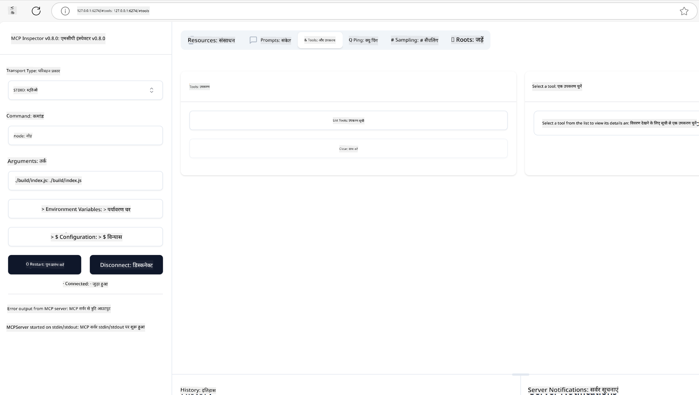
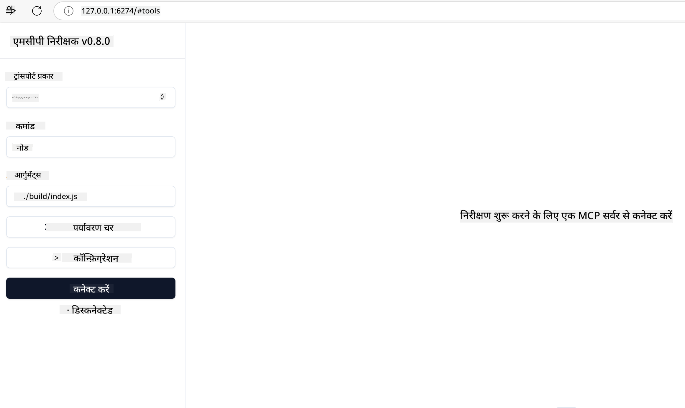
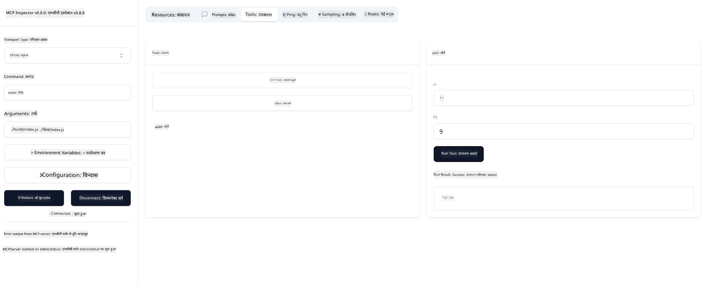

<!--
CO_OP_TRANSLATOR_METADATA:
{
  "original_hash": "dd0fdbbbebbef2b6b179ceba21d82ed2",
  "translation_date": "2025-07-16T22:51:16+00:00",
  "source_file": "03-GettingStarted/01-first-server/README.md",
  "language_code": "hi"
}
-->
# MCP के साथ शुरुआत

Model Context Protocol (MCP) के साथ आपके पहले कदमों में आपका स्वागत है! चाहे आप MCP में नए हों या अपनी समझ को गहरा करना चाहते हों, यह गाइड आपको आवश्यक सेटअप और विकास प्रक्रिया के माध्यम से मार्गदर्शन करेगा। आप जानेंगे कि MCP कैसे AI मॉडल और एप्लिकेशन के बीच सहज एकीकरण सक्षम करता है, और MCP-संचालित समाधानों के निर्माण और परीक्षण के लिए अपने वातावरण को जल्दी से तैयार करना कैसे है।

> TLDR; यदि आप AI ऐप्स बनाते हैं, तो आप जानते हैं कि आप अपने LLM (large language model) में टूल्स और अन्य संसाधन जोड़ सकते हैं, जिससे LLM अधिक ज्ञानवान बन जाता है। हालांकि, यदि आप उन टूल्स और संसाधनों को किसी सर्वर पर रखते हैं, तो ऐप और सर्वर की क्षमताओं का उपयोग किसी भी क्लाइंट द्वारा किया जा सकता है, चाहे उसके पास LLM हो या न हो।

## अवलोकन

यह पाठ MCP वातावरण सेटअप करने और अपने पहले MCP एप्लिकेशन बनाने के लिए व्यावहारिक मार्गदर्शन प्रदान करता है। आप सीखेंगे कि आवश्यक टूल्स और फ्रेमवर्क कैसे सेटअप करें, बेसिक MCP सर्वर कैसे बनाएं, होस्ट एप्लिकेशन कैसे बनाएं, और अपनी इम्प्लीमेंटेशन का परीक्षण कैसे करें।

Model Context Protocol (MCP) एक खुला प्रोटोकॉल है जो यह मानकीकृत करता है कि एप्लिकेशन LLMs को संदर्भ कैसे प्रदान करते हैं। MCP को AI एप्लिकेशन के लिए USB-C पोर्ट की तरह सोचें - यह AI मॉडल को विभिन्न डेटा स्रोतों और टूल्स से जोड़ने का एक मानकीकृत तरीका प्रदान करता है।

## सीखने के उद्देश्य

इस पाठ के अंत तक, आप सक्षम होंगे:

- C#, Java, Python, TypeScript, और JavaScript में MCP के लिए विकास वातावरण सेटअप करना
- कस्टम फीचर्स (संसाधन, प्रॉम्प्ट, और टूल्स) के साथ बेसिक MCP सर्वर बनाना और तैनात करना
- MCP सर्वरों से कनेक्ट करने वाले होस्ट एप्लिकेशन बनाना
- MCP इम्प्लीमेंटेशन का परीक्षण और डिबग करना

## अपने MCP वातावरण की सेटिंग

MCP के साथ काम शुरू करने से पहले, अपने विकास वातावरण को तैयार करना और मूल कार्यप्रवाह को समझना महत्वपूर्ण है। यह अनुभाग आपको प्रारंभिक सेटअप चरणों के माध्यम से मार्गदर्शन करेगा ताकि MCP के साथ एक सहज शुरुआत सुनिश्चित हो सके।

### आवश्यकताएँ

MCP विकास में डूबने से पहले, सुनिश्चित करें कि आपके पास है:

- **विकास वातावरण**: आपकी चुनी हुई भाषा (C#, Java, Python, TypeScript, या JavaScript) के लिए
- **IDE/एडिटर**: Visual Studio, Visual Studio Code, IntelliJ, Eclipse, PyCharm, या कोई आधुनिक कोड एडिटर
- **पैकेज मैनेजर**: NuGet, Maven/Gradle, pip, या npm/yarn
- **API कुंजी**: उन किसी भी AI सेवाओं के लिए जिन्हें आप अपने होस्ट एप्लिकेशन में उपयोग करने की योजना बना रहे हैं

## बेसिक MCP सर्वर संरचना

एक MCP सर्वर आमतौर पर शामिल होता है:

- **सर्वर कॉन्फ़िगरेशन**: पोर्ट, प्रमाणीकरण, और अन्य सेटिंग्स सेटअप करना
- **संसाधन**: LLMs को उपलब्ध कराए गए डेटा और संदर्भ
- **टूल्स**: वे कार्य जो मॉडल्स कॉल कर सकते हैं
- **प्रॉम्प्ट्स**: टेक्स्ट जनरेट करने या संरचित करने के लिए टेम्पलेट्स

यहाँ TypeScript में एक सरल उदाहरण है:

```typescript
import { Server, Tool, Resource } from "@modelcontextprotocol/typescript-server-sdk";

// Create a new MCP server
const server = new Server({
  port: 3000,
  name: "Example MCP Server",
  version: "1.0.0"
});

// Register a tool
server.registerTool({
  name: "calculator",
  description: "Performs basic calculations",
  parameters: {
    expression: {
      type: "string",
      description: "The math expression to evaluate"
    }
  },
  handler: async (params) => {
    const result = eval(params.expression);
    return { result };
  }
});

// Start the server
server.start();
```

पिछले कोड में हमने:

- MCP TypeScript SDK से आवश्यक क्लासेस इम्पोर्ट किए।
- एक नया MCP सर्वर इंस्टेंस बनाया और कॉन्फ़िगर किया।
- एक कस्टम टूल (`calculator`) को हैंडलर फ़ंक्शन के साथ रजिस्टर किया।
- MCP अनुरोधों के लिए सर्वर को सुनने के लिए शुरू किया।

## परीक्षण और डिबगिंग

अपने MCP सर्वर का परीक्षण शुरू करने से पहले, उपलब्ध टूल्स और डिबगिंग के सर्वोत्तम अभ्यासों को समझना महत्वपूर्ण है। प्रभावी परीक्षण यह सुनिश्चित करता है कि आपका सर्वर अपेक्षित व्यवहार करता है और आपको जल्दी से समस्याओं की पहचान और समाधान करने में मदद करता है। निम्नलिखित अनुभाग आपकी MCP इम्प्लीमेंटेशन को मान्य करने के लिए अनुशंसित दृष्टिकोणों को रेखांकित करता है।

MCP आपको अपने सर्वरों का परीक्षण और डिबग करने में मदद करने के लिए टूल्स प्रदान करता है:

- **Inspector tool**, यह ग्राफिकल इंटरफ़ेस आपको अपने सर्वर से कनेक्ट करने और अपने टूल्स, प्रॉम्प्ट्स और संसाधनों का परीक्षण करने की अनुमति देता है।
- **curl**, आप curl जैसे कमांड लाइन टूल या अन्य क्लाइंट्स का उपयोग करके भी अपने सर्वर से कनेक्ट कर सकते हैं जो HTTP कमांड बना और चला सकते हैं।

### MCP Inspector का उपयोग

[MCP Inspector](https://github.com/modelcontextprotocol/inspector) एक विज़ुअल परीक्षण टूल है जो आपकी मदद करता है:

1. **सर्वर क्षमताओं की खोज करें**: उपलब्ध संसाधन, टूल्स, और प्रॉम्प्ट्स को स्वचालित रूप से पहचानें
2. **टूल निष्पादन का परीक्षण करें**: विभिन्न पैरामीटर आज़माएं और रियल-टाइम में प्रतिक्रियाएं देखें
3. **सर्वर मेटाडेटा देखें**: सर्वर जानकारी, स्कीमास, और कॉन्फ़िगरेशन की जांच करें

```bash
# ex TypeScript, installing and running MCP Inspector
npx @modelcontextprotocol/inspector node build/index.js
```

जब आप ऊपर दिए गए कमांड चलाते हैं, तो MCP Inspector आपके ब्राउज़र में एक स्थानीय वेब इंटरफ़ेस लॉन्च करेगा। आप एक डैशबोर्ड देखेंगे जिसमें आपके रजिस्टर्ड MCP सर्वर, उनके उपलब्ध टूल्स, संसाधन, और प्रॉम्प्ट्स दिखेंगे। यह इंटरफ़ेस आपको इंटरैक्टिव रूप से टूल निष्पादन का परीक्षण करने, सर्वर मेटाडेटा का निरीक्षण करने, और रियल-टाइम प्रतिक्रियाएं देखने की अनुमति देता है, जिससे आपके MCP सर्वर इम्प्लीमेंटेशन को मान्य और डिबग करना आसान हो जाता है।

यहाँ इसका एक स्क्रीनशॉट है:



## सामान्य सेटअप समस्याएँ और समाधान

| समस्या | संभावित समाधान |
|-------|-------------------|
| कनेक्शन अस्वीकृत | जांचें कि सर्वर चल रहा है और पोर्ट सही है |
| टूल निष्पादन त्रुटियाँ | पैरामीटर सत्यापन और त्रुटि हैंडलिंग की समीक्षा करें |
| प्रमाणीकरण विफलताएँ | API कुंजी और अनुमतियाँ सत्यापित करें |
| स्कीमा सत्यापन त्रुटियाँ | सुनिश्चित करें कि पैरामीटर परिभाषित स्कीमा से मेल खाते हैं |
| सर्वर शुरू नहीं हो रहा | पोर्ट संघर्ष या लापता निर्भरताओं की जांच करें |
| CORS त्रुटियाँ | क्रॉस-ओरिजिन अनुरोधों के लिए उचित CORS हेडर कॉन्फ़िगर करें |
| प्रमाणीकरण समस्याएँ | टोकन वैधता और अनुमतियाँ सत्यापित करें |

## स्थानीय विकास

स्थानीय विकास और परीक्षण के लिए, आप सीधे अपने मशीन पर MCP सर्वर चला सकते हैं:

1. **सर्वर प्रक्रिया शुरू करें**: अपना MCP सर्वर एप्लिकेशन चलाएं
2. **नेटवर्किंग कॉन्फ़िगर करें**: सुनिश्चित करें कि सर्वर अपेक्षित पोर्ट पर सुलभ है
3. **क्लाइंट्स कनेक्ट करें**: स्थानीय कनेक्शन URL जैसे `http://localhost:3000` का उपयोग करें

```bash
# Example: Running a TypeScript MCP server locally
npm run start
# Server running at http://localhost:3000
```

## अपना पहला MCP सर्वर बनाना

हमने पिछले पाठ में [Core concepts](/01-CoreConcepts/README.md) को कवर किया है, अब उस ज्ञान को काम में लाने का समय है।

### सर्वर क्या कर सकता है

कोड लिखना शुरू करने से पहले, आइए याद दिलाएं कि एक सर्वर क्या कर सकता है:

एक MCP सर्वर उदाहरण के लिए कर सकता है:

- स्थानीय फाइलों और डेटाबेस तक पहुंच
- रिमोट API से कनेक्ट करना
- गणनाएँ करना
- अन्य टूल्स और सेवाओं के साथ एकीकरण
- इंटरैक्शन के लिए यूजर इंटरफ़ेस प्रदान करना

बहुत बढ़िया, अब जब हमें पता है कि हम इसके लिए क्या कर सकते हैं, तो चलिए कोडिंग शुरू करते हैं।

## अभ्यास: एक सर्वर बनाना

सर्वर बनाने के लिए, आपको निम्नलिखित चरणों का पालन करना होगा:

- MCP SDK इंस्टॉल करें।
- एक प्रोजेक्ट बनाएं और प्रोजेक्ट संरचना सेटअप करें।
- सर्वर कोड लिखें।
- सर्वर का परीक्षण करें।

### -1- SDK इंस्टॉल करें

यह आपके चुने हुए रनटाइम के अनुसार थोड़ा अलग होता है, इसलिए नीचे दिए गए रनटाइम में से एक चुनें:

> [!NOTE]
> Python के लिए, हम पहले प्रोजेक्ट संरचना बनाएंगे और फिर निर्भरताएँ इंस्टॉल करेंगे।

### TypeScript

```sh
npm install @modelcontextprotocol/sdk zod
npm install -D @types/node typescript
```

### Python

```sh
# Create project dir
mkdir calculator-server
cd calculator-server
# Open the folder in Visual Studio Code - Skip this if you are using a different IDE
code .
```

### .NET

```sh
dotnet new console -n McpCalculatorServer
cd McpCalculatorServer
```

### Java

Java के लिए, एक Spring Boot प्रोजेक्ट बनाएं:

```bash
curl https://start.spring.io/starter.zip \
  -d dependencies=web \
  -d javaVersion=21 \
  -d type=maven-project \
  -d groupId=com.example \
  -d artifactId=calculator-server \
  -d name=McpServer \
  -d packageName=com.microsoft.mcp.sample.server \
  -o calculator-server.zip
```

ज़िप फ़ाइल निकालें:

```bash
unzip calculator-server.zip -d calculator-server
cd calculator-server
# optional remove the unused test
rm -rf src/test/java
```

अपने *pom.xml* फ़ाइल में निम्नलिखित पूर्ण कॉन्फ़िगरेशन जोड़ें:

```xml
<?xml version="1.0" encoding="UTF-8"?>
<project xmlns="http://maven.apache.org/POM/4.0.0"
    xmlns:xsi="http://www.w3.org/2001/XMLSchema-instance"
    xsi:schemaLocation="http://maven.apache.org/POM/4.0.0 http://maven.apache.org/xsd/maven-4.0.0.xsd">
    <modelVersion>4.0.0</modelVersion>
    
    <!-- Spring Boot parent for dependency management -->
    <parent>
        <groupId>org.springframework.boot</groupId>
        <artifactId>spring-boot-starter-parent</artifactId>
        <version>3.5.0</version>
        <relativePath />
    </parent>

    <!-- Project coordinates -->
    <groupId>com.example</groupId>
    <artifactId>calculator-server</artifactId>
    <version>0.0.1-SNAPSHOT</version>
    <name>Calculator Server</name>
    <description>Basic calculator MCP service for beginners</description>

    <!-- Properties -->
    <properties>
        <java.version>21</java.version>
        <maven.compiler.source>21</maven.compiler.source>
        <maven.compiler.target>21</maven.compiler.target>
    </properties>

    <!-- Spring AI BOM for version management -->
    <dependencyManagement>
        <dependencies>
            <dependency>
                <groupId>org.springframework.ai</groupId>
                <artifactId>spring-ai-bom</artifactId>
                <version>1.0.0-SNAPSHOT</version>
                <type>pom</type>
                <scope>import</scope>
            </dependency>
        </dependencies>
    </dependencyManagement>

    <!-- Dependencies -->
    <dependencies>
        <dependency>
            <groupId>org.springframework.ai</groupId>
            <artifactId>spring-ai-starter-mcp-server-webflux</artifactId>
        </dependency>
        <dependency>
            <groupId>org.springframework.boot</groupId>
            <artifactId>spring-boot-starter-actuator</artifactId>
        </dependency>
        <dependency>
         <groupId>org.springframework.boot</groupId>
         <artifactId>spring-boot-starter-test</artifactId>
         <scope>test</scope>
      </dependency>
    </dependencies>

    <!-- Build configuration -->
    <build>
        <plugins>
            <plugin>
                <groupId>org.springframework.boot</groupId>
                <artifactId>spring-boot-maven-plugin</artifactId>
            </plugin>
            <plugin>
                <groupId>org.apache.maven.plugins</groupId>
                <artifactId>maven-compiler-plugin</artifactId>
                <configuration>
                    <release>21</release>
                </configuration>
            </plugin>
        </plugins>
    </build>

    <!-- Repositories for Spring AI snapshots -->
    <repositories>
        <repository>
            <id>spring-milestones</id>
            <name>Spring Milestones</name>
            <url>https://repo.spring.io/milestone</url>
            <snapshots>
                <enabled>false</enabled>
            </snapshots>
        </repository>
        <repository>
            <id>spring-snapshots</id>
            <name>Spring Snapshots</name>
            <url>https://repo.spring.io/snapshot</url>
            <releases>
                <enabled>false</enabled>
            </releases>
        </repository>
    </repositories>
</project>
```

### TypeScript

```sh
mkdir src
npm install -y
```

### Python

```sh
# Create a virtual env and install dependencies
python -m venv venv
venv\Scripts\activate
pip install "mcp[cli]"
```

### Java

```bash
cd calculator-server
./mvnw clean install -DskipTests
```

### TypeScript

निम्नलिखित सामग्री के साथ *package.json* बनाएं:

```json
{
   "type": "module",
   "bin": {
     "weather": "./build/index.js"
   },
   "scripts": {
     "build": "tsc && node build/index.js"
   },
   "files": [
     "build"
   ]
}
```

निम्नलिखित सामग्री के साथ *tsconfig.json* बनाएं:

```json
{
  "compilerOptions": {
    "target": "ES2022",
    "module": "Node16",
    "moduleResolution": "Node16",
    "outDir": "./build",
    "rootDir": "./src",
    "strict": true,
    "esModuleInterop": true,
    "skipLibCheck": true,
    "forceConsistentCasingInFileNames": true
  },
  "include": ["src/**/*"],
  "exclude": ["node_modules"]
}
```

### Python

*server.py* नामक फ़ाइल बनाएं
```sh
touch server.py
```

### .NET

आवश्यक NuGet पैकेज इंस्टॉल करें:

```sh
dotnet add package ModelContextProtocol --prerelease
dotnet add package Microsoft.Extensions.Hosting
```

### Java

Java Spring Boot प्रोजेक्ट के लिए, प्रोजेक्ट संरचना स्वचालित रूप से बन जाती है।

### TypeScript

*index.ts* नामक फ़ाइल बनाएं और निम्नलिखित कोड जोड़ें:

```typescript
import { McpServer, ResourceTemplate } from "@modelcontextprotocol/sdk/server/mcp.js";
import { StdioServerTransport } from "@modelcontextprotocol/sdk/server/stdio.js";
import { z } from "zod";
 
// Create an MCP server
const server = new McpServer({
  name: "Demo",
  version: "1.0.0"
});
```

अब आपके पास एक सर्वर है, लेकिन यह ज्यादा कुछ नहीं करता, इसे ठीक करते हैं।

### Python

```python
# server.py
from mcp.server.fastmcp import FastMCP

# Create an MCP server
mcp = FastMCP("Demo")
```

### .NET

```csharp
using Microsoft.Extensions.DependencyInjection;
using Microsoft.Extensions.Hosting;
using Microsoft.Extensions.Logging;
using ModelContextProtocol.Server;
using System.ComponentModel;

var builder = Host.CreateApplicationBuilder(args);
builder.Logging.AddConsole(consoleLogOptions =>
{
    // Configure all logs to go to stderr
    consoleLogOptions.LogToStandardErrorThreshold = LogLevel.Trace;
});

builder.Services
    .AddMcpServer()
    .WithStdioServerTransport()
    .WithToolsFromAssembly();
await builder.Build().RunAsync();

// add features
```

### Java

Java के लिए, कोर सर्वर कंपोनेंट बनाएं। सबसे पहले, मुख्य एप्लिकेशन क्लास को संशोधित करें:

*src/main/java/com/microsoft/mcp/sample/server/McpServerApplication.java*:

```java
package com.microsoft.mcp.sample.server;

import org.springframework.ai.tool.ToolCallbackProvider;
import org.springframework.ai.tool.method.MethodToolCallbackProvider;
import org.springframework.boot.SpringApplication;
import org.springframework.boot.autoconfigure.SpringBootApplication;
import org.springframework.context.annotation.Bean;
import com.microsoft.mcp.sample.server.service.CalculatorService;

@SpringBootApplication
public class McpServerApplication {

    public static void main(String[] args) {
        SpringApplication.run(McpServerApplication.class, args);
    }
    
    @Bean
    public ToolCallbackProvider calculatorTools(CalculatorService calculator) {
        return MethodToolCallbackProvider.builder().toolObjects(calculator).build();
    }
}
```

कैलकुलेटर सेवा बनाएं *src/main/java/com/microsoft/mcp/sample/server/service/CalculatorService.java*:

```java
package com.microsoft.mcp.sample.server.service;

import org.springframework.ai.tool.annotation.Tool;
import org.springframework.stereotype.Service;

/**
 * Service for basic calculator operations.
 * This service provides simple calculator functionality through MCP.
 */
@Service
public class CalculatorService {

    /**
     * Add two numbers
     * @param a The first number
     * @param b The second number
     * @return The sum of the two numbers
     */
    @Tool(description = "Add two numbers together")
    public String add(double a, double b) {
        double result = a + b;
        return formatResult(a, "+", b, result);
    }

    /**
     * Subtract one number from another
     * @param a The number to subtract from
     * @param b The number to subtract
     * @return The result of the subtraction
     */
    @Tool(description = "Subtract the second number from the first number")
    public String subtract(double a, double b) {
        double result = a - b;
        return formatResult(a, "-", b, result);
    }

    /**
     * Multiply two numbers
     * @param a The first number
     * @param b The second number
     * @return The product of the two numbers
     */
    @Tool(description = "Multiply two numbers together")
    public String multiply(double a, double b) {
        double result = a * b;
        return formatResult(a, "*", b, result);
    }

    /**
     * Divide one number by another
     * @param a The numerator
     * @param b The denominator
     * @return The result of the division
     */
    @Tool(description = "Divide the first number by the second number")
    public String divide(double a, double b) {
        if (b == 0) {
            return "Error: Cannot divide by zero";
        }
        double result = a / b;
        return formatResult(a, "/", b, result);
    }

    /**
     * Calculate the power of a number
     * @param base The base number
     * @param exponent The exponent
     * @return The result of raising the base to the exponent
     */
    @Tool(description = "Calculate the power of a number (base raised to an exponent)")
    public String power(double base, double exponent) {
        double result = Math.pow(base, exponent);
        return formatResult(base, "^", exponent, result);
    }

    /**
     * Calculate the square root of a number
     * @param number The number to find the square root of
     * @return The square root of the number
     */
    @Tool(description = "Calculate the square root of a number")
    public String squareRoot(double number) {
        if (number < 0) {
            return "Error: Cannot calculate square root of a negative number";
        }
        double result = Math.sqrt(number);
        return String.format("√%.2f = %.2f", number, result);
    }

    /**
     * Calculate the modulus (remainder) of division
     * @param a The dividend
     * @param b The divisor
     * @return The remainder of the division
     */
    @Tool(description = "Calculate the remainder when one number is divided by another")
    public String modulus(double a, double b) {
        if (b == 0) {
            return "Error: Cannot divide by zero";
        }
        double result = a % b;
        return formatResult(a, "%", b, result);
    }

    /**
     * Calculate the absolute value of a number
     * @param number The number to find the absolute value of
     * @return The absolute value of the number
     */
    @Tool(description = "Calculate the absolute value of a number")
    public String absolute(double number) {
        double result = Math.abs(number);
        return String.format("|%.2f| = %.2f", number, result);
    }

    /**
     * Get help about available calculator operations
     * @return Information about available operations
     */
    @Tool(description = "Get help about available calculator operations")
    public String help() {
        return "Basic Calculator MCP Service\n\n" +
               "Available operations:\n" +
               "1. add(a, b) - Adds two numbers\n" +
               "2. subtract(a, b) - Subtracts the second number from the first\n" +
               "3. multiply(a, b) - Multiplies two numbers\n" +
               "4. divide(a, b) - Divides the first number by the second\n" +
               "5. power(base, exponent) - Raises a number to a power\n" +
               "6. squareRoot(number) - Calculates the square root\n" + 
               "7. modulus(a, b) - Calculates the remainder of division\n" +
               "8. absolute(number) - Calculates the absolute value\n\n" +
               "Example usage: add(5, 3) will return 5 + 3 = 8";
    }

    /**
     * Format the result of a calculation
     */
    private String formatResult(double a, String operator, double b, double result) {
        return String.format("%.2f %s %.2f = %.2f", a, operator, b, result);
    }
}
```

**प्रोडक्शन-तैयार सेवा के लिए वैकल्पिक कंपोनेंट्स:**

स्टार्टअप कॉन्फ़िगरेशन बनाएं *src/main/java/com/microsoft/mcp/sample/server/config/StartupConfig.java*:

```java
package com.microsoft.mcp.sample.server.config;

import org.springframework.boot.CommandLineRunner;
import org.springframework.context.annotation.Bean;
import org.springframework.context.annotation.Configuration;

@Configuration
public class StartupConfig {
    
    @Bean
    public CommandLineRunner startupInfo() {
        return args -> {
            System.out.println("\n" + "=".repeat(60));
            System.out.println("Calculator MCP Server is starting...");
            System.out.println("SSE endpoint: http://localhost:8080/sse");
            System.out.println("Health check: http://localhost:8080/actuator/health");
            System.out.println("=".repeat(60) + "\n");
        };
    }
}
```

हेल्थ कंट्रोलर बनाएं *src/main/java/com/microsoft/mcp/sample/server/controller/HealthController.java*:

```java
package com.microsoft.mcp.sample.server.controller;

import org.springframework.http.ResponseEntity;
import org.springframework.web.bind.annotation.GetMapping;
import org.springframework.web.bind.annotation.RestController;
import java.time.LocalDateTime;
import java.util.HashMap;
import java.util.Map;

@RestController
public class HealthController {
    
    @GetMapping("/health")
    public ResponseEntity<Map<String, Object>> healthCheck() {
        Map<String, Object> response = new HashMap<>();
        response.put("status", "UP");
        response.put("timestamp", LocalDateTime.now().toString());
        response.put("service", "Calculator MCP Server");
        return ResponseEntity.ok(response);
    }
}
```

एक्सेप्शन हैंडलर बनाएं *src/main/java/com/microsoft/mcp/sample/server/exception/GlobalExceptionHandler.java*:

```java
package com.microsoft.mcp.sample.server.exception;

import org.springframework.http.HttpStatus;
import org.springframework.http.ResponseEntity;
import org.springframework.web.bind.annotation.ExceptionHandler;
import org.springframework.web.bind.annotation.RestControllerAdvice;

@RestControllerAdvice
public class GlobalExceptionHandler {

    @ExceptionHandler(IllegalArgumentException.class)
    public ResponseEntity<ErrorResponse> handleIllegalArgumentException(IllegalArgumentException ex) {
        ErrorResponse error = new ErrorResponse(
            "Invalid_Input", 
            "Invalid input parameter: " + ex.getMessage());
        return new ResponseEntity<>(error, HttpStatus.BAD_REQUEST);
    }

    public static class ErrorResponse {
        private String code;
        private String message;

        public ErrorResponse(String code, String message) {
            this.code = code;
            this.message = message;
        }

        // Getters
        public String getCode() { return code; }
        public String getMessage() { return message; }
    }
}
```

कस्टम बैनर बनाएं *src/main/resources/banner.txt*:

```text
_____      _            _       _             
 / ____|    | |          | |     | |            
| |     __ _| | ___ _   _| | __ _| |_ ___  _ __ 
| |    / _` | |/ __| | | | |/ _` | __/ _ \| '__|
| |___| (_| | | (__| |_| | | (_| | || (_) | |   
 \_____\__,_|_|\___|\__,_|_|\__,_|\__\___/|_|   
                                                
Calculator MCP Server v1.0
Spring Boot MCP Application
```

</details>

### -5- एक टूल और एक संसाधन जोड़ना

निम्नलिखित कोड जोड़कर एक टूल और एक संसाधन जोड़ें:

### TypeScript

```typescript
  server.tool("add",
  { a: z.number(), b: z.number() },
  async ({ a, b }) => ({
    content: [{ type: "text", text: String(a + b) }]
  })
);

server.resource(
  "greeting",
  new ResourceTemplate("greeting://{name}", { list: undefined }),
  async (uri, { name }) => ({
    contents: [{
      uri: uri.href,
      text: `Hello, ${name}!`
    }]
  })
);
```

आपका टूल पैरामीटर `a` और `b` लेता है और एक फ़ंक्शन चलाता है जो इस रूप में प्रतिक्रिया उत्पन्न करता है:

```typescript
{
  contents: [{
    type: "text", content: "some content"
  }]
}
```

आपका संसाधन "greeting" स्ट्रिंग के माध्यम से एक्सेस किया जाता है, पैरामीटर `name` लेता है और टूल के समान प्रतिक्रिया उत्पन्न करता है:

```typescript
{
  uri: "<href>",
  text: "a text"
}
```

### Python

```python
# Add an addition tool
@mcp.tool()
def add(a: int, b: int) -> int:
    """Add two numbers"""
    return a + b


# Add a dynamic greeting resource
@mcp.resource("greeting://{name}")
def get_greeting(name: str) -> str:
    """Get a personalized greeting"""
    return f"Hello, {name}!"
```

पिछले कोड में हमने:

- एक टूल `add` परिभाषित किया जो पैरामीटर `a` और `p` लेता है, दोनों पूर्णांक।
- एक संसाधन `greeting` बनाया जो पैरामीटर `name` लेता है।

### .NET

इसे अपने Program.cs फ़ाइल में जोड़ें:

```csharp
[McpServerToolType]
public static class CalculatorTool
{
    [McpServerTool, Description("Adds two numbers")]
    public static string Add(int a, int b) => $"Sum {a + b}";
}
```

### Java

टूल्स पहले ही पिछले चरण में बनाए जा चुके हैं।

### -6 अंतिम कोड

आइए अंतिम कोड जोड़ें ताकि सर्वर शुरू हो सके:

### TypeScript

```typescript
// Start receiving messages on stdin and sending messages on stdout
const transport = new StdioServerTransport();
await server.connect(transport);
```

यहाँ पूरा कोड है:

```typescript
// index.ts
import { McpServer, ResourceTemplate } from "@modelcontextprotocol/sdk/server/mcp.js";
import { StdioServerTransport } from "@modelcontextprotocol/sdk/server/stdio.js";
import { z } from "zod";

// Create an MCP server
const server = new McpServer({
  name: "Demo",
  version: "1.0.0"
});

// Add an addition tool
server.tool("add",
  { a: z.number(), b: z.number() },
  async ({ a, b }) => ({
    content: [{ type: "text", text: String(a + b) }]
  })
);

// Add a dynamic greeting resource
server.resource(
  "greeting",
  new ResourceTemplate("greeting://{name}", { list: undefined }),
  async (uri, { name }) => ({
    contents: [{
      uri: uri.href,
      text: `Hello, ${name}!`
    }]
  })
);

// Start receiving messages on stdin and sending messages on stdout
const transport = new StdioServerTransport();
await server.connect(transport);
```

### Python

```python
# server.py
from mcp.server.fastmcp import FastMCP

# Create an MCP server
mcp = FastMCP("Demo")


# Add an addition tool
@mcp.tool()
def add(a: int, b: int) -> int:
    """Add two numbers"""
    return a + b


# Add a dynamic greeting resource
@mcp.resource("greeting://{name}")
def get_greeting(name: str) -> str:
    """Get a personalized greeting"""
    return f"Hello, {name}!"

# Main execution block - this is required to run the server
if __name__ == "__main__":
    mcp.run()
```

### .NET

निम्नलिखित सामग्री के साथ Program.cs फ़ाइल बनाएं:

```csharp
using Microsoft.Extensions.DependencyInjection;
using Microsoft.Extensions.Hosting;
using Microsoft.Extensions.Logging;
using ModelContextProtocol.Server;
using System.ComponentModel;

var builder = Host.CreateApplicationBuilder(args);
builder.Logging.AddConsole(consoleLogOptions =>
{
    // Configure all logs to go to stderr
    consoleLogOptions.LogToStandardErrorThreshold = LogLevel.Trace;
});

builder.Services
    .AddMcpServer()
    .WithStdioServerTransport()
    .WithToolsFromAssembly();
await builder.Build().RunAsync();

[McpServerToolType]
public static class CalculatorTool
{
    [McpServerTool, Description("Adds two numbers")]
    public static string Add(int a, int b) => $"Sum {a + b}";
}
```

### Java

आपका पूरा मुख्य एप्लिकेशन क्लास इस प्रकार दिखना चाहिए:

```java
// McpServerApplication.java
package com.microsoft.mcp.sample.server;

import org.springframework.ai.tool.ToolCallbackProvider;
import org.springframework.ai.tool.method.MethodToolCallbackProvider;
import org.springframework.boot.SpringApplication;
import org.springframework.boot.autoconfigure.SpringBootApplication;
import org.springframework.context.annotation.Bean;
import com.microsoft.mcp.sample.server.service.CalculatorService;

@SpringBootApplication
public class McpServerApplication {

    public static void main(String[] args) {
        SpringApplication.run(McpServerApplication.class, args);
    }
    
    @Bean
    public ToolCallbackProvider calculatorTools(CalculatorService calculator) {
        return MethodToolCallbackProvider.builder().toolObjects(calculator).build();
    }
}
```

### -7- सर्वर का परीक्षण करें

निम्नलिखित कमांड से सर्वर शुरू करें:

### TypeScript

```sh
npm run build
```

### Python

```sh
mcp run server.py
```

> MCP Inspector का उपयोग करने के लिए, `mcp dev server.py` का उपयोग करें जो स्वचालित रूप से Inspector लॉन्च करता है और आवश्यक प्रॉक्सी सेशन टोकन प्रदान करता है। यदि आप `mcp run server.py` का उपयोग करते हैं, तो आपको मैन्युअली Inspector शुरू करना होगा और कनेक्शन कॉन्फ़िगर करना होगा।

### .NET

सुनिश्चित करें कि आप अपने प्रोजेक्ट डायरेक्टरी में हैं:

```sh
cd McpCalculatorServer
dotnet run
```

### Java

```bash
./mvnw clean install -DskipTests
java -jar target/calculator-server-0.0.1-SNAPSHOT.jar
```

### -8- Inspector का उपयोग करके चलाएं

Inspector एक शानदार टूल है जो आपके सर्वर को शुरू कर सकता है और आपको इसके साथ इंटरैक्ट करने देता है ताकि आप परीक्षण कर सकें कि यह काम करता है। चलिए इसे शुरू करते हैं:

> [!NOTE]
> "command" फ़ील्ड में यह अलग दिख सकता है क्योंकि इसमें आपके विशिष्ट रनटाइम के साथ सर्वर चलाने का कमांड होता है।

### TypeScript

```sh
npx @modelcontextprotocol/inspector node build/index.js
```

या इसे अपने *package.json* में इस तरह जोड़ें: `"inspector": "npx @modelcontextprotocol/inspector node build/index.js"` और फिर `npm run inspect` चलाएं।

Python एक Node.js टूल जिसे inspector कहा जाता है, को रैप करता है। इसे इस तरह कॉल करना संभव है:

```sh
mcp dev server.py
```

हालांकि, यह टूल पर उपलब्ध सभी मेथड्स को लागू नहीं करता है इसलिए आपको सीधे Node.js टूल को नीचे दिए अनुसार चलाने की सलाह दी जाती है:

```sh
npx @modelcontextprotocol/inspector mcp run server.py
```  
यदि आप ऐसा टूल या IDE उपयोग कर रहे हैं जो स्क्रिप्ट चलाने के लिए कमांड और आर्गुमेंट्स कॉन्फ़िगर करने की अनुमति देता है,  
तो सुनिश्चित करें कि `Command` फ़ील्ड में `python` सेट हो और `Arguments` में `server.py` हो। इससे स्क्रिप्ट सही ढंग से चलेगी।

### .NET

सुनिश्चित करें कि आप अपने प्रोजेक्ट डायरेक्टरी में हैं:

```sh
cd McpCalculatorServer
npx @modelcontextprotocol/inspector dotnet run
```

### Java

सुनिश्चित करें कि आपका calculator सर्वर चल रहा है  
फिर inspector चलाएं:

```cmd
npx @modelcontextprotocol/inspector
```

Inspector वेब इंटरफ़ेस में:

1. "SSE" को ट्रांसपोर्ट टाइप के रूप में चुनें
2. URL सेट करें: `http://localhost:8080/sse`
3. "Connect" पर क्लिक करें


**अब आप सर्वर से जुड़े हैं**  
**Java सर्वर परीक्षण अनुभाग अब पूरा हो चुका है**

अगला अनुभाग सर्वर के साथ इंटरैक्शन के बारे में है।

आपको निम्नलिखित यूजर इंटरफ़ेस दिखाई देगा:



1. Connect बटन चुनकर सर्वर से कनेक्ट करें  
  एक बार जब आप सर्वर से कनेक्ट हो जाते हैं, तो आपको निम्नलिखित दिखेगा:

  

1. "Tools" और "listTools" चुनें, आपको "Add" दिखना चाहिए, "Add" चुनें और पैरामीटर मान भरें।

  आपको निम्नलिखित प्रतिक्रिया दिखनी चाहिए, यानी "add" टूल से परिणाम:

  

बधाई हो, आपने अपना पहला सर्वर सफलतापूर्वक बनाया और चलाया है!

### आधिकारिक SDKs

MCP कई भाषाओं के लिए आधिकारिक SDKs प्रदान करता है:

- [C# SDK](https://github.com/modelcontextprotocol/csharp-sdk) - Microsoft के सहयोग से मेंटेन किया गया
- [Java SDK](https://github.com/modelcontextprotocol/java-sdk) - Spring AI के सहयोग से मेंटेन किया गया
- [TypeScript SDK](https://github.com/modelcontextprotocol/typescript-sdk) - आधिकारिक TypeScript इम्प्लीमेंटेशन
- [Python SDK](https://github.com/modelcontextprotocol/python-sdk) - आधिकारिक Python इम्प्लीमेंटेशन
- [Kotlin SDK](https://github.com/modelcontextprotocol/kotlin-sdk) - आधिकारिक Kotlin इम्प्लीमेंटेशन
- [Swift SDK](https://github.com/modelcontextprotocol/swift-sdk) - Loopwork AI के साथ सहयोग में मेंटेन किया गया
- [Rust SDK](https://github.com/modelcontextprotocol/rust-sdk) - आधिकारिक Rust इम्प्लीमेंटेशन

## मुख्य बातें

- भाषा-विशिष्ट SDKs के साथ MCP विकास पर्यावरण सेटअप करना आसान है
- MCP सर्वर बनाने के लिए टूल्स बनाना और स्पष्ट स्कीमाओं के साथ उन्हें रजिस्टर करना शामिल है
- विश्वसनीय MCP इम्प्लीमेंटेशन के लिए परीक्षण और डिबगिंग आवश्यक हैं

## उदाहरण

- [Java Calculator](../samples/java/calculator/README.md)
- [.Net Calculator](../../../../03-GettingStarted/samples/csharp)
- [JavaScript Calculator](../samples/javascript/README.md)
- [TypeScript Calculator](../samples/typescript/README.md)
- [Python Calculator](../../../../03-GettingStarted/samples/python)

## असाइनमेंट

अपनी पसंद के टूल के साथ एक सरल MCP सर्वर बनाएं:

1. अपनी पसंदीदा भाषा (.NET, Java, Python, या JavaScript) में टूल को इम्प्लीमेंट करें।
2. इनपुट पैरामीटर और रिटर्न वैल्यूज़ को परिभाषित करें।
3. सर्वर के सही काम करने की पुष्टि के लिए इंस्पेक्टर टूल चलाएं।
4. विभिन्न इनपुट के साथ इम्प्लीमेंटेशन का परीक्षण करें।

## समाधान

[Solution](./solution/README.md)

## अतिरिक्त संसाधन

- [Azure पर Model Context Protocol का उपयोग करके एजेंट बनाएं](https://learn.microsoft.com/azure/developer/ai/intro-agents-mcp)
- [Azure Container Apps के साथ रिमोट MCP (Node.js/TypeScript/JavaScript)](https://learn.microsoft.com/samples/azure-samples/mcp-container-ts/mcp-container-ts/)
- [.NET OpenAI MCP एजेंट](https://learn.microsoft.com/samples/azure-samples/openai-mcp-agent-dotnet/openai-mcp-agent-dotnet/)

## आगे क्या

अगला: [MCP क्लाइंट्स के साथ शुरुआत](../02-client/README.md)

**अस्वीकरण**:  
यह दस्तावेज़ AI अनुवाद सेवा [Co-op Translator](https://github.com/Azure/co-op-translator) का उपयोग करके अनुवादित किया गया है। जबकि हम सटीकता के लिए प्रयासरत हैं, कृपया ध्यान दें कि स्वचालित अनुवादों में त्रुटियाँ या अशुद्धियाँ हो सकती हैं। मूल दस्तावेज़ अपनी मूल भाषा में ही अधिकारिक स्रोत माना जाना चाहिए। महत्वपूर्ण जानकारी के लिए, पेशेवर मानव अनुवाद की सलाह दी जाती है। इस अनुवाद के उपयोग से उत्पन्न किसी भी गलतफहमी या गलत व्याख्या के लिए हम जिम्मेदार नहीं हैं।