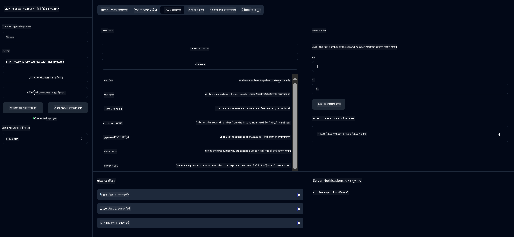

<!--
CO_OP_TRANSLATOR_METADATA:
{
  "original_hash": "ed9cab32cc67c12d8969b407aa47100a",
  "translation_date": "2025-07-13T17:53:09+00:00",
  "source_file": "03-GettingStarted/01-first-server/solution/java/README.md",
  "language_code": "hi"
}
-->
# बेसिक कैलकुलेटर MCP सेवा

यह सेवा Model Context Protocol (MCP) के माध्यम से बेसिक कैलकुलेटर ऑपरेशन्स प्रदान करती है, जो Spring Boot के WebFlux ट्रांसपोर्ट का उपयोग करती है। इसे MCP इम्प्लीमेंटेशन सीखने वाले शुरुआती लोगों के लिए एक सरल उदाहरण के रूप में डिज़ाइन किया गया है।

अधिक जानकारी के लिए, [MCP Server Boot Starter](https://docs.spring.io/spring-ai/reference/api/mcp/mcp-server-boot-starter-docs.html) संदर्भ दस्तावेज़ देखें।


## सेवा का उपयोग

यह सेवा MCP प्रोटोकॉल के माध्यम से निम्नलिखित API एंडपॉइंट्स प्रदान करती है:

- `add(a, b)`: दो संख्याओं को जोड़ना
- `subtract(a, b)`: पहली संख्या में से दूसरी संख्या घटाना
- `multiply(a, b)`: दो संख्याओं को गुणा करना
- `divide(a, b)`: पहली संख्या को दूसरी संख्या से भाग देना (शून्य जांच के साथ)
- `power(base, exponent)`: किसी संख्या की घात निकालना
- `squareRoot(number)`: वर्गमूल निकालना (ऋण संख्या जांच के साथ)
- `modulus(a, b)`: भाग देने पर शेषफल निकालना
- `absolute(number)`: किसी संख्या का परिमाण निकालना

## निर्भरताएँ

इस प्रोजेक्ट के लिए निम्नलिखित मुख्य निर्भरताएँ आवश्यक हैं:

```xml
<dependency>
    <groupId>org.springframework.ai</groupId>
    <artifactId>spring-ai-starter-mcp-server-webflux</artifactId>
</dependency>
```

## प्रोजेक्ट बनाना

Maven का उपयोग करके प्रोजेक्ट बनाएं:
```bash
./mvnw clean install -DskipTests
```

## सर्वर चलाना

### Java का उपयोग करते हुए

```bash
java -jar target/calculator-server-0.0.1-SNAPSHOT.jar
```

### MCP Inspector का उपयोग

MCP Inspector MCP सेवाओं के साथ इंटरैक्ट करने के लिए एक उपयोगी टूल है। इस कैलकुलेटर सेवा के साथ इसे उपयोग करने के लिए:

1. **MCP Inspector इंस्टॉल करें और एक नए टर्मिनल विंडो में चलाएं:**
   ```bash
   npx @modelcontextprotocol/inspector
   ```

2. **वेब UI तक पहुँचें** ऐप द्वारा प्रदर्शित URL पर क्लिक करके (आमतौर पर http://localhost:6274)

3. **कनेक्शन कॉन्फ़िगर करें**:
   - ट्रांसपोर्ट प्रकार "SSE" सेट करें
   - URL अपने चल रहे सर्वर के SSE एंडपॉइंट पर सेट करें: `http://localhost:8080/sse`
   - "Connect" पर क्लिक करें

4. **टूल्स का उपयोग करें**:
   - उपलब्ध कैलकुलेटर ऑपरेशन्स देखने के लिए "List Tools" पर क्लिक करें
   - किसी टूल को चुनें और ऑपरेशन चलाने के लिए "Run Tool" पर क्लिक करें



**अस्वीकरण**:  
यह दस्तावेज़ AI अनुवाद सेवा [Co-op Translator](https://github.com/Azure/co-op-translator) का उपयोग करके अनुवादित किया गया है। जबकि हम सटीकता के लिए प्रयासरत हैं, कृपया ध्यान दें कि स्वचालित अनुवादों में त्रुटियाँ या अशुद्धियाँ हो सकती हैं। मूल दस्तावेज़ अपनी मूल भाषा में ही अधिकारिक स्रोत माना जाना चाहिए। महत्वपूर्ण जानकारी के लिए, पेशेवर मानव अनुवाद की सलाह दी जाती है। इस अनुवाद के उपयोग से उत्पन्न किसी भी गलतफहमी या गलत व्याख्या के लिए हम जिम्मेदार नहीं हैं।