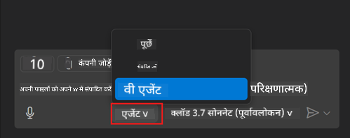
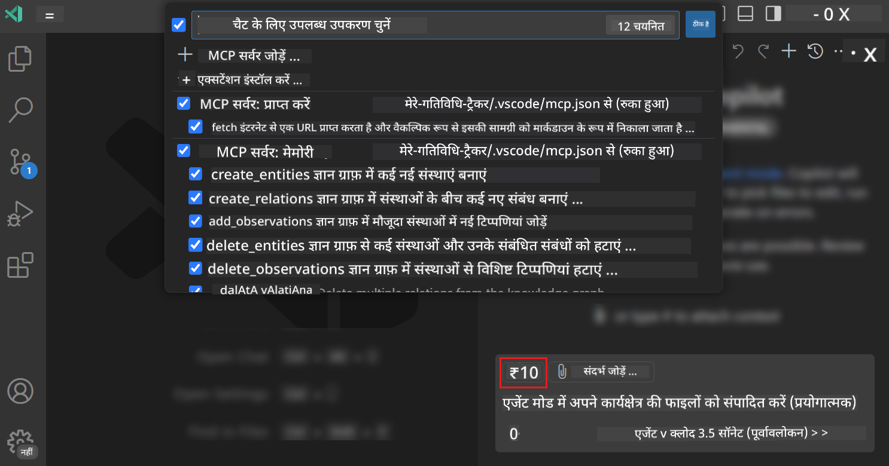
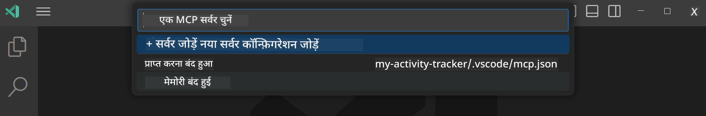
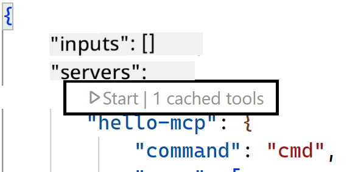
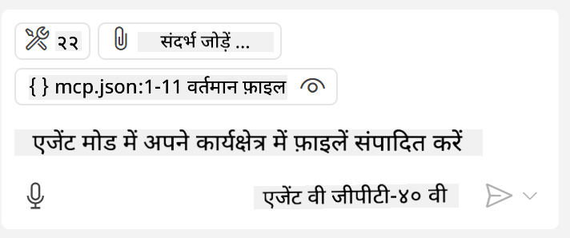
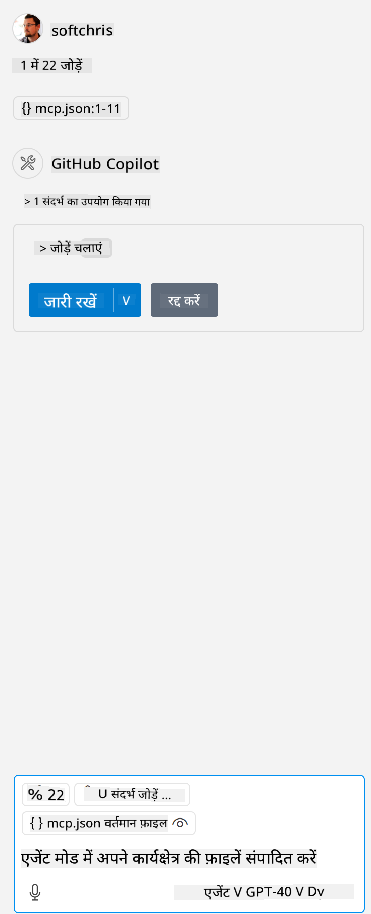

<!--
CO_OP_TRANSLATOR_METADATA:
{
  "original_hash": "d940b5e0af75e3a3a4d1c3179120d1d9",
  "translation_date": "2025-08-26T17:26:26+00:00",
  "source_file": "03-GettingStarted/04-vscode/README.md",
  "language_code": "hi"
}
-->
# GitHub Copilot Agent मोड से सर्वर का उपयोग करना

Visual Studio Code और GitHub Copilot एक क्लाइंट के रूप में काम कर सकते हैं और MCP सर्वर का उपयोग कर सकते हैं। आप सोच सकते हैं, ऐसा क्यों करना चाहिए? खैर, इसका मतलब है कि MCP सर्वर की जो भी विशेषताएँ हैं, अब उन्हें आपके IDE के अंदर से उपयोग किया जा सकता है। कल्पना करें कि आप GitHub का MCP सर्वर जोड़ते हैं, तो यह आपको टर्मिनल में विशेष कमांड टाइप करने के बजाय प्रॉम्प्ट्स के माध्यम से GitHub को नियंत्रित करने की अनुमति देगा। या सामान्य रूप से कुछ भी जो आपके डेवलपर अनुभव को बेहतर बना सकता है, सब कुछ प्राकृतिक भाषा द्वारा नियंत्रित। अब आप समझ सकते हैं कि यह कितना उपयोगी हो सकता है।

## अवलोकन

यह पाठ बताता है कि Visual Studio Code और GitHub Copilot के Agent मोड का उपयोग MCP सर्वर के क्लाइंट के रूप में कैसे किया जाए।

## सीखने के उद्देश्य

इस पाठ के अंत तक, आप सक्षम होंगे:

- Visual Studio Code के माध्यम से MCP सर्वर का उपयोग करना।
- GitHub Copilot के माध्यम से टूल्स जैसी सुविधाओं को चलाना।
- MCP सर्वर को खोजने और प्रबंधित करने के लिए Visual Studio Code को कॉन्फ़िगर करना।

## उपयोग

आप अपने MCP सर्वर को दो तरीकों से नियंत्रित कर सकते हैं:

- यूजर इंटरफेस, जिसे आप इस अध्याय में बाद में देखेंगे।
- टर्मिनल, टर्मिनल से `code` executable का उपयोग करके चीजों को नियंत्रित करना संभव है:

  अपने यूजर प्रोफाइल में MCP सर्वर जोड़ने के लिए, --add-mcp कमांड लाइन विकल्प का उपयोग करें और JSON सर्वर कॉन्फ़िगरेशन प्रदान करें जैसे {\"name\":\"server-name\",\"command\":...}।

  ```
  code --add-mcp "{\"name\":\"my-server\",\"command\": \"uvx\",\"args\": [\"mcp-server-fetch\"]}"
  ```

### स्क्रीनशॉट्स

  
  
  

आइए अगले सेक्शन में देखें कि हम विजुअल इंटरफेस का उपयोग कैसे करते हैं।

## दृष्टिकोण

यहाँ उच्च स्तर पर हमें कैसे आगे बढ़ना है:

- MCP सर्वर को खोजने के लिए एक फ़ाइल कॉन्फ़िगर करें।
- सर्वर को शुरू करें/कनेक्ट करें ताकि वह अपनी क्षमताओं को सूचीबद्ध कर सके।
- GitHub Copilot Chat इंटरफेस के माध्यम से उन क्षमताओं का उपयोग करें।

बहुत अच्छा, अब जब हम प्रवाह को समझ गए हैं, तो आइए Visual Studio Code के माध्यम से MCP सर्वर का उपयोग करने का अभ्यास करें।

## अभ्यास: सर्वर का उपयोग करना

इस अभ्यास में, हम Visual Studio Code को MCP सर्वर खोजने के लिए कॉन्फ़िगर करेंगे ताकि इसे GitHub Copilot Chat इंटरफेस से उपयोग किया जा सके।

### -0- प्रारंभिक चरण, MCP सर्वर डिस्कवरी सक्षम करें

आपको MCP सर्वर की डिस्कवरी सक्षम करनी पड़ सकती है।

1. Visual Studio Code में `File -> Preferences -> Settings` पर जाएं।

1. "MCP" खोजें और settings.json फ़ाइल में `chat.mcp.discovery.enabled` को सक्षम करें।

### -1- कॉन्फ़िग फ़ाइल बनाएं

अपने प्रोजेक्ट रूट में एक कॉन्फ़िग फ़ाइल बनाकर शुरू करें। आपको MCP.json नामक एक फ़ाइल की आवश्यकता होगी और इसे .vscode नामक फ़ोल्डर में रखना होगा। यह इस प्रकार दिखना चाहिए:

```text
.vscode
|-- mcp.json
```

अब, आइए देखें कि हम सर्वर एंट्री कैसे जोड़ सकते हैं।

### -2- सर्वर कॉन्फ़िगर करें

*mcp.json* में निम्नलिखित सामग्री जोड़ें:

```json
{
    "inputs": [],
    "servers": {
       "hello-mcp": {
           "command": "node",
           "args": [
               "build/index.js"
           ]
       }
    }
}
```

ऊपर दिया गया एक सरल उदाहरण है कि Node.js में लिखा सर्वर कैसे शुरू करें। अन्य रनटाइम्स के लिए, सर्वर शुरू करने के लिए `command` और `args` में सही कमांड का उल्लेख करें।

### -3- सर्वर शुरू करें

अब जब आपने एक एंट्री जोड़ दी है, तो सर्वर शुरू करें:

1. *mcp.json* में अपनी एंट्री ढूंढें और सुनिश्चित करें कि आपको "play" आइकन दिखाई दे:

    

1. "play" आइकन पर क्लिक करें। आपको GitHub Copilot Chat में टूल्स आइकन पर उपलब्ध टूल्स की संख्या बढ़ती हुई दिखाई देनी चाहिए। यदि आप उस टूल्स आइकन पर क्लिक करते हैं, तो आपको पंजीकृत टूल्स की सूची दिखाई देगी। आप प्रत्येक टूल को चेक/अनचेक कर सकते हैं, यह निर्भर करता है कि आप चाहते हैं कि GitHub Copilot उन्हें संदर्भ के रूप में उपयोग करे:

  

1. टूल चलाने के लिए, ऐसा प्रॉम्प्ट टाइप करें जो आपके टूल्स के विवरण से मेल खाता हो, उदाहरण के लिए ऐसा प्रॉम्प्ट: "add 22 to 1":

  

  आपको 23 का उत्तर दिखाई देना चाहिए।

## असाइनमेंट

अपने *mcp.json* फ़ाइल में एक सर्वर एंट्री जोड़ने का प्रयास करें और सुनिश्चित करें कि आप सर्वर को शुरू/बंद कर सकते हैं। यह भी सुनिश्चित करें कि आप GitHub Copilot Chat इंटरफेस के माध्यम से अपने सर्वर के टूल्स के साथ संवाद कर सकते हैं।

## समाधान

[Solution](./solution/README.md)

## मुख्य बातें

इस अध्याय से मुख्य बातें निम्नलिखित हैं:

- Visual Studio Code एक बेहतरीन क्लाइंट है जो आपको कई MCP सर्वर और उनके टूल्स का उपयोग करने देता है।
- GitHub Copilot Chat इंटरफेस वह तरीका है जिससे आप सर्वर के साथ संवाद करते हैं।
- आप API कुंजियों जैसे इनपुट्स के लिए उपयोगकर्ता को प्रॉम्प्ट कर सकते हैं, जिन्हें *mcp.json* फ़ाइल में सर्वर एंट्री कॉन्फ़िगर करते समय MCP सर्वर को पास किया जा सकता है।

## नमूने

- [Java Calculator](../samples/java/calculator/README.md)  
- [.Net Calculator](../../../../03-GettingStarted/samples/csharp)  
- [JavaScript Calculator](../samples/javascript/README.md)  
- [TypeScript Calculator](../samples/typescript/README.md)  
- [Python Calculator](../../../../03-GettingStarted/samples/python)  

## अतिरिक्त संसाधन

- [Visual Studio docs](https://code.visualstudio.com/docs/copilot/chat/mcp-servers)

## आगे क्या

- अगला: [Creating a stdio Server](../05-stdio-server/README.md)  

---

**अस्वीकरण**:  
यह दस्तावेज़ AI अनुवाद सेवा [Co-op Translator](https://github.com/Azure/co-op-translator) का उपयोग करके अनुवादित किया गया है। जबकि हम सटीकता सुनिश्चित करने का प्रयास करते हैं, कृपया ध्यान दें कि स्वचालित अनुवाद में त्रुटियां या अशुद्धियां हो सकती हैं। मूल भाषा में उपलब्ध मूल दस्तावेज़ को प्रामाणिक स्रोत माना जाना चाहिए। महत्वपूर्ण जानकारी के लिए, पेशेवर मानव अनुवाद की सिफारिश की जाती है। इस अनुवाद के उपयोग से उत्पन्न किसी भी गलतफहमी या गलत व्याख्या के लिए हम जिम्मेदार नहीं हैं।