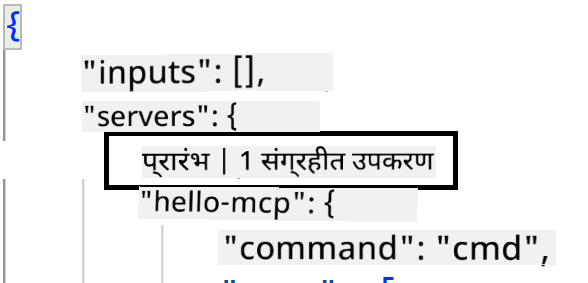
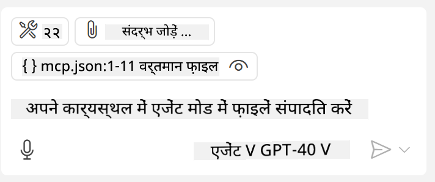

<!--
CO_OP_TRANSLATOR_METADATA:
{
  "original_hash": "c37fabfbc0dcbc9a4afb6d17e7d3be9f",
  "translation_date": "2025-05-17T11:03:44+00:00",
  "source_file": "03-GettingStarted/04-vscode/README.md",
  "language_code": "hi"
}
-->
आइए अगले सेक्शन में देखें कि हम विजुअल इंटरफ़ेस का उपयोग कैसे कर सकते हैं।

## दृष्टिकोण

यहां बताया गया है कि हमें इसे उच्च स्तर पर कैसे अपनाना चाहिए:

- एक फ़ाइल को कॉन्फ़िगर करें ताकि हमारा MCP सर्वर मिल सके।
- सर्वर को शुरू करें/कनेक्ट करें ताकि यह अपनी क्षमताओं की सूची दे सके।
- GitHub Copilot के चैट इंटरफ़ेस के माध्यम से इन क्षमताओं का उपयोग करें।

बहुत अच्छा, अब जब हमने प्रवाह को समझ लिया है, तो आइए एक अभ्यास के माध्यम से Visual Studio Code के माध्यम से एक MCP सर्वर का उपयोग करने का प्रयास करें।

## अभ्यास: सर्वर का उपयोग करना

इस अभ्यास में, हम Visual Studio Code को आपके MCP सर्वर को खोजने के लिए कॉन्फ़िगर करेंगे ताकि इसका उपयोग GitHub Copilot के चैट इंटरफ़ेस से किया जा सके।

### -0- प्रारंभिक चरण, MCP सर्वर खोज को सक्षम करें

आपको MCP सर्वरों की खोज को सक्षम करने की आवश्यकता हो सकती है।

1. `File -> Preferences -> Settings` in Visual Studio Code.

1. Search for "MCP" and enable `chat.mcp.discovery.enabled` पर जाएं settings.json फ़ाइल में।

### -1- कॉन्फ़िग फ़ाइल बनाएं

अपने प्रोजेक्ट रूट में एक कॉन्फ़िग फ़ाइल बनाकर शुरू करें, आपको MCP.json नामक एक फ़ाइल की आवश्यकता होगी और इसे .vscode नामक फ़ोल्डर में रखना होगा। यह कुछ इस तरह दिखना चाहिए:

```text
.vscode
|-- mcp.json
```

अब, आइए देखें कि हम सर्वर प्रविष्टि कैसे जोड़ सकते हैं।

### -2- सर्वर को कॉन्फ़िगर करें

*mcp.json* में निम्न सामग्री जोड़ें:

```json
{
    "inputs": [],
    "servers": {
       "hello-mcp": {
           "command": "cmd",
           "args": [
               "/c", "node", "<absolute path>\\build\\index.js"
           ]
       }
    }
}
```

यहां एक सरल उदाहरण है कि Node.js में लिखे गए सर्वर को कैसे शुरू किया जाए, अन्य रनटाइम्स के लिए सर्वर को शुरू करने के लिए उपयुक्त कमांड को `command` and `args` का उपयोग करके इंगित करें।

### -3- सर्वर शुरू करें

अब जब आपने एक प्रविष्टि जोड़ दी है, तो आइए सर्वर शुरू करें:

1. अपनी प्रविष्टि को *mcp.json* में खोजें और सुनिश्चित करें कि आपको "प्ले" आइकन मिल गया है:

    

1. "प्ले" आइकन पर क्लिक करें, आपको GitHub Copilot चैट में उपलब्ध टूल्स की संख्या में वृद्धि दिखाई देनी चाहिए। यदि आप उक्त टूल्स आइकन पर क्लिक करते हैं, तो आपको पंजीकृत टूल्स की सूची दिखाई देगी। आप प्रत्येक टूल को चेक/अनचेक कर सकते हैं इस पर निर्भर करता है कि आप GitHub Copilot को उन्हें संदर्भ के रूप में उपयोग करना चाहते हैं या नहीं:

  

1. एक टूल चलाने के लिए, एक प्रॉम्प्ट टाइप करें जो आपके टूल्स में से एक के विवरण से मेल खाता हो, उदाहरण के लिए ऐसा प्रॉम्प्ट "22 को 1 में जोड़ें":

  

  आपको 23 कहने वाला उत्तर दिखाई देना चाहिए।

## असाइनमेंट

अपने *mcp.json* फ़ाइल में एक सर्वर प्रविष्टि जोड़ने का प्रयास करें और सुनिश्चित करें कि आप सर्वर को शुरू/बंद कर सकते हैं। सुनिश्चित करें कि आप GitHub Copilot के चैट इंटरफ़ेस के माध्यम से अपने सर्वर के टूल्स के साथ भी संवाद कर सकते हैं।

## समाधान

[समाधान](./solution/README.md)

## मुख्य बातें

इस अध्याय से प्रमुख बातें निम्नलिखित हैं:

- Visual Studio Code एक बेहतरीन क्लाइंट है जो आपको कई MCP सर्वरों और उनके टूल्स का उपयोग करने देता है।
- GitHub Copilot का चैट इंटरफ़ेस वह तरीका है जिससे आप सर्वरों के साथ बातचीत करते हैं।
- आप उपयोगकर्ता से इनपुट के लिए प्रॉम्प्ट कर सकते हैं जैसे API कुंजी जो MCP सर्वर को सर्वर प्रविष्टि को *mcp.json* फ़ाइल में कॉन्फ़िगर करते समय पास की जा सकती है।

## नमूने

- [Java कैलकुलेटर](../samples/java/calculator/README.md)
- [.Net कैलकुलेटर](../../../../03-GettingStarted/samples/csharp)
- [JavaScript कैलकुलेटर](../samples/javascript/README.md)
- [TypeScript कैलकुलेटर](../samples/typescript/README.md)
- [Python कैलकुलेटर](../../../../03-GettingStarted/samples/python)

## अतिरिक्त संसाधन

- [Visual Studio दस्तावेज़](https://code.visualstudio.com/docs/copilot/chat/mcp-servers)

## आगे क्या है

- अगला: [SSE सर्वर बनाना](/03-GettingStarted/05-sse-server/README.md)

**अस्वीकरण**:  
यह दस्तावेज़ AI अनुवाद सेवा [Co-op Translator](https://github.com/Azure/co-op-translator) का उपयोग करके अनुवादित किया गया है। जबकि हम सटीकता के लिए प्रयास करते हैं, कृपया ध्यान दें कि स्वचालित अनुवादों में त्रुटियाँ या अशुद्धियाँ हो सकती हैं। मूल भाषा में मूल दस्तावेज़ को प्राधिकृत स्रोत माना जाना चाहिए। महत्वपूर्ण जानकारी के लिए, पेशेवर मानव अनुवाद की सिफारिश की जाती है। इस अनुवाद के उपयोग से उत्पन्न किसी भी गलतफहमी या गलत व्याख्या के लिए हम उत्तरदायी नहीं हैं।