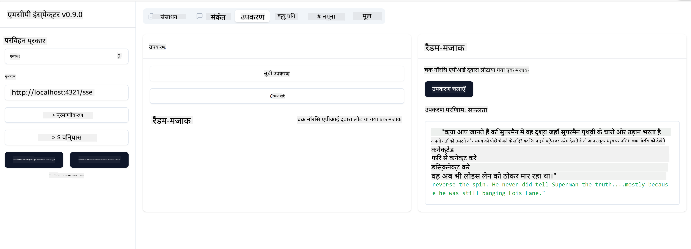

<!--
CO_OP_TRANSLATOR_METADATA:
{
  "original_hash": "0a8086dc4bf89448f83e7936db972c42",
  "translation_date": "2025-05-17T11:29:47+00:00",
  "source_file": "03-GettingStarted/05-sse-server/README.md",
  "language_code": "hi"
}
-->
# SSE सर्वर

SSE (Server Sent Events) सर्वर से क्लाइंट तक स्ट्रीमिंग के लिए एक मानक है, जो सर्वरों को HTTP के माध्यम से क्लाइंट्स को रियल-टाइम अपडेट पुश करने की अनुमति देता है। यह विशेष रूप से उन अनुप्रयोगों के लिए उपयोगी है जिन्हें लाइव अपडेट की आवश्यकता होती है, जैसे चैट एप्लिकेशन, सूचनाएं, या रियल-टाइम डेटा फीड्स। साथ ही, आपका सर्वर एक ही समय में कई क्लाइंट्स द्वारा उपयोग किया जा सकता है क्योंकि यह एक सर्वर पर रहता है जिसे उदाहरण के लिए क्लाउड में कहीं भी चलाया जा सकता है।

## अवलोकन

यह पाठ SSE सर्वर बनाने और उपयोग करने के तरीके को कवर करता है।

## सीखने के उद्देश्य

इस पाठ के अंत तक, आप सक्षम होंगे:

- एक SSE सर्वर बनाएं।
- Inspector का उपयोग करके SSE सर्वर को डिबग करें।
- Visual Studio Code का उपयोग करके SSE सर्वर का उपभोग करें।


## SSE, यह कैसे काम करता है

SSE दो समर्थित ट्रांसपोर्ट प्रकारों में से एक है। आपने पहले पाठों में पहले वाले stdio का उपयोग होते देखा है। अंतर निम्नलिखित है:

- SSE को आपको दो चीजों को संभालने की आवश्यकता होती है: कनेक्शन और संदेश।
- चूंकि यह एक सर्वर है जो कहीं भी रह सकता है, आपको Inspector और Visual Studio जैसे टूल्स के साथ काम करने के तरीके में इसे प्रतिबिंबित करने की आवश्यकता है। इसका मतलब है कि सर्वर को कैसे शुरू करें यह बताने के बजाय, आप उस एन्डपॉइंट को इंगित करते हैं जहां यह एक कनेक्शन स्थापित कर सकता है। नीचे दिए गए उदाहरण कोड को देखें:
आप अक्टूबर 2023 तक के डेटा पर प्रशिक्षित हैं।

अब जब हम SSE के बारे में थोड़ा और जानते हैं, तो चलिए अगला एक SSE सर्वर बनाते हैं।

## अभ्यास: SSE सर्वर बनाना

हमारे सर्वर को बनाने के लिए, हमें दो चीजों का ध्यान रखना होगा:

- हमें कनेक्शन और संदेशों के लिए एन्डपॉइंट्स को उजागर करने के लिए एक वेब सर्वर का उपयोग करना होगा।
- जब हम stdio का उपयोग कर रहे थे तब की तरह ही टूल्स, संसाधनों और प्रॉम्प्ट्स के साथ हमारे सर्वर का निर्माण करना होगा।

### -1- एक सर्वर इंस्टेंस बनाएं

हमारे सर्वर को बनाने के लिए, हम stdio के साथ समान प्रकारों का उपयोग करते हैं। हालांकि, ट्रांसपोर्ट के लिए, हमें SSE चुनना होगा।

चलो अगला आवश्यक मार्ग जोड़ें।

### -2- मार्ग जोड़ें

चलो अगला मार्ग जोड़ें जो कनेक्शन और आने वाले संदेशों को संभालते हैं:

चलो अगला सर्वर में क्षमताएँ जोड़ें।

### -3- सर्वर क्षमताएँ जोड़ना

अब जब हमने SSE विशिष्ट सब कुछ परिभाषित कर लिया है, तो चलो सर्वर क्षमताएँ जोड़ें जैसे टूल्स, प्रॉम्प्ट्स और संसाधन।

आपका पूरा कोड इस प्रकार दिखना चाहिए:

बहुत अच्छा, हमारे पास SSE का उपयोग करने वाला एक सर्वर है, चलिए इसे अगले दौर में ले चलते हैं।

## अभ्यास: Inspector के साथ SSE सर्वर का डिबगिंग

Inspector एक शानदार टूल है जिसे हमने पिछले पाठ में देखा था [आपका पहला सर्वर बनाना](/03-GettingStarted/01-first-server/README.md)। चलिए देखें कि क्या हम यहां भी Inspector का उपयोग कर सकते हैं:

### -1- Inspector चलाना

Inspector को चलाने के लिए, आपको पहले SSE सर्वर चलाना होगा, इसलिए चलिए अगला करते हैं:

1. सर्वर चलाएं

1. Inspector चलाएं

    > ![NOTE]
    > इसे उस टर्मिनल विंडो में चलाएं जिसमें सर्वर नहीं चल रहा है। साथ ही ध्यान दें, आपको नीचे दिए गए कमांड को उस URL के अनुसार समायोजित करना होगा जहां आपका सर्वर चल रहा है।

    ```sh
    npx @modelcontextprotocol/inspector --cli http://localhost:8000/sse --method tools/list
    ```

    सभी रनटाइम्स में Inspector चलाना समान दिखता है। ध्यान दें कि हम अपने सर्वर के पथ को पास करने और सर्वर को शुरू करने के लिए एक कमांड पास करने के बजाय, हम उस URL को पास करते हैं जहां सर्वर चल रहा है और हम `/sse` मार्ग को भी निर्दिष्ट करते हैं।

### -2- टूल का प्रयास करना

SSE को ड्रॉपलिस्ट में चुनकर और URL फ़ील्ड में भरकर सर्वर को कनेक्ट करें जहां आपका सर्वर चल रहा है, उदाहरण के लिए http:localhost:4321/sse। अब "कनेक्ट" बटन पर क्लिक करें। पहले की तरह, टूल्स की सूची बनाएं, एक टूल चुनें और इनपुट मान प्रदान करें। आपको नीचे जैसा परिणाम दिखाई देना चाहिए:



बहुत अच्छा, आप Inspector के साथ काम करने में सक्षम हैं, चलिए देखें कि हम Visual Studio Code के साथ कैसे काम कर सकते हैं।

## असाइनमेंट

अपने सर्वर को अधिक क्षमताओं के साथ बनाने का प्रयास करें। देखें [यह पृष्ठ](https://api.chucknorris.io/) उदाहरण के लिए एक टूल जोड़ने के लिए जो एक API को कॉल करता है, आप तय करें कि सर्वर कैसा दिखना चाहिए। मज़े करें :)

## समाधान

[समाधान](./solution/README.md) यहां एक संभावित समाधान है जिसमें कार्यशील कोड है।

## मुख्य बातें

इस अध्याय से मुख्य बातें निम्नलिखित हैं:

- SSE stdio के अलावा दूसरा समर्थित ट्रांसपोर्ट है।
- SSE का समर्थन करने के लिए, आपको एक वेब फ्रेमवर्क का उपयोग करके आने वाले कनेक्शनों और संदेशों को प्रबंधित करने की आवश्यकता होती है।
- आप SSE सर्वर का उपभोग करने के लिए Inspector और Visual Studio Code दोनों का उपयोग कर सकते हैं, ठीक वैसे ही जैसे stdio सर्वर। ध्यान दें कि यह stdio और SSE के बीच थोड़ा भिन्न होता है। SSE के लिए, आपको सर्वर को अलग से शुरू करना होगा और फिर अपने Inspector टूल को चलाना होगा। Inspector टूल के लिए, कुछ अंतर भी हैं कि आपको URL निर्दिष्ट करने की आवश्यकता है।

## नमूने

- [Java Calculator](../samples/java/calculator/README.md)
- [.Net Calculator](../../../../03-GettingStarted/samples/csharp)
- [JavaScript Calculator](../samples/javascript/README.md)
- [TypeScript Calculator](../samples/typescript/README.md)
- [Python Calculator](../../../../03-GettingStarted/samples/python)

## अतिरिक्त संसाधन

- [SSE](https://developer.mozilla.org/en-US/docs/Web/API/Server-sent_events)

## आगे क्या है

- अगला: [VSCode के लिए AI Toolkit के साथ शुरुआत करना](/03-GettingStarted/06-aitk/README.md)

**अस्वीकरण**:  
यह दस्तावेज़ AI अनुवाद सेवा [Co-op Translator](https://github.com/Azure/co-op-translator) का उपयोग करके अनुवादित किया गया है। जबकि हम सटीकता के लिए प्रयासरत हैं, कृपया ध्यान दें कि स्वचालित अनुवाद में त्रुटियाँ या अशुद्धियाँ हो सकती हैं। मूल दस्तावेज़ को इसकी मूल भाषा में प्रामाणिक स्रोत माना जाना चाहिए। महत्वपूर्ण जानकारी के लिए, पेशेवर मानव अनुवाद की सिफारिश की जाती है। इस अनुवाद के उपयोग से उत्पन्न किसी भी गलतफहमी या गलत व्याख्या के लिए हम उत्तरदायी नहीं हैं।