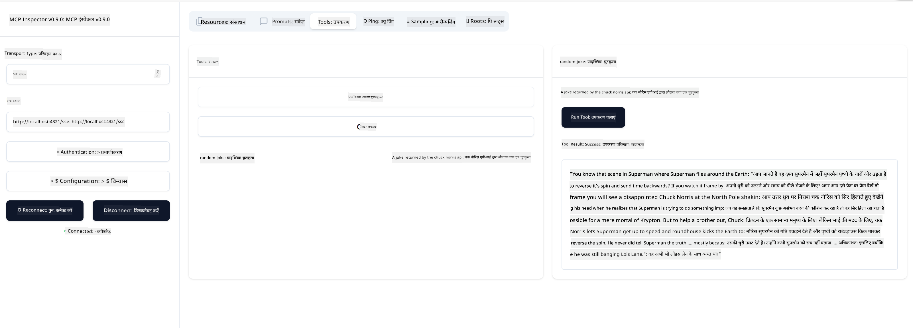

<!--
CO_OP_TRANSLATOR_METADATA:
{
  "original_hash": "6b1152afb5d4cb9a4175044694fd02ca",
  "translation_date": "2025-07-16T22:52:27+00:00",
  "source_file": "03-GettingStarted/05-sse-server/README.md",
  "language_code": "hi"
}
-->
# SSE सर्वर

SSE (Server Sent Events) एक मानक है जो सर्वर से क्लाइंट तक स्ट्रीमिंग के लिए होता है, जिससे सर्वर HTTP के माध्यम से क्लाइंट्स को रियल-टाइम अपडेट्स भेज सकते हैं। यह उन एप्लिकेशन्स के लिए खास तौर पर उपयोगी है जिन्हें लाइव अपडेट्स की जरूरत होती है, जैसे कि चैट एप्लिकेशन, नोटिफिकेशन, या रियल-टाइम डेटा फीड। साथ ही, आपका सर्वर एक साथ कई क्लाइंट्स द्वारा उपयोग किया जा सकता है क्योंकि यह किसी सर्वर पर चलता है, जो उदाहरण के लिए क्लाउड में कहीं भी हो सकता है।

## अवलोकन

यह पाठ SSE सर्वर बनाने और उपयोग करने के बारे में है।

## सीखने के उद्देश्य

इस पाठ के अंत तक, आप सक्षम होंगे:

- एक SSE सर्वर बनाना।
- Inspector का उपयोग करके SSE सर्वर को डिबग करना।
- Visual Studio Code का उपयोग करके SSE सर्वर को उपयोग करना।

## SSE, यह कैसे काम करता है

SSE दो समर्थित ट्रांसपोर्ट प्रकारों में से एक है। आपने पहले के पाठों में stdio का उपयोग होते देखा है। अंतर निम्नलिखित है:

- SSE में आपको दो चीज़ों को संभालना होता है; कनेक्शन और संदेश।
- चूंकि यह एक सर्वर है जो कहीं भी हो सकता है, इसलिए आपको Inspector और Visual Studio Code जैसे टूल्स के साथ काम करते समय इसे ध्यान में रखना होगा। इसका मतलब है कि आप सर्वर को शुरू करने के बजाय उस endpoint को इंगित करते हैं जहां यह कनेक्शन स्थापित कर सकता है। नीचे उदाहरण कोड देखें:

### TypeScript

```typescript
app.get("/sse", async (_: Request, res: Response) => {
    const transport = new SSEServerTransport('/messages', res);
    transports[transport.sessionId] = transport;
    res.on("close", () => {
        delete transports[transport.sessionId];
    });
    await server.connect(transport);
});

app.post("/messages", async (req: Request, res: Response) => {
    const sessionId = req.query.sessionId as string;
    const transport = transports[sessionId];
    if (transport) {
        await transport.handlePostMessage(req, res);
    } else {
        res.status(400).send('No transport found for sessionId');
    }
});
```

पिछले कोड में:

- `/sse` को एक रूट के रूप में सेट किया गया है। जब इस रूट पर अनुरोध आता है, तो एक नया ट्रांसपोर्ट इंस्टेंस बनता है और सर्वर इस ट्रांसपोर्ट का उपयोग करके *connect* करता है।
- `/messages`, यह रूट आने वाले संदेशों को संभालता है।

### Python

```python
mcp = FastMCP("My App")

@mcp.tool()
def add(a: int, b: int) -> int:
    """Add two numbers"""
    return a + b

# Mount the SSE server to the existing ASGI server
app = Starlette(
    routes=[
        Mount('/', app=mcp.sse_app()),
    ]
)

```

पिछले कोड में हमने:

- एक ASGI सर्वर का इंस्टेंस बनाया (विशेष रूप से Starlette का उपयोग करते हुए) और डिफ़ॉल्ट रूट `/` को माउंट किया।

  पर्दे के पीछे `/sse` और `/messages` रूट्स कनेक्शन और संदेशों को संभालने के लिए सेटअप होते हैं। बाकी ऐप, जैसे टूल्स जोड़ना, stdio सर्वर की तरह ही होता है।

### .NET    

```csharp
    var builder = WebApplication.CreateBuilder(args);
    builder.Services
        .AddMcpServer()
        .WithTools<Tools>();


    builder.Services.AddHttpClient();

    var app = builder.Build();

    app.MapMcp();
    ```

    दो मेथड्स हैं जो हमें एक वेब सर्वर से SSE सपोर्टिंग वेब सर्वर में बदलने में मदद करते हैं:

    - `AddMcpServer`, यह मेथड क्षमताएं जोड़ता है।
    - `MapMcp`, यह `/SSE` और `/messages` जैसे रूट्स जोड़ता है।

अब जब हमें SSE के बारे में थोड़ा और पता चल गया है, तो चलिए अगला SSE सर्वर बनाते हैं।

## अभ्यास: SSE सर्वर बनाना

हमारे सर्वर को बनाने के लिए, हमें दो बातों का ध्यान रखना होगा:

- हमें कनेक्शन और संदेशों के लिए एंडपॉइंट्स एक्सपोज़ करने के लिए एक वेब सर्वर का उपयोग करना होगा।
- सर्वर को वैसे ही बनाना होगा जैसे हम stdio के साथ करते थे, टूल्स, रिसोर्सेज़ और प्रॉम्प्ट्स के साथ।

### -1- सर्वर इंस्टेंस बनाएं

सर्वर बनाने के लिए, हम stdio के समान टाइप्स का उपयोग करते हैं। हालांकि, ट्रांसपोर्ट के लिए हमें SSE चुनना होगा।

### TypeScript

```typescript
import { Request, Response } from "express";
import express from "express";
import { McpServer } from "@modelcontextprotocol/sdk/server/mcp.js";
import { SSEServerTransport } from "@modelcontextprotocol/sdk/server/sse.js";

const server = new McpServer({
  name: "example-server",
  version: "1.0.0"
});

const app = express();

const transports: {[sessionId: string]: SSEServerTransport} = {};
```

पिछले कोड में हमने:

- एक सर्वर इंस्टेंस बनाया।
- express वेब फ्रेमवर्क का उपयोग करते हुए एक ऐप परिभाषित किया।
- एक transports वेरिएबल बनाया जिसे हम आने वाले कनेक्शन्स को स्टोर करने के लिए उपयोग करेंगे।

### Python

```python
from starlette.applications import Starlette
from starlette.routing import Mount, Host
from mcp.server.fastmcp import FastMCP


mcp = FastMCP("My App")
```

पिछले कोड में हमने:

- आवश्यक लाइब्रेरीज़ इम्पोर्ट कीं, जिसमें Starlette (एक ASGI फ्रेमवर्क) शामिल है।
- एक MCP सर्वर इंस्टेंस `mcp` बनाया।

### .NET

```csharp
var builder = WebApplication.CreateBuilder(args);
builder.Services
    .AddMcpServer();


builder.Services.AddHttpClient();

var app = builder.Build();

// TODO: add routes 
```

इस बिंदु पर, हमने:

- एक वेब ऐप बनाया।
- `AddMcpServer` के माध्यम से MCP फीचर्स के लिए सपोर्ट जोड़ा।

अब आवश्यक रूट्स जोड़ते हैं।

### -2- रूट्स जोड़ें

अब ऐसे रूट्स जोड़ते हैं जो कनेक्शन और आने वाले संदेशों को संभालें:

### TypeScript

```typescript
app.get("/sse", async (_: Request, res: Response) => {
  const transport = new SSEServerTransport('/messages', res);
  transports[transport.sessionId] = transport;
  res.on("close", () => {
    delete transports[transport.sessionId];
  });
  await server.connect(transport);
});

app.post("/messages", async (req: Request, res: Response) => {
  const sessionId = req.query.sessionId as string;
  const transport = transports[sessionId];
  if (transport) {
    await transport.handlePostMessage(req, res);
  } else {
    res.status(400).send('No transport found for sessionId');
  }
});

app.listen(3001);
```

पिछले कोड में हमने परिभाषित किया:

- एक `/sse` रूट जो SSE प्रकार का ट्रांसपोर्ट इंस्टैंस बनाता है और MCP सर्वर पर `connect` कॉल करता है।
- एक `/messages` रूट जो आने वाले संदेशों का ध्यान रखता है।

### Python

```python
app = Starlette(
    routes=[
        Mount('/', app=mcp.sse_app()),
    ]
)
```

पिछले कोड में हमने:

- Starlette फ्रेमवर्क का उपयोग करते हुए एक ASGI ऐप इंस्टेंस बनाया। इसके हिस्से के रूप में हमने `mcp.sse_app()` को इसके रूट्स की सूची में पास किया। इससे ऐप इंस्टेंस पर `/sse` और `/messages` रूट्स माउंट हो जाते हैं।

### .NET

```csharp
var builder = WebApplication.CreateBuilder(args);
builder.Services
    .AddMcpServer();

builder.Services.AddHttpClient();

var app = builder.Build();

app.MapMcp();
```

हमने अंत में एक लाइन `add.MapMcp()` जोड़ी है, जिसका मतलब है कि अब हमारे पास `/SSE` और `/messages` रूट्स हैं।

अब सर्वर में क्षमताएं जोड़ते हैं।

### -3- सर्वर क्षमताएं जोड़ना

अब जब हमने SSE से संबंधित सब कुछ परिभाषित कर लिया है, तो चलिए सर्वर में टूल्स, प्रॉम्प्ट्स और रिसोर्सेज़ जैसी क्षमताएं जोड़ते हैं।

### TypeScript

```typescript
server.tool("random-joke", "A joke returned by the chuck norris api", {},
  async () => {
    const response = await fetch("https://api.chucknorris.io/jokes/random");
    const data = await response.json();

    return {
      content: [
        {
          type: "text",
          text: data.value
        }
      ]
    };
  }
);
```

यहाँ एक टूल जोड़ने का तरीका है। यह विशेष टूल "random-joke" नामक टूल बनाता है जो Chuck Norris API को कॉल करता है और JSON प्रतिक्रिया लौटाता है।

### Python

```python
@mcp.tool()
def add(a: int, b: int) -> int:
    """Add two numbers"""
    return a + b
```

अब आपके सर्वर में एक टूल है।

### TypeScript

```typescript
// server-sse.ts
import { Request, Response } from "express";
import express from "express";
import { McpServer } from "@modelcontextprotocol/sdk/server/mcp.js";
import { SSEServerTransport } from "@modelcontextprotocol/sdk/server/sse.js";

// Create an MCP server
const server = new McpServer({
  name: "example-server",
  version: "1.0.0",
});

const app = express();

const transports: { [sessionId: string]: SSEServerTransport } = {};

app.get("/sse", async (_: Request, res: Response) => {
  const transport = new SSEServerTransport("/messages", res);
  transports[transport.sessionId] = transport;
  res.on("close", () => {
    delete transports[transport.sessionId];
  });
  await server.connect(transport);
});

app.post("/messages", async (req: Request, res: Response) => {
  const sessionId = req.query.sessionId as string;
  const transport = transports[sessionId];
  if (transport) {
    await transport.handlePostMessage(req, res);
  } else {
    res.status(400).send("No transport found for sessionId");
  }
});

server.tool("random-joke", "A joke returned by the chuck norris api", {}, async () => {
  const response = await fetch("https://api.chucknorris.io/jokes/random");
  const data = await response.json();

  return {
    content: [
      {
        type: "text",
        text: data.value,
      },
    ],
  };
});

app.listen(3001);
```

### Python

```python
from starlette.applications import Starlette
from starlette.routing import Mount, Host
from mcp.server.fastmcp import FastMCP


mcp = FastMCP("My App")

@mcp.tool()
def add(a: int, b: int) -> int:
    """Add two numbers"""
    return a + b

# Mount the SSE server to the existing ASGI server
app = Starlette(
    routes=[
        Mount('/', app=mcp.sse_app()),
    ]
)
```

### .NET

1. पहले कुछ टूल्स बनाते हैं, इसके लिए हम *Tools.cs* नामक एक फाइल बनाएंगे जिसमें निम्नलिखित सामग्री होगी:

  ```csharp
  using System.ComponentModel;
  using System.Text.Json;
  using ModelContextProtocol.Server;

  namespace server;

  [McpServerToolType]
  public sealed class Tools
  {

      public Tools()
      {
      
      }

      [McpServerTool, Description("Add two numbers together.")]
      public async Task<string> AddNumbers(
          [Description("The first number")] int a,
          [Description("The second number")] int b)
      {
          return (a + b).ToString();
      }

  }
  ```

  यहाँ हमने निम्नलिखित जोड़ा है:

  - `Tools` नामक एक क्लास बनाई है जिसमें `McpServerToolType` डेकोरेटर है।
  - `AddNumbers` नामक एक टूल परिभाषित किया है, जिसे `McpServerTool` डेकोरेटर के साथ मेथड पर लगाया गया है। हमने पैरामीटर्स और इम्प्लीमेंटेशन भी प्रदान किया है।

1. अब हमने जो `Tools` क्लास बनाई है, उसका उपयोग करते हैं:

  ```csharp
  var builder = WebApplication.CreateBuilder(args);
  builder.Services
      .AddMcpServer()
      .WithTools<Tools>();


  builder.Services.AddHttpClient();

  var app = builder.Build();

  app.MapMcp();
  ```

  हमने `WithTools` कॉल जोड़ी है जो `Tools` को टूल्स वाली क्लास के रूप में निर्दिष्ट करता है। बस, अब हम तैयार हैं।

बहुत बढ़िया, हमारे पास SSE का उपयोग करने वाला एक सर्वर है, चलिए इसे अगली बार चलाकर देखते हैं।

## अभ्यास: Inspector के साथ SSE सर्वर डिबग करना

Inspector एक शानदार टूल है जिसे हमने पिछले पाठ [Creating your first server](/03-GettingStarted/01-first-server/README.md) में देखा था। चलिए देखते हैं कि क्या हम Inspector को यहाँ भी उपयोग कर सकते हैं:

### -1- Inspector चलाना

Inspector चलाने के लिए, आपके पास पहले एक SSE सर्वर चल रहा होना चाहिए, तो चलिए इसे शुरू करते हैं:

1. सर्वर चलाएं

    ### TypeScript

    ```sh
    tsx && node ./build/server-sse.ts
    ```

    ### Python

    ```sh
    uvicorn server:app
    ```

    ध्यान दें कि हम `uvicorn` executable का उपयोग कर रहे हैं जो `pip install "mcp[cli]"` टाइप करने पर इंस्टॉल होता है। `server:app` टाइप करने का मतलब है कि हम `server.py` फाइल चलाना चाहते हैं जिसमें `app` नामक Starlette इंस्टेंस हो।

    ### .NET

    ```sh
    dotnet run
    ```

    इससे सर्वर शुरू हो जाना चाहिए। इसके साथ इंटरफेस करने के लिए आपको एक नया टर्मिनल खोलना होगा।

1. Inspector चलाएं

    > ![NOTE]
    > इसे उस टर्मिनल विंडो में चलाएं जो सर्वर के चलने वाले टर्मिनल से अलग हो। साथ ही ध्यान दें, आपको नीचे दिए गए कमांड को अपने सर्वर के URL के अनुसार एडजस्ट करना होगा।

    ```sh
    npx @modelcontextprotocol/inspector --cli http://localhost:8000/sse --method tools/list
    ```

    Inspector चलाना सभी रनटाइम्स में समान दिखता है। ध्यान दें कि हम सर्वर को शुरू करने के लिए पाथ और कमांड देने के बजाय, सर्वर के चल रहे URL को पास करते हैं और `/sse` रूट भी निर्दिष्ट करते हैं।

### -2- टूल आज़माना

ड्रॉपलिस्ट में SSE चुनें और उस URL को भरें जहां आपका सर्वर चल रहा है, उदाहरण के लिए http:localhost:4321/sse। अब "Connect" बटन पर क्लिक करें। जैसा पहले किया था, टूल्स की सूची चुनें, एक टूल चुनें और इनपुट मान प्रदान करें। आपको नीचे जैसा परिणाम दिखना चाहिए:



बहुत बढ़िया, आप Inspector के साथ काम कर पा रहे हैं, अब देखते हैं कि Visual Studio Code के साथ कैसे काम किया जा सकता है।

## असाइनमेंट

अपने सर्वर को और अधिक क्षमताओं के साथ बनाकर देखें। उदाहरण के लिए, [इस पेज](https://api.chucknorris.io/) को देखें और एक ऐसा टूल जोड़ें जो API को कॉल करता हो। तय करें कि आपका सर्वर कैसा दिखना चाहिए। मज़े करें :)

## समाधान

[Solution](./solution/README.md) यहाँ एक संभव समाधान है जिसमें काम करने वाला कोड है।

## मुख्य बातें

इस अध्याय से मुख्य बातें निम्नलिखित हैं:

- SSE stdio के बाद दूसरा समर्थित ट्रांसपोर्ट है।
- SSE को सपोर्ट करने के लिए, आपको वेब फ्रेमवर्क का उपयोग करके आने वाले कनेक्शन्स और संदेशों को प्रबंधित करना होगा।
- आप Inspector और Visual Studio Code दोनों का उपयोग SSE सर्वर को उपयोग करने के लिए कर सकते हैं, ठीक वैसे ही जैसे stdio सर्वर के लिए। ध्यान दें कि stdio और SSE में थोड़ा अंतर है। SSE के लिए, आपको सर्वर को अलग से शुरू करना होता है और फिर Inspector टूल चलाना होता है। Inspector टूल में भी कुछ अंतर हैं, जैसे कि आपको URL निर्दिष्ट करना होता है।

## नमूने

- [Java Calculator](../samples/java/calculator/README.md)
- [.Net Calculator](../../../../03-GettingStarted/samples/csharp)
- [JavaScript Calculator](../samples/javascript/README.md)
- [TypeScript Calculator](../samples/typescript/README.md)
- [Python Calculator](../../../../03-GettingStarted/samples/python)

## अतिरिक्त संसाधन

- [SSE](https://developer.mozilla.org/en-US/docs/Web/API/Server-sent_events)

## आगे क्या है

- अगला: [HTTP Streaming with MCP (Streamable HTTP)](../06-http-streaming/README.md)

**अस्वीकरण**:  
यह दस्तावेज़ AI अनुवाद सेवा [Co-op Translator](https://github.com/Azure/co-op-translator) का उपयोग करके अनुवादित किया गया है। जबकि हम सटीकता के लिए प्रयासरत हैं, कृपया ध्यान दें कि स्वचालित अनुवादों में त्रुटियाँ या अशुद्धियाँ हो सकती हैं। मूल दस्तावेज़ अपनी मूल भाषा में ही अधिकारिक स्रोत माना जाना चाहिए। महत्वपूर्ण जानकारी के लिए, पेशेवर मानव अनुवाद की सलाह दी जाती है। इस अनुवाद के उपयोग से उत्पन्न किसी भी गलतफहमी या गलत व्याख्या के लिए हम जिम्मेदार नहीं हैं।