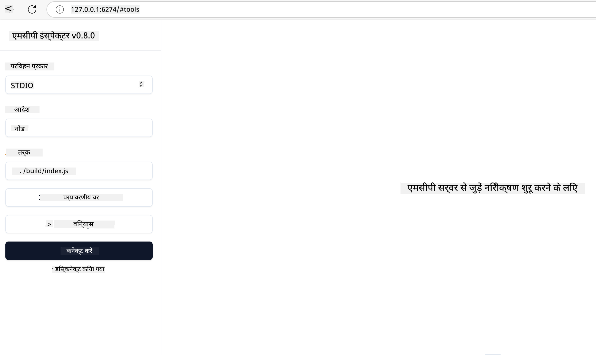

<!--
CO_OP_TRANSLATOR_METADATA:
{
  "original_hash": "717f34718a773f6cf52d8445e40a96bf",
  "translation_date": "2025-05-17T12:40:58+00:00",
  "source_file": "03-GettingStarted/07-testing/README.md",
  "language_code": "hi"
}
-->
## परीक्षण और डिबगिंग

अपने MCP सर्वर का परीक्षण शुरू करने से पहले, उपलब्ध टूल्स और डिबगिंग के लिए सर्वोत्तम प्रथाओं को समझना महत्वपूर्ण है। प्रभावी परीक्षण यह सुनिश्चित करता है कि आपका सर्वर अपेक्षा के अनुसार कार्य करता है और आपको समस्याओं की पहचान और समाधान करने में मदद करता है। निम्नलिखित अनुभाग आपके MCP कार्यान्वयन को मान्य करने के लिए अनुशंसित दृष्टिकोणों को रेखांकित करता है।

## अवलोकन

यह पाठ सही परीक्षण दृष्टिकोण और सबसे प्रभावी परीक्षण टूल का चयन कैसे करें, इस पर केंद्रित है।

## सीखने के उद्देश्य

इस पाठ के अंत तक, आप सक्षम होंगे:

- परीक्षण के लिए विभिन्न दृष्टिकोणों का वर्णन करें।
- अपने कोड का प्रभावी ढंग से परीक्षण करने के लिए विभिन्न टूल्स का उपयोग करें।

## MCP सर्वरों का परीक्षण

MCP आपके सर्वरों का परीक्षण और डिबग करने में मदद करने के लिए टूल्स प्रदान करता है:

- **MCP इंस्पेक्टर**: एक कमांड लाइन टूल जो CLI टूल और विजुअल टूल दोनों के रूप में चलाया जा सकता है।
- **मैनुअल परीक्षण**: आप curl जैसे टूल का उपयोग करके वेब अनुरोध चला सकते हैं, लेकिन कोई भी टूल जो HTTP चला सकता है, चलेगा।
- **यूनिट परीक्षण**: यह आपके पसंदीदा परीक्षण फ्रेमवर्क का उपयोग करके सर्वर और क्लाइंट दोनों की विशेषताओं का परीक्षण करना संभव है।

### MCP इंस्पेक्टर का उपयोग करना

हमने इस टूल के उपयोग को पिछले पाठों में वर्णित किया है लेकिन चलिए इसे ऊँचे स्तर पर थोड़ा समझते हैं। यह एक टूल है जो Node.js में बनाया गया है और आप इसे `npx` निष्पादन योग्य को कॉल करके उपयोग कर सकते हैं जो टूल को अस्थायी रूप से डाउनलोड और इंस्टॉल करेगा और आपकी अनुरोध चलने के बाद खुद को साफ कर देगा।

[MCP इंस्पेक्टर](https://github.com/modelcontextprotocol/inspector) आपकी मदद करता है:

- **सर्वर क्षमताओं की खोज करें**: उपलब्ध संसाधनों, टूल्स, और प्रॉम्प्ट्स का स्वतः पता लगाएं
- **टूल निष्पादन का परीक्षण करें**: विभिन्न पैरामीटर आज़माएं और प्रतिक्रियाएं वास्तविक समय में देखें
- **सर्वर मेटाडेटा देखें**: सर्वर जानकारी, स्कीमा, और कॉन्फ़िगरेशंस की जांच करें

टूल का एक सामान्य रन इस प्रकार दिखता है:

```bash
npx @modelcontextprotocol/inspector node build/index.js
```

उपरोक्त कमांड एक MCP और उसके विज़ुअल इंटरफ़ेस को शुरू करता है और आपके ब्राउज़र में एक स्थानीय वेब इंटरफ़ेस लॉन्च करता है। आप अपने पंजीकृत MCP सर्वरों, उनके उपलब्ध टूल्स, संसाधनों और प्रॉम्प्ट्स को प्रदर्शित करने वाला एक डैशबोर्ड देखने की उम्मीद कर सकते हैं। इंटरफ़ेस आपको टूल निष्पादन का इंटरैक्टिव रूप से परीक्षण करने, सर्वर मेटाडेटा का निरीक्षण करने, और वास्तविक समय प्रतिक्रियाएं देखने की अनुमति देता है, जिससे आपके MCP सर्वर कार्यान्वयन को मान्य और डिबग करना आसान हो जाता है।

यह ऐसा दिख सकता है: 

आप इस टूल को CLI मोड में भी चला सकते हैं, इस मामले में आपको `--cli` विशेषता जोड़नी होगी। यहां "CLI" मोड में टूल चलाने का एक उदाहरण है जो सर्वर पर सभी टूल्स को सूचीबद्ध करता है:

```sh
npx @modelcontextprotocol/inspector --cli node build/index.js --method tools/list
```

### मैनुअल परीक्षण

सर्वर क्षमताओं का परीक्षण करने के लिए इंस्पेक्टर टूल चलाने के अलावा, एक और समान दृष्टिकोण यह है कि HTTP का उपयोग करने में सक्षम क्लाइंट चलाएं जैसे कि curl।

curl के साथ, आप HTTP अनुरोधों का उपयोग करके MCP सर्वरों का सीधे परीक्षण कर सकते हैं:

```bash
# Example: Test server metadata
curl http://localhost:3000/v1/metadata

# Example: Execute a tool
curl -X POST http://localhost:3000/v1/tools/execute \
  -H "Content-Type: application/json" \
  -d '{"name": "calculator", "parameters": {"expression": "2+2"}}'
```

जैसा कि आप ऊपर curl के उपयोग से देख सकते हैं, आप एक POST अनुरोध का उपयोग करके एक टूल को एक payload के साथ बुलाते हैं जिसमें टूल का नाम और उसके पैरामीटर शामिल होते हैं। वह दृष्टिकोण चुनें जो आपको सबसे अच्छा लगे। सामान्य तौर पर CLI टूल्स का उपयोग करना तेज होता है और इन्हें स्क्रिप्ट किया जा सकता है जो CI/CD वातावरण में उपयोगी हो सकता है।

### यूनिट परीक्षण

यह सुनिश्चित करने के लिए कि आपके टूल्स और संसाधन अपेक्षा के अनुसार काम करते हैं, उनके लिए यूनिट टेस्ट बनाएं। यहां कुछ उदाहरण परीक्षण कोड है।

```python
import pytest

from mcp.server.fastmcp import FastMCP
from mcp.shared.memory import (
    create_connected_server_and_client_session as create_session,
)

# Mark the whole module for async tests
pytestmark = pytest.mark.anyio


async def test_list_tools_cursor_parameter():
    """Test that the cursor parameter is accepted for list_tools.

    Note: FastMCP doesn't currently implement pagination, so this test
    only verifies that the cursor parameter is accepted by the client.
    """

 server = FastMCP("test")

    # Create a couple of test tools
    @server.tool(name="test_tool_1")
    async def test_tool_1() -> str:
        """First test tool"""
        return "Result 1"

    @server.tool(name="test_tool_2")
    async def test_tool_2() -> str:
        """Second test tool"""
        return "Result 2"

    async with create_session(server._mcp_server) as client_session:
        # Test without cursor parameter (omitted)
        result1 = await client_session.list_tools()
        assert len(result1.tools) == 2

        # Test with cursor=None
        result2 = await client_session.list_tools(cursor=None)
        assert len(result2.tools) == 2

        # Test with cursor as string
        result3 = await client_session.list_tools(cursor="some_cursor_value")
        assert len(result3.tools) == 2

        # Test with empty string cursor
        result4 = await client_session.list_tools(cursor="")
        assert len(result4.tools) == 2
    
```

उपरोक्त कोड निम्नलिखित करता है:

- pytest फ्रेमवर्क का लाभ उठाता है जो आपको फंक्शन्स के रूप में टेस्ट बनाने और assert स्टेटमेंट्स का उपयोग करने की अनुमति देता है।
- दो विभिन्न टूल्स के साथ एक MCP सर्वर बनाता है।
- यह जांचने के लिए `assert` स्टेटमेंट का उपयोग करता है कि कुछ शर्तें पूरी होती हैं।

पूरा फाइल यहां देखें [पूरा फाइल यहां देखें](https://github.com/modelcontextprotocol/python-sdk/blob/main/tests/client/test_list_methods_cursor.py)

उपरोक्त फाइल को देखते हुए, आप अपने स्वयं के सर्वर का परीक्षण कर सकते हैं यह सुनिश्चित करने के लिए कि क्षमताएं जैसे कि होनी चाहिए, बनाई जाती हैं।

सभी प्रमुख SDK में इसी तरह के परीक्षण अनुभाग होते हैं ताकि आप अपने चुने हुए रनटाइम के अनुसार समायोजित कर सकें।

## नमूने

- [जावा कैलकुलेटर](../samples/java/calculator/README.md)
- [.Net कैलकुलेटर](../../../../03-GettingStarted/samples/csharp)
- [जावास्क्रिप्ट कैलकुलेटर](../samples/javascript/README.md)
- [टाइपस्क्रिप्ट कैलकुलेटर](../samples/typescript/README.md)
- [पाइथन कैलकुलेटर](../../../../03-GettingStarted/samples/python)

## अतिरिक्त संसाधन

- [पाइथन SDK](https://github.com/modelcontextprotocol/python-sdk)

## आगे क्या है

- अगला: [परिनियोजन](/03-GettingStarted/08-deployment/README.md)

**अस्वीकरण**:
यह दस्तावेज़ AI अनुवाद सेवा [Co-op Translator](https://github.com/Azure/co-op-translator) का उपयोग करके अनुवादित किया गया है। जबकि हम सटीकता के लिए प्रयास करते हैं, कृपया ध्यान दें कि स्वचालित अनुवादों में त्रुटियाँ या अशुद्धियाँ हो सकती हैं। मूल दस्तावेज़ को उसकी मूल भाषा में आधिकारिक स्रोत माना जाना चाहिए। महत्वपूर्ण जानकारी के लिए, पेशेवर मानव अनुवाद की सिफारिश की जाती है। इस अनुवाद के उपयोग से उत्पन्न किसी भी गलतफहमी या गलत व्याख्या के लिए हम उत्तरदायी नहीं हैं।