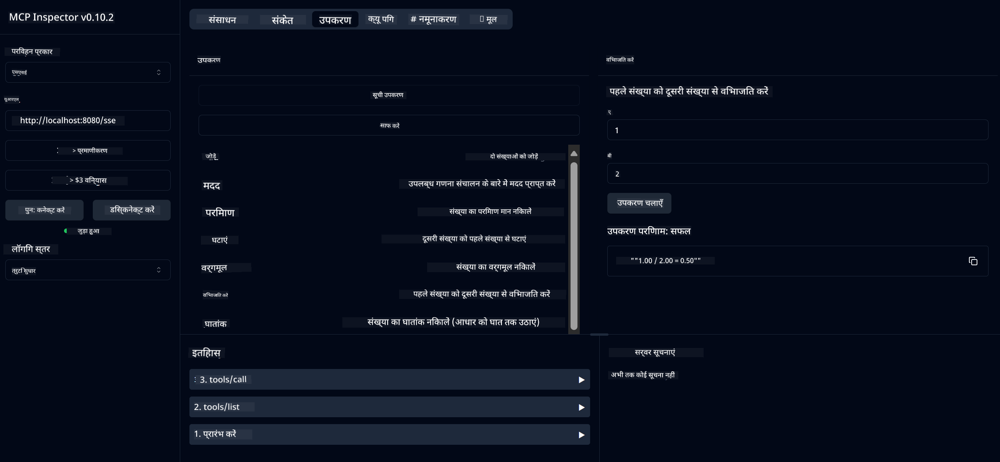

<!--
CO_OP_TRANSLATOR_METADATA:
{
  "original_hash": "13231e9951b68efd9df8c56bd5cdb27e",
  "translation_date": "2025-05-17T13:07:35+00:00",
  "source_file": "03-GettingStarted/samples/java/calculator/README.md",
  "language_code": "hi"
}
-->
# बेसिक कैलकुलेटर MCP सर्विस

यह सेवा मॉडल कॉन्टेक्स्ट प्रोटोकॉल (MCP) के माध्यम से बेसिक कैलकुलेटर ऑपरेशन्स प्रदान करती है, जो कि स्प्रिंग बूट के साथ वेबफ्लक्स ट्रांसपोर्ट का उपयोग करती है। इसे MCP इम्प्लीमेंटेशन सीखने वाले शुरुआती लोगों के लिए एक सरल उदाहरण के रूप में डिज़ाइन किया गया है।

अधिक जानकारी के लिए, [MCP सर्वर बूट स्टार्टर](https://docs.spring.io/spring-ai/reference/api/mcp/mcp-server-boot-starter-docs.html) संदर्भ दस्तावेज़ देखें।

## अवलोकन

सेवा में निम्नलिखित शामिल हैं:
- SSE (सर्वर-सेंड इवेंट्स) के लिए समर्थन
- स्प्रिंग AI के `@Tool` एनोटेशन का उपयोग करके स्वचालित टूल रजिस्ट्रेशन
- बेसिक कैलकुलेटर फंक्शन्स:
  - जोड़, घटाव, गुणा, भाग
  - पावर कैलकुलेशन और वर्गमूल
  - मोड्यूलस (शेष) और पूर्णांक मान
  - ऑपरेशन विवरण के लिए हेल्प फंक्शन

## विशेषताएँ

यह कैलकुलेटर सेवा निम्नलिखित क्षमताएँ प्रदान करती है:

1. **बेसिक गणितीय ऑपरेशन्स**:
   - दो संख्याओं का जोड़
   - एक संख्या को दूसरी से घटाना
   - दो संख्याओं का गुणा
   - एक संख्या को दूसरी से विभाजित करना (शून्य विभाजन जांच के साथ)

2. **उन्नत ऑपरेशन्स**:
   - पावर कैलकुलेशन (आधार को घातांक तक उठाना)
   - वर्गमूल कैलकुलेशन (नकारात्मक संख्या जांच के साथ)
   - मोड्यूलस (शेष) कैलकुलेशन
   - पूर्णांक मान कैलकुलेशन

3. **हेल्प सिस्टम**:
   - सभी उपलब्ध ऑपरेशन्स की व्याख्या करने वाला बिल्ट-इन हेल्प फंक्शन

## सेवा का उपयोग करना

सेवा MCP प्रोटोकॉल के माध्यम से निम्नलिखित API एंडपॉइंट्स को एक्सपोज़ करती है:

- `add(a, b)`: दो संख्याओं को जोड़ें
- `subtract(a, b)`: दूसरी संख्या को पहली से घटाएं
- `multiply(a, b)`: दो संख्याओं का गुणा करें
- `divide(a, b)`: पहली संख्या को दूसरी से विभाजित करें (शून्य जांच के साथ)
- `power(base, exponent)`: संख्या की पावर कैलकुलेट करें
- `squareRoot(number)`: वर्गमूल कैलकुलेट करें (नकारात्मक संख्या जांच के साथ)
- `modulus(a, b)`: विभाजन करते समय शेष कैलकुलेट करें
- `absolute(number)`: पूर्णांक मान कैलकुलेट करें
- `help()`: उपलब्ध ऑपरेशन्स के बारे में जानकारी प्राप्त करें

## टेस्ट क्लाइंट

एक सरल टेस्ट क्लाइंट `com.microsoft.mcp.sample.client` पैकेज में शामिल है। `SampleCalculatorClient` क्लास कैलकुलेटर सेवा के उपलब्ध ऑपरेशन्स को प्रदर्शित करती है।

## LangChain4j क्लाइंट का उपयोग करना

परियोजना में `com.microsoft.mcp.sample.client.LangChain4jClient` में एक LangChain4j उदाहरण क्लाइंट शामिल है जो कैलकुलेटर सेवा को LangChain4j और GitHub मॉडल्स के साथ एकीकृत करने का तरीका दिखाता है:

### आवश्यकताएँ

1. **GitHub टोकन सेटअप**:

   GitHub के AI मॉडल्स (जैसे phi-4) का उपयोग करने के लिए आपको GitHub व्यक्तिगत एक्सेस टोकन की आवश्यकता होती है:

   a. अपने GitHub अकाउंट सेटिंग्स पर जाएं: https://github.com/settings/tokens
   
   b. "नया टोकन जनरेट करें" पर क्लिक करें → "नया टोकन (क्लासिक) जनरेट करें"
   
   c. अपने टोकन को एक वर्णनात्मक नाम दें
   
   d. निम्नलिखित स्कोप्स चुनें:
      - `repo` (निजी रिपॉजिटरी का पूर्ण नियंत्रण)
      - `read:org` (ऑर्ग और टीम सदस्यता पढ़ें, ऑर्ग प्रोजेक्ट्स पढ़ें)
      - `gist` (गिस्ट्स बनाएं)
      - `user:email` (उपयोगकर्ता ईमेल पते तक पहुंच (केवल-पढ़ने योग्य))
   
   e. "टोकन जनरेट करें" पर क्लिक करें और अपने नए टोकन को कॉपी करें
   
   f. इसे एक पर्यावरणीय चर के रूप में सेट करें:
      
      विंडोज पर:
      ```
      set GITHUB_TOKEN=your-github-token
      ```
      
      macOS/Linux पर:
      ```bash
      export GITHUB_TOKEN=your-github-token
      ```

   g. स्थायी सेटअप के लिए, इसे सिस्टम सेटिंग्स के माध्यम से अपने पर्यावरणीय चर में जोड़ें

2. अपने प्रोजेक्ट में LangChain4j GitHub डिपेंडेंसी जोड़ें (पहले से ही pom.xml में शामिल):
   ```xml
   <dependency>
       <groupId>dev.langchain4j</groupId>
       <artifactId>langchain4j-github</artifactId>
       <version>${langchain4j.version}</version>
   </dependency>
   ```

3. सुनिश्चित करें कि कैलकुलेटर सर्वर `localhost:8080` पर चल रहा है

### LangChain4j क्लाइंट चलाना

यह उदाहरण प्रदर्शित करता है:
- SSE ट्रांसपोर्ट के माध्यम से कैलकुलेटर MCP सर्वर से कनेक्ट करना
- LangChain4j का उपयोग करके एक चैट बॉट बनाना जो कैलकुलेटर ऑपरेशन्स का लाभ उठाता है
- GitHub AI मॉडल्स के साथ एकीकृत करना (अब phi-4 मॉडल का उपयोग कर रहा है)

क्लाइंट निम्नलिखित नमूना क्वेरी भेजता है ताकि कार्यक्षमता प्रदर्शित की जा सके:
1. दो संख्याओं का योग कैलकुलेट करना
2. संख्या का वर्गमूल ढूंढना
3. उपलब्ध कैलकुलेटर ऑपरेशन्स के बारे में हेल्प जानकारी प्राप्त करना

उदाहरण चलाएं और कंसोल आउटपुट देखें कि AI मॉडल कैसे कैलकुलेटर टूल्स का उपयोग करके क्वेरीज़ का उत्तर देता है।

### GitHub मॉडल कॉन्फ़िगरेशन

LangChain4j क्लाइंट GitHub के phi-4 मॉडल का उपयोग निम्नलिखित सेटिंग्स के साथ करता है:

```java
ChatLanguageModel model = GitHubChatModel.builder()
    .apiKey(System.getenv("GITHUB_TOKEN"))
    .timeout(Duration.ofSeconds(60))
    .modelName("phi-4")
    .logRequests(true)
    .logResponses(true)
    .build();
```

विभिन्न GitHub मॉडल्स का उपयोग करने के लिए, `modelName` पैरामीटर को किसी अन्य समर्थित मॉडल (जैसे, "claude-3-haiku-20240307", "llama-3-70b-8192", आदि) में बदलें।

## डिपेंडेंसीज़

परियोजना को निम्नलिखित प्रमुख डिपेंडेंसीज़ की आवश्यकता है:

```xml
<!-- For MCP Server -->
<dependency>
    <groupId>org.springframework.ai</groupId>
    <artifactId>spring-ai-starter-mcp-server-webflux</artifactId>
</dependency>

<!-- For LangChain4j integration -->
<dependency>
    <groupId>dev.langchain4j</groupId>
    <artifactId>langchain4j-mcp</artifactId>
    <version>${langchain4j.version}</version>
</dependency>

<!-- For GitHub models support -->
<dependency>
    <groupId>dev.langchain4j</groupId>
    <artifactId>langchain4j-github</artifactId>
    <version>${langchain4j.version}</version>
</dependency>
```

## परियोजना बनाना

Maven का उपयोग करके परियोजना बनाएं:
```bash
./mvnw clean install -DskipTests
```

## सर्वर चलाना

### Java का उपयोग करना

```bash
java -jar target/calculator-server-0.0.1-SNAPSHOT.jar
```

### MCP इंस्पेक्टर का उपयोग करना

MCP इंस्पेक्टर MCP सेवाओं के साथ इंटरैक्ट करने के लिए एक सहायक उपकरण है। इसे इस कैलकुलेटर सेवा के साथ उपयोग करने के लिए:

1. **MCP इंस्पेक्टर इंस्टॉल करें और चलाएं** एक नए टर्मिनल विंडो में:
   ```bash
   npx @modelcontextprotocol/inspector
   ```

2. **वेब UI तक पहुंचें** ऐप द्वारा प्रदर्शित URL पर क्लिक करके (आमतौर पर http://localhost:6274)

3. **कनेक्शन कॉन्फ़िगर करें**:
   - ट्रांसपोर्ट प्रकार को "SSE" पर सेट करें
   - URL को अपने चल रहे सर्वर के SSE एंडपॉइंट पर सेट करें: `http://localhost:8080/sse`
   - "कनेक्ट" पर क्लिक करें

4. **उपकरणों का उपयोग करें**:
   - उपलब्ध कैलकुलेटर ऑपरेशन्स देखने के लिए "सूची उपकरण" पर क्लिक करें
   - एक उपकरण चुनें और एक ऑपरेशन को निष्पादित करने के लिए "उपकरण चलाएं" पर क्लिक करें



### Docker का उपयोग करना

परियोजना में कंटेनरीकृत डिप्लॉयमेंट के लिए एक Dockerfile शामिल है:

1. **Docker इमेज बनाएं**:
   ```bash
   docker build -t calculator-mcp-service .
   ```

2. **Docker कंटेनर चलाएं**:
   ```bash
   docker run -p 8080:8080 calculator-mcp-service
   ```

यह करेगा:
- Maven 3.9.9 और Eclipse Temurin 24 JDK के साथ एक मल्टी-स्टेज Docker इमेज बनाएगा
- एक ऑप्टिमाइज़्ड कंटेनर इमेज बनाएगा
- सेवा को पोर्ट 8080 पर एक्सपोज़ करेगा
- कंटेनर के अंदर MCP कैलकुलेटर सेवा शुरू करेगा

आप सेवा तक पहुंच सकते हैं `http://localhost:8080` पर जब कंटेनर चल रहा हो।

## समस्या निवारण

### GitHub टोकन के साथ सामान्य समस्याएँ

1. **टोकन अनुमति समस्याएँ**: यदि आपको 403 फॉरबिडन त्रुटि मिलती है, तो सुनिश्चित करें कि आपके टोकन के पास आवश्यक अनुमति है जैसा कि आवश्यकताओं में बताया गया है।

2. **टोकन नहीं मिला**: यदि आपको "कोई API कुंजी नहीं मिली" त्रुटि मिलती है, तो सुनिश्चित करें कि GITHUB_TOKEN पर्यावरणीय चर सही ढंग से सेट है।

3. **दर सीमा**: GitHub API की दर सीमाएँ होती हैं। यदि आपको दर सीमा त्रुटि (स्थिति कोड 429) मिलती है, तो कुछ मिनट प्रतीक्षा करें और फिर से प्रयास करें।

4. **टोकन समाप्ति**: GitHub टोकन समाप्त हो सकते हैं। यदि आपको कुछ समय बाद प्रमाणीकरण त्रुटियाँ मिलती हैं, तो नया टोकन जनरेट करें और अपने पर्यावरणीय चर को अपडेट करें।

यदि आपको और सहायता की आवश्यकता है, तो [LangChain4j दस्तावेज़](https://github.com/langchain4j/langchain4j) या [GitHub API दस्तावेज़](https://docs.github.com/en/rest) देखें।

**अस्वीकरण**:  
यह दस्तावेज़ AI अनुवाद सेवा [Co-op Translator](https://github.com/Azure/co-op-translator) का उपयोग करके अनुवादित किया गया है। जबकि हम सटीकता के लिए प्रयासरत हैं, कृपया अवगत रहें कि स्वचालित अनुवाद में त्रुटियाँ या अशुद्धियाँ हो सकती हैं। मूल दस्तावेज़ को उसकी मूल भाषा में प्रामाणिक स्रोत माना जाना चाहिए। महत्वपूर्ण जानकारी के लिए, पेशेवर मानव अनुवाद की सिफारिश की जाती है। इस अनुवाद के उपयोग से उत्पन्न किसी भी गलतफहमी या गलत व्याख्या के लिए हम जिम्मेदार नहीं हैं।