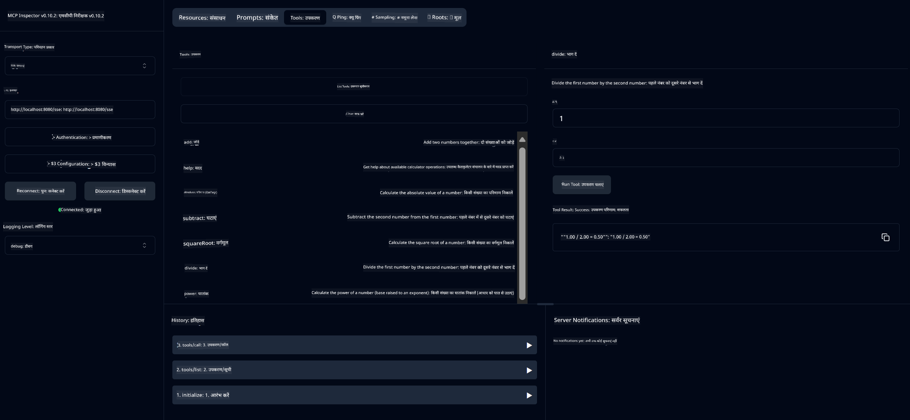

<!--
CO_OP_TRANSLATOR_METADATA:
{
  "original_hash": "13231e9951b68efd9df8c56bd5cdb27e",
  "translation_date": "2025-07-13T22:23:50+00:00",
  "source_file": "03-GettingStarted/samples/java/calculator/README.md",
  "language_code": "hi"
}
-->
# Basic Calculator MCP Service

यह सेवा Model Context Protocol (MCP) के माध्यम से बुनियादी कैलकुलेटर ऑपरेशंस प्रदान करती है, जो Spring Boot के साथ WebFlux ट्रांसपोर्ट का उपयोग करती है। इसे MCP इम्प्लीमेंटेशन सीखने वाले शुरुआती लोगों के लिए एक सरल उदाहरण के रूप में डिज़ाइन किया गया है।

अधिक जानकारी के लिए, [MCP Server Boot Starter](https://docs.spring.io/spring-ai/reference/api/mcp/mcp-server-boot-starter-docs.html) संदर्भ दस्तावेज़ देखें।

## अवलोकन

यह सेवा निम्नलिखित दिखाती है:
- SSE (Server-Sent Events) का समर्थन
- Spring AI के `@Tool` एनोटेशन के माध्यम से स्वचालित टूल पंजीकरण
- बुनियादी कैलकुलेटर फ़ंक्शंस:
  - जोड़, घटाव, गुणा, भाग
  - घातांक गणना और वर्गमूल
  - माड्यूलस (शेषफल) और पूर्णांक मान
  - ऑपरेशन विवरण के लिए हेल्प फ़ंक्शन

## विशेषताएँ

यह कैलकुलेटर सेवा निम्नलिखित क्षमताएँ प्रदान करती है:

1. **बुनियादी अंकगणितीय ऑपरेशन**:
   - दो संख्याओं का जोड़
   - एक संख्या से दूसरी संख्या को घटाना
   - दो संख्याओं का गुणा
   - एक संख्या को दूसरी संख्या से भाग देना (शून्य भाग के लिए जांच के साथ)

2. **उन्नत ऑपरेशन**:
   - घातांक गणना (एक आधार को घातांक तक उठाना)
   - वर्गमूल गणना (ऋण संख्या के लिए जांच के साथ)
   - माड्यूलस (शेषफल) गणना
   - पूर्णांक मान गणना

3. **हेल्प सिस्टम**:
   - उपलब्ध सभी ऑपरेशंस की व्याख्या करने वाला अंतर्निर्मित हेल्प फ़ंक्शन

## सेवा का उपयोग

यह सेवा MCP प्रोटोकॉल के माध्यम से निम्नलिखित API एंडपॉइंट्स प्रदान करती है:

- `add(a, b)`: दो संख्याओं को जोड़ें
- `subtract(a, b)`: पहली संख्या से दूसरी संख्या घटाएं
- `multiply(a, b)`: दो संख्याओं का गुणा करें
- `divide(a, b)`: पहली संख्या को दूसरी संख्या से भाग दें (शून्य जांच के साथ)
- `power(base, exponent)`: किसी संख्या की घातांक गणना करें
- `squareRoot(number)`: वर्गमूल निकालें (ऋण संख्या जांच के साथ)
- `modulus(a, b)`: भाग देने पर शेषफल निकालें
- `absolute(number)`: पूर्णांक मान निकालें
- `help()`: उपलब्ध ऑपरेशंस के बारे में जानकारी प्राप्त करें

## टेस्ट क्लाइंट

`com.microsoft.mcp.sample.client` पैकेज में एक सरल टेस्ट क्लाइंट शामिल है। `SampleCalculatorClient` क्लास कैलकुलेटर सेवा के उपलब्ध ऑपरेशंस को प्रदर्शित करता है।

## LangChain4j क्लाइंट का उपयोग

प्रोजेक्ट में `com.microsoft.mcp.sample.client.LangChain4jClient` में LangChain4j उदाहरण क्लाइंट शामिल है, जो दिखाता है कि कैलकुलेटर सेवा को LangChain4j और GitHub मॉडल्स के साथ कैसे इंटीग्रेट किया जाए:

### आवश्यकताएँ

1. **GitHub टोकन सेटअप**:

   GitHub के AI मॉडल्स (जैसे phi-4) का उपयोग करने के लिए आपको GitHub पर्सनल एक्सेस टोकन चाहिए:

   a. अपने GitHub अकाउंट सेटिंग्स पर जाएं: https://github.com/settings/tokens

   b. "Generate new token" → "Generate new token (classic)" पर क्लिक करें

   c. अपने टोकन को एक वर्णनात्मक नाम दें

   d. निम्नलिखित स्कोप्स चुनें:
      - `repo` (प्राइवेट रिपॉजिटरीज का पूर्ण नियंत्रण)
      - `read:org` (ऑर्ग और टीम सदस्यता पढ़ें, ऑर्ग प्रोजेक्ट्स पढ़ें)
      - `gist` (गिस्ट बनाएं)
      - `user:email` (यूजर ईमेल एड्रेस तक पहुँच (केवल पढ़ने के लिए))

   e. "Generate token" पर क्लिक करें और नया टोकन कॉपी करें

   f. इसे एक पर्यावरण चर के रूप में सेट करें:

      Windows पर:  
      ```
      set GITHUB_TOKEN=your-github-token
      ```

      macOS/Linux पर:  
      ```bash
      export GITHUB_TOKEN=your-github-token
      ```

   g. स्थायी सेटअप के लिए, इसे सिस्टम सेटिंग्स के माध्यम से अपने पर्यावरण चर में जोड़ें

2. अपने प्रोजेक्ट में LangChain4j GitHub डिपेंडेंसी जोड़ें (pom.xml में पहले से शामिल है):  
   ```xml
   <dependency>
       <groupId>dev.langchain4j</groupId>
       <artifactId>langchain4j-github</artifactId>
       <version>${langchain4j.version}</version>
   </dependency>
   ```

3. सुनिश्चित करें कि कैलकुलेटर सर्वर `localhost:8080` पर चल रहा है

### LangChain4j क्लाइंट चलाना

यह उदाहरण दिखाता है:
- कैलकुलेटर MCP सर्वर से SSE ट्रांसपोर्ट के माध्यम से कनेक्ट करना
- LangChain4j का उपयोग करके एक चैट बॉट बनाना जो कैलकुलेटर ऑपरेशंस का उपयोग करता है
- GitHub AI मॉडल्स के साथ इंटीग्रेशन (अब phi-4 मॉडल का उपयोग)

क्लाइंट निम्नलिखित नमूना क्वेरी भेजता है ताकि कार्यक्षमता दिखाई जा सके:
1. दो संख्याओं का योग निकालना
2. किसी संख्या का वर्गमूल निकालना
3. उपलब्ध कैलकुलेटर ऑपरेशंस के बारे में हेल्प जानकारी प्राप्त करना

उदाहरण चलाएं और कंसोल आउटपुट देखें कि AI मॉडल कैलकुलेटर टूल्स का उपयोग करके क्वेरीज़ का जवाब कैसे देता है।

### GitHub मॉडल कॉन्फ़िगरेशन

LangChain4j क्लाइंट GitHub के phi-4 मॉडल के साथ निम्नलिखित सेटिंग्स के साथ कॉन्फ़िगर किया गया है:

```java
ChatLanguageModel model = GitHubChatModel.builder()
    .apiKey(System.getenv("GITHUB_TOKEN"))
    .timeout(Duration.ofSeconds(60))
    .modelName("phi-4")
    .logRequests(true)
    .logResponses(true)
    .build();
```

विभिन्न GitHub मॉडल्स का उपयोग करने के लिए, बस `modelName` पैरामीटर को किसी अन्य समर्थित मॉडल (जैसे "claude-3-haiku-20240307", "llama-3-70b-8192", आदि) में बदलें।

## डिपेंडेंसीज़

प्रोजेक्ट को निम्नलिखित मुख्य डिपेंडेंसीज़ की आवश्यकता है:

```xml
<!-- For MCP Server -->
<dependency>
    <groupId>org.springframework.ai</groupId>
    <artifactId>spring-ai-starter-mcp-server-webflux</artifactId>
</dependency>

<!-- For LangChain4j integration -->
<dependency>
    <groupId>dev.langchain4j</groupId>
    <artifactId>langchain4j-mcp</artifactId>
    <version>${langchain4j.version}</version>
</dependency>

<!-- For GitHub models support -->
<dependency>
    <groupId>dev.langchain4j</groupId>
    <artifactId>langchain4j-github</artifactId>
    <version>${langchain4j.version}</version>
</dependency>
```

## प्रोजेक्ट बनाना

Maven का उपयोग करके प्रोजेक्ट बनाएं:  
```bash
./mvnw clean install -DskipTests
```

## सर्वर चलाना

### Java का उपयोग करते हुए

```bash
java -jar target/calculator-server-0.0.1-SNAPSHOT.jar
```

### MCP Inspector का उपयोग

MCP Inspector MCP सेवाओं के साथ इंटरैक्ट करने के लिए एक उपयोगी टूल है। इसे इस कैलकुलेटर सेवा के साथ उपयोग करने के लिए:

1. **MCP Inspector इंस्टॉल करें और एक नए टर्मिनल विंडो में चलाएं:**  
   ```bash
   npx @modelcontextprotocol/inspector
   ```

2. **वेब UI तक पहुँचें** ऐप द्वारा प्रदर्शित URL पर क्लिक करके (आमतौर पर http://localhost:6274)

3. **कनेक्शन कॉन्फ़िगर करें**:
   - ट्रांसपोर्ट प्रकार "SSE" सेट करें
   - URL को अपने चल रहे सर्वर के SSE एंडपॉइंट पर सेट करें: `http://localhost:8080/sse`
   - "Connect" पर क्लिक करें

4. **टूल्स का उपयोग करें**:
   - "List Tools" पर क्लिक करके उपलब्ध कैलकुलेटर ऑपरेशंस देखें
   - किसी टूल का चयन करें और "Run Tool" पर क्लिक करके ऑपरेशन चलाएं



### Docker का उपयोग

प्रोजेक्ट में कंटेनराइज्ड डिप्लॉयमेंट के लिए Dockerfile शामिल है:

1. **Docker इमेज बनाएं**:  
   ```bash
   docker build -t calculator-mcp-service .
   ```

2. **Docker कंटेनर चलाएं**:  
   ```bash
   docker run -p 8080:8080 calculator-mcp-service
   ```

यह करेगा:
- Maven 3.9.9 और Eclipse Temurin 24 JDK के साथ मल्टी-स्टेज Docker इमेज बनाएगा
- एक ऑप्टिमाइज़्ड कंटेनर इमेज बनाएगा
- सेवा को पोर्ट 8080 पर एक्सपोज़ करेगा
- कंटेनर के अंदर MCP कैलकुलेटर सेवा शुरू करेगा

कंटेनर चलने के बाद आप सेवा को `http://localhost:8080` पर एक्सेस कर सकते हैं।

## समस्या निवारण

### GitHub टोकन से संबंधित सामान्य समस्याएँ

1. **टोकन अनुमति समस्याएँ**: यदि आपको 403 Forbidden त्रुटि मिलती है, तो सुनिश्चित करें कि आपके टोकन में आवश्यक अनुमतियाँ हैं जैसा कि आवश्यकताओं में बताया गया है।

2. **टोकन नहीं मिला**: यदि "No API key found" त्रुटि आती है, तो सुनिश्चित करें कि GITHUB_TOKEN पर्यावरण चर सही ढंग से सेट है।

3. **रेट लिमिटिंग**: GitHub API पर रेट लिमिट होती है। यदि आपको रेट लिमिट त्रुटि (स्टेटस कोड 429) मिलती है, तो कुछ मिनट इंतजार करें और फिर पुनः प्रयास करें।

4. **टोकन समाप्ति**: GitHub टोकन की वैधता समाप्त हो सकती है। यदि कुछ समय बाद प्रमाणीकरण त्रुटियाँ आती हैं, तो नया टोकन जनरेट करें और अपने पर्यावरण चर को अपडेट करें।

यदि आपको और सहायता चाहिए, तो [LangChain4j दस्तावेज़](https://github.com/langchain4j/langchain4j) या [GitHub API दस्तावेज़](https://docs.github.com/en/rest) देखें।

**अस्वीकरण**:  
यह दस्तावेज़ AI अनुवाद सेवा [Co-op Translator](https://github.com/Azure/co-op-translator) का उपयोग करके अनुवादित किया गया है। जबकि हम सटीकता के लिए प्रयासरत हैं, कृपया ध्यान दें कि स्वचालित अनुवादों में त्रुटियाँ या अशुद्धियाँ हो सकती हैं। मूल दस्तावेज़ अपनी मूल भाषा में ही अधिकारिक स्रोत माना जाना चाहिए। महत्वपूर्ण जानकारी के लिए, पेशेवर मानव अनुवाद की सलाह दी जाती है। इस अनुवाद के उपयोग से उत्पन्न किसी भी गलतफहमी या गलत व्याख्या के लिए हम जिम्मेदार नहीं हैं।