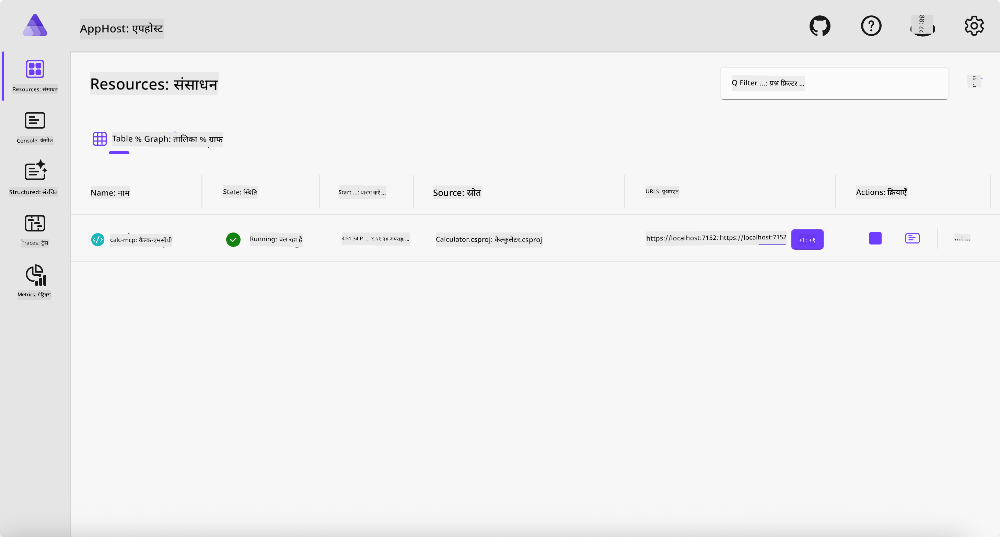
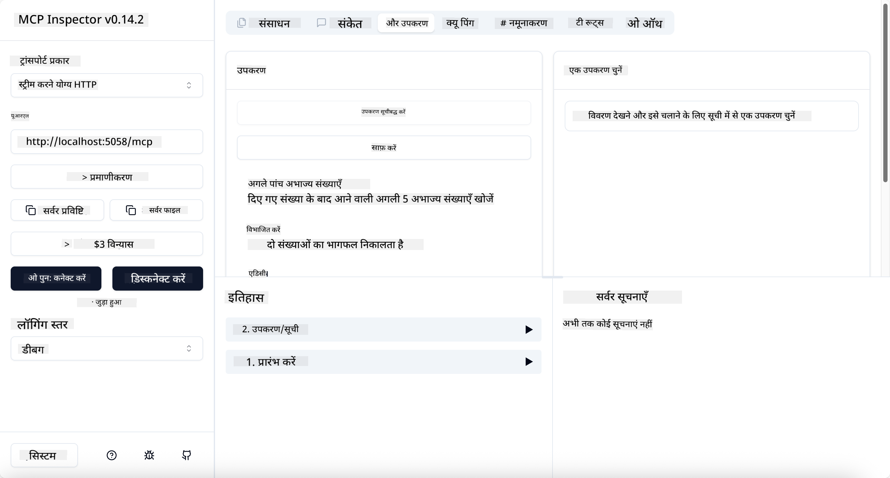
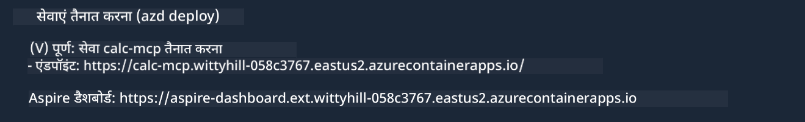

<!--
CO_OP_TRANSLATOR_METADATA:
{
  "original_hash": "0bc7bd48f55f1565f1d95ccb2c16f728",
  "translation_date": "2025-07-13T23:05:14+00:00",
  "source_file": "04-PracticalImplementation/samples/csharp/README.md",
  "language_code": "hi"
}
-->
# Sample

पिछला उदाहरण दिखाता है कि `stdio` प्रकार के साथ एक स्थानीय .NET प्रोजेक्ट का उपयोग कैसे किया जाता है। और कंटेनर में सर्वर को स्थानीय रूप से कैसे चलाया जाता है। यह कई परिस्थितियों में एक अच्छा समाधान है। हालांकि, सर्वर को दूरस्थ रूप से चलाना भी उपयोगी हो सकता है, जैसे कि क्लाउड वातावरण में। यहीं पर `http` प्रकार काम आता है।

`04-PracticalImplementation` फ़ोल्डर में समाधान को देखने पर यह पिछले उदाहरण की तुलना में कहीं अधिक जटिल लग सकता है। लेकिन वास्तव में ऐसा नहीं है। यदि आप प्रोजेक्ट `src/Calculator` को ध्यान से देखें, तो आप पाएंगे कि यह ज्यादातर वही कोड है जो पिछले उदाहरण में था। केवल अंतर यह है कि हम HTTP अनुरोधों को संभालने के लिए एक अलग लाइब्रेरी `ModelContextProtocol.AspNetCore` का उपयोग कर रहे हैं। और हमने `IsPrime` मेथड को प्राइवेट कर दिया है, सिर्फ यह दिखाने के लिए कि आप अपने कोड में प्राइवेट मेथड्स भी रख सकते हैं। बाकी कोड पहले जैसा ही है।

अन्य प्रोजेक्ट [.NET Aspire](https://learn.microsoft.com/dotnet/aspire/get-started/aspire-overview) से हैं। समाधान में .NET Aspire होने से डेवलपर का अनुभव बेहतर होता है, विकास और परीक्षण के दौरान मदद मिलती है और ऑब्ज़र्वेबिलिटी में सुधार होता है। सर्वर चलाने के लिए यह आवश्यक नहीं है, लेकिन इसे अपने समाधान में रखना एक अच्छी प्रैक्टिस है।

## सर्वर को स्थानीय रूप से शुरू करें

1. VS Code (C# DevKit एक्सटेंशन के साथ) से `04-PracticalImplementation/samples/csharp` डायरेक्टरी में जाएं।
1. सर्वर शुरू करने के लिए निम्नलिखित कमांड चलाएं:

   ```bash
    dotnet watch run --project ./src/AppHost
   ```

1. जब कोई वेब ब्राउज़र .NET Aspire डैशबोर्ड खोले, तो `http` URL नोट करें। यह कुछ इस तरह होना चाहिए: `http://localhost:5058/`।

   

## MCP Inspector के साथ Streamable HTTP का परीक्षण करें

यदि आपके पास Node.js 22.7.5 या उससे ऊपर है, तो आप MCP Inspector का उपयोग करके अपने सर्वर का परीक्षण कर सकते हैं।

सर्वर शुरू करें और टर्मिनल में निम्नलिखित कमांड चलाएं:

```bash
npx @modelcontextprotocol/inspector http://localhost:5058
```



- Transport प्रकार के रूप में `Streamable HTTP` चुनें।
- Url फ़ील्ड में पहले नोट किया गया सर्वर URL दर्ज करें, और उसके अंत में `/mcp` जोड़ें। यह `http` (न कि `https`) होना चाहिए, कुछ इस तरह: `http://localhost:5058/mcp`।
- Connect बटन चुनें।

Inspector की एक अच्छी बात यह है कि यह आपको जो कुछ हो रहा है उसकी अच्छी दृश्यता प्रदान करता है।

- उपलब्ध टूल्स की सूची बनाने की कोशिश करें
- उनमें से कुछ को आज़माएं, यह पहले की तरह काम करना चाहिए।

## VS Code में GitHub Copilot Chat के साथ MCP Server का परीक्षण करें

Streamable HTTP ट्रांसपोर्ट का उपयोग करने के लिए, पहले बनाए गए `calc-mcp` सर्वर की कॉन्फ़िगरेशन को इस तरह बदलें:

```jsonc
// .vscode/mcp.json
{
  "servers": {
    "calc-mcp": {
      "type": "http",
      "url": "http://localhost:5058/mcp"
    }
  }
}
```

कुछ परीक्षण करें:

- "3 prime numbers after 6780" पूछें। ध्यान दें कि Copilot नए टूल्स `NextFivePrimeNumbers` का उपयोग करेगा और केवल पहले 3 प्राइम नंबर लौटाएगा।
- "7 prime numbers after 111" पूछें, देखें क्या होता है।
- "John के पास 24 लोल्ली हैं और वह उन्हें अपने 3 बच्चों में बांटना चाहता है। प्रत्येक बच्चे के पास कितनी लोल्ली होगी?" पूछें, देखें क्या होता है।

## सर्वर को Azure पर तैनात करें

आइए सर्वर को Azure पर तैनात करें ताकि अधिक लोग इसका उपयोग कर सकें।

टर्मिनल से `04-PracticalImplementation/samples/csharp` फ़ोल्डर में जाएं और निम्नलिखित कमांड चलाएं:

```bash
azd up
```

तैनाती पूरी होने के बाद, आपको इस तरह का संदेश दिखाई देगा:



URL लें और इसे MCP Inspector और GitHub Copilot Chat में उपयोग करें।

```jsonc
// .vscode/mcp.json
{
  "servers": {
    "calc-mcp": {
      "type": "http",
      "url": "https://calc-mcp.gentleriver-3977fbcf.australiaeast.azurecontainerapps.io/mcp"
    }
  }
}
```

## आगे क्या?

हमने विभिन्न ट्रांसपोर्ट प्रकारों और परीक्षण टूल्स को आज़माया। हमने आपका MCP सर्वर Azure पर तैनात भी किया। लेकिन अगर हमारे सर्वर को प्राइवेट संसाधनों तक पहुंचने की जरूरत हो? उदाहरण के लिए, कोई डेटाबेस या प्राइवेट API? अगले अध्याय में, हम देखेंगे कि हम अपने सर्वर की सुरक्षा को कैसे बेहतर बना सकते हैं।

**अस्वीकरण**:  
यह दस्तावेज़ AI अनुवाद सेवा [Co-op Translator](https://github.com/Azure/co-op-translator) का उपयोग करके अनुवादित किया गया है। जबकि हम सटीकता के लिए प्रयासरत हैं, कृपया ध्यान दें कि स्वचालित अनुवादों में त्रुटियाँ या अशुद्धियाँ हो सकती हैं। मूल दस्तावेज़ अपनी मूल भाषा में ही अधिकारिक स्रोत माना जाना चाहिए। महत्वपूर्ण जानकारी के लिए, पेशेवर मानव अनुवाद की सलाह दी जाती है। इस अनुवाद के उपयोग से उत्पन्न किसी भी गलतफहमी या गलत व्याख्या के लिए हम जिम्मेदार नहीं हैं।