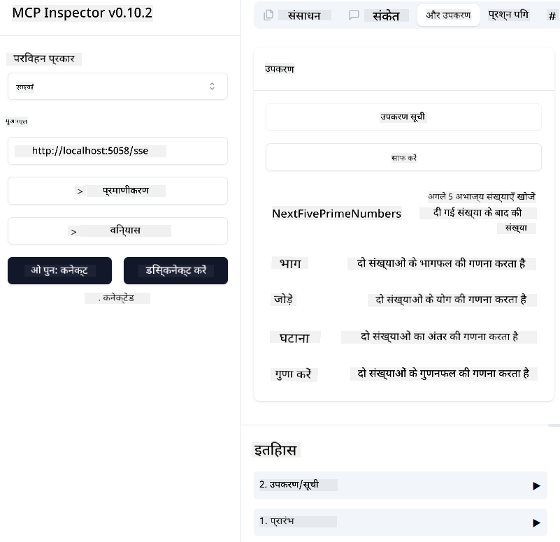
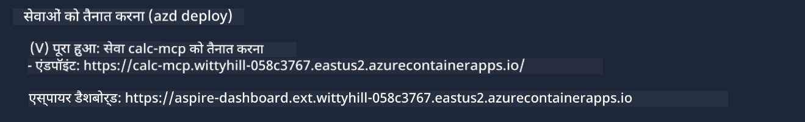

<!--
CO_OP_TRANSLATOR_METADATA:
{
  "original_hash": "5020a3e1a1c7f30c00f9e37f1fa208e3",
  "translation_date": "2025-05-17T14:06:29+00:00",
  "source_file": "04-PracticalImplementation/samples/csharp/README.md",
  "language_code": "hi"
}
-->
# नमूना

पिछला उदाहरण दिखाता है कि कैसे एक स्थानीय .NET प्रोजेक्ट को `sdio` प्रकार के साथ उपयोग करें। और कैसे सर्वर को एक कंटेनर में स्थानीय रूप से चलाएं। यह कई स्थितियों में एक अच्छा समाधान है। हालांकि, यह उपयोगी हो सकता है कि सर्वर को रिमोटली चलाएं, जैसे कि एक क्लाउड वातावरण में। यही वह जगह है जहाँ `http` प्रकार आता है।

`04-PracticalImplementation` फ़ोल्डर में समाधान को देखते हुए, यह पिछले वाले की तुलना में बहुत अधिक जटिल लग सकता है। लेकिन वास्तव में, ऐसा नहीं है। यदि आप प्रोजेक्ट `src/mcpserver/mcpserver.csproj` को ध्यान से देखें, तो आप देखेंगे कि यह अधिकांशतः पिछले उदाहरण के समान कोड है। एकमात्र अंतर यह है कि हम HTTP अनुरोधों को संभालने के लिए एक अलग लाइब्रेरी `ModelContextProtocol.AspNetCore` का उपयोग कर रहे हैं। और हम विधि `IsPrime` को निजी बनाने के लिए बदलते हैं, सिर्फ यह दिखाने के लिए कि आप अपने कोड में निजी विधियाँ रख सकते हैं। बाकी कोड पहले जैसा ही है।

अन्य प्रोजेक्ट [.NET Aspire](https://learn.microsoft.com/dotnet/aspire/get-started/aspire-overview) से हैं। समाधान में .NET Aspire होने से डेवलपर के अनुभव में सुधार होगा जबकि विकास और परीक्षण के दौरान और अवलोकन में मदद मिलेगी। सर्वर को चलाने के लिए यह आवश्यक नहीं है, लेकिन इसे अपने समाधान में रखना एक अच्छा अभ्यास है।

## सर्वर को स्थानीय रूप से शुरू करें

1. VS Code से (C# DevKit एक्सटेंशन के साथ), समाधान `04-PracticalImplementation\samples\csharp\src\Calculator-chap4.sln` खोलें।
2. सर्वर शुरू करने के लिए `F5` दबाएं। इसे .NET Aspire डैशबोर्ड के साथ एक वेब ब्राउज़र शुरू करना चाहिए।

या

1. एक टर्मिनल से, फ़ोल्डर `04-PracticalImplementation\samples\csharp\src` पर जाएं
2. सर्वर शुरू करने के लिए निम्नलिखित कमांड चलाएं:
   ```bash
    dotnet run --project .\AppHost
   ```

3. डैशबोर्ड से, `http` URL नोट करें। यह कुछ इस तरह होना चाहिए `http://localhost:5058/`.

## Test `SSE` ModelContext Protocol Inspector के साथ

यदि आपके पास Node.js 22.7.5 और उच्चतर है, तो आप अपने सर्वर का परीक्षण करने के लिए ModelContext Protocol Inspector का उपयोग कर सकते हैं।

सर्वर शुरू करें और टर्मिनल में निम्नलिखित कमांड चलाएं:

```bash
npx @modelcontextprotocol/inspector@latest
```



- `SSE` as the Transport type. SSE stand for Server-Sent Events. 
- In the Url field, enter the URL of the server noted earlier,and append `/sse` चुनें। यह `http` होना चाहिए (न कि `https`) something like `http://localhost:5058/sse`.
- select the Connect button.

A nice thing about the Inspector is that it provide a nice visibility on what is happening.

- Try listing the availables tools
- Try some of them, it should works just like before.


## Test `SSE` with Github Copilot Chat in VS Code

To use the `SSE` transport with Github Copilot Chat, change the configuration of the `mcp-calc` सर्वर जो पहले बनाया गया था ताकि यह इस तरह दिखे:

```json
"mcp-calc": {
    "type": "sse",
    "url": "http://localhost:5058/sse"
}
```

कुछ परीक्षण करें:
- 6780 के बाद के 3 अभाज्य संख्याओं के लिए पूछें। ध्यान दें कि Copilot नए उपकरण `NextFivePrimeNumbers` का उपयोग करेगा और केवल पहले 3 अभाज्य संख्याओं को लौटाएगा।
- 111 के बाद के 7 अभाज्य संख्याओं के लिए पूछें, यह देखने के लिए कि क्या होता है।

# सर्वर को Azure पर तैनात करें

आइए सर्वर को Azure पर तैनात करें ताकि अधिक लोग इसका उपयोग कर सकें।

एक टर्मिनल से, फ़ोल्डर `04-PracticalImplementation\samples\csharp\src` पर जाएं और निम्नलिखित कमांड चलाएं:

```bash
azd init
```

यह Azure संसाधनों की कॉन्फ़िगरेशन को बचाने के लिए और आपका इंफ्रास्ट्रक्चर कोड (IaC) के रूप में कुछ फ़ाइलें स्थानीय रूप से बनाएगा।

फिर, सर्वर को Azure पर तैनात करने के लिए निम्नलिखित कमांड चलाएं:

```bash
azd up
```

एक बार तैनाती समाप्त हो जाने पर, आपको इस तरह का संदेश देखना चाहिए:



Aspire डैशबोर्ड पर जाएं और MCP Inspector और Github Copilot Chat में उपयोग करने के लिए `HTTP` URL नोट करें।

## आगे क्या?

हम विभिन्न परिवहन प्रकारों और परीक्षण उपकरणों की कोशिश करते हैं और हमने अपने MCP सर्वर को Azure पर तैनात किया। लेकिन अगर हमारे सर्वर को निजी संसाधनों तक पहुंचने की आवश्यकता हो? उदाहरण के लिए, एक डेटाबेस या एक निजी API? अगले अध्याय में, हम देखेंगे कि कैसे हम अपने सर्वर की सुरक्षा में सुधार कर सकते हैं।

**अस्वीकरण**:  
यह दस्तावेज़ AI अनुवाद सेवा [Co-op Translator](https://github.com/Azure/co-op-translator) का उपयोग करके अनुवादित किया गया है। जबकि हम सटीकता के लिए प्रयास करते हैं, कृपया ध्यान दें कि स्वचालित अनुवाद में त्रुटियाँ या अशुद्धियाँ हो सकती हैं। मूल दस्तावेज़ को उसकी मूल भाषा में आधिकारिक स्रोत माना जाना चाहिए। महत्वपूर्ण जानकारी के लिए, पेशेवर मानव अनुवाद की सिफारिश की जाती है। इस अनुवाद के उपयोग से उत्पन्न किसी भी गलतफहमी या गलत व्याख्या के लिए हम उत्तरदायी नहीं हैं।