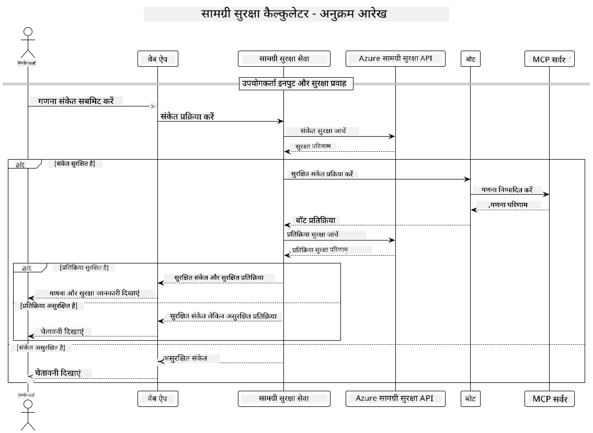

<!--
CO_OP_TRANSLATOR_METADATA:
{
  "original_hash": "e5ea5e7582f70008ea9bec3b3820f20a",
  "translation_date": "2025-07-13T23:13:56+00:00",
  "source_file": "04-PracticalImplementation/samples/java/containerapp/README.md",
  "language_code": "hi"
}
-->
## सिस्टम आर्किटेक्चर

यह प्रोजेक्ट एक वेब एप्लिकेशन को दर्शाता है जो उपयोगकर्ता के प्रॉम्प्ट को कैलकुलेटर सेवा को भेजने से पहले कंटेंट सेफ्टी चेकिंग करता है, जो Model Context Protocol (MCP) के माध्यम से काम करता है।



### यह कैसे काम करता है

1. **उपयोगकर्ता इनपुट**: उपयोगकर्ता वेब इंटरफेस में कैलकुलेशन प्रॉम्प्ट दर्ज करता है  
2. **कंटेंट सेफ्टी स्क्रीनिंग (इनपुट)**: प्रॉम्प्ट का विश्लेषण Azure Content Safety API द्वारा किया जाता है  
3. **सेफ्टी निर्णय (इनपुट)**:  
   - यदि कंटेंट सुरक्षित है (सभी श्रेणियों में गंभीरता < 2), तो यह कैलकुलेटर को भेजा जाता है  
   - यदि कंटेंट संभावित रूप से हानिकारक पाया जाता है, तो प्रक्रिया रुक जाती है और एक चेतावनी लौटाई जाती है  
4. **कैलकुलेटर इंटीग्रेशन**: सुरक्षित कंटेंट को LangChain4j द्वारा प्रोसेस किया जाता है, जो MCP कैलकुलेटर सर्वर से संवाद करता है  
5. **कंटेंट सेफ्टी स्क्रीनिंग (आउटपुट)**: बॉट के उत्तर का विश्लेषण Azure Content Safety API द्वारा किया जाता है  
6. **सेफ्टी निर्णय (आउटपुट)**:  
   - यदि बॉट का उत्तर सुरक्षित है, तो उसे उपयोगकर्ता को दिखाया जाता है  
   - यदि बॉट का उत्तर संभावित रूप से हानिकारक पाया जाता है, तो उसे चेतावनी से बदल दिया जाता है  
7. **प्रतिक्रिया**: परिणाम (यदि सुरक्षित हो) उपयोगकर्ता को दोनों सेफ्टी विश्लेषणों के साथ दिखाए जाते हैं  

## Model Context Protocol (MCP) का उपयोग करते हुए कैलकुलेटर सेवाएँ

यह प्रोजेक्ट दिखाता है कि कैसे Model Context Protocol (MCP) का उपयोग करके LangChain4j से कैलकुलेटर MCP सेवाओं को कॉल किया जा सकता है। इस कार्यान्वयन में पोर्ट 8080 पर चलने वाला लोकल MCP सर्वर कैलकुलेटर ऑपरेशंस प्रदान करता है।

### Azure Content Safety सेवा सेटअप करना

कंटेंट सेफ्टी फीचर्स का उपयोग करने से पहले, आपको Azure Content Safety सेवा संसाधन बनाना होगा:

1. [Azure Portal](https://portal.azure.com) में साइन इन करें  
2. "Create a resource" पर क्लिक करें और "Content Safety" खोजें  
3. "Content Safety" चुनें और "Create" पर क्लिक करें  
4. अपने संसाधन के लिए एक अनोखा नाम दर्ज करें  
5. अपनी सब्सक्रिप्शन और रिसोर्स ग्रुप चुनें (या नया बनाएं)  
6. एक समर्थित क्षेत्र चुनें ([Region availability](https://azure.microsoft.com/en-us/global-infrastructure/services/?products=cognitive-services) देखें)  
7. उपयुक्त प्राइसिंग टियर चुनें  
8. संसाधन तैनात करने के लिए "Create" पर क्लिक करें  
9. तैनाती पूरी होने पर "Go to resource" पर क्लिक करें  
10. बाएं पैन में "Resource Management" के अंतर्गत "Keys and Endpoint" चुनें  
11. अगली स्टेप में उपयोग के लिए किसी एक की और एंडपॉइंट URL को कॉपी करें  

### पर्यावरण चर कॉन्फ़िगर करना

GitHub मॉडल्स प्रमाणीकरण के लिए `GITHUB_TOKEN` पर्यावरण चर सेट करें:  
```sh
export GITHUB_TOKEN=<your_github_token>
```

कंटेंट सेफ्टी फीचर्स के लिए सेट करें:  
```sh
export CONTENT_SAFETY_ENDPOINT=<your_content_safety_endpoint>
export CONTENT_SAFETY_KEY=<your_content_safety_key>
```

ये पर्यावरण चर एप्लिकेशन द्वारा Azure Content Safety सेवा के साथ प्रमाणीकरण के लिए उपयोग किए जाते हैं। यदि ये चर सेट नहीं हैं, तो एप्लिकेशन डेमो उद्देश्यों के लिए प्लेसहोल्डर मानों का उपयोग करेगा, लेकिन कंटेंट सेफ्टी फीचर्स सही ढंग से काम नहीं करेंगे।

### कैलकुलेटर MCP सर्वर शुरू करना

क्लाइंट चलाने से पहले, आपको localhost:8080 पर SSE मोड में कैलकुलेटर MCP सर्वर शुरू करना होगा।

## प्रोजेक्ट विवरण

यह प्रोजेक्ट Model Context Protocol (MCP) को LangChain4j के साथ इंटीग्रेट करके कैलकुलेटर सेवाओं को कॉल करने का प्रदर्शन करता है। मुख्य विशेषताएं:

- बेसिक गणितीय ऑपरेशंस के लिए MCP का उपयोग करके कैलकुलेटर सेवा से कनेक्ट करना  
- उपयोगकर्ता प्रॉम्प्ट और बॉट प्रतिक्रियाओं दोनों पर डुअल-लेयर कंटेंट सेफ्टी चेकिंग  
- LangChain4j के माध्यम से GitHub के gpt-4.1-nano मॉडल के साथ इंटीग्रेशन  
- MCP ट्रांसपोर्ट के लिए Server-Sent Events (SSE) का उपयोग  

## कंटेंट सेफ्टी इंटीग्रेशन

प्रोजेक्ट में व्यापक कंटेंट सेफ्टी फीचर्स शामिल हैं ताकि उपयोगकर्ता इनपुट और सिस्टम प्रतिक्रियाएं दोनों हानिकारक सामग्री से मुक्त रहें:

1. **इनपुट स्क्रीनिंग**: सभी उपयोगकर्ता प्रॉम्प्ट्स को नफरत भरे भाषण, हिंसा, आत्म-हानि, और यौन सामग्री जैसी हानिकारक श्रेणियों के लिए प्रोसेसिंग से पहले विश्लेषित किया जाता है।  

2. **आउटपुट स्क्रीनिंग**: संभावित रूप से अनसेंसर्ड मॉडल्स का उपयोग करते समय भी, सिस्टम सभी उत्पन्न प्रतिक्रियाओं को समान कंटेंट सेफ्टी फिल्टर्स के माध्यम से जांचता है, इससे पहले कि उन्हें उपयोगकर्ता को दिखाया जाए।  

यह डुअल-लेयर दृष्टिकोण सुनिश्चित करता है कि सिस्टम सुरक्षित रहे, चाहे कोई भी AI मॉडल इस्तेमाल हो, और उपयोगकर्ताओं को हानिकारक इनपुट और संभावित समस्या उत्पन्न करने वाले AI-जनित आउटपुट दोनों से बचाता है।

## वेब क्लाइंट

एप्लिकेशन में एक उपयोगकर्ता-मित्रवत वेब इंटरफेस शामिल है जो उपयोगकर्ताओं को Content Safety Calculator सिस्टम के साथ इंटरैक्ट करने की अनुमति देता है:

### वेब इंटरफेस फीचर्स

- कैलकुलेशन प्रॉम्प्ट दर्ज करने के लिए सरल, सहज फॉर्म  
- डुअल-लेयर कंटेंट सेफ्टी वैलिडेशन (इनपुट और आउटपुट)  
- प्रॉम्प्ट और प्रतिक्रिया सुरक्षा पर रियल-टाइम फीडबैक  
- आसान व्याख्या के लिए रंग-कोडित सुरक्षा संकेतक  
- विभिन्न डिवाइसेज पर काम करने वाला साफ-सुथरा, रिस्पॉन्सिव डिज़ाइन  
- उपयोगकर्ताओं के मार्गदर्शन के लिए उदाहरण सुरक्षित प्रॉम्प्ट्स  

### वेब क्लाइंट का उपयोग कैसे करें

1. एप्लिकेशन शुरू करें:  
   ```sh
   mvn spring-boot:run
   ```

2. अपने ब्राउज़र में `http://localhost:8087` खोलें  

3. दिए गए टेक्स्ट एरिया में कैलकुलेशन प्रॉम्प्ट दर्ज करें (जैसे, "Calculate the sum of 24.5 and 17.3")  

4. अपनी रिक्वेस्ट प्रोसेस करने के लिए "Submit" पर क्लिक करें  

5. परिणाम देखें, जिसमें शामिल होंगे:  
   - आपके प्रॉम्प्ट का कंटेंट सेफ्टी विश्लेषण  
   - कैलकुलेट किया गया परिणाम (यदि प्रॉम्प्ट सुरक्षित था)  
   - बॉट की प्रतिक्रिया का कंटेंट सेफ्टी विश्लेषण  
   - यदि इनपुट या आउटपुट में कोई फ्लैग लगा हो तो सुरक्षा चेतावनियां  

वेब क्लाइंट स्वचालित रूप से दोनों कंटेंट सेफ्टी सत्यापन प्रक्रियाओं को संभालता है, यह सुनिश्चित करते हुए कि सभी इंटरैक्शन सुरक्षित और उपयुक्त हों, चाहे कोई भी AI मॉडल इस्तेमाल हो।

**अस्वीकरण**:  
यह दस्तावेज़ AI अनुवाद सेवा [Co-op Translator](https://github.com/Azure/co-op-translator) का उपयोग करके अनुवादित किया गया है। जबकि हम सटीकता के लिए प्रयासरत हैं, कृपया ध्यान दें कि स्वचालित अनुवादों में त्रुटियाँ या अशुद्धियाँ हो सकती हैं। मूल दस्तावेज़ अपनी मूल भाषा में ही अधिकारिक स्रोत माना जाना चाहिए। महत्वपूर्ण जानकारी के लिए, पेशेवर मानव अनुवाद की सलाह दी जाती है। इस अनुवाद के उपयोग से उत्पन्न किसी भी गलतफहमी या गलत व्याख्या के लिए हम जिम्मेदार नहीं हैं।