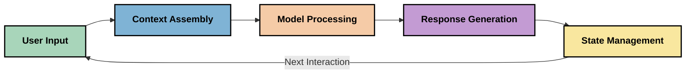
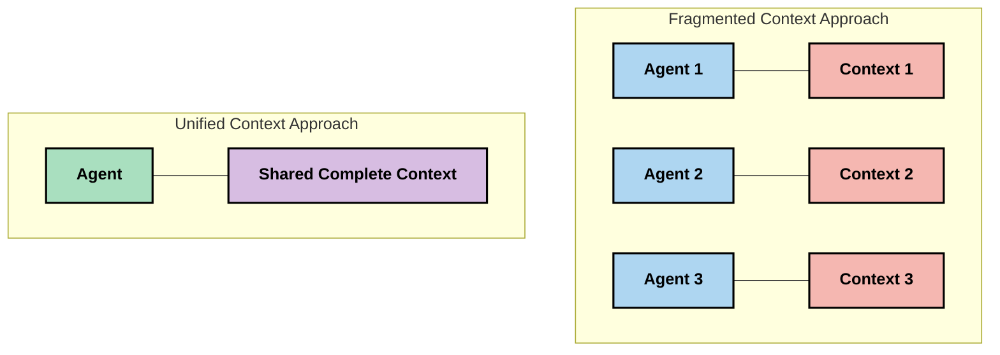
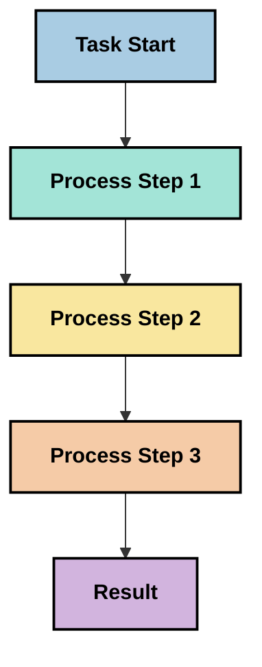
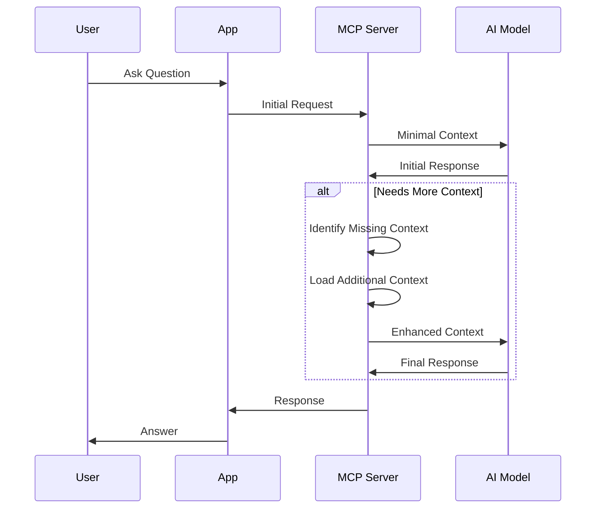
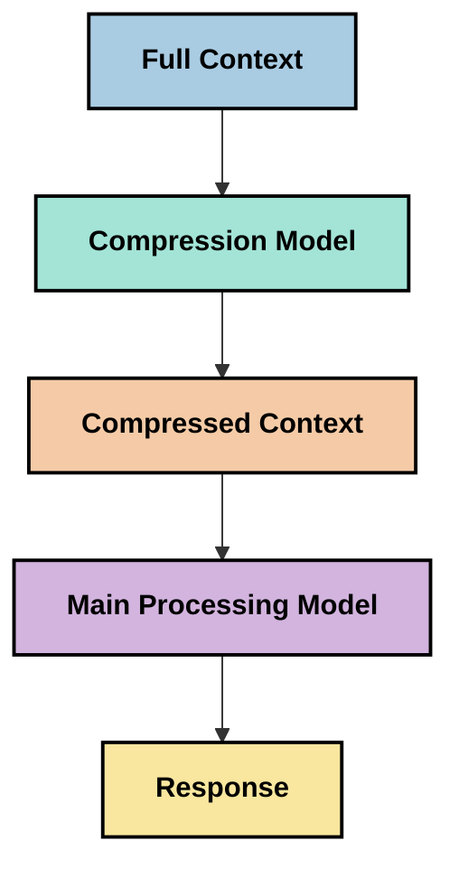

<!--
CO_OP_TRANSLATOR_METADATA:
{
  "original_hash": "fd169ca3071b81b5ee282e194bc823df",
  "translation_date": "2025-09-15T20:03:54+00:00",
  "source_file": "05-AdvancedTopics/mcp-contextengineering/README.md",
  "language_code": "hi"
}
-->
# संदर्भ इंजीनियरिंग: MCP इकोसिस्टम में एक उभरती अवधारणा

## अवलोकन

संदर्भ इंजीनियरिंग AI क्षेत्र में एक उभरती हुई अवधारणा है, जो यह जांचती है कि जानकारी को कैसे संरचित, वितरित और बनाए रखा जाता है, जब क्लाइंट और AI सेवाओं के बीच बातचीत होती है। जैसे-जैसे मॉडल संदर्भ प्रोटोकॉल (MCP) इकोसिस्टम विकसित हो रहा है, संदर्भ को प्रभावी ढंग से प्रबंधित करने की समझ बढ़ती जा रही है। यह मॉड्यूल संदर्भ इंजीनियरिंग की अवधारणा को पेश करता है और MCP कार्यान्वयन में इसके संभावित अनुप्रयोगों की जांच करता है।

## सीखने के उद्देश्य

इस मॉड्यूल के अंत तक, आप:

- संदर्भ इंजीनियरिंग की उभरती अवधारणा और MCP अनुप्रयोगों में इसकी संभावित भूमिका को समझ पाएंगे
- संदर्भ प्रबंधन में प्रमुख चुनौतियों की पहचान कर पाएंगे, जिन्हें MCP प्रोटोकॉल डिज़ाइन संबोधित करता है
- बेहतर संदर्भ प्रबंधन के माध्यम से मॉडल प्रदर्शन सुधारने की तकनीकों का पता लगाएंगे
- संदर्भ प्रभावशीलता को मापने और मूल्यांकन करने के दृष्टिकोणों पर विचार करेंगे
- MCP फ्रेमवर्क के माध्यम से AI अनुभवों को बेहतर बनाने के लिए इन उभरती अवधारणाओं को लागू करेंगे

## संदर्भ इंजीनियरिंग का परिचय

संदर्भ इंजीनियरिंग उपयोगकर्ताओं, अनुप्रयोगों और AI मॉडलों के बीच जानकारी प्रवाह के जानबूझकर डिज़ाइन और प्रबंधन पर केंद्रित एक उभरती हुई अवधारणा है। प्रॉम्प्ट इंजीनियरिंग जैसे स्थापित क्षेत्रों के विपरीत, संदर्भ इंजीनियरिंग अभी भी पेशेवरों द्वारा परिभाषित की जा रही है, क्योंकि वे AI मॉडलों को सही समय पर सही जानकारी प्रदान करने की अनूठी चुनौतियों को हल करने का प्रयास कर रहे हैं।

जैसे-जैसे बड़े भाषा मॉडल (LLMs) विकसित हुए हैं, संदर्भ का महत्व स्पष्ट होता गया है। हम जो संदर्भ प्रदान करते हैं उसकी गुणवत्ता, प्रासंगिकता और संरचना सीधे मॉडल आउटपुट को प्रभावित करती है। संदर्भ इंजीनियरिंग इस संबंध की जांच करती है और प्रभावी संदर्भ प्रबंधन के लिए सिद्धांत विकसित करने का प्रयास करती है।

> "2025 में, उपलब्ध मॉडल अत्यधिक बुद्धिमान हैं। लेकिन सबसे स्मार्ट इंसान भी बिना उस संदर्भ के, जिसे उन्हें काम करने के लिए दिया जा रहा है, प्रभावी ढंग से काम नहीं कर पाएगा... 'संदर्भ इंजीनियरिंग' प्रॉम्प्ट इंजीनियरिंग का अगला स्तर है। यह एक गतिशील प्रणाली में इसे स्वचालित रूप से करने के बारे में है।" — वाल्डेन यान, कॉग्निशन AI

संदर्भ इंजीनियरिंग में निम्नलिखित शामिल हो सकते हैं:

1. **संदर्भ चयन**: यह निर्धारित करना कि किसी दिए गए कार्य के लिए कौन सी जानकारी प्रासंगिक है
2. **संदर्भ संरचना**: जानकारी को इस तरह व्यवस्थित करना कि मॉडल इसे अधिकतम समझ सके
3. **संदर्भ वितरण**: जानकारी को मॉडलों तक कैसे और कब पहुंचाया जाए, इसे अनुकूलित करना
4. **संदर्भ रखरखाव**: समय के साथ संदर्भ की स्थिति और विकास का प्रबंधन करना
5. **संदर्भ मूल्यांकन**: संदर्भ की प्रभावशीलता को मापना और सुधारना

ये फोकस क्षेत्र MCP इकोसिस्टम के लिए विशेष रूप से प्रासंगिक हैं, जो LLMs को संदर्भ प्रदान करने के लिए एक मानकीकृत तरीका प्रदान करता है।

## संदर्भ यात्रा का दृष्टिकोण

संदर्भ इंजीनियरिंग को एक MCP प्रणाली के माध्यम से जानकारी की यात्रा को ट्रेस करके देखा जा सकता है:



### संदर्भ यात्रा के प्रमुख चरण:

1. **उपयोगकर्ता इनपुट**: उपयोगकर्ता से कच्ची जानकारी (पाठ, छवियां, दस्तावेज़)
2. **संदर्भ असेंबली**: उपयोगकर्ता इनपुट को सिस्टम संदर्भ, बातचीत इतिहास और अन्य पुनर्प्राप्त जानकारी के साथ जोड़ना
3. **मॉडल प्रोसेसिंग**: AI मॉडल असेंबल किए गए संदर्भ को प्रोसेस करता है
4. **प्रतिक्रिया निर्माण**: मॉडल प्रदान किए गए संदर्भ के आधार पर आउटपुट उत्पन्न करता है
5. **स्थिति प्रबंधन**: सिस्टम बातचीत के आधार पर अपनी आंतरिक स्थिति को अपडेट करता है

यह दृष्टिकोण AI सिस्टम में संदर्भ की गतिशील प्रकृति को उजागर करता है और यह सवाल उठाता है कि प्रत्येक चरण में जानकारी को सर्वोत्तम तरीके से कैसे प्रबंधित किया जाए।

## संदर्भ इंजीनियरिंग में उभरते सिद्धांत

जैसे-जैसे संदर्भ इंजीनियरिंग का क्षेत्र आकार ले रहा है, कुछ शुरुआती सिद्धांत पेशेवरों से उभर रहे हैं। ये सिद्धांत MCP कार्यान्वयन विकल्पों को सूचित करने में मदद कर सकते हैं:

### सिद्धांत 1: संदर्भ को पूरी तरह साझा करें

संदर्भ को सिस्टम के सभी घटकों के बीच पूरी तरह साझा किया जाना चाहिए, न कि कई एजेंटों या प्रक्रियाओं में खंडित। जब संदर्भ वितरित होता है, तो सिस्टम के एक हिस्से में किए गए निर्णय अन्य हिस्सों में किए गए निर्णयों के साथ टकरा सकते हैं।



MCP अनुप्रयोगों में, इसका मतलब है कि सिस्टम को इस तरह डिज़ाइन करना कि संदर्भ पूरे पाइपलाइन में निर्बाध रूप से प्रवाहित हो, न कि खंडित हो।

### सिद्धांत 2: समझें कि क्रियाएं निहित निर्णय ले जाती हैं

मॉडल द्वारा लिया गया प्रत्येक कार्य संदर्भ की व्याख्या करने के तरीके के बारे में निहित निर्णयों को शामिल करता है। जब कई घटक विभिन्न संदर्भों पर कार्य करते हैं, तो ये निहित निर्णय टकरा सकते हैं, जिससे असंगत परिणाम हो सकते हैं।

इस सिद्धांत का MCP अनुप्रयोगों के लिए महत्वपूर्ण प्रभाव है:
- खंडित संदर्भ के साथ समानांतर निष्पादन के बजाय जटिल कार्यों के रैखिक प्रसंस्करण को प्राथमिकता दें
- सुनिश्चित करें कि सभी निर्णय बिंदुओं को समान संदर्भ जानकारी तक पहुंच प्राप्त हो
- ऐसे सिस्टम डिज़ाइन करें जहां बाद के चरण पहले के निर्णयों के पूर्ण संदर्भ को देख सकें

### सिद्धांत 3: संदर्भ गहराई और विंडो सीमाओं के बीच संतुलन बनाए रखें

जैसे-जैसे बातचीत और प्रक्रियाएं लंबी होती जाती हैं, संदर्भ विंडो अंततः ओवरफ्लो हो जाती हैं। प्रभावी संदर्भ इंजीनियरिंग इस व्यापक संदर्भ और तकनीकी सीमाओं के बीच तनाव को प्रबंधित करने के दृष्टिकोणों की जांच करती है।

जांच किए जा रहे संभावित दृष्टिकोणों में शामिल हैं:
- संदर्भ संपीड़न जो आवश्यक जानकारी को बनाए रखते हुए टोकन उपयोग को कम करता है
- वर्तमान आवश्यकताओं के लिए प्रासंगिकता के आधार पर संदर्भ का प्रगतिशील लोडिंग
- पिछले इंटरैक्शन का सारांश बनाना, जबकि प्रमुख निर्णयों और तथ्यों को संरक्षित करना

## संदर्भ चुनौतियां और MCP प्रोटोकॉल डिज़ाइन

मॉडल संदर्भ प्रोटोकॉल (MCP) को संदर्भ प्रबंधन की अनूठी चुनौतियों की जागरूकता के साथ डिज़ाइन किया गया था। इन चुनौतियों को समझना MCP प्रोटोकॉल डिज़ाइन के प्रमुख पहलुओं को समझाने में मदद करता है:

### चुनौती 1: संदर्भ विंडो सीमाएं
अधिकांश AI मॉडलों में निश्चित संदर्भ विंडो आकार होते हैं, जो एक बार में कितनी जानकारी प्रोसेस कर सकते हैं, इसे सीमित करते हैं।

**MCP डिज़ाइन प्रतिक्रिया:** 
- प्रोटोकॉल संरचित, संसाधन-आधारित संदर्भ का समर्थन करता है जिसे कुशलतापूर्वक संदर्भित किया जा सकता है
- संसाधनों को पृष्ठांकित और प्रगतिशील रूप से लोड किया जा सकता है

### चुनौती 2: प्रासंगिकता निर्धारण
यह निर्धारित करना कि संदर्भ में कौन सी जानकारी शामिल करना सबसे प्रासंगिक है, कठिन है।

**MCP डिज़ाइन प्रतिक्रिया:**
- लचीले उपकरण आवश्यकता के आधार पर जानकारी की गतिशील पुनर्प्राप्ति की अनुमति देते हैं
- संरचित प्रॉम्प्ट्स सुसंगत संदर्भ संगठन को सक्षम करते हैं

### चुनौती 3: संदर्भ स्थायित्व
इंटरैक्शन के दौरान स्थिति का प्रबंधन करना संदर्भ को सावधानीपूर्वक ट्रैक करने की आवश्यकता होती है।

**MCP डिज़ाइन प्रतिक्रिया:**
- मानकीकृत सत्र प्रबंधन
- संदर्भ विकास के लिए स्पष्ट रूप से परिभाषित इंटरैक्शन पैटर्न

### चुनौती 4: मल्टी-मोडल संदर्भ
विभिन्न प्रकार के डेटा (पाठ, छवियां, संरचित डेटा) को अलग-अलग हैंडलिंग की आवश्यकता होती है।

**MCP डिज़ाइन प्रतिक्रिया:**
- प्रोटोकॉल डिज़ाइन विभिन्न सामग्री प्रकारों को समायोजित करता है
- मल्टी-मोडल जानकारी का मानकीकृत प्रतिनिधित्व

### चुनौती 5: सुरक्षा और गोपनीयता
संदर्भ में अक्सर संवेदनशील जानकारी होती है जिसे सुरक्षित रखना आवश्यक है।

**MCP डिज़ाइन प्रतिक्रिया:**
- क्लाइंट और सर्वर जिम्मेदारियों के बीच स्पष्ट सीमाएं
- डेटा एक्सपोज़र को कम करने के लिए स्थानीय प्रोसेसिंग विकल्प

इन चुनौतियों को समझना और MCP उन्हें कैसे संबोधित करता है, उन्नत संदर्भ इंजीनियरिंग तकनीकों का पता लगाने के लिए एक आधार प्रदान करता है।

## उभरते संदर्भ इंजीनियरिंग दृष्टिकोण

जैसे-जैसे संदर्भ इंजीनियरिंग का क्षेत्र विकसित हो रहा है, कई आशाजनक दृष्टिकोण उभर रहे हैं। ये वर्तमान सोच का प्रतिनिधित्व करते हैं, न कि स्थापित सर्वोत्तम प्रथाओं का, और MCP कार्यान्वयन के साथ अधिक अनुभव प्राप्त करने के साथ विकसित होने की संभावना है।

### 1. सिंगल-थ्रेडेड रैखिक प्रसंस्करण

संदर्भ वितरित करने वाले मल्टी-एजेंट आर्किटेक्चर के विपरीत, कुछ पेशेवरों को यह पता चल रहा है कि सिंगल-थ्रेडेड रैखिक प्रसंस्करण अधिक सुसंगत परिणाम उत्पन्न करता है। यह एकीकृत संदर्भ बनाए रखने के सिद्धांत के साथ मेल खाता है।



हालांकि यह दृष्टिकोण समानांतर प्रसंस्करण की तुलना में कम कुशल लग सकता है, यह अक्सर अधिक सुसंगत और विश्वसनीय परिणाम उत्पन्न करता है क्योंकि प्रत्येक चरण पिछले निर्णयों की पूरी समझ पर आधारित होता है।

### 2. संदर्भ चंकिंग और प्राथमिकता निर्धारण

बड़े संदर्भों को प्रबंधनीय टुकड़ों में तोड़ना और सबसे महत्वपूर्ण हिस्सों को प्राथमिकता देना।

```python
# Conceptual Example: Context Chunking and Prioritization
def process_with_chunked_context(documents, query):
    # 1. Break documents into smaller chunks
    chunks = chunk_documents(documents)
    
    # 2. Calculate relevance scores for each chunk
    scored_chunks = [(chunk, calculate_relevance(chunk, query)) for chunk in chunks]
    
    # 3. Sort chunks by relevance score
    sorted_chunks = sorted(scored_chunks, key=lambda x: x[1], reverse=True)
    
    # 4. Use the most relevant chunks as context
    context = create_context_from_chunks([chunk for chunk, score in sorted_chunks[:5]])
    
    # 5. Process with the prioritized context
    return generate_response(context, query)
```

ऊपर की अवधारणा यह दर्शाती है कि हम बड़े दस्तावेज़ों को प्रबंधनीय टुकड़ों में कैसे तोड़ सकते हैं और संदर्भ के लिए केवल सबसे प्रासंगिक हिस्सों का चयन कर सकते हैं। यह दृष्टिकोण संदर्भ विंडो सीमाओं के भीतर काम करने में मदद कर सकता है, जबकि बड़े ज्ञान आधारों का लाभ उठाना जारी रखता है।

### 3. प्रगतिशील संदर्भ लोडिंग

संदर्भ को एक बार में नहीं, बल्कि आवश्यकता के अनुसार प्रगतिशील रूप से लोड करना।



प्रगतिशील संदर्भ लोडिंग न्यूनतम संदर्भ के साथ शुरू होती है और केवल तभी विस्तार करती है जब आवश्यक हो। यह सरल प्रश्नों के लिए टोकन उपयोग को काफी हद तक कम कर सकता है, जबकि जटिल प्रश्नों को संभालने की क्षमता बनाए रखता है।

### 4. संदर्भ संपीड़न और सारांश

संदर्भ आकार को कम करना, जबकि आवश्यक जानकारी को संरक्षित करना।



संदर्भ संपी
- [मॉडल कॉन्टेक्स्ट प्रोटोकॉल वेबसाइट](https://modelcontextprotocol.io/)
- [मॉडल कॉन्टेक्स्ट प्रोटोकॉल स्पेसिफिकेशन](https://github.com/modelcontextprotocol/modelcontextprotocol)
- [MCP दस्तावेज़ीकरण](https://modelcontextprotocol.io/docs)
- [MCP C# SDK](https://github.com/modelcontextprotocol/csharp-sdk)
- [MCP Python SDK](https://github.com/modelcontextprotocol/python-sdk)
- [MCP TypeScript SDK](https://github.com/modelcontextprotocol/typescript-sdk)
- [MCP इंस्पेक्टर](https://github.com/modelcontextprotocol/inspector) - MCP सर्वरों के लिए विज़ुअल परीक्षण उपकरण

### कॉन्टेक्स्ट इंजीनियरिंग लेख
- [मल्टी-एजेंट्स मत बनाएं: कॉन्टेक्स्ट इंजीनियरिंग के सिद्धांत](https://cognition.ai/blog/dont-build-multi-agents) - वाल्डन यान के कॉन्टेक्स्ट इंजीनियरिंग सिद्धांतों पर विचार
- [एजेंट्स बनाने के लिए व्यावहारिक मार्गदर्शिका](https://cdn.openai.com/business-guides-and-resources/a-practical-guide-to-building-agents.pdf) - प्रभावी एजेंट डिज़ाइन पर OpenAI की मार्गदर्शिका
- [प्रभावी एजेंट्स बनाना](https://www.anthropic.com/engineering/building-effective-agents) - एजेंट विकास पर Anthropic का दृष्टिकोण

### संबंधित शोध
- [बड़े भाषा मॉडलों के लिए डायनामिक रिट्रीवल ऑग्मेंटेशन](https://arxiv.org/abs/2310.01487) - डायनामिक रिट्रीवल दृष्टिकोणों पर शोध
- [मध्य में खो जाना: कैसे भाषा मॉडल लंबे कॉन्टेक्स्ट का उपयोग करते हैं](https://arxiv.org/abs/2307.03172) - कॉन्टेक्स्ट प्रोसेसिंग पैटर्न पर महत्वपूर्ण शोध
- [CLIP लैटेंट्स के साथ हायरार्किकल टेक्स्ट-कंडीशन्ड इमेज जनरेशन](https://arxiv.org/abs/2204.06125) - DALL-E 2 पेपर जिसमें कॉन्टेक्स्ट संरचना पर अंतर्दृष्टि है
- [बड़े भाषा मॉडल आर्किटेक्चर में कॉन्टेक्स्ट की भूमिका का अन्वेषण](https://aclanthology.org/2023.findings-emnlp.124/) - हालिया शोध कॉन्टेक्स्ट हैंडलिंग पर
- [मल्टी-एजेंट सहयोग: एक सर्वेक्षण](https://arxiv.org/abs/2304.03442) - मल्टी-एजेंट सिस्टम और उनकी चुनौतियों पर शोध

### अतिरिक्त संसाधन
- [कॉन्टेक्स्ट विंडो ऑप्टिमाइज़ेशन तकनीकें](https://learn.microsoft.com/en-us/azure/ai-services/openai/concepts/context-window)
- [उन्नत RAG तकनीकें](https://www.microsoft.com/en-us/research/blog/retrieval-augmented-generation-rag-and-frontier-models/)
- [सेमांटिक कर्नल दस्तावेज़ीकरण](https://github.com/microsoft/semantic-kernel)
- [कॉन्टेक्स्ट प्रबंधन के लिए AI टूलकिट](https://github.com/microsoft/aitoolkit)

## आगे क्या 

- [5.15 MCP कस्टम ट्रांसपोर्ट](../mcp-transport/README.md)

---

**अस्वीकरण**:  
यह दस्तावेज़ AI अनुवाद सेवा [Co-op Translator](https://github.com/Azure/co-op-translator) का उपयोग करके अनुवादित किया गया है। जबकि हम सटीकता सुनिश्चित करने का प्रयास करते हैं, कृपया ध्यान दें कि स्वचालित अनुवाद में त्रुटियां या अशुद्धियां हो सकती हैं। मूल भाषा में उपलब्ध मूल दस्तावेज़ को प्रामाणिक स्रोत माना जाना चाहिए। महत्वपूर्ण जानकारी के लिए, पेशेवर मानव अनुवाद की सिफारिश की जाती है। इस अनुवाद के उपयोग से उत्पन्न किसी भी गलतफहमी या गलत व्याख्या के लिए हम उत्तरदायी नहीं हैं।