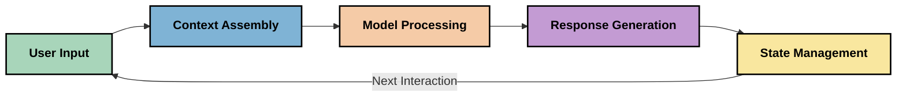
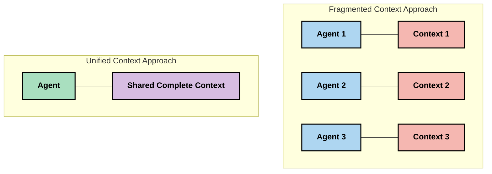
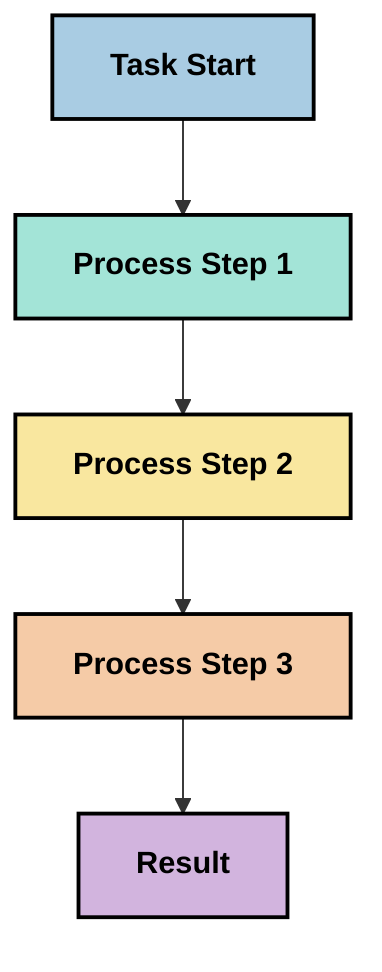
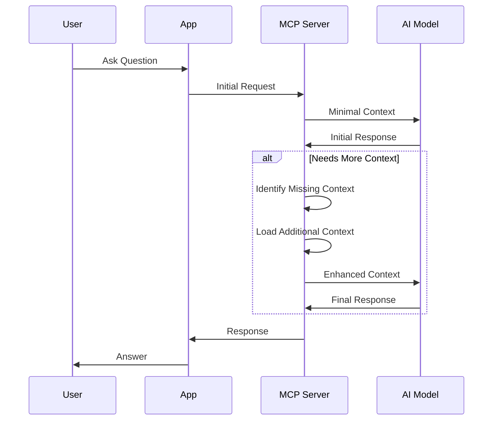
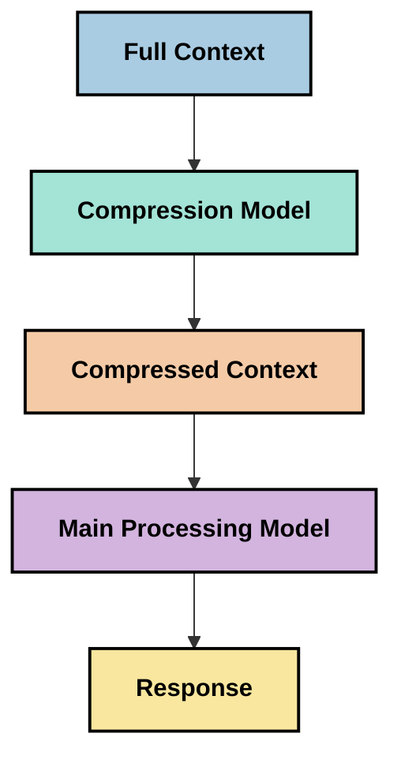

<!--
CO_OP_TRANSLATOR_METADATA:
{
  "original_hash": "5762e8e74dd99d8b7dbb31e69a82561e",
  "translation_date": "2025-07-16T23:04:31+00:00",
  "source_file": "05-AdvancedTopics/mcp-contextengineering/README.md",
  "language_code": "hi"
}
-->
# Context Engineering: MCP इकोसिस्टम में एक उभरता हुआ विचार

## अवलोकन

Context engineering AI क्षेत्र में एक उभरता हुआ विचार है जो यह समझने की कोशिश करता है कि जानकारी कैसे संरचित, प्रदान और बनाए रखी जाती है जब क्लाइंट और AI सेवाओं के बीच बातचीत होती है। जैसे-जैसे Model Context Protocol (MCP) इकोसिस्टम विकसित हो रहा है, प्रभावी रूप से context प्रबंधन करना और भी महत्वपूर्ण होता जा रहा है। यह मॉड्यूल context engineering की अवधारणा से परिचित कराता है और MCP कार्यान्वयन में इसके संभावित उपयोगों का अन्वेषण करता है।

## सीखने के उद्देश्य

इस मॉड्यूल के अंत तक, आप सक्षम होंगे:

- context engineering के उभरते हुए विचार और MCP अनुप्रयोगों में इसकी संभावित भूमिका को समझना
- context प्रबंधन में प्रमुख चुनौतियों की पहचान करना जिन्हें MCP प्रोटोकॉल डिज़ाइन संबोधित करता है
- बेहतर context प्रबंधन के माध्यम से मॉडल प्रदर्शन सुधारने की तकनीकों का अन्वेषण करना
- context की प्रभावशीलता को मापने और मूल्यांकन करने के तरीकों पर विचार करना
- MCP फ्रेमवर्क के माध्यम से AI अनुभवों को बेहतर बनाने के लिए इन उभरते विचारों को लागू करना

## Context Engineering का परिचय

Context engineering एक उभरता हुआ क्षेत्र है जो उपयोगकर्ताओं, अनुप्रयोगों और AI मॉडलों के बीच जानकारी के प्रवाह के जानबूझकर डिज़ाइन और प्रबंधन पर केंद्रित है। prompt engineering जैसे स्थापित क्षेत्रों के विपरीत, context engineering अभी भी प्रैक्टिशनर्स द्वारा परिभाषित किया जा रहा है क्योंकि वे AI मॉडलों को सही समय पर सही जानकारी प्रदान करने की अनूठी चुनौतियों को हल करने का प्रयास कर रहे हैं।

जैसे-जैसे बड़े भाषा मॉडल (LLMs) विकसित हुए हैं, context का महत्व और भी स्पष्ट हो गया है। हम जो context प्रदान करते हैं उसकी गुणवत्ता, प्रासंगिकता और संरचना सीधे मॉडल के आउटपुट को प्रभावित करती है। context engineering इस संबंध की खोज करता है और प्रभावी context प्रबंधन के लिए सिद्धांत विकसित करने का प्रयास करता है।

> "2025 में, मॉडल अत्यंत बुद्धिमान होंगे। लेकिन सबसे होशियार इंसान भी उस संदर्भ के बिना अपना काम प्रभावी ढंग से नहीं कर पाएगा जो उनसे किया जा रहा है... 'Context engineering' prompt engineering का अगला स्तर है। यह एक गतिशील प्रणाली में इसे स्वचालित रूप से करने के बारे में है।" — Walden Yan, Cognition AI

Context engineering में शामिल हो सकता है:

1. **Context चयन**: यह निर्धारित करना कि किसी कार्य के लिए कौन सी जानकारी प्रासंगिक है
2. **Context संरचना**: जानकारी को इस तरह व्यवस्थित करना कि मॉडल की समझ अधिकतम हो
3. **Context वितरण**: यह अनुकूलित करना कि जानकारी मॉडल को कब और कैसे भेजी जाए
4. **Context रखरखाव**: समय के साथ context की स्थिति और विकास का प्रबंधन
5. **Context मूल्यांकन**: context की प्रभावशीलता को मापना और सुधारना

ये फोकस क्षेत्र विशेष रूप से MCP इकोसिस्टम के लिए प्रासंगिक हैं, जो LLMs को context प्रदान करने के लिए एक मानकीकृत तरीका प्रदान करता है।

## Context यात्रा का दृष्टिकोण

context engineering को समझने का एक तरीका यह है कि हम MCP सिस्टम में जानकारी की यात्रा को ट्रेस करें:



### Context यात्रा के प्रमुख चरण:

1. **उपयोगकर्ता इनपुट**: उपयोगकर्ता से कच्ची जानकारी (टेक्स्ट, छवियां, दस्तावेज़)
2. **Context असेंबली**: उपयोगकर्ता इनपुट को सिस्टम context, बातचीत के इतिहास और अन्य प्राप्त जानकारी के साथ संयोजित करना
3. **मॉडल प्रोसेसिंग**: AI मॉडल असेंबल किए गए context को संसाधित करता है
4. **प्रतिक्रिया निर्माण**: मॉडल प्रदान किए गए context के आधार पर आउटपुट उत्पन्न करता है
5. **स्थिति प्रबंधन**: सिस्टम बातचीत के आधार पर अपनी आंतरिक स्थिति अपडेट करता है

यह दृष्टिकोण AI सिस्टम में context की गतिशील प्रकृति को उजागर करता है और प्रत्येक चरण में जानकारी के सर्वोत्तम प्रबंधन के बारे में महत्वपूर्ण प्रश्न उठाता है।

## Context Engineering में उभरते सिद्धांत

जैसे-जैसे context engineering क्षेत्र आकार ले रहा है, कुछ प्रारंभिक सिद्धांत प्रैक्टिशनर्स से उभरने लगे हैं। ये सिद्धांत MCP कार्यान्वयन विकल्पों को सूचित करने में मदद कर सकते हैं:

### सिद्धांत 1: Context को पूरी तरह साझा करें

context को सिस्टम के सभी घटकों के बीच पूरी तरह साझा किया जाना चाहिए, न कि कई एजेंट्स या प्रक्रियाओं में बिखरा हुआ। जब context वितरित होता है, तो सिस्टम के एक हिस्से में लिए गए निर्णय दूसरे हिस्से के निर्णयों से टकरा सकते हैं।



MCP अनुप्रयोगों में, इसका मतलब है कि ऐसे सिस्टम डिज़ाइन करें जहाँ context पूरी पाइपलाइन में निर्बाध रूप से प्रवाहित हो, न कि अलग-अलग हिस्सों में।

### सिद्धांत 2: समझें कि क्रियाएं निहित निर्णय लेती हैं

मॉडल द्वारा की गई प्रत्येक क्रिया context की व्याख्या के बारे में निहित निर्णयों को दर्शाती है। जब कई घटक अलग-अलग context पर कार्य करते हैं, तो ये निहित निर्णय टकरा सकते हैं, जिससे असंगत परिणाम हो सकते हैं।

इस सिद्धांत के MCP अनुप्रयोगों पर महत्वपूर्ण प्रभाव हैं:
- जटिल कार्यों के लिए समानांतर निष्पादन के बजाय रैखिक प्रसंस्करण को प्राथमिकता दें
- सुनिश्चित करें कि सभी निर्णय बिंदुओं को समान context जानकारी उपलब्ध हो
- ऐसे सिस्टम डिज़ाइन करें जहाँ बाद के चरण पहले के निर्णयों का पूरा context देख सकें

### सिद्धांत 3: Context की गहराई और विंडो सीमाओं के बीच संतुलन बनाएं

जैसे-जैसे बातचीत और प्रक्रियाएं लंबी होती हैं, context विंडो भर जाती है। प्रभावी context engineering इस संतुलन को प्रबंधित करने के तरीके खोजती है कि व्यापक context और तकनीकी सीमाओं के बीच कैसे सामंजस्य बैठाया जाए।

संभावित दृष्टिकोणों में शामिल हैं:
- context संपीड़न जो आवश्यक जानकारी बनाए रखते हुए टोकन उपयोग को कम करता है
- वर्तमान आवश्यकताओं के अनुसार context का प्रगतिशील लोडिंग
- पिछले इंटरैक्शन का सारांश बनाना जबकि मुख्य निर्णय और तथ्य संरक्षित रहते हैं

## Context चुनौतियां और MCP प्रोटोकॉल डिज़ाइन

Model Context Protocol (MCP) को context प्रबंधन की अनूठी चुनौतियों को ध्यान में रखकर डिज़ाइन किया गया था। इन चुनौतियों को समझना MCP प्रोटोकॉल डिज़ाइन के प्रमुख पहलुओं को स्पष्ट करता है:

### चुनौती 1: Context विंडो सीमाएं
अधिकांश AI मॉडल की context विंडो आकार सीमित होती है, जिससे वे एक बार में कितनी जानकारी संसाधित कर सकते हैं, इसकी सीमा होती है।

**MCP डिज़ाइन प्रतिक्रिया:**  
- प्रोटोकॉल संरचित, संसाधन-आधारित context का समर्थन करता है जिसे कुशलतापूर्वक संदर्भित किया जा सकता है  
- संसाधनों को पृष्ठीकृत किया जा सकता है और प्रगतिशील रूप से लोड किया जा सकता है

### चुनौती 2: प्रासंगिकता निर्धारण
यह निर्धारित करना कठिन होता है कि context में कौन सी जानकारी सबसे अधिक प्रासंगिक है।

**MCP डिज़ाइन प्रतिक्रिया:**  
- लचीले टूलिंग से आवश्यकता के अनुसार जानकारी की गतिशील पुनःप्राप्ति संभव होती है  
- संरचित प्रॉम्प्ट्स से context का सुसंगत संगठन सुनिश्चित होता है

### चुनौती 3: Context स्थिरता
इंटरैक्शन के दौरान स्थिति का प्रबंधन सावधानीपूर्वक context ट्रैकिंग की मांग करता है।

**MCP डिज़ाइन प्रतिक्रिया:**  
- मानकीकृत सत्र प्रबंधन  
- context विकास के लिए स्पष्ट रूप से परिभाषित इंटरैक्शन पैटर्न

### चुनौती 4: बहु-मोडल Context
विभिन्न प्रकार के डेटा (टेक्स्ट, छवियां, संरचित डेटा) के लिए अलग-अलग हैंडलिंग आवश्यक होती है।

**MCP डिज़ाइन प्रतिक्रिया:**  
- प्रोटोकॉल डिज़ाइन विभिन्न सामग्री प्रकारों को समायोजित करता है  
- बहु-मोडल जानकारी का मानकीकृत प्रतिनिधित्व

### चुनौती 5: सुरक्षा और गोपनीयता
context में अक्सर संवेदनशील जानकारी होती है जिसे सुरक्षित रखना आवश्यक है।

**MCP डिज़ाइन प्रतिक्रिया:**  
- क्लाइंट और सर्वर जिम्मेदारियों के बीच स्पष्ट सीमाएं  
- डेटा एक्सपोज़र को कम करने के लिए स्थानीय प्रसंस्करण विकल्प

इन चुनौतियों को समझना और MCP द्वारा उनके समाधान को जानना अधिक उन्नत context engineering तकनीकों के अन्वेषण के लिए आधार प्रदान करता है।

## उभरते हुए Context Engineering दृष्टिकोण

जैसे-जैसे context engineering विकसित हो रहा है, कई आशाजनक दृष्टिकोण उभर रहे हैं। ये वर्तमान सोच का प्रतिनिधित्व करते हैं, न कि स्थापित सर्वोत्तम प्रथाओं का, और MCP कार्यान्वयन के अनुभव के साथ विकसित होंगे।

### 1. सिंगल-थ्रेडेड रैखिक प्रसंस्करण

context वितरित करने वाले मल्टी-एजेंट आर्किटेक्चर के विपरीत, कुछ प्रैक्टिशनर्स पाते हैं कि सिंगल-थ्रेडेड रैखिक प्रसंस्करण अधिक सुसंगत परिणाम देता है। यह एकीकृत context बनाए रखने के सिद्धांत के अनुरूप है।



यह दृष्टिकोण समानांतर प्रसंस्करण की तुलना में कम कुशल लग सकता है, लेकिन अक्सर अधिक संगठित और विश्वसनीय परिणाम देता है क्योंकि प्रत्येक चरण पिछले निर्णयों की पूरी समझ पर आधारित होता है।

### 2. Context को टुकड़ों में बांटना और प्राथमिकता देना

बड़े context को प्रबंधनीय हिस्सों में तोड़ना और सबसे महत्वपूर्ण हिस्सों को प्राथमिकता देना।

```python
# Conceptual Example: Context Chunking and Prioritization
def process_with_chunked_context(documents, query):
    # 1. Break documents into smaller chunks
    chunks = chunk_documents(documents)
    
    # 2. Calculate relevance scores for each chunk
    scored_chunks = [(chunk, calculate_relevance(chunk, query)) for chunk in chunks]
    
    # 3. Sort chunks by relevance score
    sorted_chunks = sorted(scored_chunks, key=lambda x: x[1], reverse=True)
    
    # 4. Use the most relevant chunks as context
    context = create_context_from_chunks([chunk for chunk, score in sorted_chunks[:5]])
    
    # 5. Process with the prioritized context
    return generate_response(context, query)
```

ऊपर दिया गया उदाहरण दिखाता है कि कैसे हम बड़े दस्तावेज़ों को छोटे टुकड़ों में तोड़ सकते हैं और केवल सबसे प्रासंगिक भागों को context के लिए चुन सकते हैं। यह दृष्टिकोण context विंडो सीमाओं के भीतर काम करने में मदद करता है जबकि बड़े ज्ञान आधार का लाभ उठाता है।

### 3. प्रगतिशील Context लोडिंग

सभी context को एक साथ लोड करने के बजाय आवश्यकतानुसार धीरे-धीरे लोड करना।



प्रगतिशील context लोडिंग न्यूनतम context से शुरू होती है और केवल आवश्यक होने पर विस्तार करती है। यह सरल प्रश्नों के लिए टोकन उपयोग को काफी कम कर सकता है जबकि जटिल प्रश्नों को संभालने की क्षमता बनाए रखता है।

### 4. Context संपीड़न और सारांशण

आवश्यक जानकारी को बनाए रखते हुए context का आकार कम करना।



context संपीड़न पर ध्यान केंद्रित करता है:  
- अनावश्यक जानकारी हटाना  
- लंबी सामग्री का सारांश बनाना  
- मुख्य तथ्य और विवरण निकालना  
- महत्वपूर्ण context तत्वों को संरक्षित रखना  
- टोकन दक्षता के लिए अनुकूलित करना

यह दृष्टिकोण लंबे संवादों को context विंडो में बनाए रखने या बड़े दस्तावेज़ों को कुशलतापूर्वक संसाधित करने के लिए विशेष रूप से उपयोगी हो सकता है। कुछ प्रैक्टिशनर्स context संपीड़न और बातचीत के इतिहास के सारांशण के लिए विशेष मॉडल का उपयोग कर रहे हैं।

## अन्वेषणात्मक Context Engineering विचार

जैसे-जैसे हम context engineering के उभरते क्षेत्र का अन्वेषण करते हैं, MCP कार्यान्वयन के साथ काम करते समय कुछ विचार ध्यान में रखने योग्य हैं। ये अनिवार्य सर्वोत्तम प्रथाएं नहीं हैं, बल्कि ऐसे क्षेत्र हैं जो आपके विशिष्ट उपयोग मामले में सुधार ला सकते हैं।

### अपने Context लक्ष्यों पर विचार करें

जटिल context प्रबंधन समाधान लागू करने से पहले स्पष्ट करें कि आप क्या हासिल करना चाहते हैं:  
- मॉडल को सफल होने के लिए कौन सी विशिष्ट जानकारी चाहिए?  
- कौन सी जानकारी आवश्यक है और कौन सी पूरक?  
- आपकी प्रदर्शन सीमाएं क्या हैं (लेटेंसी, टोकन सीमाएं, लागत)?

### परतदार Context दृष्टिकोणों का अन्वेषण करें

कुछ प्रैक्टिशनर्स को परतों में व्यवस्थित context से सफलता मिल रही है:  
- **कोर लेयर**: आवश्यक जानकारी जो मॉडल को हमेशा चाहिए  
- **परिस्थितिजन्य लेयर**: वर्तमान इंटरैक्शन से संबंधित context  
- **सहायक लेयर**: अतिरिक्त जानकारी जो सहायक हो सकती है  
- **फॉलबैक लेयर**: केवल आवश्यक होने पर पहुंची जाने वाली जानकारी

### पुनःप्राप्ति रणनीतियों की जांच करें

आपके context की प्रभावशीलता इस बात पर निर्भर करती है कि आप जानकारी कैसे पुनःप्राप्त करते हैं:  
- अवधारणात्मक रूप से प्रासंगिक जानकारी खोजने के लिए सेमांटिक सर्च और एम्बेडिंग्स  
- विशिष्ट तथ्यात्मक विवरणों के लिए कीवर्ड-आधारित खोज  
- कई पुनःप्राप्ति विधियों को संयोजित करने वाले हाइब्रिड दृष्टिकोण  
- श्रेणियों, तिथियों या स्रोतों के आधार पर दायरे को सीमित करने के लिए मेटाडेटा फ़िल्टरिंग

### Context संगति के साथ प्रयोग करें

आपके context की संरचना और प्रवाह मॉडल की समझ को प्रभावित कर सकते हैं:  
- संबंधित जानकारी को एक साथ समूहित करना  
- सुसंगत स्वरूपण और संगठन का उपयोग करना  
- जहां उपयुक्त हो, तार्किक या कालानुक्रमिक क्रम बनाए रखना  
- विरोधाभासी जानकारी से बचना

### मल्टी-एजेंट आर्किटेक्चर के ट्रेडऑफ पर विचार करें

हालांकि मल्टी-एजेंट आर्किटेक्चर कई AI फ्रेमवर्क में लोकप्रिय हैं, context प्रबंधन के लिए ये कई चुनौतियां लाते हैं:  
- context विखंडन से एजेंट्स के बीच असंगत निर्णय हो सकते हैं  
- समानांतर प्रसंस्करण से टकराव हो सकते हैं जिन्हें सुलझाना मुश्किल होता है  
- एजेंट्स के बीच संचार ओवरहेड प्रदर्शन लाभ को कम कर सकता है  
- संगति बनाए रखने के लिए जटिल स्थिति प्रबंधन आवश्यक है

कई मामलों में, व्यापक context प्रबंधन के साथ एकल-एजेंट दृष्टिकोण कई विशेषज्ञ एजेंट्स की तुलना में अधिक विश्वसनीय परिणाम दे सकता है।

### मूल्यांकन विधियां विकसित करें

समय के साथ context engineering में सुधार के लिए, यह सोचें कि आप सफलता को कैसे मापेंगे:  
- विभिन्न context संरचनाओं का A/B परीक्षण  
- टोकन उपयोग और प्रतिक्रिया समय की निगरानी  
- उपयोगकर्ता संतुष्टि और कार्य पूर्णता दरों का ट्रैकिंग  
- जब और क्यों context रणनीतियां विफल होती हैं, उसका विश्लेषण

ये विचार context engineering क्षेत्र में सक्रिय अन्वेषण के क्षेत्र हैं। जैसे-जैसे यह क्षेत्र परिपक्व होगा, अधिक निश्चित पैटर्न और प्रथाएं उभरेंगी।

## Context प्रभावशीलता मापन: एक विकसित होता ढांचा

जैसे-जैसे context engineering एक अवधारणा के रूप में उभर रहा है, प्रैक्टिशनर्स इसकी प्रभावशीलता को मापने के तरीकों का अन्वेषण कर रहे हैं। अभी तक कोई स्थापित ढांचा नहीं है, लेकिन विभिन्न मेट्रिक्स पर विचार किया जा रहा है जो भविष्य के कार्य को मार्गदर्शित कर सकते हैं।

### संभावित मापन आयाम

#### 1. इनपुट दक्षता विचार

- **Context-से-प्रतिक्रिया अनुपात**: प्रतिक्रिया के आकार के सापेक्ष कितना context चाहिए?  
- **टोकन उपयोग**: प्रदान किए गए context टोकन में से कितने प्रतिक्रिया को प्रभावित करते हैं?  
- **Context कमी**: हम कच्ची जानकारी को कितनी प्रभावी ढंग से संपीड़ित कर सकते हैं?

#### 2. प्रदर्शन विचार

- **लेटेंसी प्रभाव**: context प्रबंधन प्रतिक्रिया समय को कैसे प्रभावित करता है?  
- **टोकन अर्थव्यवस्था**: क्या हम टोकन उपयोग को प्रभावी ढंग से अनुकूलित कर रहे हैं?  
- **पुनःप्राप्ति सटीकता**: प्राप्त जानकारी कितनी प्रासंगिक है?  
- **संसाधन उपयोग**: आवश्यक कंप्यूटेशनल संसाधन क्या हैं?

#### 3. गुणवत्ता विचार

- **प्रतिक्रिया प्रासंगिकता**: प्रतिक्रिया प्रश्न को कितनी अच्छी तरह संबोधित करती है?  
- **तथ्यात्मक सटीकता**: क्या context प्रबंधन तथ्यात्मक शुद्धता में सुधार करता है?  
- **संगति**: समान प्रश्नों पर प्रतिक्रियाएं कितनी सुसंगत हैं?  
- **हैलुसिनेशन दर**: क्या बेहतर context मॉडल की गलतफहमी को कम करता है?

#### 4. उपयोगकर्ता अनुभव विचार

- **फॉलो-अप दर**: उपयोगकर्ताओं को कितनी बार स्पष्टीकरण की आवश्यकता होती है?  
- **कार्य पूर्णता**: क्या उपयोगकर्ता अपने लक्ष्य सफलतापूर्वक पूरा करते हैं?  
- **संतुष्टि संकेतक**: उपयोगकर्ता अपने अनुभव को कैसे रेट करते हैं?

### मापन के अन्वेषणात्मक दृष्टिकोण

MCP कार्यान्वयन में context engineering के साथ प्रयोग करते समय इन अन्वेषणात्मक दृष्टिकोणों पर विचार करें:

1. **बेसलाइन तुलना**: अधिक जटिल तरीकों का परीक्षण करने से पहले सरल context दृष्टिकोणों के साथ बेसलाइन स्थापित करें  
2. **क्रमिक परिवर्तन**: context प्रबंधन के एक पहलू को एक बार में बदलें ताकि उसके प्रभाव अलग से समझे जा सकें  
3. **उपयोगकर्ता-केंद्रित मूल्यांकन**: मात्रात्मक मेट्रिक्स के साथ गुणात्मक उपयोगकर्ता प्रतिक्रिया को संयोजित करें  
4. **विफलता विश्लेषण**: उन मामलों की जांच करें जहाँ context रणनीतियां विफल होती हैं ताकि सुधार के अवसर समझे जा सकें  
5. **बहुआयामी आकलन**: दक्षता, गुणवत्ता और उपयोगकर्ता अनुभव के बीच संतुलन पर विचार करें

यह प्रयोगात्मक, बहुआय
- [Model Context Protocol Website](https://modelcontextprotocol.io/)
- [Model Context Protocol Specification](https://github.com/modelcontextprotocol/modelcontextprotocol)
- [MCP Documentation](https://modelcontextprotocol.io/docs)
- [MCP C# SDK](https://github.com/modelcontextprotocol/csharp-sdk)
- [MCP Python SDK](https://github.com/modelcontextprotocol/python-sdk)
- [MCP TypeScript SDK](https://github.com/modelcontextprotocol/typescript-sdk)
- [MCP Inspector](https://github.com/modelcontextprotocol/inspector) - MCP सर्वरों के लिए विज़ुअल परीक्षण उपकरण

### Context Engineering Articles
- [Don't Build Multi-Agents: Principles of Context Engineering](https://cognition.ai/blog/dont-build-multi-agents) - Walden Yan के संदर्भ इंजीनियरिंग सिद्धांतों पर विचार
- [A Practical Guide to Building Agents](https://cdn.openai.com/business-guides-and-resources/a-practical-guide-to-building-agents.pdf) - प्रभावी एजेंट डिजाइन पर OpenAI की मार्गदर्शिका
- [Building Effective Agents](https://www.anthropic.com/engineering/building-effective-agents) - Anthropic का एजेंट विकास दृष्टिकोण

### Related Research
- [Dynamic Retrieval Augmentation for Large Language Models](https://arxiv.org/abs/2310.01487) - डायनामिक रिट्रीवल विधियों पर शोध
- [Lost in the Middle: How Language Models Use Long Contexts](https://arxiv.org/abs/2307.03172) - संदर्भ प्रसंस्करण पैटर्न पर महत्वपूर्ण शोध
- [Hierarchical Text-Conditioned Image Generation with CLIP Latents](https://arxiv.org/abs/2204.06125) - DALL-E 2 पेपर जिसमें संदर्भ संरचना पर जानकारी है
- [Exploring the Role of Context in Large Language Model Architectures](https://aclanthology.org/2023.findings-emnlp.124/) - संदर्भ प्रबंधन पर हालिया शोध
- [Multi-Agent Collaboration: A Survey](https://arxiv.org/abs/2304.03442) - मल्टी-एजेंट सिस्टम और उनकी चुनौतियों पर शोध

### Additional Resources
- [Context Window Optimization Techniques](https://learn.microsoft.com/en-us/azure/ai-services/openai/concepts/context-window)
- [Advanced RAG Techniques](https://www.microsoft.com/en-us/research/blog/retrieval-augmented-generation-rag-and-frontier-models/)
- [Semantic Kernel Documentation](https://github.com/microsoft/semantic-kernel)
- [AI Toolkit for Context Management](https://github.com/microsoft/aitoolkit)

## आगे क्या है
- [6. Community Contributions](../../06-CommunityContributions/README.md)

**अस्वीकरण**:  
यह दस्तावेज़ AI अनुवाद सेवा [Co-op Translator](https://github.com/Azure/co-op-translator) का उपयोग करके अनुवादित किया गया है। जबकि हम सटीकता के लिए प्रयासरत हैं, कृपया ध्यान दें कि स्वचालित अनुवादों में त्रुटियाँ या अशुद्धियाँ हो सकती हैं। मूल दस्तावेज़ अपनी मूल भाषा में ही अधिकारिक स्रोत माना जाना चाहिए। महत्वपूर्ण जानकारी के लिए, पेशेवर मानव अनुवाद की सलाह दी जाती है। इस अनुवाद के उपयोग से उत्पन्न किसी भी गलतफहमी या गलत व्याख्या के लिए हम जिम्मेदार नहीं हैं।