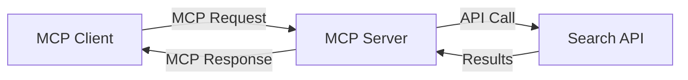
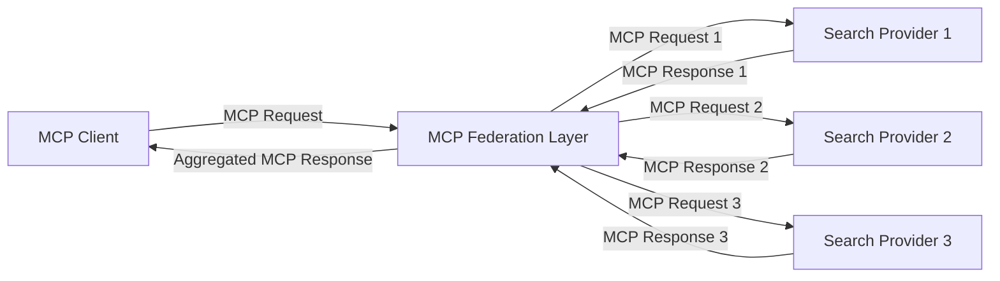
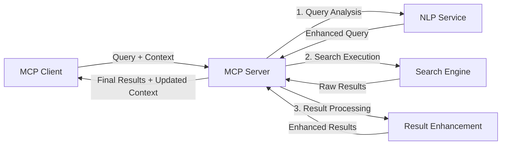

<!--
CO_OP_TRANSLATOR_METADATA:
{
  "original_hash": "16bef2c93c6a86d4ca6a8ce9e120e384",
  "translation_date": "2025-06-12T22:41:50+00:00",
  "source_file": "05-AdvancedTopics/mcp-realtimesearch/README.md",
  "language_code": "hi"
}
-->
## कोड उदाहरण अस्वीकरण

> **महत्वपूर्ण नोट**: नीचे दिए गए कोड उदाहरण Model Context Protocol (MCP) को वेब सर्च कार्यक्षमता के साथ एकीकृत करने का प्रदर्शन करते हैं। ये उदाहरण आधिकारिक MCP SDK के पैटर्न और संरचनाओं का पालन करते हैं, लेकिन शैक्षिक उद्देश्यों के लिए इन्हें सरल बनाया गया है।
> 
> ये उदाहरण दिखाते हैं:
> 
> 1. **पायथन इम्प्लीमेंटेशन**: एक FastMCP सर्वर इम्प्लीमेंटेशन जो वेब सर्च टूल प्रदान करता है और एक बाहरी सर्च API से जुड़ता है। यह उदाहरण उचित लाइफस्पैन प्रबंधन, संदर्भ प्रबंधन, और टूल इम्प्लीमेंटेशन को दर्शाता है, जो [आधिकारिक MCP पायथन SDK](https://github.com/modelcontextprotocol/python-sdk) के पैटर्न के अनुसार है। सर्वर में Streamable HTTP ट्रांसपोर्ट का उपयोग किया गया है, जो प्रोडक्शन डिप्लॉयमेंट के लिए पुराने SSE ट्रांसपोर्ट की जगह ले चुका है।
> 
> 2. **जावास्क्रिप्ट इम्प्लीमेंटेशन**: एक TypeScript/JavaScript इम्प्लीमेंटेशन जो [आधिकारिक MCP TypeScript SDK](https://github.com/modelcontextprotocol/typescript-sdk) के FastMCP पैटर्न का उपयोग करता है, एक सर्च सर्वर बनाने के लिए जिसमें उचित टूल परिभाषाएं और क्लाइंट कनेक्शन होते हैं। यह नवीनतम सत्र प्रबंधन और संदर्भ संरक्षण के लिए अनुशंसित पैटर्न का पालन करता है।
> 
> ये उदाहरण प्रोडक्शन उपयोग के लिए अतिरिक्त त्रुटि हैंडलिंग, प्रमाणीकरण, और विशिष्ट API इंटीग्रेशन कोड की आवश्यकता होगी। दिखाए गए सर्च API एंडपॉइंट (`https://api.search-service.example/search`) प्लेसहोल्डर हैं और इन्हें वास्तविक सर्च सेवा के एंडपॉइंट से बदलना होगा।
> 
> पूर्ण इम्प्लीमेंटेशन विवरण और नवीनतम तरीकों के लिए कृपया [आधिकारिक MCP विनिर्देशन](https://spec.modelcontextprotocol.io/) और SDK डोक्यूमेंटेशन देखें।

## मूल अवधारणाएँ

### Model Context Protocol (MCP) फ्रेमवर्क

MCP का मूल आधार AI मॉडल्स, एप्लिकेशन, और सेवाओं के बीच संदर्भ आदान-प्रदान के लिए एक मानकीकृत तरीका प्रदान करना है। रियल-टाइम वेब सर्च में, यह फ्रेमवर्क एक सुसंगत, बहु-चरणीय सर्च अनुभव बनाने के लिए आवश्यक है। मुख्य घटक हैं:

1. **क्लाइंट-सर्वर आर्किटेक्चर**: MCP स्पष्ट रूप से सर्च क्लाइंट (अनुरोधकर्ता) और सर्च सर्वर (प्रदाता) के बीच विभाजन करता है, जिससे लचीले डिप्लॉयमेंट मॉडल संभव होते हैं।

2. **JSON-RPC संचार**: प्रोटोकॉल संदेश विनिमय के लिए JSON-RPC का उपयोग करता है, जो वेब तकनीकों के अनुकूल है और विभिन्न प्लेटफार्मों पर लागू करना आसान बनाता है।

3. **संदर्भ प्रबंधन**: MCP कई इंटरैक्शनों के दौरान सर्च संदर्भ को बनाए रखने, अपडेट करने, और उपयोग करने के लिए संरचित तरीके परिभाषित करता है।

4. **टूल परिभाषाएं**: सर्च क्षमताओं को मानकीकृत टूल्स के रूप में प्रस्तुत किया जाता है जिनके स्पष्ट पैरामीटर और रिटर्न वैल्यू होती हैं।

5. **स्ट्रीमिंग समर्थन**: प्रोटोकॉल स्ट्रीमिंग परिणामों का समर्थन करता है, जो रियल-टाइम सर्च के लिए आवश्यक है जहां परिणाम प्रगतिशील रूप से आते हैं।

### वेब सर्च एकीकरण पैटर्न

जब MCP को वेब सर्च के साथ एकीकृत किया जाता है, तो कई पैटर्न उभरते हैं:

#### 1. डायरेक्ट सर्च प्रोवाइडर इंटीग्रेशन

इस पैटर्न में, MCP सर्वर सीधे एक या अधिक सर्च APIs के साथ इंटरफेस करता है, MCP अनुरोधों को API-विशिष्ट कॉल में अनुवाद करता है और परिणामों को MCP प्रतिक्रियाओं के रूप में स्वरूपित करता है।

#### 2. संदर्भ संरक्षण के साथ संघटित सर्च

यह पैटर्न सर्च क्वेरीज़ को कई MCP-संगत सर्च प्रोवाइडरों में वितरित करता है, जो प्रत्येक विभिन्न प्रकार की सामग्री या सर्च क्षमताओं में विशेषज्ञ हो सकते हैं, जबकि एकीकृत संदर्भ बनाए रखते हैं।

#### 3. संदर्भ-संवर्धित सर्च चेन

इस पैटर्न में, सर्च प्रक्रिया कई चरणों में विभाजित होती है, प्रत्येक चरण में संदर्भ को समृद्ध किया जाता है, जिससे क्रमिक रूप से अधिक प्रासंगिक परिणाम मिलते हैं।

### सर्च संदर्भ घटक

MCP-आधारित वेब सर्च में, संदर्भ में आमतौर पर शामिल होते हैं:

- **क्वेरी इतिहास**: सत्र में पिछले सर्च क्वेरीज़
- **उपयोगकर्ता प्राथमिकताएँ**: भाषा, क्षेत्र, सुरक्षित सर्च सेटिंग्स
- **इंटरैक्शन इतिहास**: कौन से परिणाम क्लिक किए गए, परिणामों पर बिताया गया समय
- **सर्च पैरामीटर**: फ़िल्टर, सॉर्ट ऑर्डर, और अन्य संशोधक
- **डोमेन ज्ञान**: खोज से संबंधित विषय-विशेष संदर्भ
- **कालिक संदर्भ**: समय आधारित प्रासंगिकता कारक
- **स्रोत प्राथमिकताएँ**: विश्वसनीय या पसंदीदा सूचना स्रोत

## उपयोग मामले और अनुप्रयोग

### शोध और सूचना संग्रह

MCP शोध वर्कफ़्लोज़ को बेहतर बनाता है:

- सर्च सत्रों के दौरान शोध संदर्भ को संरक्षित करके
- अधिक परिष्कृत और संदर्भानुसार प्रासंगिक क्वेरीज़ सक्षम करके
- बहु-स्रोत सर्च संघटन का समर्थन करके
- सर्च परिणामों से ज्ञान निष्कर्षण को सुविधाजनक बनाकर

### रियल-टाइम समाचार और ट्रेंड मॉनिटरिंग

MCP-संचालित सर्च समाचार मॉनिटरिंग के लिए फायदे प्रदान करता है:

- उभरती समाचार कहानियों की लगभग वास्तविक-समय में खोज
- प्रासंगिक जानकारी का संदर्भानुसार फ़िल्टरिंग
- कई स्रोतों में विषय और इकाई ट्रैकिंग
- उपयोगकर्ता संदर्भ के आधार पर व्यक्तिगत समाचार अलर्ट

### AI-संवर्धित ब्राउज़िंग और शोध

MCP AI-संवर्धित ब्राउज़िंग के लिए नई संभावनाएँ बनाता है:

- वर्तमान ब्राउज़र गतिविधि के आधार पर संदर्भानुसार सर्च सुझाव
- वेब सर्च का LLM-संचालित सहायक के साथ सहज एकीकरण
- संदर्भ बनाए रखते हुए बहु-चरणीय सर्च परिष्करण
- तथ्य-जांच और सूचना सत्यापन में सुधार

## भविष्य के रुझान और नवाचार

### वेब सर्च में MCP का विकास

आगे देखते हुए, हम MCP के निम्नलिखित क्षेत्रों में विकास की उम्मीद करते हैं:

- **मल्टीमॉडल सर्च**: टेक्स्ट, छवि, ऑडियो, और वीडियो सर्च का संदर्भ के साथ एकीकरण
- **विकेंद्रीकृत सर्च**: वितरित और संघटित सर्च पारिस्थितिकी तंत्र का समर्थन
- **सर्च गोपनीयता**: संदर्भ-संवेदनशील गोपनीयता-संरक्षित सर्च तंत्र
- **क्वेरी समझ**: प्राकृतिक भाषा सर्च क्वेरीज़ का गहरा अर्थपूर्ण पार्सिंग

### तकनीकी संभावित उन्नयन

आने वाली तकनीकें जो MCP सर्च को आकार देंगी:

1. **न्यूरल सर्च आर्किटेक्चर**: MCP के लिए अनुकूलित एम्बेडिंग-आधारित सर्च सिस्टम
2. **व्यक्तिगत सर्च संदर्भ**: समय के साथ व्यक्तिगत उपयोगकर्ता सर्च पैटर्न सीखना
3. **ज्ञान ग्राफ एकीकरण**: डोमेन-विशिष्ट ज्ञान ग्राफ द्वारा संदर्भित सर्च में सुधार
4. **क्रॉस-मॉडल संदर्भ**: विभिन्न सर्च माध्यमों में संदर्भ बनाए रखना

## हैंड्स-ऑन अभ्यास

### अभ्यास 1: एक बेसिक MCP सर्च पाइपलाइन सेटअप करना

इस अभ्यास में, आप सीखेंगे कि कैसे:
- एक बुनियादी MCP सर्च पर्यावरण कॉन्फ़िगर करें
- वेब सर्च के लिए संदर्भ हैंडलर लागू करें
- सर्च पुनरावृत्तियों में संदर्भ संरक्षण का परीक्षण और सत्यापन करें

### अभ्यास 2: MCP सर्च के साथ एक शोध सहायक बनाना

एक पूर्ण एप्लिकेशन बनाएं जो:
- प्राकृतिक भाषा में शोध प्रश्नों को प्रोसेस करता है
- संदर्भ-संवेदनशील वेब सर्च करता है
- कई स्रोतों से जानकारी संश्लेषित करता है
- व्यवस्थित शोध निष्कर्ष प्रस्तुत करता है

### अभ्यास 3: MCP के साथ बहु-स्रोत सर्च संघटन लागू करना

उन्नत अभ्यास जिसमें शामिल हैं:
- कई सर्च इंजनों को संदर्भ-संवेदनशील क्वेरी भेजना
- परिणाम रैंकिंग और एकत्रीकरण
- संदर्भानुसार डुप्लिकेशन हटाना
- स्रोत-विशिष्ट मेटाडेटा हैंडलिंग

## अतिरिक्त संसाधन

- [Model Context Protocol Specification](https://spec.modelcontextprotocol.io/) - आधिकारिक MCP विनिर्देशन और विस्तृत प्रोटोकॉल डोक्यूमेंटेशन
- [Model Context Protocol Documentation](https://modelcontextprotocol.io/) - विस्तृत ट्यूटोरियल और इम्प्लीमेंटेशन गाइड
- [MCP Python SDK](https://github.com/modelcontextprotocol/python-sdk) - MCP प्रोटोकॉल का आधिकारिक पायथन इम्प्लीमेंटेशन
- [MCP TypeScript SDK](https://github.com/modelcontextprotocol/typescript-sdk) - MCP प्रोटोकॉल का आधिकारिक TypeScript इम्प्लीमेंटेशन
- [MCP Reference Servers](https://github.com/modelcontextprotocol/servers) - MCP सर्वरों के संदर्भ इम्प्लीमेंटेशन
- [Bing Web Search API Documentation](https://learn.microsoft.com/en-us/bing/search-apis/bing-web-search/overview) - Microsoft का वेब सर्च API
- [Google Custom Search JSON API](https://developers.google.com/custom-search/v1/overview) - Google का प्रोग्रामेबल सर्च इंजन
- [SerpAPI Documentation](https://serpapi.com/search-api) - सर्च इंजन रिजल्ट पेज API
- [Meilisearch Documentation](https://www.meilisearch.com/docs) - ओपन-सोर्स सर्च इंजन
- [Elasticsearch Documentation](https://www.elastic.co/guide/index.html) - वितरित सर्च और एनालिटिक्स इंजन
- [LangChain Documentation](https://python.langchain.com/docs/get_started/introduction) - LLM आधारित एप्लिकेशन बनाना

## सीखने के परिणाम

इस मॉड्यूल को पूरा करने के बाद, आप सक्षम होंगे:

- रियल-टाइम वेब सर्च के मूल सिद्धांतों और चुनौतियों को समझना
- समझाना कि Model Context Protocol (MCP) रियल-टाइम वेब सर्च क्षमताओं को कैसे बढ़ाता है
- लोकप्रिय फ्रेमवर्क और APIs का उपयोग करके MCP-आधारित सर्च समाधान लागू करना
- MCP के साथ स्केलेबल, उच्च प्रदर्शन सर्च आर्किटेक्चर डिजाइन और तैनात करना
- MCP अवधारणाओं को सेमांटिक सर्च, शोध सहायता, और AI-संवर्धित ब्राउज़िंग सहित विभिन्न उपयोग मामलों में लागू करना
- MCP-आधारित सर्च तकनीकों में उभरते रुझानों और भविष्य के नवाचारों का मूल्यांकन करना

### ट्रस्ट और सुरक्षा विचार

MCP-आधारित वेब सर्च समाधान लागू करते समय, MCP विनिर्देशन से ये महत्वपूर्ण सिद्धांत याद रखें:

1. **उपयोगकर्ता सहमति और नियंत्रण**: उपयोगकर्ताओं को सभी डेटा एक्सेस और संचालन के लिए स्पष्ट रूप से सहमति देनी चाहिए और उन्हें समझना चाहिए। यह विशेष रूप से वेब सर्च इम्प्लीमेंटेशन के लिए महत्वपूर्ण है जो बाहरी डेटा स्रोतों तक पहुंच सकते हैं।

2. **डेटा गोपनीयता**: सर्च क्वेरी और परिणामों को उचित तरीके से संभालें, खासकर जब उनमें संवेदनशील जानकारी हो सकती है। उपयोगकर्ता डेटा की सुरक्षा के लिए उचित एक्सेस नियंत्रण लागू करें।

3. **टूल सुरक्षा**: सर्च टूल के लिए उचित प्राधिकरण और मान्यता लागू करें, क्योंकि ये मनमाने कोड निष्पादन के माध्यम से सुरक्षा जोखिम पैदा कर सकते हैं। टूल व्यवहार के विवरण को तब तक अविश्वसनीय माना जाना चाहिए जब तक कि वे विश्वसनीय सर्वर से न प्राप्त हों।

4. **स्पष्ट दस्तावेज़ीकरण**: अपनी MCP-आधारित सर्च इम्प्लीमेंटेशन की क्षमताओं, सीमाओं, और सुरक्षा विचारों के बारे में स्पष्ट दस्तावेज़ प्रदान करें, MCP विनिर्देशन के इम्प्लीमेंटेशन दिशानिर्देशों का पालन करते हुए।

5. **मजबूत सहमति प्रवाह**: मजबूत सहमति और प्राधिकरण प्रवाह बनाएं जो प्रत्येक टूल के उपयोग से पहले स्पष्ट रूप से बताते हैं कि वह क्या करता है, खासकर उन टूल्स के लिए जो बाहरी वेब संसाधनों के साथ इंटरैक्ट करते हैं।

MCP सुरक्षा और ट्रस्ट विचारों के पूर्ण विवरण के लिए, कृपया [आधिकारिक डोक्यूमेंटेशन](https://modelcontextprotocol.io/specification/2025-03-26#security-and-trust-%26-safety) देखें।

## अगला क्या है

- [6. सामुदायिक योगदान](../../06-CommunityContributions/README.md)

**अस्वीकरण**:  
इस दस्तावेज़ का अनुवाद AI अनुवाद सेवा [Co-op Translator](https://github.com/Azure/co-op-translator) का उपयोग करके किया गया है। जबकि हम सटीकता के लिए प्रयासरत हैं, कृपया ध्यान दें कि स्वचालित अनुवाद में त्रुटियाँ या गलतियाँ हो सकती हैं। मूल दस्तावेज़ अपनी मूल भाषा में ही आधिकारिक स्रोत माना जाना चाहिए। महत्वपूर्ण जानकारी के लिए, पेशेवर मानव अनुवाद की सलाह दी जाती है। इस अनुवाद के उपयोग से उत्पन्न किसी भी गलतफहमी या गलत व्याख्या के लिए हम जिम्मेदार नहीं हैं।