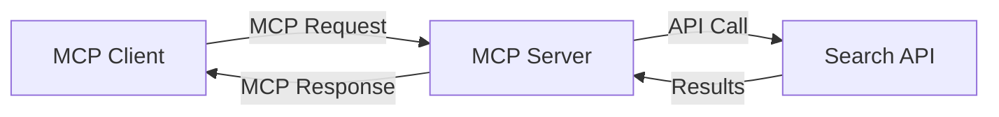
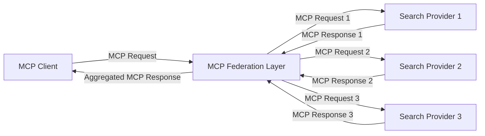
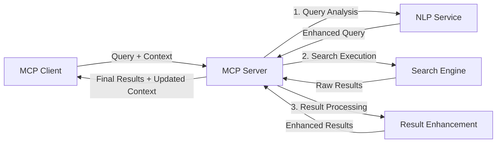

<!--
CO_OP_TRANSLATOR_METADATA:
{
  "original_hash": "eb12652eb7bd17f2193b835a344425c6",
  "translation_date": "2025-06-26T13:48:45+00:00",
  "source_file": "05-AdvancedTopics/mcp-realtimesearch/README.md",
  "language_code": "hi"
}
-->
## कोड उदाहरण अस्वीकरण

> **महत्वपूर्ण नोट**: नीचे दिए गए कोड उदाहरण मॉडल कॉन्टेक्स्ट प्रोटोकॉल (MCP) को वेब सर्च कार्यक्षमता के साथ एकीकृत करने का प्रदर्शन करते हैं। ये उदाहरण आधिकारिक MCP SDKs के पैटर्न और संरचनाओं का पालन करते हैं, लेकिन शैक्षिक उद्देश्यों के लिए इन्हें सरल बनाया गया है।
> 
> ये उदाहरण निम्नलिखित दिखाते हैं:
> 
> 1. **पायथन कार्यान्वयन**: एक FastMCP सर्वर कार्यान्वयन जो एक वेब सर्च टूल प्रदान करता है और बाहरी सर्च API से जुड़ता है। यह उदाहरण उचित लाइफस्पैन प्रबंधन, कॉन्टेक्स्ट हैंडलिंग, और टूल कार्यान्वयन को दिखाता है, जो [आधिकारिक MCP पायथन SDK](https://github.com/modelcontextprotocol/python-sdk) के पैटर्न का पालन करता है। सर्वर अनुशंसित Streamable HTTP ट्रांसपोर्ट का उपयोग करता है, जो उत्पादन तैनाती के लिए पुराने SSE ट्रांसपोर्ट की जगह ले चुका है।
> 
> 2. **जावास्क्रिप्ट कार्यान्वयन**: एक TypeScript/JavaScript कार्यान्वयन जो [आधिकारिक MCP TypeScript SDK](https://github.com/modelcontextprotocol/typescript-sdk) से FastMCP पैटर्न का उपयोग करता है, उचित टूल परिभाषाओं और क्लाइंट कनेक्शनों के साथ एक सर्च सर्वर बनाने के लिए। यह नवीनतम अनुशंसित पैटर्न का पालन करता है, जिसमें सत्र प्रबंधन और कॉन्टेक्स्ट संरक्षण शामिल हैं।
> 
> ये उदाहरण उत्पादन उपयोग के लिए अतिरिक्त त्रुटि प्रबंधन, प्रमाणीकरण, और विशिष्ट API एकीकरण कोड की आवश्यकता होगी। दिखाए गए सर्च API एंडपॉइंट (`https://api.search-service.example/search`) प्लेसहोल्डर हैं और इन्हें वास्तविक सर्च सेवा एंडपॉइंट से बदलना होगा।
> 
> पूर्ण कार्यान्वयन विवरण और नवीनतम तरीकों के लिए कृपया [आधिकारिक MCP विनिर्देशन](https://spec.modelcontextprotocol.io/) और SDK दस्तावेज़ देखें।

## मुख्य अवधारणाएँ

### मॉडल कॉन्टेक्स्ट प्रोटोकॉल (MCP) फ्रेमवर्क

अपने मूल में, मॉडल कॉन्टेक्स्ट प्रोटोकॉल AI मॉडल, एप्लिकेशन, और सेवाओं के बीच कॉन्टेक्स्ट के आदान-प्रदान के लिए एक मानकीकृत तरीका प्रदान करता है। रियल-टाइम वेब सर्च में, यह फ्रेमवर्क सुसंगत, बहु-चरणीय सर्च अनुभव बनाने के लिए आवश्यक है। मुख्य घटक हैं:

1. **क्लाइंट-सर्वर वास्तुकला**: MCP सर्च क्लाइंट्स (अनुरोधकर्ता) और सर्च सर्वर्स (प्रदाता) के बीच स्पष्ट विभाजन स्थापित करता है, जो लचीले तैनाती मॉडल की अनुमति देता है।

2. **JSON-RPC संचार**: प्रोटोकॉल संदेश विनिमय के लिए JSON-RPC का उपयोग करता है, जिससे यह वेब तकनीकों के साथ संगत और विभिन्न प्लेटफार्मों पर लागू करना आसान हो जाता है।

3. **कॉन्टेक्स्ट प्रबंधन**: MCP कई इंटरैक्शन में सर्च कॉन्टेक्स्ट को बनाए रखने, अपडेट करने, और उपयोग करने के लिए संरचित विधियाँ परिभाषित करता है।

4. **टूल परिभाषाएँ**: सर्च क्षमताओं को मानकीकृत टूल के रूप में प्रस्तुत किया जाता है जिनके स्पष्ट पैरामीटर और रिटर्न मान होते हैं।

5. **स्ट्रीमिंग समर्थन**: प्रोटोकॉल स्ट्रीमिंग परिणामों का समर्थन करता है, जो रियल-टाइम सर्च के लिए आवश्यक है जहाँ परिणाम क्रमिक रूप से आ सकते हैं।

### वेब सर्च एकीकरण पैटर्न

जब MCP को वेब सर्च के साथ एकीकृत किया जाता है, तो कई पैटर्न सामने आते हैं:

#### 1. डायरेक्ट सर्च प्रदाता एकीकरण

इस पैटर्न में, MCP सर्वर सीधे एक या अधिक सर्च API से इंटरफेस करता है, MCP अनुरोधों को API-विशिष्ट कॉल में अनुवादित करता है और परिणामों को MCP प्रतिक्रियाओं के रूप में स्वरूपित करता है।

#### 2. संदर्भ संरक्षण के साथ संघीय सर्च

यह पैटर्न सर्च क्वेरी को कई MCP-अनुकूल सर्च प्रदाताओं में वितरित करता है, जो संभवतः विभिन्न प्रकार की सामग्री या सर्च क्षमताओं में विशेषज्ञता रखते हैं, जबकि एकीकृत कॉन्टेक्स्ट बनाए रखते हैं।

#### 3. कॉन्टेक्स्ट-संवर्धित सर्च चेन

इस पैटर्न में, सर्च प्रक्रिया कई चरणों में विभाजित होती है, प्रत्येक चरण में कॉन्टेक्स्ट को समृद्ध किया जाता है, जिससे क्रमिक रूप से अधिक प्रासंगिक परिणाम मिलते हैं।

### सर्च कॉन्टेक्स्ट घटक

MCP-आधारित वेब सर्च में, कॉन्टेक्स्ट आमतौर पर शामिल होता है:

- **क्वेरी इतिहास**: सत्र में पिछले सर्च क्वेरी
- **उपयोगकर्ता प्राथमिकताएँ**: भाषा, क्षेत्र, सुरक्षित सर्च सेटिंग्स
- **इंटरैक्शन इतिहास**: कौन से परिणाम क्लिक किए गए, परिणामों पर बिताया गया समय
- **सर्च पैरामीटर**: फ़िल्टर, सॉर्ट आदेश, और अन्य सर्च संशोधक
- **डोमेन ज्ञान**: खोज से संबंधित विषय-विशिष्ट संदर्भ
- **कालिक संदर्भ**: समय-आधारित प्रासंगिकता कारक
- **स्रोत प्राथमिकताएँ**: विश्वसनीय या पसंदीदा सूचना स्रोत

## उपयोग के मामले और अनुप्रयोग

### अनुसंधान और सूचना संग्रह

MCP अनुसंधान कार्यप्रवाह को बेहतर बनाता है:

- सर्च सत्रों के बीच अनुसंधान संदर्भ को संरक्षित करके
- अधिक परिष्कृत और संदर्भ-संबंधित क्वेरी सक्षम करके
- बहु-स्रोत सर्च संघ का समर्थन करके
- सर्च परिणामों से ज्ञान निष्कर्षण को सुविधाजनक बनाकर

### रियल-टाइम समाचार और ट्रेंड मॉनिटरिंग

MCP-संचालित सर्च समाचार मॉनिटरिंग के लिए लाभ प्रदान करता है:

- उभरती समाचार कहानियों की लगभग वास्तविक-समय खोज
- प्रासंगिक जानकारी का संदर्भगत फ़िल्टरिंग
- कई स्रोतों में विषय और इकाई ट्रैकिंग
- उपयोगकर्ता संदर्भ के आधार पर व्यक्तिगत समाचार अलर्ट

### AI-संवर्धित ब्राउज़िंग और अनुसंधान

MCP AI-संवर्धित ब्राउज़िंग के लिए नए अवसर बनाता है:

- वर्तमान ब्राउज़र गतिविधि के आधार पर संदर्भगत सर्च सुझाव
- LLM-संचालित सहायक के साथ वेब सर्च का सहज एकीकरण
- बहु-चरणीय सर्च सुधार जो कॉन्टेक्स्ट को बनाए रखता है
- बेहतर तथ्य-जांच और सूचना सत्यापन

## भविष्य के रुझान और नवाचार

### वेब सर्च में MCP का विकास

आगे देखते हुए, हम अपेक्षा करते हैं कि MCP निम्नलिखित को संबोधित करेगा:

- **मल्टीमॉडल सर्च**: टेक्स्ट, इमेज, ऑडियो, और वीडियो सर्च को संरक्षित संदर्भ के साथ एकीकृत करना
- **विकेंद्रीकृत सर्च**: वितरित और संघीय सर्च पारिस्थितिकी तंत्र का समर्थन
- **सर्च गोपनीयता**: संदर्भ-सक्षम गोपनीयता-संरक्षित सर्च तंत्र
- **क्वेरी समझ**: प्राकृतिक भाषा सर्च क्वेरी का गहन सेमांटिक पार्सिंग

### प्रौद्योगिकी में संभावित प्रगति

विकसित होती तकनीकें जो MCP सर्च के भविष्य को आकार देंगी:

1. **न्यूरल सर्च आर्किटेक्चर**: MCP के लिए अनुकूलित एम्बेडिंग-आधारित सर्च सिस्टम
2. **व्यक्तिगत सर्च कॉन्टेक्स्ट**: समय के साथ व्यक्तिगत उपयोगकर्ता सर्च पैटर्न सीखना
3. **ज्ञान ग्राफ एकीकरण**: डोमेन-विशिष्ट ज्ञान ग्राफ द्वारा संवर्धित संदर्भगत सर्च
4. **क्रॉस-मोडल कॉन्टेक्स्ट**: विभिन्न सर्च विधाओं में संदर्भ बनाए रखना

## व्यावहारिक अभ्यास

### अभ्यास 1: एक बुनियादी MCP सर्च पाइपलाइन सेटअप करना

इस अभ्यास में, आप सीखेंगे कि कैसे:
- एक बुनियादी MCP सर्च वातावरण कॉन्फ़िगर करें
- वेब सर्च के लिए संदर्भ हैंडलर लागू करें
- सर्च पुनरावृत्तियों के बीच संदर्भ संरक्षण का परीक्षण और सत्यापन करें

### अभ्यास 2: MCP सर्च के साथ एक अनुसंधान सहायक बनाना

एक पूर्ण एप्लिकेशन बनाएं जो:
- प्राकृतिक भाषा अनुसंधान प्रश्नों को संसाधित करता है
- संदर्भ-सक्षम वेब सर्च करता है
- कई स्रोतों से जानकारी संश्लेषित करता है
- संगठित अनुसंधान निष्कर्ष प्रस्तुत करता है

### अभ्यास 3: MCP के साथ बहु-स्रोत सर्च संघ कार्यान्वित करना

उन्नत अभ्यास जिसमें शामिल हैं:
- कई सर्च इंजनों को संदर्भ-सक्षम क्वेरी भेजना
- परिणाम रैंकिंग और समेकन
- सर्च परिणामों का संदर्भगत डुप्लीकेशन
- स्रोत-विशिष्ट मेटाडेटा का प्रबंधन

## अतिरिक्त संसाधन

- [Model Context Protocol Specification](https://spec.modelcontextprotocol.io/) - आधिकारिक MCP विनिर्देशन और विस्तृत प्रोटोकॉल दस्तावेज़
- [Model Context Protocol Documentation](https://modelcontextprotocol.io/) - विस्तृत ट्यूटोरियल और कार्यान्वयन मार्गदर्शक
- [MCP Python SDK](https://github.com/modelcontextprotocol/python-sdk) - MCP प्रोटोकॉल का आधिकारिक पायथन कार्यान्वयन
- [MCP TypeScript SDK](https://github.com/modelcontextprotocol/typescript-sdk) - MCP प्रोटोकॉल का आधिकारिक TypeScript कार्यान्वयन
- [MCP Reference Servers](https://github.com/modelcontextprotocol/servers) - MCP सर्वरों के संदर्भ कार्यान्वयन
- [Bing Web Search API Documentation](https://learn.microsoft.com/en-us/bing/search-apis/bing-web-search/overview) - माइक्रोसॉफ्ट का वेब सर्च API
- [Google Custom Search JSON API](https://developers.google.com/custom-search/v1/overview) - गूगल का प्रोग्रामेबल सर्च इंजन
- [SerpAPI Documentation](https://serpapi.com/search-api) - सर्च इंजन परिणाम पृष्ठ API
- [Meilisearch Documentation](https://www.meilisearch.com/docs) - ओपन-सोर्स सर्च इंजन
- [Elasticsearch Documentation](https://www.elastic.co/guide/index.html) - वितरित सर्च और एनालिटिक्स इंजन
- [LangChain Documentation](https://python.langchain.com/docs/get_started/introduction) - LLMs के साथ एप्लिकेशन बनाना

## सीखने के परिणाम

इस मॉड्यूल को पूरा करने पर, आप सक्षम होंगे:

- रियल-टाइम वेब सर्च के मूल सिद्धांतों और चुनौतियों को समझना
- समझाना कि मॉडल कॉन्टेक्स्ट प्रोटोकॉल (MCP) रियल-टाइम वेब सर्च क्षमताओं को कैसे बढ़ाता है
- लोकप्रिय फ्रेमवर्क और API का उपयोग करके MCP-आधारित सर्च समाधान लागू करना
- MCP के साथ स्केलेबल, उच्च-प्रदर्शन सर्च आर्किटेक्चर डिज़ाइन और तैनात करना
- MCP अवधारणाओं को विभिन्न उपयोग मामलों जैसे सेमांटिक सर्च, अनुसंधान सहायता, और AI-संवर्धित ब्राउज़िंग में लागू करना
- MCP-आधारित सर्च तकनीकों में उभरते रुझान और भविष्य के नवाचारों का मूल्यांकन करना

### ट्रस्ट और सुरक्षा विचार

MCP-आधारित वेब सर्च समाधान लागू करते समय, MCP विनिर्देशन से ये महत्वपूर्ण सिद्धांत याद रखें:

1. **उपयोगकर्ता सहमति और नियंत्रण**: उपयोगकर्ताओं को सभी डेटा एक्सेस और ऑपरेशनों के लिए स्पष्ट रूप से सहमति देनी चाहिए और उन्हें समझना चाहिए। यह विशेष रूप से महत्वपूर्ण है जब वेब सर्च कार्यान्वयन बाहरी डेटा स्रोतों तक पहुंच सकते हैं।

2. **डेटा गोपनीयता**: सर्च क्वेरी और परिणामों को उचित रूप से संभालें, खासकर जब वे संवेदनशील जानकारी हो सकती है। उपयोगकर्ता डेटा की सुरक्षा के लिए उपयुक्त पहुंच नियंत्रण लागू करें।

3. **टूल सुरक्षा**: सर्च टूल के लिए उचित प्राधिकरण और सत्यापन लागू करें, क्योंकि ये मनमाने कोड निष्पादन के माध्यम से संभावित सुरक्षा जोखिम प्रस्तुत कर सकते हैं। टूल व्यवहार के विवरण को तब तक अविश्वसनीय माना जाना चाहिए जब तक कि वे विश्वसनीय सर्वर से प्राप्त न हों।

4. **स्पष्ट दस्तावेज़ीकरण**: आपकी MCP-आधारित सर्च कार्यान्वयन की क्षमताओं, सीमाओं, और सुरक्षा विचारों के बारे में स्पष्ट दस्तावेज़ प्रदान करें, MCP विनिर्देशन की कार्यान्वयन दिशानिर्देशों का पालन करते हुए।

5. **मजबूत सहमति प्रवाह**: मजबूत सहमति और प्राधिकरण प्रवाह बनाएं जो प्रत्येक टूल के उपयोग को प्राधिकृत करने से पहले स्पष्ट रूप से समझाएं कि वह क्या करता है, विशेष रूप से उन टूल के लिए जो बाहरी वेब संसाधनों के साथ इंटरैक्ट करते हैं।

MCP सुरक्षा और ट्रस्ट विचारों के पूर्ण विवरण के लिए, कृपया [आधिकारिक दस्तावेज़](https://modelcontextprotocol.io/specification/2025-03-26#security-and-trust-%26-safety) देखें।

## आगे क्या है

- [5.11 मॉडल कॉन्टेक्स्ट प्रोटोकॉल सर्वरों के लिए Entra ID प्रमाणीकरण](../mcp-security-entra/README.md)

**अस्वीकरण**:  
यह दस्तावेज़ AI अनुवाद सेवा [Co-op Translator](https://github.com/Azure/co-op-translator) का उपयोग करके अनुवादित किया गया है। जबकि हम सटीकता के लिए प्रयासरत हैं, कृपया ध्यान दें कि स्वचालित अनुवादों में त्रुटियाँ या असंगतियाँ हो सकती हैं। मूल दस्तावेज़ अपनी मूल भाषा में प्रामाणिक स्रोत माना जाना चाहिए। महत्वपूर्ण जानकारी के लिए, पेशेवर मानव अनुवाद की सलाह दी जाती है। इस अनुवाद के उपयोग से उत्पन्न किसी भी गलतफहमी या गलत व्याख्या के लिए हम उत्तरदायी नहीं हैं।