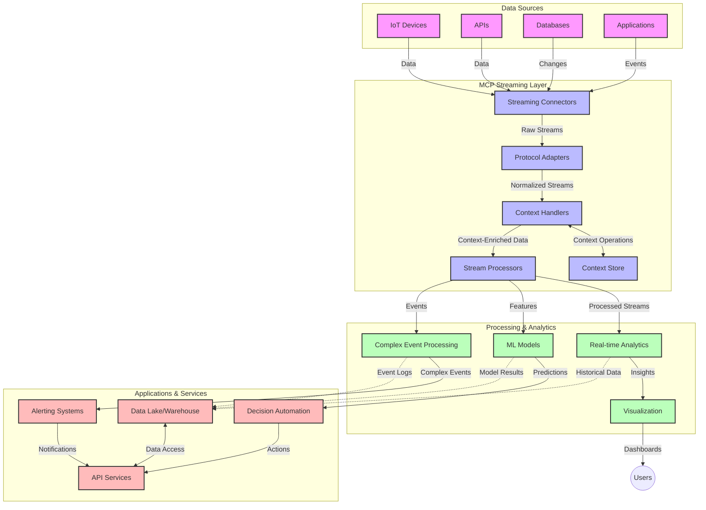

<!--
CO_OP_TRANSLATOR_METADATA:
{
  "original_hash": "195f7287638b77a549acadd96c8f981c",
  "translation_date": "2025-06-12T22:09:05+00:00",
  "source_file": "05-AdvancedTopics/mcp-realtimestreaming/README.md",
  "language_code": "hi"
}
-->
# Model Context Protocol for Real-Time Data Streaming

## अवलोकन

आज के डेटा-संचालित युग में, जहां व्यवसायों और अनुप्रयोगों को त्वरित निर्णय लेने के लिए तुरंत जानकारी की आवश्यकता होती है, रियल-टाइम डेटा स्ट्रीमिंग अत्यंत महत्वपूर्ण हो गया है। Model Context Protocol (MCP) इन रियल-टाइम स्ट्रीमिंग प्रक्रियाओं को बेहतर बनाने में एक महत्वपूर्ण प्रगति का प्रतिनिधित्व करता है, जो डेटा प्रोसेसिंग की दक्षता बढ़ाता है, संदर्भ की अखंडता बनाए रखता है, और समग्र सिस्टम प्रदर्शन को सुधारता है।

यह मॉड्यूल यह बताता है कि MCP कैसे AI मॉडल, स्ट्रीमिंग प्लेटफॉर्म और अनुप्रयोगों के बीच संदर्भ प्रबंधन के लिए एक मानकीकृत दृष्टिकोण प्रदान करके रियल-टाइम डेटा स्ट्रीमिंग को बदल देता है।

## रियल-टाइम डेटा स्ट्रीमिंग का परिचय

रियल-टाइम डेटा स्ट्रीमिंग एक तकनीकी मॉडल है जो डेटा के निरंतर ट्रांसफर, प्रोसेसिंग और विश्लेषण को सक्षम बनाता है जैसे ही वह उत्पन्न होता है, जिससे सिस्टम तुरंत नई जानकारी पर प्रतिक्रिया दे सकते हैं। पारंपरिक बैच प्रोसेसिंग से अलग, जो स्थिर डेटा सेट पर काम करती है, स्ट्रीमिंग डेटा को गतिमान रूप में प्रोसेस करती है, न्यूनतम विलंबता के साथ अंतर्दृष्टि और कार्रवाई प्रदान करती है।

### रियल-टाइम डेटा स्ट्रीमिंग के मुख्य सिद्धांत:

- **निरंतर डेटा प्रवाह**: डेटा को घटनाओं या रिकॉर्ड्स की एक निरंतर, कभी न खत्म होने वाली धारा के रूप में प्रोसेस किया जाता है।
- **कम विलंबता प्रोसेसिंग**: सिस्टम को डेटा उत्पन्न होने और प्रोसेसिंग के बीच समय को कम से कम करने के लिए डिज़ाइन किया गया है।
- **स्केलेबिलिटी**: स्ट्रीमिंग आर्किटेक्चर को विभिन्न डेटा मात्रा और गति को संभालना होता है।
- **फॉल्ट टॉलरेंस**: सिस्टम को विफलताओं के खिलाफ लचीला होना चाहिए ताकि डेटा प्रवाह बिना बाधा के जारी रहे।
- **स्टेटफुल प्रोसेसिंग**: घटनाओं के बीच संदर्भ बनाए रखना सार्थक विश्लेषण के लिए आवश्यक है।

### Model Context Protocol और रियल-टाइम स्ट्रीमिंग

Model Context Protocol (MCP) रियल-टाइम स्ट्रीमिंग वातावरण में कई महत्वपूर्ण चुनौतियों का समाधान करता है:

1. **संदर्भ की निरंतरता**: MCP यह सुनिश्चित करता है कि वितरित स्ट्रीमिंग घटकों में संदर्भ कैसे बनाए रखा जाए, ताकि AI मॉडल और प्रोसेसिंग नोड्स को प्रासंगिक ऐतिहासिक और पर्यावरणीय संदर्भ तक पहुंच मिले।

2. **प्रभावी स्टेट प्रबंधन**: संदर्भ ट्रांसमिशन के लिए संरचित तंत्र प्रदान करके, MCP स्ट्रीमिंग पाइपलाइनों में स्टेट प्रबंधन के ओवरहेड को कम करता है।

3. **इंटरऑपरेबिलिटी**: MCP विभिन्न स्ट्रीमिंग तकनीकों और AI मॉडलों के बीच संदर्भ साझा करने के लिए एक सामान्य भाषा बनाता है, जिससे अधिक लचीली और विस्तारित आर्किटेक्चर संभव होते हैं।

4. **स्ट्रीमिंग के लिए अनुकूलित संदर्भ**: MCP कार्यान्वयन यह प्राथमिकता दे सकते हैं कि कौन से संदर्भ तत्व रियल-टाइम निर्णय लेने के लिए सबसे प्रासंगिक हैं, जिससे प्रदर्शन और सटीकता दोनों में सुधार होता है।

5. **अनुकूली प्रोसेसिंग**: MCP के माध्यम से उचित संदर्भ प्रबंधन के साथ, स्ट्रीमिंग सिस्टम डेटा में बदलती परिस्थितियों और पैटर्न के आधार पर प्रोसेसिंग को गतिशील रूप से समायोजित कर सकते हैं।

आधुनिक अनुप्रयोगों में, जैसे IoT सेंसर नेटवर्क से लेकर वित्तीय ट्रेडिंग प्लेटफॉर्म तक, MCP का स्ट्रीमिंग तकनीकों के साथ एकीकरण अधिक बुद्धिमान, संदर्भ-सचेत प्रोसेसिंग सक्षम करता है जो जटिल और बदलती परिस्थितियों पर समय पर प्रतिक्रिया दे सकता है।

## सीखने के उद्देश्य

इस पाठ के अंत तक, आप सक्षम होंगे:

- रियल-टाइम डेटा स्ट्रीमिंग के मूल सिद्धांत और चुनौतियों को समझना
- समझाना कि Model Context Protocol (MCP) रियल-टाइम डेटा स्ट्रीमिंग को कैसे बेहतर बनाता है
- लोकप्रिय फ्रेमवर्क जैसे Kafka और Pulsar का उपयोग करके MCP-आधारित स्ट्रीमिंग समाधान लागू करना
- MCP के साथ फॉल्ट-टॉलरेंट, उच्च प्रदर्शन स्ट्रीमिंग आर्किटेक्चर डिजाइन और तैनात करना
- IoT, वित्तीय ट्रेडिंग, और AI-चालित एनालिटिक्स उपयोग मामलों में MCP अवधारणाओं को लागू करना
- MCP-आधारित स्ट्रीमिंग तकनीकों में उभरते रुझानों और भविष्य के नवाचारों का मूल्यांकन करना

### परिभाषा और महत्व

रियल-टाइम डेटा स्ट्रीमिंग में न्यूनतम विलंबता के साथ डेटा का निरंतर उत्पादन, प्रोसेसिंग और वितरण शामिल है। जहां बैच प्रोसेसिंग में डेटा को समूहों में इकट्ठा करके प्रोसेस किया जाता है, वहीं स्ट्रीमिंग डेटा को आते ही क्रमिक रूप से प्रोसेस करती है, जिससे तुरंत अंतर्दृष्टि और कार्रवाई संभव होती है।

रियल-टाइम डेटा स्ट्रीमिंग की मुख्य विशेषताएँ हैं:

- **कम विलंबता**: डेटा को मिलीसेकंड से सेकंड के भीतर प्रोसेस और विश्लेषित करना
- **निरंतर प्रवाह**: विभिन्न स्रोतों से डेटा की बिना रुके धारा
- **तत्काल प्रोसेसिंग**: डेटा को आते ही प्रोसेस करना, न कि बैच में
- **इवेंट-ड्रिवन आर्किटेक्चर**: घटनाओं के होते ही प्रतिक्रिया देना

### पारंपरिक डेटा स्ट्रीमिंग में चुनौतियाँ

पारंपरिक डेटा स्ट्रीमिंग दृष्टिकोणों में कई सीमाएं होती हैं:

1. **संदर्भ हानि**: वितरित सिस्टम में संदर्भ बनाए रखने में कठिनाई
2. **स्केलेबिलिटी समस्याएँ**: उच्च मात्रा और उच्च गति के डेटा को संभालने में चुनौतियां
3. **एकीकरण जटिलता**: विभिन्न सिस्टमों के बीच इंटरऑपरेबिलिटी की समस्याएं
4. **विलंबता प्रबंधन**: थ्रूपुट और प्रोसेसिंग समय के बीच संतुलन बनाना
5. **डेटा सुसंगतता**: स्ट्रीम के पूरे प्रवाह में डेटा की सटीकता और पूर्णता सुनिश्चित करना

## Model Context Protocol (MCP) को समझना

### MCP क्या है?

Model Context Protocol (MCP) एक मानकीकृत संचार प्रोटोकॉल है जिसे AI मॉडल और अनुप्रयोगों के बीच कुशल इंटरैक्शन को सक्षम बनाने के लिए डिजाइन किया गया है। रियल-टाइम डेटा स्ट्रीमिंग के संदर्भ में, MCP निम्नलिखित के लिए एक फ्रेमवर्क प्रदान करता है:

- डेटा पाइपलाइन के दौरान संदर्भ को संरक्षित करना
- डेटा विनिमय स्वरूपों को मानकीकृत करना
- बड़े डेटा सेट के ट्रांसमिशन का अनुकूलन करना
- मॉडल-से-मॉडल और मॉडल-से-एप्लिकेशन संचार को बेहतर बनाना

### मुख्य घटक और आर्किटेक्चर

रियल-टाइम स्ट्रीमिंग के लिए MCP आर्किटेक्चर में कई मुख्य घटक शामिल हैं:

1. **Context Handlers**: स्ट्रीमिंग पाइपलाइन में संदर्भ जानकारी का प्रबंधन और रखरखाव करते हैं
2. **Stream Processors**: संदर्भ-सचेत तकनीकों का उपयोग करके इनकमिंग डेटा स्ट्रीम्स को प्रोसेस करते हैं
3. **Protocol Adapters**: विभिन्न स्ट्रीमिंग प्रोटोकॉल के बीच संदर्भ को संरक्षित करते हुए रूपांतरण करते हैं
4. **Context Store**: संदर्भ जानकारी को कुशलतापूर्वक संग्रहित और पुनः प्राप्त करता है
5. **Streaming Connectors**: विभिन्न स्ट्रीमिंग प्लेटफॉर्म (Kafka, Pulsar, Kinesis आदि) से कनेक्ट करते हैं



### MCP रियल-टाइम डेटा हैंडलिंग को कैसे बेहतर बनाता है

MCP पारंपरिक स्ट्रीमिंग चुनौतियों को इस प्रकार संबोधित करता है:

- **संदर्भ की अखंडता**: पूरे पाइपलाइन में डेटा बिंदुओं के बीच संबंध बनाए रखना
- **अनुकूलित ट्रांसमिशन**: बुद्धिमान संदर्भ प्रबंधन के जरिए डेटा विनिमय में पुनरावृत्ति कम करना
- **मानकीकृत इंटरफेस**: स्ट्रीमिंग घटकों के लिए सुसंगत API प्रदान करना
- **कम विलंबता**: कुशल संदर्भ प्रबंधन के माध्यम से प्रोसेसिंग ओवरहेड को कम करना
- **बेहतर स्केलेबिलिटी**: संदर्भ बनाए रखते हुए हॉरिजॉन्टल स्केलिंग का समर्थन करना

## एकीकरण और कार्यान्वयन

रियल-टाइम डेटा स्ट्रीमिंग सिस्टमों को प्रदर्शन और संदर्भ अखंडता दोनों बनाए रखने के लिए सावधानीपूर्वक आर्किटेक्चरल डिजाइन और कार्यान्वयन की आवश्यकता होती है। Model Context Protocol AI मॉडल और स्ट्रीमिंग तकनीकों को एकीकृत करने के लिए एक मानकीकृत दृष्टिकोण प्रदान करता है, जिससे अधिक परिष्कृत, संदर्भ-सचेत प्रोसेसिंग पाइपलाइन संभव होती है।

### स्ट्रीमिंग आर्किटेक्चर में MCP एकीकरण का अवलोकन

रियल-टाइम स्ट्रीमिंग वातावरण में MCP लागू करते समय कई महत्वपूर्ण बातें ध्यान में रखनी होती हैं:

1. **संदर्भ सीरियलाइजेशन और ट्रांसपोर्ट**: MCP स्ट्रीमिंग डेटा पैकेट्स में संदर्भ जानकारी को कुशलतापूर्वक एन्कोड करने के लिए तंत्र प्रदान करता है, जिससे आवश्यक संदर्भ डेटा के साथ पूरे प्रोसेसिंग पाइपलाइन में चलता रहता है। इसमें स्ट्रीमिंग ट्रांसपोर्ट के लिए अनुकूलित मानकीकृत सीरियलाइजेशन फॉर्मेट शामिल हैं।

2. **स्टेटफुल स्ट्रीम प्रोसेसिंग**: MCP प्रोसेसिंग नोड्स के बीच सुसंगत संदर्भ प्रतिनिधित्व बनाए रखकर अधिक बुद्धिमान स्टेटफुल प्रोसेसिंग सक्षम करता है। यह विशेष रूप से वितरित स्ट्रीमिंग आर्किटेक्चर में महत्वपूर्ण है जहां स्टेट प्रबंधन पारंपरिक रूप से चुनौतीपूर्ण होता है।

3. **इवेंट-टाइम बनाम प्रोसेसिंग-टाइम**: MCP कार्यान्वयन को यह सुनिश्चित करना होता है कि वे घटनाओं के होने के समय और प्रोसेसिंग के समय के बीच के अंतर को संबोधित करें। प्रोटोकॉल में ऐसा समय-संबंधित संदर्भ शामिल हो सकता है जो इवेंट टाइम सेमांटिक्स को संरक्षित करता है।

4. **बैकप्रेशर प्रबंधन**: संदर्भ प्रबंधन को मानकीकृत करके, MCP स्ट्रीमिंग सिस्टम में बैकप्रेशर को नियंत्रित करने में मदद करता है, जिससे घटक अपनी प्रोसेसिंग क्षमता के बारे में संवाद कर सकें और प्रवाह को समायोजित कर सकें।

5. **संदर्भ विंडोइंग और समेकन**: MCP समय और संबंध संदर्भों के संरचित प्रतिनिधित्व प्रदान करके अधिक परिष्कृत विंडोइंग ऑपरेशन्स की सुविधा देता है, जिससे इवेंट स्ट्रीम्स में अधिक सार्थक समेकन संभव होता है।

6. **एक्सैक्टली-वन प्रोसेसिंग**: उन स्ट्रीमिंग सिस्टमों में जहां बिल्कुल एक बार प्रोसेसिंग आवश्यक है, MCP प्रोसेसिंग मेटाडेटा शामिल कर सकता है ताकि वितरित घटकों में प्रोसेसिंग स्थिति को ट्रैक और सत्यापित किया जा सके।

विभिन्न स्ट्रीमिंग तकनीकों में MCP के कार्यान्वयन से संदर्भ प्रबंधन के लिए एकीकृत दृष्टिकोण बनता है, जिससे कस्टम एकीकरण कोड की आवश्यकता कम होती है और डेटा पाइपलाइन में संदर्भ को बनाए रखने की क्षमता बढ़ती है।

### विभिन्न डेटा स्ट्रीमिंग फ्रेमवर्क में MCP

ये उदाहरण वर्तमान MCP विनिर्देशन का पालन करते हैं जो JSON-RPC आधारित प्रोटोकॉल पर केंद्रित है जिसमें विशिष्ट ट्रांसपोर्ट तंत्र होते हैं। कोड दिखाता है कि कैसे आप कस्टम ट्रांसपोर्ट्स लागू कर सकते हैं जो Kafka और Pulsar जैसे स्ट्रीमिंग प्लेटफॉर्म को MCP प्रोटोकॉल के साथ पूर्ण संगतता के साथ एकीकृत करते हैं।

ये उदाहरण यह दर्शाने के लिए डिज़ाइन किए गए हैं कि कैसे स्ट्रीमिंग प्लेटफॉर्म MCP के साथ एकीकृत होकर रियल-टाइम डेटा प्रोसेसिंग प्रदान कर सकते हैं जबकि MCP के केंद्रीय संदर्भ जागरूकता को बनाए रखते हैं। यह दृष्टिकोण सुनिश्चित करता है कि कोड नमूने जून 2025 तक MCP विनिर्देशन की वर्तमान स्थिति को सटीक रूप से प्रतिबिंबित करें।

MCP को लोकप्रिय स्ट्रीमिंग फ्रेमवर्क्स के साथ एकीकृत किया जा सकता है, जिनमें शामिल हैं:

#### Apache Kafka एकीकरण

```python
import asyncio
import json
from typing import Dict, Any, Optional
from confluent_kafka import Consumer, Producer, KafkaError
from mcp.client import Client, ClientCapabilities
from mcp.core.message import JsonRpcMessage
from mcp.core.transports import Transport

# Custom transport class to bridge MCP with Kafka
class KafkaMCPTransport(Transport):
    def __init__(self, bootstrap_servers: str, input_topic: str, output_topic: str):
        self.bootstrap_servers = bootstrap_servers
        self.input_topic = input_topic
        self.output_topic = output_topic
        self.producer = Producer({'bootstrap.servers': bootstrap_servers})
        self.consumer = Consumer({
            'bootstrap.servers': bootstrap_servers,
            'group.id': 'mcp-client-group',
            'auto.offset.reset': 'earliest'
        })
        self.message_queue = asyncio.Queue()
        self.running = False
        self.consumer_task = None
        
    async def connect(self):
        """Connect to Kafka and start consuming messages"""
        self.consumer.subscribe([self.input_topic])
        self.running = True
        self.consumer_task = asyncio.create_task(self._consume_messages())
        return self
        
    async def _consume_messages(self):
        """Background task to consume messages from Kafka and queue them for processing"""
        while self.running:
            try:
                msg = self.consumer.poll(1.0)
                if msg is None:
                    await asyncio.sleep(0.1)
                    continue
                
                if msg.error():
                    if msg.error().code() == KafkaError._PARTITION_EOF:
                        continue
                    print(f"Consumer error: {msg.error()}")
                    continue
                
                # Parse the message value as JSON-RPC
                try:
                    message_str = msg.value().decode('utf-8')
                    message_data = json.loads(message_str)
                    mcp_message = JsonRpcMessage.from_dict(message_data)
                    await self.message_queue.put(mcp_message)
                except Exception as e:
                    print(f"Error parsing message: {e}")
            except Exception as e:
                print(f"Error in consumer loop: {e}")
                await asyncio.sleep(1)
    
    async def read(self) -> Optional[JsonRpcMessage]:
        """Read the next message from the queue"""
        try:
            message = await self.message_queue.get()
            return message
        except Exception as e:
            print(f"Error reading message: {e}")
            return None
    
    async def write(self, message: JsonRpcMessage) -> None:
        """Write a message to the Kafka output topic"""
        try:
            message_json = json.dumps(message.to_dict())
            self.producer.produce(
                self.output_topic,
                message_json.encode('utf-8'),
                callback=self._delivery_report
            )
            self.producer.poll(0)  # Trigger callbacks
        except Exception as e:
            print(f"Error writing message: {e}")
    
    def _delivery_report(self, err, msg):
        """Kafka producer delivery callback"""
        if err is not None:
            print(f'Message delivery failed: {err}')
        else:
            print(f'Message delivered to {msg.topic()} [{msg.partition()}]')
    
    async def close(self) -> None:
        """Close the transport"""
        self.running = False
        if self.consumer_task:
            self.consumer_task.cancel()
            try:
                await self.consumer_task
            except asyncio.CancelledError:
                pass
        self.consumer.close()
        self.producer.flush()

# Example usage of the Kafka MCP transport
async def kafka_mcp_example():
    # Create MCP client with Kafka transport
    client = Client(
        {"name": "kafka-mcp-client", "version": "1.0.0"},
        ClientCapabilities({})
    )
    
    # Create and connect the Kafka transport
    transport = KafkaMCPTransport(
        bootstrap_servers="localhost:9092",
        input_topic="mcp-responses",
        output_topic="mcp-requests"
    )
    
    await client.connect(transport)
    
    try:
        # Initialize the MCP session
        await client.initialize()
        
        # Example of executing a tool via MCP
        response = await client.execute_tool(
            "process_data",
            {
                "data": "sample data",
                "metadata": {
                    "source": "sensor-1",
                    "timestamp": "2025-06-12T10:30:00Z"
                }
            }
        )
        
        print(f"Tool execution response: {response}")
        
        # Clean shutdown
        await client.shutdown()
    finally:
        await transport.close()

# Run the example
if __name__ == "__main__":
    asyncio.run(kafka_mcp_example())
```

#### Apache Pulsar कार्यान्वयन

```python
import asyncio
import json
import pulsar
from typing import Dict, Any, Optional
from mcp.core.message import JsonRpcMessage
from mcp.core.transports import Transport
from mcp.server import Server, ServerOptions
from mcp.server.tools import Tool, ToolExecutionContext, ToolMetadata

# Create a custom MCP transport that uses Pulsar
class PulsarMCPTransport(Transport):
    def __init__(self, service_url: str, request_topic: str, response_topic: str):
        self.service_url = service_url
        self.request_topic = request_topic
        self.response_topic = response_topic
        self.client = pulsar.Client(service_url)
        self.producer = self.client.create_producer(response_topic)
        self.consumer = self.client.subscribe(
            request_topic,
            "mcp-server-subscription",
            consumer_type=pulsar.ConsumerType.Shared
        )
        self.message_queue = asyncio.Queue()
        self.running = False
        self.consumer_task = None
    
    async def connect(self):
        """Connect to Pulsar and start consuming messages"""
        self.running = True
        self.consumer_task = asyncio.create_task(self._consume_messages())
        return self
    
    async def _consume_messages(self):
        """Background task to consume messages from Pulsar and queue them for processing"""
        while self.running:
            try:
                # Non-blocking receive with timeout
                msg = self.consumer.receive(timeout_millis=500)
                
                # Process the message
                try:
                    message_str = msg.data().decode('utf-8')
                    message_data = json.loads(message_str)
                    mcp_message = JsonRpcMessage.from_dict(message_data)
                    await self.message_queue.put(mcp_message)
                    
                    # Acknowledge the message
                    self.consumer.acknowledge(msg)
                except Exception as e:
                    print(f"Error processing message: {e}")
                    # Negative acknowledge if there was an error
                    self.consumer.negative_acknowledge(msg)
            except Exception as e:
                # Handle timeout or other exceptions
                await asyncio.sleep(0.1)
    
    async def read(self) -> Optional[JsonRpcMessage]:
        """Read the next message from the queue"""
        try:
            message = await self.message_queue.get()
            return message
        except Exception as e:
            print(f"Error reading message: {e}")
            return None
    
    async def write(self, message: JsonRpcMessage) -> None:
        """Write a message to the Pulsar output topic"""
        try:
            message_json = json.dumps(message.to_dict())
            self.producer.send(message_json.encode('utf-8'))
        except Exception as e:
            print(f"Error writing message: {e}")
    
    async def close(self) -> None:
        """Close the transport"""
        self.running = False
        if self.consumer_task:
            self.consumer_task.cancel()
            try:
                await self.consumer_task
            except asyncio.CancelledError:
                pass
        self.consumer.close()
        self.producer.close()
        self.client.close()

# Define a sample MCP tool that processes streaming data
@Tool(
    name="process_streaming_data",
    description="Process streaming data with context preservation",
    metadata=ToolMetadata(
        required_capabilities=["streaming"]
    )
)
async def process_streaming_data(
    ctx: ToolExecutionContext,
    data: str,
    source: str,
    priority: str = "medium"
) -> Dict[str, Any]:
    """
    Process streaming data while preserving context
    
    Args:
        ctx: Tool execution context
        data: The data to process
        source: The source of the data
        priority: Priority level (low, medium, high)
        
    Returns:
        Dict containing processed results and context information
    """
    # Example processing that leverages MCP context
    print(f"Processing data from {source} with priority {priority}")
    
    # Access conversation context from MCP
    conversation_id = ctx.conversation_id if hasattr(ctx, 'conversation_id') else "unknown"
    
    # Return results with enhanced context
    return {
        "processed_data": f"Processed: {data}",
        "context": {
            "conversation_id": conversation_id,
            "source": source,
            "priority": priority,
            "processing_timestamp": ctx.get_current_time_iso()
        }
    }

# Example MCP server implementation using Pulsar transport
async def run_mcp_server_with_pulsar():
    # Create MCP server
    server = Server(
        {"name": "pulsar-mcp-server", "version": "1.0.0"},
        ServerOptions(
            capabilities={"streaming": True}
        )
    )
    
    # Register our tool
    server.register_tool(process_streaming_data)
    
    # Create and connect Pulsar transport
    transport = PulsarMCPTransport(
        service_url="pulsar://localhost:6650",
        request_topic="mcp-requests",
        response_topic="mcp-responses"
    )
    
    try:
        # Start the server with the Pulsar transport
        await server.run(transport)
    finally:
        await transport.close()

# Run the server
if __name__ == "__main__":
    asyncio.run(run_mcp_server_with_pulsar())
```

### तैनाती के लिए सर्वोत्तम प्रथाएं

जब MCP को रियल-टाइम स्ट्रीमिंग के लिए लागू किया जाए:

1. **फॉल्ट टॉलरेंस के लिए डिज़ाइन करें**:
   - उचित त्रुटि हैंडलिंग लागू करें
   - असफल संदेशों के लिए डेड-लेटर कतारों का उपयोग करें
   - इडेम्पोटेंट प्रोसेसर डिज़ाइन करें

2. **प्रदर्शन के लिए अनुकूलित करें**:
   - उपयुक्त बफ़र आकार कॉन्फ़िगर करें
   - जहाँ आवश्यक हो बैचिंग का उपयोग करें
   - बैकप्रेशर तंत्र लागू करें

3. **निगरानी और अवलोकन करें**:
   - स्ट्रीम प्रोसेसिंग मेट्रिक्स ट्रैक करें
   - संदर्भ प्रसार की निगरानी करें
   - असामान्यताओं के लिए अलर्ट सेट करें

4. **अपने स्ट्रीम्स को सुरक्षित करें**:
   - संवेदनशील डेटा के लिए एन्क्रिप्शन लागू करें
   - प्रमाणीकरण और प्राधिकरण का उपयोग करें
   - उचित एक्सेस नियंत्रण लागू करें

### IoT और एज कंप्यूटिंग में MCP

MCP IoT स्ट्रीमिंग को इस प्रकार बेहतर बनाता है:

- प्रोसेसिंग पाइपलाइन में डिवाइस संदर्भ को संरक्षित करना
- एज-टू-क्लाउड डेटा स्ट्रीमिंग को कुशल बनाना
- IoT डेटा स्ट्रीम्स पर रियल-टाइम एनालिटिक्स का समर्थन
- संदर्भ के साथ डिवाइस-से-डिवाइस संचार की सुविधा

उदाहरण: स्मार्ट सिटी सेंसर नेटवर्क  
```
Sensors → Edge Gateways → MCP Stream Processors → Real-time Analytics → Automated Responses
```

### वित्तीय लेनदेन और हाई-फ्रीक्वेंसी ट्रेडिंग में भूमिका

MCP वित्तीय डेटा स्ट्रीमिंग के लिए महत्वपूर्ण लाभ प्रदान करता है:

- ट्रेडिंग निर्णयों के लिए अल्ट्रा-लो विलंबता प्रोसेसिंग
- पूरे प्रोसेसिंग में लेनदेन संदर्भ बनाए रखना
- संदर्भ जागरूक जटिल इवेंट प्रोसेसिंग का समर्थन
- वितरित ट्रेडिंग सिस्टमों में डेटा सुसंगतता सुनिश्चित करना

### AI-चालित डेटा एनालिटिक्स को बढ़ावा देना

MCP स्ट्रीमिंग एनालिटिक्स के लिए नई संभावनाएं बनाता है:

- रियल-टाइम मॉडल प्रशिक्षण और अनुमान
- स्ट्रीमिंग डेटा से सतत सीखना
- संदर्भ-सचेत फीचर निष्कर्षण
- संरक्षित संदर्भ के साथ मल्टी-मॉडल अनुमान पाइपलाइन्स

## भविष्य के रुझान और नवाचार

### रियल-टाइम वातावरण में MCP का विकास

आगे देखते हुए, हम अपेक्षा करते हैं कि MCP निम्नलिखित मुद्दों को संबोधित करेगा:

- **क्वांटम कंप्यूटिंग एकीकरण**: क्वांटम-आधारित स्ट्रीमिंग सिस्टम के लिए तैयारी
- **एज-नेटिव प्रोसेसिंग**: अधिक संदर्भ-सचेत प्रोसेसिंग को एज डिवाइसों पर ले जाना
- **स्वायत्त स्ट्रीम प्रबंधन**: स्व-ऑप्टिमाइज़िंग स्ट्रीमिंग पाइपलाइन्स
- **फेडरेटेड स्ट्रीमिंग**: गोपनीयता बनाए रखते हुए वितरित प्रोसेसिंग

### प्रौद्योगिकी में संभावित प्रगति

वे उभरती तकनीकें जो MCP स्ट्रीमिंग के भविष्य को आकार देंगी:

1. **AI-ऑप्टिमाइज़्ड स्ट्रीमिंग प्रोटोकॉल**: AI वर्कलोड के लिए विशेष रूप से डिज़ाइन किए गए कस्टम प्रोटोकॉल
2. **न्यूरोमॉर्फिक कंप्यूटिंग एकीकरण**: ब्रेन-प्रेरित कंप्यूटिंग स्ट्रीम प्रोसेसिंग के लिए
3. **सर्वरलेस स्ट्रीमिंग**: इन्फ्रास्ट्रक्चर प्रबंधन के बिना इवेंट-ड्रिवन, स्केलेबल स्ट्रीमिंग
4. **वितरित संदर्भ स्टोर**: वैश्विक स्तर पर वितरित फिर भी अत्यंत सुसंगत संदर्भ प्रबंधन

## व्यावहारिक अभ्यास

### अभ्यास 1: एक बुनियादी MCP स्ट्रीमिंग पाइपलाइन सेटअप करना

इस अभ्यास में, आप सीखेंगे कि कैसे:

- एक बुनियादी MCP स्ट्रीमिंग वातावरण कॉन्फ़िगर करें
- स्ट्रीम प्रोसेसिंग के लिए संदर्भ हैंडलर लागू करें
- संदर्भ संरक्षण का परीक्षण और सत्यापन करें

### अभ्यास 2: एक रियल-टाइम एनालिटिक्स डैशबोर्ड बनाना

एक पूर्ण एप्लिकेशन बनाएं जो:

- MCP का उपयोग करके स्ट्रीमिंग डेटा इनजेस्ट करता है
- संदर्भ बनाए रखते हुए स्ट्रीम को प्रोसेस करता है
- परिणामों को रियल-टाइम में विज़ुअलाइज़ करता है

### अभ्यास 3: MCP के साथ जटिल इवेंट प्रोसेसिंग लागू करना

उन्नत अभ्यास जिसमें शामिल हैं:

- स्ट्रीम्स में पैटर्न

**अस्वीकरण**:  
यह दस्तावेज़ AI अनुवाद सेवा [Co-op Translator](https://github.com/Azure/co-op-translator) का उपयोग करके अनुवादित किया गया है। जबकि हम सटीकता के लिए प्रयासरत हैं, कृपया ध्यान दें कि स्वचालित अनुवादों में त्रुटियाँ या असंगतियाँ हो सकती हैं। मूल दस्तावेज़ अपनी मूल भाषा में प्राधिकृत स्रोत माना जाना चाहिए। महत्वपूर्ण जानकारी के लिए, पेशेवर मानव अनुवाद की सलाह दी जाती है। इस अनुवाद के उपयोग से उत्पन्न किसी भी गलतफहमी या गलत व्याख्या के लिए हम जिम्मेदार नहीं हैं।