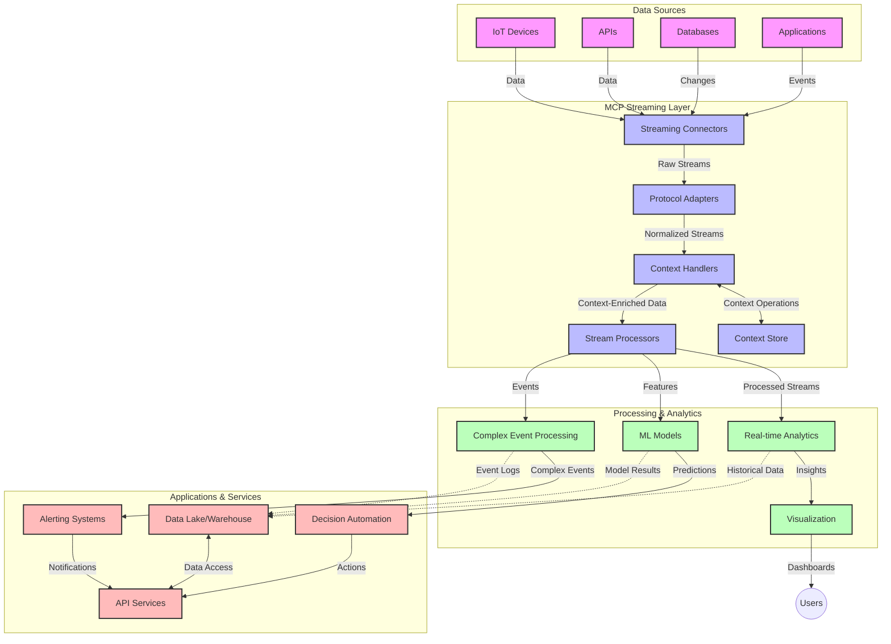

<!--
CO_OP_TRANSLATOR_METADATA:
{
  "original_hash": "68c518dbff8a3b127ed2aa934054c56c",
  "translation_date": "2025-06-11T17:04:36+00:00",
  "source_file": "05-AdvancedTopics/mcp-realtimestreaming/README.md",
  "language_code": "hi"
}
-->
# Model Context Protocol for Real-Time Data Streaming

## अवलोकन

आज के डेटा-चालित युग में, जहां व्यवसायों और अनुप्रयोगों को त्वरित निर्णय लेने के लिए तुरंत जानकारी की आवश्यकता होती है, रियल-टाइम डेटा स्ट्रीमिंग अनिवार्य हो गया है। Model Context Protocol (MCP) इन रियल-टाइम स्ट्रीमिंग प्रक्रियाओं को बेहतर बनाने में एक महत्वपूर्ण प्रगति है, जो डेटा प्रोसेसिंग की दक्षता बढ़ाता है, संदर्भ की अखंडता बनाए रखता है, और समग्र सिस्टम प्रदर्शन को सुधारता है।

यह मॉड्यूल बताता है कि MCP कैसे AI मॉडल, स्ट्रीमिंग प्लेटफॉर्म, और अनुप्रयोगों के बीच संदर्भ प्रबंधन के लिए एक मानकीकृत दृष्टिकोण प्रदान करके रियल-टाइम डेटा स्ट्रीमिंग को बदलता है।

## रियल-टाइम डेटा स्ट्रीमिंग का परिचय

रियल-टाइम डेटा स्ट्रीमिंग एक तकनीकी दृष्टिकोण है जो डेटा के निरंतर प्रवाह, प्रोसेसिंग, और विश्लेषण को सक्षम बनाता है जैसे ही वह उत्पन्न होता है, जिससे सिस्टम नई जानकारी पर तुरंत प्रतिक्रिया दे सकते हैं। पारंपरिक बैच प्रोसेसिंग के विपरीत, जो स्थिर डेटा सेट पर काम करता है, स्ट्रीमिंग डेटा को चलते-फिरते प्रोसेस करता है, न्यूनतम विलंबता के साथ अंतर्दृष्टि और कार्रवाई प्रदान करता है।

### रियल-टाइम डेटा स्ट्रीमिंग के मुख्य सिद्धांत:

- **निरंतर डेटा प्रवाह**: डेटा को घटनाओं या रिकॉर्ड्स की एक लगातार, कभी न खत्म होने वाली धारा के रूप में प्रोसेस किया जाता है।
- **कम विलंबता प्रोसेसिंग**: सिस्टम डेटा उत्पन्न होने और प्रोसेसिंग के बीच समय को न्यूनतम करने के लिए डिज़ाइन किए जाते हैं।
- **स्केलेबिलिटी**: स्ट्रीमिंग आर्किटेक्चर को विभिन्न डेटा मात्रा और गति को संभालना होता है।
- **फॉल्ट टॉलरेंस**: सिस्टम को विफलताओं के खिलाफ मजबूत होना चाहिए ताकि डेटा प्रवाह निरंतर बना रहे।
- **स्टेटफुल प्रोसेसिंग**: घटनाओं के बीच संदर्भ बनाए रखना सार्थक विश्लेषण के लिए आवश्यक है।

### Model Context Protocol और रियल-टाइम स्ट्रीमिंग

Model Context Protocol (MCP) रियल-टाइम स्ट्रीमिंग परिवेश में कई महत्वपूर्ण चुनौतियों का समाधान करता है:

1. **संदर्भ की निरंतरता**: MCP वितरित स्ट्रीमिंग घटकों में संदर्भ को मानकीकृत करता है, जिससे AI मॉडल और प्रोसेसिंग नोड्स को प्रासंगिक ऐतिहासिक और पर्यावरणीय संदर्भ तक पहुंच मिलती है।

2. **प्रभावी स्टेट प्रबंधन**: संदर्भ संचार के लिए संरचित तंत्र प्रदान करके, MCP स्ट्रीमिंग पाइपलाइनों में स्टेट प्रबंधन के ओवरहेड को कम करता है।

3. **इंटरऑपरेबिलिटी**: MCP विभिन्न स्ट्रीमिंग तकनीकों और AI मॉडलों के बीच संदर्भ साझा करने के लिए एक सामान्य भाषा बनाता है, जिससे अधिक लचीली और विस्तारित आर्किटेक्चर संभव होते हैं।

4. **स्ट्रीमिंग-अनुकूलित संदर्भ**: MCP कार्यान्वयन यह प्राथमिकता दे सकते हैं कि कौन से संदर्भ तत्व रियल-टाइम निर्णय लेने के लिए सबसे प्रासंगिक हैं, प्रदर्शन और सटीकता दोनों के लिए अनुकूलित।

5. **अनुकूलनशील प्रोसेसिंग**: MCP के माध्यम से उचित संदर्भ प्रबंधन के साथ, स्ट्रीमिंग सिस्टम डेटा में बदलती परिस्थितियों और पैटर्न के आधार पर प्रोसेसिंग को गतिशील रूप से समायोजित कर सकते हैं।

आधुनिक अनुप्रयोगों में, जैसे IoT सेंसर नेटवर्क से लेकर वित्तीय ट्रेडिंग प्लेटफॉर्म तक, MCP का स्ट्रीमिंग तकनीकों के साथ एकीकरण अधिक बुद्धिमान, संदर्भ-सचेत प्रोसेसिंग को सक्षम बनाता है जो जटिल, विकसित होती परिस्थितियों में उपयुक्त प्रतिक्रिया दे सकता है।

## सीखने के उद्देश्य

इस पाठ के अंत तक, आप सक्षम होंगे:

- रियल-टाइम डेटा स्ट्रीमिंग के मूल सिद्धांतों और उसकी चुनौतियों को समझना
- समझाना कि Model Context Protocol (MCP) कैसे रियल-टाइम डेटा स्ट्रीमिंग को बेहतर बनाता है
- लोकप्रिय फ्रेमवर्क जैसे Kafka और Pulsar का उपयोग करके MCP-आधारित स्ट्रीमिंग समाधान लागू करना
- MCP के साथ फॉल्ट-टॉलरेंट, उच्च-प्रदर्शन स्ट्रीमिंग आर्किटेक्चर डिजाइन और तैनात करना
- MCP अवधारणाओं को IoT, वित्तीय ट्रेडिंग, और AI-संचालित एनालिटिक्स उपयोग मामलों में लागू करना
- MCP-आधारित स्ट्रीमिंग तकनीकों में उभरते रुझानों और भविष्य की नवाचारों का मूल्यांकन करना

### परिभाषा और महत्व

रियल-टाइम डेटा स्ट्रीमिंग में न्यूनतम विलंबता के साथ डेटा का निरंतर उत्पादन, प्रोसेसिंग, और डिलीवरी शामिल है। जहां बैच प्रोसेसिंग में डेटा को समूहों में इकट्ठा कर प्रोसेस किया जाता है, वहीं स्ट्रीमिंग डेटा को आते ही क्रमिक रूप से प्रोसेस करता है, जिससे तुरंत अंतर्दृष्टि और कार्रवाई संभव होती है।

रियल-टाइम डेटा स्ट्रीमिंग की मुख्य विशेषताएं:

- **कम विलंबता**: मिलीसेकंड से सेकंड के भीतर डेटा प्रोसेसिंग और विश्लेषण
- **निरंतर प्रवाह**: विभिन्न स्रोतों से बिना रुके डेटा की धारा
- **तत्काल प्रोसेसिंग**: डेटा को बैच में नहीं, आते ही विश्लेषित करना
- **इवेंट-ड्रिवन आर्किटेक्चर**: घटनाओं के होते ही प्रतिक्रिया देना

### पारंपरिक डेटा स्ट्रीमिंग की चुनौतियां

पारंपरिक डेटा स्ट्रीमिंग विधियों को कई सीमाओं का सामना करना पड़ता है:

1. **संदर्भ हानि**: वितरित सिस्टम में संदर्भ बनाए रखने में कठिनाई
2. **स्केलेबिलिटी समस्याएं**: उच्च मात्रा और गति वाले डेटा को संभालने में चुनौतियां
3. **इंटीग्रेशन जटिलता**: विभिन्न सिस्टमों के बीच इंटरऑपरेबिलिटी की समस्याएं
4. **विलंबता प्रबंधन**: थ्रूपुट और प्रोसेसिंग समय के बीच संतुलन
5. **डेटा स्थिरता**: पूरे स्ट्रीम में डेटा की सटीकता और पूर्णता सुनिश्चित करना

## Model Context Protocol (MCP) को समझना

### MCP क्या है?

Model Context Protocol (MCP) एक मानकीकृत संचार प्रोटोकॉल है जो AI मॉडल और अनुप्रयोगों के बीच कुशल इंटरैक्शन को सक्षम बनाता है। रियल-टाइम डेटा स्ट्रीमिंग के संदर्भ में, MCP निम्नलिखित के लिए एक फ्रेमवर्क प्रदान करता है:

- डेटा पाइपलाइन के दौरान संदर्भ का संरक्षण
- डेटा एक्सचेंज प्रारूपों का मानकीकरण
- बड़े डेटा सेट के संचार का अनुकूलन
- मॉडल-से-मॉडल और मॉडल-से-एप्लिकेशन संचार को बेहतर बनाना

### मुख्य घटक और आर्किटेक्चर

रियल-टाइम स्ट्रीमिंग के लिए MCP आर्किटेक्चर में कई प्रमुख घटक शामिल हैं:

1. **Context Handlers**: स्ट्रीमिंग पाइपलाइन में संदर्भ जानकारी का प्रबंधन और रखरखाव करते हैं
2. **Stream Processors**: संदर्भ-सचेत तकनीकों का उपयोग करके आने वाली डेटा स्ट्रीम को प्रोसेस करते हैं
3. **Protocol Adapters**: विभिन्न स्ट्रीमिंग प्रोटोकॉल के बीच संदर्भ को बनाए रखते हुए रूपांतरण करते हैं
4. **Context Store**: संदर्भ जानकारी को प्रभावी ढंग से संग्रहीत और पुनः प्राप्त करता है
5. **Streaming Connectors**: विभिन्न स्ट्रीमिंग प्लेटफॉर्म (Kafka, Pulsar, Kinesis, आदि) से कनेक्ट करते हैं



### MCP रियल-टाइम डेटा हैंडलिंग को कैसे बेहतर बनाता है

MCP पारंपरिक स्ट्रीमिंग चुनौतियों का समाधान करता है:

- **संदर्भ की अखंडता**: पूरे पाइपलाइन में डेटा पॉइंट्स के बीच संबंध बनाए रखना
- **अनुकूलित संचार**: बुद्धिमान संदर्भ प्रबंधन के जरिए डेटा एक्सचेंज में पुनरावृत्ति कम करना
- **मानकीकृत इंटरफेस**: स्ट्रीमिंग घटकों के लिए सुसंगत API प्रदान करना
- **कम विलंबता**: प्रभावी संदर्भ प्रबंधन के जरिए प्रोसेसिंग ओवरहेड कम करना
- **बेहतर स्केलेबिलिटी**: संदर्भ बनाए रखते हुए हॉरिजॉन्टल स्केलिंग का समर्थन

## एकीकरण और कार्यान्वयन

रियल-टाइम डेटा स्ट्रीमिंग सिस्टम को प्रदर्शन और संदर्भ अखंडता दोनों बनाए रखने के लिए सावधानीपूर्वक आर्किटेक्चरल डिज़ाइन और कार्यान्वयन की आवश्यकता होती है। Model Context Protocol AI मॉडल और स्ट्रीमिंग तकनीकों को एकीकृत करने के लिए एक मानकीकृत दृष्टिकोण प्रदान करता है, जिससे अधिक परिष्कृत, संदर्भ-सचेत प्रोसेसिंग पाइपलाइनों का निर्माण संभव होता है।

### स्ट्रीमिंग आर्किटेक्चर में MCP एकीकरण का अवलोकन

रियल-टाइम स्ट्रीमिंग वातावरण में MCP को लागू करने के लिए कुछ मुख्य विचार हैं:

1. **संदर्भ सीरियलाइज़ेशन और ट्रांसपोर्ट**: MCP स्ट्रीमिंग डेटा पैकेट्स के भीतर संदर्भ जानकारी को कुशलतापूर्वक एन्कोड करने के लिए तंत्र प्रदान करता है, यह सुनिश्चित करते हुए कि आवश्यक संदर्भ डेटा के साथ पूरे प्रोसेसिंग पाइपलाइन में चलता रहे। इसमें स्ट्रीमिंग ट्रांसपोर्ट के लिए अनुकूलित मानकीकृत सीरियलाइज़ेशन प्रारूप शामिल हैं।

2. **स्टेटफुल स्ट्रीम प्रोसेसिंग**: MCP प्रोसेसिंग नोड्स के बीच स्थिर संदर्भ प्रतिनिधित्व बनाए रखकर अधिक बुद्धिमान स्टेटफुल प्रोसेसिंग सक्षम करता है। यह विशेष रूप से वितरित स्ट्रीमिंग आर्किटेक्चर में मूल्यवान है जहां स्टेट प्रबंधन पारंपरिक रूप से चुनौतीपूर्ण होता है।

3. **इवेंट-टाइम बनाम प्रोसेसिंग-टाइम**: स्ट्रीमिंग सिस्टम में आम चुनौती होती है कि घटनाएं कब हुईं और कब प्रोसेस की गईं, MCP कार्यान्वयन इस अंतर को संबोधित कर सकते हैं। प्रोटोकॉल ऐसा समय संदर्भ शामिल कर सकता है जो इवेंट टाइम सेमांटिक्स को संरक्षित करता है।

4. **बैकप्रेशर प्रबंधन**: संदर्भ हैंडलिंग को मानकीकृत करके, MCP स्ट्रीमिंग सिस्टम में बैकप्रेशर प्रबंधन में मदद करता है, जिससे घटक अपनी प्रोसेसिंग क्षमताओं को संप्रेषित कर सकते हैं और प्रवाह को समायोजित कर सकते हैं।

5. **संदर्भ विंडोइंग और एग्रीगेशन**: MCP अधिक परिष्कृत विंडोइंग ऑपरेशनों को सक्षम बनाता है, समय और संबंध संदर्भों के संरचित प्रतिनिधित्व प्रदान करके, जिससे इवेंट स्ट्रीम्स में अधिक सार्थक समेकन संभव होता है।

6. **एक्सैक्टली-वन प्रोसेसिंग**: ऐसे स्ट्रीमिंग सिस्टम्स में जहां एक्सैक्टली-वन सेमांटिक्स आवश्यक होती है, MCP प्रोसेसिंग मेटाडेटा को शामिल कर सकता है ताकि वितरित घटकों के बीच प्रोसेसिंग स्थिति को ट्रैक और सत्यापित किया जा सके।

विभिन्न स्ट्रीमिंग तकनीकों में MCP के कार्यान्वयन से संदर्भ प्रबंधन के लिए एकीकृत दृष्टिकोण बनता है, जिससे कस्टम इंटीग्रेशन कोड की आवश्यकता कम होती है और सिस्टम की क्षमता बढ़ती है कि डेटा पाइपलाइन में संदर्भ को अर्थपूर्ण बनाए रखा जा सके।

### विभिन्न डेटा स्ट्रीमिंग फ्रेमवर्क्स में MCP

MCP लोकप्रिय स्ट्रीमिंग फ्रेमवर्क्स के साथ एकीकृत किया जा सकता है, जिनमें शामिल हैं:

#### Apache Kafka एकीकरण

```python
from mcp_streaming import MCPKafkaConnector

# Initialize MCP Kafka connector
connector = MCPKafkaConnector(
    bootstrap_servers='localhost:9092',
    context_preservation=True
)

# Create a context-aware consumer
consumer = connector.create_consumer('input-topic')

# Process streaming data with context
for message in consumer:
    context = message.get_context()
    data = message.get_value()
    
    # Process with context awareness
    result = process_with_context(data, context)
    
    # Produce output with preserved context
    connector.produce('output-topic', result, context=context)
```

#### Apache Pulsar कार्यान्वयन

```python
from mcp_streaming import MCPPulsarClient

# Initialize MCP Pulsar client
client = MCPPulsarClient('pulsar://localhost:6650')

# Subscribe with context awareness
consumer = client.subscribe('input-topic', 'subscription-name', 
                           context_enabled=True)

# Process messages with context preservation
while True:
    message = consumer.receive()
    context = message.get_context()
    
    # Process with context
    result = process_with_context(message.data(), context)
    
    # Acknowledge the message
    consumer.acknowledge(message)
    
    # Send result with preserved context
    producer = client.create_producer('output-topic')
    producer.send(result, context=context)
```

### तैनाती के लिए सर्वोत्तम प्रथाएं

जब MCP को रियल-टाइम स्ट्रीमिंग के लिए लागू करें:

1. **फॉल्ट टॉलरेंस के लिए डिज़ाइन करें**:
   - उचित त्रुटि प्रबंधन लागू करें
   - असफल संदेशों के लिए डेड-लेटर कतारों का उपयोग करें
   - इडेम्पोटेंट प्रोसेसर डिजाइन करें

2. **प्रदर्शन के लिए अनुकूलित करें**:
   - उपयुक्त बफर आकार कॉन्फ़िगर करें
   - जहां आवश्यक हो, बैचिंग का उपयोग करें
   - बैकप्रेशर तंत्र लागू करें

3. **निगरानी और अवलोकन करें**:
   - स्ट्रीम प्रोसेसिंग मेट्रिक्स ट्रैक करें
   - संदर्भ प्रसार की निगरानी करें
   - असामान्यताओं के लिए अलर्ट सेट करें

4. **अपने स्ट्रीम्स को सुरक्षित करें**:
   - संवेदनशील डेटा के लिए एन्क्रिप्शन लागू करें
   - प्रमाणीकरण और प्राधिकरण का उपयोग करें
   - उचित एक्सेस नियंत्रण लागू करें

### IoT और एज कंप्यूटिंग में MCP

MCP IoT स्ट्रीमिंग को बेहतर बनाता है:

- प्रोसेसिंग पाइपलाइन में डिवाइस संदर्भ को संरक्षित करना
- एज से क्लाउड तक कुशल डेटा स्ट्रीमिंग सक्षम करना
- IoT डेटा स्ट्रीम्स पर रियल-टाइम एनालिटिक्स का समर्थन करना
- संदर्भ के साथ डिवाइस-से-डिवाइस संचार को सुविधाजनक बनाना

उदाहरण: स्मार्ट सिटी सेंसर नेटवर्क  
```
Sensors → Edge Gateways → MCP Stream Processors → Real-time Analytics → Automated Responses
```

### वित्तीय लेनदेन और हाई-फ्रीक्वेंसी ट्रेडिंग में भूमिका

MCP वित्तीय डेटा स्ट्रीमिंग के लिए महत्वपूर्ण लाभ प्रदान करता है:

- ट्रेडिंग निर्णयों के लिए अल्ट्रा-लो विलंबता प्रोसेसिंग
- प्रोसेसिंग के दौरान लेनदेन संदर्भ बनाए रखना
- संदर्भ जागरूकता के साथ जटिल इवेंट प्रोसेसिंग का समर्थन
- वितरित ट्रेडिंग सिस्टम्स में डेटा स्थिरता सुनिश्चित करना

### AI-संचालित डेटा एनालिटिक्स को बढ़ावा देना

MCP स्ट्रीमिंग एनालिटिक्स के लिए नई संभावनाएं बनाता है:

- रियल-टाइम मॉडल प्रशिक्षण और अनुमान
- स्ट्रीमिंग डेटा से सतत सीखना
- संदर्भ-सचेत फीचर एक्सट्रैक्शन
- संदर्भ संरक्षित मल्टी-मॉडल अनुमान पाइपलाइनों का निर्माण

## भविष्य के रुझान और नवाचार

### रियल-टाइम परिवेश में MCP का विकास

आगे देखते हुए, हम अपेक्षा करते हैं कि MCP निम्नलिखित को संबोधित करने के लिए विकसित होगा:

- **क्वांटम कंप्यूटिंग एकीकरण**: क्वांटम-आधारित स्ट्रीमिंग सिस्टम के लिए तैयारी
- **एज-नेटिव प्रोसेसिंग**: अधिक संदर्भ-सचेत प्रोसेसिंग एज डिवाइसों पर स्थानांतरित करना
- **स्वायत्त स्ट्रीम प्रबंधन**: स्व-ऑप्टिमाइज़िंग स्ट्रीमिंग पाइपलाइंस
- **फेडेरेटेड स्ट्रीमिंग**: गोपनीयता बनाए रखते हुए वितरित प्रोसेसिंग

### तकनीकी उन्नतियां

MCP स्ट्रीमिंग के भविष्य को आकार देने वाली उभरती तकनीकें:

1. **AI-अनुकूलित स्ट्रीमिंग प्रोटोकॉल**: AI वर्कलोड के लिए विशेष रूप से डिज़ाइन किए गए कस्टम प्रोटोकॉल
2. **न्यूरोमॉर्फिक कंप्यूटिंग एकीकरण**: ब्रेन-प्रेरित कंप्यूटिंग स्ट्रीम प्रोसेसिंग के लिए
3. **सर्वरलेस स्ट्रीमिंग**: इन्फ्रास्ट्रक्चर प्रबंधन के बिना इवेंट-ड्रिवन, स्केलेबल स्ट्रीमिंग
4. **वितरित संदर्भ स्टोर**: विश्वव्यापी रूप से वितरित फिर भी अत्यधिक सुसंगत संदर्भ प्रबंधन

## व्यावहारिक अभ्यास

### अभ्यास 1: एक बुनियादी MCP स्ट्रीमिंग पाइपलाइन सेटअप करना

इस अभ्यास में, आप सीखेंगे कि कैसे:

- एक बुनियादी MCP स्ट्रीमिंग वातावरण कॉन्फ़िगर करें
- स्ट्रीम प्रोसेसिंग के लिए संदर्भ हैंडलर्स लागू करें
- संदर्भ संरक्षण का परीक्षण और सत्यापन करें

### अभ्यास 2: एक रियल-टाइम एनालिटिक्स डैशबोर्ड बनाना

एक पूर्ण एप्लिकेशन बनाएं जो:

- MCP का उपयोग करके स्ट्रीमिंग डेटा प्राप्त करता है
- संदर्भ बनाए रखते हुए स्ट्रीम को प्रोसेस करता है
- परिणामों को रियल-टाइम में विज़ुअलाइज़ करता है

### अभ्यास 3: MCP के साथ जटिल इवेंट प्रोसेसिंग लागू करना

उन्नत अभ्यास जिसमें शामिल हैं:

- स्ट्रीम्स में पैटर्न डिटेक्शन
- कई स्ट्रीम्स में संदर्भगत सहसंबंध
- संरक्षित संदर्भ के साथ जटिल घटनाओं का निर्माण

## अतिरिक्त संसाधन

- [Model Context Protocol Specification](https://github.com/microsoft/model-context-protocol) - आधिकारिक MCP विनिर्देशन और दस्तावेज़ीकरण
- [Apache Kafka Documentation](https://kafka.apache.org/documentation/) - स्ट्रीम प्रोसेसिंग के लिए Kafka सीखें
- [Apache Pulsar](https://pulsar.apache.org/) - एकीकृत मैसेजिंग और स्ट्रीमिंग प्लेटफॉर्म
- [Streaming Systems: The What, Where, When, and How of Large-Scale Data Processing](https://www.oreilly.com/library/view/streaming-systems/9781491983867/) - स्ट्रीमिंग आर्किटेक्चर पर व्यापक पुस्तक
- [Microsoft Azure Event Hubs](https

**अस्वीकरण**:  
यह दस्तावेज़ AI अनुवाद सेवा [Co-op Translator](https://github.com/Azure/co-op-translator) का उपयोग करके अनुवादित किया गया है। जबकि हम सटीकता के लिए प्रयासरत हैं, कृपया ध्यान दें कि स्वचालित अनुवादों में त्रुटियाँ या गलतियाँ हो सकती हैं। मूल दस्तावेज़ अपनी मूल भाषा में ही अधिकारिक स्रोत माना जाना चाहिए। महत्वपूर्ण जानकारी के लिए, पेशेवर मानव अनुवाद की सलाह दी जाती है। इस अनुवाद के उपयोग से उत्पन्न किसी भी गलतफहमी या गलत व्याख्या के लिए हम जिम्मेदार नहीं हैं।