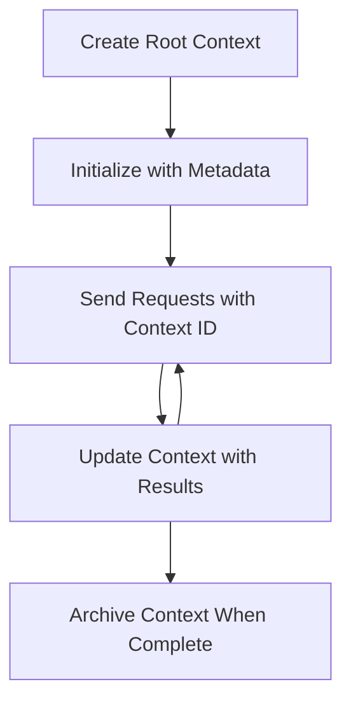

<!--
CO_OP_TRANSLATOR_METADATA:
{
  "original_hash": "ebdb86db46113f1cbd59ce4c74caaa79",
  "translation_date": "2025-07-16T22:48:14+00:00",
  "source_file": "05-AdvancedTopics/mcp-root-contexts/README.md",
  "language_code": "hi"
}
-->
# MCP रूट कॉन्टेक्स्ट्स

रूट कॉन्टेक्स्ट्स मॉडल कॉन्टेक्स्ट प्रोटोकॉल में एक मूलभूत अवधारणा हैं जो कई अनुरोधों और सत्रों के बीच बातचीत के इतिहास और साझा स्थिति को बनाए रखने के लिए एक स्थायी परत प्रदान करते हैं।

## परिचय

इस पाठ में, हम MCP में रूट कॉन्टेक्स्ट्स को कैसे बनाएं, प्रबंधित करें और उपयोग करें, इस पर चर्चा करेंगे।

## सीखने के उद्देश्य

इस पाठ के अंत तक, आप सक्षम होंगे:

- रूट कॉन्टेक्स्ट्स के उद्देश्य और संरचना को समझना
- MCP क्लाइंट लाइब्रेरीज़ का उपयोग करके रूट कॉन्टेक्स्ट्स बनाना और प्रबंधित करना
- .NET, Java, JavaScript, और Python एप्लिकेशन में रूट कॉन्टेक्स्ट्स को लागू करना
- मल्टी-टर्न बातचीत और स्थिति प्रबंधन के लिए रूट कॉन्टेक्स्ट्स का उपयोग करना
- रूट कॉन्टेक्स्ट प्रबंधन के लिए सर्वोत्तम प्रथाओं को लागू करना

## रूट कॉन्टेक्स्ट्स को समझना

रूट कॉन्टेक्स्ट्स कंटेनर के रूप में कार्य करते हैं जो संबंधित इंटरैक्शनों की एक श्रृंखला के लिए इतिहास और स्थिति को रखते हैं। ये सक्षम करते हैं:

- **बातचीत की निरंतरता**: संगत मल्टी-टर्न बातचीत बनाए रखना
- **मेमोरी प्रबंधन**: इंटरैक्शनों के बीच जानकारी संग्रहीत और पुनः प्राप्त करना
- **स्थिति प्रबंधन**: जटिल वर्कफ़्लोज़ में प्रगति को ट्रैक करना
- **कॉन्टेक्स्ट साझा करना**: कई क्लाइंट्स को एक ही बातचीत की स्थिति तक पहुंचने देना

MCP में, रूट कॉन्टेक्स्ट्स की ये मुख्य विशेषताएं होती हैं:

- प्रत्येक रूट कॉन्टेक्स्ट का एक अद्वितीय पहचानकर्ता होता है।
- इनमें बातचीत का इतिहास, उपयोगकर्ता प्राथमिकताएं, और अन्य मेटाडेटा हो सकते हैं।
- इन्हें आवश्यकतानुसार बनाया, एक्सेस किया और संग्रहित किया जा सकता है।
- ये सूक्ष्म स्तर के एक्सेस नियंत्रण और अनुमतियों का समर्थन करते हैं।

## रूट कॉन्टेक्स्ट जीवनचक्र



## रूट कॉन्टेक्स्ट्स के साथ काम करना

यहाँ रूट कॉन्टेक्स्ट्स को बनाने और प्रबंधित करने का एक उदाहरण दिया गया है।

### C# कार्यान्वयन

```csharp
// .NET Example: Root Context Management
using Microsoft.Mcp.Client;
using System;
using System.Threading.Tasks;
using System.Collections.Generic;

public class RootContextExample
{
    private readonly IMcpClient _client;
    private readonly IRootContextManager _contextManager;
    
    public RootContextExample(IMcpClient client, IRootContextManager contextManager)
    {
        _client = client;
        _contextManager = contextManager;
    }
    
    public async Task DemonstrateRootContextAsync()
    {
        // 1. Create a new root context
        var contextResult = await _contextManager.CreateRootContextAsync(new RootContextCreateOptions
        {
            Name = "Customer Support Session",
            Metadata = new Dictionary<string, string>
            {
                ["CustomerName"] = "Acme Corporation",
                ["PriorityLevel"] = "High",
                ["Domain"] = "Cloud Services"
            }
        });
        
        string contextId = contextResult.ContextId;
        Console.WriteLine($"Created root context with ID: {contextId}");
        
        // 2. First interaction using the context
        var response1 = await _client.SendPromptAsync(
            "I'm having issues scaling my web service deployment in the cloud.", 
            new SendPromptOptions { RootContextId = contextId }
        );
        
        Console.WriteLine($"First response: {response1.GeneratedText}");
        
        // Second interaction - the model will have access to the previous conversation
        var response2 = await _client.SendPromptAsync(
            "Yes, we're using containerized deployments with Kubernetes.", 
            new SendPromptOptions { RootContextId = contextId }
        );
        
        Console.WriteLine($"Second response: {response2.GeneratedText}");
        
        // 3. Add metadata to the context based on conversation
        await _contextManager.UpdateContextMetadataAsync(contextId, new Dictionary<string, string>
        {
            ["TechnicalEnvironment"] = "Kubernetes",
            ["IssueType"] = "Scaling"
        });
        
        // 4. Get context information
        var contextInfo = await _contextManager.GetRootContextInfoAsync(contextId);
        
        Console.WriteLine("Context Information:");
        Console.WriteLine($"- Name: {contextInfo.Name}");
        Console.WriteLine($"- Created: {contextInfo.CreatedAt}");
        Console.WriteLine($"- Messages: {contextInfo.MessageCount}");
        
        // 5. When the conversation is complete, archive the context
        await _contextManager.ArchiveRootContextAsync(contextId);
        Console.WriteLine($"Archived context {contextId}");
    }
}
```

पिछले कोड में हमने:

1. ग्राहक सहायता सत्र के लिए एक रूट कॉन्टेक्स्ट बनाया।
2. उस कॉन्टेक्स्ट के भीतर कई संदेश भेजे, जिससे मॉडल स्थिति बनाए रख सके।
3. बातचीत के आधार पर प्रासंगिक मेटाडेटा के साथ कॉन्टेक्स्ट को अपडेट किया।
4. बातचीत के इतिहास को समझने के लिए कॉन्टेक्स्ट जानकारी प्राप्त की।
5. बातचीत पूरी होने पर कॉन्टेक्स्ट को संग्रहित किया।

## उदाहरण: वित्तीय विश्लेषण के लिए रूट कॉन्टेक्स्ट कार्यान्वयन

इस उदाहरण में, हम एक वित्तीय विश्लेषण सत्र के लिए रूट कॉन्टेक्स्ट बनाएंगे, जो कई इंटरैक्शनों के बीच स्थिति बनाए रखने का तरीका दिखाएगा।

### Java कार्यान्वयन

```java
// Java Example: Root Context Implementation
package com.example.mcp.contexts;

import com.mcp.client.McpClient;
import com.mcp.client.ContextManager;
import com.mcp.models.RootContext;
import com.mcp.models.McpResponse;

import java.util.HashMap;
import java.util.Map;
import java.util.UUID;

public class RootContextsDemo {
    private final McpClient client;
    private final ContextManager contextManager;
    
    public RootContextsDemo(String serverUrl) {
        this.client = new McpClient.Builder()
            .setServerUrl(serverUrl)
            .build();
            
        this.contextManager = new ContextManager(client);
    }
    
    public void demonstrateRootContext() throws Exception {
        // Create context metadata
        Map<String, String> metadata = new HashMap<>();
        metadata.put("projectName", "Financial Analysis");
        metadata.put("userRole", "Financial Analyst");
        metadata.put("dataSource", "Q1 2025 Financial Reports");
        
        // 1. Create a new root context
        RootContext context = contextManager.createRootContext("Financial Analysis Session", metadata);
        String contextId = context.getId();
        
        System.out.println("Created context: " + contextId);
        
        // 2. First interaction
        McpResponse response1 = client.sendPrompt(
            "Analyze the trends in Q1 financial data for our technology division",
            contextId
        );
        
        System.out.println("First response: " + response1.getGeneratedText());
        
        // 3. Update context with important information gained from response
        contextManager.addContextMetadata(contextId, 
            Map.of("identifiedTrend", "Increasing cloud infrastructure costs"));
        
        // Second interaction - using the same context
        McpResponse response2 = client.sendPrompt(
            "What's driving the increase in cloud infrastructure costs?",
            contextId
        );
        
        System.out.println("Second response: " + response2.getGeneratedText());
        
        // 4. Generate a summary of the analysis session
        McpResponse summaryResponse = client.sendPrompt(
            "Summarize our analysis of the technology division financials in 3-5 key points",
            contextId
        );
        
        // Store the summary in context metadata
        contextManager.addContextMetadata(contextId, 
            Map.of("analysisSummary", summaryResponse.getGeneratedText()));
            
        // Get updated context information
        RootContext updatedContext = contextManager.getRootContext(contextId);
        
        System.out.println("Context Information:");
        System.out.println("- Created: " + updatedContext.getCreatedAt());
        System.out.println("- Last Updated: " + updatedContext.getLastUpdatedAt());
        System.out.println("- Analysis Summary: " + 
            updatedContext.getMetadata().get("analysisSummary"));
            
        // 5. Archive context when done
        contextManager.archiveContext(contextId);
        System.out.println("Context archived");
    }
}
```

पिछले कोड में हमने:

1. वित्तीय विश्लेषण सत्र के लिए एक रूट कॉन्टेक्स्ट बनाया।
2. उस कॉन्टेक्स्ट के भीतर कई संदेश भेजे, जिससे मॉडल स्थिति बनाए रख सके।
3. बातचीत के आधार पर प्रासंगिक मेटाडेटा के साथ कॉन्टेक्स्ट को अपडेट किया।
4. विश्लेषण सत्र का सारांश बनाया और उसे कॉन्टेक्स्ट मेटाडेटा में संग्रहीत किया।
5. बातचीत पूरी होने पर कॉन्टेक्स्ट को संग्रहित किया।

## उदाहरण: रूट कॉन्टेक्स्ट प्रबंधन

रूट कॉन्टेक्स्ट्स का प्रभावी प्रबंधन बातचीत के इतिहास और स्थिति को बनाए रखने के लिए महत्वपूर्ण है। नीचे रूट कॉन्टेक्स्ट प्रबंधन को लागू करने का एक उदाहरण दिया गया है।

### JavaScript कार्यान्वयन

```javascript
// JavaScript Example: Managing MCP Root Contexts
const { McpClient, RootContextManager } = require('@mcp/client');

class ContextSession {
  constructor(serverUrl, apiKey = null) {
    // Initialize the MCP client
    this.client = new McpClient({
      serverUrl,
      apiKey
    });
    
    // Initialize context manager
    this.contextManager = new RootContextManager(this.client);
  }
  
  /**
   * Create a new conversation context
   * @param {string} sessionName - Name of the conversation session
   * @param {Object} metadata - Additional metadata for the context
   * @returns {Promise<string>} - Context ID
   */
  async createConversationContext(sessionName, metadata = {}) {
    try {
      const contextResult = await this.contextManager.createRootContext({
        name: sessionName,
        metadata: {
          ...metadata,
          createdAt: new Date().toISOString(),
          status: 'active'
        }
      });
      
      console.log(`Created root context '${sessionName}' with ID: ${contextResult.id}`);
      return contextResult.id;
    } catch (error) {
      console.error('Error creating root context:', error);
      throw error;
    }
  }
  
  /**
   * Send a message in an existing context
   * @param {string} contextId - The root context ID
   * @param {string} message - The user's message
   * @param {Object} options - Additional options
   * @returns {Promise<Object>} - Response data
   */
  async sendMessage(contextId, message, options = {}) {
    try {
      // Send the message using the specified context
      const response = await this.client.sendPrompt(message, {
        rootContextId: contextId,
        temperature: options.temperature || 0.7,
        allowedTools: options.allowedTools || []
      });
      
      // Optionally store important insights from the conversation
      if (options.storeInsights) {
        await this.storeConversationInsights(contextId, message, response.generatedText);
      }
      
      return {
        message: response.generatedText,
        toolCalls: response.toolCalls || [],
        contextId
      };
    } catch (error) {
      console.error(`Error sending message in context ${contextId}:`, error);
      throw error;
    }
  }
  
  /**
   * Store important insights from a conversation
   * @param {string} contextId - The root context ID
   * @param {string} userMessage - User's message
   * @param {string} aiResponse - AI's response
   */
  async storeConversationInsights(contextId, userMessage, aiResponse) {
    try {
      // Extract potential insights (in a real app, this would be more sophisticated)
      const combinedText = userMessage + "\n" + aiResponse;
      
      // Simple heuristic to identify potential insights
      const insightWords = ["important", "key point", "remember", "significant", "crucial"];
      
      const potentialInsights = combinedText
        .split(".")
        .filter(sentence => 
          insightWords.some(word => sentence.toLowerCase().includes(word))
        )
        .map(sentence => sentence.trim())
        .filter(sentence => sentence.length > 10);
      
      // Store insights in context metadata
      if (potentialInsights.length > 0) {
        const insights = {};
        potentialInsights.forEach((insight, index) => {
          insights[`insight_${Date.now()}_${index}`] = insight;
        });
        
        await this.contextManager.updateContextMetadata(contextId, insights);
        console.log(`Stored ${potentialInsights.length} insights in context ${contextId}`);
      }
    } catch (error) {
      console.warn('Error storing conversation insights:', error);
      // Non-critical error, so just log warning
    }
  }
  
  /**
   * Get summary information about a context
   * @param {string} contextId - The root context ID
   * @returns {Promise<Object>} - Context information
   */
  async getContextInfo(contextId) {
    try {
      const contextInfo = await this.contextManager.getContextInfo(contextId);
      
      return {
        id: contextInfo.id,
        name: contextInfo.name,
        created: new Date(contextInfo.createdAt).toLocaleString(),
        lastUpdated: new Date(contextInfo.lastUpdatedAt).toLocaleString(),
        messageCount: contextInfo.messageCount,
        metadata: contextInfo.metadata,
        status: contextInfo.status
      };
    } catch (error) {
      console.error(`Error getting context info for ${contextId}:`, error);
      throw error;
    }
  }
  
  /**
   * Generate a summary of the conversation in a context
   * @param {string} contextId - The root context ID
   * @returns {Promise<string>} - Generated summary
   */
  async generateContextSummary(contextId) {
    try {
      // Ask the model to generate a summary of the conversation so far
      const response = await this.client.sendPrompt(
        "Please summarize our conversation so far in 3-4 sentences, highlighting the main points discussed.",
        { rootContextId: contextId, temperature: 0.3 }
      );
      
      // Store the summary in context metadata
      await this.contextManager.updateContextMetadata(contextId, {
        conversationSummary: response.generatedText,
        summarizedAt: new Date().toISOString()
      });
      
      return response.generatedText;
    } catch (error) {
      console.error(`Error generating context summary for ${contextId}:`, error);
      throw error;
    }
  }
  
  /**
   * Archive a context when it's no longer needed
   * @param {string} contextId - The root context ID
   * @returns {Promise<Object>} - Result of the archive operation
   */
  async archiveContext(contextId) {
    try {
      // Generate a final summary before archiving
      const summary = await this.generateContextSummary(contextId);
      
      // Archive the context
      await this.contextManager.archiveContext(contextId);
      
      return {
        status: "archived",
        contextId,
        summary
      };
    } catch (error) {
      console.error(`Error archiving context ${contextId}:`, error);
      throw error;
    }
  }
}

// Example usage
async function demonstrateContextSession() {
  const session = new ContextSession('https://mcp-server-example.com');
  
  try {
    // 1. Create a new context for a product support conversation
    const contextId = await session.createConversationContext(
      'Product Support - Database Performance',
      {
        customer: 'Globex Corporation',
        product: 'Enterprise Database',
        severity: 'Medium',
        supportAgent: 'AI Assistant'
      }
    );
    
    // 2. First message in the conversation
    const response1 = await session.sendMessage(
      contextId,
      "I'm experiencing slow query performance on our database cluster after the latest update.",
      { storeInsights: true }
    );
    console.log('Response 1:', response1.message);
    
    // Follow-up message in the same context
    const response2 = await session.sendMessage(
      contextId,
      "Yes, we've already checked the indexes and they seem to be properly configured.",
      { storeInsights: true }
    );
    console.log('Response 2:', response2.message);
    
    // 3. Get information about the context
    const contextInfo = await session.getContextInfo(contextId);
    console.log('Context Information:', contextInfo);
    
    // 4. Generate and display conversation summary
    const summary = await session.generateContextSummary(contextId);
    console.log('Conversation Summary:', summary);
    
    // 5. Archive the context when done
    const archiveResult = await session.archiveContext(contextId);
    console.log('Archive Result:', archiveResult);
    
    // 6. Handle any errors gracefully
  } catch (error) {
    console.error('Error in context session demonstration:', error);
  }
}

demonstrateContextSession();
```

पिछले कोड में हमने:

1. `createConversationContext` फ़ंक्शन के साथ उत्पाद समर्थन बातचीत के लिए एक रूट कॉन्टेक्स्ट बनाया। इस मामले में, कॉन्टेक्स्ट डेटाबेस प्रदर्शन समस्याओं के बारे में है।

2. `sendMessage` फ़ंक्शन के साथ उस कॉन्टेक्स्ट के भीतर कई संदेश भेजे, जिससे मॉडल स्थिति बनाए रख सके। भेजे गए संदेश धीमी क्वेरी प्रदर्शन और इंडेक्स कॉन्फ़िगरेशन के बारे में हैं।

3. बातचीत के आधार पर प्रासंगिक मेटाडेटा के साथ कॉन्टेक्स्ट को अपडेट किया।

4. `generateContextSummary` फ़ंक्शन के साथ बातचीत का सारांश बनाया और उसे कॉन्टेक्स्ट मेटाडेटा में संग्रहीत किया।

5. बातचीत पूरी होने पर `archiveContext` फ़ंक्शन के साथ कॉन्टेक्स्ट को संग्रहित किया।

6. त्रुटियों को सहजता से संभाला ताकि प्रणाली मजबूत बनी रहे।

## मल्टी-टर्न सहायता के लिए रूट कॉन्टेक्स्ट

इस उदाहरण में, हम एक मल्टी-टर्न सहायता सत्र के लिए रूट कॉन्टेक्स्ट बनाएंगे, जो कई इंटरैक्शनों के बीच स्थिति बनाए रखने का तरीका दिखाएगा।

### Python कार्यान्वयन

```python
# Python Example: Root Context for Multi-Turn Assistance
import asyncio
from datetime import datetime
from mcp_client import McpClient, RootContextManager

class AssistantSession:
    def __init__(self, server_url, api_key=None):
        self.client = McpClient(server_url=server_url, api_key=api_key)
        self.context_manager = RootContextManager(self.client)
    
    async def create_session(self, name, user_info=None):
        """Create a new root context for an assistant session"""
        metadata = {
            "session_type": "assistant",
            "created_at": datetime.now().isoformat(),
        }
        
        # Add user information if provided
        if user_info:
            metadata.update({f"user_{k}": v for k, v in user_info.items()})
            
        # Create the root context
        context = await self.context_manager.create_root_context(name, metadata)
        return context.id
    
    async def send_message(self, context_id, message, tools=None):
        """Send a message within a root context"""
        # Create options with context ID
        options = {
            "root_context_id": context_id
        }
        
        # Add tools if specified
        if tools:
            options["allowed_tools"] = tools
        
        # Send the prompt within the context
        response = await self.client.send_prompt(message, options)
        
        # Update context metadata with conversation progress
        await self.context_manager.update_context_metadata(
            context_id,
            {
                f"message_{datetime.now().timestamp()}": message[:50] + "...",
                "last_interaction": datetime.now().isoformat()
            }
        )
        
        return response
    
    async def get_conversation_history(self, context_id):
        """Retrieve conversation history from a context"""
        context_info = await self.context_manager.get_context_info(context_id)
        messages = await self.client.get_context_messages(context_id)
        
        return {
            "context_info": context_info,
            "messages": messages
        }
    
    async def end_session(self, context_id):
        """End an assistant session by archiving the context"""
        # Generate a summary prompt first
        summary_response = await self.client.send_prompt(
            "Please summarize our conversation and any key points or decisions made.",
            {"root_context_id": context_id}
        )
        
        # Store summary in metadata
        await self.context_manager.update_context_metadata(
            context_id,
            {
                "summary": summary_response.generated_text,
                "ended_at": datetime.now().isoformat(),
                "status": "completed"
            }
        )
        
        # Archive the context
        await self.context_manager.archive_context(context_id)
        
        return {
            "status": "completed",
            "summary": summary_response.generated_text
        }

# Example usage
async def demo_assistant_session():
    assistant = AssistantSession("https://mcp-server-example.com")
    
    # 1. Create session
    context_id = await assistant.create_session(
        "Technical Support Session",
        {"name": "Alex", "technical_level": "advanced", "product": "Cloud Services"}
    )
    print(f"Created session with context ID: {context_id}")
    
    # 2. First interaction
    response1 = await assistant.send_message(
        context_id, 
        "I'm having trouble with the auto-scaling feature in your cloud platform.",
        ["documentation_search", "diagnostic_tool"]
    )
    print(f"Response 1: {response1.generated_text}")
    
    # Second interaction in the same context
    response2 = await assistant.send_message(
        context_id,
        "Yes, I've already checked the configuration settings you mentioned, but it's still not working."
    )
    print(f"Response 2: {response2.generated_text}")
    
    # 3. Get history
    history = await assistant.get_conversation_history(context_id)
    print(f"Session has {len(history['messages'])} messages")
    
    # 4. End session
    end_result = await assistant.end_session(context_id)
    print(f"Session ended with summary: {end_result['summary']}")

if __name__ == "__main__":
    asyncio.run(demo_assistant_session())
```

पिछले कोड में हमने:

1. `create_session` फ़ंक्शन के साथ तकनीकी सहायता सत्र के लिए एक रूट कॉन्टेक्स्ट बनाया। कॉन्टेक्स्ट में उपयोगकर्ता की जानकारी जैसे नाम और तकनीकी स्तर शामिल हैं।

2. `send_message` फ़ंक्शन के साथ उस कॉन्टेक्स्ट के भीतर कई संदेश भेजे, जिससे मॉडल स्थिति बनाए रख सके। भेजे गए संदेश ऑटो-स्केलिंग फीचर की समस्याओं के बारे में हैं।

3. `get_conversation_history` फ़ंक्शन का उपयोग करके बातचीत का इतिहास प्राप्त किया, जो कॉन्टेक्स्ट जानकारी और संदेश प्रदान करता है।

4. `end_session` फ़ंक्शन के साथ सत्र समाप्त किया, कॉन्टेक्स्ट को संग्रहित किया और बातचीत के मुख्य बिंदुओं को कैप्चर करते हुए सारांश बनाया।

## रूट कॉन्टेक्स्ट सर्वोत्तम प्रथाएं

रूट कॉन्टेक्स्ट्स का प्रभावी प्रबंधन करने के लिए कुछ सर्वोत्तम प्रथाएं निम्नलिखित हैं:

- **फोकस्ड कॉन्टेक्स्ट बनाएं**: स्पष्टता बनाए रखने के लिए विभिन्न बातचीत उद्देश्यों या डोमेन के लिए अलग-अलग रूट कॉन्टेक्स्ट बनाएं।

- **समाप्ति नीतियाँ सेट करें**: संग्रहण प्रबंधन और डेटा प्रतिधारण नीतियों का पालन करने के लिए पुराने कॉन्टेक्स्ट्स को संग्रहित या हटाने के लिए नीतियाँ लागू करें।

- **प्रासंगिक मेटाडेटा संग्रहीत करें**: बातचीत के महत्वपूर्ण जानकारी को बाद में उपयोग के लिए कॉन्टेक्स्ट मेटाडेटा में स्टोर करें।

- **कॉन्टेक्स्ट IDs का सुसंगत उपयोग करें**: एक बार कॉन्टेक्स्ट बनने के बाद, सभी संबंधित अनुरोधों के लिए इसके ID का लगातार उपयोग करें ताकि निरंतरता बनी रहे।

- **सारांश बनाएं**: जब कॉन्टेक्स्ट बड़ा हो जाए, तो आवश्यक जानकारी को कैप्चर करने के लिए सारांश बनाने पर विचार करें ताकि कॉन्टेक्स्ट का आकार प्रबंधित रहे।

- **एक्सेस नियंत्रण लागू करें**: मल्टी-यूजर सिस्टम्स के लिए, बातचीत के कॉन्टेक्स्ट्स की गोपनीयता और सुरक्षा सुनिश्चित करने के लिए उचित एक्सेस नियंत्रण लागू करें।

- **कॉन्टेक्स्ट सीमाओं को संभालें**: कॉन्टेक्स्ट आकार की सीमाओं से अवगत रहें और बहुत लंबी बातचीत को संभालने के लिए रणनीतियाँ लागू करें।

- **पूरा होने पर संग्रहित करें**: बातचीत पूरी होने पर संसाधनों को मुक्त करने और बातचीत के इतिहास को संरक्षित करने के लिए कॉन्टेक्स्ट्स को संग्रहित करें।

## आगे क्या है

- [5.5 Routing](../mcp-routing/README.md)

**अस्वीकरण**:  
यह दस्तावेज़ AI अनुवाद सेवा [Co-op Translator](https://github.com/Azure/co-op-translator) का उपयोग करके अनुवादित किया गया है। जबकि हम सटीकता के लिए प्रयासरत हैं, कृपया ध्यान दें कि स्वचालित अनुवादों में त्रुटियाँ या अशुद्धियाँ हो सकती हैं। मूल दस्तावेज़ अपनी मूल भाषा में ही अधिकारिक स्रोत माना जाना चाहिए। महत्वपूर्ण जानकारी के लिए, पेशेवर मानव अनुवाद की सलाह दी जाती है। इस अनुवाद के उपयोग से उत्पन्न किसी भी गलतफहमी या गलत व्याख्या के लिए हम जिम्मेदार नहीं हैं।