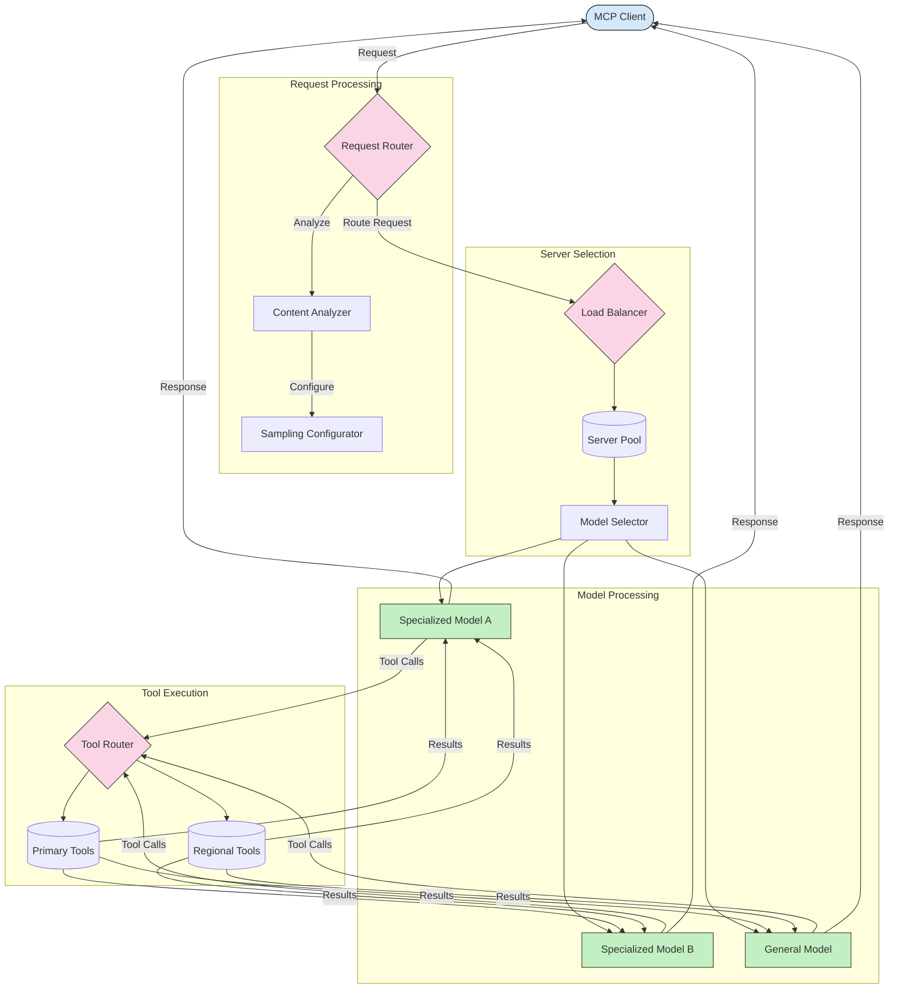

<!--
CO_OP_TRANSLATOR_METADATA:
{
  "original_hash": "2f1b473818b5a6cc9a9bbf777fffa6d4",
  "translation_date": "2025-07-14T21:45:56+00:00",
  "source_file": "05-AdvancedTopics/mcp-routing/README.md",
  "language_code": "hi"
}
-->
## MCP में सैंपलिंग और रूटिंग आर्किटेक्चर

सैंपलिंग मॉडल कॉन्टेक्स्ट प्रोटोकॉल (MCP) का एक महत्वपूर्ण हिस्सा है जो कुशल अनुरोध प्रसंस्करण और रूटिंग की अनुमति देता है। इसमें आने वाले अनुरोधों का विश्लेषण करना शामिल है ताकि विभिन्न मानदंडों जैसे सामग्री का प्रकार, उपयोगकर्ता संदर्भ, और सिस्टम लोड के आधार पर सबसे उपयुक्त मॉडल या सेवा निर्धारित की जा सके।

सैंपलिंग और रूटिंग को मिलाकर एक मजबूत आर्किटेक्चर बनाया जा सकता है जो संसाधनों के उपयोग को अनुकूलित करता है और उच्च उपलब्धता सुनिश्चित करता है। सैंपलिंग प्रक्रिया का उपयोग अनुरोधों को वर्गीकृत करने के लिए किया जा सकता है, जबकि रूटिंग उन्हें उपयुक्त मॉडल या सेवाओं की ओर निर्देशित करता है।

नीचे दिया गया आरेख दिखाता है कि कैसे सैंपलिंग और रूटिंग मिलकर एक व्यापक MCP आर्किटेक्चर में काम करते हैं:

## आगे क्या है

- [5.6 Sampling](../mcp-sampling/README.md)

**अस्वीकरण**:  
यह दस्तावेज़ AI अनुवाद सेवा [Co-op Translator](https://github.com/Azure/co-op-translator) का उपयोग करके अनुवादित किया गया है। जबकि हम सटीकता के लिए प्रयासरत हैं, कृपया ध्यान दें कि स्वचालित अनुवादों में त्रुटियाँ या अशुद्धियाँ हो सकती हैं। मूल दस्तावेज़ अपनी मूल भाषा में ही अधिकारिक स्रोत माना जाना चाहिए। महत्वपूर्ण जानकारी के लिए, पेशेवर मानव अनुवाद की सलाह दी जाती है। इस अनुवाद के उपयोग से उत्पन्न किसी भी गलतफहमी या गलत व्याख्या के लिए हम जिम्मेदार नहीं हैं।