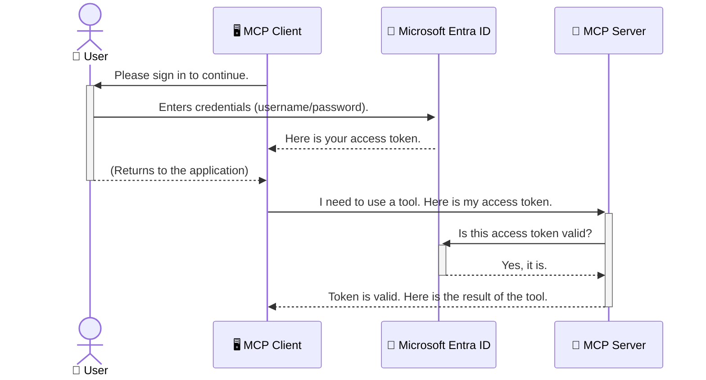

<!--
CO_OP_TRANSLATOR_METADATA:
{
  "original_hash": "9abe1d303ab126f9a8b87f03cebe5213",
  "translation_date": "2025-06-26T14:40:33+00:00",
  "source_file": "05-AdvancedTopics/mcp-security-entra/README.md",
  "language_code": "hi"
}
-->
# AI वर्कफ़्लोज़ की सुरक्षा: मॉडल कॉन्टेक्स्ट प्रोटोकॉल सर्वर्स के लिए Entra ID प्रमाणीकरण

## परिचय  
अपने मॉडल कॉन्टेक्स्ट प्रोटोकॉल (MCP) सर्वर की सुरक्षा उतनी ही जरूरी है जितना अपने घर के मुख्य दरवाज़े को लॉक करना। यदि आप अपने MCP सर्वर को खुला छोड़ देते हैं, तो आपके टूल्स और डेटा अनधिकृत पहुँच के लिए उजागर हो जाते हैं, जिससे सुरक्षा उल्लंघनों का खतरा बढ़ जाता है। Microsoft Entra ID एक मजबूत क्लाउड-आधारित पहचान और एक्सेस प्रबंधन समाधान प्रदान करता है, जो सुनिश्चित करता है कि केवल अधिकृत उपयोगकर्ता और एप्लिकेशन ही आपके MCP सर्वर के साथ इंटरैक्ट कर सकें। इस सेक्शन में, आप Entra ID प्रमाणीकरण का उपयोग करके अपने AI वर्कफ़्लोज़ की सुरक्षा करना सीखेंगे।

## सीखने के उद्देश्य  
इस सेक्शन के अंत तक, आप सक्षम होंगे:

- MCP सर्वर्स की सुरक्षा के महत्व को समझना।
- Microsoft Entra ID और OAuth 2.0 प्रमाणीकरण के मूल सिद्धांतों को समझाना।
- सार्वजनिक और गोपनीय क्लाइंट के बीच अंतर को पहचानना।
- स्थानीय (सार्वजनिक क्लाइंट) और रिमोट (गोपनीय क्लाइंट) MCP सर्वर पर Entra ID प्रमाणीकरण को लागू करना।
- AI वर्कफ़्लोज़ विकसित करते समय सुरक्षा सर्वोत्तम प्रथाओं को अपनाना।

# AI वर्कफ़्लोज़ की सुरक्षा: मॉडल कॉन्टेक्स्ट प्रोटोकॉल सर्वर्स के लिए Entra ID प्रमाणीकरण

जैसे आप अपने घर के मुख्य दरवाज़े को खुला नहीं छोड़ते, वैसे ही आपको अपने MCP सर्वर को भी किसी के लिए खुला नहीं छोड़ना चाहिए। अपने AI वर्कफ़्लोज़ की सुरक्षा करना मजबूत, विश्वसनीय और सुरक्षित एप्लिकेशन बनाने के लिए आवश्यक है। यह अध्याय आपको Microsoft Entra ID का उपयोग करके अपने MCP सर्वर्स की सुरक्षा करने का परिचय देगा, जिससे केवल अधिकृत उपयोगकर्ता और एप्लिकेशन ही आपके टूल्स और डेटा के साथ इंटरैक्ट कर सकें।

## MCP सर्वर्स के लिए सुरक्षा क्यों महत्वपूर्ण है

कल्पना करें कि आपका MCP सर्वर एक ऐसा टूल है जो ईमेल भेज सकता है या ग्राहक डेटाबेस तक पहुँच सकता है। यदि सर्वर असुरक्षित है, तो कोई भी उस टूल का उपयोग कर सकता है, जिससे अनधिकृत डेटा एक्सेस, स्पैम या अन्य दुर्भावनापूर्ण गतिविधियाँ हो सकती हैं।

प्रमाणीकरण लागू करके, आप सुनिश्चित करते हैं कि सर्वर को भेजी गई हर रिक्वेस्ट सत्यापित हो, जो अनुरोध करने वाले उपयोगकर्ता या एप्लिकेशन की पहचान की पुष्टि करता है। यह आपके AI वर्कफ़्लोज़ की सुरक्षा का पहला और सबसे महत्वपूर्ण कदम है।

## Microsoft Entra ID का परिचय

**Microsoft Entra ID** एक क्लाउड-आधारित पहचान और एक्सेस प्रबंधन सेवा है। इसे अपने एप्लिकेशन के लिए एक सार्वभौमिक सुरक्षा गार्ड की तरह सोचें। यह उपयोगकर्ता पहचान (प्रमाणीकरण) की जटिल प्रक्रिया को संभालता है और यह निर्धारित करता है कि उन्हें क्या करने की अनुमति है (प्राधिकरण)।

Entra ID का उपयोग करके आप:

- उपयोगकर्ताओं के लिए सुरक्षित साइन-इन सक्षम कर सकते हैं।
- APIs और सेवाओं की सुरक्षा कर सकते हैं।
- एक्सेस नीतियों को एक केंद्रीकृत स्थान से प्रबंधित कर सकते हैं।

MCP सर्वर्स के लिए, Entra ID एक मजबूत और व्यापक रूप से भरोसेमंद समाधान प्रदान करता है जो यह नियंत्रित करता है कि कौन आपके सर्वर की क्षमताओं तक पहुँच सकता है।

---

## जादू को समझना: Entra ID प्रमाणीकरण कैसे काम करता है

Entra ID प्रमाणीकरण को संभालने के लिए **OAuth 2.0** जैसे खुले मानकों का उपयोग करता है। विवरण जटिल हो सकते हैं, लेकिन मूल अवधारणा सरल है और एक उपमा के साथ समझाई जा सकती है।

### OAuth 2.0 का सरल परिचय: वैलेट की

OAuth 2.0 को अपनी कार के लिए वैलेट सेवा की तरह सोचें। जब आप किसी रेस्तरां में पहुँचते हैं, तो आप वैलेट को अपनी मास्टर चाबी नहीं देते। इसके बजाय, आप एक **वैलेट की** देते हैं जिसमें सीमित अनुमतियाँ होती हैं—यह कार शुरू कर सकता है और दरवाज़े लॉक कर सकता है, लेकिन ट्रंक या दस्ताने के डिब्बे को खोल नहीं सकता।

इस उपमा में:

- **आप** हैं **उपयोगकर्ता**।
- **आपकी कार** है **MCP सर्वर** जिसमें मूल्यवान टूल्स और डेटा हैं।
- **वैलेट** है **Microsoft Entra ID**।
- **पार्किंग अटेंडेंट** है **MCP क्लाइंट** (जो सर्वर तक पहुँचने का प्रयास कर रहा एप्लिकेशन है)।
- **वैलेट की** है **एक्सेस टोकन**।

एक्सेस टोकन एक सुरक्षित टेक्स्ट स्ट्रिंग है जो MCP क्लाइंट को Entra ID से साइन-इन के बाद प्राप्त होता है। क्लाइंट इस टोकन को हर अनुरोध के साथ MCP सर्वर को प्रस्तुत करता है। सर्वर इस टोकन को सत्यापित कर सकता है ताकि यह सुनिश्चित हो सके कि अनुरोध वैध है और क्लाइंट के पास आवश्यक अनुमतियाँ हैं, बिना आपके वास्तविक क्रेडेंशियल्स (जैसे पासवर्ड) को संभाले।

### प्रमाणीकरण प्रवाह

यहाँ इस प्रक्रिया का व्यावहारिक कार्यान्वयन है:



### Microsoft Authentication Library (MSAL) का परिचय

कोड में उतरने से पहले, एक महत्वपूर्ण घटक से परिचित होना आवश्यक है जो उदाहरणों में दिखेगा: **Microsoft Authentication Library (MSAL)**।

MSAL Microsoft द्वारा विकसित एक लाइब्रेरी है जो डेवलपर्स के लिए प्रमाणीकरण को संभालना बहुत आसान बनाती है। आपको सुरक्षा टोकन संभालने, साइन-इन प्रबंधन, और सेशन रिफ्रेश करने के लिए जटिल कोड लिखने की जरूरत नहीं पड़ती; MSAL यह सब काम करता है।

MSAL का उपयोग करने की सिफारिश इसलिए की जाती है क्योंकि:

- **यह सुरक्षित है:** यह उद्योग-मानक प्रोटोकॉल और सुरक्षा सर्वोत्तम प्रथाओं को लागू करता है, जिससे आपके कोड में कमजोरियों का जोखिम कम होता है।
- **यह विकास को सरल बनाता है:** यह OAuth 2.0 और OpenID Connect प्रोटोकॉल की जटिलताओं को छुपा देता है, जिससे आप कुछ ही लाइनों में मजबूत प्रमाणीकरण जोड़ सकते हैं।
- **यह सक्रिय रूप से मेंटेन किया जाता है:** Microsoft MSAL को नए सुरक्षा खतरों और प्लेटफ़ॉर्म परिवर्तनों के अनुसार अपडेट करता रहता है।

MSAL कई भाषाओं और एप्लिकेशन फ्रेमवर्क्स का समर्थन करता है, जिनमें .NET, JavaScript/TypeScript, Python, Java, Go, और मोबाइल प्लेटफ़ॉर्म जैसे iOS और Android शामिल हैं। इसका मतलब है कि आप अपनी पूरी तकनीकी स्टैक में एक समान प्रमाणीकरण पैटर्न का उपयोग कर सकते हैं।

MSAL के बारे में अधिक जानने के लिए, आप आधिकारिक [MSAL अवलोकन दस्तावेज़](https://learn.microsoft.com/entra/identity-platform/msal-overview) देख सकते हैं।

---

## Entra ID के साथ अपने MCP सर्वर की सुरक्षा: चरण-दर-चरण मार्गदर्शिका

अब, चलिए एक स्थानीय MCP सर्वर को सुरक्षित करने की प्रक्रिया देखते हैं (जो `stdio`) using Entra ID. This example uses a **public client**, which is suitable for applications running on a user's machine, like a desktop app or a local development server.

### Scenario 1: Securing a Local MCP Server (with a Public Client)

In this scenario, we'll look at an MCP server that runs locally, communicates over `stdio`, and uses Entra ID to authenticate the user before allowing access to its tools. The server will have a single tool that fetches the user's profile information from the Microsoft Graph API.

#### 1. Setting Up the Application in Entra ID

Before writing any code, you need to register your application in Microsoft Entra ID. This tells Entra ID about your application and grants it permission to use the authentication service.

1. Navigate to the **[Microsoft Entra portal](https://entra.microsoft.com/)**.
2. Go to **App registrations** and click **New registration**.
3. Give your application a name (e.g., "My Local MCP Server").
4. For **Supported account types**, select **Accounts in this organizational directory only**.
5. You can leave the **Redirect URI** blank for this example.
6. Click **Register**.

Once registered, take note of the **Application (client) ID** and **Directory (tenant) ID**. You'll need these in your code.

#### 2. The Code: A Breakdown

Let's look at the key parts of the code that handle authentication. The full code for this example is available in the [Entra ID - Local - WAM](https://github.com/Azure-Samples/mcp-auth-servers/tree/main/src/entra-id-local-wam) folder of the [mcp-auth-servers GitHub repository](https://github.com/Azure-Samples/mcp-auth-servers).

**`AuthenticationService.cs`**

This class is responsible for handling the interaction with Entra ID.

- **`CreateAsync`**: This method initializes the `PublicClientApplication` from the MSAL (Microsoft Authentication Library). It's configured with your application's `clientId` and `tenantId`.
- **`WithBroker`**: This enables the use of a broker (like the Windows Web Account Manager), which provides a more secure and seamless single sign-on experience.
- **`AcquireTokenAsync`** के माध्यम से संवाद करता है): यह मुख्य मेथड है। यह पहले चुपचाप टोकन प्राप्त करने की कोशिश करता है (जिसका मतलब है कि उपयोगकर्ता को फिर से साइन-इन करने की जरूरत नहीं होगी यदि उसके पास पहले से वैध सेशन है)। यदि चुपचाप टोकन प्राप्त नहीं हो पाता, तो यह उपयोगकर्ता को इंटरैक्टिव साइन-इन के लिए प्रॉम्प्ट करेगा।

```csharp
// Simplified for clarity
public static async Task<AuthenticationService> CreateAsync(ILogger<AuthenticationService> logger)
{
    var msalClient = PublicClientApplicationBuilder
        .Create(_clientId) // Your Application (client) ID
        .WithAuthority(AadAuthorityAudience.AzureAdMyOrg)
        .WithTenantId(_tenantId) // Your Directory (tenant) ID
        .WithBroker(new BrokerOptions(BrokerOptions.OperatingSystems.Windows))
        .Build();

    // ... cache registration ...

    return new AuthenticationService(logger, msalClient);
}

public async Task<string> AcquireTokenAsync()
{
    try
    {
        // Try silent authentication first
        var accounts = await _msalClient.GetAccountsAsync();
        var account = accounts.FirstOrDefault();

        AuthenticationResult? result = null;

        if (account != null)
        {
            result = await _msalClient.AcquireTokenSilent(_scopes, account).ExecuteAsync();
        }
        else
        {
            // If no account, or silent fails, go interactive
            result = await _msalClient.AcquireTokenInteractive(_scopes).ExecuteAsync();
        }

        return result.AccessToken;
    }
    catch (Exception ex)
    {
        _logger.LogError(ex, "An error occurred while acquiring the token.");
        throw; // Optionally rethrow the exception for higher-level handling
    }
}
```

**`Program.cs`**

This is where the MCP server is set up and the authentication service is integrated.

- **`AddSingleton<AuthenticationService>`**: This registers the `AuthenticationService` with the dependency injection container, so it can be used by other parts of the application (like our tool).
- **`GetUserDetailsFromGraph` tool**: This tool requires an instance of `AuthenticationService`. Before it does anything, it calls `authService.AcquireTokenAsync()` का उपयोग करके वैध एक्सेस टोकन प्राप्त करता है। यदि प्रमाणीकरण सफल होता है, तो यह टोकन का उपयोग Microsoft Graph API को कॉल करके उपयोगकर्ता के विवरण प्राप्त करने के लिए करता है।**

```csharp
// Simplified for clarity
[McpServerTool(Name = "GetUserDetailsFromGraph")]
public static async Task<string> GetUserDetailsFromGraph(
    AuthenticationService authService)
{
    try
    {
        // This will trigger the authentication flow
        var accessToken = await authService.AcquireTokenAsync();

        // Use the token to create a GraphServiceClient
        var graphClient = new GraphServiceClient(
            new BaseBearerTokenAuthenticationProvider(new TokenProvider(authService)));

        var user = await graphClient.Me.GetAsync();

        return System.Text.Json.JsonSerializer.Serialize(user);
    }
    catch (Exception ex)
    {
        return $"Error: {ex.Message}";
    }
}
```

#### 3. यह सब कैसे साथ काम करता है

1. जब MCP क्लाइंट `GetUserDetailsFromGraph` tool, the tool first calls `AcquireTokenAsync`.
2. `AcquireTokenAsync` triggers the MSAL library to check for a valid token.
3. If no token is found, MSAL, through the broker, will prompt the user to sign in with their Entra ID account.
4. Once the user signs in, Entra ID issues an access token.
5. The tool receives the token and uses it to make a secure call to the Microsoft Graph API.
6. The user's details are returned to the MCP client.

This process ensures that only authenticated users can use the tool, effectively securing your local MCP server.

### Scenario 2: Securing a Remote MCP Server (with a Confidential Client)

When your MCP server is running on a remote machine (like a cloud server) and communicates over a protocol like HTTP Streaming, the security requirements are different. In this case, you should use a **confidential client** and the **Authorization Code Flow**. This is a more secure method because the application's secrets are never exposed to the browser.

This example uses a TypeScript-based MCP server that uses Express.js to handle HTTP requests.

#### 1. Setting Up the Application in Entra ID

The setup in Entra ID is similar to the public client, but with one key difference: you need to create a **client secret**.

1. Navigate to the **[Microsoft Entra portal](https://entra.microsoft.com/)**.
2. In your app registration, go to the **Certificates & secrets** tab.
3. Click **New client secret**, give it a description, and click **Add**.
4. **Important:** Copy the secret value immediately. You will not be able to see it again.
5. You also need to configure a **Redirect URI**. Go to the **Authentication** tab, click **Add a platform**, select **Web**, and enter the redirect URI for your application (e.g., `http://localhost:3001/auth/callback`).

> **⚠️ Important Security Note:** For production applications, Microsoft strongly recommends using **secretless authentication** methods such as **Managed Identity** or **Workload Identity Federation** instead of client secrets. Client secrets pose security risks as they can be exposed or compromised. Managed identities provide a more secure approach by eliminating the need to store credentials in your code or configuration.
>
> For more information about managed identities and how to implement them, see the [Managed identities for Azure resources overview](https://learn.microsoft.com/entra/identity/managed-identities-azure-resources/overview).

#### 2. The Code: A Breakdown

This example uses a session-based approach. When the user authenticates, the server stores the access token and refresh token in a session and gives the user a session token. This session token is then used for subsequent requests. The full code for this example is available in the [Entra ID - Confidential client](https://github.com/Azure-Samples/mcp-auth-servers/tree/main/src/entra-id-cca-session) folder of the [mcp-auth-servers GitHub repository](https://github.com/Azure-Samples/mcp-auth-servers).

**`Server.ts`**

This file sets up the Express server and the MCP transport layer.

- **`requireBearerAuth`**: This is middleware that protects the `/sse` and `/message` endpoints. It checks for a valid bearer token in the `Authorization` header of the request.
- **`EntraIdServerAuthProvider`**: This is a custom class that implements the `McpServerAuthorizationProvider` interface. It's responsible for handling the OAuth 2.0 flow.
- **`/auth/callback`** का उपयोग करता है: यह एंडपॉइंट Entra ID से यूज़र के प्रमाणीकरण के बाद रीडायरेक्ट को संभालता है। यह ऑथोराइज़ेशन कोड को एक्सेस टोकन और रिफ्रेश टोकन में बदल देता है।

```typescript
// Simplified for clarity
const app = express();
const { server } = createServer();
const provider = new EntraIdServerAuthProvider();

// Protect the SSE endpoint
app.get("/sse", requireBearerAuth({
  provider,
  requiredScopes: ["User.Read"]
}), async (req, res) => {
  // ... connect to the transport ...
});

// Protect the message endpoint
app.post("/message", requireBearerAuth({
  provider,
  requiredScopes: ["User.Read"]
}), async (req, res) => {
  // ... handle the message ...
});

// Handle the OAuth 2.0 callback
app.get("/auth/callback", (req, res) => {
  provider.handleCallback(req.query.code, req.query.state)
    .then(result => {
      // ... handle success or failure ...
    });
});
```

**`Tools.ts`**

This file defines the tools that the MCP server provides. The `getUserDetails` टूल पिछले उदाहरण के समान है, लेकिन यह सेशन से एक्सेस टोकन प्राप्त करता है।**

```typescript
// Simplified for clarity
server.setRequestHandler(CallToolRequestSchema, async (request) => {
  const { name } = request.params;
  const context = request.params?.context as { token?: string } | undefined;
  const sessionToken = context?.token;

  if (name === ToolName.GET_USER_DETAILS) {
    if (!sessionToken) {
      throw new AuthenticationError("Authentication token is missing or invalid. Ensure the token is provided in the request context.");
    }

    // Get the Entra ID token from the session store
    const tokenData = tokenStore.getToken(sessionToken);
    const entraIdToken = tokenData.accessToken;

    const graphClient = Client.init({
      authProvider: (done) => {
        done(null, entraIdToken);
      }
    });

    const user = await graphClient.api('/me').get();

    // ... return user details ...
  }
});
```

**`auth/EntraIdServerAuthProvider.ts`**

This class handles the logic for:

- Redirecting the user to the Entra ID sign-in page.
- Exchanging the authorization code for an access token.
- Storing the tokens in the `tokenStore`.
- Refreshing the access token when it expires.

#### 3. How It All Works Together

1. When a user first tries to connect to the MCP server, the `requireBearerAuth` middleware will see that they don't have a valid session and will redirect them to the Entra ID sign-in page.
2. The user signs in with their Entra ID account.
3. Entra ID redirects the user back to the `/auth/callback` endpoint with an authorization code.
4. The server exchanges the code for an access token and a refresh token, stores them, and creates a session token which is sent to the client.
5. The client can now use this session token in the `Authorization` header for all future requests to the MCP server.
6. When the `getUserDetails` टूल कॉल किया जाता है, यह सेशन टोकन का उपयोग Entra ID एक्सेस टोकन खोजने के लिए करता है और फिर Microsoft Graph API को कॉल करता है।**

यह प्रवाह सार्वजनिक क्लाइंट प्रवाह से अधिक जटिल है, लेकिन इंटरनेट-फेसिंग एंडपॉइंट्स के लिए आवश्यक है। चूंकि रिमोट MCP सर्वर सार्वजनिक इंटरनेट पर उपलब्ध होते हैं, इसलिए उन्हें अनधिकृत पहुँच और संभावित हमलों से बचाने के लिए मजबूत सुरक्षा उपायों की जरूरत होती है।

## सुरक्षा सर्वोत्तम प्रथाएँ

- **हमेशा HTTPS का उपयोग करें**: क्लाइंट और सर्वर के बीच संचार को एन्क्रिप्ट करें ताकि टोकन इंटरसेप्ट न हो सकें।
- **रोल-आधारित एक्सेस कंट्रोल (RBAC) लागू करें**: केवल यह जांचें कि उपयोगकर्ता प्रमाणीकरणित है या नहीं, बल्कि यह भी जांचें कि उसे क्या करने की अनुमति है। आप Entra ID में रोल्स परिभाषित कर सकते हैं और उन्हें MCP सर्वर में जांच सकते हैं।
- **निगरानी और ऑडिट करें**: सभी प्रमाणीकरण घटनाओं को लॉग करें ताकि संदिग्ध गतिविधि का पता चल सके और प्रतिक्रिया दी जा सके।
- **रेट लिमिटिंग और थ्रॉटलिंग संभालें**: Microsoft Graph और अन्य APIs दुरुपयोग रोकने के लिए रेट लिमिटिंग लागू करते हैं। अपने MCP सर्वर में एक्सपोनेंशियल बैकऑफ और पुनः प्रयास लॉजिक लागू करें ताकि HTTP 429 (बहुत अधिक अनुरोध) प्रतिक्रियाओं को सहजता से संभाला जा सके। अक्सर एक्सेस किए जाने वाले डेटा को कैश करने पर विचार करें ताकि API कॉल कम हों।
- **टोकन स्टोरेज सुरक्षित करें**: एक्सेस टोकन और रिफ्रेश टोकन को सुरक्षित रूप से स्टोर करें। स्थानीय एप्लिकेशन के लिए, सिस्टम के सुरक्षित भंडारण तंत्रों का उपयोग करें। सर्वर एप्लिकेशन के लिए, एन्क्रिप्टेड स्टोरेज या Azure Key Vault जैसे सुरक्षित कुंजी प्रबंधन सेवाओं का उपयोग करें।
- **टोकन समाप्ति को संभालें**: एक्सेस टोकन की सीमित अवधि होती है। रिफ्रेश टोकन का उपयोग करके स्वचालित टोकन रिफ्रेश लागू करें ताकि उपयोगकर्ता को बार-बार पुनः प्रमाणीकरण न करना पड़े।
- **Azure API Management का उपयोग करने पर विचार करें**: सीधे MCP सर्वर में सुरक्षा लागू करना आपको सूक्ष्म नियंत्रण देता है, लेकिन API गेटवे जैसे Azure API Management कई सुरक्षा चिंताओं को स्वचालित रूप से संभाल सकते हैं, जिनमें प्रमाणीकरण, प्राधिकरण, रेट लिमिटिंग, और निगरानी शामिल हैं। ये आपके क्लाइंट्स और MCP सर्वर्स के बीच एक केंद्रीकृत सुरक्षा परत प्रदान करते हैं। MCP के साथ API गेटवे के उपयोग के बारे में अधिक जानकारी के लिए देखें: [Azure API Management Your Auth Gateway For MCP Servers](https://techcommunity.microsoft.com/blog/integrationsonazureblog/azure-api-management-your-auth-gateway-for-mcp-servers/4402690)।

## मुख्य निष्कर्ष

- अपने MCP सर्वर की सुरक्षा आपके डेटा और टूल्स की रक्षा के लिए अत्यंत आवश्यक है।
- Microsoft Entra ID प्रमाणीकरण और प्राधिकरण के लिए एक मजबूत और स्केलेबल समाधान प्रदान करता है।
- स्थानीय एप्लिकेशन के लिए **सार्वजनिक क्लाइंट** और रिमोट सर्वर्स के लिए **गोपनीय क्लाइंट** का उपयोग करें।
- वेब एप्लिकेशन के लिए **ऑथोराइज़ेशन कोड फ्लो** सबसे सुरक्षित विकल्प है।

## अभ्यास

1. सोचिए कि आप कौन सा MCP सर्वर बना सकते हैं। क्या वह स्थानीय सर्वर होगा या रिमोट सर्वर?
2. अपने उत्तर के आधार पर, क्या आप सार्वजनिक क्लाइंट या गोपनीय क्लाइंट का उपयोग करेंगे?
3. Microsoft Graph के खिलाफ क्रियाएँ करने के लिए आपका MCP सर्वर कौन-सी अनुमति मांगेगा?

## व्यावहारिक अभ्यास

### अभ्यास 1: Entra ID में एक एप्लिकेशन रजिस्टर करें  
Microsoft Entra पोर्टल पर जाएं।  
अपने MCP सर्वर के लिए एक नया एप्लिकेशन रजिस्टर करें।  
एप्लिकेशन (क्लाइंट) ID और डायरेक्टरी (टेनेंट) ID नोट करें।

### अभ्यास 2: एक स्थानीय MCP सर्वर को सुरक्षित करें (सार्वजनिक क्लाइंट)  
उपयोगकर्ता प्रमाणीकरण के लिए MSAL (Microsoft Authentication Library) कोड उदाहरण का पालन करें।  
Microsoft Graph से उपयोगकर्ता विवरण प्राप्त करने वाले MCP टूल को कॉल करके प्रमाणीकरण प्रवाह का परीक्षण करें।

### अभ्यास 3: एक रिमोट MCP सर्वर को सुरक्षित करें (गोपनीय क्लाइंट)  
Entra ID में एक गोपनीय क्लाइंट रजिस्टर करें और एक क्लाइंट सीक्रेट बनाएं।  
अपने Express.js MCP सर्वर को ऑथोराइज़ेशन कोड फ्लो का उपयोग करने के लिए कॉन्फ़िगर करें।  
संरक्षित एंडपॉइंट्स का परीक्षण करें और टोकन-आधारित एक्सेस की पुष्टि करें।

### अभ्यास 4: सुरक्षा सर्वोत्तम प्रथाओं को लागू करें  
अपने स्थानीय या रिमोट सर्वर के लिए HTTPS सक्षम करें।  
अपने सर्वर लॉजिक में रोल-आधारित एक्सेस कंट्रोल (RBAC) लागू करें।  
टोकन समाप्ति हैंडलिंग और सुरक्षित टोकन स्टोरेज जोड़ें।

## संसाधन

1. **MSAL अवलोकन दस्तावेज़**  
   जानिए कि Microsoft Authentication Library (MSAL) कैसे प्लेटफ़ॉर्म्स में सुरक्षित टोकन अधिग्रहण सक्षम करता है:  
   [MSAL Overview on Microsoft Learn](https://learn.microsoft.com/en-gb/entra/msal/overview)

2. **Azure-Samples/mcp-auth-servers GitHub रिपॉजिटरी**  
   MCP सर्वर्स के प्रमाणीकरण प्रवाहों के संदर्भ कार्यान्वयन:  
   [Azure-Samples/mcp-auth-servers on GitHub](https://github.com/Azure-Samples/mcp-auth-servers)

3. **Azure संसाधनों के लिए प्रबंधित पहचान का अवलोकन**  
   सिस्टम या उपयोगकर्ता-निर्धारित प्रबंधित पहचान का उपयोग करके सीक्रेट्स को खत्म करने का तरीका समझें:  
   [Managed Identities Overview on Microsoft Learn](https://learn.microsoft.com/en-us/entra/identity/managed-identities-azure-resources/)

4. **Azure API Management: MCP सर्वर्स के लिए आपका ऑथ गेटवे**  
   MCP सर्वर्स के लिए एक सुरक्षित OAuth2 गेटवे के रूप में APIM के उपयोग का विस्तृत विवरण:  
   [Azure API Management Your Auth Gateway For MCP Servers](https://techcommunity.microsoft.com/blog/integrationsonazureblog/azure-api-management-your-auth-gateway-for-mcp-servers/4402690)

5. **Microsoft Graph अनुमतियों का संदर्भ**  
   Microsoft Graph के लिए प्रतिनिधि और एप्लिकेशन अनुमतियों की व्यापक सूची:  
   [Microsoft Graph Permissions Reference](https://learn.microsoft.com/zh-tw/graph/permissions-reference)

## सीखने के परिणाम  
इस सेक्शन को पूरा करने के बाद, आप सक्षम होंगे:

- समझाना कि MCP सर्वर्स और AI वर्कफ़्लोज़ के लिए प्रमाणीकरण क्यों महत्वपूर्ण है।  
- स्थानीय और रिमोट MCP सर्वर पर Entra ID प्रमाणीकरण सेटअप और कॉन्फ़िगर करना।  
- अपने सर्वर के डिप्लॉयमेंट के आधार पर उचित क्लाइंट प्रकार (सार्वजनिक या गोपनीय) चुनना।  
- सुरक्षित कोडिंग प्रथाओं को लागू करना, जिसमें टोकन स्टोरेज और रोल-आधारित प्राधिकरण शामिल हैं।  
- अपने MCP सर्वर और उसके टूल्स को अनधिकृत पहुँच से आत्मविश्वास के साथ सुरक्षित करना।

## आगे क्या है

- [6. Community Contributions](../../06-CommunityContributions/README.md)

**अस्वीकरण**:  
यह दस्तावेज़ AI अनुवाद सेवा [Co-op Translator](https://github.com/Azure/co-op-translator) का उपयोग करके अनुवादित किया गया है। जबकि हम सटीकता के लिए प्रयासरत हैं, कृपया ध्यान दें कि स्वचालित अनुवादों में त्रुटियाँ या गलतियाँ हो सकती हैं। मूल दस्तावेज़ अपनी मूल भाषा में ही आधिकारिक स्रोत माना जाना चाहिए। महत्वपूर्ण जानकारी के लिए, पेशेवर मानव अनुवाद की सलाह दी जाती है। इस अनुवाद के उपयोग से उत्पन्न किसी भी गलतफहमी या गलत व्याख्या के लिए हम जिम्मेदार नहीं हैं।