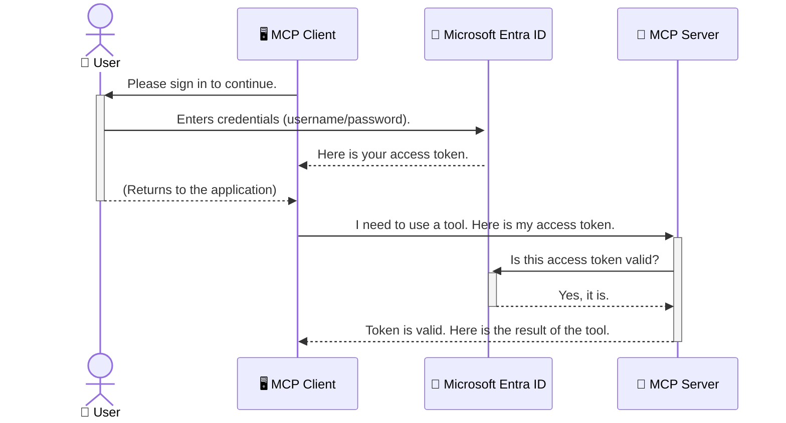

<!--
CO_OP_TRANSLATOR_METADATA:
{
  "original_hash": "6e562d7e5a77c8982da4aa8f762ad1d8",
  "translation_date": "2025-07-14T02:55:01+00:00",
  "source_file": "05-AdvancedTopics/mcp-security-entra/README.md",
  "language_code": "hi"
}
-->
# AI वर्कफ़्लो की सुरक्षा: मॉडल कॉन्टेक्स्ट प्रोटोकॉल सर्वर के लिए Entra ID प्रमाणीकरण

## परिचय  
अपने मॉडल कॉन्टेक्स्ट प्रोटोकॉल (MCP) सर्वर की सुरक्षा उतनी ही जरूरी है जितना अपने घर के मुख्य दरवाज़े को लॉक करना। यदि आपका MCP सर्वर खुला रहेगा, तो आपके टूल्स और डेटा अनधिकृत पहुंच के लिए उजागर हो सकते हैं, जिससे सुरक्षा उल्लंघन हो सकते हैं। Microsoft Entra ID एक मजबूत क्लाउड-आधारित पहचान और एक्सेस प्रबंधन समाधान प्रदान करता है, जो सुनिश्चित करता है कि केवल अधिकृत उपयोगकर्ता और एप्लिकेशन ही आपके MCP सर्वर के साथ इंटरैक्ट कर सकें। इस अनुभाग में, आप सीखेंगे कि Entra ID प्रमाणीकरण का उपयोग करके अपने AI वर्कफ़्लो की सुरक्षा कैसे करें।

## सीखने के उद्देश्य  
इस अनुभाग के अंत तक, आप सक्षम होंगे:

- MCP सर्वरों की सुरक्षा के महत्व को समझना।  
- Microsoft Entra ID और OAuth 2.0 प्रमाणीकरण के मूल सिद्धांतों को समझाना।  
- सार्वजनिक और गोपनीय क्लाइंट के बीच अंतर पहचानना।  
- स्थानीय (सार्वजनिक क्लाइंट) और रिमोट (गोपनीय क्लाइंट) MCP सर्वर परिदृश्यों में Entra ID प्रमाणीकरण लागू करना।  
- AI वर्कफ़्लो विकसित करते समय सुरक्षा के सर्वोत्तम अभ्यासों को अपनाना।  

## सुरक्षा और MCP  

जैसे आप अपने घर का मुख्य दरवाज़ा खुला नहीं छोड़ते, वैसे ही आपको अपने MCP सर्वर को भी किसी के लिए खुला नहीं छोड़ना चाहिए। अपने AI वर्कफ़्लो की सुरक्षा करना मजबूत, विश्वसनीय और सुरक्षित एप्लिकेशन बनाने के लिए आवश्यक है। यह अध्याय आपको Microsoft Entra ID का उपयोग करके अपने MCP सर्वरों को सुरक्षित करने का परिचय देगा, जिससे केवल अधिकृत उपयोगकर्ता और एप्लिकेशन ही आपके टूल्स और डेटा के साथ इंटरैक्ट कर सकें।

## MCP सर्वरों के लिए सुरक्षा क्यों महत्वपूर्ण है  

कल्पना करें कि आपके MCP सर्वर में एक ऐसा टूल है जो ईमेल भेज सकता है या ग्राहक डेटाबेस तक पहुंच सकता है। यदि सर्वर असुरक्षित है, तो कोई भी उस टूल का उपयोग कर सकता है, जिससे अनधिकृत डेटा एक्सेस, स्पैम या अन्य दुर्भावनापूर्ण गतिविधियाँ हो सकती हैं।

प्रमाणीकरण लागू करके, आप सुनिश्चित करते हैं कि आपके सर्वर को भेजी गई हर रिक्वेस्ट की पहचान सत्यापित हो, जो यह पुष्टि करता है कि अनुरोध करने वाला उपयोगकर्ता या एप्लिकेशन अधिकृत है। यह आपके AI वर्कफ़्लो की सुरक्षा का पहला और सबसे महत्वपूर्ण कदम है।

## Microsoft Entra ID का परिचय  

[**Microsoft Entra ID**](https://adoption.microsoft.com/microsoft-security/entra/) एक क्लाउड-आधारित पहचान और एक्सेस प्रबंधन सेवा है। इसे अपने एप्लिकेशन के लिए एक सार्वभौमिक सुरक्षा गार्ड के रूप में सोचें। यह उपयोगकर्ता की पहचान सत्यापित करने (प्रमाणीकरण) और यह निर्धारित करने (अधिकार) की जटिल प्रक्रिया को संभालता है कि वे क्या कर सकते हैं।

Entra ID का उपयोग करके आप:

- उपयोगकर्ताओं के लिए सुरक्षित साइन-इन सक्षम कर सकते हैं।  
- APIs और सेवाओं की सुरक्षा कर सकते हैं।  
- एक्सेस नीतियों को एक केंद्रीकृत स्थान से प्रबंधित कर सकते हैं।  

MCP सर्वरों के लिए, Entra ID एक मजबूत और व्यापक रूप से विश्वसनीय समाधान प्रदान करता है जो यह नियंत्रित करता है कि कौन आपके सर्वर की क्षमताओं तक पहुंच सकता है।

---

## जादू को समझना: Entra ID प्रमाणीकरण कैसे काम करता है  

Entra ID प्रमाणीकरण के लिए **OAuth 2.0** जैसे खुले मानकों का उपयोग करता है। जबकि विवरण जटिल हो सकते हैं, मूल अवधारणा सरल है और इसे एक उपमा के माध्यम से समझा जा सकता है।

### OAuth 2.0 का सरल परिचय: वैलेट की  

OAuth 2.0 को अपने कार के लिए वैलेट सेवा की तरह सोचें। जब आप किसी रेस्तरां पहुंचते हैं, तो आप वैलेट को अपनी मास्टर चाबी नहीं देते। इसके बजाय, आप एक **वैलेट की** देते हैं जिसमें सीमित अनुमतियाँ होती हैं—यह कार स्टार्ट कर सकता है और दरवाज़े लॉक कर सकता है, लेकिन ट्रंक या ग्लव कम्पार्टमेंट नहीं खोल सकता।

इस उपमा में:

- **आप** हैं **उपयोगकर्ता**।  
- **आपकी कार** है **MCP सर्वर** जिसमें मूल्यवान टूल्स और डेटा हैं।  
- **वैलेट** है **Microsoft Entra ID**।  
- **पार्किंग अटेंडेंट** है **MCP क्लाइंट** (जो सर्वर तक पहुंचने की कोशिश कर रहा एप्लिकेशन)।  
- **वैलेट की** है **एक्सेस टोकन**।  

एक्सेस टोकन एक सुरक्षित टेक्स्ट स्ट्रिंग है जो MCP क्लाइंट को Entra ID से साइन-इन के बाद मिलती है। क्लाइंट इस टोकन को हर अनुरोध के साथ MCP सर्वर को प्रस्तुत करता है। सर्वर टोकन की जांच कर सकता है कि अनुरोध वैध है और क्लाइंट के पास आवश्यक अनुमतियाँ हैं, बिना आपके वास्तविक क्रेडेंशियल्स (जैसे पासवर्ड) को संभाले।

### प्रमाणीकरण प्रवाह  

यहाँ प्रक्रिया व्यावहारिक रूप में कैसे काम करती है:



### Microsoft Authentication Library (MSAL) का परिचय  

कोड में जाने से पहले, एक महत्वपूर्ण घटक से परिचित होना जरूरी है जिसे आप उदाहरणों में देखेंगे: **Microsoft Authentication Library (MSAL)**।

MSAL माइक्रोसॉफ्ट द्वारा विकसित एक लाइब्रेरी है जो डेवलपर्स के लिए प्रमाणीकरण को बहुत आसान बनाती है। आपको सुरक्षा टोकन संभालने, साइन-इन प्रबंधन और सेशन रिफ्रेश करने के लिए जटिल कोड लिखने की जरूरत नहीं होती, MSAL यह सब संभालता है।

MSAL का उपयोग करने के फायदे:

- **यह सुरक्षित है:** यह उद्योग-मानक प्रोटोकॉल और सुरक्षा सर्वोत्तम प्रथाओं को लागू करता है, जिससे आपके कोड में कमजोरियों का जोखिम कम होता है।  
- **यह विकास को सरल बनाता है:** यह OAuth 2.0 और OpenID Connect प्रोटोकॉल की जटिलताओं को छुपाता है, जिससे आप कुछ ही लाइनों में मजबूत प्रमाणीकरण जोड़ सकते हैं।  
- **यह मेंटेन किया जाता है:** माइक्रोसॉफ्ट सक्रिय रूप से MSAL को नए सुरक्षा खतरों और प्लेटफ़ॉर्म परिवर्तनों के अनुसार अपडेट करता रहता है।  

MSAL कई भाषाओं और एप्लिकेशन फ्रेमवर्क्स का समर्थन करता है, जैसे .NET, JavaScript/TypeScript, Python, Java, Go, और मोबाइल प्लेटफ़ॉर्म जैसे iOS और Android। इसका मतलब है कि आप पूरे तकनीकी स्टैक में एक समान प्रमाणीकरण पैटर्न का उपयोग कर सकते हैं।

MSAL के बारे में अधिक जानने के लिए, आप आधिकारिक [MSAL अवलोकन दस्तावेज़](https://learn.microsoft.com/entra/identity-platform/msal-overview) देख सकते हैं।

---

## Entra ID के साथ अपने MCP सर्वर की सुरक्षा: चरण-दर-चरण मार्गदर्शिका  

अब, चलिए देखते हैं कि स्थानीय MCP सर्वर (जो `stdio` के माध्यम से संचार करता है) को Entra ID का उपयोग करके कैसे सुरक्षित किया जाए। यह उदाहरण एक **सार्वजनिक क्लाइंट** का उपयोग करता है, जो उपयोगकर्ता के कंप्यूटर पर चलने वाले एप्लिकेशन जैसे डेस्कटॉप ऐप या स्थानीय विकास सर्वर के लिए उपयुक्त है।

### परिदृश्य 1: स्थानीय MCP सर्वर की सुरक्षा (सार्वजनिक क्लाइंट के साथ)  

इस परिदृश्य में, हम एक ऐसे MCP सर्वर को देखेंगे जो स्थानीय रूप से चलता है, `stdio` के माध्यम से संचार करता है, और उपयोगकर्ता को प्रमाणित करने के लिए Entra ID का उपयोग करता है ताकि उसके टूल्स तक पहुंच दी जा सके। सर्वर में एक टूल होगा जो Microsoft Graph API से उपयोगकर्ता की प्रोफ़ाइल जानकारी प्राप्त करता है।

#### 1. Entra ID में एप्लिकेशन सेटअप करना  

कोड लिखने से पहले, आपको Microsoft Entra ID में अपना एप्लिकेशन रजिस्टर करना होगा। यह Entra ID को आपके एप्लिकेशन के बारे में बताता है और प्रमाणीकरण सेवा का उपयोग करने की अनुमति देता है।

1. **[Microsoft Entra पोर्टल](https://entra.microsoft.com/)** पर जाएं।  
2. **App registrations** में जाएं और **New registration** पर क्लिक करें।  
3. अपने एप्लिकेशन को एक नाम दें (जैसे "My Local MCP Server")।  
4. **Supported account types** में से **Accounts in this organizational directory only** चुनें।  
5. इस उदाहरण के लिए **Redirect URI** खाली छोड़ सकते हैं।  
6. **Register** पर क्लिक करें।  

रजिस्टर करने के बाद, **Application (client) ID** और **Directory (tenant) ID** नोट कर लें। आपको इन्हें अपने कोड में उपयोग करना होगा।

#### 2. कोड: एक अवलोकन  

आइए प्रमाणीकरण को संभालने वाले कोड के मुख्य भागों को देखें। इस उदाहरण का पूरा कोड [Entra ID - Local - WAM](https://github.com/Azure-Samples/mcp-auth-servers/tree/main/src/entra-id-local-wam) फोल्डर में उपलब्ध है, जो [mcp-auth-servers GitHub रिपॉजिटरी](https://github.com/Azure-Samples/mcp-auth-servers) का हिस्सा है।

**`AuthenticationService.cs`**  

यह क्लास Entra ID के साथ इंटरैक्शन को संभालती है।

- **`CreateAsync`**: यह मेथड MSAL की `PublicClientApplication` को इनिशियलाइज़ करता है। इसे आपके एप्लिकेशन के `clientId` और `tenantId` के साथ कॉन्फ़िगर किया जाता है।  
- **`WithBroker`**: यह ब्रोकर्स (जैसे Windows Web Account Manager) के उपयोग को सक्षम करता है, जो अधिक सुरक्षित और सहज सिंगल साइन-ऑन अनुभव प्रदान करता है।  
- **`AcquireTokenAsync`**: यह मुख्य मेथड है। यह पहले चुपचाप (silent) टोकन प्राप्त करने की कोशिश करता है (जिसका मतलब है कि यदि उपयोगकर्ता पहले से साइन-इन है तो पुनः साइन-इन की जरूरत नहीं)। यदि चुपचाप टोकन नहीं मिलता, तो यह उपयोगकर्ता को इंटरैक्टिव रूप से साइन-इन करने के लिए प्रेरित करता है।  

```csharp
// Simplified for clarity
public static async Task<AuthenticationService> CreateAsync(ILogger<AuthenticationService> logger)
{
    var msalClient = PublicClientApplicationBuilder
        .Create(_clientId) // Your Application (client) ID
        .WithAuthority(AadAuthorityAudience.AzureAdMyOrg)
        .WithTenantId(_tenantId) // Your Directory (tenant) ID
        .WithBroker(new BrokerOptions(BrokerOptions.OperatingSystems.Windows))
        .Build();

    // ... cache registration ...

    return new AuthenticationService(logger, msalClient);
}

public async Task<string> AcquireTokenAsync()
{
    try
    {
        // Try silent authentication first
        var accounts = await _msalClient.GetAccountsAsync();
        var account = accounts.FirstOrDefault();

        AuthenticationResult? result = null;

        if (account != null)
        {
            result = await _msalClient.AcquireTokenSilent(_scopes, account).ExecuteAsync();
        }
        else
        {
            // If no account, or silent fails, go interactive
            result = await _msalClient.AcquireTokenInteractive(_scopes).ExecuteAsync();
        }

        return result.AccessToken;
    }
    catch (Exception ex)
    {
        _logger.LogError(ex, "An error occurred while acquiring the token.");
        throw; // Optionally rethrow the exception for higher-level handling
    }
}
```

**`Program.cs`**  

यहाँ MCP सर्वर सेटअप किया जाता है और प्रमाणीकरण सेवा को इंटीग्रेट किया जाता है।

- **`AddSingleton<AuthenticationService>`**: यह `AuthenticationService` को डिपेंडेंसी इंजेक्शन कंटेनर में रजिस्टर करता है, ताकि एप्लिकेशन के अन्य हिस्से (जैसे हमारा टूल) इसका उपयोग कर सकें।  
- **`GetUserDetailsFromGraph` टूल**: इस टूल को `AuthenticationService` का एक इंस्टेंस चाहिए। यह कुछ भी करने से पहले `authService.AcquireTokenAsync()` को कॉल करता है ताकि एक वैध एक्सेस टोकन मिल सके। यदि प्रमाणीकरण सफल होता है, तो यह टोकन का उपयोग Microsoft Graph API को कॉल करने और उपयोगकर्ता के विवरण प्राप्त करने के लिए करता है।  

```csharp
// Simplified for clarity
[McpServerTool(Name = "GetUserDetailsFromGraph")]
public static async Task<string> GetUserDetailsFromGraph(
    AuthenticationService authService)
{
    try
    {
        // This will trigger the authentication flow
        var accessToken = await authService.AcquireTokenAsync();

        // Use the token to create a GraphServiceClient
        var graphClient = new GraphServiceClient(
            new BaseBearerTokenAuthenticationProvider(new TokenProvider(authService)));

        var user = await graphClient.Me.GetAsync();

        return System.Text.Json.JsonSerializer.Serialize(user);
    }
    catch (Exception ex)
    {
        return $"Error: {ex.Message}";
    }
}
```

#### 3. यह सब कैसे काम करता है  

1. जब MCP क्लाइंट `GetUserDetailsFromGraph` टूल का उपयोग करने की कोशिश करता है, तो टूल पहले `AcquireTokenAsync` को कॉल करता है।  
2. `AcquireTokenAsync` MSAL लाइब्रेरी को वैध टोकन के लिए जांच करने के लिए कहता है।  
3. यदि कोई टोकन नहीं मिलता, तो MSAL ब्रोकर्स के माध्यम से उपयोगकर्ता को Entra ID खाते से साइन-इन करने के लिए प्रेरित करता है।  
4. उपयोगकर्ता साइन-इन करता है, और Entra ID एक एक्सेस टोकन जारी करता है।  
5. टूल टोकन प्राप्त करता है और इसका उपयोग Microsoft Graph API को सुरक्षित कॉल करने के लिए करता है।  
6. उपयोगकर्ता का विवरण MCP क्लाइंट को वापस भेजा जाता है।  

यह प्रक्रिया सुनिश्चित करती है कि केवल प्रमाणित उपयोगकर्ता ही टूल का उपयोग कर सकें, जिससे आपका स्थानीय MCP सर्वर सुरक्षित रहता है।

### परिदृश्य 2: रिमोट MCP सर्वर की सुरक्षा (गोपनीय क्लाइंट के साथ)  

जब आपका MCP सर्वर किसी रिमोट मशीन (जैसे क्लाउड सर्वर) पर चलता है और HTTP Streaming जैसे प्रोटोकॉल के माध्यम से संचार करता है, तो सुरक्षा आवश्यकताएँ अलग होती हैं। इस स्थिति में, आपको **गोपनीय क्लाइंट** और **Authorization Code Flow** का उपयोग करना चाहिए। यह अधिक सुरक्षित तरीका है क्योंकि एप्लिकेशन के सीक्रेट्स कभी ब्राउज़र को नहीं दिखाए जाते।

यह उदाहरण एक TypeScript-आधारित MCP सर्वर का उपयोग करता है जो Express.js के माध्यम से HTTP अनुरोधों को संभालता है।

#### 1. Entra ID में एप्लिकेशन सेटअप करना  

Entra ID में सेटअप सार्वजनिक क्लाइंट के समान है, लेकिन एक महत्वपूर्ण अंतर है: आपको एक **client secret** बनाना होगा।

1. **[Microsoft Entra पोर्टल](https://entra.microsoft.com/)** पर जाएं।  
2. अपने ऐप रजिस्ट्रेशन में, **Certificates & secrets** टैब पर जाएं।  
3. **New client secret** पर क्लिक करें, एक विवरण दें, और **Add** पर क्लिक करें।  
4. **महत्वपूर्ण:** सीक्रेट वैल्यू को तुरंत कॉपी कर लें। आप इसे बाद में नहीं देख पाएंगे।  
5. आपको एक **Redirect URI** भी कॉन्फ़िगर करना होगा। **Authentication** टैब पर जाएं, **Add a platform** पर क्लिक करें, **Web** चुनें, और अपने एप्लिकेशन के लिए Redirect URI दर्ज करें (जैसे `http://localhost:3001/auth/callback`)।  

> **⚠️ महत्वपूर्ण सुरक्षा नोट:** प्रोडक्शन एप्लिकेशन के लिए, Microsoft दृढ़ता से **secretless authentication** विधियों जैसे **Managed Identity** या **Workload Identity Federation** का उपयोग करने की सलाह देता है, बजाय client secrets के। क्लाइंट सीक्रेट्स सुरक्षा जोखिम पैदा कर सकते हैं क्योंकि वे उजागर या समझौता किए जा सकते हैं। मैनेज्ड आइडेंटिटीज एक अधिक सुरक्षित तरीका प्रदान करती हैं क्योंकि इससे आपके कोड या कॉन्फ़िगरेशन में क्रेडेंशियल्स स्टोर करने की जरूरत नहीं होती।  
>  
> मैनेज्ड आइडेंटिटीज और उन्हें लागू करने के बारे में अधिक जानकारी के लिए, देखें [Managed identities for Azure resources overview](https://learn.microsoft.com/entra/identity/managed-identities-azure-resources/overview)।  

#### 2. कोड: एक अवलोकन  

यह उदाहरण सेशन-आधारित दृष्टिकोण का उपयोग करता है। जब उपयोगकर्ता प्रमाणीकरण करता है, तो सर्वर एक्सेस टोकन और रिफ्रेश टोकन को सेशन में स्टोर करता है और उपयोगकर्ता को एक सेशन टोकन देता है। बाद के अनुरोधों के लिए यह सेशन टोकन उपयोग किया जाता है। इस उदाहरण का पूरा कोड [Entra ID - Confidential client](https://github.com/Azure-Samples/mcp-auth-servers/tree/main/src/entra-id-cca-session) फोल्डर में उपलब्ध है, जो [mcp-auth-servers GitHub रिपॉजिटरी](https://github.com/Azure-Samples/mcp-auth-servers) का हिस्सा है।

**`Server.ts`**  

यह फाइल Express सर्वर और MCP ट्रांसपोर्ट लेयर सेटअप करती है।

- **`requireBearerAuth`**: यह मिडलवेयर `/sse` और `/message` एंडपॉइंट्स की सुरक्षा करता है। यह अनुरोध के `Authorization` हेडर में वैध बेयरर टोकन की जांच करता है।  
- **`EntraIdServerAuthProvider`**: यह एक कस्टम क्लास है जो `McpServerAuthorizationProvider` इंटरफ़ेस को लागू करता है। यह OAuth 2.0 फ्लो को संभालने के लिए जिम्मेदार है।  
- **`/auth/callback`**: यह एंडपॉइंट उपयोगकर्ता के प्रमाणीकरण के बाद Entra ID से रीडायरेक्ट को संभालता है। यह ऑथराइजेशन कोड को एक्सेस टोकन और रिफ्रेश टोकन में एक्सचेंज करता है।  

```typescript
// Simplified for clarity
const app = express();
const { server } = createServer();
const provider = new EntraIdServerAuthProvider();

// Protect the SSE endpoint
app.get("/sse", requireBearerAuth({
  provider,
  requiredScopes: ["User.Read"]
}), async (req, res) => {
  // ... connect to the transport ...
});

// Protect the message endpoint
app.post("/message", requireBearerAuth({
  provider,
  requiredScopes: ["User.Read"]
}), async (req, res) => {
  // ... handle the message ...
});

// Handle the OAuth 2.0 callback
app.get("/auth/callback", (req, res) => {
  provider.handleCallback(req.query.code, req.query.state)
    .then(result => {
      // ... handle success or failure ...
    });
});
```

**`Tools.ts`**  

यह फाइल MCP सर्वर द्वारा प्रदान किए जाने वाले टूल्स को परिभाषित करती है। `getUserDetails` टूल पिछले उदाहरण के समान है, लेकिन यह एक्सेस टोकन सेशन से प्राप्त करता है।  

```typescript
// Simplified for clarity
server.setRequestHandler(CallToolRequestSchema, async (request) => {
  const { name } = request.params;
  const context = request.params?.context as { token?: string } | undefined;
  const sessionToken = context?.token;

  if (name === ToolName.GET_USER_DETAILS) {
    if (!sessionToken) {
      throw new AuthenticationError("Authentication token is missing or invalid. Ensure the token is provided in the request context.");
    }

    // Get the Entra ID token from the session store
    const tokenData = tokenStore.getToken(sessionToken);
    const entraIdToken = tokenData.accessToken;

    const graphClient = Client.init({
      authProvider: (done) => {
        done(null, entraIdToken);
      }
    });

    const user = await graphClient.api('/me').get();

    // ... return user details ...
  }
});
```

**`auth/EntraIdServerAuthProvider.ts`**  

यह क्लास निम्नलिखित लॉजिक को संभालती है:

- उपयोगकर्ता को Entra ID साइन-इन पेज पर रीडायरेक्ट करना।  
- ऑथराइजेशन कोड को एक्सेस टोकन में एक्सचेंज करना।  
- टोकन को `tokenStore` में स्टोर करना।  
- एक्सेस टोकन की अवधि समाप्त होने पर उसे रिफ्रेश करना।  

#### 3. यह सब कैसे काम करता है  

1. जब कोई उपयोगकर्ता पहली बार MCP सर्वर से कनेक्ट करने की कोशिश करता है, तो `requireBearerAuth` मिडलवेयर देखता है कि उसके पास वैध सेशन नहीं है और उसे Entra ID साइन-इन पेज पर रीडायरेक्ट कर देता है।  
2. उपयोगकर्ता अपने Entra ID खाते से साइन-इन करता है।  
3. Entra ID उपयोगकर्ता को `/auth/callback` एंडपॉइंट पर ऑथराइजेशन कोड के साथ रीडायरेक्ट करता है।
4. सर्वर कोड को एक्सेस टोकन और रिफ्रेश टोकन के लिए एक्सचेंज करता है, उन्हें स्टोर करता है, और एक सेशन टोकन बनाता है जिसे क्लाइंट को भेजा जाता है।  
5. क्लाइंट अब इस सेशन टोकन का उपयोग `Authorization` हेडर में सभी भविष्य के MCP सर्वर अनुरोधों के लिए कर सकता है।  
6. जब `getUserDetails` टूल कॉल किया जाता है, तो यह सेशन टोकन का उपयोग करके Entra ID एक्सेस टोकन को खोजता है और फिर Microsoft Graph API को कॉल करता है।  

यह फ्लो पब्लिक क्लाइंट फ्लो की तुलना में अधिक जटिल है, लेकिन इंटरनेट-फेसिंग एंडपॉइंट्स के लिए आवश्यक है। चूंकि रिमोट MCP सर्वर सार्वजनिक इंटरनेट पर उपलब्ध होते हैं, इसलिए उन्हें अनधिकृत पहुंच और संभावित हमलों से सुरक्षा के लिए मजबूत सुरक्षा उपायों की जरूरत होती है।  


## Security Best Practices

- **हमेशा HTTPS का उपयोग करें**: क्लाइंट और सर्वर के बीच संचार को एन्क्रिप्ट करें ताकि टोकन इंटरसेप्ट न हो सकें।  
- **Role-Based Access Control (RBAC) लागू करें**: केवल यह न जांचें कि उपयोगकर्ता प्रमाणित है या नहीं; यह भी जांचें कि वे क्या करने के लिए अधिकृत हैं। आप Entra ID में रोल्स परिभाषित कर सकते हैं और उन्हें अपने MCP सर्वर में जांच सकते हैं।  
- **मॉनिटर और ऑडिट करें**: सभी प्रमाणीकरण घटनाओं को लॉग करें ताकि आप संदिग्ध गतिविधि का पता लगा सकें और प्रतिक्रिया दे सकें।  
- **रेट लिमिटिंग और थ्रॉटलिंग को संभालें**: Microsoft Graph और अन्य APIs दुरुपयोग को रोकने के लिए रेट लिमिटिंग लागू करते हैं। अपने MCP सर्वर में एक्सपोनेंशियल बैकऑफ और रिट्राई लॉजिक लागू करें ताकि HTTP 429 (Too Many Requests) प्रतिक्रियाओं को सहजता से संभाला जा सके। अक्सर एक्सेस किए जाने वाले डेटा को कैश करने पर विचार करें ताकि API कॉल कम हों।  
- **टोकन स्टोरेज को सुरक्षित रखें**: एक्सेस टोकन और रिफ्रेश टोकन को सुरक्षित रूप से स्टोर करें। लोकल एप्लिकेशन के लिए, सिस्टम के सुरक्षित स्टोरेज मैकेनिज्म का उपयोग करें। सर्वर एप्लिकेशन के लिए, एन्क्रिप्टेड स्टोरेज या Azure Key Vault जैसे सुरक्षित की मैनेजमेंट सर्विसेज का उपयोग करें।  
- **टोकन एक्सपायरी हैंडलिंग**: एक्सेस टोकन की सीमित अवधि होती है। रिफ्रेश टोकन का उपयोग करके स्वचालित टोकन रिफ्रेश लागू करें ताकि उपयोगकर्ता को बार-बार पुनः प्रमाणीकरण न करना पड़े।  
- **Azure API Management का उपयोग करने पर विचार करें**: जबकि सीधे अपने MCP सर्वर में सुरक्षा लागू करने से आपको सूक्ष्म नियंत्रण मिलता है, API गेटवे जैसे Azure API Management कई सुरक्षा चिंताओं को स्वचालित रूप से संभाल सकते हैं, जिनमें प्रमाणीकरण, प्राधिकरण, रेट लिमिटिंग और मॉनिटरिंग शामिल हैं। ये आपके क्लाइंट्स और MCP सर्वर्स के बीच एक केंद्रीकृत सुरक्षा परत प्रदान करते हैं। MCP के साथ API गेटवे के उपयोग के बारे में अधिक जानकारी के लिए देखें [Azure API Management Your Auth Gateway For MCP Servers](https://techcommunity.microsoft.com/blog/integrationsonazureblog/azure-api-management-your-auth-gateway-for-mcp-servers/4402690)।  


## Key Takeaways

- अपने MCP सर्वर को सुरक्षित बनाना आपके डेटा और टूल्स की सुरक्षा के लिए बेहद जरूरी है।  
- Microsoft Entra ID प्रमाणीकरण और प्राधिकरण के लिए एक मजबूत और स्केलेबल समाधान प्रदान करता है।  
- लोकल एप्लिकेशन के लिए **public client** और रिमोट सर्वर्स के लिए **confidential client** का उपयोग करें।  
- वेब एप्लिकेशन के लिए **Authorization Code Flow** सबसे सुरक्षित विकल्प है।  


## Exercise

1. सोचें कि आप एक MCP सर्वर बनाएंगे। क्या वह लोकल सर्वर होगा या रिमोट सर्वर?  
2. अपने उत्तर के आधार पर, क्या आप public client या confidential client का उपयोग करेंगे?  
3. Microsoft Graph के खिलाफ क्रियाएं करने के लिए आपका MCP सर्वर कौन-सी अनुमति मांगेगा?  


## Hands-on Exercises

### Exercise 1: Entra ID में एक एप्लिकेशन रजिस्टर करें  
Microsoft Entra पोर्टल पर जाएं।  
अपने MCP सर्वर के लिए एक नया एप्लिकेशन रजिस्टर करें।  
Application (client) ID और Directory (tenant) ID नोट करें।  

### Exercise 2: लोकल MCP सर्वर को सुरक्षित करें (Public Client)  
- उपयोगकर्ता प्रमाणीकरण के लिए MSAL (Microsoft Authentication Library) को इंटीग्रेट करने के लिए कोड उदाहरण का पालन करें।  
- Microsoft Graph से उपयोगकर्ता विवरण प्राप्त करने वाले MCP टूल को कॉल करके प्रमाणीकरण फ्लो का परीक्षण करें।  

### Exercise 3: रिमोट MCP सर्वर को सुरक्षित करें (Confidential Client)  
- Entra ID में एक confidential client रजिस्टर करें और एक client secret बनाएं।  
- अपने Express.js MCP सर्वर को Authorization Code Flow का उपयोग करने के लिए कॉन्फ़िगर करें।  
- सुरक्षित एंडपॉइंट्स का परीक्षण करें और टोकन-आधारित एक्सेस की पुष्टि करें।  

### Exercise 4: Security Best Practices लागू करें  
- अपने लोकल या रिमोट सर्वर के लिए HTTPS सक्षम करें।  
- अपने सर्वर लॉजिक में role-based access control (RBAC) लागू करें।  
- टोकन एक्सपायरी हैंडलिंग और सुरक्षित टोकन स्टोरेज जोड़ें।  


## Resources

1. **MSAL Overview Documentation**  
   जानें कि Microsoft Authentication Library (MSAL) कैसे प्लेटफॉर्म्स पर सुरक्षित टोकन अधिग्रहण सक्षम करता है:  
   [MSAL Overview on Microsoft Learn](https://learn.microsoft.com/en-gb/entra/msal/overview)  

2. **Azure-Samples/mcp-auth-servers GitHub Repository**  
   MCP सर्वर्स के प्रमाणीकरण फ्लोज़ के संदर्भ कार्यान्वयन:  
   [Azure-Samples/mcp-auth-servers on GitHub](https://github.com/Azure-Samples/mcp-auth-servers)  

3. **Managed Identities for Azure Resources Overview**  
   सिस्टम या उपयोगकर्ता-आधारित प्रबंधित पहचान का उपयोग करके सीक्रेट्स को खत्म करने के बारे में समझें:  
   [Managed Identities Overview on Microsoft Learn](https://learn.microsoft.com/en-us/entra/identity/managed-identities-azure-resources/)  

4. **Azure API Management: Your Auth Gateway for MCP Servers**  
   MCP सर्वर्स के लिए APIM को एक सुरक्षित OAuth2 गेटवे के रूप में उपयोग करने का गहरा परिचय:  
   [Azure API Management Your Auth Gateway For MCP Servers](https://techcommunity.microsoft.com/blog/integrationsonazureblog/azure-api-management-your-auth-gateway-for-mcp-servers/4402690)  

5. **Microsoft Graph Permissions Reference**  
   Microsoft Graph के लिए प्रतिनिधि और एप्लिकेशन अनुमतियों की व्यापक सूची:  
   [Microsoft Graph Permissions Reference](https://learn.microsoft.com/zh-tw/graph/permissions-reference)  


## Learning Outcomes  
इस अनुभाग को पूरा करने के बाद, आप सक्षम होंगे:  

- यह समझाने में कि MCP सर्वर्स और AI वर्कफ़्लोज़ के लिए प्रमाणीकरण क्यों महत्वपूर्ण है।  
- लोकल और रिमोट MCP सर्वर परिदृश्यों के लिए Entra ID प्रमाणीकरण सेटअप और कॉन्फ़िगर करने में।  
- अपने सर्वर की तैनाती के आधार पर उपयुक्त क्लाइंट प्रकार (public या confidential) चुनने में।  
- सुरक्षित कोडिंग प्रथाओं को लागू करने में, जिसमें टोकन स्टोरेज और रोल-आधारित प्राधिकरण शामिल हैं।  
- अपने MCP सर्वर और उसके टूल्स को अनधिकृत पहुंच से आत्मविश्वास के साथ सुरक्षित रखने में।  


## What's next  

- [5.13 Model Context Protocol (MCP) Integration with Azure AI Foundry](../mcp-foundry-agent-integration/README.md)

**अस्वीकरण**:  
यह दस्तावेज़ AI अनुवाद सेवा [Co-op Translator](https://github.com/Azure/co-op-translator) का उपयोग करके अनुवादित किया गया है। जबकि हम सटीकता के लिए प्रयासरत हैं, कृपया ध्यान दें कि स्वचालित अनुवादों में त्रुटियाँ या अशुद्धियाँ हो सकती हैं। मूल दस्तावेज़ अपनी मूल भाषा में ही अधिकारिक स्रोत माना जाना चाहिए। महत्वपूर्ण जानकारी के लिए, पेशेवर मानव अनुवाद की सलाह दी जाती है। इस अनुवाद के उपयोग से उत्पन्न किसी भी गलतफहमी या गलत व्याख्या के लिए हम जिम्मेदार नहीं हैं।