<!--
CO_OP_TRANSLATOR_METADATA:
{
  "original_hash": "6e562d7e5a77c8982da4aa8f762ad1d8",
  "translation_date": "2025-07-02T09:08:53+00:00",
  "source_file": "05-AdvancedTopics/mcp-security-entra/README.md",
  "language_code": "hi"
}
-->
# Securing AI Workflows: Entra ID Authentication for Model Context Protocol Servers

## परिचय  
अपने Model Context Protocol (MCP) सर्वर को सुरक्षित रखना उतना ही महत्वपूर्ण है जितना अपने घर के मुख्य दरवाज़े को लॉक करना। यदि आप अपने MCP सर्वर को खुला छोड़ देते हैं, तो आपके उपकरण और डेटा अनधिकृत पहुंच के लिए उजागर हो सकते हैं, जिससे सुरक्षा उल्लंघन हो सकता है। Microsoft Entra ID एक मजबूत क्लाउड-आधारित पहचान और एक्सेस प्रबंधन समाधान प्रदान करता है, जो सुनिश्चित करता है कि केवल अधिकृत उपयोगकर्ता और एप्लिकेशन ही आपके MCP सर्वर के साथ इंटरैक्ट कर सकें। इस अनुभाग में, आप सीखेंगे कि Entra ID प्रमाणीकरण का उपयोग करके अपने AI वर्कफ़्लो को कैसे सुरक्षित किया जाए।

## सीखने के उद्देश्य  
इस अनुभाग के अंत तक, आप सक्षम होंगे:

- MCP सर्वरों को सुरक्षित करने के महत्व को समझना।  
- Microsoft Entra ID और OAuth 2.0 प्रमाणीकरण की मूल बातें समझाना।  
- सार्वजनिक और गोपनीय क्लाइंट के बीच अंतर पहचानना।  
- स्थानीय (सार्वजनिक क्लाइंट) और रिमोट (गोपनीय क्लाइंट) MCP सर्वर परिदृश्यों में Entra ID प्रमाणीकरण लागू करना।  
- AI वर्कफ़्लो विकसित करते समय सुरक्षा के सर्वोत्तम अभ्यास लागू करना।  

## सुरक्षा और MCP

जैसे आप अपने घर के मुख्य दरवाज़े को खुला नहीं छोड़ते, वैसे ही अपने MCP सर्वर को भी किसी के लिए खुला नहीं छोड़ना चाहिए। अपने AI वर्कफ़्लो को सुरक्षित रखना मजबूत, विश्वसनीय और सुरक्षित एप्लिकेशन बनाने के लिए आवश्यक है। यह अध्याय आपको Microsoft Entra ID का उपयोग करके अपने MCP सर्वरों को सुरक्षित करने से परिचित कराएगा, ताकि केवल अधिकृत उपयोगकर्ता और एप्लिकेशन ही आपके उपकरणों और डेटा के साथ इंटरैक्ट कर सकें।

## MCP सर्वरों के लिए सुरक्षा क्यों महत्वपूर्ण है

कल्पना करें कि आपके MCP सर्वर में एक ऐसा टूल है जो ईमेल भेज सकता है या ग्राहक डेटाबेस तक पहुंच सकता है। एक असुरक्षित सर्वर का मतलब होगा कि कोई भी उस टूल का उपयोग कर सकता है, जिससे अनधिकृत डेटा एक्सेस, स्पैम, या अन्य दुर्भावनापूर्ण गतिविधियाँ हो सकती हैं।

प्रमाणीकरण लागू करके, आप सुनिश्चित करते हैं कि आपके सर्वर को हर अनुरोध सत्यापित किया जाए, जिससे अनुरोध करने वाले उपयोगकर्ता या एप्लिकेशन की पहचान की पुष्टि होती है। यह आपके AI वर्कफ़्लो को सुरक्षित करने का पहला और सबसे महत्वपूर्ण कदम है।

## Microsoft Entra ID का परिचय

[**Microsoft Entra ID**](https://adoption.microsoft.com/microsoft-security/entra/) एक क्लाउड-आधारित पहचान और एक्सेस प्रबंधन सेवा है। इसे अपने एप्लिकेशन के लिए एक सार्वभौमिक सुरक्षा गार्ड की तरह सोचें। यह उपयोगकर्ता की पहचान (प्रमाणीकरण) की जटिल प्रक्रिया को संभालता है और यह निर्धारित करता है कि उन्हें क्या करने की अनुमति है (अधिकरण)।

Entra ID का उपयोग करके आप:

- उपयोगकर्ताओं के लिए सुरक्षित साइन-इन सक्षम कर सकते हैं।  
- APIs और सेवाओं की सुरक्षा कर सकते हैं।  
- केंद्रीकृत स्थान से एक्सेस नीतियों का प्रबंधन कर सकते हैं।  

MCP सर्वरों के लिए, Entra ID एक मजबूत और व्यापक रूप से विश्वसनीय समाधान प्रदान करता है जो यह नियंत्रित करता है कि कौन आपके सर्वर की क्षमताओं तक पहुंच सकता है।

---

## Entra ID प्रमाणीकरण कैसे काम करता है: एक समझ

Entra ID प्रमाणीकरण को संभालने के लिए **OAuth 2.0** जैसे खुले मानकों का उपयोग करता है। जबकि विवरण जटिल हो सकते हैं, मूल अवधारणा सरल है और इसे एक उदाहरण के माध्यम से समझा जा सकता है।

### OAuth 2.0 का सरल परिचय: वैलेट की

OAuth 2.0 को अपने कार के लिए वैलेट सेवा की तरह सोचें। जब आप किसी रेस्तरां पहुंचते हैं, तो आप वैलेट को अपनी मास्टर चाबी नहीं देते। इसके बजाय, आप एक **वैलेट की** देते हैं जिसमें सीमित अनुमतियाँ होती हैं—यह कार को स्टार्ट कर सकता है और दरवाज़े लॉक कर सकता है, लेकिन ट्रंक या ग्लव कम्पार्टमेंट नहीं खोल सकता।

इस उदाहरण में:

- **आप** हैं **उपयोगकर्ता**।  
- **आपकी कार** है **MCP सर्वर** जिसमें मूल्यवान उपकरण और डेटा हैं।  
- **वैलेट** है **Microsoft Entra ID**।  
- **पार्किंग अटेंडेंट** है **MCP क्लाइंट** (ऐप्लिकेशन जो सर्वर तक पहुंचने की कोशिश कर रहा है)।  
- **वैलेट की** है **Access Token**।  

एक्सेस टोकन एक सुरक्षित टेक्स्ट स्ट्रिंग होती है जो MCP क्लाइंट Entra ID से साइन-इन के बाद प्राप्त करता है। क्लाइंट हर अनुरोध के साथ इस टोकन को MCP सर्वर को प्रस्तुत करता है। सर्वर इस टोकन को सत्यापित कर सकता है ताकि यह सुनिश्चित हो सके कि अनुरोध वैध है और क्लाइंट के पास आवश्यक अनुमतियाँ हैं, वह भी बिना आपके वास्तविक क्रेडेंशियल्स (जैसे पासवर्ड) को संभाले।

### प्रमाणीकरण प्रवाह

यहाँ प्रक्रिया व्यावहारिक रूप से कैसे काम करती है:



```mermaid
sequenceDiagram
    actor User as 👤 User
    participant Client as 🖥️ MCP Client
    participant Entra as 🔐 Microsoft Entra ID
    participant Server as 🔧 MCP Server

    Client->>+User: Please sign in to continue.
    User->>+Entra: Enters credentials (username/password).
    Entra-->>Client: Here is your access token.
    User-->>-Client: (Returns to the application)

    Client->>+Server: I need to use a tool. Here is my access token.
    Server->>+Entra: Is this access token valid?
    Entra-->>-Server: Yes, it is.
    Server-->>-Client: Token is valid. Here is the result of the tool.
```

### Microsoft Authentication Library (MSAL) का परिचय

कोड में जाने से पहले, एक महत्वपूर्ण घटक से परिचित होना आवश्यक है जिसे आप उदाहरणों में देखेंगे: **Microsoft Authentication Library (MSAL)**।

MSAL माइक्रोसॉफ्ट द्वारा विकसित एक लाइब्रेरी है जो डेवलपर्स के लिए प्रमाणीकरण को बहुत आसान बनाती है। आपको सुरक्षा टोकन, साइन-इन प्रबंधन, और सत्र नवीनीकरण के लिए जटिल कोड लिखने की बजाय, MSAL यह सब संभालता है।

MSAL का उपयोग करने की सलाह इसलिए दी जाती है क्योंकि:

- **यह सुरक्षित है:** यह उद्योग-मानक प्रोटोकॉल और सुरक्षा सर्वोत्तम प्रथाओं को लागू करता है, जिससे आपके कोड में कमजोरियों का जोखिम कम होता है।  
- **यह विकास को सरल बनाता है:** यह OAuth 2.0 और OpenID Connect प्रोटोकॉल की जटिलताओं को abstract करता है, जिससे आप कुछ ही कोड लाइनों में मजबूत प्रमाणीकरण जोड़ सकते हैं।  
- **यह सक्रिय रूप से मेंटेन किया जाता है:** माइक्रोसॉफ्ट MSAL को नए सुरक्षा खतरों और प्लेटफ़ॉर्म परिवर्तनों के लिए नियमित रूप से अपडेट करता है।  

MSAL .NET, JavaScript/TypeScript, Python, Java, Go, और मोबाइल प्लेटफ़ॉर्म जैसे iOS और Android सहित कई भाषाओं और एप्लिकेशन फ्रेमवर्क का समर्थन करता है। इसका मतलब है कि आप पूरे तकनीकी स्टैक में एक समान प्रमाणीकरण पैटर्न का उपयोग कर सकते हैं।

MSAL के बारे में अधिक जानने के लिए, आप आधिकारिक [MSAL अवलोकन दस्तावेज़](https://learn.microsoft.com/entra/identity-platform/msal-overview) देख सकते हैं।

---

## Entra ID के साथ अपने MCP सर्वर को सुरक्षित करना: चरण-दर-चरण मार्गदर्शिका

अब, चलिए देखते हैं कि स्थानीय MCP सर्वर (जो `stdio`) using Entra ID. This example uses a **public client**, which is suitable for applications running on a user's machine, like a desktop app or a local development server.

### Scenario 1: Securing a Local MCP Server (with a Public Client)

In this scenario, we'll look at an MCP server that runs locally, communicates over `stdio`, and uses Entra ID to authenticate the user before allowing access to its tools. The server will have a single tool that fetches the user's profile information from the Microsoft Graph API.

#### 1. Setting Up the Application in Entra ID

Before writing any code, you need to register your application in Microsoft Entra ID. This tells Entra ID about your application and grants it permission to use the authentication service.

1. Navigate to the **[Microsoft Entra portal](https://entra.microsoft.com/)**.
2. Go to **App registrations** and click **New registration**.
3. Give your application a name (e.g., "My Local MCP Server").
4. For **Supported account types**, select **Accounts in this organizational directory only**.
5. You can leave the **Redirect URI** blank for this example.
6. Click **Register**.

Once registered, take note of the **Application (client) ID** and **Directory (tenant) ID**. You'll need these in your code.

#### 2. The Code: A Breakdown

Let's look at the key parts of the code that handle authentication. The full code for this example is available in the [Entra ID - Local - WAM](https://github.com/Azure-Samples/mcp-auth-servers/tree/main/src/entra-id-local-wam) folder of the [mcp-auth-servers GitHub repository](https://github.com/Azure-Samples/mcp-auth-servers).

**`AuthenticationService.cs`**

This class is responsible for handling the interaction with Entra ID.

- **`CreateAsync`**: This method initializes the `PublicClientApplication` from the MSAL (Microsoft Authentication Library). It's configured with your application's `clientId` and `tenantId`.
- **`WithBroker`**: This enables the use of a broker (like the Windows Web Account Manager), which provides a more secure and seamless single sign-on experience.
- **`AcquireTokenAsync` के माध्यम से संवाद करता है) को कैसे सुरक्षित किया जाए। **यह मुख्य मेथड है। यह पहले चुपचाप टोकन प्राप्त करने की कोशिश करता है (जिसका मतलब है कि यदि उपयोगकर्ता के पास पहले से मान्य सत्र है तो उसे फिर से साइन-इन करने की आवश्यकता नहीं होगी)। यदि चुपचाप टोकन प्राप्त नहीं हो पाता है, तो यह उपयोगकर्ता को इंटरैक्टिव रूप से साइन-इन करने के लिए प्रेरित करेगा।**

```csharp
// Simplified for clarity
public static async Task<AuthenticationService> CreateAsync(ILogger<AuthenticationService> logger)
{
    var msalClient = PublicClientApplicationBuilder
        .Create(_clientId) // Your Application (client) ID
        .WithAuthority(AadAuthorityAudience.AzureAdMyOrg)
        .WithTenantId(_tenantId) // Your Directory (tenant) ID
        .WithBroker(new BrokerOptions(BrokerOptions.OperatingSystems.Windows))
        .Build();

    // ... cache registration ...

    return new AuthenticationService(logger, msalClient);
}

public async Task<string> AcquireTokenAsync()
{
    try
    {
        // Try silent authentication first
        var accounts = await _msalClient.GetAccountsAsync();
        var account = accounts.FirstOrDefault();

        AuthenticationResult? result = null;

        if (account != null)
        {
            result = await _msalClient.AcquireTokenSilent(_scopes, account).ExecuteAsync();
        }
        else
        {
            // If no account, or silent fails, go interactive
            result = await _msalClient.AcquireTokenInteractive(_scopes).ExecuteAsync();
        }

        return result.AccessToken;
    }
    catch (Exception ex)
    {
        _logger.LogError(ex, "An error occurred while acquiring the token.");
        throw; // Optionally rethrow the exception for higher-level handling
    }
}
```

**`Program.cs`**

This is where the MCP server is set up and the authentication service is integrated.

- **`AddSingleton<AuthenticationService>`**: This registers the `AuthenticationService` with the dependency injection container, so it can be used by other parts of the application (like our tool).
- **`GetUserDetailsFromGraph` tool**: This tool requires an instance of `AuthenticationService`. Before it does anything, it calls `authService.AcquireTokenAsync()` का उपयोग एक वैध एक्सेस टोकन प्राप्त करने के लिए करता है। यदि प्रमाणीकरण सफल होता है, तो यह टोकन का उपयोग Microsoft Graph API को कॉल करने और उपयोगकर्ता के विवरण प्राप्त करने के लिए करता है।**

```csharp
// Simplified for clarity
[McpServerTool(Name = "GetUserDetailsFromGraph")]
public static async Task<string> GetUserDetailsFromGraph(
    AuthenticationService authService)
{
    try
    {
        // This will trigger the authentication flow
        var accessToken = await authService.AcquireTokenAsync();

        // Use the token to create a GraphServiceClient
        var graphClient = new GraphServiceClient(
            new BaseBearerTokenAuthenticationProvider(new TokenProvider(authService)));

        var user = await graphClient.Me.GetAsync();

        return System.Text.Json.JsonSerializer.Serialize(user);
    }
    catch (Exception ex)
    {
        return $"Error: {ex.Message}";
    }
}
```

#### 3. यह सब कैसे साथ काम करता है

1. जब MCP क्लाइंट `GetUserDetailsFromGraph` tool, the tool first calls `AcquireTokenAsync`.
2. `AcquireTokenAsync` triggers the MSAL library to check for a valid token.
3. If no token is found, MSAL, through the broker, will prompt the user to sign in with their Entra ID account.
4. Once the user signs in, Entra ID issues an access token.
5. The tool receives the token and uses it to make a secure call to the Microsoft Graph API.
6. The user's details are returned to the MCP client.

This process ensures that only authenticated users can use the tool, effectively securing your local MCP server.

### Scenario 2: Securing a Remote MCP Server (with a Confidential Client)

When your MCP server is running on a remote machine (like a cloud server) and communicates over a protocol like HTTP Streaming, the security requirements are different. In this case, you should use a **confidential client** and the **Authorization Code Flow**. This is a more secure method because the application's secrets are never exposed to the browser.

This example uses a TypeScript-based MCP server that uses Express.js to handle HTTP requests.

#### 1. Setting Up the Application in Entra ID

The setup in Entra ID is similar to the public client, but with one key difference: you need to create a **client secret**.

1. Navigate to the **[Microsoft Entra portal](https://entra.microsoft.com/)**.
2. In your app registration, go to the **Certificates & secrets** tab.
3. Click **New client secret**, give it a description, and click **Add**.
4. **Important:** Copy the secret value immediately. You will not be able to see it again.
5. You also need to configure a **Redirect URI**. Go to the **Authentication** tab, click **Add a platform**, select **Web**, and enter the redirect URI for your application (e.g., `http://localhost:3001/auth/callback`).

> **⚠️ Important Security Note:** For production applications, Microsoft strongly recommends using **secretless authentication** methods such as **Managed Identity** or **Workload Identity Federation** instead of client secrets. Client secrets pose security risks as they can be exposed or compromised. Managed identities provide a more secure approach by eliminating the need to store credentials in your code or configuration.
>
> For more information about managed identities and how to implement them, see the [Managed identities for Azure resources overview](https://learn.microsoft.com/entra/identity/managed-identities-azure-resources/overview).

#### 2. The Code: A Breakdown

This example uses a session-based approach. When the user authenticates, the server stores the access token and refresh token in a session and gives the user a session token. This session token is then used for subsequent requests. The full code for this example is available in the [Entra ID - Confidential client](https://github.com/Azure-Samples/mcp-auth-servers/tree/main/src/entra-id-cca-session) folder of the [mcp-auth-servers GitHub repository](https://github.com/Azure-Samples/mcp-auth-servers).

**`Server.ts`**

This file sets up the Express server and the MCP transport layer.

- **`requireBearerAuth`**: This is middleware that protects the `/sse` and `/message` endpoints. It checks for a valid bearer token in the `Authorization` header of the request.
- **`EntraIdServerAuthProvider`**: This is a custom class that implements the `McpServerAuthorizationProvider` interface. It's responsible for handling the OAuth 2.0 flow.
- **`/auth/callback` का उपयोग करता है: यह एन्डपॉइंट Entra ID से रीडायरेक्ट को संभालता है जब उपयोगकर्ता प्रमाणीकरण कर चुका होता है। यह authorization code को access token और refresh token में एक्सचेंज करता है।

```typescript
// Simplified for clarity
const app = express();
const { server } = createServer();
const provider = new EntraIdServerAuthProvider();

// Protect the SSE endpoint
app.get("/sse", requireBearerAuth({
  provider,
  requiredScopes: ["User.Read"]
}), async (req, res) => {
  // ... connect to the transport ...
});

// Protect the message endpoint
app.post("/message", requireBearerAuth({
  provider,
  requiredScopes: ["User.Read"]
}), async (req, res) => {
  // ... handle the message ...
});

// Handle the OAuth 2.0 callback
app.get("/auth/callback", (req, res) => {
  provider.handleCallback(req.query.code, req.query.state)
    .then(result => {
      // ... handle success or failure ...
    });
});
```

**`Tools.ts`**

This file defines the tools that the MCP server provides. The `getUserDetails` टूल पिछले उदाहरण के समान है, लेकिन यह एक्सेस टोकन को सेशन से प्राप्त करता है।**

```typescript
// Simplified for clarity
server.setRequestHandler(CallToolRequestSchema, async (request) => {
  const { name } = request.params;
  const context = request.params?.context as { token?: string } | undefined;
  const sessionToken = context?.token;

  if (name === ToolName.GET_USER_DETAILS) {
    if (!sessionToken) {
      throw new AuthenticationError("Authentication token is missing or invalid. Ensure the token is provided in the request context.");
    }

    // Get the Entra ID token from the session store
    const tokenData = tokenStore.getToken(sessionToken);
    const entraIdToken = tokenData.accessToken;

    const graphClient = Client.init({
      authProvider: (done) => {
        done(null, entraIdToken);
      }
    });

    const user = await graphClient.api('/me').get();

    // ... return user details ...
  }
});
```

**`auth/EntraIdServerAuthProvider.ts`**

This class handles the logic for:

- Redirecting the user to the Entra ID sign-in page.
- Exchanging the authorization code for an access token.
- Storing the tokens in the `tokenStore`.
- Refreshing the access token when it expires.

#### 3. How It All Works Together

1. When a user first tries to connect to the MCP server, the `requireBearerAuth` middleware will see that they don't have a valid session and will redirect them to the Entra ID sign-in page.
2. The user signs in with their Entra ID account.
3. Entra ID redirects the user back to the `/auth/callback` endpoint with an authorization code.
4. The server exchanges the code for an access token and a refresh token, stores them, and creates a session token which is sent to the client.
5. The client can now use this session token in the `Authorization` header for all future requests to the MCP server.
6. When the `getUserDetails` टूल को कॉल किया जाता है, यह सेशन टोकन का उपयोग Entra ID एक्सेस टोकन खोजने के लिए करता है और फिर इसका उपयोग Microsoft Graph API को कॉल करने के लिए करता है।**

यह प्रवाह सार्वजनिक क्लाइंट प्रवाह से अधिक जटिल है, लेकिन इंटरनेट-फेसिंग एन्डपॉइंट्स के लिए आवश्यक है। चूंकि रिमोट MCP सर्वर सार्वजनिक इंटरनेट के माध्यम से सुलभ होते हैं, इसलिए उन्हें अनधिकृत पहुंच और संभावित हमलों से बचाने के लिए मजबूत सुरक्षा उपायों की आवश्यकता होती है।

## सुरक्षा सर्वोत्तम अभ्यास

- **हमेशा HTTPS का उपयोग करें**: क्लाइंट और सर्वर के बीच संचार को एन्क्रिप्ट करें ताकि टोकन को इंटरसेप्ट होने से बचाया जा सके।  
- **रोल-आधारित एक्सेस नियंत्रण (RBAC) लागू करें**: केवल यह न देखें कि उपयोगकर्ता प्रमाणित है या नहीं; यह भी जांचें कि उन्हें क्या करने की अनुमति है। आप Entra ID में रोल परिभाषित कर सकते हैं और MCP सर्वर में उन्हें जांच सकते हैं।  
- **निगरानी और ऑडिट करें**: सभी प्रमाणीकरण घटनाओं को लॉग करें ताकि आप संदिग्ध गतिविधि का पता लगा सकें और प्रतिक्रिया दे सकें।  
- **रेट लिमिटिंग और थ्रॉटलिंग को संभालें**: Microsoft Graph और अन्य APIs दुरुपयोग को रोकने के लिए रेट लिमिटिंग लागू करते हैं। HTTP 429 (बहुत अधिक अनुरोध) प्रतिक्रियाओं को संभालने के लिए अपने MCP सर्वर में एक्सपोनेंशियल बैकऑफ और पुन: प्रयास तर्क लागू करें। बार-बार एक्सेस किए जाने वाले डेटा को कैश करने पर विचार करें ताकि API कॉल्स कम हों।  
- **सुरक्षित टोकन स्टोरेज**: एक्सेस टोकन और रिफ्रेश टोकन को सुरक्षित रूप से स्टोर करें। स्थानीय एप्लिकेशन के लिए, सिस्टम के सुरक्षित स्टोरेज तंत्र का उपयोग करें। सर्वर एप्लिकेशन के लिए, एन्क्रिप्टेड स्टोरेज या Azure Key Vault जैसे सुरक्षित कुंजी प्रबंधन सेवाओं पर विचार करें।  
- **टोकन एक्सपायरी प्रबंधन**: एक्सेस टोकन की सीमित अवधि होती है। रिफ्रेश टोकन का उपयोग करके स्वचालित टोकन नवीनीकरण लागू करें ताकि उपयोगकर्ता को बार-बार पुनः प्रमाणीकरण न करना पड़े।  
- **Azure API Management का उपयोग करने पर विचार करें**: जबकि सीधे MCP सर्वर में सुरक्षा लागू करने से आपको बारीक नियंत्रण मिलता है, API गेटवे जैसे Azure API Management कई सुरक्षा चिंताओं को स्वचालित रूप से संभाल सकते हैं, जिनमें प्रमाणीकरण, अधिकरण, रेट लिमिटिंग और निगरानी शामिल हैं। ये एक केंद्रीकृत सुरक्षा परत प्रदान करते हैं जो आपके क्लाइंट्स और MCP सर्वरों के बीच होती है। MCP के लिए API गेटवे का उपयोग करने के बारे में अधिक जानकारी के लिए, हमारे [Azure API Management Your Auth Gateway For MCP Servers](https://techcommunity.microsoft.com/blog/integrationsonazureblog/azure-api-management-your-auth-gateway-for-mcp-servers/4402690) देखें।

## मुख्य बातें

- अपने MCP सर्वर को सुरक्षित रखना आपके डेटा और उपकरणों की सुरक्षा के लिए आवश्यक है।  
- Microsoft Entra ID प्रमाणीकरण और अधिकरण के लिए एक मजबूत और स्केलेबल समाधान प्रदान करता है।  
- स्थानीय एप्लिकेशन के लिए **सार्वजनिक क्लाइंट** और रिमोट सर्वरों के लिए **गोपनीय क्लाइंट** का उपयोग करें।  
- वेब एप्लिकेशन के लिए **Authorization Code Flow** सबसे सुरक्षित विकल्प है।  

## अभ्यास

1. उस MCP सर्वर के बारे में सोचें जिसे आप बना सकते हैं। क्या वह स्थानीय सर्वर होगा या रिमोट सर्वर?  
2. अपने उत्तर के आधार पर, क्या आप सार्वजनिक या गोपनीय क्लाइंट का उपयोग करेंगे?  
3. Microsoft Graph के खिलाफ कार्य करने के लिए आपका MCP सर्वर कौन-सी अनुमति मांगेगा?  

## व्यावहारिक अभ्यास

### अभ्यास 1: Entra ID में एक एप्लिकेशन पंजीकृत करें  
Microsoft Entra पोर्टल पर जाएं।  
अपने MCP सर्वर के लिए एक नया एप्लिकेशन पंजीकृत करें।  
एप्लिकेशन (क्लाइंट) ID और डायरेक्टरी (टेनेंट) ID रिकॉर्ड करें।  

### अभ्यास 2: एक स्थानीय MCP सर्वर को सुरक्षित करें (सार्वजनिक क्लाइंट)  
- उपयोगकर्ता प्रमाणीकरण के लिए MSAL (Microsoft Authentication Library) कोड उदाहरण का पालन करें।  
- Microsoft Graph से उपयोगकर्ता विवरण प्राप्त करने वाले MCP टूल को कॉल करके प्रमाणीकरण प्रवाह का परीक्षण करें।  

### अभ्यास 3: एक रिमोट MCP सर्वर को सुरक्षित करें (गोपनीय क्लाइंट)  
- Entra ID में एक गोपनीय क्लाइंट पंजीकृत करें और एक क्लाइंट सीक्रेट बनाएं।  
- अपने Express.js MCP सर्वर को Authorization Code Flow का उपयोग करने के लिए कॉन्फ़िगर करें।  
- सुरक्षित एन्डपॉइंट्स का परीक्षण करें और टोकन-आधारित पहुंच की पुष्टि करें।  

### अभ्यास 4: सुरक्षा सर्वोत्तम प्रथाओं को लागू करें  
- अपने स्थानीय या रिमोट सर्वर के लिए HTTPS सक्षम करें।  
- अपने सर्वर लॉजिक में रोल-आधारित एक्सेस नियंत्रण (RBAC) लागू करें।  
- टोकन एक्सपायरी प्रबंधन और सुरक्षित टोकन भंडारण जोड़ें।  

## संसाधन

1. **MSAL अवलोकन दस्तावेज़**  
   जानें कि Microsoft Authentication Library (MSAL) कैसे विभिन्न प्लेटफार्मों पर सुरक्षित टोकन अधिग्रहण सक्षम करता है:  
   [MSAL Overview on Microsoft Learn](https://learn.microsoft.com/en-gb/entra/msal/overview)  

2. **Azure-Samples/mcp-auth-servers GitHub रिपॉजिटरी**  
   प्रमाणीकरण प्रवाह दिखाने वाले MCP सर्वरों के संदर्भ कार्यान्वयन:  
   [Azure-Samples/mcp-auth-servers on GitHub](https://github.com/Azure-Samples/mcp-auth-servers)  

3. **Azure संसाधनों के लिए प्रबंधित पहचानें अवलोकन**  
   सिस्टम- या उपयोगकर्ता-आधारित प्रबंधित पहचान का उपयोग करके सीक्रेट्स को खत्म करने के बारे में समझें:  
   [Managed Identities Overview on Microsoft Learn](https://learn.microsoft.com/en-us/entra/identity/managed-identities-azure-resources/)  

4. **Azure API Management: MCP सर्वरों के लिए आपका Auth गेटवे**  
   MCP सर्वरों के लिए एक सुरक्षित OAuth2 गेटवे के रूप में APIM के उपयोग पर गहरा विश्लेषण:  
   [Azure API Management Your Auth Gateway For MCP Servers](https://techcommunity.microsoft.com/blog/integrationsonazureblog/azure-api-management-your-auth-gateway-for-mcp-servers/4402690)  

5. **Microsoft Graph अनुमतियों का संदर्भ**  
   Microsoft Graph के लिए प्रतिनिधि और एप्लिकेशन अनुमतियों की व्यापक सूची:  
   [Microsoft Graph Permissions Reference](https://learn.microsoft.com/zh-tw/graph/permissions-reference)  

## सीखने के परिणाम  
इस अनुभाग को पूरा करने के बाद, आप सक्षम होंगे:

- यह समझाना कि MCP सर्वर और AI वर्कफ़्लो के लिए प्रमाणीकरण क्यों महत्वपूर्ण है।  
- स्थानीय और रिमोट MCP सर्वर परिदृश्यों के लिए Entra ID प्रमाणीकरण सेटअप और कॉन्फ़िगर करना।  
- अपने सर्वर की तैनाती के आधार पर उपयुक्त क्लाइंट प्रकार (सार्वजनिक या गोपनीय) चुनना।  
- सुरक्षित कोडिंग प्रथाओं को लागू करना, जिसमें टोकन स्टोरेज और रोल-आधारित अधिकरण शामिल हैं।  
- अपने MCP सर्वर और उसके उपकरणों को अनधिकृत पहुंच से आत्मविश्वास के साथ सुरक्षित करना।  

## आगे क्या है  

- [5.13 Model Context Protocol (MCP) Integration with Azure AI Foundry](../mcp-foundry-agent-integration/README.md)

**अस्वीकरण**:  
यह दस्तावेज़ AI अनुवाद सेवा [Co-op Translator](https://github.com/Azure/co-op-translator) का उपयोग करके अनूदित किया गया है। जबकि हम सटीकता के लिए प्रयासरत हैं, कृपया ध्यान दें कि स्वचालित अनुवादों में त्रुटियाँ या अशुद्धियाँ हो सकती हैं। मूल दस्तावेज़ अपनी मूल भाषा में ही अधिकारिक स्रोत माना जाना चाहिए। महत्वपूर्ण जानकारी के लिए, पेशेवर मानव अनुवाद की सलाह दी जाती है। इस अनुवाद के उपयोग से उत्पन्न किसी भी गलतफहमी या गलत व्याख्या के लिए हम उत्तरदायी नहीं हैं।