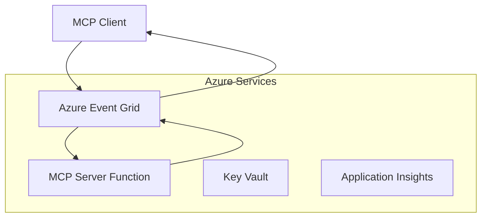
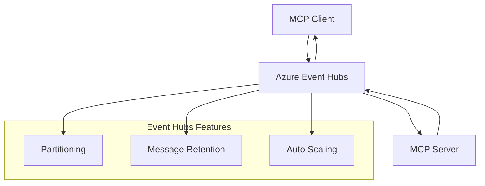

<!--
CO_OP_TRANSLATOR_METADATA:
{
  "original_hash": "c71c60af76120a517809a6cfba47e9a3",
  "translation_date": "2025-09-15T21:31:08+00:00",
  "source_file": "05-AdvancedTopics/mcp-transport/README.md",
  "language_code": "hi"
}
-->
# MCP कस्टम ट्रांसपोर्ट्स - उन्नत कार्यान्वयन गाइड

मॉडल कॉन्टेक्स्ट प्रोटोकॉल (MCP) ट्रांसपोर्ट मैकेनिज़म में लचीलापन प्रदान करता है, जिससे विशेष एंटरप्राइज़ वातावरण के लिए कस्टम कार्यान्वयन संभव हो पाता है। यह उन्नत गाइड Azure Event Grid और Azure Event Hubs का उपयोग करके स्केलेबल, क्लाउड-नेटिव MCP समाधान बनाने के लिए कस्टम ट्रांसपोर्ट कार्यान्वयन की खोज करता है।

## परिचय

हालांकि MCP के मानक ट्रांसपोर्ट (stdio और HTTP स्ट्रीमिंग) अधिकांश उपयोग मामलों के लिए पर्याप्त हैं, एंटरप्राइज़ वातावरण अक्सर बेहतर स्केलेबिलिटी, विश्वसनीयता, और मौजूदा क्लाउड इंफ्रास्ट्रक्चर के साथ एकीकरण के लिए विशेष ट्रांसपोर्ट मैकेनिज़म की आवश्यकता होती है। कस्टम ट्रांसपोर्ट MCP को क्लाउड-नेटिव मैसेजिंग सेवाओं का उपयोग करने में सक्षम बनाते हैं, जिससे असिंक्रोनस संचार, इवेंट-ड्रिवन आर्किटेक्चर, और वितरित प्रोसेसिंग संभव हो पाती है।

यह पाठ नवीनतम MCP स्पेसिफिकेशन (2025-06-18), Azure मैसेजिंग सेवाओं, और स्थापित एंटरप्राइज़ इंटीग्रेशन पैटर्न पर आधारित उन्नत ट्रांसपोर्ट कार्यान्वयन की खोज करता है।

### **MCP ट्रांसपोर्ट आर्किटेक्चर**

**MCP स्पेसिफिकेशन (2025-06-18) से:**

- **मानक ट्रांसपोर्ट्स**: stdio (अनुशंसित), HTTP स्ट्रीमिंग (रिमोट परिदृश्यों के लिए)
- **कस्टम ट्रांसपोर्ट्स**: कोई भी ट्रांसपोर्ट जो MCP मैसेज एक्सचेंज प्रोटोकॉल को लागू करता है
- **मैसेज फॉर्मेट**: JSON-RPC 2.0 MCP-विशिष्ट एक्सटेंशन्स के साथ
- **द्विदिश संचार**: नोटिफिकेशन और प्रतिक्रियाओं के लिए पूर्ण डुप्लेक्स संचार आवश्यक है

## सीखने के उद्देश्य

इस उन्नत पाठ के अंत तक, आप सक्षम होंगे:

- **कस्टम ट्रांसपोर्ट आवश्यकताओं को समझें**: MCP प्रोटोकॉल को किसी भी ट्रांसपोर्ट लेयर पर लागू करें और अनुपालन बनाए रखें
- **Azure Event Grid ट्रांसपोर्ट बनाएं**: Azure Event Grid का उपयोग करके इवेंट-ड्रिवन MCP सर्वर बनाएं जो सर्वरलेस स्केलेबिलिटी प्रदान करता है
- **Azure Event Hubs ट्रांसपोर्ट लागू करें**: Azure Event Hubs का उपयोग करके रीयल-टाइम स्ट्रीमिंग के लिए उच्च-थ्रूपुट MCP समाधान डिज़ाइन करें
- **एंटरप्राइज़ पैटर्न लागू करें**: कस्टम ट्रांसपोर्ट्स को मौजूदा Azure इंफ्रास्ट्रक्चर और सुरक्षा मॉडल के साथ एकीकृत करें
- **ट्रांसपोर्ट विश्वसनीयता संभालें**: एंटरप्राइज़ परिदृश्यों के लिए मैसेज स्थायित्व, क्रम, और त्रुटि प्रबंधन लागू करें
- **प्रदर्शन को अनुकूलित करें**: स्केल, विलंबता, और थ्रूपुट आवश्यकताओं के लिए ट्रांसपोर्ट समाधान डिज़ाइन करें

## **ट्रांसपोर्ट आवश्यकताएँ**

### **MCP स्पेसिफिकेशन (2025-06-18) से मुख्य आवश्यकताएँ:**

```yaml
Message Protocol:
  format: "JSON-RPC 2.0 with MCP extensions"
  bidirectional: "Full duplex communication required"
  ordering: "Message ordering must be preserved per session"
  
Transport Layer:
  reliability: "Transport MUST handle connection failures gracefully"
  security: "Transport MUST support secure communication"
  identification: "Each session MUST have unique identifier"
  
Custom Transport:
  compliance: "MUST implement complete MCP message exchange"
  extensibility: "MAY add transport-specific features"
  interoperability: "MUST maintain protocol compatibility"
```

## **Azure Event Grid ट्रांसपोर्ट कार्यान्वयन**

Azure Event Grid एक सर्वरलेस इवेंट रूटिंग सेवा प्रदान करता है, जो इवेंट-ड्रिवन MCP आर्किटेक्चर के लिए आदर्श है। यह कार्यान्वयन स्केलेबल, लूज़ली-कपल्ड MCP सिस्टम बनाने का प्रदर्शन करता है।

### **आर्किटेक्चर अवलोकन**



### **C# कार्यान्वयन - Event Grid ट्रांसपोर्ट**

```csharp
using Azure.Messaging.EventGrid;
using Microsoft.Extensions.Azure;
using System.Text.Json;

public class EventGridMcpTransport : IMcpTransport
{
    private readonly EventGridPublisherClient _publisher;
    private readonly string _topicEndpoint;
    private readonly string _clientId;
    
    public EventGridMcpTransport(string topicEndpoint, string accessKey, string clientId)
    {
        _publisher = new EventGridPublisherClient(
            new Uri(topicEndpoint), 
            new AzureKeyCredential(accessKey));
        _topicEndpoint = topicEndpoint;
        _clientId = clientId;
    }
    
    public async Task SendMessageAsync(McpMessage message)
    {
        var eventGridEvent = new EventGridEvent(
            subject: $"mcp/{_clientId}",
            eventType: "MCP.MessageReceived",
            dataVersion: "1.0",
            data: JsonSerializer.Serialize(message))
        {
            Id = Guid.NewGuid().ToString(),
            EventTime = DateTimeOffset.UtcNow
        };
        
        await _publisher.SendEventAsync(eventGridEvent);
    }
    
    public async Task<McpMessage> ReceiveMessageAsync(CancellationToken cancellationToken)
    {
        // Event Grid is push-based, so implement webhook receiver
        // This would typically be handled by Azure Functions trigger
        throw new NotImplementedException("Use EventGridTrigger in Azure Functions");
    }
}

// Azure Function for receiving Event Grid events
[FunctionName("McpEventGridReceiver")]
public async Task<IActionResult> HandleEventGridMessage(
    [EventGridTrigger] EventGridEvent eventGridEvent,
    ILogger log)
{
    try
    {
        var mcpMessage = JsonSerializer.Deserialize<McpMessage>(
            eventGridEvent.Data.ToString());
        
        // Process MCP message
        var response = await _mcpServer.ProcessMessageAsync(mcpMessage);
        
        // Send response back via Event Grid
        await _transport.SendMessageAsync(response);
        
        return new OkResult();
    }
    catch (Exception ex)
    {
        log.LogError(ex, "Error processing Event Grid MCP message");
        return new BadRequestResult();
    }
}
```

### **TypeScript कार्यान्वयन - Event Grid ट्रांसपोर्ट**

```typescript
import { EventGridPublisherClient, AzureKeyCredential } from "@azure/eventgrid";
import { McpTransport, McpMessage } from "./mcp-types";

export class EventGridMcpTransport implements McpTransport {
    private publisher: EventGridPublisherClient;
    private clientId: string;
    
    constructor(
        private topicEndpoint: string,
        private accessKey: string,
        clientId: string
    ) {
        this.publisher = new EventGridPublisherClient(
            topicEndpoint,
            new AzureKeyCredential(accessKey)
        );
        this.clientId = clientId;
    }
    
    async sendMessage(message: McpMessage): Promise<void> {
        const event = {
            id: crypto.randomUUID(),
            source: `mcp-client-${this.clientId}`,
            type: "MCP.MessageReceived",
            time: new Date(),
            data: message
        };
        
        await this.publisher.sendEvents([event]);
    }
    
    // Event-driven receive via Azure Functions
    onMessage(handler: (message: McpMessage) => Promise<void>): void {
        // Implementation would use Azure Functions Event Grid trigger
        // This is a conceptual interface for the webhook receiver
    }
}

// Azure Functions implementation
import { app, InvocationContext, EventGridEvent } from "@azure/functions";

app.eventGrid("mcpEventGridHandler", {
    handler: async (event: EventGridEvent, context: InvocationContext) => {
        try {
            const mcpMessage = event.data as McpMessage;
            
            // Process MCP message
            const response = await mcpServer.processMessage(mcpMessage);
            
            // Send response via Event Grid
            await transport.sendMessage(response);
            
        } catch (error) {
            context.error("Error processing MCP message:", error);
            throw error;
        }
    }
});
```

### **Python कार्यान्वयन - Event Grid ट्रांसपोर्ट**

```python
from azure.eventgrid import EventGridPublisherClient, EventGridEvent
from azure.core.credentials import AzureKeyCredential
import asyncio
import json
from typing import Callable, Optional
import uuid
from datetime import datetime

class EventGridMcpTransport:
    def __init__(self, topic_endpoint: str, access_key: str, client_id: str):
        self.client = EventGridPublisherClient(
            topic_endpoint, 
            AzureKeyCredential(access_key)
        )
        self.client_id = client_id
        self.message_handler: Optional[Callable] = None
    
    async def send_message(self, message: dict) -> None:
        """Send MCP message via Event Grid"""
        event = EventGridEvent(
            data=message,
            subject=f"mcp/{self.client_id}",
            event_type="MCP.MessageReceived",
            data_version="1.0"
        )
        
        await self.client.send(event)
    
    def on_message(self, handler: Callable[[dict], None]) -> None:
        """Register message handler for incoming events"""
        self.message_handler = handler

# Azure Functions implementation
import azure.functions as func
import logging

def main(event: func.EventGridEvent) -> None:
    """Azure Functions Event Grid trigger for MCP messages"""
    try:
        # Parse MCP message from Event Grid event
        mcp_message = json.loads(event.get_body().decode('utf-8'))
        
        # Process MCP message
        response = process_mcp_message(mcp_message)
        
        # Send response back via Event Grid
        # (Implementation would create new Event Grid client)
        
    except Exception as e:
        logging.error(f"Error processing MCP Event Grid message: {e}")
        raise
```

## **Azure Event Hubs ट्रांसपोर्ट कार्यान्वयन**

Azure Event Hubs MCP परिदृश्यों के लिए उच्च-थ्रूपुट, रीयल-टाइम स्ट्रीमिंग क्षमताएँ प्रदान करता है, जहाँ कम विलंबता और उच्च मैसेज वॉल्यूम की आवश्यकता होती है।

### **आर्किटेक्चर अवलोकन**



### **C# कार्यान्वयन - Event Hubs ट्रांसपोर्ट**

```csharp
using Azure.Messaging.EventHubs;
using Azure.Messaging.EventHubs.Producer;
using Azure.Messaging.EventHubs.Consumer;
using System.Text;

public class EventHubsMcpTransport : IMcpTransport, IDisposable
{
    private readonly EventHubProducerClient _producer;
    private readonly EventHubConsumerClient _consumer;
    private readonly string _consumerGroup;
    private readonly CancellationTokenSource _cancellationTokenSource;
    
    public EventHubsMcpTransport(
        string connectionString, 
        string eventHubName,
        string consumerGroup = "$Default")
    {
        _producer = new EventHubProducerClient(connectionString, eventHubName);
        _consumer = new EventHubConsumerClient(
            consumerGroup, 
            connectionString, 
            eventHubName);
        _consumerGroup = consumerGroup;
        _cancellationTokenSource = new CancellationTokenSource();
    }
    
    public async Task SendMessageAsync(McpMessage message)
    {
        var messageBody = JsonSerializer.Serialize(message);
        var eventData = new EventData(Encoding.UTF8.GetBytes(messageBody));
        
        // Add MCP-specific properties
        eventData.Properties.Add("MessageType", message.Method ?? "response");
        eventData.Properties.Add("MessageId", message.Id);
        eventData.Properties.Add("Timestamp", DateTimeOffset.UtcNow);
        
        await _producer.SendAsync(new[] { eventData });
    }
    
    public async Task StartReceivingAsync(
        Func<McpMessage, Task> messageHandler)
    {
        await foreach (PartitionEvent partitionEvent in _consumer.ReadEventsAsync(
            _cancellationTokenSource.Token))
        {
            try
            {
                var messageBody = Encoding.UTF8.GetString(
                    partitionEvent.Data.EventBody.ToArray());
                var mcpMessage = JsonSerializer.Deserialize<McpMessage>(messageBody);
                
                await messageHandler(mcpMessage);
            }
            catch (Exception ex)
            {
                // Handle deserialization or processing errors
                Console.WriteLine($"Error processing message: {ex.Message}");
            }
        }
    }
    
    public void Dispose()
    {
        _cancellationTokenSource?.Cancel();
        _producer?.DisposeAsync().AsTask().Wait();
        _consumer?.DisposeAsync().AsTask().Wait();
        _cancellationTokenSource?.Dispose();
    }
}
```

### **TypeScript कार्यान्वयन - Event Hubs ट्रांसपोर्ट**

```typescript
import { 
    EventHubProducerClient, 
    EventHubConsumerClient, 
    EventData 
} from "@azure/event-hubs";

export class EventHubsMcpTransport implements McpTransport {
    private producer: EventHubProducerClient;
    private consumer: EventHubConsumerClient;
    private isReceiving = false;
    
    constructor(
        private connectionString: string,
        private eventHubName: string,
        private consumerGroup: string = "$Default"
    ) {
        this.producer = new EventHubProducerClient(
            connectionString, 
            eventHubName
        );
        this.consumer = new EventHubConsumerClient(
            consumerGroup,
            connectionString,
            eventHubName
        );
    }
    
    async sendMessage(message: McpMessage): Promise<void> {
        const eventData: EventData = {
            body: JSON.stringify(message),
            properties: {
                messageType: message.method || "response",
                messageId: message.id,
                timestamp: new Date().toISOString()
            }
        };
        
        await this.producer.sendBatch([eventData]);
    }
    
    async startReceiving(
        messageHandler: (message: McpMessage) => Promise<void>
    ): Promise<void> {
        if (this.isReceiving) return;
        
        this.isReceiving = true;
        
        const subscription = this.consumer.subscribe({
            processEvents: async (events, context) => {
                for (const event of events) {
                    try {
                        const messageBody = event.body as string;
                        const mcpMessage: McpMessage = JSON.parse(messageBody);
                        
                        await messageHandler(mcpMessage);
                        
                        // Update checkpoint for at-least-once delivery
                        await context.updateCheckpoint(event);
                    } catch (error) {
                        console.error("Error processing Event Hubs message:", error);
                    }
                }
            },
            processError: async (err, context) => {
                console.error("Event Hubs error:", err);
            }
        });
    }
    
    async close(): Promise<void> {
        this.isReceiving = false;
        await this.producer.close();
        await this.consumer.close();
    }
}
```

### **Python कार्यान्वयन - Event Hubs ट्रांसपोर्ट**

```python
from azure.eventhub import EventHubProducerClient, EventHubConsumerClient
from azure.eventhub import EventData
import json
import asyncio
from typing import Callable, Dict, Any
import logging

class EventHubsMcpTransport:
    def __init__(
        self, 
        connection_string: str, 
        eventhub_name: str,
        consumer_group: str = "$Default"
    ):
        self.producer = EventHubProducerClient.from_connection_string(
            connection_string, 
            eventhub_name=eventhub_name
        )
        self.consumer = EventHubConsumerClient.from_connection_string(
            connection_string,
            consumer_group=consumer_group,
            eventhub_name=eventhub_name
        )
        self.is_receiving = False
    
    async def send_message(self, message: Dict[str, Any]) -> None:
        """Send MCP message via Event Hubs"""
        event_data = EventData(json.dumps(message))
        
        # Add MCP-specific properties
        event_data.properties = {
            "messageType": message.get("method", "response"),
            "messageId": message.get("id"),
            "timestamp": "2025-01-14T10:30:00Z"  # Use actual timestamp
        }
        
        async with self.producer:
            event_data_batch = await self.producer.create_batch()
            event_data_batch.add(event_data)
            await self.producer.send_batch(event_data_batch)
    
    async def start_receiving(
        self, 
        message_handler: Callable[[Dict[str, Any]], None]
    ) -> None:
        """Start receiving MCP messages from Event Hubs"""
        if self.is_receiving:
            return
        
        self.is_receiving = True
        
        async with self.consumer:
            await self.consumer.receive(
                on_event=self._on_event_received(message_handler),
                starting_position="-1"  # Start from beginning
            )
    
    def _on_event_received(self, handler: Callable):
        """Internal event handler wrapper"""
        async def handle_event(partition_context, event):
            try:
                # Parse MCP message from Event Hubs event
                message_body = event.body_as_str(encoding='UTF-8')
                mcp_message = json.loads(message_body)
                
                # Process MCP message
                await handler(mcp_message)
                
                # Update checkpoint for at-least-once delivery
                await partition_context.update_checkpoint(event)
                
            except Exception as e:
                logging.error(f"Error processing Event Hubs message: {e}")
        
        return handle_event
    
    async def close(self) -> None:
        """Clean up transport resources"""
        self.is_receiving = False
        await self.producer.close()
        await self.consumer.close()
```

## **उन्नत ट्रांसपोर्ट पैटर्न**

### **मैसेज स्थायित्व और विश्वसनीयता**

```csharp
// Implementing message durability with retry logic
public class ReliableTransportWrapper : IMcpTransport
{
    private readonly IMcpTransport _innerTransport;
    private readonly RetryPolicy _retryPolicy;
    
    public async Task SendMessageAsync(McpMessage message)
    {
        await _retryPolicy.ExecuteAsync(async () =>
        {
            try
            {
                await _innerTransport.SendMessageAsync(message);
            }
            catch (TransportException ex) when (ex.IsRetryable)
            {
                // Log and retry
                throw;
            }
        });
    }
}
```

### **ट्रांसपोर्ट सुरक्षा एकीकरण**

```csharp
// Integrating Azure Key Vault for transport security
public class SecureTransportFactory
{
    private readonly SecretClient _keyVaultClient;
    
    public async Task<IMcpTransport> CreateEventGridTransportAsync()
    {
        var accessKey = await _keyVaultClient.GetSecretAsync("EventGridAccessKey");
        var topicEndpoint = await _keyVaultClient.GetSecretAsync("EventGridTopic");
        
        return new EventGridMcpTransport(
            topicEndpoint.Value.Value,
            accessKey.Value.Value,
            Environment.MachineName
        );
    }
}
```

### **ट्रांसपोर्ट मॉनिटरिंग और ऑब्ज़र्वेबिलिटी**

```csharp
// Adding telemetry to custom transports
public class ObservableTransport : IMcpTransport
{
    private readonly IMcpTransport _transport;
    private readonly ILogger _logger;
    private readonly TelemetryClient _telemetryClient;
    
    public async Task SendMessageAsync(McpMessage message)
    {
        using var activity = Activity.StartActivity("MCP.Transport.Send");
        activity?.SetTag("transport.type", "EventGrid");
        activity?.SetTag("message.method", message.Method);
        
        var stopwatch = Stopwatch.StartNew();
        
        try
        {
            await _transport.SendMessageAsync(message);
            
            _telemetryClient.TrackDependency(
                "EventGrid",
                "SendMessage",
                DateTime.UtcNow.Subtract(stopwatch.Elapsed),
                stopwatch.Elapsed,
                true
            );
        }
        catch (Exception ex)
        {
            _telemetryClient.TrackException(ex);
            throw;
        }
    }
}
```

## **एंटरप्राइज़ इंटीग्रेशन परिदृश्य**

### **परिदृश्य 1: वितरित MCP प्रोसेसिंग**

Azure Event Grid का उपयोग करके MCP अनुरोधों को कई प्रोसेसिंग नोड्स में वितरित करना:

```yaml
Architecture:
  - MCP Client sends requests to Event Grid topic
  - Multiple Azure Functions subscribe to process different tool types
  - Results aggregated and returned via separate response topic
  
Benefits:
  - Horizontal scaling based on message volume
  - Fault tolerance through redundant processors
  - Cost optimization with serverless compute
```

### **परिदृश्य 2: रीयल-टाइम MCP स्ट्रीमिंग**

Azure Event Hubs का उपयोग करके उच्च-आवृत्ति MCP इंटरैक्शन:

```yaml
Architecture:
  - MCP Client streams continuous requests via Event Hubs
  - Stream Analytics processes and routes messages
  - Multiple consumers handle different aspect of processing
  
Benefits:
  - Low latency for real-time scenarios
  - High throughput for batch processing
  - Built-in partitioning for parallel processing
```

### **परिदृश्य 3: हाइब्रिड ट्रांसपोर्ट आर्किटेक्चर**

विभिन्न उपयोग मामलों के लिए कई ट्रांसपोर्ट्स को संयोजित करना:

```csharp
public class HybridMcpTransport : IMcpTransport
{
    private readonly IMcpTransport _realtimeTransport; // Event Hubs
    private readonly IMcpTransport _batchTransport;    // Event Grid
    private readonly IMcpTransport _fallbackTransport; // HTTP Streaming
    
    public async Task SendMessageAsync(McpMessage message)
    {
        // Route based on message characteristics
        var transport = message.Method switch
        {
            "tools/call" when IsRealtime(message) => _realtimeTransport,
            "resources/read" when IsBatch(message) => _batchTransport,
            _ => _fallbackTransport
        };
        
        await transport.SendMessageAsync(message);
    }
}
```

## **प्रदर्शन अनुकूलन**

### **Event Grid के लिए मैसेज बैचिंग**

```csharp
public class BatchingEventGridTransport : IMcpTransport
{
    private readonly List<McpMessage> _messageBuffer = new();
    private readonly Timer _flushTimer;
    private const int MaxBatchSize = 100;
    
    public async Task SendMessageAsync(McpMessage message)
    {
        lock (_messageBuffer)
        {
            _messageBuffer.Add(message);
            
            if (_messageBuffer.Count >= MaxBatchSize)
            {
                _ = Task.Run(FlushMessages);
            }
        }
    }
    
    private async Task FlushMessages()
    {
        List<McpMessage> toSend;
        lock (_messageBuffer)
        {
            toSend = new List<McpMessage>(_messageBuffer);
            _messageBuffer.Clear();
        }
        
        if (toSend.Any())
        {
            var events = toSend.Select(CreateEventGridEvent);
            await _publisher.SendEventsAsync(events);
        }
    }
}
```

### **Event Hubs के लिए पार्टिशनिंग रणनीति**

```csharp
public class PartitionedEventHubsTransport : IMcpTransport
{
    public async Task SendMessageAsync(McpMessage message)
    {
        // Partition by client ID for session affinity
        var partitionKey = ExtractClientId(message);
        
        var eventData = new EventData(JsonSerializer.SerializeToUtf8Bytes(message))
        {
            PartitionKey = partitionKey
        };
        
        await _producer.SendAsync(new[] { eventData });
    }
}
```

## **कस्टम ट्रांसपोर्ट्स का परीक्षण**

### **टेस्ट डबल्स के साथ यूनिट परीक्षण**

```csharp
[Test]
public async Task EventGridTransport_SendMessage_PublishesCorrectEvent()
{
    // Arrange
    var mockPublisher = new Mock<EventGridPublisherClient>();
    var transport = new EventGridMcpTransport(mockPublisher.Object);
    var message = new McpMessage { Method = "tools/list", Id = "test-123" };
    
    // Act
    await transport.SendMessageAsync(message);
    
    // Assert
    mockPublisher.Verify(
        x => x.SendEventAsync(
            It.Is<EventGridEvent>(e => 
                e.EventType == "MCP.MessageReceived" &&
                e.Subject == "mcp/test-client"
            )
        ),
        Times.Once
    );
}
```

### **Azure टेस्ट कंटेनर्स के साथ इंटीग्रेशन परीक्षण**

```csharp
[Test]
public async Task EventHubsTransport_IntegrationTest()
{
    // Using Testcontainers for integration testing
    var eventHubsContainer = new EventHubsContainer()
        .WithEventHub("test-hub");
    
    await eventHubsContainer.StartAsync();
    
    var transport = new EventHubsMcpTransport(
        eventHubsContainer.GetConnectionString(),
        "test-hub"
    );
    
    // Test message round-trip
    var sentMessage = new McpMessage { Method = "test", Id = "123" };
    McpMessage receivedMessage = null;
    
    await transport.StartReceivingAsync(msg => {
        receivedMessage = msg;
        return Task.CompletedTask;
    });
    
    await transport.SendMessageAsync(sentMessage);
    await Task.Delay(1000); // Allow for message processing
    
    Assert.That(receivedMessage?.Id, Is.EqualTo("123"));
}
```

## **सर्वोत्तम प्रथाएँ और दिशानिर्देश**

### **ट्रांसपोर्ट डिज़ाइन सिद्धांत**

1. **इडेमपोटेंसी**: डुप्लिकेट को संभालने के लिए मैसेज प्रोसेसिंग को इडेमपोटेंट बनाएं
2. **त्रुटि प्रबंधन**: व्यापक त्रुटि प्रबंधन और डेड लेटर क्व्यू लागू करें
3. **मॉनिटरिंग**: विस्तृत टेलीमेट्री और हेल्थ चेक्स जोड़ें
4. **सुरक्षा**: प्रबंधित पहचान और न्यूनतम विशेषाधिकार एक्सेस का उपयोग करें
5. **प्रदर्शन**: अपनी विशिष्ट विलंबता और थ्रूपुट आवश्यकताओं के लिए डिज़ाइन करें

### **Azure-विशिष्ट सिफारिशें**

1. **प्रबंधित पहचान का उपयोग करें**: प्रोडक्शन में कनेक्शन स्ट्रिंग्स से बचें
2. **सर्किट ब्रेकर्स लागू करें**: Azure सेवा आउटेज से बचाव करें
3. **लागत मॉनिटर करें**: मैसेज वॉल्यूम और प्रोसेसिंग लागत को ट्रैक करें
4. **स्केल की योजना बनाएं**: प्रारंभिक चरण में पार्टिशनिंग और स्केलिंग रणनीतियाँ डिज़ाइन करें
5. **पूरी तरह से परीक्षण करें**: व्यापक परीक्षण के लिए Azure DevTest Labs का उपयोग करें

## **निष्कर्ष**

कस्टम MCP ट्रांसपोर्ट्स Azure की मैसेजिंग सेवाओं का उपयोग करके शक्तिशाली एंटरप्राइज़ परिदृश्य सक्षम करते हैं। Event Grid या Event Hubs ट्रांसपोर्ट्स को लागू करके, आप स्केलेबल, विश्वसनीय MCP समाधान बना सकते हैं जो मौजूदा Azure इंफ्रास्ट्रक्चर के साथ सहजता से एकीकृत होते हैं।

प्रदान किए गए उदाहरण कस्टम ट्रांसपोर्ट्स को लागू करने के लिए प्रोडक्शन-रेडी पैटर्न का प्रदर्शन करते हैं, MCP प्रोटोकॉल अनुपालन और Azure सर्वोत्तम प्रथाओं को बनाए रखते हुए।

## **अतिरिक्त संसाधन**

- [MCP स्पेसिफिकेशन 2025-06-18](https://spec.modelcontextprotocol.io/specification/2025-06-18/)
- [Azure Event Grid दस्तावेज़](https://docs.microsoft.com/azure/event-grid/)
- [Azure Event Hubs दस्तावेज़](https://docs.microsoft.com/azure/event-hubs/)
- [Azure Functions Event Grid ट्रिगर](https://docs.microsoft.com/azure/azure-functions/functions-bindings-event-grid)
- [Azure SDK for .NET](https://github.com/Azure/azure-sdk-for-net)
- [Azure SDK for TypeScript](https://github.com/Azure/azure-sdk-for-js)
- [Azure SDK for Python](https://github.com/Azure/azure-sdk-for-python)

---

> *यह गाइड प्रोडक्शन MCP सिस्टम के लिए व्यावहारिक कार्यान्वयन पैटर्न पर केंद्रित है। हमेशा अपने विशिष्ट आवश्यकताओं और Azure सेवा सीमाओं के खिलाफ ट्रांसपोर्ट कार्यान्वयन को मान्य करें।*
> **वर्तमान मानक**: यह गाइड [MCP स्पेसिफिकेशन 2025-06-18](https://spec.modelcontextprotocol.io/specification/2025-06-18/) ट्रांसपोर्ट आवश्यकताओं और एंटरप्राइज़ वातावरण के लिए उन्नत ट्रांसपोर्ट पैटर्न को दर्शाता है।

## आगे क्या करें
- [6. सामुदायिक योगदान](../../06-CommunityContributions/README.md)

---

**अस्वीकरण**:  
यह दस्तावेज़ AI अनुवाद सेवा [Co-op Translator](https://github.com/Azure/co-op-translator) का उपयोग करके अनुवादित किया गया है। जबकि हम सटीकता सुनिश्चित करने का प्रयास करते हैं, कृपया ध्यान दें कि स्वचालित अनुवाद में त्रुटियां या अशुद्धियां हो सकती हैं। मूल भाषा में उपलब्ध मूल दस्तावेज़ को प्रामाणिक स्रोत माना जाना चाहिए। महत्वपूर्ण जानकारी के लिए, पेशेवर मानव अनुवाद की सिफारिश की जाती है। इस अनुवाद के उपयोग से उत्पन्न किसी भी गलतफहमी या गलत व्याख्या के लिए हम उत्तरदायी नहीं हैं।