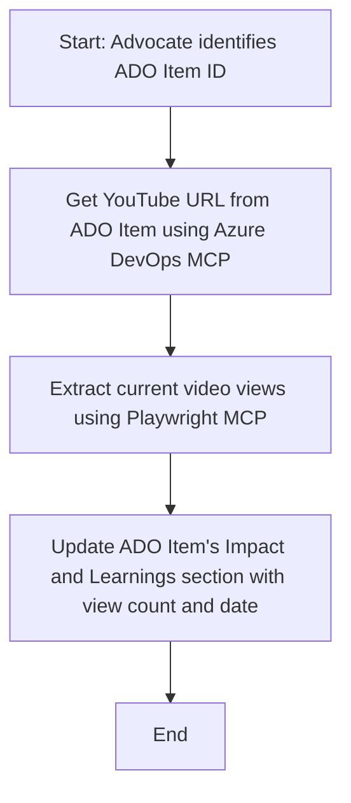

<!--
CO_OP_TRANSLATOR_METADATA:
{
  "original_hash": "14a2dfbea55ef735660a06bd6bdfe5f3",
  "translation_date": "2025-07-14T06:10:27+00:00",
  "source_file": "09-CaseStudy/UpdateADOItemsFromYT.md",
  "language_code": "hi"
}
-->
# केस स्टडी: MCP के साथ YouTube डेटा से Azure DevOps आइटम अपडेट करना

> **Disclaimer:** पहले से मौजूद ऑनलाइन टूल्स और रिपोर्ट्स हैं जो YouTube जैसे प्लेटफॉर्म से डेटा लेकर Azure DevOps आइटम्स को अपडेट करने की प्रक्रिया को स्वचालित कर सकते हैं। नीचे दिया गया परिदृश्य केवल एक उदाहरण के तौर पर प्रस्तुत किया गया है ताकि यह दिखाया जा सके कि MCP टूल्स को ऑटोमेशन और इंटीग्रेशन कार्यों के लिए कैसे इस्तेमाल किया जा सकता है।

## अवलोकन

यह केस स्टडी दिखाती है कि Model Context Protocol (MCP) और इसके टूल्स का उपयोग कैसे Azure DevOps (ADO) वर्क आइटम्स को ऑनलाइन प्लेटफॉर्म्स जैसे YouTube से प्राप्त जानकारी के साथ अपडेट करने के लिए ऑटोमेट किया जा सकता है। वर्णित परिदृश्य इन टूल्स की व्यापक क्षमताओं में से एक उदाहरण है, जिन्हें कई समान ऑटोमेशन आवश्यकताओं के लिए अनुकूलित किया जा सकता है।

इस उदाहरण में, एक Advocate ऑनलाइन सेशंस को ADO आइटम्स के माध्यम से ट्रैक करता है, जहां प्रत्येक आइटम में YouTube वीडियो URL शामिल होता है। MCP टूल्स का उपयोग करके, Advocate ADO आइटम्स को नवीनतम वीडियो मेट्रिक्स जैसे व्यू काउंट के साथ नियमित और स्वचालित तरीके से अपडेट रख सकता है। यह तरीका अन्य उपयोग मामलों में भी लागू किया जा सकता है जहां ऑनलाइन स्रोतों से जानकारी को ADO या अन्य सिस्टम्स में इंटीग्रेट करना होता है।

## परिदृश्य

एक Advocate ऑनलाइन सेशंस और कम्युनिटी एंगेजमेंट्स के प्रभाव को ट्रैक करने के लिए जिम्मेदार है। प्रत्येक सेशन को 'DevRel' प्रोजेक्ट में एक ADO वर्क आइटम के रूप में लॉग किया जाता है, और वर्क आइटम में YouTube वीडियो URL के लिए एक फील्ड होता है। सेशन की पहुंच की सही रिपोर्टिंग के लिए, Advocate को ADO आइटम को वर्तमान वीडियो व्यूज़ की संख्या और उस जानकारी को प्राप्त करने की तारीख के साथ अपडेट करना होता है।

## उपयोग किए गए टूल्स

- [Azure DevOps MCP](https://github.com/microsoft/azure-devops-mcp): MCP के माध्यम से ADO वर्क आइटम्स तक प्रोग्रामेटिक एक्सेस और अपडेट की सुविधा देता है।
- [Playwright MCP](https://github.com/microsoft/playwright-mcp): ब्राउज़र क्रियाओं को स्वचालित करता है ताकि वेब पेजों से लाइव डेटा, जैसे YouTube वीडियो स्टैटिस्टिक्स, निकाले जा सकें।

## चरण-दर-चरण कार्यप्रवाह

1. **ADO आइटम की पहचान करें**: 'DevRel' प्रोजेक्ट में ADO वर्क आइटम ID (जैसे 1234) से शुरुआत करें।
2. **YouTube URL प्राप्त करें**: Azure DevOps MCP टूल का उपयोग करके वर्क आइटम से YouTube URL प्राप्त करें।
3. **वीडियो व्यूज़ निकालें**: Playwright MCP टूल का उपयोग करके YouTube URL पर जाएं और वर्तमान व्यू काउंट निकालें।
4. **ADO आइटम अपडेट करें**: Azure DevOps MCP टूल का उपयोग करके 'Impact and Learnings' सेक्शन में नवीनतम व्यू काउंट और प्राप्ति की तारीख लिखें।

## उदाहरण प्रॉम्प्ट

```bash
- Work with the ADO Item ID: 1234
- The project is '2025-Awesome'
- Get the YouTube URL for the ADO item
- Use Playwright to get the current views from the YouTube video
- Update the ADO item with the current video views and the updated date of the information
```

## Mermaid फ्लोचार्ट



## तकनीकी कार्यान्वयन

- **MCP ऑर्केस्ट्रेशन**: यह वर्कफ़्लो एक MCP सर्वर द्वारा संचालित होता है, जो Azure DevOps MCP और Playwright MCP टूल्स के उपयोग का समन्वय करता है।
- **स्वचालन**: इस प्रक्रिया को मैन्युअली ट्रिगर किया जा सकता है या नियमित अंतराल पर चलाने के लिए शेड्यूल किया जा सकता है ताकि ADO आइटम्स अपडेट रहें।
- **विस्तारशीलता**: इसी पैटर्न को अन्य ऑनलाइन मेट्रिक्स (जैसे लाइक्स, कमेंट्स) या अन्य प्लेटफॉर्म्स से डेटा लेकर ADO आइटम्स अपडेट करने के लिए बढ़ाया जा सकता है।

## परिणाम और प्रभाव

- **कुशलता**: Advocate के लिए वीडियो मेट्रिक्स की प्राप्ति और अपडेट को स्वचालित करके मैनुअल प्रयास कम करता है।
- **सटीकता**: सुनिश्चित करता है कि ADO आइटम्स ऑनलाइन स्रोतों से उपलब्ध सबसे ताजा डेटा को दर्शाएं।
- **पुनरावृत्ति**: समान परिदृश्यों के लिए पुन: उपयोग योग्य वर्कफ़्लो प्रदान करता है जिसमें अन्य डेटा स्रोत या मेट्रिक्स शामिल हों।

## संदर्भ

- [Azure DevOps MCP](https://github.com/microsoft/azure-devops-mcp)
- [Playwright MCP](https://github.com/microsoft/playwright-mcp)
- [Model Context Protocol (MCP)](https://modelcontextprotocol.io/)

**अस्वीकरण**:  
यह दस्तावेज़ AI अनुवाद सेवा [Co-op Translator](https://github.com/Azure/co-op-translator) का उपयोग करके अनुवादित किया गया है। जबकि हम सटीकता के लिए प्रयासरत हैं, कृपया ध्यान दें कि स्वचालित अनुवादों में त्रुटियाँ या अशुद्धियाँ हो सकती हैं। मूल दस्तावेज़ अपनी मूल भाषा में ही अधिकारिक स्रोत माना जाना चाहिए। महत्वपूर्ण जानकारी के लिए, पेशेवर मानव अनुवाद की सलाह दी जाती है। इस अनुवाद के उपयोग से उत्पन्न किसी भी गलतफहमी या गलत व्याख्या के लिए हम जिम्मेदार नहीं हैं।