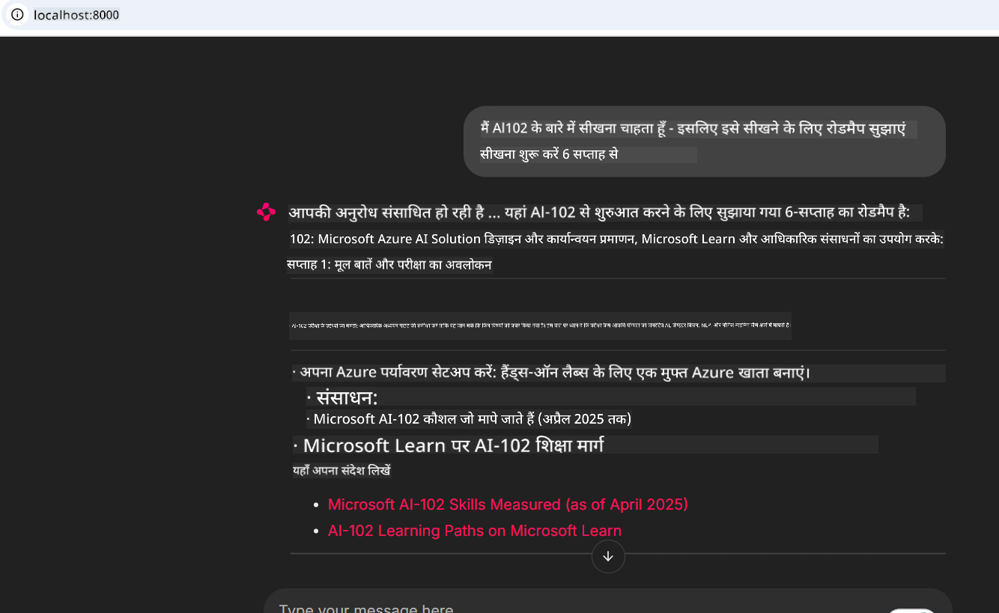
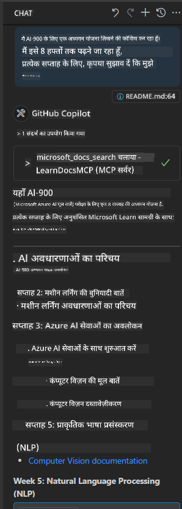

<!--
CO_OP_TRANSLATOR_METADATA:
{
  "original_hash": "4319d291c9d124ecafea52b3d04bfa0e",
  "translation_date": "2025-07-14T06:20:41+00:00",
  "source_file": "09-CaseStudy/docs-mcp/README.md",
  "language_code": "hi"
}
-->
# केस स्टडी: क्लाइंट से Microsoft Learn Docs MCP सर्वर से कनेक्ट करना

क्या आपने कभी खुद को डॉक्यूमेंटेशन साइट्स, Stack Overflow, और अनगिनत सर्च इंजन टैब्स के बीच झूलते हुए पाया है, जबकि आप अपने कोड की समस्या को हल करने की कोशिश कर रहे हों? शायद आपके पास डॉक्यूमेंट्स के लिए एक अलग मॉनिटर है, या आप लगातार अपने IDE और ब्राउज़र के बीच Alt-Tab कर रहे हैं। क्या बेहतर नहीं होगा अगर आप डॉक्यूमेंटेशन को सीधे अपने वर्कफ़्लो में ला सकें—अपने ऐप्स, IDE, या यहां तक कि अपने कस्टम टूल्स में इंटीग्रेट करके? इस केस स्टडी में, हम यही करेंगे: अपने क्लाइंट एप्लिकेशन से सीधे Microsoft Learn Docs MCP सर्वर से कनेक्ट करना।

## अवलोकन

आधुनिक विकास केवल कोड लिखने तक सीमित नहीं है—यह सही समय पर सही जानकारी खोजने के बारे में है। डॉक्यूमेंटेशन हर जगह है, लेकिन यह शायद ही कभी वहां होता है जहां आपको इसकी सबसे ज्यादा जरूरत होती है: आपके टूल्स और वर्कफ़्लो के अंदर। डॉक्यूमेंटेशन को सीधे अपने एप्लिकेशन में इंटीग्रेट करके, आप समय बचा सकते हैं, संदर्भ बदलने की जरूरत कम कर सकते हैं, और उत्पादकता बढ़ा सकते हैं। इस सेक्शन में, हम आपको दिखाएंगे कि कैसे एक क्लाइंट को Microsoft Learn Docs MCP सर्वर से कनेक्ट करें, ताकि आप अपने ऐप को छोड़े बिना रियल-टाइम, संदर्भ-सचेत डॉक्यूमेंटेशन एक्सेस कर सकें।

हम कनेक्शन स्थापित करने, अनुरोध भेजने, और स्ट्रीमिंग प्रतिक्रियाओं को कुशलतापूर्वक संभालने की प्रक्रिया से गुजरेंगे। यह तरीका न केवल आपके वर्कफ़्लो को सरल बनाता है, बल्कि स्मार्ट और अधिक सहायक डेवलपर टूल्स बनाने के द्वार भी खोलता है।

## सीखने के उद्देश्य

हम यह क्यों कर रहे हैं? क्योंकि सबसे अच्छे डेवलपर अनुभव वे होते हैं जो बाधाओं को दूर करते हैं। कल्पना करें एक ऐसी दुनिया जहां आपका कोड एडिटर, चैटबोट, या वेब ऐप आपके डॉक्यूमेंटेशन सवालों का तुरंत जवाब दे सके, Microsoft Learn की नवीनतम सामग्री का उपयोग करते हुए। इस अध्याय के अंत तक, आप जानेंगे कि कैसे:

- डॉक्यूमेंटेशन के लिए MCP सर्वर-क्लाइंट संचार की बुनियादी बातें समझें
- Microsoft Learn Docs MCP सर्वर से कनेक्ट करने के लिए कंसोल या वेब एप्लिकेशन लागू करें
- रियल-टाइम डॉक्यूमेंटेशन प्राप्ति के लिए स्ट्रीमिंग HTTP क्लाइंट का उपयोग करें
- अपने एप्लिकेशन में डॉक्यूमेंटेशन प्रतिक्रियाओं को लॉग और व्याख्या करें

आप देखेंगे कि ये कौशल आपको ऐसे टूल्स बनाने में मदद करेंगे जो केवल प्रतिक्रियाशील नहीं, बल्कि वास्तव में इंटरैक्टिव और संदर्भ-सचेत हों।

## परिदृश्य 1 - MCP के साथ रियल-टाइम डॉक्यूमेंटेशन प्राप्ति

इस परिदृश्य में, हम आपको दिखाएंगे कि कैसे एक क्लाइंट को Microsoft Learn Docs MCP सर्वर से कनेक्ट करें, ताकि आप अपने ऐप को छोड़े बिना रियल-टाइम, संदर्भ-सचेत डॉक्यूमेंटेशन एक्सेस कर सकें।

आइए इसे व्यावहारिक रूप में करें। आपका कार्य एक ऐसा ऐप लिखना है जो Microsoft Learn Docs MCP सर्वर से कनेक्ट हो, `microsoft_docs_search` टूल को कॉल करे, और स्ट्रीमिंग प्रतिक्रिया को कंसोल में लॉग करे।

### यह तरीका क्यों?
क्योंकि यह अधिक उन्नत इंटीग्रेशन बनाने की नींव है—चाहे आप एक चैटबोट, IDE एक्सटेंशन, या वेब डैशबोर्ड बनाना चाहते हों।

आपको इस परिदृश्य के लिए कोड और निर्देश इस केस स्टडी के [`solution`](./solution/README.md) फोल्डर में मिलेंगे। ये कदम आपको कनेक्शन सेटअप करने में मार्गदर्शन करेंगे:
- कनेक्शन के लिए आधिकारिक MCP SDK और स्ट्रीम करने योग्य HTTP क्लाइंट का उपयोग करें
- डॉक्यूमेंटेशन प्राप्त करने के लिए क्वेरी पैरामीटर के साथ `microsoft_docs_search` टूल को कॉल करें
- उचित लॉगिंग और त्रुटि प्रबंधन लागू करें
- उपयोगकर्ताओं को कई खोज क्वेरी दर्ज करने की अनुमति देने के लिए एक इंटरैक्टिव कंसोल इंटरफ़ेस बनाएं

यह परिदृश्य दिखाता है कि कैसे:
- Docs MCP सर्वर से कनेक्ट करें
- एक क्वेरी भेजें
- परिणामों को पार्स और प्रिंट करें

यहाँ समाधान चलाने का एक उदाहरण है:

```
Prompt> What is Azure Key Vault?
Answer> Azure Key Vault is a cloud service for securely storing and accessing secrets. ...
```

नीचे एक न्यूनतम नमूना समाधान है। पूरा कोड और विवरण समाधान फोल्डर में उपलब्ध हैं।

<details>
<summary>Python</summary>

```python
import asyncio
from mcp.client.streamable_http import streamablehttp_client
from mcp import ClientSession

async def main():
    async with streamablehttp_client("https://learn.microsoft.com/api/mcp") as (read_stream, write_stream, _):
        async with ClientSession(read_stream, write_stream) as session:
            await session.initialize()
            result = await session.call_tool("microsoft_docs_search", {"query": "Azure Functions best practices"})
            print(result.content)

if __name__ == "__main__":
    asyncio.run(main())
```

- पूर्ण कार्यान्वयन और लॉगिंग के लिए, [`scenario1.py`](../../../../09-CaseStudy/docs-mcp/solution/python/scenario1.py) देखें।
- स्थापना और उपयोग निर्देशों के लिए, उसी फोल्डर में [`README.md`](./solution/python/README.md) देखें।
</details>

## परिदृश्य 2 - MCP के साथ इंटरैक्टिव स्टडी प्लान जनरेटर वेब ऐप

इस परिदृश्य में, आप सीखेंगे कि Docs MCP को वेब विकास परियोजना में कैसे इंटीग्रेट करें। लक्ष्य है उपयोगकर्ताओं को Microsoft Learn डॉक्यूमेंटेशन को सीधे वेब इंटरफ़ेस से खोजने में सक्षम बनाना, जिससे डॉक्यूमेंटेशन आपके ऐप या साइट के भीतर तुरंत सुलभ हो।

आप देखेंगे कि कैसे:
- एक वेब ऐप सेटअप करें
- Docs MCP सर्वर से कनेक्ट करें
- उपयोगकर्ता इनपुट को संभालें और परिणाम दिखाएं

यहाँ समाधान चलाने का एक उदाहरण है:

```
User> I want to learn about AI102 - so suggest the roadmap to get it started from learn for 6 weeks

Assistant> Here’s a detailed 6-week roadmap to start your preparation for the AI-102: Designing and Implementing a Microsoft Azure AI Solution certification, using official Microsoft resources and focusing on exam skills areas:

---
## Week 1: Introduction & Fundamentals
- **Understand the Exam**: Review the [AI-102 exam skills outline](https://learn.microsoft.com/en-us/credentials/certifications/exams/ai-102/).
- **Set up Azure**: Sign up for a free Azure account if you don't have one.
- **Learning Path**: [Introduction to Azure AI services](https://learn.microsoft.com/en-us/training/modules/intro-to-azure-ai/)
- **Focus**: Get familiar with Azure portal, AI capabilities, and necessary tools.

....more weeks of the roadmap...

Let me know if you want module-specific recommendations or need more customized weekly tasks!
```

नीचे एक न्यूनतम नमूना समाधान है। पूरा कोड और विवरण समाधान फोल्डर में उपलब्ध हैं।



<details>
<summary>Python (Chainlit)</summary>

Chainlit एक फ्रेमवर्क है जो संवादात्मक AI वेब ऐप्स बनाने के लिए है। यह इंटरैक्टिव चैटबोट्स और असिस्टेंट्स बनाना आसान बनाता है जो MCP टूल्स को कॉल कर सकते हैं और रियल टाइम में परिणाम दिखा सकते हैं। यह तेज़ प्रोटोटाइपिंग और उपयोगकर्ता-मित्र इंटरफेस के लिए आदर्श है।

```python
import chainlit as cl
import requests

MCP_URL = "https://learn.microsoft.com/api/mcp"

@cl.on_message
def handle_message(message):
    query = {"question": message}
    response = requests.post(MCP_URL, json=query)
    if response.ok:
        result = response.json()
        cl.Message(content=result.get("answer", "No answer found.")).send()
    else:
        cl.Message(content="Error: " + response.text).send()
```

- पूर्ण कार्यान्वयन के लिए, [`scenario2.py`](../../../../09-CaseStudy/docs-mcp/solution/python/scenario2.py) देखें।
- सेटअप और चलाने के निर्देशों के लिए, [`README.md`](./solution/python/README.md) देखें।
</details>

## परिदृश्य 3: VS Code में MCP सर्वर के साथ इन-एडिटर डॉक्यूमेंटेशन

यदि आप Microsoft Learn Docs को सीधे अपने VS Code में पाना चाहते हैं (ब्राउज़र टैब्स स्विच किए बिना), तो आप अपने एडिटर में MCP सर्वर का उपयोग कर सकते हैं। इससे आप:
- VS Code में कोडिंग वातावरण छोड़े बिना डॉक्यूमेंटेशन खोज और पढ़ सकते हैं।
- डॉक्यूमेंटेशन का संदर्भ दे सकते हैं और README या कोर्स फाइलों में सीधे लिंक डाल सकते हैं।
- GitHub Copilot और MCP को मिलाकर एक सहज, AI-संचालित डॉक्यूमेंटेशन वर्कफ़्लो का लाभ उठा सकते हैं।

**आप देखेंगे कि कैसे:**
- अपने वर्कस्पेस रूट में एक वैध `.vscode/mcp.json` फ़ाइल जोड़ें (नीचे उदाहरण देखें)।
- MCP पैनल खोलें या VS Code में कमांड पैलेट का उपयोग करके डॉक्यूमेंटेशन खोजें और डालें।
- काम करते हुए अपने मार्कडाउन फाइलों में सीधे डॉक्यूमेंटेशन का संदर्भ दें।
- इस वर्कफ़्लो को GitHub Copilot के साथ मिलाकर और भी अधिक उत्पादकता प्राप्त करें।

यहाँ VS Code में MCP सर्वर सेटअप करने का एक उदाहरण है:

```json
{
  "servers": {
    "LearnDocsMCP": {
      "url": "https://learn.microsoft.com/api/mcp"
    }
  }
}
```

</details>

> स्क्रीनशॉट्स और चरण-दर-चरण मार्गदर्शिका के लिए, [`README.md`](./solution/scenario3/README.md) देखें।



यह तरीका तकनीकी कोर्स बनाने, डॉक्यूमेंटेशन लिखने, या बार-बार संदर्भ की जरूरत वाले कोड विकास के लिए आदर्श है।

## मुख्य निष्कर्ष

डॉक्यूमेंटेशन को सीधे अपने टूल्स में इंटीग्रेट करना केवल सुविधा नहीं है—यह उत्पादकता के लिए एक बड़ा बदलाव है। Microsoft Learn Docs MCP सर्वर से अपने क्लाइंट को कनेक्ट करके, आप:

- अपने कोड और डॉक्यूमेंटेशन के बीच संदर्भ बदलने की जरूरत खत्म कर सकते हैं
- रियल-टाइम में अद्यतन, संदर्भ-सचेत डॉक्यूमेंटेशन प्राप्त कर सकते हैं
- स्मार्ट, अधिक इंटरैक्टिव डेवलपर टूल्स बना सकते हैं

ये कौशल आपको ऐसे समाधान बनाने में मदद करेंगे जो न केवल प्रभावी हों, बल्कि उपयोग में आनंददायक भी हों।

## अतिरिक्त संसाधन

अपनी समझ को गहरा करने के लिए, इन आधिकारिक संसाधनों का अन्वेषण करें:

- [Microsoft Learn Docs MCP Server (GitHub)](https://github.com/MicrosoftDocs/mcp)
- [Azure MCP Server के साथ शुरुआत करें (mcp-python)](https://learn.microsoft.com/en-us/azure/developer/azure-mcp-server/get-started#create-the-python-app)
- [Azure MCP Server क्या है?](https://learn.microsoft.com/en-us/azure/developer/azure-mcp-server/)
- [Model Context Protocol (MCP) परिचय](https://modelcontextprotocol.io/introduction)
- [MCP सर्वर से प्लगइन्स जोड़ना (Python)](https://learn.microsoft.com/en-us/semantic-kernel/concepts/plugins/adding-mcp-plugins)

**अस्वीकरण**:  
यह दस्तावेज़ AI अनुवाद सेवा [Co-op Translator](https://github.com/Azure/co-op-translator) का उपयोग करके अनुवादित किया गया है। जबकि हम सटीकता के लिए प्रयासरत हैं, कृपया ध्यान दें कि स्वचालित अनुवादों में त्रुटियाँ या अशुद्धियाँ हो सकती हैं। मूल दस्तावेज़ अपनी मूल भाषा में ही अधिकारिक स्रोत माना जाना चाहिए। महत्वपूर्ण जानकारी के लिए, पेशेवर मानव अनुवाद की सलाह दी जाती है। इस अनुवाद के उपयोग से उत्पन्न किसी भी गलतफहमी या गलत व्याख्या के लिए हम जिम्मेदार नहीं हैं।