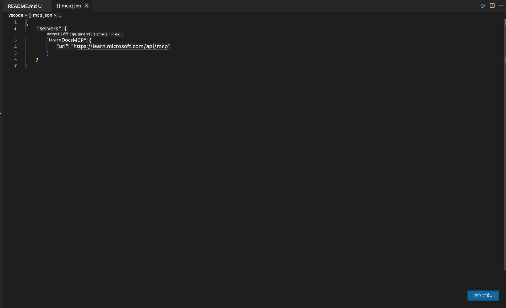
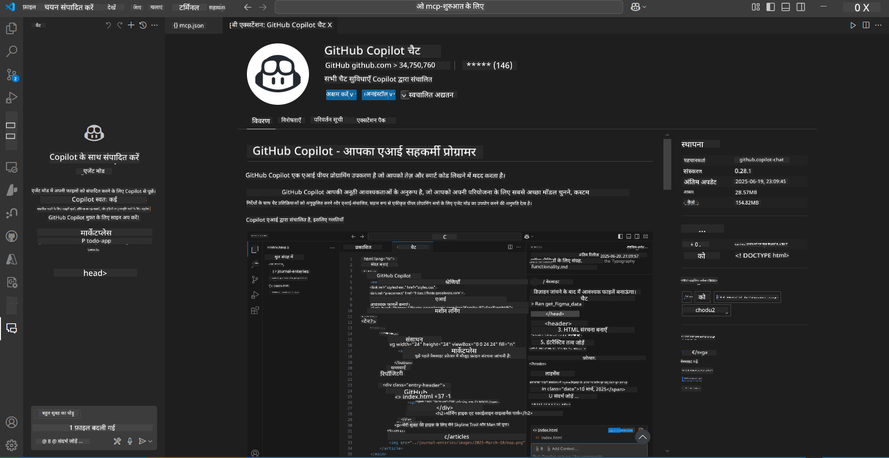
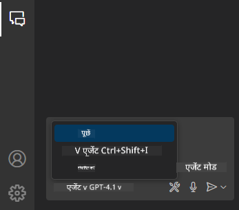
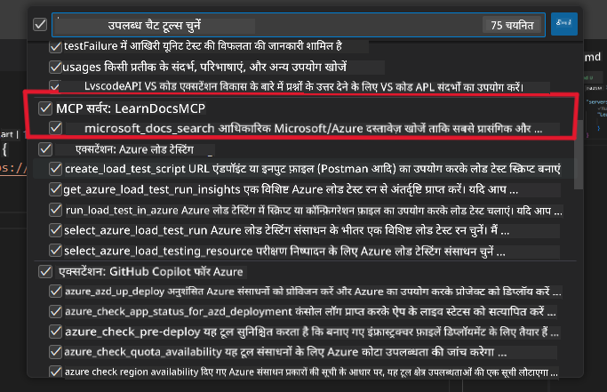
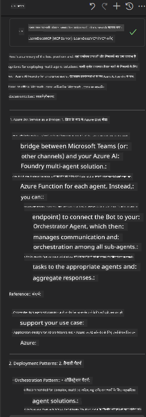

<!--
CO_OP_TRANSLATOR_METADATA:
{
  "original_hash": "db532b1ec386c9ce38c791653dc3c881",
  "translation_date": "2025-06-21T14:37:05+00:00",
  "source_file": "09-CaseStudy/docs-mcp/solution/scenario3/README.md",
  "language_code": "hi"
}
-->
# परिदृश्य 3: VS Code में MCP सर्वर के साथ इन-एडिटर दस्तावेज़

## अवलोकन

इस परिदृश्य में, आप सीखेंगे कि कैसे MCP सर्वर का उपयोग करके Microsoft Learn Docs को सीधे अपने Visual Studio Code वातावरण में लाया जाए। बार-बार ब्राउज़र टैब बदलने के बजाय, आप अपने एडिटर के अंदर ही आधिकारिक दस्तावेज़ खोज सकते हैं, पढ़ सकते हैं और संदर्भित कर सकते हैं। यह तरीका आपके वर्कफ़्लो को सरल बनाता है, आपको केंद्रित रखता है, और GitHub Copilot जैसे टूल्स के साथ सहज एकीकरण सक्षम करता है।

- VS Code के अंदर ही दस्तावेज़ खोजें और पढ़ें बिना कोडिंग वातावरण छोड़े।
- दस्तावेज़ों का संदर्भ दें और सीधे README या कोर्स फाइलों में लिंक डालें।
- GitHub Copilot और MCP को मिलाकर एक सहज, AI-संचालित दस्तावेज़ीकरण वर्कफ़्लो का उपयोग करें।

## सीखने के उद्देश्य

इस अध्याय के अंत तक, आप समझ जाएंगे कि VS Code के भीतर MCP सर्वर को कैसे सेटअप और उपयोग करें ताकि आपकी दस्तावेज़ीकरण और विकास वर्कफ़्लो बेहतर हो सके। आप सक्षम होंगे:

- दस्तावेज़ खोज के लिए MCP सर्वर का उपयोग करने के लिए अपने वर्कस्पेस को कॉन्फ़िगर करना।
- VS Code के अंदर से सीधे दस्तावेज़ खोजना और सम्मिलित करना।
- अधिक उत्पादक, AI-संवर्धित वर्कफ़्लो के लिए GitHub Copilot और MCP की शक्ति को मिलाना।

ये कौशल आपको केंद्रित रहने, दस्तावेज़ गुणवत्ता सुधारने, और एक डेवलपर या तकनीकी लेखक के रूप में आपकी उत्पादकता बढ़ाने में मदद करेंगे।

## समाधान

इन-एडिटर दस्तावेज़ीकरण एक्सेस प्राप्त करने के लिए, आप एक श्रृंखला चरणों का पालन करेंगे जो MCP सर्वर को VS Code और GitHub Copilot के साथ एकीकृत करता है। यह समाधान कोर्स लेखक, दस्तावेज़ लेखक, और डेवलपर्स के लिए आदर्श है जो दस्तावेज़ और Copilot के साथ काम करते हुए एडिटर में अपना ध्यान बनाए रखना चाहते हैं।

- कोर्स या प्रोजेक्ट दस्तावेज़ लिखते समय README में जल्दी से संदर्भ लिंक जोड़ें।
- कोड जनरेट करने के लिए Copilot का उपयोग करें और प्रासंगिक दस्तावेज़ तुरंत खोजने और उद्धृत करने के लिए MCP का।
- अपने एडिटर में केंद्रित रहें और उत्पादकता बढ़ाएं।

### चरण-दर-चरण मार्गदर्शिका

शुरू करने के लिए, इन चरणों का पालन करें। प्रत्येक चरण के लिए, आप प्रक्रिया को दृष्टिगत रूप से दिखाने के लिए assets फ़ोल्डर से स्क्रीनशॉट जोड़ सकते हैं।

1. **MCP कॉन्फ़िगरेशन जोड़ें:**
   अपने प्रोजेक्ट रूट में, एक `.vscode/mcp.json` फ़ाइल बनाएं और निम्न कॉन्फ़िगरेशन जोड़ें:
   ```json
   {
     "servers": {
       "LearnDocsMCP": {
         "url": "https://learn.microsoft.com/api/mcp"
       }
     }
   }
   ```
   यह कॉन्फ़िगरेशन VS Code को बताता है कि [`Microsoft Learn Docs MCP server`](https://github.com/MicrosoftDocs/mcp) से कैसे कनेक्ट करना है।
   
   
    
2. **GitHub Copilot Chat पैनल खोलें:**
   यदि आपके पास GitHub Copilot एक्सटेंशन पहले से इंस्टॉल नहीं है, तो VS Code में Extensions व्यू पर जाएं और इसे इंस्टॉल करें। आप इसे सीधे [Visual Studio Code Marketplace](https://marketplace.visualstudio.com/items?itemName=GitHub.copilot-chat) से डाउनलोड कर सकते हैं। फिर, साइडबार से Copilot Chat पैनल खोलें।

   

3. **एजेंट मोड सक्षम करें और टूल्स सत्यापित करें:**
   Copilot Chat पैनल में, एजेंट मोड सक्षम करें।

   

   एजेंट मोड सक्षम करने के बाद, सुनिश्चित करें कि MCP सर्वर उपलब्ध टूल्स की सूची में है। इससे Copilot एजेंट को दस्तावेज़ सर्वर से प्रासंगिक जानकारी प्राप्त करने की अनुमति मिलती है।
   
   
4. **नई चैट शुरू करें और एजेंट को प्रॉम्प्ट करें:**
   Copilot Chat पैनल में एक नई चैट खोलें। अब आप दस्तावेज़ीकरण से जुड़े प्रश्न एजेंट को पूछ सकते हैं। एजेंट MCP सर्वर का उपयोग करके Microsoft Learn की प्रासंगिक दस्तावेज़ीकरण सीधे आपके एडिटर में लाएगा।

   - *"मैं विषय X के लिए एक अध्ययन योजना लिखने की कोशिश कर रहा हूँ। मैं इसे 8 सप्ताह तक पढ़ने वाला हूँ, प्रत्येक सप्ताह के लिए सामग्री सुझाएं जो मुझे लेनी चाहिए।"*

   

5. **लाइव क्वेरी:**

   > आइए Azure AI Foundry Discord के [#get-help](https://discord.gg/D6cRhjHWSC) सेक्शन से एक लाइव क्वेरी लेते हैं ([मूल संदेश देखें](https://discord.com/channels/1113626258182504448/1385498306720829572)):
   
   *"मैं Azure AI Foundry पर विकसित AI एजेंट्स के साथ एक मल्टी-एजेंट समाधान को तैनात करने के तरीकों के बारे में उत्तर खोज रहा हूँ। मैं देखता हूँ कि Copilot Studio चैनलों जैसे कोई सीधे तैनाती का तरीका नहीं है। तो, एंटरप्राइज़ उपयोगकर्ताओं के लिए इस तैनाती के विभिन्न तरीके क्या हैं ताकि वे इंटरैक्ट कर सकें और काम पूरा कर सकें?
कई लेख/ब्लॉग्स कहते हैं कि हम Azure Bot सेवा का उपयोग कर सकते हैं जो MS Teams और Azure AI Foundry एजेंट्स के बीच एक पुल का काम कर सकता है, तो क्या यह काम करेगा अगर मैं Azure Bot सेटअप करूं जो Azure AI Foundry के Orchestrator Agent से Azure फ़ंक्शन के माध्यम से जुड़ता है, या मुझे Bot framework पर ऑर्केस्ट्रेशन करने के लिए मल्टी एजेंट समाधान के प्रत्येक AI एजेंट के लिए अलग Azure फ़ंक्शन बनाना होगा? कोई अन्य सुझाव भी स्वागत योग्य हैं।"*

   

   एजेंट प्रासंगिक दस्तावेज़ीकरण लिंक और सारांशों के साथ प्रतिक्रिया देगा, जिन्हें आप सीधे अपने मार्कडाउन फाइलों में सम्मिलित कर सकते हैं या कोड में संदर्भ के रूप में उपयोग कर सकते हैं।
   
### नमूना क्वेरीज़

यहाँ कुछ उदाहरण क्वेरीज़ हैं जिन्हें आप आज़मा सकते हैं। ये क्वेरीज़ दिखाएंगी कि कैसे MCP सर्वर और Copilot मिलकर VS Code छोड़े बिना त्वरित, संदर्भ-आधारित दस्तावेज़ीकरण और संदर्भ प्रदान कर सकते हैं:

- "मुझे दिखाओ कि Azure Functions ट्रिगर्स का उपयोग कैसे करें।"
- "Azure Key Vault के आधिकारिक दस्तावेज़ के लिए लिंक डालें।"
- "Azure संसाधनों को सुरक्षित करने के लिए सर्वोत्तम प्रथाएँ क्या हैं?"
- "Azure AI सेवाओं के लिए क्विकस्टार्ट खोजें।"

ये क्वेरीज़ दिखाएंगी कि कैसे MCP सर्वर और Copilot मिलकर VS Code छोड़े बिना त्वरित, संदर्भ-आधारित दस्तावेज़ीकरण और संदर्भ प्रदान कर सकते हैं।

---

**अस्वीकरण**:  
यह दस्तावेज़ AI अनुवाद सेवा [Co-op Translator](https://github.com/Azure/co-op-translator) का उपयोग करके अनुवादित किया गया है। जबकि हम सटीकता के लिए प्रयासरत हैं, कृपया ध्यान रखें कि स्वचालित अनुवाद में त्रुटियाँ या असंगतियाँ हो सकती हैं। मूल दस्तावेज़ अपनी मूल भाषा में ही प्रामाणिक स्रोत माना जाना चाहिए। महत्वपूर्ण जानकारी के लिए, पेशेवर मानव अनुवाद की सलाह दी जाती है। इस अनुवाद के उपयोग से उत्पन्न किसी भी गलतफहमी या गलत व्याख्या के लिए हम जिम्मेदार नहीं हैं।