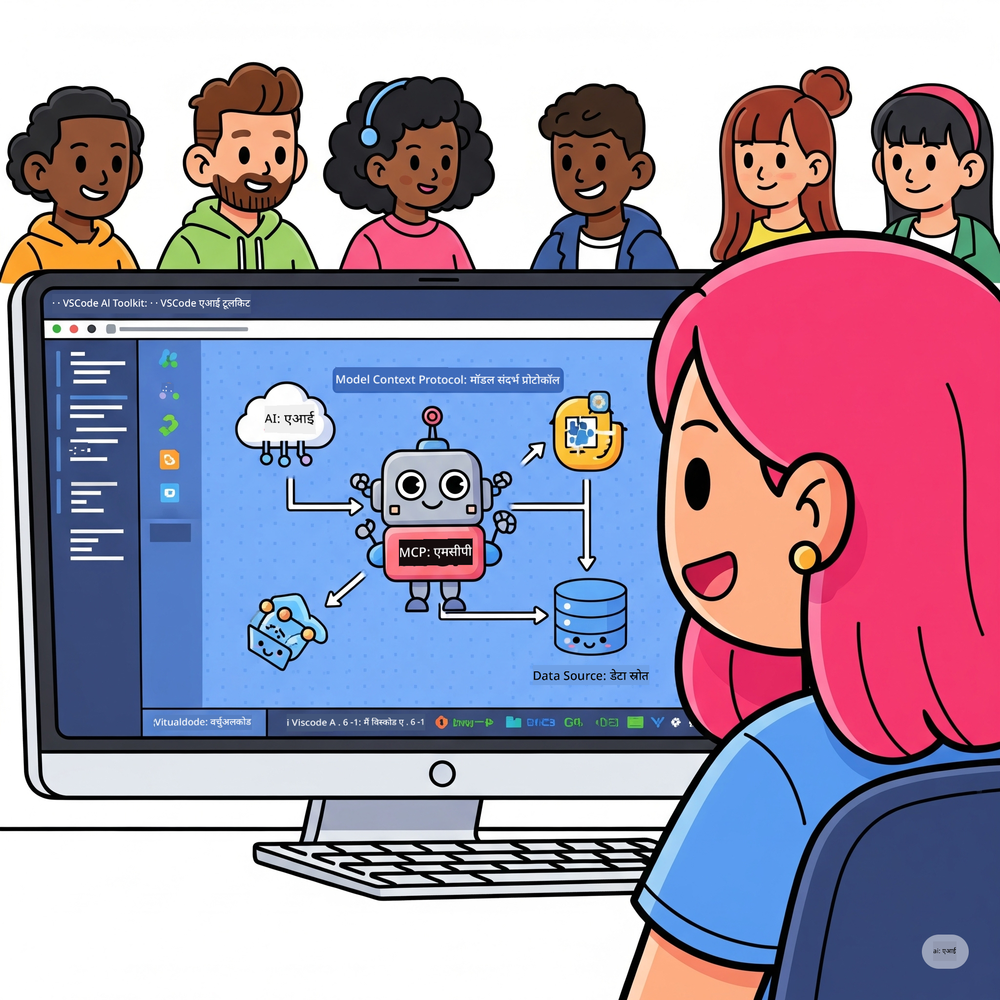

<!--
CO_OP_TRANSLATOR_METADATA:
{
  "original_hash": "1b000fd6e1b04c047578bfc5d07d54eb",
  "translation_date": "2025-07-29T01:51:44+00:00",
  "source_file": "10-StreamliningAIWorkflowsBuildingAnMCPServerWithAIToolkit/README.md",
  "language_code": "hi"
}
-->
# एआई वर्कफ़्लो को सरल बनाना: एआई टूलकिट के साथ MCP सर्वर बनाना

## 🎯 परिचय

_(ऊपर दी गई छवि पर क्लिक करें और इस पाठ का वीडियो देखें)_

**मॉडल कॉन्टेक्स्ट प्रोटोकॉल (MCP) वर्कशॉप** में आपका स्वागत है! यह व्यापक हैंड्स-ऑन वर्कशॉप दो अत्याधुनिक तकनीकों को जोड़ती है, जो एआई एप्लिकेशन डेवलपमेंट में क्रांति लाती हैं:

- **🔗 मॉडल कॉन्टेक्स्ट प्रोटोकॉल (MCP)**: एआई टूल्स के सहज एकीकरण के लिए एक ओपन स्टैंडर्ड
- **🛠️ एआई टूलकिट फॉर विजुअल स्टूडियो कोड (AITK)**: माइक्रोसॉफ्ट का शक्तिशाली एआई डेवलपमेंट एक्सटेंशन

### 🎓 आप क्या सीखेंगे

इस वर्कशॉप के अंत तक, आप एआई मॉडल्स को वास्तविक दुनिया के टूल्स और सेवाओं से जोड़ने वाले इंटेलिजेंट एप्लिकेशन बनाने की कला में निपुण हो जाएंगे। स्वचालित परीक्षण से लेकर कस्टम एपीआई इंटीग्रेशन तक, आप जटिल व्यावसायिक चुनौतियों को हल करने के लिए व्यावहारिक कौशल प्राप्त करेंगे।

## 🏗️ टेक्नोलॉजी स्टैक

### 🔌 मॉडल कॉन्टेक्स्ट प्रोटोकॉल (MCP)

MCP को **"एआई के लिए USB-C"** कहा जा सकता है - यह एक सार्वभौमिक मानक है जो एआई मॉडल्स को बाहरी टूल्स और डेटा स्रोतों से जोड़ता है।

**✨ मुख्य विशेषताएं:**

- 🔄 **मानकीकृत एकीकरण**: एआई-टूल कनेक्शन के लिए एक सार्वभौमिक इंटरफ़ेस
- 🏛️ **लचीला आर्किटेक्चर**: लोकल और रिमोट सर्वर stdio/SSE ट्रांसपोर्ट के माध्यम से
- 🧰 **समृद्ध इकोसिस्टम**: टूल्स, प्रॉम्प्ट्स और संसाधन एक ही प्रोटोकॉल में
- 🔒 **एंटरप्राइज़-रेडी**: इनबिल्ट सुरक्षा और विश्वसनीयता

**🎯 MCP क्यों महत्वपूर्ण है:**
जैसे USB-C ने केबल की जटिलता को खत्म किया, वैसे ही MCP एआई इंटीग्रेशन की जटिलता को खत्म करता है। एक प्रोटोकॉल, अनंत संभावनाएं।

### 🤖 एआई टूलकिट फॉर विजुअल स्टूडियो कोड (AITK)

माइक्रोसॉफ्ट का प्रमुख एआई डेवलपमेंट एक्सटेंशन, जो VS Code को एक एआई पावरहाउस में बदल देता है।

**🚀 मुख्य क्षमताएं:**

- 📦 **मॉडल कैटलॉग**: Azure AI, GitHub, Hugging Face, Ollama से मॉडल्स तक पहुंच
- ⚡ **लोकल इन्फरेंस**: ONNX-ऑप्टिमाइज़्ड CPU/GPU/NPU निष्पादन
- 🏗️ **एजेंट बिल्डर**: MCP इंटीग्रेशन के साथ विजुअल एआई एजेंट डेवलपमेंट
- 🎭 **मल्टी-मोडल**: टेक्स्ट, विज़न और स्ट्रक्चर्ड आउटपुट सपोर्ट

**💡 डेवलपमेंट के लाभ:**

- ज़ीरो-कॉन्फिग मॉडल डिप्लॉयमेंट
- विजुअल प्रॉम्प्ट इंजीनियरिंग
- रियल-टाइम टेस्टिंग प्लेग्राउंड
- सहज MCP सर्वर इंटीग्रेशन

## 📚 लर्निंग जर्नी

### [🚀 मॉड्यूल 1: एआई टूलकिट की मूल बातें](./lab1/README.md)

**अवधि**: 15 मिनट

- 🛠️ VS Code के लिए एआई टूलकिट इंस्टॉल और कॉन्फ़िगर करें
- 🗂️ मॉडल कैटलॉग का अन्वेषण करें (GitHub, ONNX, OpenAI, Anthropic, Google से 100+ मॉडल्स)
- 🎮 रियल-टाइम मॉडल टेस्टिंग के लिए इंटरएक्टिव प्लेग्राउंड में महारत हासिल करें
- 🤖 एजेंट बिल्डर के साथ अपना पहला एआई एजेंट बनाएं
- 📊 बिल्ट-इन मेट्रिक्स (F1, प्रासंगिकता, समानता, सुसंगतता) के साथ मॉडल प्रदर्शन का मूल्यांकन करें
- ⚡ बैच प्रोसेसिंग और मल्टी-मोडल सपोर्ट क्षमताओं को सीखें

**🎯 लर्निंग आउटकम**: AITK की क्षमताओं की व्यापक समझ के साथ एक कार्यात्मक एआई एजेंट बनाएं

### [🌐 मॉड्यूल 2: MCP के साथ एआई टूलकिट की मूल बातें](./lab2/README.md)

**अवधि**: 20 मिनट

- 🧠 मॉडल कॉन्टेक्स्ट प्रोटोकॉल (MCP) आर्किटेक्चर और अवधारणाओं में महारत हासिल करें
- 🌐 माइक्रोसॉफ्ट के MCP सर्वर इकोसिस्टम का अन्वेषण करें
- 🤖 Playwright MCP सर्वर का उपयोग करके एक ब्राउज़र ऑटोमेशन एजेंट बनाएं
- 🔧 MCP सर्वर्स को एआई टूलकिट एजेंट बिल्डर के साथ इंटीग्रेट करें
- 📊 अपने एजेंट्स में MCP टूल्स को कॉन्फ़िगर और टेस्ट करें
- 🚀 MCP-पावर्ड एजेंट्स को प्रोडक्शन उपयोग के लिए एक्सपोर्ट और डिप्लॉय करें

**🎯 लर्निंग आउटकम**: बाहरी टूल्स के साथ सुपरचार्ज्ड एआई एजेंट को डिप्लॉय करें

### [🔧 मॉड्यूल 3: एआई टूलकिट के साथ एडवांस्ड MCP डेवलपमेंट](./lab3/README.md)

**अवधि**: 20 मिनट

- 💻 एआई टूलकिट का उपयोग करके कस्टम MCP सर्वर बनाएं
- 🐍 नवीनतम MCP Python SDK (v1.9.3) को कॉन्फ़िगर और उपयोग करें
- 🔍 डिबगिंग के लिए MCP इंस्पेक्टर सेट करें और उपयोग करें
- 🛠️ पेशेवर डिबगिंग वर्कफ़्लो के साथ एक वेदर MCP सर्वर बनाएं
- 🧪 एजेंट बिल्डर और इंस्पेक्टर वातावरण में MCP सर्वर्स को डिबग करें

**🎯 लर्निंग आउटकम**: आधुनिक टूलिंग के साथ कस्टम MCP सर्वर्स को विकसित और डिबग करें

### [🐙 मॉड्यूल 4: व्यावहारिक MCP डेवलपमेंट - कस्टम GitHub क्लोन सर्वर](./lab4/README.md)

**अवधि**: 30 मिनट

- 🏗️ विकास वर्कफ़्लो के लिए एक वास्तविक GitHub क्लोन MCP सर्वर बनाएं
- 🔄 सत्यापन और त्रुटि प्रबंधन के साथ स्मार्ट रिपॉजिटरी क्लोनिंग लागू करें
- 📁 इंटेलिजेंट डायरेक्टरी मैनेजमेंट और VS Code इंटीग्रेशन बनाएं
- 🤖 कस्टम MCP टूल्स के साथ GitHub Copilot एजेंट मोड का उपयोग करें
- 🛡️ प्रोडक्शन-रेडी विश्वसनीयता और क्रॉस-प्लेटफ़ॉर्म संगतता लागू करें

**🎯 लर्निंग आउटकम**: एक प्रोडक्शन-रेडी MCP सर्वर को डिप्लॉय करें जो वास्तविक विकास वर्कफ़्लो को सरल बनाता है

## 💡 वास्तविक दुनिया के अनुप्रयोग और प्रभाव

### 🏢 एंटरप्राइज़ उपयोग के मामले

#### 🔄 देवऑप्स ऑटोमेशन

अपने विकास वर्कफ़्लो को इंटेलिजेंट ऑटोमेशन के साथ बदलें:

- **स्मार्ट रिपॉजिटरी मैनेजमेंट**: एआई-ड्रिवन कोड समीक्षा और मर्ज निर्णय
- **इंटेलिजेंट CI/CD**: कोड परिवर्तनों के आधार पर स्वचालित पाइपलाइन अनुकूलन
- **इश्यू ट्रायज**: स्वचालित बग वर्गीकरण और असाइनमेंट

#### 🧪 गुणवत्ता आश्वासन क्रांति

एआई-संचालित ऑटोमेशन के साथ परीक्षण को ऊंचा करें:

- **इंटेलिजेंट टेस्ट जनरेशन**: व्यापक परीक्षण सूट स्वचालित रूप से बनाएं
- **विजुअल रिग्रेशन टेस्टिंग**: एआई-संचालित UI परिवर्तन पहचान
- **प्रदर्शन निगरानी**: सक्रिय समस्या पहचान और समाधान

#### 📊 डेटा पाइपलाइन इंटेलिजेंस

स्मार्ट डेटा प्रोसेसिंग वर्कफ़्लो बनाएं:

- **एडैप्टिव ETL प्रक्रियाएं**: स्व-ऑप्टिमाइज़िंग डेटा ट्रांसफॉर्मेशन
- **असामान्यता पहचान**: रियल-टाइम डेटा गुणवत्ता निगरानी
- **इंटेलिजेंट रूटिंग**: स्मार्ट डेटा फ्लो प्रबंधन

#### 🎧 ग्राहक अनुभव संवर्धन

असाधारण ग्राहक इंटरैक्शन बनाएं:

- **संदर्भ-सचेत समर्थन**: ग्राहक इतिहास तक पहुंच वाले एआई एजेंट्स
- **प्रोएक्टिव समस्या समाधान**: प्रेडिक्टिव कस्टमर सर्विस
- **मल्टी-चैनल इंटीग्रेशन**: प्लेटफ़ॉर्म्स पर एकीकृत एआई अनुभव

## 🛠️ आवश्यकताएं और सेटअप

### 💻 सिस्टम आवश्यकताएं

| घटक | आवश्यकता | नोट्स |
|-----------|-------------|-------|
| **ऑपरेटिंग सिस्टम** | Windows 10+, macOS 10.15+, Linux | कोई भी आधुनिक OS |
| **विजुअल स्टूडियो कोड** | नवीनतम स्थिर संस्करण | AITK के लिए आवश्यक |
| **Node.js** | v18.0+ और npm | MCP सर्वर विकास के लिए |
| **Python** | 3.10+ | वैकल्पिक, Python MCP सर्वर्स के लिए |
| **मेमोरी** | न्यूनतम 8GB RAM | लोकल मॉडल्स के लिए 16GB अनुशंसित |

### 🔧 विकास वातावरण

#### अनुशंसित VS Code एक्सटेंशन्स

- **AI Toolkit** (ms-windows-ai-studio.windows-ai-studio)
- **Python** (ms-python.python)
- **Python Debugger** (ms-python.debugpy)
- **GitHub Copilot** (GitHub.copilot) - वैकल्पिक लेकिन सहायक

#### वैकल्पिक टूल्स

- **uv**: आधुनिक Python पैकेज मैनेजर
- **MCP Inspector**: MCP सर्वर्स के लिए विजुअल डिबगिंग टूल
- **Playwright**: वेब ऑटोमेशन उदाहरणों के लिए

## 🎖️ लर्निंग आउटकम और प्रमाणन पथ

### 🏆 कौशल महारत चेकलिस्ट

इस वर्कशॉप को पूरा करके, आप निम्नलिखित में महारत हासिल करेंगे:

#### 🎯 मुख्य दक्षताएं

- [ ] **MCP प्रोटोकॉल महारत**: आर्किटेक्चर और कार्यान्वयन पैटर्न की गहरी समझ
- [ ] **AITK प्रवीणता**: तेज़ विकास के लिए एआई टूलकिट का विशेषज्ञ-स्तरीय उपयोग
- [ ] **कस्टम सर्वर विकास**: प्रोडक्शन MCP सर्वर्स को बनाना, डिप्लॉय करना और बनाए रखना
- [ ] **टूल इंटीग्रेशन उत्कृष्टता**: एआई को मौजूदा विकास वर्कफ़्लो से सहजता से जोड़ना
- [ ] **समस्या-समाधान अनुप्रयोग**: सीखे गए कौशल को वास्तविक व्यावसायिक चुनौतियों पर लागू करना

#### 🔧 तकनीकी कौशल

- [ ] VS Code में एआई टूलकिट सेट अप और कॉन्फ़िगर करें
- [ ] कस्टम MCP सर्वर्स को डिज़ाइन और लागू करें
- [ ] MCP आर्किटेक्चर के साथ GitHub मॉडल्स को इंटीग्रेट करें
- [ ] Playwright के साथ स्वचालित परीक्षण वर्कफ़्लो बनाएं
- [ ] प्रोडक्शन उपयोग के लिए एआई एजेंट्स को डिप्लॉय करें
- [ ] MCP सर्वर प्रदर्शन को डिबग और ऑप्टिमाइज़ करें

#### 🚀 उन्नत क्षमताएं

- [ ] एंटरप्राइज़-स्केल एआई इंटीग्रेशन को आर्किटेक्ट करें
- [ ] एआई एप्लिकेशन के लिए सुरक्षा सर्वोत्तम प्रथाओं को लागू करें
- [ ] स्केलेबल MCP सर्वर आर्किटेक्चर डिज़ाइन करें
- [ ] विशिष्ट डोमेन के लिए कस्टम टूल चेन बनाएं
- [ ] एआई-नेटिव विकास में दूसरों को मेंटर करें

## 📖 अतिरिक्त संसाधन

- [MCP स्पेसिफिकेशन](https://modelcontextprotocol.io/docs)
- [AI टूलकिट GitHub रिपॉजिटरी](https://github.com/microsoft/vscode-ai-toolkit)
- [सैंपल MCP सर्वर्स संग्रह](https://github.com/modelcontextprotocol/servers)
- [सर्वोत्तम प्रथाओं की गाइड](https://modelcontextprotocol.io/docs/best-practices)

---

**🚀 क्या आप अपने एआई विकास वर्कफ़्लो में क्रांति लाने के लिए तैयार हैं?**

आइए MCP और एआई टूलकिट के साथ मिलकर इंटेलिजेंट एप्लिकेशन का भविष्य बनाएं!

**अस्वीकरण**:  
यह दस्तावेज़ AI अनुवाद सेवा [Co-op Translator](https://github.com/Azure/co-op-translator) का उपयोग करके अनुवादित किया गया है। जबकि हम सटीकता सुनिश्चित करने का प्रयास करते हैं, कृपया ध्यान दें कि स्वचालित अनुवाद में त्रुटियां या अशुद्धियां हो सकती हैं। मूल भाषा में उपलब्ध मूल दस्तावेज़ को आधिकारिक स्रोत माना जाना चाहिए। महत्वपूर्ण जानकारी के लिए, पेशेवर मानव अनुवाद की सिफारिश की जाती है। इस अनुवाद के उपयोग से उत्पन्न किसी भी गलतफहमी या गलत व्याख्या के लिए हम जिम्मेदार नहीं हैं।