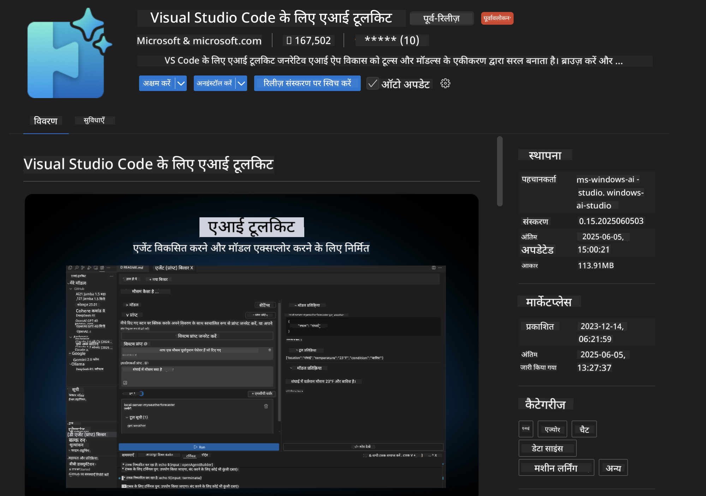
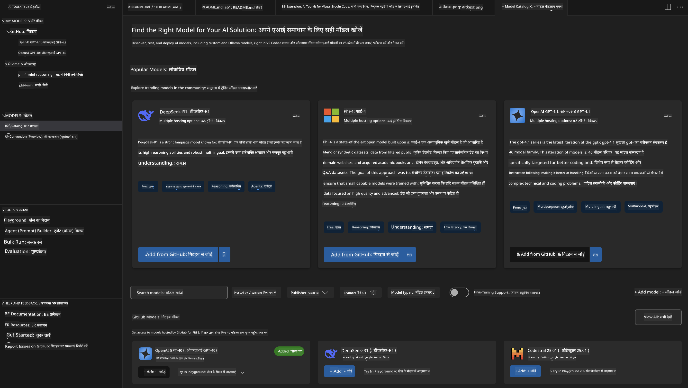
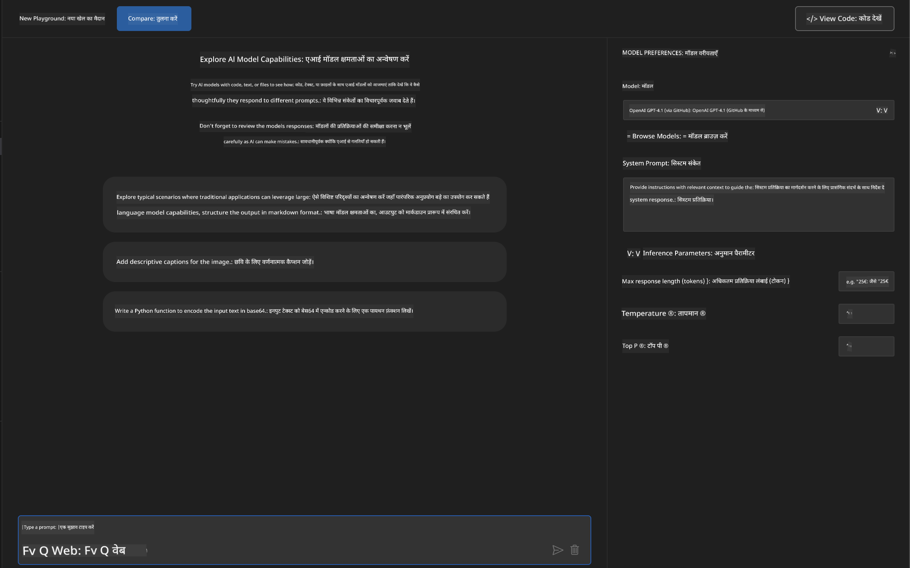
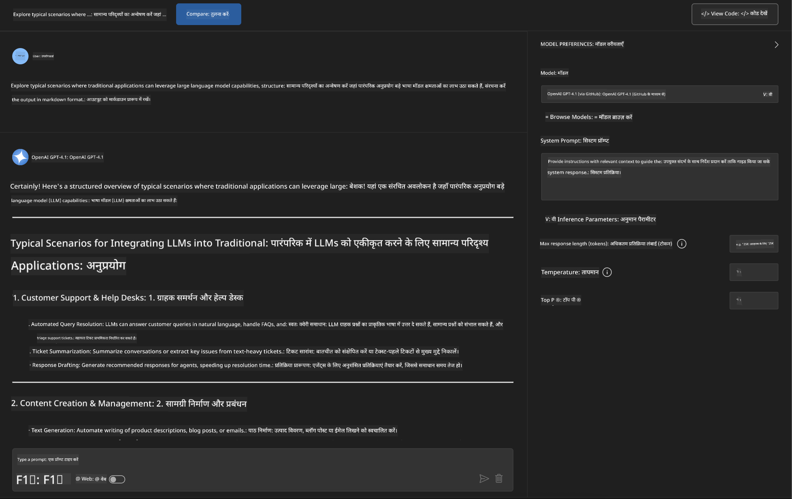
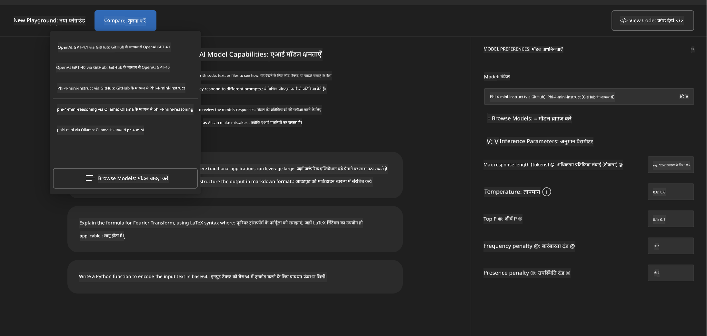
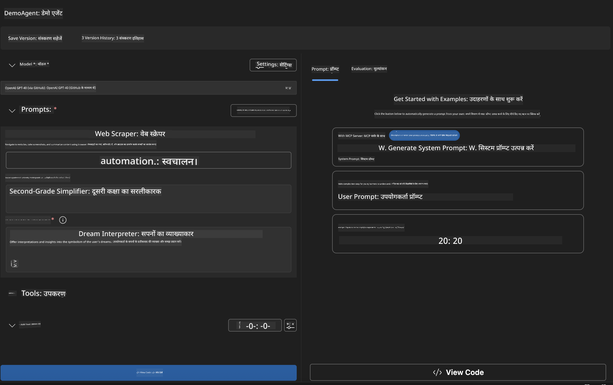
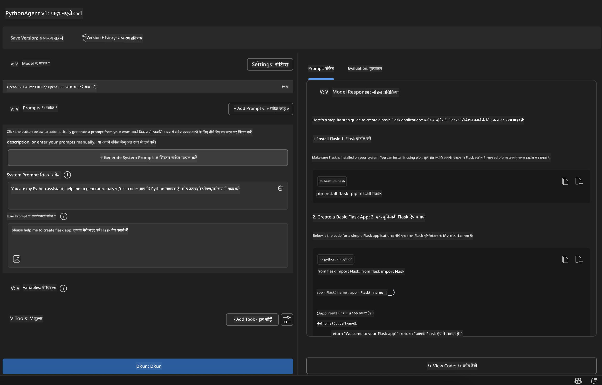

<!--
CO_OP_TRANSLATOR_METADATA:
{
  "original_hash": "2aa9dbc165e104764fa57e8a0d3f1c73",
  "translation_date": "2025-07-14T07:22:48+00:00",
  "source_file": "10-StreamliningAIWorkflowsBuildingAnMCPServerWithAIToolkit/lab1/README.md",
  "language_code": "hi"
}
-->
# 🚀 मॉड्यूल 1: AI Toolkit के मूल सिद्धांत

[]()
[]()
[]()

## 📋 सीखने के उद्देश्य

इस मॉड्यूल के अंत तक, आप सक्षम होंगे:
- ✅ Visual Studio Code के लिए AI Toolkit इंस्टॉल और कॉन्फ़िगर करना
- ✅ Model Catalog में नेविगेट करना और विभिन्न मॉडल स्रोतों को समझना
- ✅ मॉडल परीक्षण और प्रयोग के लिए Playground का उपयोग करना
- ✅ Agent Builder का उपयोग करके कस्टम AI एजेंट बनाना
- ✅ विभिन्न प्रदाताओं के बीच मॉडल प्रदर्शन की तुलना करना
- ✅ प्रॉम्प्ट इंजीनियरिंग के लिए सर्वोत्तम प्रथाओं को लागू करना

## 🧠 AI Toolkit (AITK) का परिचय

**AI Toolkit for Visual Studio Code** Microsoft का प्रमुख एक्सटेंशन है जो VS Code को एक व्यापक AI विकास वातावरण में बदल देता है। यह AI अनुसंधान और व्यावहारिक एप्लिकेशन विकास के बीच की खाई को पाटता है, जिससे सभी कौशल स्तरों के डेवलपर्स के लिए जनरेटिव AI सुलभ हो जाता है।

### 🌟 मुख्य क्षमताएं

| फीचर | विवरण | उपयोग का मामला |
|---------|-------------|----------|
| **🗂️ Model Catalog** | GitHub, ONNX, OpenAI, Anthropic, Google से 100+ मॉडल तक पहुंच | मॉडल खोज और चयन |
| **🔌 BYOM Support** | अपने स्वयं के मॉडल (स्थानीय/रिमोट) को एकीकृत करें | कस्टम मॉडल तैनाती |
| **🎮 Interactive Playground** | चैट इंटरफ़ेस के साथ रियल-टाइम मॉडल परीक्षण | तेज़ प्रोटोटाइपिंग और परीक्षण |
| **📎 Multi-Modal Support** | टेक्स्ट, इमेज और अटैचमेंट संभालना | जटिल AI एप्लिकेशन |
| **⚡ Batch Processing** | एक साथ कई प्रॉम्प्ट चलाना | कुशल परीक्षण वर्कफ़्लो |
| **📊 Model Evaluation** | अंतर्निर्मित मेट्रिक्स (F1, प्रासंगिकता, समानता, सुसंगतता) | प्रदर्शन मूल्यांकन |

### 🎯 AI Toolkit क्यों महत्वपूर्ण है

- **🚀 तेज़ विकास**: विचार से प्रोटोटाइप तक मिनटों में
- **🔄 एकीकृत वर्कफ़्लो**: कई AI प्रदाताओं के लिए एक ही इंटरफ़ेस
- **🧪 आसान प्रयोग**: जटिल सेटअप के बिना मॉडल की तुलना करें
- **📈 उत्पादन के लिए तैयार**: प्रोटोटाइप से तैनाती तक सहज संक्रमण

## 🛠️ आवश्यकताएँ और सेटअप

### 📦 AI Toolkit एक्सटेंशन इंस्टॉल करें

**चरण 1: एक्सटेंशन्स मार्केटप्लेस तक पहुंचें**
1. Visual Studio Code खोलें
2. एक्सटेंशन्स व्यू पर जाएं (`Ctrl+Shift+X` या `Cmd+Shift+X`)
3. "AI Toolkit" खोजें

**चरण 2: अपनी संस्करण चुनें**
- **🟢 रिलीज़**: उत्पादन उपयोग के लिए अनुशंसित
- **🔶 प्री-रिलीज़**: नवीनतम फीचर्स के लिए प्रारंभिक पहुंच

**चरण 3: इंस्टॉल और सक्रिय करें**



### ✅ सत्यापन चेकलिस्ट
- [ ] AI Toolkit आइकन VS Code साइडबार में दिखाई दे रहा है
- [ ] एक्सटेंशन सक्षम और सक्रिय है
- [ ] आउटपुट पैनल में कोई इंस्टॉलेशन त्रुटि नहीं है

## 🧪 व्यावहारिक अभ्यास 1: GitHub मॉडल्स का अन्वेषण

**🎯 उद्देश्य**: Model Catalog में महारत हासिल करें और अपना पहला AI मॉडल टेस्ट करें

### 📊 चरण 1: Model Catalog में नेविगेट करें

Model Catalog AI इकोसिस्टम का आपका प्रवेश द्वार है। यह कई प्रदाताओं के मॉडल को एकत्रित करता है, जिससे विकल्पों की खोज और तुलना आसान हो जाती है।

**🔍 नेविगेशन गाइड:**

AI Toolkit साइडबार में **MODELS - Catalog** पर क्लिक करें



**💡 प्रो टिप**: उन मॉडलों को देखें जिनमें आपकी उपयोग केस के अनुरूप विशेष क्षमताएं हों (जैसे कोड जनरेशन, रचनात्मक लेखन, विश्लेषण)।

**⚠️ नोट**: GitHub-होस्टेड मॉडल (यानी GitHub मॉडल) उपयोग के लिए मुफ्त हैं लेकिन अनुरोधों और टोकन पर दर सीमाएं लागू होती हैं। यदि आप गैर-GitHub मॉडल (जैसे Azure AI या अन्य एंडपॉइंट्स पर होस्ट किए गए बाहरी मॉडल) तक पहुंचना चाहते हैं, तो आपको उपयुक्त API कुंजी या प्रमाणीकरण प्रदान करना होगा।

### 🚀 चरण 2: अपना पहला मॉडल जोड़ें और कॉन्फ़िगर करें

**मॉडल चयन रणनीति:**
- **GPT-4.1**: जटिल तर्क और विश्लेषण के लिए सर्वोत्तम
- **Phi-4-mini**: सरल कार्यों के लिए हल्का और तेज़ प्रतिक्रिया

**🔧 कॉन्फ़िगरेशन प्रक्रिया:**
1. कैटलॉग से **OpenAI GPT-4.1** चुनें
2. **Add to My Models** पर क्लिक करें - इससे मॉडल उपयोग के लिए पंजीकृत हो जाएगा
3. **Try in Playground** चुनें ताकि परीक्षण वातावरण शुरू हो सके
4. मॉडल इनिशियलाइज़ेशन का इंतजार करें (पहली बार सेटअप में कुछ समय लग सकता है)



**⚙️ मॉडल पैरामीटर समझना:**
- **Temperature**: रचनात्मकता नियंत्रित करता है (0 = निश्चित, 1 = रचनात्मक)
- **Max Tokens**: अधिकतम प्रतिक्रिया की लंबाई
- **Top-p**: प्रतिक्रिया विविधता के लिए न्यूक्लियस सैंपलिंग

### 🎯 चरण 3: Playground इंटरफ़ेस में महारत हासिल करें

Playground आपका AI प्रयोगशाला है। इसे अधिकतम उपयोग करने के लिए:

**🎨 प्रॉम्प्ट इंजीनियरिंग की सर्वोत्तम प्रथाएं:**
1. **विशिष्ट बनें**: स्पष्ट, विस्तृत निर्देश बेहतर परिणाम देते हैं
2. **संदर्भ प्रदान करें**: प्रासंगिक पृष्ठभूमि जानकारी शामिल करें
3. **उदाहरणों का उपयोग करें**: मॉडल को दिखाएं कि आप क्या चाहते हैं
4. **पुनरावृत्ति करें**: प्रारंभिक परिणामों के आधार पर प्रॉम्प्ट सुधारें

**🧪 परीक्षण परिदृश्य:**
```markdown
# Example 1: Code Generation
"Write a Python function that calculates the factorial of a number using recursion. Include error handling and docstrings."

# Example 2: Creative Writing
"Write a professional email to a client explaining a project delay, maintaining a positive tone while being transparent about challenges."

# Example 3: Data Analysis
"Analyze this sales data and provide insights: [paste your data]. Focus on trends, anomalies, and actionable recommendations."
```



### 🏆 चुनौती अभ्यास: मॉडल प्रदर्शन तुलना

**🎯 लक्ष्य**: समान प्रॉम्प्ट का उपयोग करके विभिन्न मॉडलों की ताकत समझें

**📋 निर्देश:**
1. अपने वर्कस्पेस में **Phi-4-mini** जोड़ें
2. GPT-4.1 और Phi-4-mini दोनों के लिए एक ही प्रॉम्प्ट का उपयोग करें



3. प्रतिक्रिया की गुणवत्ता, गति और सटीकता की तुलना करें
4. अपने निष्कर्ष परिणाम अनुभाग में दर्ज करें


**💡 खोजने के लिए मुख्य अंतर्दृष्टि:**
- कब LLM और कब SLM का उपयोग करें
- लागत बनाम प्रदर्शन के समझौते
- विभिन्न मॉडलों की विशिष्ट क्षमताएं

## 🤖 व्यावहारिक अभ्यास 2: Agent Builder के साथ कस्टम एजेंट बनाना

**🎯 उद्देश्य**: विशिष्ट कार्यों और वर्कफ़्लो के लिए विशेष AI एजेंट बनाएं

### 🏗️ चरण 1: Agent Builder को समझना

Agent Builder वह जगह है जहाँ AI Toolkit वास्तव में चमकता है। यह आपको बड़े भाषा मॉडल की शक्ति को कस्टम निर्देशों, विशिष्ट पैरामीटर और विशेषज्ञ ज्ञान के साथ जोड़कर उद्देश्य-निर्मित AI सहायक बनाने की अनुमति देता है।

**🧠 एजेंट आर्किटेक्चर घटक:**
- **Core Model**: आधार LLM (GPT-4, Groks, Phi, आदि)
- **System Prompt**: एजेंट की व्यक्तित्व और व्यवहार को परिभाषित करता है
- **Parameters**: इष्टतम प्रदर्शन के लिए फाइन-ट्यून सेटिंग्स
- **Tools Integration**: बाहरी API और MCP सेवाओं से कनेक्ट करें
- **Memory**: बातचीत का संदर्भ और सत्र की स्थिरता



### ⚙️ चरण 2: एजेंट कॉन्फ़िगरेशन का गहन अध्ययन

**🎨 प्रभावी सिस्टम प्रॉम्प्ट बनाना:**
```markdown
# Template Structure:
## Role Definition
You are a [specific role] with expertise in [domain].

## Capabilities
- List specific abilities
- Define scope of knowledge
- Clarify limitations

## Behavior Guidelines
- Response style (formal, casual, technical)
- Output format preferences
- Error handling approach

## Examples
Provide 2-3 examples of ideal interactions
```

*बिल्कुल, आप Generate System Prompt का उपयोग करके AI की मदद से प्रॉम्प्ट जनरेट और ऑप्टिमाइज़ भी कर सकते हैं*

**🔧 पैरामीटर अनुकूलन:**
| पैरामीटर | अनुशंसित सीमा | उपयोग का मामला |
|-----------|------------------|----------|
| **Temperature** | 0.1-0.3 | तकनीकी/तथ्यात्मक प्रतिक्रियाएं |
| **Temperature** | 0.7-0.9 | रचनात्मक/ब्रेनस्टॉर्मिंग कार्य |
| **Max Tokens** | 500-1000 | संक्षिप्त प्रतिक्रियाएं |
| **Max Tokens** | 2000-4000 | विस्तृत व्याख्याएं |

### 🐍 चरण 3: व्यावहारिक अभ्यास - Python प्रोग्रामिंग एजेंट

**🎯 मिशन**: एक विशेष Python कोडिंग सहायक बनाएं

**📋 कॉन्फ़िगरेशन चरण:**

1. **मॉडल चयन**: चुनें **Claude 3.5 Sonnet** (कोड के लिए उत्कृष्ट)

2. **सिस्टम प्रॉम्प्ट डिज़ाइन**:
```markdown
# Python Programming Expert Agent

## Role
You are a senior Python developer with 10+ years of experience. You excel at writing clean, efficient, and well-documented Python code.

## Capabilities
- Write production-ready Python code
- Debug complex issues
- Explain code concepts clearly
- Suggest best practices and optimizations
- Provide complete working examples

## Response Format
- Always include docstrings
- Add inline comments for complex logic
- Suggest testing approaches
- Mention relevant libraries when applicable

## Code Quality Standards
- Follow PEP 8 style guidelines
- Use type hints where appropriate
- Handle exceptions gracefully
- Write readable, maintainable code
```

3. **पैरामीटर कॉन्फ़िगरेशन**:
   - Temperature: 0.2 (सुसंगत, विश्वसनीय कोड के लिए)
   - Max Tokens: 2000 (विस्तृत व्याख्याओं के लिए)
   - Top-p: 0.9 (संतुलित रचनात्मकता)



### 🧪 चरण 4: अपने Python एजेंट का परीक्षण करें

**परीक्षण परिदृश्य:**
1. **मूल कार्य**: "प्राइम नंबर खोजने के लिए एक फ़ंक्शन बनाएं"
2. **जटिल एल्गोरिदम**: "इन्सर्ट, डिलीट और सर्च मेथड्स के साथ बाइनरी सर्च ट्री लागू करें"
3. **वास्तविक दुनिया की समस्या**: "एक वेब स्क्रैपर बनाएं जो रेट लिमिटिंग और रिट्राई संभाले"
4. **डिबगिंग**: "इस कोड को ठीक करें [बग वाला कोड पेस्ट करें]"

**🏆 सफलता के मानदंड:**
- ✅ कोड बिना त्रुटि के चलता है
- ✅ उचित दस्तावेज़ीकरण शामिल है
- ✅ Python की सर्वोत्तम प्रथाओं का पालन करता है
- ✅ स्पष्ट व्याख्याएं प्रदान करता है
- ✅ सुधार के सुझाव देता है

## 🎓 मॉड्यूल 1 समापन और अगले कदम

### 📊 ज्ञान जांच

अपनी समझ का परीक्षण करें:
- [ ] क्या आप कैटलॉग में मॉडलों के बीच अंतर समझा सकते हैं?
- [ ] क्या आपने सफलतापूर्वक एक कस्टम एजेंट बनाया और परीक्षण किया है?
- [ ] क्या आप विभिन्न उपयोग मामलों के लिए पैरामीटर अनुकूलित करना जानते हैं?
- [ ] क्या आप प्रभावी सिस्टम प्रॉम्प्ट डिज़ाइन कर सकते हैं?

### 📚 अतिरिक्त संसाधन

- **AI Toolkit दस्तावेज़**: [Official Microsoft Docs](https://github.com/microsoft/vscode-ai-toolkit)
- **प्रॉम्प्ट इंजीनियरिंग गाइड**: [Best Practices](https://platform.openai.com/docs/guides/prompt-engineering)
- **AI Toolkit में मॉडल्स**: [Models in Development](https://github.com/microsoft/vscode-ai-toolkit/blob/main/doc/models.md)

**🎉 बधाई हो!** आपने AI Toolkit के मूल सिद्धांतों में महारत हासिल कर ली है और अब आप और अधिक उन्नत AI एप्लिकेशन बनाने के लिए तैयार हैं!

### 🔜 अगले मॉड्यूल पर जाएं

अधिक उन्नत क्षमताओं के लिए तैयार हैं? जारी रखें **[Module 2: MCP with AI Toolkit Fundamentals](../lab2/README.md)** जहाँ आप सीखेंगे कि कैसे:
- Model Context Protocol (MCP) का उपयोग करके अपने एजेंट्स को बाहरी टूल्स से कनेक्ट करें
- Playwright के साथ ब्राउज़र ऑटोमेशन एजेंट बनाएं
- MCP सर्वर को अपने AI Toolkit एजेंट्स के साथ एकीकृत करें
- बाहरी डेटा और क्षमताओं के साथ अपने एजेंट्स को सुपरचार्ज करें

**अस्वीकरण**:  
यह दस्तावेज़ AI अनुवाद सेवा [Co-op Translator](https://github.com/Azure/co-op-translator) का उपयोग करके अनुवादित किया गया है। जबकि हम सटीकता के लिए प्रयासरत हैं, कृपया ध्यान दें कि स्वचालित अनुवादों में त्रुटियाँ या अशुद्धियाँ हो सकती हैं। मूल दस्तावेज़ अपनी मूल भाषा में ही अधिकारिक स्रोत माना जाना चाहिए। महत्वपूर्ण जानकारी के लिए, पेशेवर मानव अनुवाद की सलाह दी जाती है। इस अनुवाद के उपयोग से उत्पन्न किसी भी गलतफहमी या गलत व्याख्या के लिए हम जिम्मेदार नहीं हैं।