<!--
CO_OP_TRANSLATOR_METADATA:
{
  "original_hash": "a22b7dd11cd7690f99f9195877cafdc3",
  "translation_date": "2025-07-14T07:45:52+00:00",
  "source_file": "10-StreamliningAIWorkflowsBuildingAnMCPServerWithAIToolkit/lab2/README.md",
  "language_code": "hi"
}
-->
# 🌐 मॉड्यूल 2: AI Toolkit के साथ MCP की मूल बातें

[]()
[]()
[]()

## 📋 सीखने के उद्देश्य

इस मॉड्यूल के अंत तक, आप सक्षम होंगे:
- ✅ Model Context Protocol (MCP) की संरचना और लाभ समझना
- ✅ Microsoft के MCP सर्वर इकोसिस्टम का अन्वेषण करना
- ✅ MCP सर्वरों को AI Toolkit Agent Builder के साथ एकीकृत करना
- ✅ Playwright MCP का उपयोग करके एक कार्यात्मक ब्राउज़र ऑटोमेशन एजेंट बनाना
- ✅ अपने एजेंट्स में MCP टूल्स को कॉन्फ़िगर और परीक्षण करना
- ✅ उत्पादन उपयोग के लिए MCP-संचालित एजेंट्स को निर्यात और तैनात करना

## 🎯 मॉड्यूल 1 पर आधारित

मॉड्यूल 1 में, हमने AI Toolkit की बुनियादी बातें सीखीं और अपना पहला Python एजेंट बनाया। अब हम आपके एजेंट्स को **सशक्त** बनाएंगे, उन्हें क्रांतिकारी **Model Context Protocol (MCP)** के माध्यम से बाहरी टूल्स और सेवाओं से जोड़कर।

इसे ऐसे समझें जैसे एक साधारण कैलकुलेटर से एक पूर्ण कंप्यूटर में अपग्रेड करना — आपके AI एजेंट्स में ये क्षमताएं आ जाएंगी:
- 🌐 वेबसाइट्स ब्राउज़ और इंटरैक्ट करना
- 📁 फाइलों तक पहुंच और उनका प्रबंधन करना
- 🔧 एंटरप्राइज सिस्टम्स के साथ एकीकरण
- 📊 APIs से रियल-टाइम डेटा प्रोसेसिंग

## 🧠 Model Context Protocol (MCP) को समझना

### 🔍 MCP क्या है?

Model Context Protocol (MCP) AI एप्लिकेशन के लिए **"USB-C"** की तरह है — एक क्रांतिकारी ओपन स्टैंडर्ड जो बड़े भाषा मॉडल्स (LLMs) को बाहरी टूल्स, डेटा स्रोतों और सेवाओं से जोड़ता है। जैसे USB-C ने केबल की उलझन खत्म कर एक सार्वभौमिक कनेक्टर दिया, वैसे ही MCP AI इंटीग्रेशन की जटिलता को एक मानकीकृत प्रोटोकॉल से समाप्त करता है।

### 🎯 MCP किस समस्या का समाधान करता है

**MCP से पहले:**
- 🔧 हर टूल के लिए कस्टम इंटीग्रेशन
- 🔄 विक्रेता-विशिष्ट समाधान के कारण लॉक-इन  
- 🔒 असुरक्षित कनेक्शनों से सुरक्षा जोखिम
- ⏱️ बुनियादी इंटीग्रेशन में महीनों का विकास समय

**MCP के साथ:**
- ⚡ प्लग-एंड-प्ले टूल इंटीग्रेशन
- 🔄 विक्रेता-स्वतंत्र आर्किटेक्चर
- 🛡️ अंतर्निहित सुरक्षा सर्वोत्तम प्रथाएं
- 🚀 नई क्षमताएं मिनटों में जोड़ना

### 🏗️ MCP आर्किटेक्चर का गहन अवलोकन

MCP एक **क्लाइंट-सर्वर आर्किटेक्चर** का पालन करता है जो एक सुरक्षित, स्केलेबल इकोसिस्टम बनाता है:

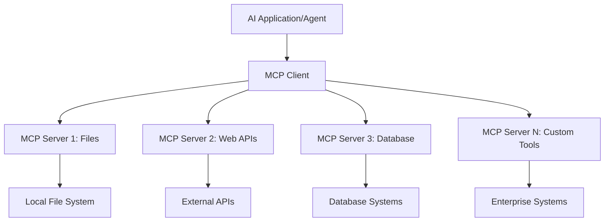

**🔧 मुख्य घटक:**

| घटक | भूमिका | उदाहरण |
|-----------|------|----------|
| **MCP Hosts** | वे एप्लिकेशन जो MCP सेवाओं का उपयोग करते हैं | Claude Desktop, VS Code, AI Toolkit |
| **MCP Clients** | प्रोटोकॉल हैंडलर (सर्वर के साथ 1:1) | होस्ट एप्लिकेशन में अंतर्निहित |
| **MCP Servers** | मानक प्रोटोकॉल के माध्यम से क्षमताएं प्रदान करते हैं | Playwright, Files, Azure, GitHub |
| **Transport Layer** | संचार के तरीके | stdio, HTTP, WebSockets |

## 🏢 Microsoft का MCP सर्वर इकोसिस्टम

Microsoft MCP इकोसिस्टम का नेतृत्व करता है, जिसमें व्यापक एंटरप्राइज-ग्रेड सर्वर शामिल हैं जो वास्तविक व्यावसायिक जरूरतों को पूरा करते हैं।

### 🌟 प्रमुख Microsoft MCP सर्वर

#### 1. ☁️ Azure MCP Server  
**🔗 रिपॉजिटरी**: [azure/azure-mcp](https://github.com/azure/azure-mcp)  
**🎯 उद्देश्य**: AI इंटीग्रेशन के साथ व्यापक Azure संसाधन प्रबंधन

**✨ मुख्य विशेषताएं:**  
- घोषणात्मक इन्फ्रास्ट्रक्चर प्रोविजनिंग  
- रियल-टाइम संसाधन निगरानी  
- लागत अनुकूलन सिफारिशें  
- सुरक्षा अनुपालन जांच

**🚀 उपयोग के मामले:**  
- AI सहायता के साथ Infrastructure-as-Code  
- स्वचालित संसाधन स्केलिंग  
- क्लाउड लागत अनुकूलन  
- DevOps वर्कफ़्लो ऑटोमेशन

#### 2. 📊 Microsoft Dataverse MCP  
**📚 दस्तावेज़**: [Microsoft Dataverse Integration](https://go.microsoft.com/fwlink/?linkid=2320176)  
**🎯 उद्देश्य**: व्यावसायिक डेटा के लिए प्राकृतिक भाषा इंटरफ़ेस

**✨ मुख्य विशेषताएं:**  
- प्राकृतिक भाषा में डेटाबेस क्वेरी  
- व्यावसायिक संदर्भ की समझ  
- कस्टम प्रॉम्प्ट टेम्पलेट्स  
- एंटरप्राइज डेटा गवर्नेंस

**🚀 उपयोग के मामले:**  
- बिजनेस इंटेलिजेंस रिपोर्टिंग  
- ग्राहक डेटा विश्लेषण  
- बिक्री पाइपलाइन अंतर्दृष्टि  
- अनुपालन डेटा क्वेरी

#### 3. 🌐 Playwright MCP Server  
**🔗 रिपॉजिटरी**: [microsoft/playwright-mcp](https://github.com/microsoft/playwright-mcp)  
**🎯 उद्देश्य**: ब्राउज़र ऑटोमेशन और वेब इंटरैक्शन क्षमताएं

**✨ मुख्य विशेषताएं:**  
- क्रॉस-ब्राउज़र ऑटोमेशन (Chrome, Firefox, Safari)  
- बुद्धिमान एलिमेंट डिटेक्शन  
- स्क्रीनशॉट और PDF जनरेशन  
- नेटवर्क ट्रैफिक मॉनिटरिंग

**🚀 उपयोग के मामले:**  
- स्वचालित परीक्षण वर्कफ़्लो  
- वेब स्क्रैपिंग और डेटा एक्सट्रैक्शन  
- UI/UX मॉनिटरिंग  
- प्रतिस्पर्धी विश्लेषण ऑटोमेशन

#### 4. 📁 Files MCP Server  
**🔗 रिपॉजिटरी**: [microsoft/files-mcp-server](https://github.com/microsoft/files-mcp-server)  
**🎯 उद्देश्य**: बुद्धिमान फ़ाइल सिस्टम संचालन

**✨ मुख्य विशेषताएं:**  
- घोषणात्मक फ़ाइल प्रबंधन  
- सामग्री सिंक्रोनाइज़ेशन  
- संस्करण नियंत्रण एकीकरण  
- मेटाडेटा निष्कर्षण

**🚀 उपयोग के मामले:**  
- दस्तावेज़ प्रबंधन  
- कोड रिपॉजिटरी संगठन  
- सामग्री प्रकाशन वर्कफ़्लो  
- डेटा पाइपलाइन फ़ाइल हैंडलिंग

#### 5. 📝 MarkItDown MCP Server  
**🔗 रिपॉजिटरी**: [microsoft/markitdown](https://github.com/microsoft/markitdown)  
**🎯 उद्देश्य**: उन्नत Markdown प्रोसेसिंग और प्रबंधन

**✨ मुख्य विशेषताएं:**  
- समृद्ध Markdown पार्सिंग  
- फॉर्मेट कन्वर्शन (MD ↔ HTML ↔ PDF)  
- सामग्री संरचना विश्लेषण  
- टेम्पलेट प्रोसेसिंग

**🚀 उपयोग के मामले:**  
- तकनीकी दस्तावेज़ वर्कफ़्लो  
- सामग्री प्रबंधन सिस्टम  
- रिपोर्ट जनरेशन  
- नॉलेज बेस ऑटोमेशन

#### 6. 📈 Clarity MCP Server  
**📦 पैकेज**: [@microsoft/clarity-mcp-server](https://www.npmjs.com/package/@microsoft/clarity-mcp-server)  
**🎯 उद्देश्य**: वेब एनालिटिक्स और उपयोगकर्ता व्यवहार अंतर्दृष्टि

**✨ मुख्य विशेषताएं:**  
- हीटमैप डेटा विश्लेषण  
- उपयोगकर्ता सत्र रिकॉर्डिंग  
- प्रदर्शन मेट्रिक्स  
- कन्वर्ज़न फनल विश्लेषण

**🚀 उपयोग के मामले:**  
- वेबसाइट अनुकूलन  
- उपयोगकर्ता अनुभव अनुसंधान  
- A/B परीक्षण विश्लेषण  
- बिजनेस इंटेलिजेंस डैशबोर्ड

### 🌍 समुदाय इकोसिस्टम

Microsoft के सर्वरों के अलावा, MCP इकोसिस्टम में शामिल हैं:  
- **🐙 GitHub MCP**: रिपॉजिटरी प्रबंधन और कोड विश्लेषण  
- **🗄️ डेटाबेस MCPs**: PostgreSQL, MySQL, MongoDB इंटीग्रेशन  
- **☁️ क्लाउड प्रदाता MCPs**: AWS, GCP, Digital Ocean टूल्स  
- **📧 संचार MCPs**: Slack, Teams, Email इंटीग्रेशन

## 🛠️ प्रायोगिक प्रयोगशाला: ब्राउज़र ऑटोमेशन एजेंट बनाना

**🎯 परियोजना लक्ष्य**: Playwright MCP सर्वर का उपयोग करके एक बुद्धिमान ब्राउज़र ऑटोमेशन एजेंट बनाएं जो वेबसाइट्स पर नेविगेट कर सके, जानकारी निकाल सके और जटिल वेब इंटरैक्शन कर सके।

### 🚀 चरण 1: एजेंट की नींव तैयार करना

#### चरण 1: अपना एजेंट प्रारंभ करें  
1. **AI Toolkit Agent Builder खोलें**  
2. **नया एजेंट बनाएं** निम्न कॉन्फ़िगरेशन के साथ:  
   - **नाम**: `BrowserAgent`  
   - **मॉडल**: GPT-4o चुनें  

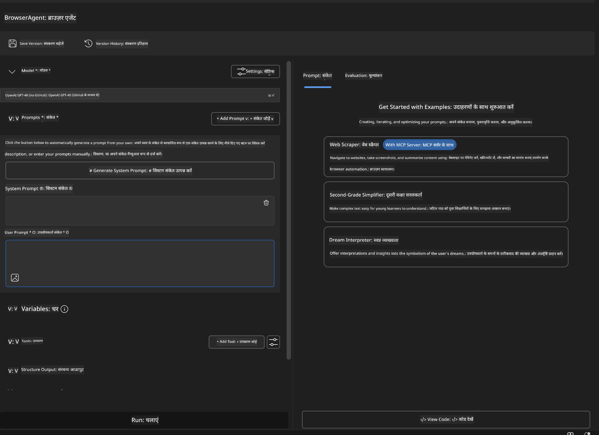

### 🔧 चरण 2: MCP इंटीग्रेशन वर्कफ़्लो

#### चरण 3: MCP सर्वर इंटीग्रेशन जोड़ें  
1. Agent Builder में **Tools सेक्शन** पर जाएं  
2. **"Add Tool"** पर क्लिक करें ताकि इंटीग्रेशन मेनू खुले  
3. उपलब्ध विकल्पों में से **"MCP Server"** चुनें  

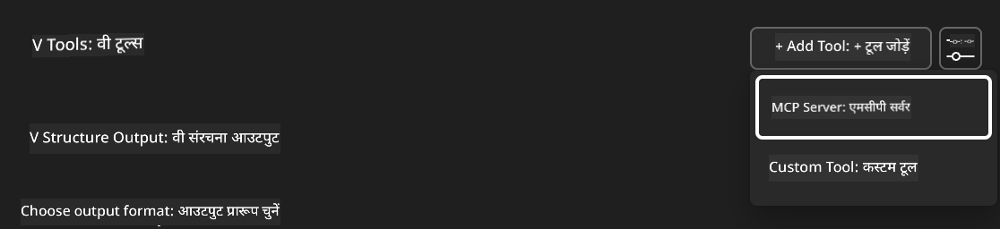

**🔍 टूल प्रकार समझना:**  
- **Built-in Tools**: पूर्व-निर्धारित AI Toolkit फ़ंक्शन  
- **MCP Servers**: बाहरी सेवा इंटीग्रेशन  
- **Custom APIs**: आपके अपने सेवा एंडपॉइंट  
- **Function Calling**: सीधे मॉडल फ़ंक्शन एक्सेस

#### चरण 4: MCP सर्वर चयन  
1. आगे बढ़ने के लिए **"MCP Server"** विकल्प चुनें  
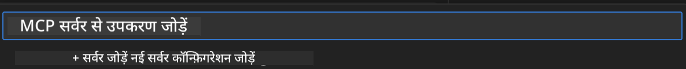

2. उपलब्ध इंटीग्रेशन देखने के लिए MCP कैटलॉग ब्राउज़ करें  
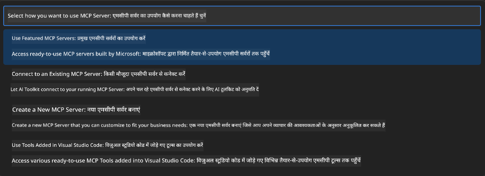

### 🎮 चरण 3: Playwright MCP कॉन्फ़िगरेशन

#### चरण 5: Playwright चुनें और कॉन्फ़िगर करें  
1. Microsoft के सत्यापित सर्वरों तक पहुंचने के लिए **"Use Featured MCP Servers"** पर क्लिक करें  
2. सूची में से **"Playwright"** चुनें  
3. डिफ़ॉल्ट MCP ID स्वीकार करें या अपने वातावरण के लिए अनुकूलित करें  

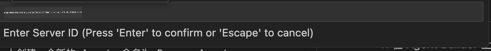

#### चरण 6: Playwright क्षमताएं सक्षम करें  
**🔑 महत्वपूर्ण चरण**: अधिकतम कार्यक्षमता के लिए उपलब्ध सभी Playwright मेथड्स चुनें  

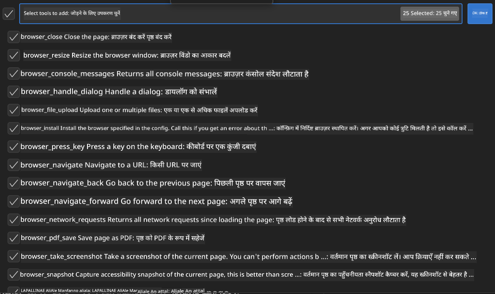

**🛠️ आवश्यक Playwright टूल्स:**  
- **नेविगेशन**: `goto`, `goBack`, `goForward`, `reload`  
- **इंटरैक्शन**: `click`, `fill`, `press`, `hover`, `drag`  
- **निकालना**: `textContent`, `innerHTML`, `getAttribute`  
- **मान्यता**: `isVisible`, `isEnabled`, `waitForSelector`  
- **कैप्चर**: `screenshot`, `pdf`, `video`  
- **नेटवर्क**: `setExtraHTTPHeaders`, `route`, `waitForResponse`

#### चरण 7: इंटीग्रेशन सफलता सत्यापित करें  
**✅ सफलता संकेत:**  
- सभी टूल्स Agent Builder इंटरफ़ेस में दिखें  
- इंटीग्रेशन पैनल में कोई त्रुटि संदेश न हो  
- Playwright सर्वर स्थिति "Connected" दिखाए  

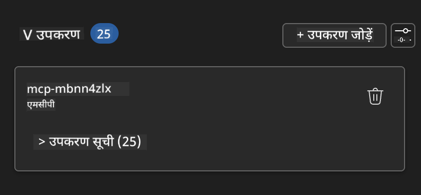

**🔧 सामान्य समस्याओं का समाधान:**  
- **कनेक्शन विफल**: इंटरनेट कनेक्टिविटी और फ़ायरवॉल सेटिंग्स जांचें  
- **टूल्स गायब**: सेटअप के दौरान सभी क्षमताएं चुनी गई हैं यह सुनिश्चित करें  
- **अनुमति त्रुटियां**: जांचें कि VS Code के पास आवश्यक सिस्टम अनुमतियां हैं

### 🎯 चरण 4: उन्नत प्रॉम्प्ट इंजीनियरिंग

#### चरण 8: बुद्धिमान सिस्टम प्रॉम्प्ट डिज़ाइन करें  
Playwright की पूरी क्षमताओं का उपयोग करने वाले परिष्कृत प्रॉम्प्ट बनाएं:

```markdown
# Web Automation Expert System Prompt

## Core Identity
You are an advanced web automation specialist with deep expertise in browser automation, web scraping, and user experience analysis. You have access to Playwright tools for comprehensive browser control.

## Capabilities & Approach
### Navigation Strategy
- Always start with screenshots to understand page layout
- Use semantic selectors (text content, labels) when possible
- Implement wait strategies for dynamic content
- Handle single-page applications (SPAs) effectively

### Error Handling
- Retry failed operations with exponential backoff
- Provide clear error descriptions and solutions
- Suggest alternative approaches when primary methods fail
- Always capture diagnostic screenshots on errors

### Data Extraction
- Extract structured data in JSON format when possible
- Provide confidence scores for extracted information
- Validate data completeness and accuracy
- Handle pagination and infinite scroll scenarios

### Reporting
- Include step-by-step execution logs
- Provide before/after screenshots for verification
- Suggest optimizations and alternative approaches
- Document any limitations or edge cases encountered

## Ethical Guidelines
- Respect robots.txt and rate limiting
- Avoid overloading target servers
- Only extract publicly available information
- Follow website terms of service
```

#### चरण 9: गतिशील उपयोगकर्ता प्रॉम्प्ट बनाएं  
विभिन्न क्षमताओं को प्रदर्शित करने वाले प्रॉम्प्ट डिज़ाइन करें:

**🌐 वेब विश्लेषण उदाहरण:**  
```markdown
Navigate to github.com/kinfey and provide a comprehensive analysis including:
1. Repository structure and organization
2. Recent activity and contribution patterns  
3. Documentation quality assessment
4. Technology stack identification
5. Community engagement metrics
6. Notable projects and their purposes

Include screenshots at key steps and provide actionable insights.
```

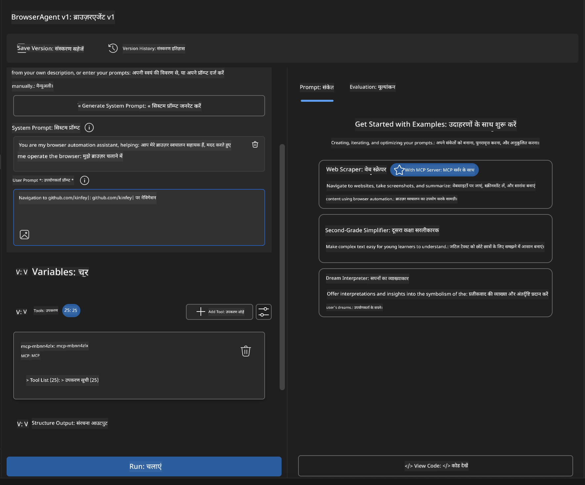

### 🚀 चरण 5: निष्पादन और परीक्षण

#### चरण 10: अपनी पहली ऑटोमेशन चलाएं  
1. ऑटोमेशन अनुक्रम शुरू करने के लिए **"Run"** पर क्लिक करें  
2. रियल-टाइम निष्पादन मॉनिटर करें:  
   - Chrome ब्राउज़र स्वचालित रूप से लॉन्च होगा  
   - एजेंट लक्षित वेबसाइट पर नेविगेट करेगा  
   - प्रत्येक प्रमुख चरण के स्क्रीनशॉट लिए जाएंगे  
   - विश्लेषण परिणाम रियल-टाइम में स्ट्रीम होंगे  

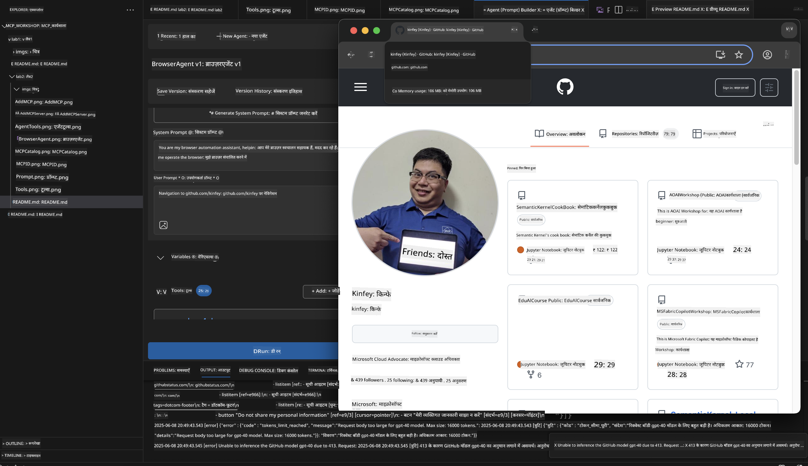

#### चरण 11: परिणाम और अंतर्दृष्टि का विश्लेषण करें  
Agent Builder के इंटरफ़ेस में व्यापक विश्लेषण की समीक्षा करें:

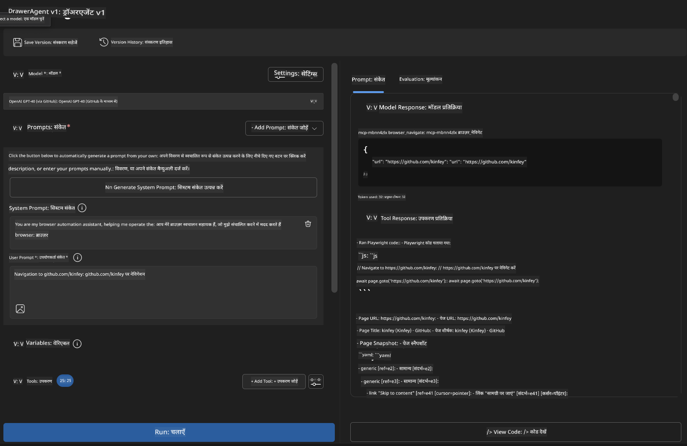

### 🌟 चरण 6: उन्नत क्षमताएं और तैनाती

#### चरण 12: निर्यात और उत्पादन तैनाती  
Agent Builder कई तैनाती विकल्पों का समर्थन करता है:

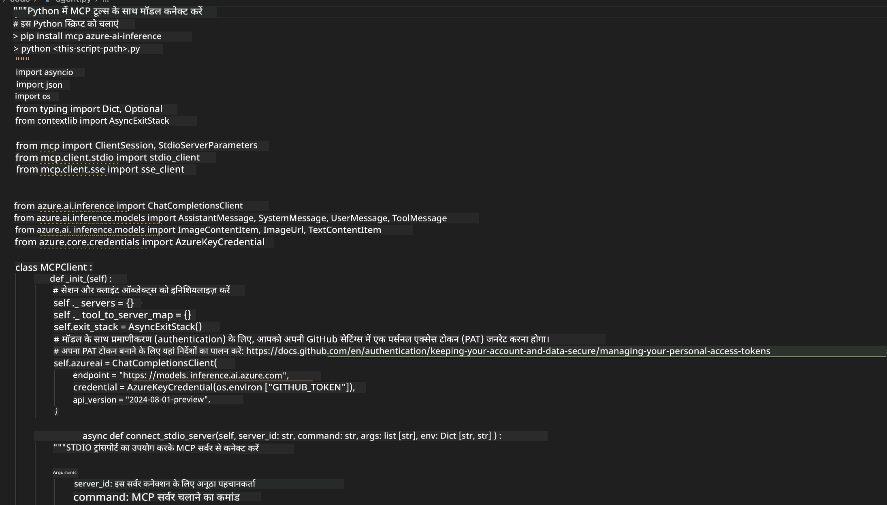

## 🎓 मॉड्यूल 2 सारांश और अगले कदम

### 🏆 उपलब्धि प्राप्त: MCP इंटीग्रेशन मास्टर

**✅ सीखी गई कौशलें:**  
- [ ] MCP आर्किटेक्चर और लाभ समझना  
- [ ] Microsoft के MCP सर्वर इकोसिस्टम में नेविगेट करना  
- [ ] Playwright MCP को AI Toolkit के साथ इंटीग्रेट करना  
- [ ] परिष्कृत ब्राउज़र ऑटोमेशन एजेंट बनाना  
- [ ] वेब ऑटोमेशन के लिए उन्नत प्रॉम्प्ट इंजीनियरिंग

### 📚 अतिरिक्त संसाधन

- **🔗 MCP स्पेसिफिकेशन**: [आधिकारिक प्रोटोकॉल दस्तावेज़](https://modelcontextprotocol.io/)  
- **🛠️ Playwright API**: [पूर्ण मेथड संदर्भ](https://playwright.dev/docs/api/class-playwright)  
- **🏢 Microsoft MCP सर्वर**: [एंटरप्राइज इंटीग्रेशन गाइड](https://github.com/microsoft/mcp-servers)  
- **🌍 समुदाय उदाहरण**: [MCP सर्वर गैलरी](https://github.com/modelcontextprotocol/servers)

**🎉 बधाई हो!** आपने सफलतापूर्वक MCP इंटीग्रेशन में महारत हासिल कर ली है और अब आप बाहरी टूल क्षमताओं के साथ उत्पादन-तैयार AI एजेंट बना सकते हैं!

### 🔜 अगले मॉड्यूल पर जाएं

क्या आप अपनी MCP कौशल को अगले स्तर पर ले जाना चाहते हैं? आगे बढ़ें **[मॉड्यूल 3: AI Toolkit के साथ उन्नत MCP विकास](../lab3/README.md)** जहाँ आप सीखेंगे:  
- अपने कस्टम MCP सर्वर बनाना  
- नवीनतम MCP Python SDK को कॉन्फ़िगर और उपयोग करना  
- डिबगिंग के लिए MCP इंस्पेक्टर सेटअप करना  
- उन्नत MCP सर्वर विकास वर्कफ़्लो में महारत हासिल करना
- एक Weather MCP सर्वर को शुरू से बनाएं

**अस्वीकरण**:  
यह दस्तावेज़ AI अनुवाद सेवा [Co-op Translator](https://github.com/Azure/co-op-translator) का उपयोग करके अनुवादित किया गया है। जबकि हम सटीकता के लिए प्रयासरत हैं, कृपया ध्यान दें कि स्वचालित अनुवादों में त्रुटियाँ या अशुद्धियाँ हो सकती हैं। मूल दस्तावेज़ अपनी मूल भाषा में ही अधिकारिक स्रोत माना जाना चाहिए। महत्वपूर्ण जानकारी के लिए, पेशेवर मानव अनुवाद की सलाह दी जाती है। इस अनुवाद के उपयोग से उत्पन्न किसी भी गलतफहमी या गलत व्याख्या के लिए हम जिम्मेदार नहीं हैं।