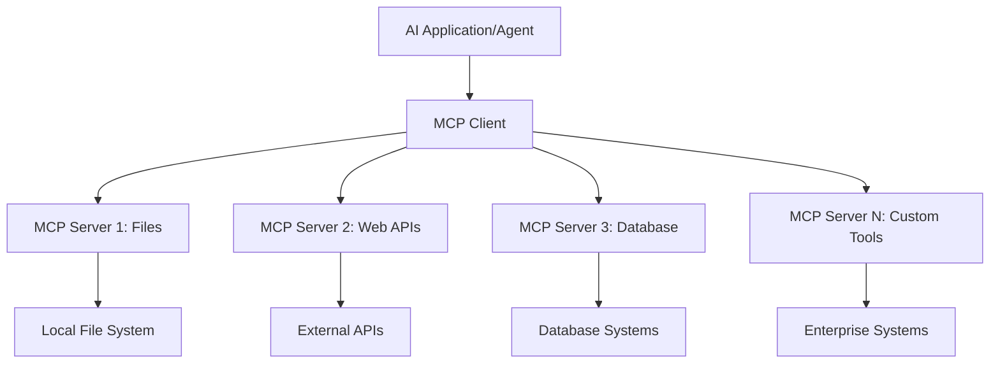

<!--
CO_OP_TRANSLATOR_METADATA:
{
  "original_hash": "a22b7dd11cd7690f99f9195877cafdc3",
  "translation_date": "2025-06-10T05:41:59+00:00",
  "source_file": "10-StreamliningAIWorkflowsBuildingAnMCPServerWithAIToolkit/lab2/README.md",
  "language_code": "hi"
}
-->
# 🌐 मॉड्यूल 2: MCP के साथ AI Toolkit की बुनियादी बातें

[]()
[]()
[]()

## 📋 सीखने के उद्देश्य

इस मॉड्यूल के अंत तक, आप सक्षम होंगे:
- ✅ Model Context Protocol (MCP) की संरचना और लाभ समझना
- ✅ Microsoft के MCP सर्वर इकोसिस्टम का अन्वेषण करना
- ✅ MCP सर्वरों को AI Toolkit Agent Builder के साथ एकीकृत करना
- ✅ Playwright MCP का उपयोग करके एक कार्यात्मक ब्राउज़र ऑटोमेशन एजेंट बनाना
- ✅ अपने एजेंट्स में MCP टूल्स को कॉन्फ़िगर और परीक्षण करना
- ✅ MCP-संचालित एजेंट्स को उत्पादन उपयोग के लिए एक्सपोर्ट और डिप्लॉय करना

## 🎯 मॉड्यूल 1 पर आधारित

मॉड्यूल 1 में, हमने AI Toolkit के मूल बातें सीखी और अपना पहला Python एजेंट बनाया। अब हम आपके एजेंट्स को बाहरी टूल्स और सेवाओं से जोड़कर उन्हें **सुपरचार्ज** करेंगे, वह भी क्रांतिकारी **Model Context Protocol (MCP)** के जरिए।

इसे ऐसे समझें जैसे एक साधारण कैलकुलेटर से एक पूरी कंप्यूटर में अपग्रेड करना — आपके AI एजेंट्स अब सक्षम होंगे:
- 🌐 वेबसाइट्स ब्राउज़ और इंटरैक्ट करना
- 📁 फाइल्स एक्सेस और मैनेज करना
- 🔧 एंटरप्राइज सिस्टम्स के साथ इंटीग्रेशन
- 📊 APIs से रियल-टाइम डेटा प्रोसेसिंग

## 🧠 Model Context Protocol (MCP) को समझना

### 🔍 MCP क्या है?

Model Context Protocol (MCP) AI एप्लिकेशन के लिए **"USB-C"** जैसा है — एक क्रांतिकारी खुला मानक जो बड़े भाषा मॉडल्स (LLMs) को बाहरी टूल्स, डेटा स्रोतों और सेवाओं से जोड़ता है। जैसे USB-C ने एक यूनिवर्सल कनेक्टर देकर केबल की उलझन खत्म कर दी, वैसे ही MCP AI इंटीग्रेशन की जटिलता को एक मानकीकृत प्रोटोकॉल से खत्म करता है।

### 🎯 MCP कौन सी समस्या हल करता है

**MCP से पहले:**
- 🔧 हर टूल के लिए कस्टम इंटीग्रेशन
- 🔄 प्रोप्राइटरी सॉल्यूशंस के कारण वेंडर लॉक-इन
- 🔒 असुरक्षित कनेक्शंस से सुरक्षा जोखिम
- ⏱️ बेसिक इंटीग्रेशन के लिए महीनों का विकास

**MCP के साथ:**
- ⚡ प्लग-एंड-प्ले टूल इंटीग्रेशन
- 🔄 वेंडर-एग्नोस्टिक आर्किटेक्चर
- 🛡️ इनबिल्ट सुरक्षा सर्वोत्तम प्रथाएं
- 🚀 नई क्षमताओं को मिनटों में जोड़ना

### 🏗️ MCP आर्किटेक्चर का गहरा अवलोकन

MCP एक **क्लाइंट-सर्वर आर्किटेक्चर** का पालन करता है जो एक सुरक्षित, स्केलेबल इकोसिस्टम बनाता है:



**🔧 मुख्य घटक:**

| घटक | भूमिका | उदाहरण |
|-----------|------|----------|
| **MCP Hosts** | वे एप्लिकेशन जो MCP सेवाओं का उपयोग करते हैं | Claude Desktop, VS Code, AI Toolkit |
| **MCP Clients** | प्रोटोकॉल हैंडलर (सर्वरों के साथ 1:1) | होस्ट एप्लिकेशन में बिल्ट-इन |
| **MCP Servers** | मानक प्रोटोकॉल के माध्यम से क्षमताएँ प्रदान करते हैं | Playwright, Files, Azure, GitHub |
| **Transport Layer** | संचार के तरीके | stdio, HTTP, WebSockets |

## 🏢 Microsoft का MCP सर्वर इकोसिस्टम

Microsoft MCP इकोसिस्टम का नेतृत्व करता है, जिसमें एंटरप्राइज-ग्रेड सर्वरों का एक व्यापक सेट है जो व्यावसायिक जरूरतों को पूरा करता है।

### 🌟 प्रमुख Microsoft MCP सर्वर

#### 1. ☁️ Azure MCP Server
**🔗 रिपॉजिटरी**: [azure/azure-mcp](https://github.com/azure/azure-mcp)  
**🎯 उद्देश्य**: AI इंटीग्रेशन के साथ व्यापक Azure संसाधन प्रबंधन

**✨ मुख्य विशेषताएँ:**
- घोषणात्मक इन्फ्रास्ट्रक्चर प्रोविजनिंग
- रियल-टाइम संसाधन मॉनिटरिंग
- लागत अनुकूलन सिफारिशें
- सुरक्षा अनुपालन जांच

**🚀 उपयोग के मामले:**
- AI सहायता के साथ Infrastructure-as-Code
- स्वचालित संसाधन स्केलिंग
- क्लाउड लागत अनुकूलन
- DevOps वर्कफ़्लो ऑटोमेशन

#### 2. 📊 Microsoft Dataverse MCP
**📚 दस्तावेज़**: [Microsoft Dataverse Integration](https://go.microsoft.com/fwlink/?linkid=2320176)  
**🎯 उद्देश्य**: व्यावसायिक डेटा के लिए प्राकृतिक भाषा इंटरफेस

**✨ मुख्य विशेषताएँ:**
- प्राकृतिक भाषा में डेटाबेस क्वेरीज़
- व्यवसाय संदर्भ की समझ
- कस्टम प्रॉम्प्ट टेम्प्लेट्स
- एंटरप्राइज डेटा गवर्नेंस

**🚀 उपयोग के मामले:**
- बिजनेस इंटेलिजेंस रिपोर्टिंग
- ग्राहक डेटा विश्लेषण
- सेल्स पाइपलाइन इनसाइट्स
- अनुपालन डेटा क्वेरीज़

#### 3. 🌐 Playwright MCP Server
**🔗 रिपॉजिटरी**: [microsoft/playwright-mcp](https://github.com/microsoft/playwright-mcp)  
**🎯 उद्देश्य**: ब्राउज़र ऑटोमेशन और वेब इंटरैक्शन क्षमताएँ

**✨ मुख्य विशेषताएँ:**
- क्रॉस-ब्राउज़र ऑटोमेशन (Chrome, Firefox, Safari)
- बुद्धिमान एलिमेंट डिटेक्शन
- स्क्रीनशॉट और PDF जेनरेशन
- नेटवर्क ट्रैफिक मॉनिटरिंग

**🚀 उपयोग के मामले:**
- स्वचालित परीक्षण वर्कफ़्लो
- वेब स्क्रैपिंग और डेटा एक्सट्रैक्शन
- UI/UX मॉनिटरिंग
- प्रतिस्पर्धात्मक विश्लेषण ऑटोमेशन

#### 4. 📁 Files MCP Server
**🔗 रिपॉजिटरी**: [microsoft/files-mcp-server](https://github.com/microsoft/files-mcp-server)  
**🎯 उद्देश्य**: इंटेलिजेंट फाइल सिस्टम ऑपरेशंस

**✨ मुख्य विशेषताएँ:**
- घोषणात्मक फ़ाइल प्रबंधन
- कंटेंट सिंक्रोनाइज़ेशन
- वर्शन कंट्रोल इंटीग्रेशन
- मेटाडेटा एक्सट्रैक्शन

**🚀 उपयोग के मामले:**
- दस्तावेज़ प्रबंधन
- कोड रिपॉजिटरी संगठन
- कंटेंट पब्लिशिंग वर्कफ़्लो
- डेटा पाइपलाइन फ़ाइल हैंडलिंग

#### 5. 📝 MarkItDown MCP Server
**🔗 रिपॉजिटरी**: [microsoft/markitdown](https://github.com/microsoft/markitdown)  
**🎯 उद्देश्य**: उन्नत Markdown प्रोसेसिंग और संशोधन

**✨ मुख्य विशेषताएँ:**
- समृद्ध Markdown पार्सिंग
- फॉर्मेट कन्वर्शन (MD ↔ HTML ↔ PDF)
- कंटेंट संरचना विश्लेषण
- टेम्पलेट प्रोसेसिंग

**🚀 उपयोग के मामले:**
- तकनीकी दस्तावेज़ वर्कफ़्लो
- कंटेंट मैनेजमेंट सिस्टम
- रिपोर्ट जेनरेशन
- नॉलेज बेस ऑटोमेशन

#### 6. 📈 Clarity MCP Server
**📦 पैकेज**: [@microsoft/clarity-mcp-server](https://www.npmjs.com/package/@microsoft/clarity-mcp-server)  
**🎯 उद्देश्य**: वेब एनालिटिक्स और उपयोगकर्ता व्यवहार अंतर्दृष्टि

**✨ मुख्य विशेषताएँ:**
- हीटमैप डेटा विश्लेषण
- उपयोगकर्ता सत्र रिकॉर्डिंग
- प्रदर्शन मीट्रिक्स
- कन्वर्शन फनल विश्लेषण

**🚀 उपयोग के मामले:**
- वेबसाइट अनुकूलन
- उपयोगकर्ता अनुभव अनुसंधान
- A/B परीक्षण विश्लेषण
- बिजनेस इंटेलिजेंस डैशबोर्ड

### 🌍 समुदाय इकोसिस्टम

Microsoft के सर्वरों के अलावा, MCP इकोसिस्टम में शामिल हैं:  
- **🐙 GitHub MCP**: रिपॉजिटरी प्रबंधन और कोड विश्लेषण  
- **🗄️ डेटाबेस MCPs**: PostgreSQL, MySQL, MongoDB इंटीग्रेशन  
- **☁️ क्लाउड प्रोवाइडर MCPs**: AWS, GCP, Digital Ocean टूल्स  
- **📧 कम्युनिकेशन MCPs**: Slack, Teams, ईमेल इंटीग्रेशन

## 🛠️ हैंड्स-ऑन लैब: ब्राउज़र ऑटोमेशन एजेंट बनाना

**🎯 प्रोजेक्ट का लक्ष्य**: Playwright MCP सर्वर का उपयोग करके एक इंटेलिजेंट ब्राउज़र ऑटोमेशन एजेंट बनाएं जो वेबसाइट्स नेविगेट कर सके, जानकारी निकाल सके और जटिल वेब इंटरैक्शन कर सके।

### 🚀 चरण 1: एजेंट की आधारशिला सेटअप

#### चरण 1: अपना एजेंट इनिशियलाइज़ करें
1. **AI Toolkit Agent Builder खोलें**  
2. **नया एजेंट बनाएं** निम्नलिखित कॉन्फ़िगरेशन के साथ:  
   - **नाम**: `BrowserAgent`
   - **Model**: Choose GPT-4o 


### 🔧 Phase 2: MCP Integration Workflow

#### Step 3: Add MCP Server Integration
1. **Navigate to Tools Section** in Agent Builder
2. **Click "Add Tool"** to open the integration menu
3. **Select "MCP Server"** from available options


**🔍 Understanding Tool Types:**
- **Built-in Tools**: Pre-configured AI Toolkit functions
- **MCP Servers**: External service integrations
- **Custom APIs**: Your own service endpoints
- **Function Calling**: Direct model function access

#### Step 4: MCP Server Selection
1. **Choose "MCP Server"** option to proceed


2. **Browse MCP Catalog** to explore available integrations


### 🎮 Phase 3: Playwright MCP Configuration

#### Step 5: Select and Configure Playwright
1. **Click "Use Featured MCP Servers"** to access Microsoft's verified servers
2. **Select "Playwright"** from the featured list
3. **Accept Default MCP ID** or customize for your environment


#### Step 6: Enable Playwright Capabilities
**🔑 Critical Step**: Select **ALL** available Playwright methods for maximum functionality


**🛠️ Essential Playwright Tools:**
- **Navigation**: `goto`, `goBack`, `goForward`, `reload`
- **Interaction**: `click`, `fill`, `press`, `hover`, `drag`
- **Extraction**: `textContent`, `innerHTML`, `getAttribute`
- **Validation**: `isVisible`, `isEnabled`, `waitForSelector`
- **Capture**: `screenshot`, `pdf`, `video`
- **Network**: `setExtraHTTPHeaders`, `route`, `waitForResponse`

#### चरण 7: इंटीग्रेशन की सफलता की पुष्टि करें
**✅ सफलता के संकेत:**
- सभी टूल्स Agent Builder इंटरफ़ेस में दिखाई दें
- इंटीग्रेशन पैनल में कोई त्रुटि संदेश न हो
- Playwright सर्वर की स्थिति "Connected" दिखाए


**🔧 सामान्य समस्याओं का निवारण:**
- **कनेक्शन फेल**: इंटरनेट कनेक्टिविटी और फ़ायरवॉल सेटिंग्स जांचें  
- **टूल्स गायब हैं**: सुनिश्चित करें कि सेटअप के दौरान सभी क्षमताएँ चुनी गई थीं  
- **परमिशन त्रुटियाँ**: जांचें कि VS Code के पास आवश्यक सिस्टम अनुमतियाँ हैं

### 🎯 चरण 4: उन्नत प्रॉम्प्ट इंजीनियरिंग

#### चरण 8: इंटेलिजेंट सिस्टम प्रॉम्प्ट डिज़ाइन करें  
Playwright की पूरी क्षमताओं का उपयोग करने वाले परिष्कृत प्रॉम्प्ट बनाएं:

```markdown
# Web Automation Expert System Prompt

## Core Identity
You are an advanced web automation specialist with deep expertise in browser automation, web scraping, and user experience analysis. You have access to Playwright tools for comprehensive browser control.

## Capabilities & Approach
### Navigation Strategy
- Always start with screenshots to understand page layout
- Use semantic selectors (text content, labels) when possible
- Implement wait strategies for dynamic content
- Handle single-page applications (SPAs) effectively

### Error Handling
- Retry failed operations with exponential backoff
- Provide clear error descriptions and solutions
- Suggest alternative approaches when primary methods fail
- Always capture diagnostic screenshots on errors

### Data Extraction
- Extract structured data in JSON format when possible
- Provide confidence scores for extracted information
- Validate data completeness and accuracy
- Handle pagination and infinite scroll scenarios

### Reporting
- Include step-by-step execution logs
- Provide before/after screenshots for verification
- Suggest optimizations and alternative approaches
- Document any limitations or edge cases encountered

## Ethical Guidelines
- Respect robots.txt and rate limiting
- Avoid overloading target servers
- Only extract publicly available information
- Follow website terms of service
```

#### चरण 9: डायनामिक यूजर प्रॉम्प्ट बनाएं  
विभिन्न क्षमताओं को दिखाने वाले प्रॉम्प्ट डिज़ाइन करें:

**🌐 वेब विश्लेषण उदाहरण:**  
```markdown
Navigate to github.com/kinfey and provide a comprehensive analysis including:
1. Repository structure and organization
2. Recent activity and contribution patterns  
3. Documentation quality assessment
4. Technology stack identification
5. Community engagement metrics
6. Notable projects and their purposes

Include screenshots at key steps and provide actionable insights.
```


### 🚀 चरण 5: निष्पादन और परीक्षण

#### चरण 10: अपनी पहली ऑटोमेशन चलाएं
1. **"Run" पर क्लिक करें** ताकि ऑटोमेशन शुरू हो  
2. **रियल-टाइम निष्पादन मॉनिटर करें**:  
   - Chrome ब्राउज़र अपने आप खुलेगा  
   - एजेंट लक्षित वेबसाइट पर नेविगेट करेगा  
   - प्रत्येक मुख्य चरण के स्क्रीनशॉट लिए जाएंगे  
   - विश्लेषण परिणाम रियल-टाइम में स्ट्रीम होंगे


#### चरण 11: परिणाम और इनसाइट्स का विश्लेषण करें  
Agent Builder के इंटरफ़ेस में व्यापक विश्लेषण की समीक्षा करें:


### 🌟 चरण 6: उन्नत क्षमताएँ और डिप्लॉयमेंट

#### चरण 12: एक्सपोर्ट और प्रोडक्शन डिप्लॉयमेंट  
Agent Builder कई डिप्लॉयमेंट विकल्पों का समर्थन करता है:


## 🎓 मॉड्यूल 2 सारांश और अगले कदम

### 🏆 उपलब्धि अनलॉक: MCP इंटीग्रेशन मास्टर

**✅ सीखी गई कौशलें:**
- [ ] MCP आर्किटेक्चर और लाभ समझना  
- [ ] Microsoft के MCP सर्वर इकोसिस्टम में नेविगेट करना  
- [ ] Playwright MCP को AI Toolkit के साथ इंटीग्रेट करना  
- [ ] परिष्कृत ब्राउज़र ऑटोमेशन एजेंट बनाना  
- [ ] वेब ऑटोमेशन के लिए उन्नत प्रॉम्प्ट इंजीनियरिंग

### 📚 अतिरिक्त संसाधन

- **🔗 MCP स्पेसिफिकेशन**: [Official Protocol Documentation](https://modelcontextprotocol.io/)  
- **🛠️ Playwright API**: [Complete Method Reference](https://playwright.dev/docs/api/class-playwright)  
- **🏢 Microsoft MCP Servers**: [Enterprise Integration Guide](https://github.com/microsoft/mcp-servers)  
- **🌍 कम्युनिटी उदाहरण**: [MCP Server Gallery](https://github.com/modelcontextprotocol/servers)

**🎉 बधाई हो!** आपने MCP इंटीग्रेशन में महारत हासिल कर ली है और अब आप बाहरी टूल क्षमताओं के साथ उत्पादन-तैयार AI एजेंट बना सकते हैं!

### 🔜 अगले मॉड्यूल पर जाएं

अपने MCP कौशल को अगले स्तर पर ले जाने के लिए तैयार हैं? आगे बढ़ें **[मॉड्यूल 3: AI Toolkit के साथ उन्नत MCP विकास](../lab3/README.md)** जहाँ आप सीखेंगे:  
- अपने खुद के कस्टम MCP सर्वर बनाना  
- नवीनतम MCP Python SDK को कॉन्फ़िगर और उपयोग करना  
- डिबगिंग के लिए MCP Inspector सेटअप करना  
- उन्नत MCP सर्वर विकास वर्कफ़्लोज़ में महारत हासिल करना  
- स्क्रैच से Weather MCP Server बनाना

**अस्वीकरण**:  
इस दस्तावेज़ का अनुवाद AI अनुवाद सेवा [Co-op Translator](https://github.com/Azure/co-op-translator) का उपयोग करके किया गया है। जबकि हम सटीकता के लिए प्रयासरत हैं, कृपया ध्यान रखें कि स्वचालित अनुवादों में त्रुटियाँ या असंगतियाँ हो सकती हैं। मूल दस्तावेज़ अपनी मूल भाषा में प्राधिकृत स्रोत माना जाना चाहिए। महत्वपूर्ण जानकारी के लिए, पेशेवर मानव अनुवाद की सलाह दी जाती है। इस अनुवाद के उपयोग से उत्पन्न किसी भी गलतफहमी या गलत व्याख्या के लिए हम जिम्मेदार नहीं हैं।