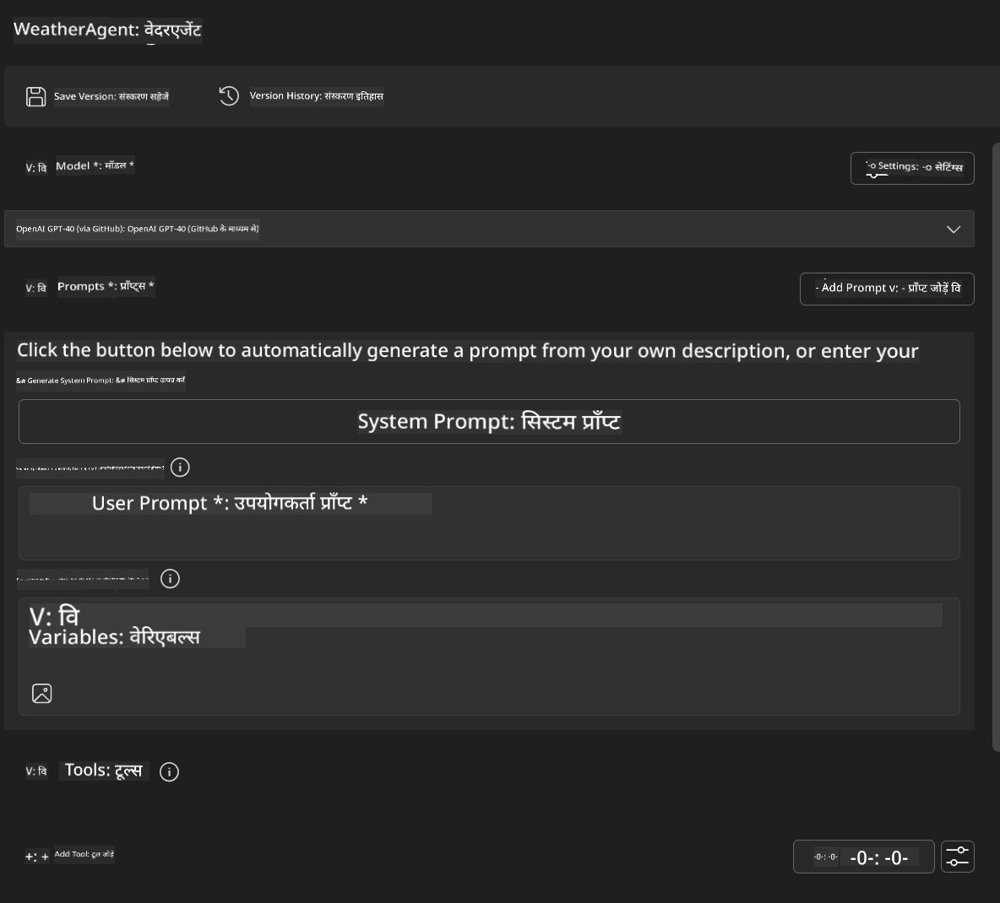
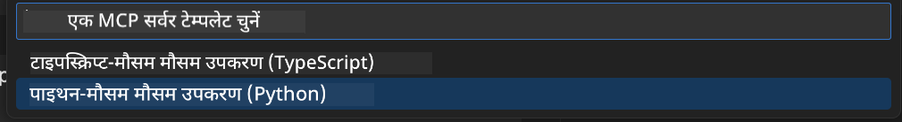
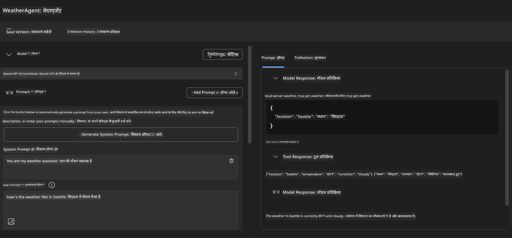
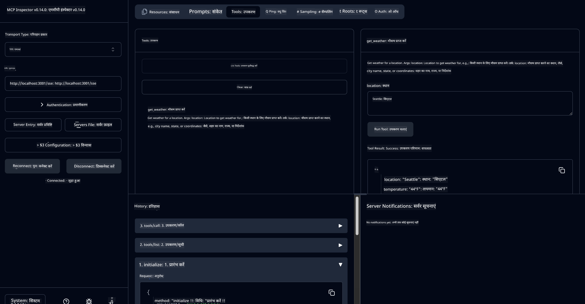

<!--
CO_OP_TRANSLATOR_METADATA:
{
  "original_hash": "dd8da3f75addcef453fe11f02a270217",
  "translation_date": "2025-07-14T08:10:30+00:00",
  "source_file": "10-StreamliningAIWorkflowsBuildingAnMCPServerWithAIToolkit/lab3/README.md",
  "language_code": "hi"
}
-->
# 🔧 मॉड्यूल 3: AI Toolkit के साथ उन्नत MCP विकास


## 🎯 सीखने के उद्देश्य

इस लैब के अंत तक, आप सक्षम होंगे:

- ✅ AI Toolkit का उपयोग करके कस्टम MCP सर्वर बनाना
- ✅ नवीनतम MCP Python SDK (v1.9.3) को कॉन्फ़िगर और उपयोग करना
- ✅ डिबगिंग के लिए MCP Inspector सेटअप और उपयोग करना
- ✅ Agent Builder और Inspector दोनों वातावरण में MCP सर्वर डिबग करना
- ✅ उन्नत MCP सर्वर विकास वर्कफ़्लो को समझना

## 📋 पूर्व आवश्यकताएँ

- लैब 2 (MCP Fundamentals) पूरा किया हुआ हो
- VS Code में AI Toolkit एक्सटेंशन इंस्टॉल हो
- Python 3.10+ वातावरण
- Inspector सेटअप के लिए Node.js और npm

## 🏗️ आप क्या बनाएंगे

इस लैब में, आप एक **Weather MCP Server** बनाएंगे जो निम्नलिखित दिखाता है:
- कस्टम MCP सर्वर का कार्यान्वयन
- AI Toolkit Agent Builder के साथ एकीकरण
- पेशेवर डिबगिंग वर्कफ़्लो
- आधुनिक MCP SDK उपयोग पैटर्न

---

## 🔧 मुख्य घटकों का अवलोकन

### 🐍 MCP Python SDK  
Model Context Protocol Python SDK कस्टम MCP सर्वर बनाने की नींव प्रदान करता है। आप संस्करण 1.9.3 का उपयोग करेंगे जिसमें बेहतर डिबगिंग क्षमताएँ हैं।

### 🔍 MCP Inspector  
एक शक्तिशाली डिबगिंग टूल जो प्रदान करता है:  
- रियल-टाइम सर्वर मॉनिटरिंग  
- टूल निष्पादन का विज़ुअलाइज़ेशन  
- नेटवर्क अनुरोध/प्रतिक्रिया निरीक्षण  
- इंटरैक्टिव परीक्षण वातावरण  

---

## 📖 चरण-दर-चरण कार्यान्वयन

### चरण 1: Agent Builder में WeatherAgent बनाएं

1. VS Code में AI Toolkit एक्सटेंशन के माध्यम से **Agent Builder लॉन्च करें**  
2. निम्नलिखित कॉन्फ़िगरेशन के साथ **नया एजेंट बनाएं**:  
   - एजेंट नाम: `WeatherAgent`



### चरण 2: MCP सर्वर प्रोजेक्ट इनिशियलाइज़ करें

1. Agent Builder में **Tools** → **Add Tool** पर जाएं  
2. उपलब्ध विकल्पों में से **"MCP Server" चुनें**  
3. **"Create A new MCP Server" चुनें**  
4. `python-weather` टेम्पलेट चुनें  
5. अपने सर्वर का नाम दें: `weather_mcp`



### चरण 3: प्रोजेक्ट खोलें और जांचें

1. VS Code में जनरेट किया गया प्रोजेक्ट खोलें  
2. प्रोजेक्ट संरचना की समीक्षा करें:  
   ```
   weather_mcp/
   ├── src/
   │   ├── __init__.py
   │   └── server.py
   ├── inspector/
   │   ├── package.json
   │   └── package-lock.json
   ├── .vscode/
   │   ├── launch.json
   │   └── tasks.json
   ├── pyproject.toml
   └── README.md
   ```

### चरण 4: नवीनतम MCP SDK में अपग्रेड करें

> **🔍 क्यों अपग्रेड करें?** हम नवीनतम MCP SDK (v1.9.3) और Inspector सेवा (0.14.0) का उपयोग करना चाहते हैं ताकि बेहतर फीचर्स और डिबगिंग क्षमताएँ मिल सकें।

#### 4a. Python Dependencies अपडेट करें

**`pyproject.toml` संपादित करें:** [./code/weather_mcp/pyproject.toml](../../../../10-StreamliningAIWorkflowsBuildingAnMCPServerWithAIToolkit/lab3/code/weather_mcp/pyproject.toml) को अपडेट करें

#### 4b. Inspector कॉन्फ़िगरेशन अपडेट करें

**`inspector/package.json` संपादित करें:** [./code/weather_mcp/inspector/package.json](../../../../10-StreamliningAIWorkflowsBuildingAnMCPServerWithAIToolkit/lab3/code/weather_mcp/inspector/package.json) को अपडेट करें

#### 4c. Inspector Dependencies अपडेट करें

**`inspector/package-lock.json` संपादित करें:** [./code/weather_mcp/inspector/package-lock.json](../../../../10-StreamliningAIWorkflowsBuildingAnMCPServerWithAIToolkit/lab3/code/weather_mcp/inspector/package-lock.json) को अपडेट करें

> **📝 नोट:** इस फाइल में विस्तृत डिपेंडेंसी परिभाषाएँ हैं। नीचे आवश्यक संरचना दी गई है - पूरी सामग्री उचित डिपेंडेंसी समाधान सुनिश्चित करती है।

> **⚡ पूर्ण पैकेज लॉक:** पूरा package-lock.json लगभग 3000 लाइनों की डिपेंडेंसी परिभाषाएँ रखता है। ऊपर मुख्य संरचना दिखाई गई है - पूर्ण डिपेंडेंसी समाधान के लिए प्रदान की गई फाइल का उपयोग करें।

### चरण 5: VS Code डिबगिंग कॉन्फ़िगरेशन सेट करें

*नोट: कृपया निर्दिष्ट पथ में फाइल को कॉपी करके स्थानीय फाइल को प्रतिस्थापित करें*

#### 5a. लॉन्च कॉन्फ़िगरेशन अपडेट करें

**`.vscode/launch.json` संपादित करें:**  
```json
{
  "version": "0.2.0",
  "configurations": [
    {
      "name": "Attach to Local MCP",
      "type": "debugpy",
      "request": "attach",
      "connect": {
        "host": "localhost",
        "port": 5678
      },
      "presentation": {
        "hidden": true
      },
      "internalConsoleOptions": "neverOpen",
      "postDebugTask": "Terminate All Tasks"
    },
    {
      "name": "Launch Inspector (Edge)",
      "type": "msedge",
      "request": "launch",
      "url": "http://localhost:6274?timeout=60000&serverUrl=http://localhost:3001/sse#tools",
      "cascadeTerminateToConfigurations": [
        "Attach to Local MCP"
      ],
      "presentation": {
        "hidden": true
      },
      "internalConsoleOptions": "neverOpen"
    },
    {
      "name": "Launch Inspector (Chrome)",
      "type": "chrome",
      "request": "launch",
      "url": "http://localhost:6274?timeout=60000&serverUrl=http://localhost:3001/sse#tools",
      "cascadeTerminateToConfigurations": [
        "Attach to Local MCP"
      ],
      "presentation": {
        "hidden": true
      },
      "internalConsoleOptions": "neverOpen"
    }
  ],
  "compounds": [
    {
      "name": "Debug in Agent Builder",
      "configurations": [
        "Attach to Local MCP"
      ],
      "preLaunchTask": "Open Agent Builder",
    },
    {
      "name": "Debug in Inspector (Edge)",
      "configurations": [
        "Launch Inspector (Edge)",
        "Attach to Local MCP"
      ],
      "preLaunchTask": "Start MCP Inspector",
      "stopAll": true
    },
    {
      "name": "Debug in Inspector (Chrome)",
      "configurations": [
        "Launch Inspector (Chrome)",
        "Attach to Local MCP"
      ],
      "preLaunchTask": "Start MCP Inspector",
      "stopAll": true
    }
  ]
}
```

**`.vscode/tasks.json` संपादित करें:**  
```
{
  "version": "2.0.0",
  "tasks": [
    {
      "label": "Start MCP Server",
      "type": "shell",
      "command": "python -m debugpy --listen 127.0.0.1:5678 src/__init__.py sse",
      "isBackground": true,
      "options": {
        "cwd": "${workspaceFolder}",
        "env": {
          "PORT": "3001"
        }
      },
      "problemMatcher": {
        "pattern": [
          {
            "regexp": "^.*$",
            "file": 0,
            "location": 1,
            "message": 2
          }
        ],
        "background": {
          "activeOnStart": true,
          "beginsPattern": ".*",
          "endsPattern": "Application startup complete|running"
        }
      }
    },
    {
      "label": "Start MCP Inspector",
      "type": "shell",
      "command": "npm run dev:inspector",
      "isBackground": true,
      "options": {
        "cwd": "${workspaceFolder}/inspector",
        "env": {
          "CLIENT_PORT": "6274",
          "SERVER_PORT": "6277",
        }
      },
      "problemMatcher": {
        "pattern": [
          {
            "regexp": "^.*$",
            "file": 0,
            "location": 1,
            "message": 2
          }
        ],
        "background": {
          "activeOnStart": true,
          "beginsPattern": "Starting MCP inspector",
          "endsPattern": "Proxy server listening on port"
        }
      },
      "dependsOn": [
        "Start MCP Server"
      ]
    },
    {
      "label": "Open Agent Builder",
      "type": "shell",
      "command": "echo ${input:openAgentBuilder}",
      "presentation": {
        "reveal": "never"
      },
      "dependsOn": [
        "Start MCP Server"
      ],
    },
    {
      "label": "Terminate All Tasks",
      "command": "echo ${input:terminate}",
      "type": "shell",
      "problemMatcher": []
    }
  ],
  "inputs": [
    {
      "id": "openAgentBuilder",
      "type": "command",
      "command": "ai-mlstudio.agentBuilder",
      "args": {
        "initialMCPs": [ "local-server-weather_mcp" ],
        "triggeredFrom": "vsc-tasks"
      }
    },
    {
      "id": "terminate",
      "type": "command",
      "command": "workbench.action.tasks.terminate",
      "args": "terminateAll"
    }
  ]
}
```

---

## 🚀 अपने MCP सर्वर को चलाना और परीक्षण करना

### चरण 6: Dependencies इंस्टॉल करें

कॉन्फ़िगरेशन परिवर्तन करने के बाद, निम्नलिखित कमांड चलाएं:

**Python dependencies इंस्टॉल करें:**  
```bash
uv sync
```

**Inspector dependencies इंस्टॉल करें:**  
```bash
cd inspector
npm install
```

### चरण 7: Agent Builder के साथ डिबग करें

1. **F5 दबाएं** या **"Debug in Agent Builder"** कॉन्फ़िगरेशन का उपयोग करें  
2. डिबग पैनल से कंपाउंड कॉन्फ़िगरेशन चुनें  
3. सर्वर शुरू होने और Agent Builder खुलने का इंतजार करें  
4. प्राकृतिक भाषा क्वेरी के साथ अपने weather MCP सर्वर का परीक्षण करें

इस तरह का इनपुट प्रॉम्प्ट दें

SYSTEM_PROMPT

```
You are my weather assistant
```

USER_PROMPT

```
How's the weather like in Seattle
```



### चरण 8: MCP Inspector के साथ डिबग करें

1. **"Debug in Inspector"** कॉन्फ़िगरेशन का उपयोग करें (Edge या Chrome)  
2. `http://localhost:6274` पर Inspector इंटरफ़ेस खोलें  
3. इंटरैक्टिव परीक्षण वातावरण का अन्वेषण करें:  
   - उपलब्ध टूल देखें  
   - टूल निष्पादन का परीक्षण करें  
   - नेटवर्क अनुरोध मॉनिटर करें  
   - सर्वर प्रतिक्रियाओं को डिबग करें



---

## 🎯 मुख्य सीखने के परिणाम

इस लैब को पूरा करके, आपने:

- [x] AI Toolkit टेम्पलेट्स का उपयोग करके **कस्टम MCP सर्वर बनाया**  
- [x] बेहतर कार्यक्षमता के लिए नवीनतम MCP SDK (v1.9.3) में **अपग्रेड किया**  
- [x] Agent Builder और Inspector दोनों के लिए **पेशेवर डिबगिंग वर्कफ़्लो कॉन्फ़िगर किए**  
- [x] इंटरैक्टिव सर्वर परीक्षण के लिए **MCP Inspector सेटअप किया**  
- [x] MCP विकास के लिए **VS Code डिबगिंग कॉन्फ़िगरेशन में महारत हासिल की**

## 🔧 उन्नत फीचर्स का अन्वेषण

| फीचर | विवरण | उपयोग का मामला |
|---------|-------------|----------|
| **MCP Python SDK v1.9.3** | नवीनतम प्रोटोकॉल कार्यान्वयन | आधुनिक सर्वर विकास |
| **MCP Inspector 0.14.0** | इंटरैक्टिव डिबगिंग टूल | रियल-टाइम सर्वर परीक्षण |
| **VS Code डिबगिंग** | एकीकृत विकास वातावरण | पेशेवर डिबगिंग वर्कफ़्लो |
| **Agent Builder एकीकरण** | सीधे AI Toolkit कनेक्शन | एंड-टू-एंड एजेंट परीक्षण |

## 📚 अतिरिक्त संसाधन

- [MCP Python SDK Documentation](https://modelcontextprotocol.io/docs/sdk/python)  
- [AI Toolkit Extension Guide](https://code.visualstudio.com/docs/ai/ai-toolkit)  
- [VS Code Debugging Documentation](https://code.visualstudio.com/docs/editor/debugging)  
- [Model Context Protocol Specification](https://modelcontextprotocol.io/docs/concepts/architecture)  

---

**🎉 बधाई हो!** आपने सफलतापूर्वक लैब 3 पूरा कर लिया है और अब आप पेशेवर विकास वर्कफ़्लो का उपयोग करके कस्टम MCP सर्वर बना, डिबग और डिप्लॉय कर सकते हैं।

### 🔜 अगले मॉड्यूल पर जाएं

क्या आप अपने MCP कौशल को वास्तविक विकास वर्कफ़्लो में लागू करने के लिए तैयार हैं? आगे बढ़ें **[मॉड्यूल 4: व्यावहारिक MCP विकास - कस्टम GitHub क्लोन सर्वर](../lab4/README.md)** जहाँ आप:  
- GitHub रिपॉजिटरी ऑपरेशंस को स्वचालित करने वाला प्रोडक्शन-रेडी MCP सर्वर बनाएंगे  
- MCP के माध्यम से GitHub रिपॉजिटरी क्लोनिंग कार्यक्षमता लागू करेंगे  
- VS Code और GitHub Copilot Agent Mode के साथ कस्टम MCP सर्वर एकीकृत करेंगे  
- प्रोडक्शन वातावरण में कस्टम MCP सर्वर का परीक्षण और डिप्लॉय करेंगे  
- डेवलपर्स के लिए व्यावहारिक वर्कफ़्लो ऑटोमेशन सीखेंगे

**अस्वीकरण**:  
यह दस्तावेज़ AI अनुवाद सेवा [Co-op Translator](https://github.com/Azure/co-op-translator) का उपयोग करके अनुवादित किया गया है। जबकि हम सटीकता के लिए प्रयासरत हैं, कृपया ध्यान दें कि स्वचालित अनुवादों में त्रुटियाँ या अशुद्धियाँ हो सकती हैं। मूल दस्तावेज़ अपनी मूल भाषा में ही अधिकारिक स्रोत माना जाना चाहिए। महत्वपूर्ण जानकारी के लिए, पेशेवर मानव अनुवाद की सलाह दी जाती है। इस अनुवाद के उपयोग से उत्पन्न किसी भी गलतफहमी या गलत व्याख्या के लिए हम जिम्मेदार नहीं हैं।