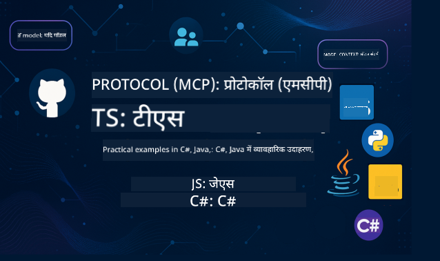

<!--
CO_OP_TRANSLATOR_METADATA:
{
  "original_hash": "0eff5e99d0b20253c51eb315e7e37dc1",
  "translation_date": "2025-08-11T11:44:28+00:00",
  "source_file": "README.md",
  "language_code": "hi"
}
-->
 

  
  
  
  

  
  
  

  

इन संसाधनों का उपयोग शुरू करने के लिए निम्नलिखित चरणों का पालन करें:  
1. **रेपॉजिटरी को फोर्क करें**: क्लिक करें   
2. **रेपॉजिटरी को क्लोन करें**:   `git clone https://github.com/microsoft/mcp-for-beginners.git`  
3. [**Azure AI Foundry Discord से जुड़ें और विशेषज्ञों व अन्य डेवलपर्स से मिलें**](https://discord.com/invite/ByRwuEEgH4)  

### 🌐 बहुभाषी समर्थन

#### GitHub Action के माध्यम से समर्थित (स्वचालित और हमेशा अद्यतन)

 [अरबी](../ar/README.md) | [बंगाली](../bn/README.md) | [बुल्गारियन](../bg/README.md) | [बर्मी (म्यांमार)](../my/README.md) | [चीनी (सरलीकृत)](../zh/README.md) | [चीनी (पारंपरिक, हांगकांग)](../hk/README.md) | [चीनी (पारंपरिक, मकाऊ)](../mo/README.md) | [चीनी (पारंपरिक, ताइवान)](../tw/README.md) | [क्रोएशियन](../hr/README.md) | [चेक](../cs/README.md) | [डेनिश](../da/README.md) | [डच](../nl/README.md) | [फिनिश](../fi/README.md) | [फ्रेंच](../fr/README.md) | [जर्मन](../de/README.md) | [ग्रीक](../el/README.md) | [हिब्रू](../he/README.md) | [हिंदी](./README.md) | [हंगेरियन](../hu/README.md) | [इंडोनेशियन](../id/README.md) | [इतालवी](../it/README.md) | [जापानी](../ja/README.md) | [कोरियाई](../ko/README.md) | [मलय](../ms/README.md) | [मराठी](../mr/README.md) | [नेपाली](../ne/README.md) | [नॉर्वेजियन](../no/README.md) | [फारसी (फारसी)](../fa/README.md) | [पोलिश](../pl/README.md) | [पुर्तगाली (ब्राजील)](../br/README.md) | [पुर्तगाली (पुर्तगाल)](../pt/README.md) | [पंजाबी (गुरमुखी)](../pa/README.md) | [रोमानियाई](../ro/README.md) | [रूसी](../ru/README.md) | [सर्बियाई (सिरिलिक)](../sr/README.md) | [स्लोवाक](../sk/README.md) | [स्लोवेनियाई](../sl/README.md) | [स्पेनिश](../es/README.md) | [स्वाहिली](../sw/README.md) | [स्वीडिश](../sv/README.md) | [टैगालोग (फिलिपिनो)](../tl/README.md) | [थाई](../th/README.md) | [तुर्की](../tr/README.md) | [यूक्रेनी](../uk/README.md) | [उर्दू](../ur/README.md) | [वियतनामी](../vi/README.md)  

# 🚀 मॉडल कॉन्टेक्स्ट प्रोटोकॉल (MCP) पाठ्यक्रम शुरुआती लोगों के लिए

## **C#, Java, JavaScript, Python, और TypeScript में कोड उदाहरणों के साथ MCP सीखें**

## 🧠 मॉडल कॉन्टेक्स्ट प्रोटोकॉल पाठ्यक्रम का अवलोकन

**मॉडल कॉन्टेक्स्ट प्रोटोकॉल (MCP)** एक अत्याधुनिक फ्रेमवर्क है जिसे AI मॉडल और क्लाइंट एप्लिकेशन के बीच इंटरैक्शन को मानकीकृत करने के लिए डिज़ाइन किया गया है। यह ओपन-सोर्स पाठ्यक्रम एक संरचित शिक्षण पथ प्रदान करता है, जिसमें व्यावहारिक कोडिंग उदाहरण और वास्तविक दुनिया के उपयोग के मामले शामिल हैं, जो लोकप्रिय प्रोग्रामिंग भाषाओं जैसे C#, Java, JavaScript, TypeScript, और Python में उपलब्ध हैं।  

चाहे आप एक AI डेवलपर हों, सिस्टम आर्किटेक्ट हों, या सॉफ़्टवेयर इंजीनियर हों, यह गाइड MCP की मूल बातें और कार्यान्वयन रणनीतियों को मास्टर करने के लिए आपका व्यापक संसाधन है।  

## 🔗 आधिकारिक MCP संसाधन

- 📘 [MCP दस्तावेज़ीकरण](https://modelcontextprotocol.io/) – विस्तृत ट्यूटोरियल और उपयोगकर्ता गाइड  
- 📜 [MCP विनिर्देश](https://modelcontextprotocol.io/docs/) – प्रोटोकॉल आर्किटेक्चर और तकनीकी संदर्भ  
- 📜 [मूल MCP विनिर्देश](https://spec.modelcontextprotocol.io/) – पुरानी तकनीकी संदर्भ (अतिरिक्त विवरण हो सकते हैं)  
- 🧑‍💻 [MCP GitHub रेपॉजिटरी](https://github.com/modelcontextprotocol) – ओपन-सोर्स SDKs, टूल्स, और कोड नमूने  
- 🌐 [MCP समुदाय](https://github.com/orgs/modelcontextprotocol/discussions) – चर्चाओं में शामिल हों और समुदाय में योगदान दें  

## MCP डेवलपर डेज़ 29-30 जुलाई 2025 में शामिल हों  

MCP डेवलपर डेज़ के लिए तैयार हो जाइए, जो दो दिनों का वर्चुअल इवेंट है, जिसमें गहन तकनीकी जानकारी, सामुदायिक कनेक्शन, और व्यावहारिक शिक्षण शामिल है। यह इवेंट मॉडल कॉन्टेक्स्ट प्रोटोकॉल (MCP) पर केंद्रित है — एक उभरता हुआ मानक जो AI मॉडल और उनके उपयोग किए जाने वाले टूल्स के बीच पुल का काम करता है।  

➡️ [MCP डेवलपर डेज़ के लिए रजिस्टर करें](https://developer.microsoft.com/en-us/reactor/series/S-1563/)  

आप MCP डेवलपर डेज़ को हमारे इवेंट पेज पर रजिस्टर करके देख सकते हैं: https://aka.ms/mcpdevdays। वहां से, आप YouTube या Twitch पर लाइव स्ट्रीम में शामिल हो सकते हैं। सभी सामग्री रिकॉर्ड की जाएगी और बाद में Microsoft Developer YouTube चैनल पर उपलब्ध होगी। डेमो के लिए सोर्स कोड भी GitHub पर उपलब्ध होगा।  

### इवेंट विवरण  
- तिथियां: 29 जुलाई (दिन 1) और 30 जुलाई (दिन 2)  
- समय: प्रतिदिन सुबह 9:00 PST  
- स्थान: ऑनलाइन – कहीं से भी जुड़ें!  

#### दिन 1: MCP उत्पादकता, डेवलपर टूल्स, और समुदाय:  

यह दिन MCP को डेवलपर वर्कफ़्लो में उपयोग करने और अद्भुत MCP समुदाय का जश्न मनाने के लिए है। हम समुदाय के सदस्यों और Arcade, Block, Okta, और Neon जैसे भागीदारों के साथ जुड़ेंगे, यह देखने के लिए कि वे Microsoft के साथ मिलकर एक ओपन, एक्स्टेंसिबल MCP इकोसिस्टम को कैसे आकार दे रहे हैं।  
- VS Code, Visual Studio, GitHub Copilot, और लोकप्रिय सामुदायिक टूल्स में वास्तविक दुनिया के डेमो  
- व्यावहारिक, संदर्भ-आधारित डेवलपर वर्कफ़्लो  
- समुदाय-नेतृत्व वाले सत्र और अंतर्दृष्टि  
चाहे आप MCP के साथ शुरुआत कर रहे हों या पहले से ही इसके साथ निर्माण कर रहे हों, दिन 1 प्रेरणा और व्यावहारिक टेकअवे के साथ मंच तैयार करेगा।  

#### दिन 2: MCP सर्वर को आत्मविश्वास के साथ बनाएं  

यह दिन MCP बिल्डरों के लिए है। हम MCP सर्वर बनाने और उन्हें AI वर्कफ़्लो में एकीकृत करने के लिए कार्यान्वयन रणनीतियों और सर्वोत्तम प्रथाओं में गहराई से जाएंगे।  

### विषयों में शामिल हैं:  

- MCP सर्वर बनाना और उन्हें एजेंट अनुभवों में एकीकृत करना  
- प्रॉम्प्ट-चालित विकास  
- सुरक्षा सर्वोत्तम प्रथाएं  
- Functions, ACA, और API प्रबंधन जैसे बिल्डिंग ब्लॉक्स का उपयोग  
- रजिस्ट्री संरेखण और टूलिंग (1P + 3P)  

यदि आप एक डेवलपर, टूल बिल्डर, या AI उत्पाद रणनीतिकार हैं, तो यह दिन आपके लिए स्केलेबल, सुरक्षित, और भविष्य-तैयार MCP समाधान बनाने के लिए आवश्यक अंतर्दृष्टि से भरा हुआ है।  

## 🧭 MCP पाठ्यक्रम का अवलोकन  

### 📚 पूर्ण पाठ्यक्रम संरचना  

| मॉड्यूल | विषय | विवरण | लिंक |  
|--------|-------|-------------|------|  
| **मॉड्यूल 1-3: मूल बातें** | | | |  
| 00 | MCP का परिचय | मॉडल कॉन्टेक्स्ट प्रोटोकॉल और AI पाइपलाइनों में इसके महत्व का अवलोकन | [अधिक पढ़ें](./00-Introduction/README.md) |  
| 01 | मुख्य अवधारणाएँ समझाई गईं | MCP की मुख्य अवधारणाओं की गहन खोज | [अधिक पढ़ें](./01-CoreConcepts/README.md) |  
| 02 | MCP में सुरक्षा | सुरक्षा खतरों और सर्वोत्तम प्रथाओं पर चर्चा | [अधिक पढ़ें](./02-Security/README.md) |  
| 03 | MCP के साथ शुरुआत | पर्यावरण सेटअप, बुनियादी सर्वर/क्लाइंट, एकीकरण | [अधिक पढ़ें](./03-GettingStarted/README.md) |  
| **मॉड्यूल 3: अपना पहला सर्वर और क्लाइंट बनाना** | | | |  
| 3.1 | पहला सर्वर | अपना पहला MCP सर्वर बनाएं | [गाइड](./03-GettingStarted/01-first-server/README.md) |  
| 3.2 | पहला क्लाइंट | एक बुनियादी MCP क्लाइंट विकसित करें | [गाइड](./03-GettingStarted/02-client/README.md) |  
| 3.3 | LLM के साथ क्लाइंट | बड़े भाषा मॉडल को एकीकृत करें | [गाइड](./03-GettingStarted/03-llm-client/README.md) |  
| 3.4 | VS Code एकीकरण | MCP सर्वर को VS Code में उपयोग करें | [गाइड](./03-GettingStarted/04-vscode/README.md) |  
| 3.5 | SSE सर्वर | Server-Sent Events का उपयोग करके सर्वर बनाएं | [गाइड](./03-GettingStarted/05-sse-server/README.md) |  
| 3.6 | HTTP स्ट्रीमिंग | MCP में HTTP स्ट्रीमिंग लागू करें | [गाइड](./03-GettingStarted/06-http-streaming/README.md) |  
| 3.7 | AI टूलकिट | MCP के साथ AI टूलकिट का उपयोग करें | [गाइड](./03-GettingStarted/07-aitk/README.md) |  
| 3.8 | परीक्षण | अपने MCP सर्वर कार्यान्वयन का परीक्षण करें | [गाइड](./03-GettingStarted/08-testing/README.md) |  
| 3.9 | परिनियोजन | MCP सर्वर को प्रोडक्शन में परिनियोजित करें | [गाइड](./03-GettingStarted/09-deployment/README.md) |  
| **मॉड्यूल 4-5: व्यावहारिक और उन्नत** | | | |  
| 04 | व्यावहारिक कार्यान्वयन | SDKs, डिबगिंग, परीक्षण, पुन: उपयोग योग्य प्रॉम्प्ट टेम्पलेट्स | [अधिक पढ़ें](./04-PracticalImplementation/README.md) |  
| 05 | MCP में उन्नत विषय | मल्टी-मोडल AI, स्केलिंग, एंटरप्राइज़ उपयोग | [अधिक पढ़ें](./05-AdvancedTopics/README.md) |  
| 5.1 | Azure एकीकरण | Azure के साथ MCP एकीकरण | [गाइड](./05-AdvancedTopics/mcp-integration/README.md) |  
| 5.2 | मल्टी-मोडालिटी | कई मोडालिटी के साथ काम करना | [गाइड](./05-AdvancedTopics/mcp-multi-modality/README.md) |  
| 5.3 | OAuth2 डेमो | OAuth2 प्रमाणीकरण लागू करें | [गाइड](./05-AdvancedTopics/mcp-oauth2-demo/README.md) |  
| 5.4 | रूट कॉन्टेक्स्ट | रूट कॉन्टेक्स्ट को समझें और लागू करें | [गाइड](./05-AdvancedTopics/mcp-root-contexts/README.md) |  
| 5.5 | रूटिंग | MCP रूटिंग रणनीतियाँ | [गाइड](./05-AdvancedTopics/mcp-routing/README.md) |  
| 5.6 | सैंपलिंग | MCP में सैंपलिंग तकनीकें | [गाइड](./05-AdvancedTopics/mcp-sampling/README.md) |  
| 5.7 | स्केलिंग | MCP कार्यान्वयन को स्केल करें | [गाइड](./05-AdvancedTopics/mcp-scaling/README.md) |  
| 5.8 | सुरक्षा | उन्नत सुरक्षा विचार | [गाइड](./05-AdvancedTopics/mcp-security/README.md) |  
| 5.9 | वेब खोज | वेब खोज क्षमताओं को लागू करें | [गाइड](./05-AdvancedTopics/web-search-mcp/README.md) |  
| 5.10 | रीयलटाइम स्ट्रीमिंग | रीयलटाइम स्ट्रीमिंग कार्यक्षमता बनाएं | [गाइड](./05-AdvancedTopics/mcp-realtimestreaming/README.md) |  
| 5.11 | रीयलटाइम खोज | रीयलटाइम खोज लागू करें | [गाइड](./05-AdvancedTopics/mcp-realtimesearch/README.md) |  
| 5.12 | Entra ID Auth | Microsoft Entra ID के साथ प्रमाणीकरण | [Guide](./05-AdvancedTopics/mcp-security-entra/README.md) |
| 5.13 | Foundry Integration | Azure AI Foundry के साथ एकीकरण | [Guide](./05-AdvancedTopics/mcp-foundry-agent-integration/README.md) |
| 5.14 | Context Engineering | प्रभावी संदर्भ इंजीनियरिंग के लिए तकनीकें | [Guide](./05-AdvancedTopics/mcp-contextengineering/README.md) |
| **Module 6-10: Community & Best Practices** | | | |
| 06 | Community Contributions | MCP इकोसिस्टम में योगदान कैसे करें | [Guide](./06-CommunityContributions/README.md) |
| 07 | Insights from Early Adoption | वास्तविक दुनिया की कार्यान्वयन कहानियां | [Guide](./07-LessonsFromEarlyAdoption/README.md) |
| 08 | MCP के लिए सर्वोत्तम प्रथाएं | प्रदर्शन, दोष-सहनशीलता, लचीलापन | [Guide](./08-BestPractices/README.md) |
| 09 | MCP केस स्टडीज | व्यावहारिक कार्यान्वयन के उदाहरण | [Guide](./09-CaseStudy/README.md) |
| 10 | हैंड्स-ऑन वर्कशॉप | AI टूलकिट के साथ MCP सर्वर बनाना | [Lab](./10-StreamliningAIWorkflowsBuildingAnMCPServerWithAIToolkit/README.md) |

### 💻 सैंपल कोड प्रोजेक्ट्स

#### बेसिक MCP कैलकुलेटर सैंपल्स

| भाषा | विवरण | लिंक |
|------|-------|------|
| C# | MCP सर्वर उदाहरण | [View Code](./03-GettingStarted/samples/csharp/README.md) |
| Java | MCP कैलकुलेटर | [View Code](./03-GettingStarted/samples/java/calculator/README.md) |
| JavaScript | MCP डेमो | [View Code](./03-GettingStarted/samples/javascript/README.md) |
| Python | MCP सर्वर | [View Code](../../03-GettingStarted/samples/python/mcp_calculator_server.py) |
| TypeScript | MCP उदाहरण | [View Code](./03-GettingStarted/samples/typescript/README.md) |

#### एडवांस्ड MCP इंप्लीमेंटेशन

| भाषा | विवरण | लिंक |
|------|-------|------|
| C# | एडवांस्ड सैंपल | [View Code](./04-PracticalImplementation/samples/csharp/README.md) |
| Java with Spring | कंटेनर ऐप उदाहरण | [View Code](./04-PracticalImplementation/samples/java/containerapp/README.md) |
| JavaScript | एडवांस्ड सैंपल | [View Code](./04-PracticalImplementation/samples/javascript/README.md) |
| Python | जटिल कार्यान्वयन | [View Code](../../04-PracticalImplementation/samples/python/mcp_sample.py) |
| TypeScript | कंटेनर सैंपल | [View Code](./04-PracticalImplementation/samples/typescript/README.md) |

## 🎯 MCP सीखने के लिए आवश्यकताएं

इस पाठ्यक्रम से अधिकतम लाभ उठाने के लिए, आपके पास निम्नलिखित होना चाहिए:

- कम से कम निम्नलिखित भाषाओं में से एक में प्रोग्रामिंग का बुनियादी ज्ञान: C#, Java, JavaScript, Python, या TypeScript  
- क्लाइंट-सर्वर मॉडल और API की समझ  
- REST और HTTP अवधारणाओं की जानकारी  
- (वैकल्पिक) AI/ML अवधारणाओं की पृष्ठभूमि  

- सहायता के लिए हमारे समुदाय चर्चाओं में शामिल हों  

## 📚 अध्ययन गाइड और संसाधन

यह रिपॉजिटरी आपको प्रभावी ढंग से नेविगेट करने और सीखने में मदद करने के लिए कई संसाधन प्रदान करती है:

### अध्ययन गाइड

एक व्यापक [अध्ययन गाइड](./study_guide.md) उपलब्ध है जो आपको इस रिपॉजिटरी को प्रभावी ढंग से नेविगेट करने में मदद करता है। गाइड में शामिल हैं:

- सभी कवर किए गए विषयों का एक दृश्य पाठ्यक्रम मानचित्र  
- प्रत्येक रिपॉजिटरी अनुभाग का विस्तृत विवरण  
- सैंपल प्रोजेक्ट्स का उपयोग करने के लिए मार्गदर्शन  
- विभिन्न कौशल स्तरों के लिए अनुशंसित सीखने के पथ  
- आपकी सीखने की यात्रा को पूरक बनाने के लिए अतिरिक्त संसाधन  

### चेंजलॉग

हम एक विस्तृत [चेंजलॉग](./changelog.md) बनाए रखते हैं जो पाठ्यक्रम सामग्री में सभी महत्वपूर्ण अपडेट को ट्रैक करता है, जिसमें शामिल हैं:

- नई सामग्री जोड़ना  
- संरचनात्मक परिवर्तन  
- फीचर सुधार  
- दस्तावेज़ीकरण अपडेट  

## 🛠️ इस पाठ्यक्रम का प्रभावी उपयोग कैसे करें

इस गाइड में प्रत्येक पाठ में शामिल हैं:

1. MCP अवधारणाओं की स्पष्ट व्याख्या  
2. कई भाषाओं में लाइव कोड उदाहरण  
3. वास्तविक MCP एप्लिकेशन बनाने के लिए अभ्यास  
4. उन्नत शिक्षार्थियों के लिए अतिरिक्त संसाधन  

## 🌟 समुदाय का धन्यवाद

Microsoft Valued Professional [शिवम गोयल](https://www.linkedin.com/in/shivam2003/) को महत्वपूर्ण कोड सैंपल्स में योगदान देने के लिए धन्यवाद।  

## 📜 लाइसेंस जानकारी

यह सामग्री **MIT लाइसेंस** के तहत लाइसेंस प्राप्त है। नियम और शर्तों के लिए, [LICENSE](../../LICENSE) देखें।  

## 🤝 योगदान दिशानिर्देश

यह प्रोजेक्ट योगदान और सुझावों का स्वागत करता है। अधिकांश योगदानों के लिए आपको एक  
Contributor License Agreement (CLA) से सहमत होना होगा, जिसमें यह घोषणा करनी होगी कि आपके पास अधिकार हैं और आप हमें अपने योगदान का उपयोग करने का अधिकार प्रदान करते हैं। विवरण के लिए देखें  
<https://cla.opensource.microsoft.com>।  

जब आप एक पुल अनुरोध सबमिट करते हैं, तो एक CLA बॉट स्वचालित रूप से निर्धारित करेगा कि क्या आपको CLA प्रदान करने की आवश्यकता है और PR को उपयुक्त रूप से सजाएगा (जैसे, स्थिति जांच, टिप्पणी)। बस बॉट द्वारा प्रदान किए गए निर्देशों का पालन करें। आपको यह केवल एक बार सभी रिपॉजिटरीज़ के लिए करना होगा जो हमारे CLA का उपयोग करते हैं।  

इस प्रोजेक्ट ने [Microsoft Open Source Code of Conduct](https://opensource.microsoft.com/codeofconduct/) को अपनाया है।  
अधिक जानकारी के लिए [Code of Conduct FAQ](https://opensource.microsoft.com/codeofconduct/faq/) देखें या  
[opencode@microsoft.com](mailto:opencode@microsoft.com) पर अतिरिक्त प्रश्न या टिप्पणियों के लिए संपर्क करें।  

## 📂 रिपॉजिटरी संरचना

रिपॉजिटरी निम्नलिखित रूप से संगठित है:

- **कोर पाठ्यक्रम (00-10)**: मुख्य सामग्री दस क्रमिक मॉड्यूल में संगठित  
- **images/**: पाठ्यक्रम में उपयोग किए गए आरेख और चित्र  
- **translations/**: स्वचालित अनुवादों के साथ बहुभाषी समर्थन  
- **translated_images/**: आरेखों और चित्रों के स्थानीयकृत संस्करण  
- **study_guide.md**: रिपॉजिटरी को नेविगेट करने के लिए व्यापक गाइड  
- **changelog.md**: पाठ्यक्रम सामग्री में सभी महत्वपूर्ण परिवर्तनों का रिकॉर्ड  
- **mcp.json**: MCP विनिर्देश के लिए कॉन्फ़िगरेशन फ़ाइल  
- **CODE_OF_CONDUCT.md, LICENSE, SECURITY.md, SUPPORT.md**: प्रोजेक्ट प्रशासन दस्तावेज़  

## 🎒 अन्य पाठ्यक्रम
हमारी टीम अन्य पाठ्यक्रम भी तैयार करती है! देखें:

- [AI Agents For Beginners](https://github.com/microsoft/ai-agents-for-beginners?WT.mc_id=academic-105485-koreyst)  
- [Generative AI for Beginners using .NET](https://github.com/microsoft/Generative-AI-for-beginners-dotnet?WT.mc_id=academic-105485-koreyst)  
- [Generative AI for Beginners using JavaScript](https://github.com/microsoft/generative-ai-with-javascript?WT.mc_id=academic-105485-koreyst)  
- [Generative AI for Beginners](https://github.com/microsoft/generative-ai-for-beginners?WT.mc_id=academic-105485-koreyst)  
- [Generative AI for Beginners using Java](https://github.com/microsoft/generative-ai-for-beginners-java?WT.mc_id=academic-105485-koreyst)  
- [ML for Beginners](https://aka.ms/ml-beginners?WT.mc_id=academic-105485-koreyst)  
- [Data Science for Beginners](https://aka.ms/datascience-beginners?WT.mc_id=academic-105485-koreyst)  
- [AI for Beginners](https://aka.ms/ai-beginners?WT.mc_id=academic-105485-koreyst)  
- [Cybersecurity for Beginners](https://github.com/microsoft/Security-101??WT.mc_id=academic-96948-sayoung)  
- [Web Dev for Beginners](https://aka.ms/webdev-beginners?WT.mc_id=academic-105485-koreyst)  
- [IoT for Beginners](https://aka.ms/iot-beginners?WT.mc_id=academic-105485-koreyst)  
- [XR Development for Beginners](https://github.com/microsoft/xr-development-for-beginners?WT.mc_id=academic-105485-koreyst)  
- [Mastering GitHub Copilot for AI Paired Programming](https://aka.ms/GitHubCopilotAI?WT.mc_id=academic-105485-koreyst)  
- [Mastering GitHub Copilot for C#/.NET Developers](https://github.com/microsoft/mastering-github-copilot-for-dotnet-csharp-developers?WT.mc_id=academic-105485-koreyst)  
- [Choose Your Own Copilot Adventure](https://github.com/microsoft/CopilotAdventures?WT.mc_id=academic-105485-koreyst)  

## ™️ ट्रेडमार्क नोटिस

इस प्रोजेक्ट में प्रोजेक्ट्स, उत्पादों, या सेवाओं के लिए ट्रेडमार्क या लोगो हो सकते हैं। Microsoft ट्रेडमार्क या लोगो के अधिकृत उपयोग को [Microsoft's Trademark & Brand Guidelines](https://www.microsoft.com/legal/intellectualproperty/trademarks/usage/general) का पालन करना चाहिए।  
संशोधित संस्करणों में Microsoft ट्रेडमार्क या लोगो का उपयोग भ्रम पैदा नहीं करना चाहिए या Microsoft प्रायोजन का संकेत नहीं देना चाहिए।  
किसी भी तृतीय-पक्ष ट्रेडमार्क या लोगो का उपयोग उन तृतीय-पक्षों की नीतियों के अधीन है।  

**अस्वीकरण**:  
यह दस्तावेज़ AI अनुवाद सेवा [Co-op Translator](https://github.com/Azure/co-op-translator) का उपयोग करके अनुवादित किया गया है। जबकि हम सटीकता सुनिश्चित करने का प्रयास करते हैं, कृपया ध्यान दें कि स्वचालित अनुवाद में त्रुटियां या अशुद्धियां हो सकती हैं। मूल भाषा में उपलब्ध मूल दस्तावेज़ को प्रामाणिक स्रोत माना जाना चाहिए। महत्वपूर्ण जानकारी के लिए, पेशेवर मानव अनुवाद की सिफारिश की जाती है। इस अनुवाद के उपयोग से उत्पन्न किसी भी गलतफहमी या गलत व्याख्या के लिए हम उत्तरदायी नहीं हैं।