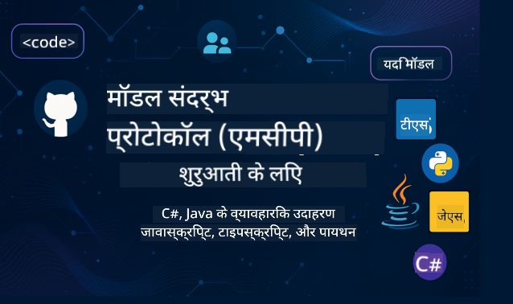

<!--
CO_OP_TRANSLATOR_METADATA:
{
  "original_hash": "2a21391378c12ecfef50f866329dfde0",
  "translation_date": "2025-05-17T05:20:30+00:00",
  "source_file": "README.md",
  "language_code": "hi"
}
-->

इन संसाधनों का उपयोग शुरू करने के लिए इन चरणों का पालन करें:
1. **रेपो को फोर्क करें**: क्लिक करें 
2. **रेपो को क्लोन करें**:   `git clone https://github.com/microsoft/mcp-for-beginners.git`
3. [**Microsoft Azure AI Foundry Discord से जुड़ें और विशेषज्ञों और साथी डेवलपर्स से मिलें**](https://discord.com/invite/ByRwuEEgH4)

### 🌐 बहु-भाषा समर्थन

#### GitHub Action के माध्यम से समर्थित (स्वचालित और हमेशा अपडेटेड)
[फ्रेंच](../fr/README.md) | [स्पेनिश](../es/README.md) | [जर्मन](../de/README.md) | [रूसी](../ru/README.md) | [अरबी](../ar/README.md) | [फारसी (फारसी)](../fa/README.md) | [उर्दू](../ur/README.md) | [चीनी (सरलीकृत)](../zh/README.md) | [चीनी (पारंपरिक, मकाऊ)](../mo/README.md) | [चीनी (पारंपरिक, हांगकांग)](../hk/README.md) | [चीनी (पारंपरिक, ताइवान)](../tw/README.md) | [जापानी](../ja/README.md) | [कोरियाई](../ko/README.md) | [हिंदी](./README.md) | [बंगाली](../bn/README.md) | [मराठी](../mr/README.md) | [नेपाली](../ne/README.md) | [पंजाबी (गुरमुखी)](../pa/README.md) | [पुर्तगाली (पुर्तगाल)](../pt/README.md) | [पुर्तगाली (ब्राज़ील)](../br/README.md) | [इतालवी](../it/README.md) | [पोलिश](../pl/README.md) | [तुर्की](../tr/README.md) | [ग्रीक](../el/README.md) | [थाई](../th/README.md) | [स्वीडिश](../sv/README.md) | [डेनिश](../da/README.md) | [नॉर्वेजियन](../no/README.md) | [फिनिश](../fi/README.md) | [डच](../nl/README.md) | [हिब्रू](../he/README.md) | [वियतनामी](../vi/README.md) | [इंडोनेशियाई](../id/README.md) | [मलय](../ms/README.md) | [टैगालॉग (फिलिपिनो)](../tl/README.md) | [स्वाहिली](../sw/README.md) | [हंगेरियन](../hu/README.md) | [चेक](../cs/README.md) | [स्लोवाक](../sk/README.md) | [रोमानियाई](../ro/README.md) | [बुल्गारियाई](../bg/README.md) | [सर्बियाई (सिरिलिक)](../sr/README.md) | [क्रोएशियाई](../hr/README.md) | [स्लोवेनियाई](../sl/README.md)
# 🚀 शुरुआती लोगों के लिए मॉडल कॉन्टेक्स्ट प्रोटोकॉल (MCP) पाठ्यक्रम की अंतिम मार्गदर्शिका

## **C#, Java, JavaScript, Python, और TypeScript में हाथों-हाथ कोड उदाहरणों के साथ MCP सीखें**

## 🧠 मॉडल कॉन्टेक्स्ट प्रोटोकॉल पाठ्यक्रम का अवलोकन

**मॉडल कॉन्टेक्स्ट प्रोटोकॉल (MCP)** एक अत्याधुनिक फ्रेमवर्क है जो AI मॉडल और क्लाइंट एप्लिकेशंस के बीच इंटरैक्शन को मानकीकृत करने के लिए डिज़ाइन किया गया है। यह ओपन-सोर्स पाठ्यक्रम एक संरचित सीखने का मार्ग प्रदान करता है, जिसमें व्यावहारिक कोडिंग उदाहरण और वास्तविक दुनिया के उपयोग के मामले शामिल हैं, लोकप्रिय प्रोग्रामिंग भाषाओं जैसे C#, Java, JavaScript, TypeScript, और Python में।

चाहे आप एक AI डेवलपर हों, सिस्टम आर्किटेक्ट हों, या सॉफ़्टवेयर इंजीनियर हों, यह मार्गदर्शिका MCP मूलभूत सिद्धांतों और कार्यान्वयन रणनीतियों को मास्टर करने के लिए आपका व्यापक संसाधन है।

## 🔗 आधिकारिक MCP संसाधन

- 📘 [MCP दस्तावेज़ीकरण](https://modelcontextprotocol.io/) – विस्तृत ट्यूटोरियल और उपयोगकर्ता गाइड  
- 📜 [MCP विनिर्देश](https://spec.modelcontextprotocol.io/) – प्रोटोकॉल आर्किटेक्चर और तकनीकी संदर्भ  
- 🧑‍💻 [MCP GitHub रिपॉजिटरी](https://github.com/modelcontextprotocol) – ओपन-सोर्स SDKs, उपकरण, और कोड नमूने  

## 🧭 MCP पाठ्यक्रम संरचना पूरी

### 📌 [MCP का परिचय](./00-Introduction/README.md)

- मॉडल कॉन्टेक्स्ट प्रोटोकॉल क्या है?
- AI पाइपलाइनों में मानकीकरण क्यों महत्वपूर्ण है
- MCP के व्यावहारिक उपयोग के मामले और लाभ

### 🧩 [मुख्य अवधारणाएं समझाया गया](./01-CoreConcepts/README.md)

- MCP में क्लाइंट-सर्वर आर्किटेक्चर को समझना
- प्रमुख प्रोटोकॉल घटक: अनुरोध, प्रतिक्रियाएं, और स्कीमाज
- MCP मैसेजिंग और डेटा एक्सचेंज पैटर्न

### 🔐 [MCP में सुरक्षा](./02-Security/readme.md)

- MCP-आधारित सिस्टम में सुरक्षा खतरों की पहचान करना
- कार्यान्वयन को सुरक्षित करने के लिए तकनीकें और सर्वोत्तम प्रथाएं

### 🚀 [MCP के साथ शुरुआत करना](./03-GettingStarted/README.md)

- वातावरण सेटअप और कॉन्फ़िगरेशन
- बुनियादी MCP सर्वर और क्लाइंट बनाना
- मौजूदा एप्लिकेशन के साथ MCP को एकीकृत करना

#### 🧮 MCP कैलकुलेटर नमूना परियोजनाएं:

  
<strong>भाषा द्वारा कोड कार्यान्वयन का अन्वेषण करें</strong>

  - [C# MCP सर्वर उदाहरण](./03-GettingStarted/samples/csharp/README.md)
  - [Java MCP कैलकुलेटर](./03-GettingStarted/samples/java/calculator/README.md)
  - [JavaScript MCP डेमो](./03-GettingStarted/samples/javascript/README.md)
  - [Python MCP सर्वर](../../03-GettingStarted/samples/python/mcp_calculator_server.py)
  - [TypeScript MCP उदाहरण](./03-GettingStarted/samples/typescript/README.md)

### 🛠️ [व्यावहारिक कार्यान्वयन](./04-PracticalImplementation/README.md)

- विभिन्न भाषाओं में SDKs का उपयोग करना
- डीबगिंग, परीक्षण, और मान्यकरण
- पुन: उपयोग योग्य प्रॉम्प्ट टेम्पलेट और वर्कफ़्लो बनाना

#### 💡 MCP उन्नत कैलकुलेटर परियोजनाएं:

  
<strong>उन्नत नमूनों का अन्वेषण करें</strong>

  - [उन्नत C# नमूना](./04-PracticalImplementation/samples/csharp/README.md)
  - [Java कंटेनर ऐप उदाहरण](./04-PracticalImplementation/samples/java/containerapp/README.md)
  - [JavaScript उन्नत नमूना](./04-PracticalImplementation/samples/javascript/README.md)
  - [Python जटिल कार्यान्वयन](../../04-PracticalImplementation/samples/python/mcp_sample.py)
  - [TypeScript कंटेनर नमूना](./04-PracticalImplementation/samples/typescript/README.md)

### 🎓 [MCP में उन्नत विषय](./05-AdvancedTopics/README.md)

- मल्टी-मोडल AI वर्कफ़्लो और विस्तारशीलता
- सुरक्षित स्केलिंग रणनीतियाँ
- उद्यम पारिस्थितिकी प्रणालियों में MCP

### 🌍 [समुदाय योगदान](./06-CommunityContributions/README.md)

- कोड और दस्तावेज़ कैसे योगदान करें
- GitHub के माध्यम से सहयोग करना
- समुदाय-संचालित सुधार और प्रतिक्रिया

### 📈 [प्रारंभिक अपनाने से अंतर्दृष्टि](./07-CaseStudies/README.md)

- वास्तविक दुनिया के कार्यान्वयन और क्या काम किया
- MCP-आधारित समाधान बनाना और तैनात करना
- रुझान और भविष्य की रोडमैप

### 📏 [MCP के लिए सर्वोत्तम प्रथाएं](./08-BestPractices/README.md)

- प्रदर्शन ट्यूनिंग और अनुकूलन
- दोष-सहिष्णु MCP सिस्टम डिज़ाइन करना
- परीक्षण और लचीलापन रणनीतियाँ

### 📊 [MCP केस स्टडीज](./09-CaseStudy/Readme.md)

- MCP समाधान आर्किटेक्चर में गहनता से जाना
- तैनाती ब्लूप्रिंट और एकीकरण युक्तियाँ
- एनोटेटेड आरेख और परियोजना वॉकथ्रू

## 🎯 MCP सीखने के लिए आवश्यकताएँ

इस पाठ्यक्रम से अधिकतम लाभ उठाने के लिए, आपको चाहिए:

- C#, Java, या Python का बुनियादी ज्ञान
- क्लाइंट-सर्वर मॉडल और APIs की समझ
- (वैकल्पिक) मशीन लर्निंग अवधारणाओं से परिचितता

## 🛠️ इस पाठ्यक्रम का प्रभावी ढंग से उपयोग कैसे करें

इस मार्गदर्शिका में प्रत्येक पाठ में शामिल हैं:

1. MCP अवधारणाओं की स्पष्ट व्याख्या  
2. कई भाषाओं में लाइव कोड उदाहरण  
3. वास्तविक MCP एप्लिकेशन बनाने के लिए अभ्यास  
4. उन्नत शिक्षार्थियों के लिए अतिरिक्त संसाधन  

## 📜 लाइसेंस जानकारी

इस सामग्री को **MIT लाइसेंस** के तहत लाइसेंस प्राप्त है। शर्तों और नियमों के लिए, [LICENSE](../../LICENSE) देखें।

## 🤝 योगदान दिशानिर्देश

यह परियोजना योगदान और सुझावों का स्वागत करती है। अधिकांश योगदानों के लिए आपको एक योगदानकर्ता लाइसेंस समझौते (CLA) से सहमत होना आवश्यक है, जिसमें यह घोषणा की जाती है कि आपके पास हमें आपके योगदान का उपयोग करने का अधिकार देने का अधिकार है। विवरण के लिए, <https://cla.opensource.microsoft.com> पर जाएँ।

जब आप एक पुल अनुरोध सबमिट करते हैं, तो एक CLA बॉट स्वचालित रूप से निर्धारित करेगा कि क्या आपको CLA प्रदान करने की आवश्यकता है और PR को उपयुक्त रूप से सजाएगा (जैसे, स्थिति जांच, टिप्पणी)। बस बॉट द्वारा प्रदान किए गए निर्देशों का पालन करें। आपको हमारे CLA का उपयोग करने वाले सभी रिपॉजिटरी में यह केवल एक बार करना होगा।

इस परियोजना ने [Microsoft ओपन सोर्स कोड ऑफ कंडक्ट](https://opensource.microsoft.com/codeofconduct/) को अपनाया है।
अधिक जानकारी के लिए [कोड ऑफ कंडक्ट FAQ](https://opensource.microsoft.com/codeofconduct/faq/) देखें या किसी भी अतिरिक्त प्रश्न या टिप्पणियों के लिए [opencode@microsoft.com](mailto:opencode@microsoft.com) से संपर्क करें।

## ™️ ट्रेडमार्क नोटिस

इस परियोजना में परियोजनाओं, उत्पादों, या सेवाओं के लिए ट्रेडमार्क या लोगो शामिल हो सकते हैं। Microsoft ट्रेडमार्क या लोगो के अधिकृत उपयोग को [Microsoft के ट्रेडमार्क और ब्रांड दिशानिर्देश](https://www.microsoft.com/legal/intellectualproperty/trademarks/usage/general) का पालन करना चाहिए और करना होगा। इस परियोजना के संशोधित संस्करणों में Microsoft ट्रेडमार्क या लोगो का उपयोग भ्रम का कारण नहीं बनना चाहिए या Microsoft प्रायोजन का संकेत नहीं देना चाहिए। किसी भी तीसरे पक्ष के ट्रेडमार्क या लोगो का उपयोग उन तृतीय-पक्षों की नीतियों के अधीन है।

**अस्वीकरण**:  
यह दस्तावेज़ AI अनुवाद सेवा [Co-op Translator](https://github.com/Azure/co-op-translator) का उपयोग करके अनुवादित किया गया है। जबकि हम सटीकता के लिए प्रयास करते हैं, कृपया ध्यान दें कि स्वचालित अनुवाद में त्रुटियाँ या अशुद्धियाँ हो सकती हैं। मूल दस्तावेज़ को उसकी मूल भाषा में आधिकारिक स्रोत माना जाना चाहिए। महत्वपूर्ण जानकारी के लिए, पेशेवर मानव अनुवाद की सिफारिश की जाती है। इस अनुवाद के उपयोग से उत्पन्न किसी भी गलतफहमी या गलत व्याख्या के लिए हम उत्तरदायी नहीं हैं।