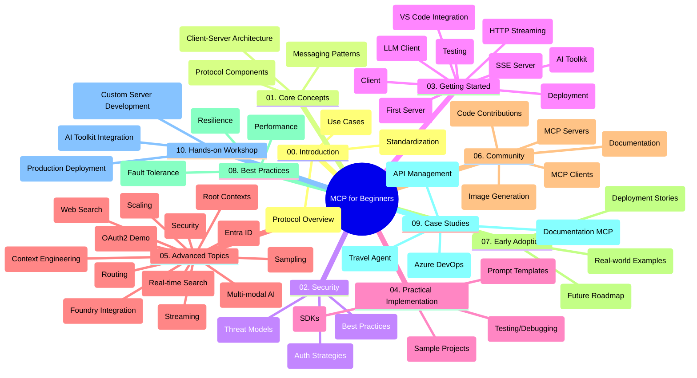

<!--
CO_OP_TRANSLATOR_METADATA:
{
  "original_hash": "77bfab7090f987a5b9fe078f50dbda13",
  "translation_date": "2025-07-16T22:43:31+00:00",
  "source_file": "study_guide.md",
  "language_code": "hi"
}
-->
# Model Context Protocol (MCP) शुरुआती के लिए - अध्ययन मार्गदर्शिका

यह अध्ययन मार्गदर्शिका "Model Context Protocol (MCP) for Beginners" पाठ्यक्रम के लिए रिपॉजिटरी की संरचना और सामग्री का अवलोकन प्रदान करती है। इस गाइड का उपयोग रिपॉजिटरी में कुशलतापूर्वक नेविगेट करने और उपलब्ध संसाधनों का अधिकतम लाभ उठाने के लिए करें।

## रिपॉजिटरी का अवलोकन

Model Context Protocol (MCP) AI मॉडल और क्लाइंट एप्लिकेशन के बीच इंटरैक्शन के लिए एक मानकीकृत फ्रेमवर्क है। इसे शुरू में Anthropic द्वारा बनाया गया था, और अब इसे आधिकारिक GitHub संगठन के माध्यम से व्यापक MCP समुदाय द्वारा मेंटेन किया जाता है। यह रिपॉजिटरी C#, Java, JavaScript, Python, और TypeScript में व्यावहारिक कोड उदाहरणों के साथ एक व्यापक पाठ्यक्रम प्रदान करती है, जो AI डेवलपर्स, सिस्टम आर्किटेक्ट्स, और सॉफ्टवेयर इंजीनियरों के लिए डिज़ाइन किया गया है।

## विज़ुअल पाठ्यक्रम मानचित्र

## रिपॉजिटरी संरचना

रिपॉजिटरी को दस मुख्य भागों में व्यवस्थित किया गया है, जो MCP के विभिन्न पहलुओं पर केंद्रित हैं:

1. **परिचय (00-Introduction/)**
   - Model Context Protocol का अवलोकन
   - AI पाइपलाइनों में मानकीकरण क्यों महत्वपूर्ण है
   - व्यावहारिक उपयोग के मामले और लाभ

2. **मूल अवधारणाएँ (01-CoreConcepts/)**
   - क्लाइंट-सर्वर आर्किटेक्चर
   - प्रमुख प्रोटोकॉल घटक
   - MCP में मैसेजिंग पैटर्न

3. **सुरक्षा (02-Security/)**
   - MCP-आधारित सिस्टम में सुरक्षा खतरें
   - सुरक्षित कार्यान्वयन के लिए सर्वोत्तम प्रथाएँ
   - प्रमाणीकरण और प्राधिकरण रणनीतियाँ

4. **शुरुआत करना (03-GettingStarted/)**
   - पर्यावरण सेटअप और कॉन्फ़िगरेशन
   - बेसिक MCP सर्वर और क्लाइंट बनाना
   - मौजूदा एप्लिकेशन के साथ एकीकरण
   - शामिल अनुभाग:
     - पहला सर्वर कार्यान्वयन
     - क्लाइंट विकास
     - LLM क्लाइंट एकीकरण
     - VS Code एकीकरण
     - Server-Sent Events (SSE) सर्वर
     - HTTP स्ट्रीमिंग
     - AI Toolkit एकीकरण
     - परीक्षण रणनीतियाँ
     - तैनाती दिशानिर्देश

5. **व्यावहारिक कार्यान्वयन (04-PracticalImplementation/)**
   - विभिन्न प्रोग्रामिंग भाषाओं में SDK का उपयोग
   - डिबगिंग, परीक्षण, और सत्यापन तकनीकें
   - पुन: उपयोग योग्य प्रॉम्प्ट टेम्पलेट और वर्कफ़्लो बनाना
   - कार्यान्वयन उदाहरणों के साथ नमूना प्रोजेक्ट्स

6. **उन्नत विषय (05-AdvancedTopics/)**
   - संदर्भ इंजीनियरिंग तकनीकें
   - Foundry एजेंट एकीकरण
   - मल्टी-मोडल AI वर्कफ़्लो
   - OAuth2 प्रमाणीकरण डेमो
   - रियल-टाइम खोज क्षमताएँ
   - रियल-टाइम स्ट्रीमिंग
   - रूट संदर्भ कार्यान्वयन
   - रूटिंग रणनीतियाँ
   - सैंपलिंग तकनीकें
   - स्केलिंग दृष्टिकोण
   - सुरक्षा विचार
   - Entra ID सुरक्षा एकीकरण
   - वेब खोज एकीकरण

7. **समुदाय योगदान (06-CommunityContributions/)**
   - कोड और दस्तावेज़ में योगदान कैसे करें
   - GitHub के माध्यम से सहयोग
   - समुदाय-चालित सुधार और प्रतिक्रिया
   - विभिन्न MCP क्लाइंट्स का उपयोग (Claude Desktop, Cline, VSCode)
   - लोकप्रिय MCP सर्वरों के साथ काम करना, जिसमें इमेज जनरेशन शामिल है

8. **प्रारंभिक अपनाने से सीख (07-LessonsfromEarlyAdoption/)**
   - वास्तविक दुनिया के कार्यान्वयन और सफलता की कहानियाँ
   - MCP-आधारित समाधान बनाना और तैनात करना
   - रुझान और भविष्य की रूपरेखा

9. **सर्वोत्तम प्रथाएँ (08-BestPractices/)**
   - प्रदर्शन ट्यूनिंग और अनुकूलन
   - दोष-सहिष्णु MCP सिस्टम डिज़ाइन
   - परीक्षण और लचीलापन रणनीतियाँ

10. **केस स्टडीज (09-CaseStudy/)**
    - केस स्टडी: Azure API Management एकीकरण
    - केस स्टडी: ट्रैवल एजेंट कार्यान्वयन
    - केस स्टडी: Azure DevOps का YouTube के साथ एकीकरण
    - विस्तृत दस्तावेज़ के साथ कार्यान्वयन उदाहरण

11. **हैंड्स-ऑन कार्यशाला (10-StreamliningAIWorkflowsBuildingAnMCPServerWithAIToolkit/)**
    - MCP और AI Toolkit को मिलाकर व्यापक हैंड्स-ऑन कार्यशाला
    - AI मॉडल्स को वास्तविक दुनिया के टूल्स से जोड़ने वाले बुद्धिमान एप्लिकेशन बनाना
    - मूल बातें, कस्टम सर्वर विकास, और प्रोडक्शन तैनाती रणनीतियों को कवर करने वाले व्यावहारिक मॉड्यूल
    - चरण-दर-चरण निर्देशों के साथ लैब-आधारित सीखने का तरीका

## अतिरिक्त संसाधन

रिपॉजिटरी में सहायक संसाधन शामिल हैं:

- **Images फ़ोल्डर**: पाठ्यक्रम में उपयोग किए गए आरेख और चित्र
- **अनुवाद**: दस्तावेज़ों के स्वचालित बहुभाषी अनुवाद
- **आधिकारिक MCP संसाधन**:
  - [MCP Documentation](https://modelcontextprotocol.io/)
  - [MCP Specification](https://spec.modelcontextprotocol.io/)
  - [MCP GitHub Repository](https://github.com/modelcontextprotocol)

## इस रिपॉजिटरी का उपयोग कैसे करें

1. **क्रमिक सीखना**: संरचित सीखने के लिए अध्यायों को क्रम में (00 से 10 तक) पढ़ें।
2. **भाषा-विशिष्ट फोकस**: यदि आप किसी विशेष प्रोग्रामिंग भाषा में रुचि रखते हैं, तो अपनी पसंदीदा भाषा में कार्यान्वयन के लिए samples डायरेक्टरी देखें।
3. **व्यावहारिक कार्यान्वयन**: "Getting Started" अनुभाग से शुरू करें, अपना पर्यावरण सेटअप करें और अपना पहला MCP सर्वर और क्लाइंट बनाएं।
4. **उन्नत अन्वेषण**: मूल बातें समझने के बाद, उन्नत विषयों में गहराई से जाएं।
5. **समुदाय सहभागिता**: GitHub चर्चाओं और Discord चैनलों के माध्यम से MCP समुदाय से जुड़ें और विशेषज्ञों तथा अन्य डेवलपर्स के साथ संवाद करें।

## MCP क्लाइंट्स और टूल्स

पाठ्यक्रम में विभिन्न MCP क्लाइंट्स और टूल्स शामिल हैं:

1. **आधिकारिक क्लाइंट्स**:
   - Claude Desktop
   - VSCode में Claude
   - Claude API

2. **समुदाय क्लाइंट्स**:
   - Cline (टर्मिनल-आधारित)
   - Cursor (कोड एडिटर)
   - ChatMCP
   - Windsurf

3. **MCP प्रबंधन टूल्स**:
   - MCP CLI
   - MCP Manager
   - MCP Linker
   - MCP Router

## लोकप्रिय MCP सर्वर

रिपॉजिटरी विभिन्न MCP सर्वरों से परिचय कराती है, जिनमें शामिल हैं:

1. **आधिकारिक संदर्भ सर्वर**:
   - Filesystem
   - Fetch
   - Memory
   - Sequential Thinking

2. **इमेज जनरेशन**:
   - Azure OpenAI DALL-E 3
   - Stable Diffusion WebUI
   - Replicate

3. **डेवलपमेंट टूल्स**:
   - Git MCP
   - Terminal Control
   - Code Assistant

4. **विशेषीकृत सर्वर**:
   - Salesforce
   - Microsoft Teams
   - Jira & Confluence

## योगदान

यह रिपॉजिटरी समुदाय से योगदान का स्वागत करती है। MCP इकोसिस्टम में प्रभावी योगदान के लिए Community Contributions अनुभाग देखें।

## परिवर्तन विवरण

| तिथि | परिवर्तन |
|-------|----------|
| 16 जुलाई, 2025 | - वर्तमान सामग्री को दर्शाने के लिए रिपॉजिटरी संरचना अपडेट की गई - MCP क्लाइंट्स और टूल्स अनुभाग जोड़ा गया - लोकप्रिय MCP सर्वर अनुभाग जोड़ा गया - सभी वर्तमान विषयों के साथ विज़ुअल पाठ्यक्रम मानचित्र अपडेट किया गया - सभी विशेष क्षेत्रों के साथ उन्नत विषय अनुभाग को बेहतर बनाया गया - वास्तविक उदाहरणों को दर्शाने के लिए केस स्टडीज अपडेट की गईं - MCP की उत्पत्ति को Anthropic द्वारा बनाए जाने के रूप में स्पष्ट किया गया |
| 11 जून, 2025 | - अध्ययन मार्गदर्शिका का प्रारंभिक निर्माण - विज़ुअल पाठ्यक्रम मानचित्र जोड़ा गया - रिपॉजिटरी संरचना का रूपरेखा तैयार की गई - नमूना प्रोजेक्ट्स और अतिरिक्त संसाधन शामिल किए गए |

---

*यह अध्ययन मार्गदर्शिका 16 जुलाई, 2025 को अपडेट की गई थी और उस तिथि तक की रिपॉजिटरी का अवलोकन प्रदान करती है। इस तिथि के बाद रिपॉजिटरी की सामग्री अपडेट हो सकती है।*

**अस्वीकरण**:  
यह दस्तावेज़ AI अनुवाद सेवा [Co-op Translator](https://github.com/Azure/co-op-translator) का उपयोग करके अनुवादित किया गया है। जबकि हम सटीकता के लिए प्रयासरत हैं, कृपया ध्यान दें कि स्वचालित अनुवादों में त्रुटियाँ या अशुद्धियाँ हो सकती हैं। मूल दस्तावेज़ अपनी मूल भाषा में ही प्रामाणिक स्रोत माना जाना चाहिए। महत्वपूर्ण जानकारी के लिए, पेशेवर मानव अनुवाद की सलाह दी जाती है। इस अनुवाद के उपयोग से उत्पन्न किसी भी गलतफहमी या गलत व्याख्या के लिए हम जिम्मेदार नहीं हैं।