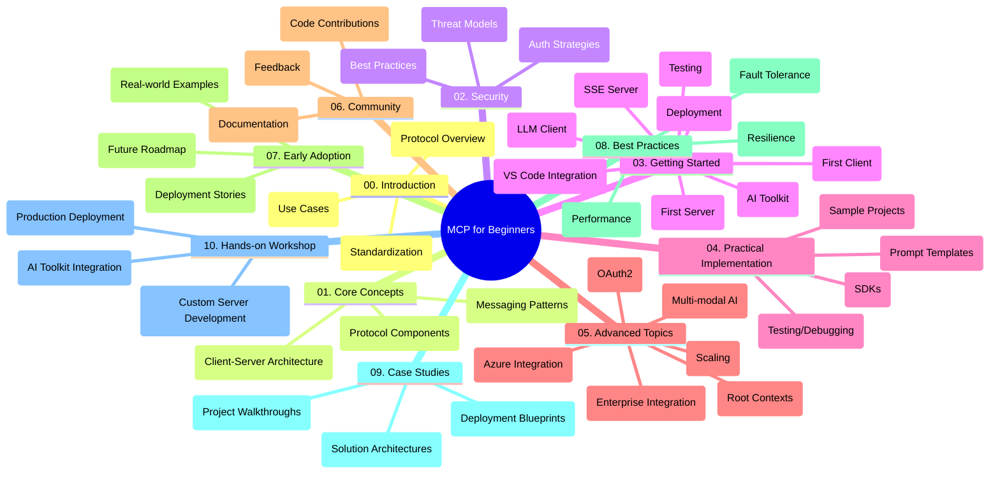

<!--
CO_OP_TRANSLATOR_METADATA:
{
  "original_hash": "a607d4febc94caee9a12b77795f7fc9a",
  "translation_date": "2025-07-13T15:12:02+00:00",
  "source_file": "study_guide.md",
  "language_code": "hi"
}
-->
# Model Context Protocol (MCP) for Beginners - अध्ययन मार्गदर्शिका

यह अध्ययन मार्गदर्शिका "Model Context Protocol (MCP) for Beginners" पाठ्यक्रम के लिए रिपॉजिटरी की संरचना और सामग्री का अवलोकन प्रदान करती है। इस मार्गदर्शिका का उपयोग रिपॉजिटरी में कुशलतापूर्वक नेविगेट करने और उपलब्ध संसाधनों का अधिकतम लाभ उठाने के लिए करें।

## रिपॉजिटरी का अवलोकन

Model Context Protocol (MCP) AI मॉडल और क्लाइंट एप्लिकेशन के बीच इंटरैक्शन के लिए एक मानकीकृत फ्रेमवर्क है। यह रिपॉजिटरी C#, Java, JavaScript, Python, और TypeScript में व्यावहारिक कोड उदाहरणों के साथ एक व्यापक पाठ्यक्रम प्रदान करती है, जो AI डेवलपर्स, सिस्टम आर्किटेक्ट्स, और सॉफ्टवेयर इंजीनियरों के लिए डिज़ाइन किया गया है।

## विज़ुअल पाठ्यक्रम मानचित्र

## रिपॉजिटरी संरचना

रिपॉजिटरी को दस मुख्य भागों में व्यवस्थित किया गया है, जो MCP के विभिन्न पहलुओं पर केंद्रित हैं:

1. **परिचय (00-Introduction/)**
   - Model Context Protocol का परिचय
   - AI पाइपलाइनों में मानकीकरण क्यों महत्वपूर्ण है
   - व्यावहारिक उपयोग के मामले और लाभ

2. **मूल अवधारणाएँ (01-CoreConcepts/)**
   - क्लाइंट-सर्वर आर्किटेक्चर
   - प्रमुख प्रोटोकॉल घटक
   - MCP में मैसेजिंग पैटर्न

3. **सुरक्षा (02-Security/)**
   - MCP-आधारित सिस्टम में सुरक्षा खतरें
   - सुरक्षित कार्यान्वयन के लिए सर्वोत्तम प्रथाएँ
   - प्रमाणीकरण और प्राधिकरण रणनीतियाँ

4. **शुरुआत करना (03-GettingStarted/)**
   - पर्यावरण सेटअप और कॉन्फ़िगरेशन
   - बेसिक MCP सर्वर और क्लाइंट बनाना
   - मौजूदा एप्लिकेशन के साथ एकीकरण
   - पहले सर्वर, पहले क्लाइंट, LLM क्लाइंट, VS Code इंटीग्रेशन, SSE सर्वर, AI टूलकिट, परीक्षण, और डिप्लॉयमेंट के उपखंड

5. **व्यावहारिक कार्यान्वयन (04-PracticalImplementation/)**
   - विभिन्न प्रोग्रामिंग भाषाओं में SDK का उपयोग
   - डिबगिंग, परीक्षण, और सत्यापन तकनीकें
   - पुन: उपयोग योग्य प्रॉम्प्ट टेम्पलेट और वर्कफ़्लो बनाना
   - कार्यान्वयन उदाहरणों के साथ नमूना प्रोजेक्ट्स

6. **उन्नत विषय (05-AdvancedTopics/)**
   - मल्टी-मॉडल AI वर्कफ़्लो और विस्तारशीलता
   - सुरक्षित स्केलिंग रणनीतियाँ
   - एंटरप्राइज इकोसिस्टम में MCP
   - विशेष विषय जैसे Azure इंटीग्रेशन, मल्टी-मॉडैलिटी, OAuth2, रूट कॉन्टेक्स्ट, रूटिंग, सैंपलिंग, स्केलिंग, सुरक्षा, वेब सर्च इंटीग्रेशन, और स्ट्रीमिंग।

7. **समुदाय योगदान (06-CommunityContributions/)**
   - कोड और दस्तावेज़ीकरण में योगदान कैसे करें
   - GitHub के माध्यम से सहयोग
   - समुदाय-चालित सुधार और प्रतिक्रिया

8. **प्रारंभिक अपनाने से सीख (07-LessonsfromEarlyAdoption/)**
   - वास्तविक दुनिया के कार्यान्वयन और सफलता की कहानियाँ
   - MCP-आधारित समाधान बनाना और डिप्लॉय करना
   - रुझान और भविष्य की रूपरेखा

9. **सर्वोत्तम प्रथाएँ (08-BestPractices/)**
   - प्रदर्शन ट्यूनिंग और अनुकूलन
   - फॉल्ट-टॉलरेंट MCP सिस्टम डिज़ाइन करना
   - परीक्षण और लचीलापन रणनीतियाँ

10. **केस स्टडीज (09-CaseStudy/)**
    - MCP समाधान आर्किटेक्चर में गहराई से विश्लेषण
    - डिप्लॉयमेंट ब्लूप्रिंट और एकीकरण सुझाव
    - एनोटेटेड डायग्राम और प्रोजेक्ट वॉकथ्रू

11. **हैंड्स-ऑन कार्यशाला (10-StreamliningAIWorkflowsBuildingAnMCPServerWithAIToolkit/)**
    - Microsoft के AI Toolkit के साथ MCP को जोड़ती व्यापक हैंड्स-ऑन कार्यशाला
    - AI मॉडल को वास्तविक दुनिया के टूल्स से जोड़ने वाले बुद्धिमान एप्लिकेशन बनाना
    - मूल बातें, कस्टम सर्वर विकास, और प्रोडक्शन डिप्लॉयमेंट रणनीतियों को कवर करने वाले व्यावहारिक मॉड्यूल

## नमूना प्रोजेक्ट्स

रिपॉजिटरी में कई नमूना प्रोजेक्ट्स शामिल हैं जो विभिन्न प्रोग्रामिंग भाषाओं में MCP कार्यान्वयन को प्रदर्शित करते हैं:

### बेसिक MCP कैलकुलेटर नमूने
- C# MCP सर्वर उदाहरण
- Java MCP कैलकुलेटर
- JavaScript MCP डेमो
- Python MCP सर्वर
- TypeScript MCP उदाहरण

### उन्नत MCP कैलकुलेटर प्रोजेक्ट्स
- उन्नत C# नमूना
- Java कंटेनर ऐप उदाहरण
- JavaScript उन्नत नमूना
- Python जटिल कार्यान्वयन
- TypeScript कंटेनर नमूना

## अतिरिक्त संसाधन

रिपॉजिटरी में सहायक संसाधन शामिल हैं:

- **Images फ़ोल्डर**: पाठ्यक्रम में उपयोग किए गए आरेख और चित्र
- **अनुवाद**: दस्तावेज़ीकरण के स्वचालित बहुभाषी अनुवाद
- **आधिकारिक MCP संसाधन**:
  - [MCP Documentation](https://modelcontextprotocol.io/)
  - [MCP Specification](https://spec.modelcontextprotocol.io/)
  - [MCP GitHub Repository](https://github.com/modelcontextprotocol)

## इस रिपॉजिटरी का उपयोग कैसे करें

1. **क्रमिक सीखना**: संरचित सीखने के लिए अध्यायों को क्रम में (00 से 10 तक) पढ़ें।
2. **भाषा-विशिष्ट फोकस**: यदि आप किसी विशेष प्रोग्रामिंग भाषा में रुचि रखते हैं, तो अपने पसंदीदा भाषा के नमूना निर्देशिकाओं का अन्वेषण करें।
3. **व्यावहारिक कार्यान्वयन**: अपने पर्यावरण को सेटअप करने और पहला MCP सर्वर और क्लाइंट बनाने के लिए "Getting Started" अनुभाग से शुरू करें।
4. **उन्नत अन्वेषण**: मूल बातें समझने के बाद, अपने ज्ञान को बढ़ाने के लिए उन्नत विषयों में गहराई से जाएं।
5. **समुदाय सहभागिता**: विशेषज्ञों और अन्य डेवलपर्स से जुड़ने के लिए [Azure AI Foundry Discord](https://discord.com/invite/ByRwuEEgH4) में शामिल हों।

## योगदान

यह रिपॉजिटरी समुदाय से योगदान का स्वागत करती है। योगदान कैसे करें, इसके लिए Community Contributions अनुभाग देखें।

---

*यह अध्ययन मार्गदर्शिका 11 जून, 2025 को बनाई गई थी और उस तारीख तक रिपॉजिटरी का अवलोकन प्रदान करती है। तब से रिपॉजिटरी की सामग्री अपडेट हो सकती है।*

**अस्वीकरण**:  
यह दस्तावेज़ AI अनुवाद सेवा [Co-op Translator](https://github.com/Azure/co-op-translator) का उपयोग करके अनुवादित किया गया है। जबकि हम सटीकता के लिए प्रयासरत हैं, कृपया ध्यान दें कि स्वचालित अनुवादों में त्रुटियाँ या अशुद्धियाँ हो सकती हैं। मूल दस्तावेज़ अपनी मूल भाषा में ही अधिकारिक स्रोत माना जाना चाहिए। महत्वपूर्ण जानकारी के लिए, पेशेवर मानव अनुवाद की सलाह दी जाती है। इस अनुवाद के उपयोग से उत्पन्न किसी भी गलतफहमी या गलत व्याख्या के लिए हम जिम्मेदार नहीं हैं।