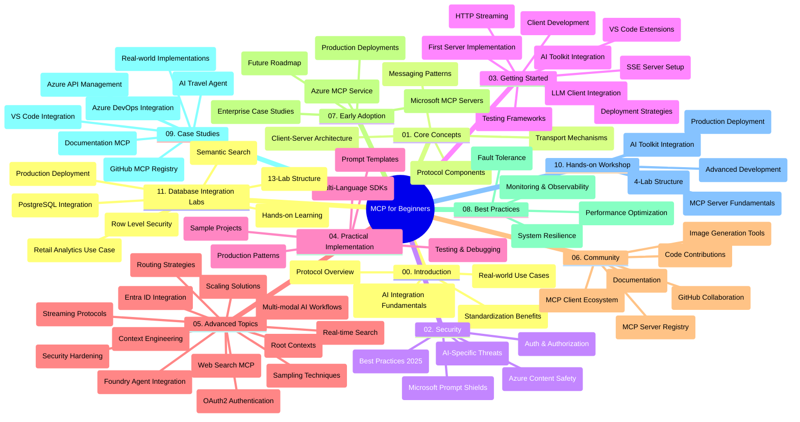

<!--
CO_OP_TRANSLATOR_METADATA:
{
  "original_hash": "aa1ce97bc694b08faf3018bab6d275b9",
  "translation_date": "2025-09-30T13:38:42+00:00",
  "source_file": "study_guide.md",
  "language_code": "hi"
}
-->
# मॉडल कॉन्टेक्स्ट प्रोटोकॉल (MCP) शुरुआती लोगों के लिए - अध्ययन गाइड

यह अध्ययन गाइड "मॉडल कॉन्टेक्स्ट प्रोटोकॉल (MCP) शुरुआती लोगों के लिए" पाठ्यक्रम की रिपॉजिटरी संरचना और सामग्री का अवलोकन प्रदान करता है। इस गाइड का उपयोग रिपॉजिटरी को कुशलतापूर्वक नेविगेट करने और उपलब्ध संसाधनों का अधिकतम लाभ उठाने के लिए करें।

## रिपॉजिटरी का अवलोकन

मॉडल कॉन्टेक्स्ट प्रोटोकॉल (MCP) AI मॉडल और क्लाइंट एप्लिकेशन के बीच इंटरैक्शन के लिए एक मानकीकृत फ्रेमवर्क है। इसे मूल रूप से Anthropic द्वारा बनाया गया था और अब व्यापक MCP समुदाय द्वारा आधिकारिक GitHub संगठन के माध्यम से बनाए रखा जाता है। यह रिपॉजिटरी AI डेवलपर्स, सिस्टम आर्किटेक्ट्स और सॉफ्टवेयर इंजीनियरों के लिए C#, Java, JavaScript, Python, और TypeScript में हैंड्स-ऑन कोड उदाहरणों के साथ एक व्यापक पाठ्यक्रम प्रदान करती है।

## विजुअल पाठ्यक्रम मानचित्र

## रिपॉजिटरी संरचना

रिपॉजिटरी को ग्यारह मुख्य अनुभागों में व्यवस्थित किया गया है, जो MCP के विभिन्न पहलुओं पर केंद्रित हैं:

1. **परिचय (00-Introduction/)**
   - मॉडल कॉन्टेक्स्ट प्रोटोकॉल का अवलोकन
   - AI पाइपलाइनों में मानकीकरण क्यों महत्वपूर्ण है
   - व्यावहारिक उपयोग के मामले और लाभ

2. **मुख्य अवधारणाएँ (01-CoreConcepts/)**
   - क्लाइंट-सर्वर आर्किटेक्चर
   - प्रमुख प्रोटोकॉल घटक
   - MCP में मैसेजिंग पैटर्न

3. **सुरक्षा (02-Security/)**
   - MCP-आधारित सिस्टम में सुरक्षा खतरों
   - कार्यान्वयन को सुरक्षित करने के लिए सर्वोत्तम प्रथाएँ
   - प्रमाणीकरण और प्राधिकरण रणनीतियाँ
   - **व्यापक सुरक्षा दस्तावेज़ीकरण**:
     - MCP सुरक्षा सर्वोत्तम प्रथाएँ 2025
     - Azure सामग्री सुरक्षा कार्यान्वयन गाइड
     - MCP सुरक्षा नियंत्रण और तकनीकें
     - MCP सर्वोत्तम प्रथाएँ त्वरित संदर्भ
   - **मुख्य सुरक्षा विषय**:
     - प्रॉम्प्ट इंजेक्शन और टूल पॉइज़निंग हमले
     - सत्र अपहरण और भ्रमित डिप्टी समस्याएँ
     - टोकन पासथ्रू कमजोरियाँ
     - अत्यधिक अनुमतियाँ और एक्सेस नियंत्रण
     - AI घटकों के लिए आपूर्ति श्रृंखला सुरक्षा
     - Microsoft प्रॉम्प्ट शील्ड्स एकीकरण

4. **शुरुआत करना (03-GettingStarted/)**
   - पर्यावरण सेटअप और कॉन्फ़िगरेशन
   - बुनियादी MCP सर्वर और क्लाइंट बनाना
   - मौजूदा एप्लिकेशन के साथ एकीकरण
   - इसमें शामिल हैं:
     - पहला सर्वर कार्यान्वयन
     - क्लाइंट विकास
     - LLM क्लाइंट एकीकरण
     - VS कोड एकीकरण
     - सर्वर-सेंट इवेंट्स (SSE) सर्वर
     - HTTP स्ट्रीमिंग
     - AI टूलकिट एकीकरण
     - परीक्षण रणनीतियाँ
     - परिनियोजन दिशानिर्देश

5. **व्यावहारिक कार्यान्वयन (04-PracticalImplementation/)**
   - विभिन्न प्रोग्रामिंग भाषाओं में SDKs का उपयोग
   - डिबगिंग, परीक्षण, और सत्यापन तकनीकें
   - पुन: उपयोग योग्य प्रॉम्प्ट टेम्पलेट और वर्कफ़्लो तैयार करना
   - कार्यान्वयन उदाहरणों के साथ नमूना परियोजनाएँ

6. **उन्नत विषय (05-AdvancedTopics/)**
   - कॉन्टेक्स्ट इंजीनियरिंग तकनीकें
   - फाउंड्री एजेंट एकीकरण
   - मल्टी-मोडल AI वर्कफ़्लो
   - OAuth2 प्रमाणीकरण डेमो
   - रीयल-टाइम खोज क्षमताएँ
   - रीयल-टाइम स्ट्रीमिंग
   - रूट कॉन्टेक्स्ट कार्यान्वयन
   - रूटिंग रणनीतियाँ
   - सैंपलिंग तकनीकें
   - स्केलिंग दृष्टिकोण
   - सुरक्षा विचार
   - Entra ID सुरक्षा एकीकरण
   - वेब खोज एकीकरण

7. **समुदाय योगदान (06-CommunityContributions/)**
   - कोड और दस्तावेज़ीकरण में योगदान कैसे करें
   - GitHub के माध्यम से सहयोग करना
   - सामुदायिक-संचालित संवर्द्धन और प्रतिक्रिया
   - विभिन्न MCP क्लाइंट का उपयोग करना (Claude Desktop, Cline, VSCode)
   - लोकप्रिय MCP सर्वरों के साथ काम करना, जिसमें इमेज जनरेशन शामिल है

8. **प्रारंभिक अपनाने से सीख (07-LessonsfromEarlyAdoption/)**
   - वास्तविक दुनिया के कार्यान्वयन और सफलता की कहानियाँ
   - MCP-आधारित समाधान बनाना और तैनात करना
   - रुझान और भविष्य का रोडमैप
   - **Microsoft MCP सर्वर गाइड**: 10 उत्पादन-तैयार Microsoft MCP सर्वरों का व्यापक गाइड, जिसमें शामिल हैं:
     - Microsoft Learn Docs MCP Server
     - Azure MCP Server (15+ विशेषीकृत कनेक्टर)
     - GitHub MCP Server
     - Azure DevOps MCP Server
     - MarkItDown MCP Server
     - SQL Server MCP Server
     - Playwright MCP Server
     - Dev Box MCP Server
     - Azure AI Foundry MCP Server
     - Microsoft 365 Agents Toolkit MCP Server

9. **सर्वोत्तम प्रथाएँ (08-BestPractices/)**
   - प्रदर्शन ट्यूनिंग और अनुकूलन
   - दोष-सहिष्णु MCP सिस्टम डिज़ाइन करना
   - परीक्षण और लचीलापन रणनीतियाँ

10. **केस स्टडीज (09-CaseStudy/)**
    - **सात व्यापक केस स्टडीज** जो MCP की बहुमुखी प्रतिभा को विभिन्न परिदृश्यों में प्रदर्शित करती हैं:
    - **Azure AI ट्रैवल एजेंट्स**: Azure OpenAI और AI सर्च के साथ मल्टी-एजेंट ऑर्केस्ट्रेशन
    - **Azure DevOps एकीकरण**: YouTube डेटा अपडेट के साथ वर्कफ़्लो प्रक्रियाओं को स्वचालित करना
    - **रीयल-टाइम दस्तावेज़ पुनर्प्राप्ति**: स्ट्रीमिंग HTTP के साथ Python कंसोल क्लाइंट
    - **इंटरएक्टिव अध्ययन योजना जनरेटर**: Chainlit वेब ऐप के साथ संवादात्मक AI
    - **इन-एडिटर दस्तावेज़ीकरण**: GitHub Copilot वर्कफ़्लो के साथ VS कोड एकीकरण
    - **Azure API प्रबंधन**: MCP सर्वर निर्माण के साथ एंटरप्राइज़ API एकीकरण
    - **GitHub MCP रजिस्ट्री**: पारिस्थितिकी तंत्र विकास और एजेंटिक एकीकरण प्लेटफ़ॉर्म
    - कार्यान्वयन उदाहरण जो एंटरप्राइज़ एकीकरण, डेवलपर उत्पादकता, और पारिस्थितिकी तंत्र विकास को कवर करते हैं

11. **हैंड्स-ऑन वर्कशॉप (10-StreamliningAIWorkflowsBuildingAnMCPServerWithAIToolkit/)**
    - MCP को AI टूलकिट के साथ जोड़ने वाली व्यापक हैंड्स-ऑन वर्कशॉप
    - AI मॉडल को वास्तविक दुनिया के टूल्स के साथ जोड़ने वाले बुद्धिमान एप्लिकेशन बनाना
    - व्यावहारिक मॉड्यूल जो मूलभूत बातें, कस्टम सर्वर विकास, और उत्पादन परिनियोजन रणनीतियों को कवर करते हैं
    - **लैब संरचना**:
      - लैब 1: MCP सर्वर मूलभूत बातें
      - लैब 2: उन्नत MCP सर्वर विकास
      - लैब 3: AI टूलकिट एकीकरण
      - लैब 4: उत्पादन परिनियोजन और स्केलिंग
    - चरण-दर-चरण निर्देशों के साथ लैब-आधारित शिक्षण दृष्टिकोण

12. **MCP सर्वर डेटाबेस एकीकरण लैब्स (11-MCPServerHandsOnLabs/)**
    - **13-लैब का व्यापक शिक्षण पथ** जो PostgreSQL एकीकरण के साथ उत्पादन-तैयार MCP सर्वर बनाने के लिए है
    - **Zava रिटेल उपयोग केस** का उपयोग करके वास्तविक दुनिया का रिटेल एनालिटिक्स कार्यान्वयन
    - **एंटरप्राइज़-ग्रेड पैटर्न** जिसमें Row Level Security (RLS), सेमांटिक सर्च, और मल्टी-टेनेंट डेटा एक्सेस शामिल हैं
    - **पूर्ण लैब संरचना**:
      - **लैब्स 00-03: नींव** - परिचय, आर्किटेक्चर, सुरक्षा, पर्यावरण सेटअप
      - **लैब्स 04-06: MCP सर्वर बनाना** - डेटाबेस डिज़ाइन, MCP सर्वर कार्यान्वयन, टूल विकास
      - **लैब्स 07-09: उन्नत सुविधाएँ** - सेमांटिक सर्च, परीक्षण और डिबगिंग, VS कोड एकीकरण
      - **लैब्स 10-12: उत्पादन और सर्वोत्तम प्रथाएँ** - परिनियोजन, निगरानी, अनुकूलन
    - **कवर की गई तकनीकें**: FastMCP फ्रेमवर्क, PostgreSQL, Azure OpenAI, Azure Container Apps, Application Insights
    - **शिक्षण परिणाम**: उत्पादन-तैयार MCP सर्वर, डेटाबेस एकीकरण पैटर्न, AI-संचालित एनालिटिक्स, एंटरप्राइज़ सुरक्षा

## अतिरिक्त संसाधन

रिपॉजिटरी में सहायक संसाधन शामिल हैं:

- **इमेजेस फ़ोल्डर**: पाठ्यक्रम में उपयोग किए गए आरेख और चित्र शामिल हैं
- **अनुवाद**: दस्तावेज़ीकरण के स्वचालित अनुवाद के साथ बहु-भाषा समर्थन
- **आधिकारिक MCP संसाधन**:
  - [MCP दस्तावेज़ीकरण](https://modelcontextprotocol.io/)
  - [MCP विनिर्देश](https://spec.modelcontextprotocol.io/)
  - [MCP GitHub रिपॉजिटरी](https://github.com/modelcontextprotocol)

## इस रिपॉजिटरी का उपयोग कैसे करें

1. **क्रमिक शिक्षण**: संरचित शिक्षण अनुभव के लिए अध्यायों को क्रम में (00 से 11 तक) पढ़ें।
2. **भाषा-विशिष्ट ध्यान**: यदि आप किसी विशेष प्रोग्रामिंग भाषा में रुचि रखते हैं, तो अपनी पसंदीदा भाषा में कार्यान्वयन के लिए नमूना निर्देशिकाएँ देखें।
3. **व्यावहारिक कार्यान्वयन**: अपना पर्यावरण सेटअप करने और अपना पहला MCP सर्वर और क्लाइंट बनाने के लिए "शुरुआत करना" अनुभाग से शुरू करें।
4. **उन्नत अन्वेषण**: मूल बातें समझने के बाद, अपने ज्ञान को बढ़ाने के लिए उन्नत विषयों में गहराई से जाएँ।
5. **समुदाय सहभागिता**: विशेषज्ञों और अन्य डेवलपर्स से जुड़ने के लिए GitHub चर्चाओं और Discord चैनलों के माध्यम से MCP समुदाय में शामिल हों।

## MCP क्लाइंट और टूल्स

पाठ्यक्रम विभिन्न MCP क्लाइंट और टूल्स को कवर करता है:

1. **आधिकारिक क्लाइंट**:
   - Visual Studio Code 
   - MCP in Visual Studio Code
   - Claude Desktop
   - Claude in VSCode 
   - Claude API

2. **समुदाय क्लाइंट**:
   - Cline (टर्मिनल-आधारित)
   - Cursor (कोड संपादक)
   - ChatMCP
   - Windsurf

3. **MCP प्रबंधन टूल्स**:
   - MCP CLI
   - MCP Manager
   - MCP Linker
   - MCP Router

## लोकप्रिय MCP सर्वर

रिपॉजिटरी विभिन्न MCP सर्वरों को पेश करती है, जिनमें शामिल हैं:

1. **आधिकारिक Microsoft MCP सर्वर**:
   - Microsoft Learn Docs MCP Server
   - Azure MCP Server (15+ विशेषीकृत कनेक्टर)
   - GitHub MCP Server
   - Azure DevOps MCP Server
   - MarkItDown MCP Server
   - SQL Server MCP Server
   - Playwright MCP Server
   - Dev Box MCP Server
   - Azure AI Foundry MCP Server
   - Microsoft 365 Agents Toolkit MCP Server

2. **आधिकारिक संदर्भ सर्वर**:
   - Filesystem
   - Fetch
   - Memory
   - Sequential Thinking

3. **इमेज जनरेशन**:
   - Azure OpenAI DALL-E 3
   - Stable Diffusion WebUI
   - Replicate

4. **विकास उपकरण**:
   - Git MCP
   - Terminal Control
   - Code Assistant

5. **विशेषीकृत सर्वर**:
   - Salesforce
   - Microsoft Teams
   - Jira & Confluence

## योगदान

यह रिपॉजिटरी समुदाय से योगदान का स्वागत करती है। MCP पारिस्थितिकी तंत्र में प्रभावी ढंग से योगदान करने के लिए सामुदायिक योगदान अनुभाग देखें।

## चेंजलॉग

| तारीख | परिवर्तन |
|------|---------||
| 29 सितंबर, 2025 | - 11-MCPServerHandsOnLabs अनुभाग जोड़ा गया, जिसमें व्यापक 13-लैब डेटाबेस एकीकरण शिक्षण पथ शामिल है - डेटाबेस एकीकरण लैब्स को शामिल करने के लिए विजुअल पाठ्यक्रम मानचित्र अपडेट किया गया - ग्यारह मुख्य अनुभागों को प्रतिबिंबित करने के लिए रिपॉजिटरी संरचना को बढ़ाया गया - PostgreSQL एकीकरण, रिटेल एनालिटिक्स उपयोग केस, और एंटरप्राइज़ पैटर्न का विस्तृत विवरण जोड़ा गया - 00-11 अनुभागों को शामिल करने के लिए नेविगेशन मार्गदर्शन अपडेट किया गया |
| 26 सितंबर, 2025 | - GitHub MCP रजिस्ट्री केस स्टडी को 09-CaseStudy अनुभाग में जोड़ा गया - सात व्यापक केस स्टडीज को प्रतिबिंबित करने के लिए केस स्टडीज अपडेट की गईं - विशिष्ट कार्यान्वयन विवरणों के साथ केस स्टडी विवरण बढ़ाया गया - GitHub MCP रजिस्ट्री को शामिल करने के लिए विजुअल पाठ्यक्रम मानचित्र अपडेट किया गया - पारिस्थितिकी तंत्र विकास फोकस को प्रतिबिंबित करने के लिए अध्ययन गाइड संरचना संशोधित की गई |
| 18 जुलाई, 2025 | - Microsoft MCP सर्वर गाइड को शामिल करने के लिए रिपॉजिटरी संरचना अपडेट की गई - 10 उत्पादन-तैयार Microsoft MCP सर्वरों की व्यापक सूची जोड़ी गई - आधिकारिक Microsoft MCP सर्वरों के साथ लोकप्रिय MCP सर्वरों अनुभाग को बढ़ाया गया - वास्तविक फ़ाइल उदाहरणों के साथ केस स्टडीज अनुभाग अपडेट किया गया - हैंड्स-ऑन वर्कशॉप के लिए लैब संरचना विवरण जोड़ा गया |
| 16 जुलाई, 2025 | - वर्तमान सामग्री को प्रतिबिंबित करने के लिए रिपॉजिटरी संरचना अपडेट की गई - MCP क्लाइंट और टूल्स अनुभाग जोड़ा गया - लोकप्रिय MCP सर्वरों अनुभाग जोड़ा गया - सभी वर्तमान विषयों के साथ विजुअल पाठ्यक्रम मानचित्र अपडेट किया गया - सभी विशेषीकृत क्षेत्रों के साथ उन्नत विषय अनुभाग बढ़ाया गया - वास्तविक उदाहरणों को प्रतिबिंबित करने के लिए केस स्टडीज अपडेट की गईं - Anthropic द्वारा MCP की उत्पत्ति को स्पष्ट किया गया |
| 11 जून, 2025 | - अध्ययन गाइड का प्रारंभिक निर्माण - विजुअल पाठ्यक्रम मानचित्र जोड़ा गया - रिपॉजिटरी संरचना की रूपरेखा तैयार की गई - नमूना परियोजनाएँ और अतिरिक्त संसाधन शामिल किए गए |

---

*यह अध्ययन गाइड 29 सितंबर, 2025 को अपडेट किया गया था और उस तारीख तक रिपॉजिटरी का अवलोकन प्रदान करता है। इस तारीख के बाद रिपॉजिटरी सामग्री अपडेट की जा सकती है।*

---

**अस्वीकरण**:  
यह दस्तावेज़ AI अनुवाद सेवा [Co-op Translator](https://github.com/Azure/co-op-translator) का उपयोग करके अनुवादित किया गया है। जबकि हम सटीकता सुनिश्चित करने का प्रयास करते हैं, कृपया ध्यान दें कि स्वचालित अनुवाद में त्रुटियां या अशुद्धियां हो सकती हैं। मूल भाषा में उपलब्ध मूल दस्तावेज़ को प्रामाणिक स्रोत माना जाना चाहिए। महत्वपूर्ण जानकारी के लिए, पेशेवर मानव अनुवाद की सिफारिश की जाती है। इस अनुवाद के उपयोग से उत्पन्न किसी भी गलतफहमी या गलत व्याख्या के लिए हम उत्तरदायी नहीं हैं।