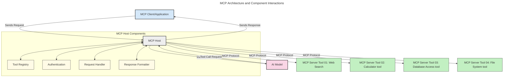
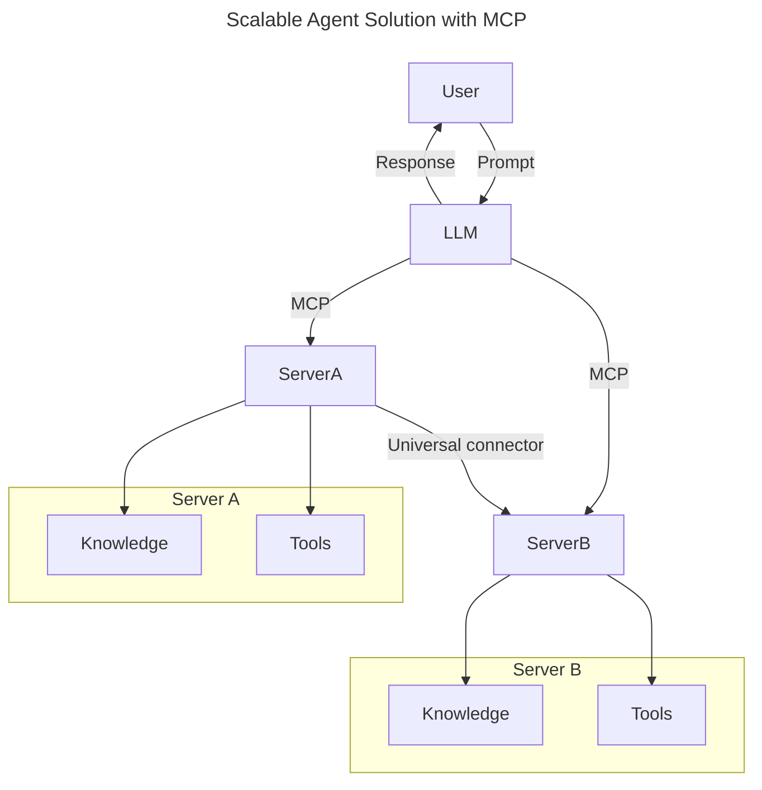
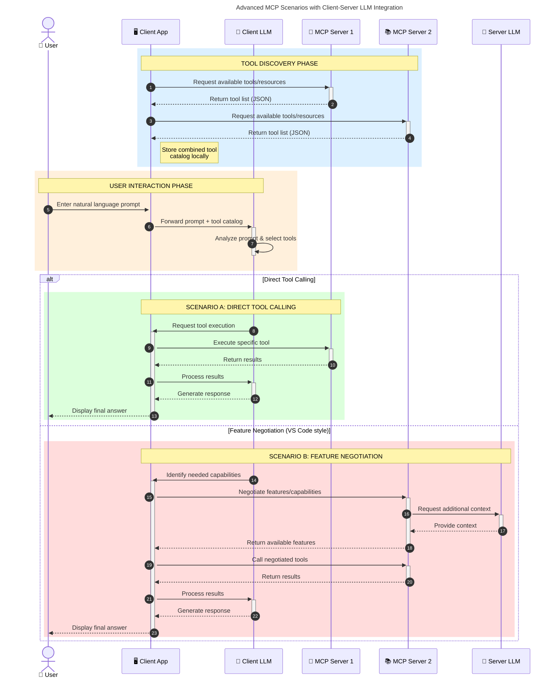

<!--
CO_OP_TRANSLATOR_METADATA:
{
  "original_hash": "0df1ee78a6dd8300f3a040ca5b411c2e",
  "translation_date": "2025-08-12T07:37:49+00:00",
  "source_file": "00-Introduction/README.md",
  "language_code": "hk"
}
-->
# 模型上下文協議 (MCP) 簡介：為何它對可擴展的 AI 應用至關重要

_（點擊上方圖片觀看本課程的影片）_

生成式 AI 應用是一個巨大的進步，因為它們通常允許用戶使用自然語言提示與應用程式互動。然而，隨著投入這類應用的時間和資源越來越多，你需要確保能輕鬆整合功能和資源，使應用程式易於擴展，能夠支持多個模型的使用，並處理各種模型的複雜性。簡而言之，構建生成式 AI 應用一開始可能很簡單，但隨著應用的增長和複雜化，你需要開始定義架構，並可能需要依賴標準來確保應用以一致的方式構建。這正是 MCP 的用武之地，它能組織一切並提供一個標準。

---

## **🔍 什麼是模型上下文協議 (MCP)?**

**模型上下文協議 (MCP)** 是一種**開放的、標準化的介面**，允許大型語言模型 (LLMs) 與外部工具、API 和數據源無縫互動。它提供了一個一致的架構，增強 AI 模型超越其訓練數據的功能，從而實現更智能、更具可擴展性和更靈活的 AI 系統。

---

## **🎯 為什麼 AI 標準化很重要**

隨著生成式 AI 應用變得越來越複雜，採用能確保**可擴展性、可延展性、可維護性**並**避免供應商鎖定**的標準至關重要。MCP 解決了這些需求，通過以下方式：

- 統一模型與工具的整合
- 減少脆弱的、一次性的定制解決方案
- 允許來自不同供應商的多個模型在同一生態系統中共存

**注意：** 雖然 MCP 自稱是一個開放標準，但目前沒有計劃通過任何現有的標準組織（如 IEEE、IETF、W3C、ISO 或其他標準組織）對 MCP 進行標準化。

---

## **📚 學習目標**

閱讀本文後，你將能夠：

- 定義 **模型上下文協議 (MCP)** 及其使用場景
- 理解 MCP 如何標準化模型與工具的通信
- 識別 MCP 架構的核心組件
- 探索 MCP 在企業和開發環境中的實際應用

---

## **💡 為什麼模型上下文協議 (MCP) 是一個改變遊戲規則的技術**

### **🔗 MCP 解決了 AI 互動中的碎片化問題**

在 MCP 出現之前，將模型與工具整合需要：

- 為每個工具-模型組合編寫定制代碼
- 為每個供應商使用非標準化的 API
- 因更新導致頻繁中斷
- 隨著工具數量增加而難以擴展

### **✅ MCP 標準化的好處**

| **好處**                  | **描述**                                                                      |
|--------------------------|------------------------------------------------------------------------------|
| 互操作性                 | LLMs 能夠與來自不同供應商的工具無縫協作                                      |
| 一致性                   | 在不同平台和工具之間保持統一的行為                                            |
| 可重用性                 | 一次構建的工具可以在多個項目和系統中使用                                      |
| 加速開發                 | 通過使用標準化的即插即用介面減少開發時間                                      |

---

## **🧱 MCP 高層架構概述**

MCP 遵循一種**客戶端-伺服器模型**，其中：

- **MCP 主機** 運行 AI 模型
- **MCP 客戶端** 發起請求
- **MCP 伺服器** 提供上下文、工具和功能

### **核心組件：**

- **資源** – 模型使用的靜態或動態數據  
- **提示** – 用於引導生成的預定義工作流  
- **工具** – 可執行的功能，如搜索、計算  
- **採樣** – 通過遞歸交互實現代理行為  

---

## MCP 伺服器如何運作

MCP 伺服器的運作方式如下：

- **請求流程**：
    1. 最終用戶或代表用戶行動的軟件發起請求。
    2. **MCP 客戶端** 將請求發送到管理 AI 模型運行時的 **MCP 主機**。
    3. **AI 模型** 接收用戶提示，並可能通過一個或多個工具調用請求訪問外部工具或數據。
    4. **MCP 主機**（而非模型本身）使用標準化協議與相應的 **MCP 伺服器** 通信。
- **MCP 主機功能**：
    - **工具註冊表**：維護可用工具及其功能的目錄。
    - **身份驗證**：驗證工具訪問的權限。
    - **請求處理器**：處理來自模型的工具請求。
    - **響應格式化器**：將工具輸出結構化為模型可理解的格式。
- **MCP 伺服器執行**：
    - **MCP 主機** 將工具調用路由到一個或多個 **MCP 伺服器**，每個伺服器提供專門的功能（例如搜索、計算、數據庫查詢）。
    - **MCP 伺服器** 執行其各自的操作，並以一致的格式將結果返回給 **MCP 主機**。
    - **MCP 主機** 格式化並將這些結果轉發給 **AI 模型**。
- **響應完成**：
    - **AI 模型** 將工具輸出整合到最終響應中。
    - **MCP 主機** 將此響應發送回 **MCP 客戶端**，由其交付給最終用戶或調用軟件。

## 👨‍💻 如何構建 MCP 伺服器（附示例）

MCP 伺服器允許你通過提供數據和功能來擴展 LLM 的能力。

準備好試試看了嗎？以下是基於不同語言/技術棧的 SDK 和示例，展示如何構建簡單的 MCP 伺服器：

- **Python SDK**: https://github.com/modelcontextprotocol/python-sdk

- **TypeScript SDK**: https://github.com/modelcontextprotocol/typescript-sdk

- **Java SDK**: https://github.com/modelcontextprotocol/java-sdk

- **C#/.NET SDK**: https://github.com/modelcontextprotocol/csharp-sdk

---

## 🌍 MCP 的實際應用場景

MCP 通過擴展 AI 的能力支持廣泛的應用：

| **應用場景**               | **描述**                                                                      |
|---------------------------|------------------------------------------------------------------------------|
| 企業數據整合              | 將 LLMs 連接到數據庫、CRM 或內部工具                                          |
| 自主型 AI 系統            | 為代理提供工具訪問和決策工作流                                                |
| 多模態應用                | 在單一統一的 AI 應用中結合文本、圖像和音頻工具                                |
| 實時數據整合              | 將實時數據引入 AI 互動中，提供更準確、最新的輸出                               |

### 🧠 MCP = AI 互動的通用標準

模型上下文協議 (MCP) 就像 USB-C 標準化了設備的物理連接一樣，為 AI 互動提供了一個通用標準。在 AI 領域，MCP 提供了一個一致的介面，允許模型（客戶端）與外部工具和數據提供者（伺服器）無縫整合。這消除了為每個 API 或數據源設計多樣化、定制協議的需求。

在 MCP 框架下，一個 MCP 兼容的工具（稱為 MCP 伺服器）遵循統一的標準。這些伺服器可以列出它們提供的工具或操作，並在 AI 代理請求時執行這些操作。支持 MCP 的 AI 代理平台能夠通過標準協議發現伺服器提供的工具並調用它們。

### 💡 促進知識獲取

除了提供工具，MCP 還促進了知識的獲取。它通過將應用連接到各種數據源，為大型語言模型 (LLMs) 提供上下文。例如，一個 MCP 伺服器可能代表公司的文檔庫，允許代理按需檢索相關信息。另一個伺服器可能處理特定操作，如發送電子郵件或更新記錄。從代理的角度來看，這些只是它可以使用的工具——一些工具返回數據（知識上下文），而另一些則執行操作。MCP 高效地管理這兩者。

連接到 MCP 伺服器的代理可以通過標準格式自動了解伺服器的可用功能和可訪問數據。這種標準化實現了動態工具的可用性。例如，向代理系統添加一個新的 MCP 伺服器後，其功能可以立即使用，而無需進一步定制代理的指令。

這種簡化的整合方式與以下圖表中的流程一致，伺服器提供工具和知識，確保系統間的無縫協作。

### 👉 示例：可擴展的代理解決方案

### 🔄 客戶端 LLM 整合的高級 MCP 場景

除了基本的 MCP 架構，還有一些高級場景，其中客戶端和伺服器都包含 LLM，實現更複雜的交互。在下圖中，**客戶端應用** 可能是一個集成了多個 MCP 工具的 IDE，供 LLM 使用：

---

## 🔐 MCP 的實際好處

以下是使用 MCP 的實際好處：

- **信息新鮮度**：模型可以訪問超出其訓練數據的最新信息
- **能力擴展**：模型可以利用專門的工具完成其未經訓練的任務
- **減少幻覺**：外部數據源提供事實依據
- **隱私**：敏感數據可以保留在安全環境中，而不是嵌入到提示中

---

## 📌 關鍵要點

以下是使用 MCP 的關鍵要點：

- **MCP** 標準化了 AI 模型與工具和數據的互動方式
- 促進了**可擴展性、一致性和互操作性**
- MCP 幫助**減少開發時間、提高可靠性並擴展模型能力**
- 客戶端-伺服器架構**支持靈活、可擴展的 AI 應用**

---

## 🧠 練習

想一想你感興趣構建的一個 AI 應用。

- 哪些**外部工具或數據**可以增強其功能？
- MCP 如何使整合變得**更簡單、更可靠**？

---

## 其他資源

- [MCP GitHub Repository](https://github.com/modelcontextprotocol)

---

## 下一步

下一章：[第 1 章：核心概念](../01-CoreConcepts/README.md)

**免責聲明**：  
本文件已使用人工智能翻譯服務 [Co-op Translator](https://github.com/Azure/co-op-translator) 進行翻譯。我們致力於提供準確的翻譯，但請注意，自動翻譯可能包含錯誤或不準確之處。應以原文文件作為權威來源。對於關鍵資訊，建議尋求專業人工翻譯。我們對因使用此翻譯而引起的任何誤解或錯誤解讀概不負責。