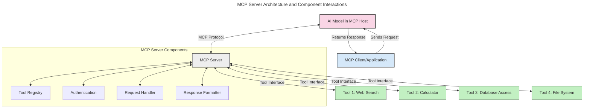
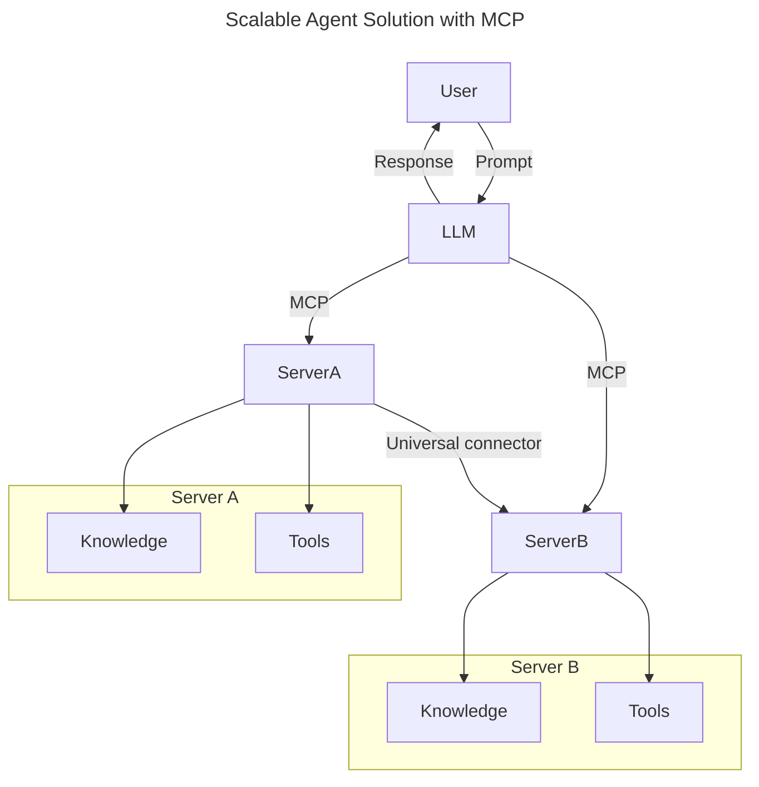
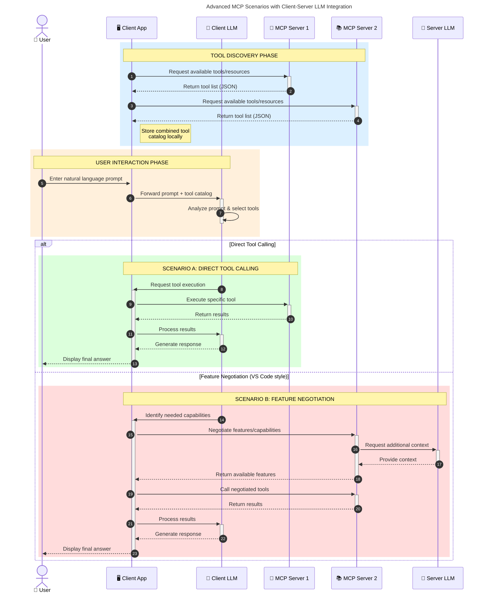

<!--
CO_OP_TRANSLATOR_METADATA:
{
  "original_hash": "105c2ddbb77bc38f7e9df009e1b06e45",
  "translation_date": "2025-07-13T15:27:50+00:00",
  "source_file": "00-Introduction/README.md",
  "language_code": "hk"
}
-->
# Model Context Protocol (MCP) 簡介：為何它對可擴展的 AI 應用至關重要

生成式 AI 應用是一大進步，因為它們通常允許用戶透過自然語言提示與應用互動。然而，隨著投入更多時間和資源，你會希望能輕鬆整合功能和資源，使應用易於擴展，能同時支援多個模型，並處理各種模型的複雜性。簡言之，建立生成式 AI 應用起步容易，但隨著規模和複雜度增加，你需要開始定義架構，並可能需要依賴一個標準，確保應用以一致的方式構建。這正是 MCP 發揮作用，組織並提供標準的地方。

---

## **🔍 什麼是 Model Context Protocol (MCP)?**

**Model Context Protocol (MCP)** 是一個**開放且標準化的介面**，讓大型語言模型（LLM）能無縫地與外部工具、API 和資料來源互動。它提供一致的架構，擴展 AI 模型的功能，超越訓練資料，實現更智能、可擴展且反應靈敏的 AI 系統。

---

## **🎯 為何 AI 標準化如此重要**

隨著生成式 AI 應用變得越來越複雜，採用標準以確保**可擴展性、可延展性**和**可維護性**變得至關重要。MCP 解決了這些需求，透過：

- 統一模型與工具的整合
- 減少脆弱且一次性的客製化解決方案
- 允許多個模型共存於同一生態系統中

---

## **📚 學習目標**

閱讀本文後，你將能夠：

- 定義 **Model Context Protocol (MCP)** 及其應用場景
- 理解 MCP 如何標準化模型與工具的溝通
- 辨識 MCP 架構的核心組件
- 探索 MCP 在企業和開發環境中的實際應用

---

## **💡 為何 Model Context Protocol (MCP) 是改變遊戲規則的技術**

### **🔗 MCP 解決 AI 互動的碎片化問題**

在 MCP 出現之前，模型與工具的整合需要：

- 每對工具與模型都寫客製化程式碼
- 各廠商使用非標準 API
- 更新頻繁導致整合中斷
- 工具越多，擴展性越差

### **✅ MCP 標準化的好處**

| **好處**                 | **說明**                                                                    |
|--------------------------|-----------------------------------------------------------------------------|
| 互通性                   | LLM 能與不同廠商的工具無縫合作                                             |
| 一致性                   | 跨平台和工具保持統一行為                                                    |
| 可重用性                 | 工具只需開發一次，可跨專案和系統使用                                        |
| 加速開發                 | 使用標準化、即插即用的介面，減少開發時間                                   |

---

## **🧱 MCP 架構高階概覽**

MCP 採用**客戶端-伺服器模型**，其中：

- **MCP Hosts** 運行 AI 模型
- **MCP Clients** 發起請求
- **MCP Servers** 提供上下文、工具和功能

### **主要組件：**

- **Resources** – 模型使用的靜態或動態資料  
- **Prompts** – 預設的工作流程，用於引導生成  
- **Tools** – 可執行的功能，如搜尋、計算  
- **Sampling** – 透過遞迴互動實現代理行為

---

## MCP 伺服器如何運作

MCP 伺服器的運作流程如下：

- **請求流程**：  
    1. MCP Client 向運行於 MCP Host 的 AI 模型發送請求。  
    2. AI 模型判斷何時需要外部工具或資料。  
    3. 模型使用標準化協議與 MCP Server 通訊。

- **MCP Server 功能**：  
    - 工具註冊表：維護可用工具及其功能目錄。  
    - 認證：驗證工具存取權限。  
    - 請求處理器：處理模型發出的工具請求。  
    - 回應格式化器：將工具輸出整理成模型可理解的格式。

- **工具執行**：  
    - 伺服器將請求導向適當的外部工具。  
    - 工具執行其專門功能（搜尋、計算、資料庫查詢等）。  
    - 結果以一致格式回傳給模型。

- **回應完成**：  
    - AI 模型將工具輸出整合進回應中。  
    - 最終回應送回客戶端應用。

## 👨‍💻 如何建立 MCP 伺服器（附範例）

MCP 伺服器讓你能透過提供資料和功能來擴展 LLM 的能力。

準備好試試看了嗎？以下是用不同語言建立簡單 MCP 伺服器的範例：

- **Python 範例**：https://github.com/modelcontextprotocol/python-sdk

- **TypeScript 範例**：https://github.com/modelcontextprotocol/typescript-sdk

- **Java 範例**：https://github.com/modelcontextprotocol/java-sdk

- **C#/.NET 範例**：https://github.com/modelcontextprotocol/csharp-sdk

## 🌍 MCP 的實際應用案例

MCP 透過擴展 AI 能力，支持多種應用：

| **應用**                   | **說明**                                                                    |
|----------------------------|-----------------------------------------------------------------------------|
| 企業資料整合               | 將 LLM 連接到資料庫、CRM 或內部工具                                         |
| 代理式 AI 系統             | 讓自主代理具備工具存取和決策工作流程                                         |
| 多模態應用                 | 在單一統一 AI 應用中結合文字、影像和音訊工具                               |
| 即時資料整合               | 將即時資料引入 AI 互動，提供更準確、即時的輸出                             |

### 🧠 MCP = AI 互動的通用標準

Model Context Protocol (MCP) 就像 USB-C 標準化裝置的物理連接一樣，是 AI 互動的通用標準。在 AI 世界中，MCP 提供一致的介面，讓模型（客戶端）能無縫整合外部工具和資料提供者（伺服器）。這消除了為每個 API 或資料來源設計多種客製化協議的需求。

在 MCP 下，符合 MCP 的工具（稱為 MCP 伺服器）遵循統一標準。這些伺服器能列出它們提供的工具或動作，並在 AI 代理請求時執行。支援 MCP 的 AI 代理平台能發現伺服器上的可用工具，並透過此標準協議調用它們。

### 💡 促進知識存取

除了提供工具外，MCP 也促進知識的存取。它讓應用能為大型語言模型（LLM）提供上下文，將它們連結到各種資料來源。例如，某個 MCP 伺服器可能代表公司的文件庫，讓代理按需檢索相關資訊。另一個伺服器則可處理特定動作，如發送電子郵件或更新紀錄。對代理來說，這些都是可用的工具——有些工具回傳資料（知識上下文），有些則執行動作。MCP 有效管理兩者。

代理連接到 MCP 伺服器時，會自動透過標準格式了解伺服器的可用功能和可存取資料。這種標準化使工具的可用性具動態性。例如，將新的 MCP 伺服器加入代理系統後，其功能即可立即使用，無需額外調整代理指令。

這種流暢整合與下方的 mermaid 圖示流程相符，伺服器同時提供工具和知識，確保系統間的無縫協作。

### 👉 範例：可擴展的代理解決方案

### 🔄 進階 MCP 場景：客戶端 LLM 整合

除了基本 MCP 架構外，還有進階場景，客戶端和伺服器都包含 LLM，實現更複雜的互動：

## 🔐 MCP 的實際好處

使用 MCP 的實際好處包括：

- **資訊新鮮度**：模型能存取超出訓練資料的最新資訊  
- **能力擴展**：模型可利用專門工具完成未訓練的任務  
- **減少幻覺**：外部資料來源提供事實依據  
- **隱私保護**：敏感資料可保留在安全環境，不需嵌入提示中

## 📌 重要重點整理

使用 MCP 的關鍵重點：

- **MCP** 標準化 AI 模型與工具及資料的互動方式  
- 促進**可延展性、一致性與互通性**  
- MCP 有助於**縮短開發時間、提升可靠性及擴展模型能力**  
- 客戶端-伺服器架構**支持靈活且可擴展的 AI 應用**

## 🧠 練習

思考你有興趣開發的 AI 應用：

- 哪些**外部工具或資料**能提升其能力？  
- MCP 如何讓整合變得**更簡單且更可靠**？

## 其他資源

- [MCP GitHub Repository](https://github.com/modelcontextprotocol)

## 下一步

下一章：[Chapter 1: Core Concepts](../01-CoreConcepts/README.md)

**免責聲明**：  
本文件由 AI 翻譯服務 [Co-op Translator](https://github.com/Azure/co-op-translator) 進行翻譯。雖然我們致力於確保準確性，但請注意自動翻譯可能包含錯誤或不準確之處。原始文件的母語版本應被視為權威來源。對於重要資訊，建議採用專業人工翻譯。我們不對因使用本翻譯而引起的任何誤解或誤釋承擔責任。