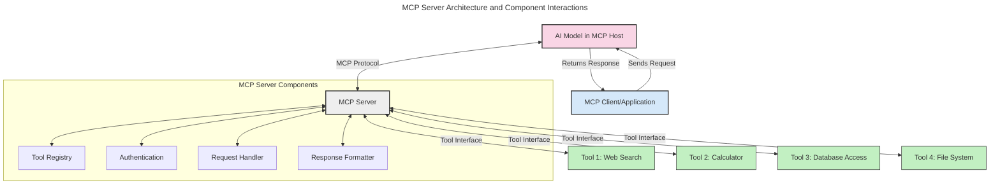
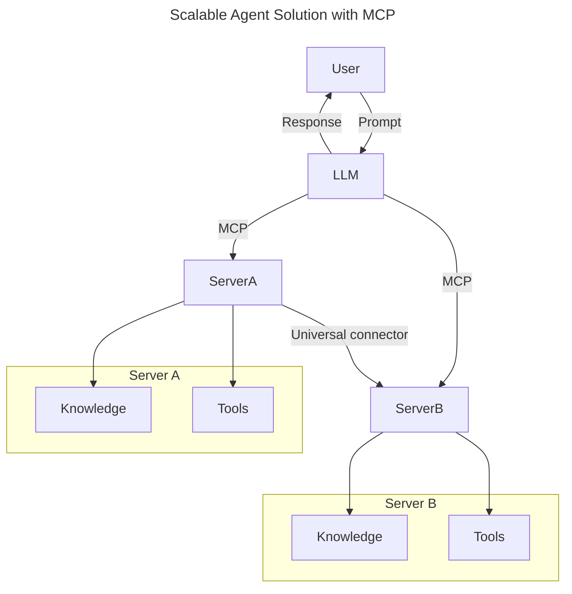
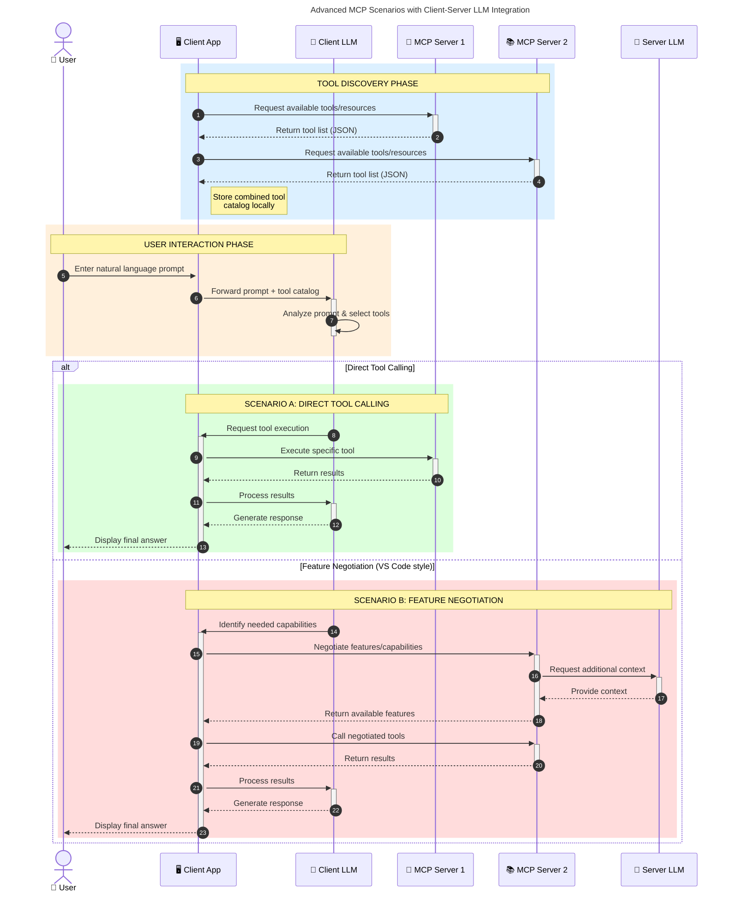

<!--
CO_OP_TRANSLATOR_METADATA:
{
  "original_hash": "1446979020432f512c883848d7eca144",
  "translation_date": "2025-05-29T21:42:58+00:00",
  "source_file": "00-Introduction/README.md",
  "language_code": "hk"
}
-->
# Introduction to Model Context Protocol (MCP): 點解對可擴展嘅 AI 應用咁重要

生成式 AI 應用係一大進步，因為用戶通常可以用自然語言提示同應用互動。不過，隨住投入嘅時間同資源越嚟越多，你要確保可以輕鬆整合功能同資源，方便擴展，令應用可以支援多個模型同處理各種模型細節。簡單嚟講，建立生成式 AI 應用起步容易，但隨住規模增大同複雜度提升，你就要開始定義架構，可能需要依賴標準去確保應用建得一致。呢個就係 MCP 出場嘅地方，幫你組織同提供標準。

---

## **🔍 乜嘢係 Model Context Protocol (MCP)?**

**Model Context Protocol (MCP)** 係一個**開放同標準化嘅介面**，令大型語言模型（LLMs）可以無縫連接外部工具、API 同數據來源。佢提供一致嘅架構，令 AI 模型功能超越訓練數據，打造更智能、可擴展同反應快嘅 AI 系統。

---

## **🎯 點解 AI 標準化咁重要**

隨住生成式 AI 應用愈嚟愈複雜，採用標準去確保**可擴展性、可延伸性**同**可維護性**變得必須。MCP 解決咗以下問題：

- 統一模型同工具嘅整合
- 減少脆弱嘅一次性自訂方案
- 令多個模型可以喺同一生態系統共存

---

## **📚 學習目標**

睇完呢篇文章，你會識：

- 定義 **Model Context Protocol (MCP)** 同佢嘅應用場景
- 理解 MCP 點樣標準化模型同工具嘅溝通
- 識別 MCP 架構嘅核心組件
- 探索 MCP 喺企業同開發場景嘅實際應用

---

## **💡 點解 Model Context Protocol (MCP) 係改變遊戲規則嘅技術**

### **🔗 MCP 解決 AI 互動嘅碎片化問題**

喺 MCP 出現之前，模型同工具嘅整合需要：

- 每對工具同模型寫自訂代碼
- 每個供應商用唔同嘅非標準 API
- 經常因更新而中斷
- 工具越多，擴展性越差

### **✅ MCP 標準化嘅好處**

| **好處**                | **描述**                                                                   |
|-------------------------|----------------------------------------------------------------------------|
| 互通性                  | LLM 可以無縫同不同供應商嘅工具合作                                         |
| 一致性                  | 平台同工具行為統一                                                         |
| 可重用性                | 工具建好一次，可以喺多個項目同系統用                                     |
| 加快開發                | 用標準化、即插即用介面減少開發時間                                       |

---

## **🧱 MCP 高層架構概覽**

MCP 採用**客戶端-伺服器模型**，當中：

- **MCP Hosts** 運行 AI 模型
- **MCP Clients** 發起請求
- **MCP Servers** 提供上下文、工具同功能

### **主要組件：**

- **Resources** – 靜態或動態嘅模型數據  
- **Prompts** – 預設工作流程指引生成  
- **Tools** – 可執行功能，如搜尋、計算  
- **Sampling** – 透過遞迴互動實現代理行為

---

## MCP 伺服器點運作

MCP 伺服器嘅運作流程：

- **請求流程**：
    1. MCP Client 向運行喺 MCP Host 嘅 AI 模型發送請求。
    2. AI 模型判斷需要外部工具或數據。
    3. 模型用標準協議同 MCP Server 通訊。

- **MCP Server 功能**：
    - 工具登記：維護可用工具同功能目錄。
    - 認證：驗證工具訪問權限。
    - 請求處理：處理模型發出嘅工具請求。
    - 回應格式化：將工具輸出整理成模型可理解嘅格式。

- **工具執行**：
    - 伺服器將請求轉發到相應嘅外部工具
    - 工具執行專門功能（搜尋、計算、資料庫查詢等）
    - 結果以一致格式回傳模型

- **回應完成**：
    - AI 模型將工具輸出整合入回應
    - 最終回應發返俾客戶端應用

## 👨‍💻 點樣建立 MCP 伺服器（附範例）

MCP 伺服器令你可以透過提供數據同功能擴展 LLM 能力。

準備試吓？以下係唔同語言建立簡單 MCP 伺服器嘅範例：

- **Python 範例**：https://github.com/modelcontextprotocol/python-sdk

- **TypeScript 範例**：https://github.com/modelcontextprotocol/typescript-sdk

- **Java 範例**：https://github.com/modelcontextprotocol/java-sdk

- **C#/.NET 範例**：https://github.com/modelcontextprotocol/csharp-sdk

## 🌍 MCP 喺現實世界嘅應用場景

MCP 透過擴展 AI 能力，支持多種應用：

| **應用**                    | **描述**                                                                     |
|-----------------------------|------------------------------------------------------------------------------|
| 企業數據整合                | 連接 LLM 同資料庫、CRM 或內部工具                                           |
| 代理式 AI 系統              | 支援自主代理接入工具同決策流程                                               |
| 多模態應用                  | 喺單一統一 AI 應用中結合文字、圖像同音頻工具                               |
| 實時數據整合                | 將即時數據帶入 AI 互動，提升準確同時效性                                   |

### 🧠 MCP = AI 互動嘅通用標準

Model Context Protocol (MCP) 就好似 USB-C 標準化實體裝置嘅連接一樣，係 AI 互動嘅通用標準。喺 AI 世界，MCP 提供一個一致嘅介面，令模型（客戶端）可以無縫整合外部工具同數據供應商（伺服器）。咁樣就唔使為每個 API 或數據源寫唔同嘅自訂協議。

符合 MCP 嘅工具（即 MCP 伺服器）遵守統一標準，能列出提供嘅工具或操作，並喺 AI 代理請求時執行。支援 MCP 嘅 AI 代理平台可以發現伺服器上可用嘅工具，並透過呢個標準協議調用佢哋。

### 💡 方便知識存取

除咗提供工具，MCP 仲方便存取知識。佢令應用可以透過連結多個數據來源，為大型語言模型（LLMs）提供上下文。例如，一個 MCP 伺服器可以係公司嘅文件庫，令代理隨時調取相關資料。另一個伺服器可能處理特定操作，如發送電郵或更新紀錄。喺代理角度，呢啲都係佢可以用嘅工具——有啲工具返數據（知識上下文），有啲執行操作。MCP 有效管理兩者。

代理連接 MCP 伺服器時，會自動透過標準格式識別伺服器可用功能同可訪問數據。呢種標準化令工具可用性具動態性。例如新增一個 MCP 伺服器，代理即刻可以用佢嘅功能，唔使再修改代理指令。

呢種簡化整合同下方 mermaid 圖示嘅流程相符，伺服器同時提供工具同知識，確保系統之間無縫協作。

### 👉 範例：可擴展嘅代理解決方案

### 🔄 進階 MCP 場景：客戶端 LLM 整合

除咗基本 MCP 架構，仲有啲進階場景，客戶端同伺服器雙方都有 LLM，實現更複雜嘅互動：

## 🔐 MCP 嘅實際好處

使用 MCP 嘅實際好處包括：

- **資訊新鮮度**：模型可以存取超越訓練數據嘅最新資料
- **功能擴展**：模型可以利用專門工具完成未訓練過嘅任務
- **減少幻覺**：外部數據源提供事實依據
- **私隱保障**：敏感數據可以留喺安全環境，唔使嵌入提示中

## 📌 主要重點

以下係使用 MCP 嘅主要重點：

- **MCP** 標準化 AI 模型同工具同數據嘅互動方式
- 推動**可擴展性、一致性同互通性**
- MCP 幫助**減少開發時間、提升可靠性、擴展模型能力**
- 客戶端-伺服器架構支持靈活、可擴展嘅 AI 應用

## 🧠 練習

諗下你有興趣建立嘅 AI 應用。

- 有咩**外部工具或數據**可以提升佢嘅能力？
- MCP 會點樣令整合變得**簡單同可靠**？

## 附加資源

- [MCP GitHub Repository](https://github.com/modelcontextprotocol)

## 下一步

下一篇：[Chapter 1: Core Concepts](/01-CoreConcepts/README.md)

**免責聲明**：  
本文件係使用 AI 翻譯服務 [Co-op Translator](https://github.com/Azure/co-op-translator) 進行翻譯。雖然我哋致力確保準確性，但請注意自動翻譯可能包含錯誤或不準確之處。原始文件嘅母語版本應視為權威來源。對於重要資訊，建議使用專業人工翻譯。我哋對因使用此翻譯而引致嘅任何誤解或誤釋概不負責。